# 云原生全栈深度解析：AWS × Azure × 阿里云

> **三云对比 · 平台工程 · GitOps · AI 驱动运维**，2025-2026 最新实践。
>
> 适合读者：架构师、平台工程师、DevOps/SRE、技术决策者。

---

## 目录

### 第一部分：云原生全景
- [1. 云原生成熟度概览](#1-云原生成熟度概览)
- [2. 三云服务全景对比矩阵](#2-三云服务全景对比矩阵)
- [3. 决策框架：选云 vs 选服务](#3-决策框架选云-vs-选服务)

### 第二部分：AWS 云原生技术栈
- [4. AWS 计算：ECS vs EKS vs Lambda vs Fargate](#4-aws-计算ecs-vs-eks-vs-lambda-vs-fargate)
- [5. AWS 服务网格与流量管理](#5-aws-服务网格与流量管理)
- [6. AWS 可观测性体系](#6-aws-可观测性体系)
- [7. AWS 安全与合规](#7-aws-安全与合规)

### 第三部分：Azure 云原生技术栈
- [8. Azure 计算：AKS vs ACA vs Functions](#8-azure-计算aks-vs-aca-vs-functions)
- [9. Azure GitOps 深度集成](#9-azure-gitops-深度集成)
- [10. ACA 深度解析：Dapr + KEDA 原生集成](#10-aca-深度解析dapr--keda-原生集成)
- [11. Azure 可观测性与安全](#11-azure-可观测性与安全)

### 第四部分：阿里云云原生技术栈
- [12. 阿里云计算：ACK vs ASK vs SAE vs FC](#12-阿里云计算ack-vs-ask-vs-sae-vs-fc)
- [13. 阿里云微服务引擎 MSE](#13-阿里云微服务引擎-mse)
- [14. 阿里云可观测性 ARMS/SLS](#14-阿里云可观测性-armssls)
- [15. 阿里云特色：合规与国内生态](#15-阿里云特色合规与国内生态)

### 第五部分：平台工程
- [16. 平台工程核心理念](#16-平台工程核心理念)
- [17. IDP 参考架构](#17-idp-参考架构)
- [18. 工具选型：Backstage vs Port vs 自研](#18-工具选型backstage-vs-port-vs-自研)
- [19. 三云平台工程实践](#19-三云平台工程实践)

### 第六部分：GitOps
- [20. GitOps 核心原则](#20-gitops-核心原则)
- [21. ArgoCD vs Flux CD 深度对比](#21-argocd-vs-flux-cd-深度对比)
- [22. 多集群 GitOps 架构](#22-多集群-gitops-架构)
- [23. 三云 GitOps 实践](#23-三云-gitops-实践)

### 第七部分：渐进式交付
- [24. 渐进式交付：Argo Rollouts](#24-渐进式交付argo-rollouts)

### 第八部分：AI 驱动运维
- [25. AIOps 核心能力与成熟度](#25-aiops-核心能力与成熟度)
- [26. AWS DevOps Agent 深度解析](#26-aws-devops-agent-深度解析)
- [27. LLM + K8s：K8sGPT 实践](#27-llm--k8sk8sgpt-实践)
- [28. 三云 AIOps 方案对比](#28-三云-aiops-方案对比)

### 第九部分：最佳实践
- [29. 云原生选型决策树](#29-云原生选型决策树)
- [30. FinOps 成本优化](#30-finops-成本优化)
- [31. 安全左移与供应链安全](#31-安全左移与供应链安全)

### 第十部分：跨云对比扩展
- [32. 跨云数据库对比](#32-跨云数据库对比)
- [33. 跨云消息队列对比](#33-跨云消息队列对比)
- [34. 跨区域灾备模式](#34-跨区域灾备模式)

### 第十一部分：速查与思考
- [35. 每章速查卡片](#35-每章速查卡片)
- [36. 互动思考题](#36-互动思考题)
- [37. 思考题参考答案](#37-思考题参考答案)

---

## 1. 云原生成熟度概览

### 1.1 行业数据（CNCF 2025 年度调查）

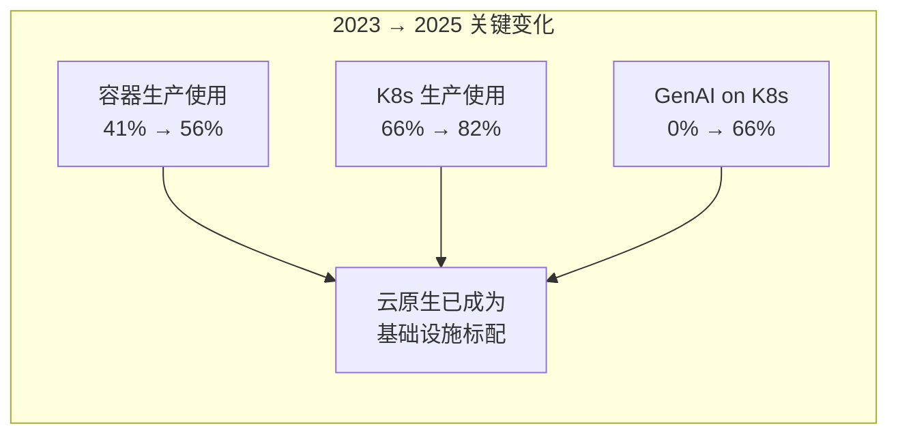
```mermaid
graph LR
    subgraph "2023 → 2025 关键变化"
        A["容器生产使用<br/>41% → 56%"] --> D["云原生已成为<br/>基础设施标配"]
        B["K8s 生产使用<br/>66% → 82%"] --> D
        C["GenAI on K8s<br/>0% → 66%"] --> D
    end
```

| 指标 | 2023 | 2025 | 趋势 |
|------|------|------|------|
| 组织采用云原生 | — | **98%** | 几近普及 |
| K8s 生产环境使用率 | 66% | **82%** | ↑ 已成默认 |
| "大部分/全部"开发已云原生化 | 54% | **59%** | 稳定增长 |
| GenAI 负载跑在 K8s 上 | — | **66%** | 新增长引擎 |
| GitOps 在成熟组织中 | — | **58%** | 成熟标志 |
| **最大挑战**（首次） | 技术复杂度 | **文化变革 47%** | 瓶颈已转移 |

> **关键结论**：Kubernetes 被称为 "boring"（无聊）——在基础设施领域，这是最高赞誉。意味着可靠、可预测、边界情况已被发现。

### 1.2 云原生技术栈分层

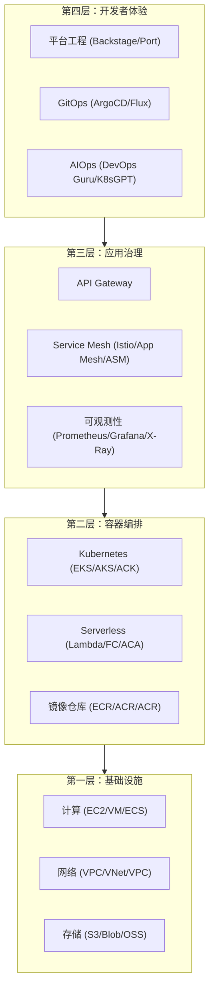
```mermaid
flowchart TB
    subgraph Layer4["第四层：开发者体验"]
        PE["平台工程 (Backstage/Port)"]
        GitOps["GitOps (ArgoCD/Flux)"]
        AIOps["AIOps (DevOps Guru/K8sGPT)"]
    end
    
    subgraph Layer3["第三层：应用治理"]
        Gateway["API Gateway"]
        Mesh["Service Mesh (Istio/App Mesh/ASM)"]
        Obs["可观测性 (Prometheus/Grafana/X-Ray)"]
    end
    
    subgraph Layer2["第二层：容器编排"]
        K8s["Kubernetes (EKS/AKS/ACK)"]
        Serverless["Serverless (Lambda/FC/ACA)"]
        Registry["镜像仓库 (ECR/ACR/ACR)"]
    end
    
    subgraph Layer1["第一层：基础设施"]
        Compute["计算 (EC2/VM/ECS)"]
        Network["网络 (VPC/VNet/VPC)"]
        Storage["存储 (S3/Blob/OSS)"]
    end

    Layer4 --> Layer3 --> Layer2 --> Layer1
```

---

## 2. 三云服务全景对比矩阵

### 2.1 核心服务映射表

| 能力域 | AWS | Azure | 阿里云 | 说明 |
|--------|-----|-------|--------|------|
| **K8s 托管** | EKS | AKS | ACK | 三大云均提供 CNCF 认证 K8s |
| **Serverless K8s** | EKS Fargate | AKS Automatic | ASK | 无需管理节点 |
| **自有容器编排** | ECS | — | — | AWS 独有，最简单容器路径 |
| **Serverless 容器** | App Runner | ACA (Container Apps) | SAE | 面向应用的托管平台 |
| **函数计算** | Lambda | Functions | FC | 事件驱动，毫秒计费 |
| **服务网格** | App Mesh | Istio add-on / OSM | ASM (托管 Istio) | 流量治理 |
| **API 网关** | API Gateway | API Management | API Gateway / MSE Gateway | 统一入口 |
| **镜像仓库** | ECR | ACR | ACR | 容器镜像存储 |
| **可观测性** | CloudWatch + X-Ray + AMP | Monitor + App Insights + Managed Grafana | ARMS + SLS + CloudMonitor | 监控/日志/追踪 |
| **CI/CD** | CodePipeline + CodeBuild | Azure DevOps / GitHub Actions | 云效 DevOps | 持续交付 |
| **GitOps 原生** | — | Flux extension (内置) | ACK One GitOps (ArgoCD) | Azure 集成最深 |
| **配置管理** | SSM Parameter Store / AppConfig | App Configuration | ACM (Nacos) | 动态配置 |
| **密钥管理** | Secrets Manager / KMS | Key Vault | KMS | 敏感信息 |
| **服务发现** | Cloud Map / Route 53 | CoreDNS / Private Link | MSE Nacos / CoreDNS | 注册发现 |
| **安全** | IAM + IRSA + WAF | AD Workload Identity + Defender + WAF | RAM + RRSA + Security Center | 身份与访问 |
| **成本管理** | Cost Explorer + Compute Optimizer | Cost Management + Advisor | 成本管家 | FinOps |

### 2.2 快速选云指南

| 如果你需要... | 首选 | 原因 |
|---|---|---|
| 全球最大生态、最多工具 | **AWS** | 200+ 服务，社区最大 |
| 微软全家桶 + GitHub 深度集成 | **Azure** | AD/Office 365 集成，GitHub Actions 原生 |
| 中国大陆合规部署 | **阿里云** | 唯一合规选项，国内延迟最低 |
| 最简单容器体验（不用 K8s） | **AWS ECS Fargate** | 无控制面费用，零节点管理 |
| Serverless 容器优先 | **Azure ACA** | KEDA + Dapr 原生集成 |
| Spring Cloud 微服务上云 | **阿里云 SAE** | Nacos/Sentinel 原生托管 |
| 多语言团队 + 平台工程 | 任一 K8s 方案 | K8s 是通用标准 |
| GenAI 训练/推理 | **AWS** 或 **Azure** | GPU 实例最丰富 |

---

## 3. 决策框架：选云 vs 选服务

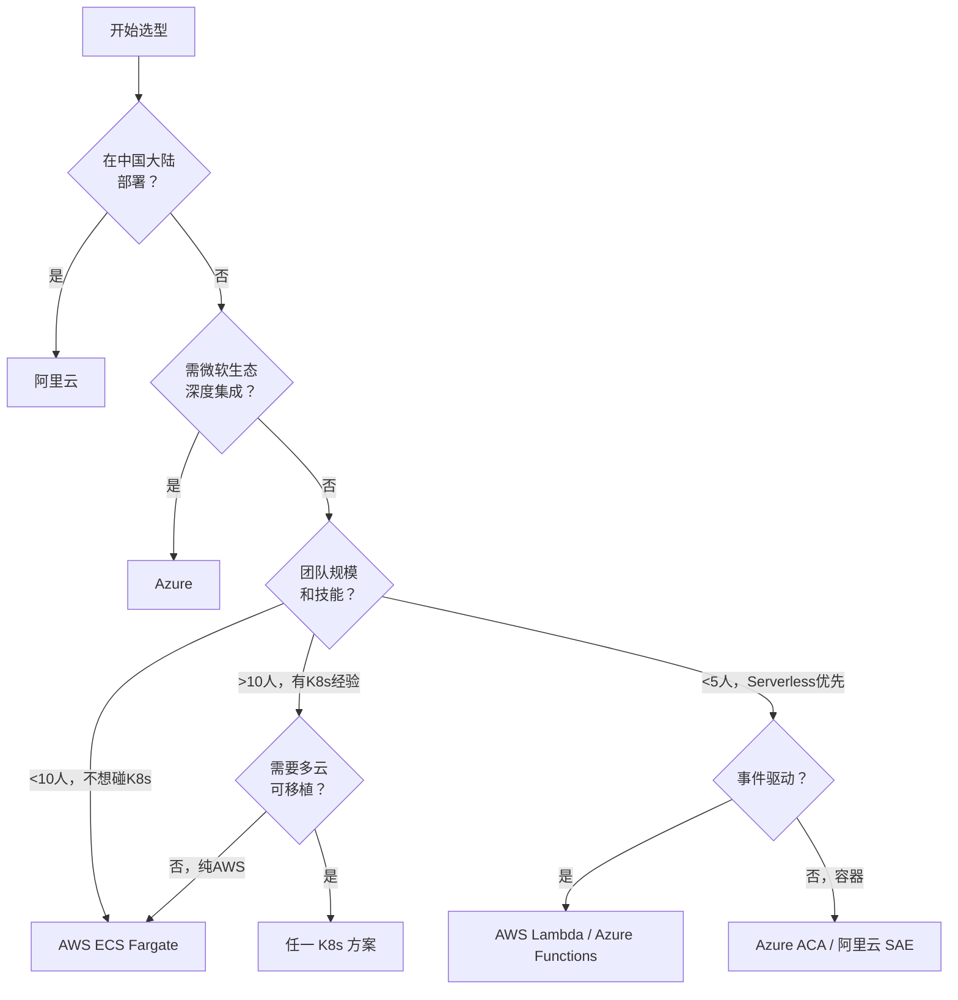
```mermaid
flowchart TD
    Start["开始选型"] --> Q1{"在中国大陆<br/>部署？"}
    Q1 -->|"是"| Ali["阿里云"]
    Q1 -->|"否"| Q2{"需微软生态<br/>深度集成？"}
    Q2 -->|"是"| Azure["Azure"]
    Q2 -->|"否"| Q3{"团队规模<br/>和技能？"}
    Q3 -->|"<10人，不想碰K8s"| ECS["AWS ECS Fargate"]
    Q3 -->|">10人，有K8s经验"| Q4{"需要多云<br/>可移植？"}
    Q4 -->|"是"| EKS["任一 K8s 方案"]
    Q4 -->|"否，纯AWS"| ECS
    Q3 -->|"<5人，Serverless优先"| Q5{"事件驱动？"}
    Q5 -->|"是"| Lambda["AWS Lambda / Azure Functions"]
    Q5 -->|"否，容器"| ACA["Azure ACA / 阿里云 SAE"]
```

---

## 第二部分：AWS 云原生技术栈

## 4. AWS 计算：ECS vs EKS vs Lambda vs Fargate

### 4.1 核心概念澄清

**最容易混淆的点**：ECS 和 EKS 是编排平台，Fargate 是计算引擎（可搭配两者）。

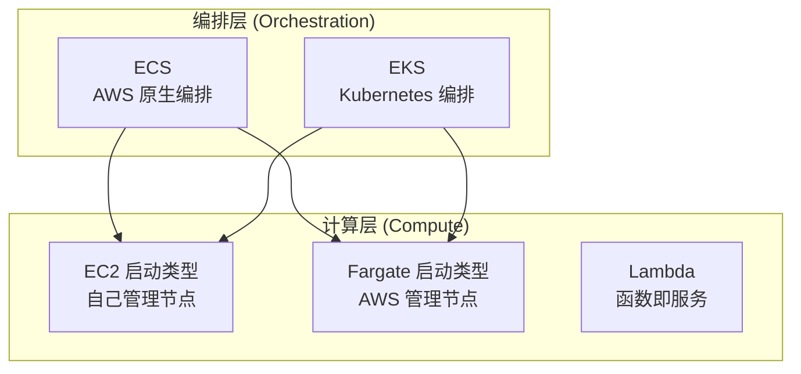
```mermaid
graph TB
    subgraph "编排层 (Orchestration)"
        ECS["ECS<br/>AWS 原生编排"]
        EKS["EKS<br/>Kubernetes 编排"]
    end
    
    subgraph "计算层 (Compute)"
        EC2["EC2 启动类型<br/>自己管理节点"]
        Fargate["Fargate 启动类型<br/>AWS 管理节点"]
        Lambda_Fn["Lambda<br/>函数即服务"]
    end
    
    ECS --> EC2
    ECS --> Fargate
    EKS --> EC2
    EKS --> Fargate
```

### 4.2 四维对比

| 维度 | ECS Fargate | ECS EC2 | EKS Fargate | EKS EC2 | Lambda |
|------|-------------|---------|-------------|---------|--------|
| **控制面费用** | 免费 | 免费 | $73/月 | $73/月 | 免费 |
| **节点管理** | 零 | 自己管 | 零 | 自己管 | 零 |
| **K8s 生态** | ❌ | ❌ | ✅ | ✅ | ❌ |
| **多语言** | ✅ 容器 | ✅ | ✅ | ✅ | ✅ |
| **最长运行** | 无限 | 无限 | 无限 | 无限 | 15分钟 |
| **冷启动** | 30-90s | 30-90s | 30-90s | 30-90s | ms级 |
| **成本效率** | 中 | 高（Spot+SP） | 中低 | 中（需优化） | 按需最优 |
| **运维复杂度** | **最低** | 中 | 中 | **最高** | 低 |
| **学习曲线** | 低 | 中 | 高 | 高 | 低 |

### 4.3 选型决策树

```
Lambda 合适吗？
├─ 事件驱动 + < 15min + 低流量尖刺 → Lambda ✅
└─ 否 → ECS Fargate 合适吗？
    ├─ 不需要 Helm/CRD/Operator/K8s 生态 → ECS Fargate ✅（最简单容器路径）
    └─ 否 → EKS
        ├─ 不想管节点 → EKS Fargate
        └─ 需要 GPU/特定实例/成本优化 → EKS EC2 + Karpenter
```

### 4.4 EKS 最佳实践速查

| 实践 | 细节 |
|------|------|
| **CNI** | VPC CNI，按需开启 Prefix Delegation 增加 Pod 密度 |
| **自动扩缩** | Karpenter > Cluster Autoscaler，响应更快，支持 Spot |
| **节点组** | 使用 Managed Node Groups 或 Karpenter 管理 |
| **IRSA** | 为每个 ServiceAccount 绑定最小权限 IAM Role |
| **日志** | Fluent Bit → CloudWatch Logs，或 Loki + Grafana |
| **可观测性** | AWS Managed Prometheus (AMP) + Managed Grafana |
| **网络策略** | Calico 或 AWS Network Policy Controller |
| **成本优化** | Karpenter + Spot (70% off) + Graviton ARM |
| **安全** | EKS Pod Identity / IRSA + Secrets Store CSI + Image Scanning |

### 4.5 ECS vs EKS 成本对照（真实数据）

```
场景：3 个微服务，每个 2 vCPU + 4GB，24x7 运行

ECS Fargate:    ~$480/月（零控制面 + Fargate 计费）
EKS Fargate:    ~$553/月（$73 控制面 + Fargate 计费）
EKS EC2+Spot:   ~$350/月（$73 控制面 + Spot EC2 节点）
ECS EC2+Spot:   ~$280/月（零控制面 + Spot EC2 节点）

结论：纯 AWS 不需要 K8s → ECS EC2+Spot 性价比最高
```

---

## 5. AWS 服务网格与流量管理

### 5.1 流量管理全景

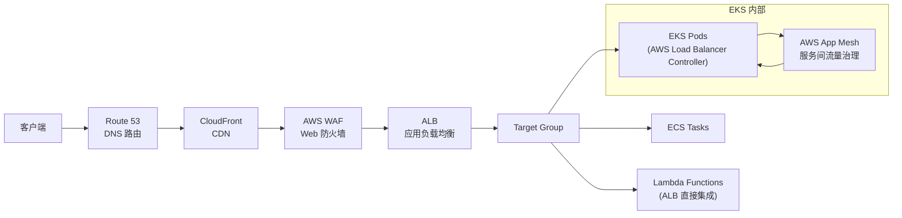
```mermaid
flowchart LR
    Client["客户端"] --> Route53["Route 53<br/>DNS 路由"]
    Route53 --> CF["CloudFront<br/>CDN"]
    CF --> WAF["AWS WAF<br/>Web 防火墙"]
    WAF --> ALB["ALB<br/>应用负载均衡"]
    ALB --> TG["Target Group"]
    TG --> ECS["ECS Tasks"]
    TG --> EKS_Pods["EKS Pods<br/>(AWS Load Balancer Controller)"]
    TG --> Lambda_Fn["Lambda Functions<br/>(ALB 直接集成)"]
    
    subgraph "EKS 内部"
        AppMesh["AWS App Mesh<br/>服务间流量治理"]
        EKS_Pods --> AppMesh
        AppMesh --> EKS_Pods
    end
```

### 5.2 App Mesh vs 原生方案

| 能力 | AWS App Mesh | EKS 原生 Ingress | Istio on EKS |
|------|-------------|------------------|--------------|
| 流量路由 | ✅ 细粒度 | ⚠️ 粗粒度 | ✅ |
| 熔断/重试 | ✅ | ❌ | ✅ |
| 可观测性 | ✅ X-Ray 集成 | ⚠️ 需额外配置 | ✅ |
| 运维复杂度 | 中 | **低** | **高** |
| 多集群 | ✅ | ❌ | ✅ |
| 适用场景 | 需要精细流量治理 | 简单 HTTP 路由 | 全功能服务网格 |

> **实践建议**：大多数场景用 ALB Ingress Controller 足够。需要熔断/重试/金丝雀时上 App Mesh。只有多集群 + 多协议 + 安全策略时才值得 Istio 的复杂度。

---

## 6. AWS 可观测性体系

### 6.1 三层可观测性

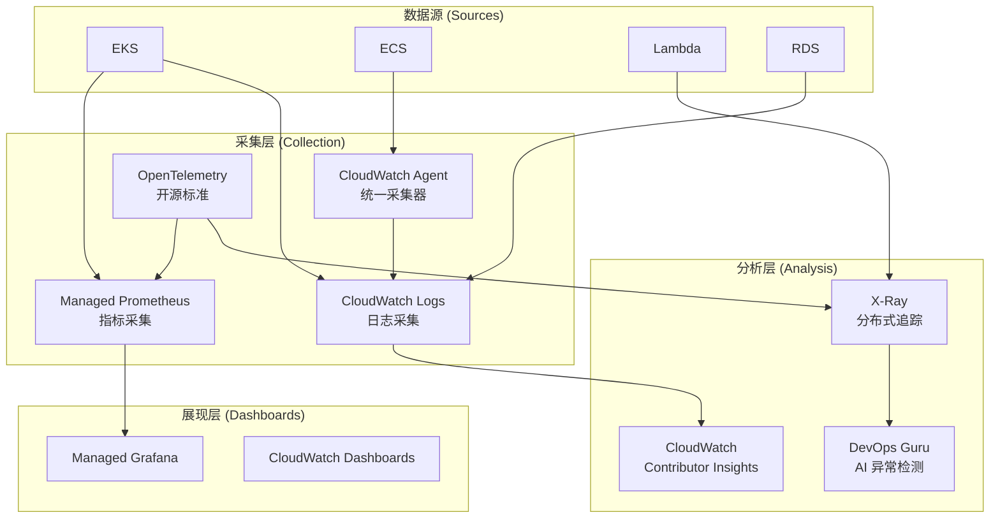
```mermaid
graph TB
    subgraph "展现层 (Dashboards)"
        Grafana["Managed Grafana"]
        CW_Dash["CloudWatch Dashboards"]
    end
    
    subgraph "分析层 (Analysis)"
        XRay["X-Ray<br/>分布式追踪"]
        DevOps_Guru["DevOps Guru<br/>AI 异常检测"]
        CW_Insights["CloudWatch<br/>Contributor Insights"]
    end
    
    subgraph "采集层 (Collection)"
        AMP["Managed Prometheus<br/>指标采集"]
        CW_Logs["CloudWatch Logs<br/>日志采集"]
        CW_Agent["CloudWatch Agent<br/>统一采集器"]
        OTEL["OpenTelemetry<br/>开源标准"]
    end
    
    subgraph "数据源 (Sources)"
        EKS["EKS"]
        ECS["ECS"]
        Lambda_Fn["Lambda"]
        RDS["RDS"]
    end

    EKS --> AMP
    EKS --> CW_Logs
    ECS --> CW_Agent
    Lambda_Fn --> XRay
    RDS --> CW_Logs
    
    AMP --> Grafana
    CW_Logs --> CW_Insights
    XRay --> DevOps_Guru
    CW_Agent --> CW_Logs
    OTEL --> AMP
    OTEL --> XRay
```

### 6.2 可观测性方案对比

| 方案 | 成本 | 运维复杂度 | 适用场景 |
|------|------|-----------|----------|
| **纯 CloudWatch + X-Ray** | 中 | 低（托管） | AWS 原生，中小规模 |
| **AMP + Managed Grafana** | 中高 | 低 | 需要 Prometheus 兼容 |
| **自建 Prometheus + Grafana** | 低 | 高 | 大规模，成本敏感 |
| **Datadog / Dynatrace** | **最高** | 最低 | 多平台，需要 AI 分析 |
| **OpenTelemetry 全链路** | 低 | 中 | 厂商中立，未来标准 |

---

## 7. AWS 安全与合规

### 7.1 纵深防御模型

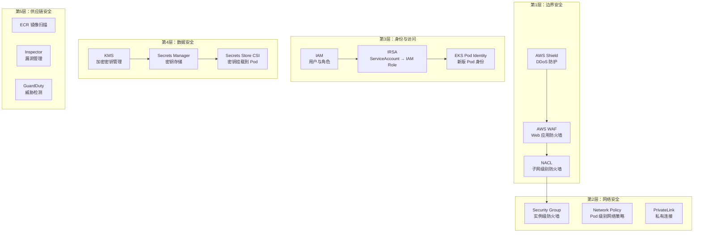
```mermaid
flowchart TB
    subgraph "第1层：边界安全"
        Shield["AWS Shield<br/>DDoS 防护"]
        WAF["AWS WAF<br/>Web 应用防火墙"]
        Nacl["NACL<br/>子网级别防火墙"]
    end
    
    subgraph "第2层：网络安全"
        SG["Security Group<br/>实例级防火墙"]
        NP["Network Policy<br/>Pod 级别网络策略"]
        PE["PrivateLink<br/>私有连接"]
    end
    
    subgraph "第3层：身份与访问"
        IAM["IAM<br/>用户与角色"]
        IRSA["IRSA<br/>ServiceAccount → IAM Role"]
        PodIdentity["EKS Pod Identity<br/>新版 Pod 身份"]
    end
    
    subgraph "第4层：数据安全"
        KMS["KMS<br/>加密密钥管理"]
        SecretsManager["Secrets Manager<br/>密钥存储"]
        SSCSI["Secrets Store CSI<br/>密钥挂载到 Pod"]
    end
    
    subgraph "第5层：供应链安全"
        ECR_Scan["ECR 镜像扫描"]
        Inspector["Inspector<br/>漏洞管理"]
        GuardDuty["GuardDuty<br/>威胁检测"]
    end

    Shield --> WAF --> Nacl --> SG
    IAM --> IRSA --> PodIdentity
    KMS --> SecretsManager --> SSCSI
```

### 7.2 IRSA vs EKS Pod Identity

| | IRSA (传统) | EKS Pod Identity (2024+) |
|---|---|---|
| **配置方式** | OIDC Provider + IAM Trust Policy | 直接关联 IAM Role |
| **复杂度** | 高（需配置 OIDC） | 低（一条命令） |
| **多账户** | 需要跨账户 Role | 原生支持 |
| **Session Tag** | 支持 | 支持 |
| **推荐** | 现有集群 | 新集群默认 |

---

## 第三部分：Azure 云原生技术栈

## 8. Azure 计算：AKS vs ACA vs Functions

### 8.1 全景对比

| 维度 | AKS | ACA (Container Apps) | Functions | ACI |
|------|-----|----------------------|-----------|-----|
| **抽象级别** | K8s API | 容器平台 | 函数 | 单容器 |
| **管理控制面** | 免费（Azure 托管） | 免费 | 免费 | 免费 |
| **K8s 生态** | ✅ 完整 | ⚠️ 受限（KEDA+Dapr） | ❌ | ❌ |
| **自动扩缩** | HPA + KEDA + CA | **KEDA 原生** | 自动 | 无 |
| **Dapr 集成** | 需安装 | **原生内置** | — | — |
| **多语言** | ✅ 容器 | ✅ 容器 | ✅ 多运行时 | ✅ 容器 |
| **适用场景** | 需要完整 K8s | 微服务简化部署 | 事件驱动 | 临时任务 |

### 8.2 Azure 独有的优势

**1. AKS + Azure Arc 混合云**

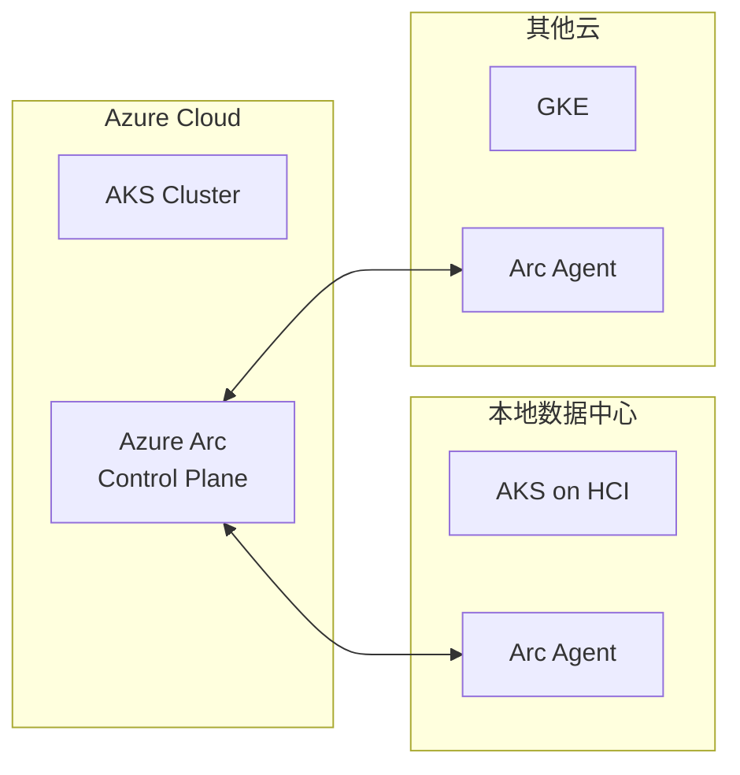
```mermaid
graph LR
    subgraph Azure["Azure Cloud"]
        AKS_Cloud["AKS Cluster"]
        Arc_CP["Azure Arc<br/>Control Plane"]
    end
    
    subgraph OnPrem["本地数据中心"]
        AKS_OnPrem["AKS on HCI"]
        Arc_Agent["Arc Agent"]
    end
    
    subgraph Other["其他云"]
        GKE["GKE"]
        Arc_Agent2["Arc Agent"]
    end
    
    Arc_CP <--> Arc_Agent
    Arc_CP <--> Arc_Agent2
```

**2. Azure AD Workload Identity**：比 AWS IRSA 配置更简单，直接使用 Azure AD 托管标识。

**3. KEDA 原生集成**：ACA 和 AKS 都原生支持 KEDA 事件驱动自动扩缩，无需额外安装。

### 8.3 AKS 最佳实践速查

| 实践 | 细节 |
|------|------|
| **CNI** | Azure CNI（VPC 原生 IP），大规模用 Overlay 模式 |
| **自动扩缩** | KEDA + Cluster Autoscaler，或 Karpenter（预览） |
| **身份** | Workload Identity（优于 Pod Identity） |
| **GitOps** | Flux extension（内置，一条 CLI 启用） |
| **安全** | Defender for Containers + Azure Policy for AKS |
| **网络策略** | Calico 或 Azure Network Policy Manager |
| **成本** | Spot VM + Reserved Instances + AKS Cost Analysis |

---

## 9. Azure GitOps 深度集成

### 9.1 Azure 是 GitOps 集成最深的云

Azure 是唯一将 GitOps（Flux v2）作为 **AKS 集群扩展** 原生内置的云厂商：

```
# 一行命令启用 Flux GitOps 到 AKS
az k8s-configuration flux create \
  --resource-group my-rg \
  --cluster-name my-aks \
  --name cluster-config \
  --namespace flux-system \
  --url https://github.com/my-org/my-repo \
  --branch main
```

### 9.2 AKS + ArgoCD 平台工程参考架构

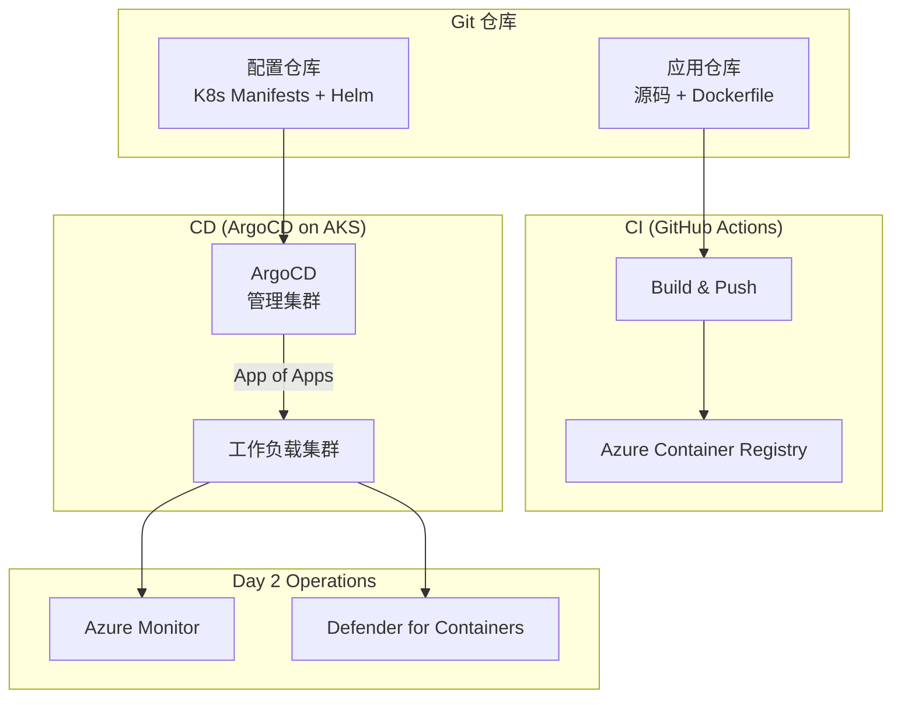
```mermaid
graph TB
    subgraph "Git 仓库"
        AppRepo["应用仓库<br/>源码 + Dockerfile"]
        ConfigRepo["配置仓库<br/>K8s Manifests + Helm"]
    end
    
    subgraph "CI (GitHub Actions)"
        Build["Build & Push"]
        Build --> ACR["Azure Container Registry"]
    end
    
    subgraph "CD (ArgoCD on AKS)"
        ArgoCD["ArgoCD<br/>管理集群"]
        ArgoCD -->|"App of Apps"| Workload["工作负载集群"]
    end
    
    subgraph "Day 2 Operations"
        Monitor["Azure Monitor"]
        Defender["Defender for Containers"]
    end

    AppRepo --> Build
    ConfigRepo --> ArgoCD
    Workload --> Monitor
    Workload --> Defender
```

### 9.3 Azure 平台工程方案

| 方案 | 适用场景 | 核心组件 |
|------|---------|---------|
| **AKS + Flux** | 简单 GitOps | Flux extension |
| **AKS + ArgoCD** | 复杂 GitOps，多集群 | ArgoCD + App of Apps |
| **平台工程参考实现** | 企业级 | Backstage + CAPZ/Crossplane + ArgoCD |
| **Azure Deployment Environments** | 开发者自助环境 | Azure 托管 |

---

## 10. ACA 深度解析：Dapr + KEDA 原生集成

Azure Container Apps（ACA）是 Azure 的 Serverless 容器平台，底层是 K8s + KEDA + Dapr + Envoy，但开发者完全不用碰这些：

> **你只看到容器，Azure 管所有 K8s 细节。**

### 10.1 ACA vs AKS 选型

| 场景 | 选 ACA | 选 AKS |
|------|--------|--------|
| 快速部署微服务 | ✅ | 需要更多配置 |
| 事件驱动弹性 | ✅ KEDA 原生 | ✅ 需安装 |
| Dapr 微服务 | ✅ 原生内置 | ❌ 需自己安装 |
| Helm/Operator/CRD | ❌ 不支持 | ✅ |
| 多集群管理 | ❌ 不支持 | ✅ |
| GPU 推理 | ✅ 支持 | ✅ |
| 自定 CNI/网络策略 | ❌ 不支持 | ✅ |

### 10.2 Dapr 原生集成 — 一键启用

ACA 是唯一将 **Dapr（Distributed Application Runtime）** 作为托管服务的云平台：

```yaml
# ACA + Dapr: 只需在配置中声明
properties:
  configuration:
    dapr:
      enabled: true           # 一键启用
      appId: orders-api       # Dapr 应用标识
      appProtocol: http
      appPort: 8080

# 启用后立即可用 Dapr 全部 Building Block：
# ├── 服务调用 (Service Invocation)
# ├── 发布订阅 (Pub/Sub) → 对接 Service Bus / Event Hubs
# ├── 状态管理 (State Store) → 对接 Redis / Cosmos DB
# ├── 密钥管理 (Secrets) → 对接 Key Vault
# └── 输入/输出绑定 (Bindings)
```

**Dapr 的核心价值**：应用代码不需要知道底层是 Service Bus 还是 Kafka，只需调用 Dapr Sidecar。换消息队列相当于改一个 YAML，不用改一行业务代码。

### 10.3 KEDA 事件驱动弹性

ACA 的扩缩容由 **KEDA（Kubernetes Event-Driven Autoscaling）** 驱动，无需安装即可使用：

```yaml
# 基于 Service Bus 队列深度的弹性伸缩
scale:
  minReplicas: 0          # 空闲时缩到零 → 零成本
  maxReplicas: 10
  rules:
    - name: queue-scaling
      custom:
        type: azure-servicebus
        metadata:
          topicName: orders
          subscriptionName: order-processor
          messageCount: "30"     # 每30条消息启动一个新实例
```

**KEDA 支持的 Scaler（部分）**：

| 触发器 | 场景 | 配置复杂度 |
|--------|------|-----------|
| HTTP | 标准 API | 默认，零配置 |
| Azure Service Bus | 队列消费 | 一行规则 |
| Azure Event Hubs | 流处理 | 一行规则 |
| Kafka | 事件流 | 配置 Consumer Group |
| Redis | 队列/缓存 | 配置列表长度 |
| Cron | 定时任务 | 配置 cron 表达式 |
| CPU/Memory | 通用 | 一行规则 |

### 10.4 ACA 生产实践

```yaml
# 完整 ACA 应用配置示例
az containerapp create \
  --name orders-api \
  --resource-group rg-prod \
  --environment aca-env \
  --image acr.azurecr.io/orders-api:v1.2.3 \
  --target-port 8080 \
  --ingress external \
  --min-replicas 1 \
  --max-replicas 10 \
  --cpu 1.0 --memory 2.0Gi \
  --enable-dapr \
  --dapr-app-id orders-api \
  --dapr-app-protocol http \
  --scale-rule-name queue-depth \
  --scale-rule-type azure-servicebus \
  --scale-rule-metadata "topicName=orders" \
                        "subscriptionName=api" \
                        "messageCount=30" \
  --secrets "db-password=keyvaultref:https://kv-prod.vault.azure.net/secrets/db-password" \
  --secret-ref "db-password"
```

### 10.5 Key Vault CSI 密钥注入

Azure 推荐的密钥管理方式 — 密钥不落容器环境变量，直接挂载为文件：

```yaml
# SecretProviderClass: 声明从 Key Vault 加载哪些密钥
apiVersion: secrets-store.csi.x-k8s.io/v1
kind: SecretProviderClass
metadata:
  name: app-secrets
spec:
  provider: azure
  parameters:
    usePodIdentity: "false"
    useVMManagedIdentity: "true"
    userAssignedIdentityID: "client-id-of-managed-identity"
    keyvaultName: "kv-prod"
    objects: |
      array:
        - |
          objectName: db-password
          objectType: secret
        - |
          objectName: api-key
          objectType: secret
    tenantId: "tenant-id"

---
# Deployment: 挂载密钥到 Pod
apiVersion: apps/v1
kind: Deployment
spec:
  template:
    spec:
      containers:
      - name: app
        volumeMounts:
        - name: secrets
          mountPath: /mnt/secrets
          readOnly: true
      volumes:
      - name: secrets
        csi:
          driver: secrets-store.csi.k8s.io
          readOnly: true
          volumeAttributes:
            secretProviderClass: "app-secrets"
```

**三云密钥方案对比**：

| | AWS | Azure | 阿里云 |
|---|---|---|---|
| 密钥存储 | Secrets Manager | Key Vault | KMS |
| Pod 注入方式 | Secrets Store CSI | Secrets Store CSI | Secrets Store CSI |
| IAM 集成 | IRSA / Pod Identity | Workload Identity | RRSA |
| 自动轮转 | ✅ | ✅ | ✅ |
| 配置复杂度 | 中 | **低（一行 CLI）** | 中 |

---

## 11. Azure 可观测性与安全

### 11.1 可观测性栈

| 组件 | 用途 | 成本 |
|------|------|------|
| **Azure Monitor** | 统一监控平台 | 按数据量 |
| **Application Insights** | APM，代码级监控 | 按数据量 |
| **Log Analytics Workspace** | 日志聚合与查询 | 按数据量 |
| **Managed Grafana** | 可视化仪表盘 | 按用户 |
| **Managed Prometheus** | K8s 指标采集 | 免费（预览） |
| **Azure AI Insights** | AI 根因分析 | 按使用量 |

### 11.2 安全最佳实践

```
纵深防御层次：
1. Azure AD + RBAC → 身份管控
2. Workload Identity → Pod 级别权限（无需密钥）
3. Network Policy → Pod 间流量管控
4. Azure Policy for AKS → 合规策略强制执行
5. Defender for Containers → 运行时威胁检测
6. Key Vault + CSI Driver → 密钥管理
7. ACR image scanning → 镜像漏洞扫描
```

---

## 第四部分：阿里云云原生技术栈

## 12. 阿里云计算：ACK vs ASK vs SAE vs FC

### 12.1 全景对比

| 维度 | ACK 托管版 | ACK Pro | ASK | SAE | FC |
|------|-----------|---------|-----|-----|----|
| **K8s 兼容** | ✅ 标准 | ✅ 标准 | ✅ 标准 | ⚠️ 隐藏 | ❌ |
| **控制面费用** | 免费 | ~$0.09/h | 免费 | 免费 | 免费 |
| **最大卖点** | 标准 K8s | 99.95% SLA | 零节点管理 | Spring Cloud 原生 | 事件驱动 |
| **节点管理** | ECS | ECS | 零 | 零 | 零 |
| **微服务生态** | 标准 | 标准 | 标准 | **Nacos/Sentinel 内置** | — |
| **弹性速度** | 分钟级 | 分钟级 | **30s 启 500 Pod** | 秒级 | 毫秒级 |
| **适用场景** | 通用生产 | 金融级 | 批处理/弹性 | Spring/Dubbo 微服务 | 事件驱动 |

### 12.2 ACK vs ASK：什么时候不要节点

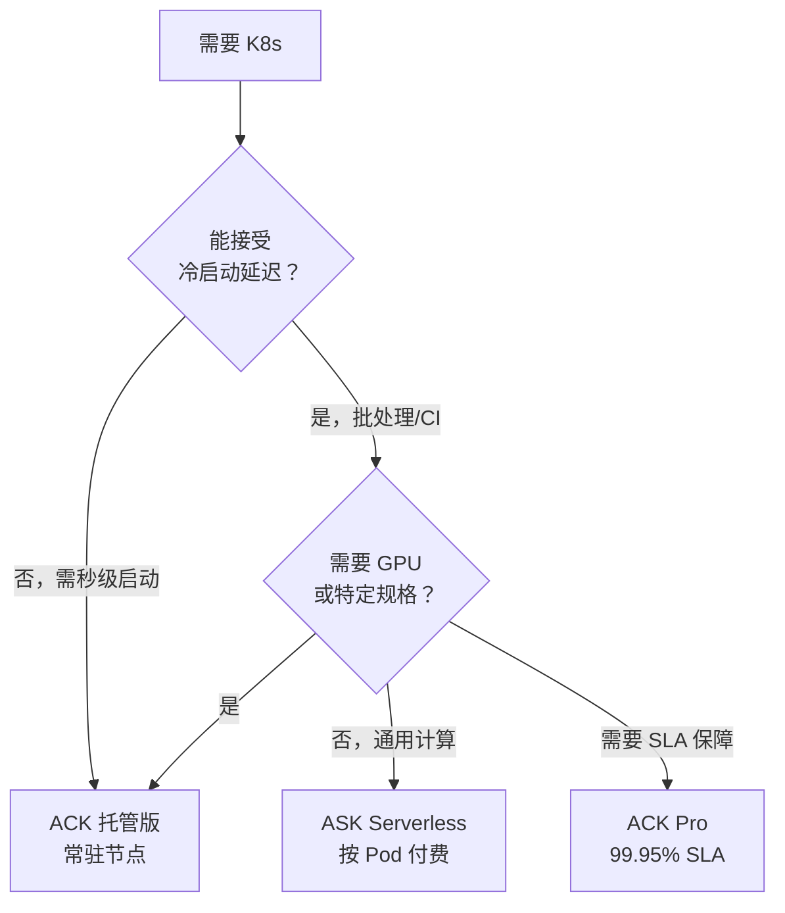
```mermaid
flowchart TD
    Start["需要 K8s"]
    Start --> Q1{"能接受<br/>冷启动延迟？"}
    Q1 -->|"否，需秒级启动"| ACK["ACK 托管版<br/>常驻节点"]
    Q1 -->|"是，批处理/CI"| Q2{"需要 GPU<br/>或特定规格？"}
    Q2 -->|"是"| ACK
    Q2 -->|"否，通用计算"| ASK["ASK Serverless<br/>按 Pod 付费"]
    Q2 -->|"需要 SLA 保障"| ACK_Pro["ACK Pro<br/>99.95% SLA"]
```

### 12.3 SAE：Spring Cloud 上云最优解

SAE（Serverless App Engine）是阿里云独有的"应用托管"产品，对标 AWS App Runner 但功能更强：

| 能力 | SAE | 自建 K8s + Spring Cloud |
|------|-----|--------------------------|
| **Nacos 注册中心** | ✅ 内置托管 | 需自己部署集群 |
| **Sentinel 限流熔断** | ✅ 内置 | 需自己部署 Dashboard |
| **配置管理** | ✅ 内置 | 需自己部署 ACM/Nacos |
| **微服务网关** | ✅ 集成 MSE Gateway | 需自己部署 |
| **弹性伸缩** | ✅ 秒级自动 | HPA，分钟级 |
| **运维负担** | **零** | 中到高 |
| **适用团队** | 中小团队 | 大团队需深度定制 |

> **结论**：如果你用 Spring Cloud Alibaba 技术栈且不需要 K8s 原生能力，SAE 是一站式最优解。

---

## 13. 阿里云微服务引擎 MSE

### 13.1 MSE 全景

MSE（Microservices Engine）是阿里云对微服务治理组件的全托管集合：

```
MSE 包含：
├── MSE Nacos（配置中心 + 注册中心）
│   ├── 完全兼容开源 Nacos
│   ├── 多可用区高可用
│   └── AP + CP 模式可切换
├── MSE Sentinel（流量治理）
│   ├── 限流/熔断/降级
│   └── 控制台托管
├── MSE Cloud Gateway
│   ├── 兼容 Spring Cloud Gateway
│   └── 托管高可用
└── MSE ZooKeeper / Eureka（兼容）
```

### 13.2 MSE vs 自建

| 维度 | MSE 托管 | 自建 |
|------|---------|------|
| 部署 | 分钟级创建 | 需规划集群 + 部署 |
| 高可用 | 多 AZ 自动 | 需自己配置 |
| 升级 | 阿里云负责 | 团队负责 |
| 监控 | ARMS 集成 | 需自己搭建 |
| 成本 | 按规格付费 | 节点成本 + 运维人力 |

---

## 14. 阿里云可观测性 ARMS/SLS

### 14.1 三件套

| 产品 | 功能 | 对标 |
|------|------|------|
| **ARMS** | APM + 前端监控 + 应用诊断 + AIOps | Datadog / Dynatrace |
| **SLS** | 日志服务（采集/存储/分析） | CloudWatch Logs + Splunk |
| **CloudMonitor** | 基础设施监控 | CloudWatch Metrics |

### 14.2 ARMS AIOps 能力

```
ARMS 智能诊断流程：
1. 告警触发 → ARMS 自动采集相关 trace/log/metric
2. 拓扑分析 → 定位故障链路节点
3. 事件关联 → 结合变更事件（部署/配置变更）缩小范围
4. 根因推荐 → 输出最可能原因 + 建议修复方案
```

---

## 15. 阿里云特色：合规与国内生态

### 15.1 为什么选阿里云

| 场景 | 原因 |
|------|------|
| **中国大陆部署** | 唯一合规的主流 K8s 云，AWS/Azure 国内版功能受限 |
| **低延迟** | 国内延迟 < 5ms（AWS 海外 > 100ms） |
| **Spring Cloud Alibaba** | Nacos + Sentinel + Dubbo 深度托管 |
| **双十一验证** | 全球最大规模 K8s 集群实战检验 |
| **数据合规** | 等保三级 + 数据不出境 |
| **中文生态** | 文档/社区/工单全中文 |

### 15.2 ACK 独有优势

| 优势 | 说明 |
|------|------|
| **Terway CNI** | VPC 原生网络，无 Overlay 性能损耗，比 Flannel 快 20% |
| **ACK 控制面免费** | vs EKS $73/月 |
| **弹性容器实例 ECI** | Pod 级别计费，30 秒内启动 500 Pod |
| **ACK One** | 多集群统一管理（类似 GKE Fleet） |
| **Sandboxed-Container** | 轻量虚拟机隔离，安全沙箱 |

---

## 第五部分：平台工程

## 16. 平台工程核心理念

### 16.1 定义

> **平台工程** = 构建和维护内部开发者平台（IDP），为开发团队提供"黄金路径"（Golden Paths），降低认知负荷，提升交付速度。

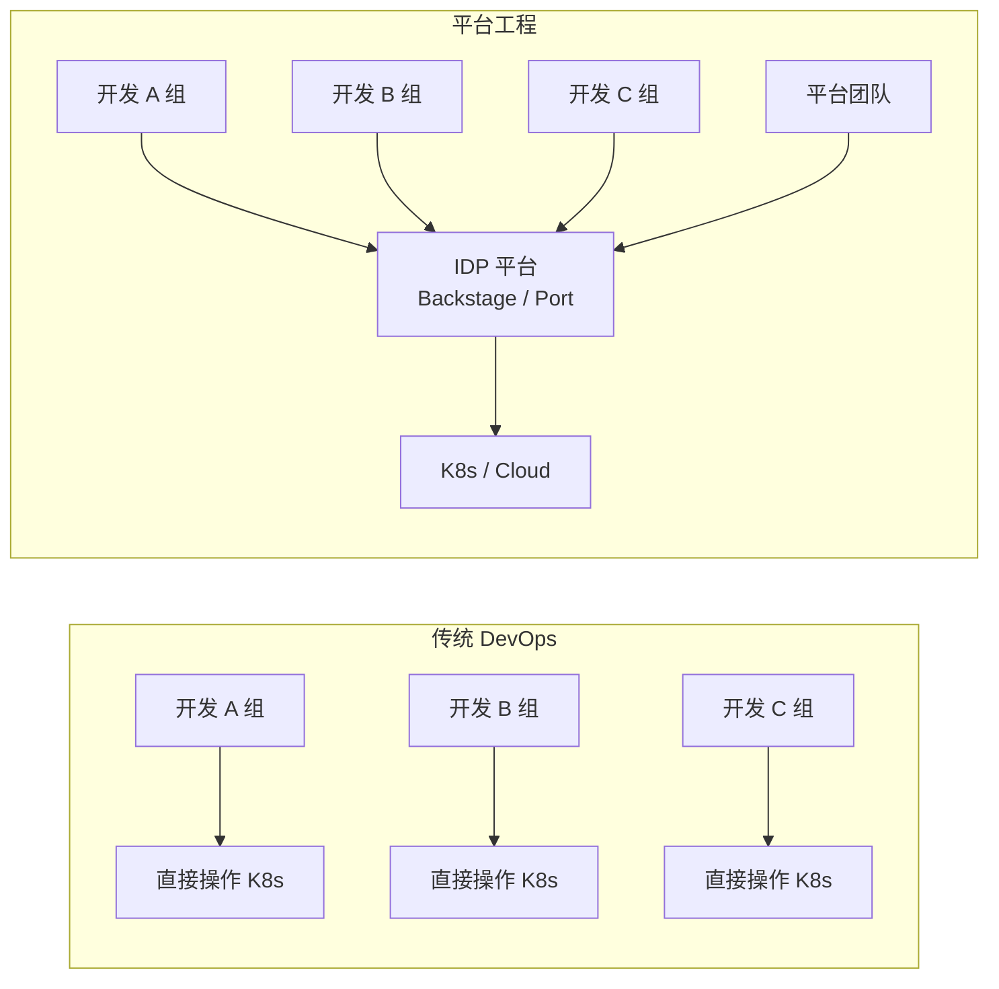
```mermaid
graph LR
    subgraph "传统 DevOps"
        Dev1["开发 A 组"] --> K8s1["直接操作 K8s"]
        Dev2["开发 B 组"] --> K8s2["直接操作 K8s"]
        Dev3["开发 C 组"] --> K8s3["直接操作 K8s"]
    end

    subgraph "平台工程"
        Dev1_p["开发 A 组"]
        Dev2_p["开发 B 组"]
        Dev3_p["开发 C 组"]
        IDP["IDP 平台<br/>Backstage / Port"]
        Platform["平台团队"]
        
        Dev1_p --> IDP
        Dev2_p --> IDP
        Dev3_p --> IDP
        Platform --> IDP
        IDP --> K8s["K8s / Cloud"]
    end
```

### 16.2 平台工程 ≠ DevOps ≠ SRE

| | DevOps | SRE | 平台工程 |
|---|---|---|---|
| **核心关注** | 文化+工具链 | 可靠性+SLI/SLO | 开发者体验+效率 |
| **交付物** | CI/CD 流程 | 错误预算、告警 | 黄金路径、IDP |
| **用户** | 运维+开发 | 全组织 | **只服务开发者** |
| **衡量指标** | 部署频率 | MTTR, 错误预算 | DORA 指标, 平台采用率 |

### 16.3 CNCF 平台工程成熟度模型

```
Explorer（探索者）→ Adopter（采纳者）→ Practitioner（实践者）→ Innovator（创新者）
    0% GitOps         42% CI/CD         组织级平台         58% GitOps
    手动部署          开始自动化         自助服务           91% CI/CD
                                                           AI 驱动运维
```

---

## 17. IDP 参考架构

### 17.1 六层架构模型

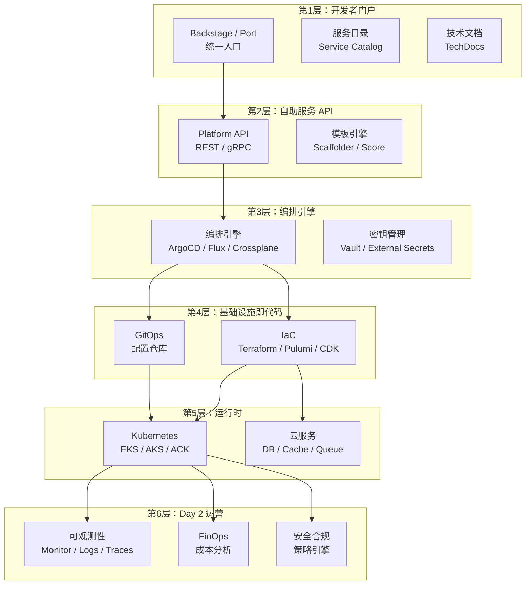
```mermaid
graph TB
    subgraph "第1层：开发者门户"
        Portal["Backstage / Port<br/>统一入口"]
        Catalog["服务目录<br/>Service Catalog"]
        Docs["技术文档<br/>TechDocs"]
    end
    
    subgraph "第2层：自助服务 API"
        API["Platform API<br/>REST / gRPC"]
        Templates["模板引擎<br/>Scaffolder / Score"]
    end
    
    subgraph "第3层：编排引擎"
        Orchestrator["编排引擎<br/>ArgoCD / Flux / Crossplane"]
        Secrets["密钥管理<br/>Vault / External Secrets"]
    end
    
    subgraph "第4层：基础设施即代码"
        IaC["IaC<br/>Terraform / Pulumi / CDK"]
        GitOps["GitOps<br/>配置仓库"]
    end
    
    subgraph "第5层：运行时"
        K8s["Kubernetes<br/>EKS / AKS / ACK"]
        Cloud["云服务<br/>DB / Cache / Queue"]
    end
    
    subgraph "第6层：Day 2 运营"
        Obs["可观测性<br/>Monitor / Logs / Traces"]
        Cost["FinOps<br/>成本分析"]
        Security["安全合规<br/>策略引擎"]
    end

    Portal --> API
    API --> Orchestrator
    Orchestrator --> IaC
    Orchestrator --> GitOps
    IaC --> K8s
    IaC --> Cloud
    GitOps --> K8s
    K8s --> Obs
    K8s --> Cost
    K8s --> Security
```

### 17.2 黄金路径（Golden Path）示例

```yaml
# 开发者只需提供：
apiVersion: platform.example.com/v1
kind: Application
metadata:
  name: my-service
spec:
  language: java           # 自动选 Dockerfile 模板
  port: 8080
  replicas: 3
  resources:
    cpu: "1"
    memory: "2Gi"
  dependencies:            # 自动创建 DB/Redis/Queue
    - type: postgres
    - type: redis
  expose: true             # 自动创建 Ingress + TLS + DNS
  enableObservability: true
```

平台引擎自动生成：Deployment + Service + Ingress + HPA + ServiceMonitor + 数据库实例 + 网络策略。

---

## 18. 工具选型：Backstage vs Port vs 自研

### 18.1 三大流派

| | Backstage (Spotify) | Port | 自研 |
|---|---|---|---|
| **定位** | 开源 IDP 框架 | SaaS IDP 平台 | 完全定制 |
| **核心能力** | 服务目录 + TechDocs + 插件生态 | 服务目录 + 自助操作 + Blueprint | 按需 |
| **插件数** | 200+ | 内置集成 | — |
| **部署方式** | K8s 自部署 | SaaS | 自己开发 |
| **学习曲线** | 高（React + Node） | 低（配置即用） | 最高 |
| **成本** | 运维人力 | $/月/用户 | 开发人力 |
| **灵活性** | 极高 | 中 | 极高 |
| **适用团队** | >10 人平台团队 | <5 人快速起步 | 特殊需求 |

### 18.2 选型建议

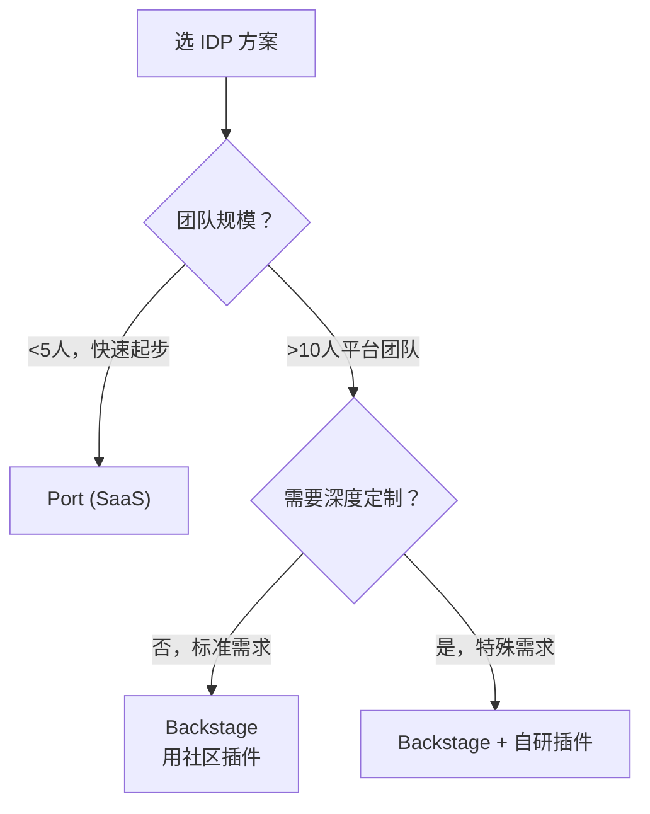
```mermaid
flowchart TD
    Start["选 IDP 方案"] --> Q1{"团队规模？"}
    Q1 -->|"<5人，快速起步"| Port["Port (SaaS)"]
    Q1 -->|">10人平台团队"| Q2{"需要深度定制？"}
    Q2 -->|"否，标准需求"| Backstage_Simple["Backstage<br/>用社区插件"]
    Q2 -->|"是，特殊需求"| Custom["Backstage + 自研插件"]
```

### 18.3 其他工具速览

| 工具 | 特点 | 适合 |
|------|------|------|
| **Humanitec** | 环境即服务 + Score 规范 | 中型企业 |
| **Mia-Platform** | 低代码 IDP + K8s 市场 | 传统企业转型 |
| **KusionStack** | 蚂蚁开源，KCL 配置语言 | 阿里云生态 |
| **Qovery** | AWS/GCP/Azure IDP | 初创团队 |

---

## 19. 三云平台工程实践

### 19.1 AWS 平台工程方案

```
AWS 推荐方案：Backstage + EKS + ArgoCD + Crossplane

核心组件：
├── EKS (或 EKS Auto Mode) → 计算底座
├── Backstage → 开发者门户
├── ArgoCD → GitOps 部署
├── Crossplane → 声明式管理 AWS 资源
├── External Secrets Operator → 对接 Secrets Manager
├── Karpenter → 智能节点扩缩
├── AWS Proton → 可选的模板管理（轻量替代 Backstage）
└── AWS DevOps Agent → AI 驱动的 Day 2 运营
```

### 19.2 Azure 平台工程方案

```
Azure 推荐方案：Backstage + AKS + ArgoCD + CAPZ/ASO

核心组件：
├── AKS → 管理集群 + 工作负载集群
├── Backstage → 开发者门户
├── ArgoCD → GitOps 部署
├── CAPZ (Cluster API Azure) → 集群生命周期
├── ASO (Azure Service Operator) → 声明式管理 Azure 资源
├── Flux extension → 可选的 GitOps 引擎
├── Workload Identity → Pod 到 Azure 服务的无密钥访问
├── Azure Deployment Environments → 开发者自助环境
└── Azure Monitor + Managed Grafana → Day 2 运营

官方参考实现：github.com/Azure-Samples/aks-platform-engineering
```

### 19.3 阿里云平台工程方案

```
阿里云推荐方案：Backstage + ACK + ArgoCD (ACK One GitOps)

核心组件：
├── ACK (或 ACK Pro) → 计算底座
├── ACK One → 多集群统一管理
├── Backstage → 开发者门户
├── ACK One GitOps (内置 ArgoCD) → GitOps 部署
├── MSE Nacos → 配置管理 + 服务发现
├── MSE Sentinel → 流量治理
├── ARMS → 全链路可观测 + AIOps
├── SLS → 日志采集与分析
├── RRSA → Pod 到云服务的无密钥访问
└── 云效 DevOps + ACR → CI/CD

特色：Spring Cloud Alibaba 深度集成，SAE 可作为"快速黄金路径"
```

---

## 第六部分：GitOps

## 20. GitOps 核心原则

### 20.1 四大原则

| 原则 | 说明 | 反模式 |
|------|------|--------|
| **声明式** | 所有配置以声明式方式定义（YAML/JSON） | 用 kubectl 手动改 |
| **版本化 & 不可变** | 配置存储在 Git，历史可追溯 | 直接改集群 |
| **Pull 自动拉取** | Agent 从 Git 拉取并应用到集群 | 手动 CI 推送到集群 |
| **持续协调** | 持续比较期望状态和实际状态，自动修复偏差 | 修复后不更新 Git |

### 20.2 Push vs Pull 模型

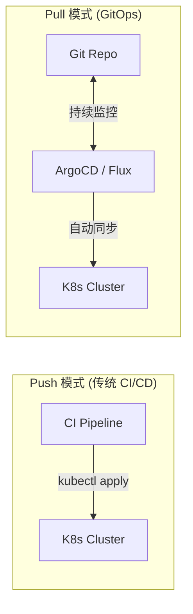
```mermaid
graph LR
    subgraph "Push 模式 (传统 CI/CD)"
        CI_Push["CI Pipeline"] -->|"kubectl apply"| K8s_Push["K8s Cluster"]
    end
    
    subgraph "Pull 模式 (GitOps)"
        Git["Git Repo"] <-->|"持续监控"| Agent["ArgoCD / Flux"]
        Agent -->|"自动同步"| K8s_Pull["K8s Cluster"]
    end
```

| | Push 模式 | Pull 模式 (GitOps) |
|---|---|---|
| 集群凭证 | CI 系统有集群写权限（安全风险） | Agent 在集群内，不需要外部写权限 |
| 漂移检测 | 无 | ✅ 自动检测 + 自动修复 |
| 回滚 | 重新跑 Pipeline | Git revert → Agent 自动同步 |
| 灾难恢复 | 需要备份 | Git 即恢复源 |

---

## 21. ArgoCD vs Flux CD 深度对比

### 21.1 架构对比

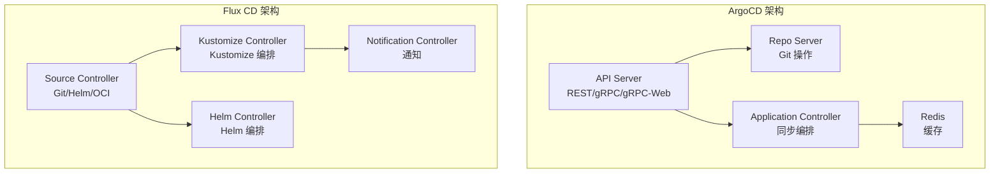
```mermaid
graph TB
    subgraph "ArgoCD 架构"
        API_Server["API Server<br/>REST/gRPC/gRPC-Web"]
        Repo_Server["Repo Server<br/>Git 操作"]
        App_Controller["Application Controller<br/>同步编排"]
        Redis_A["Redis<br/>缓存"]
        
        API_Server --> Repo_Server
        API_Server --> App_Controller
        App_Controller --> Redis_A
    end

    subgraph "Flux CD 架构"
        Source_Ctrl["Source Controller<br/>Git/Helm/OCI"]
        Kustomize_Ctrl["Kustomize Controller<br/>Kustomize 编排"]
        Helm_Ctrl["Helm Controller<br/>Helm 编排"]
        Notif_Ctrl["Notification Controller<br/>通知"]
        
        Source_Ctrl --> Kustomize_Ctrl
        Source_Ctrl --> Helm_Ctrl
        Kustomize_Ctrl --> Notif_Ctrl
    end
```

### 21.2 全能对比

| 维度 | ArgoCD | Flux CD |
|------|--------|---------|
| **Web UI** | ✅ **出色的 UI** | ⚠️ 无（依赖 CLI） |
| **多集群** | ✅ ApplicationSet | ✅ Kustomization |
| **渐进式交付** | ✅ Argo Rollouts 原生 | ⚠️ 需 Flagger |
| **镜像自动更新** | ⚠️ 需 Argo CD Image Updater | ✅ **Image Reflector/Policy 原生** |
| **OCI 支持** | ⚠️ 有限 | ✅ **原生 OCI** |
| **SOPS 集成** | ⚠️ 插件 | ✅ **原生集成** |
| **多租户** | ✅ Projects + RBAC | ⚠️ 命名空间隔离 |
| **Azure 集成** | 手动安装 | ✅ **AKS 原生扩展** |
| **阿里云集成** | ✅ **ACK One GitOps 内置** | 手动安装 |
| **学习曲线** | 中 | 中高 |
| **社区规模** | **最大** | 中 |
| **CNCF 状态** | Graduated | Graduated |

### 21.3 选型决策

```
选 ArgoCD 如果：
├─ 需要 Web UI（团队中有非 K8s 专家）
├─ 多集群 + ApplicationSet 模式
├─ 阿里云 ACK One 用户（内置）
├─ 需要 Argo Rollouts 渐进式交付
└─ 团队规模较大，需要多租户隔离

选 Flux CD 如果：
├─ Azure AKS 用户（原生扩展）
├─ 需要原生镜像自动更新
├─ 需要 OCI 仓库支持
├─ 没有 UI 需求，重度 CLI 用户
└─ 团队熟悉 SOPS 加密工作流
```

---

## 22. 多集群 GitOps 架构

### 22.1 经典 Hub-Spoke 模式

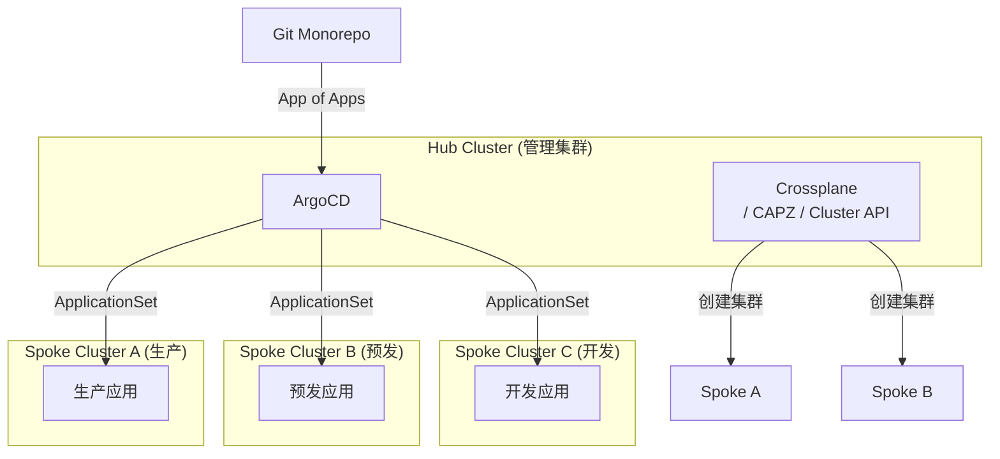
```mermaid
graph TB
    subgraph "Hub Cluster (管理集群)"
        ArgoCD["ArgoCD"]
        Crossplane["Crossplane<br/>/ CAPZ / Cluster API"]
    end
    
    subgraph "Spoke Cluster A (生产)"
        Workload_A["生产应用"]
    end
    
    subgraph "Spoke Cluster B (预发)"
        Workload_B["预发应用"]
    end
    
    subgraph "Spoke Cluster C (开发)"
        Workload_C["开发应用"]
    end
    
    Git["Git Monorepo"] -->|"App of Apps"| ArgoCD
    ArgoCD -->|"ApplicationSet"| Workload_A
    ArgoCD -->|"ApplicationSet"| Workload_B
    ArgoCD -->|"ApplicationSet"| Workload_C
    Crossplane -->|"创建集群"| Spoke_A["Spoke A"]
    Crossplane -->|"创建集群"| Spoke_B["Spoke B"]
```

### 22.2 App of Apps 模式

```yaml
# 根 Application：声明所有子应用
apiVersion: argoproj.io/v1alpha1
kind: Application
metadata:
  name: platform-root
spec:
  source:
    repoURL: https://github.com/org/platform-config
    path: apps/
  destination:
    server: https://kubernetes.default.svc
  syncPolicy:
    automated:
      prune: true
      selfHeal: true

# apps/ 目录结构：
# apps/
# ├── monitoring/     → Prometheus + Grafana
# ├── logging/        → Loki + Fluent Bit
# ├── ingress/        → Ingress Controller + Cert Manager
# ├── security/       → Network Policy + OPA
# └── workloads/      → 业务应用（按团队分组）
```

---

## 23. 三云 GitOps 实践

### 23.1 AWS: ArgoCD on EKS

```
启动步骤：
1. helm install argo-cd argo/argo-cd
2. 配置 ALB Ingress 暴露 ArgoCD UI
3. 配置 IRSA 授予 ECR 读取权限
4. ApplicationSet → 管理多集群
5. External Secrets Operator → 对接 Secrets Manager
6. Karpenter → 节点自动扩缩
```

### 23.2 Azure: Flux extension on AKS

```
# 创建集群时启用 Flux
az aks create --name my-aks --enable-managed-identity

# 一行启用 GitOps
az k8s-configuration flux create \
  --resource-group my-rg \
  --cluster-name my-aks \
  --name cluster-config \
  --namespace flux-system \
  --url https://github.com/my-org/my-repo \
  --branch main \
  --kustomization name=apps path=./apps prune=true

# 批量应用到多个集群
az k8s-configuration flux create --cluster-type connectedClusters ...
```

### 23.3 阿里云: ACK One GitOps

ACK One 内置 ArgoCD，通过控制台一键开启：

| 特点 | 说明 |
|------|------|
| 开通方式 | 控制台一键 → 自动部署 ArgoCD |
| 集群管理 | 自动发现子集群，ApplicationSet 动态部署 |
| 权限对接 | RAM RBAC 映射到 ArgoCD RBAC |
| 镜像仓库 | 自动集成 ACR |
| 可观测性 | ARMS 集成 ArgoCD 指标 |

---

## 第七部分：渐进式交付

## 24. 渐进式交付：Argo Rollouts

### 24.1 为什么需要渐进式交付

Kubernetes 原生的 RollingUpdate 策略风险太大：

```
RollingUpdate 的问题：
├─ 无法控制新版本的流量比例（一波直接上）
├─ 无法基于外部指标（错误率/延迟）自动回滚
├─ 爆炸半径不可控
└─ 大流量生产环境 = 高风险赌博
```

Argo Rollouts 提供 **蓝绿部署** 和 **金丝雀发布** 两种策略，并与 ArgoCD 深度集成。

### 24.2 蓝绿部署（Blue-Green）

```yaml
# 蓝绿部署: 新版本全量部署但不接流量，验证后一键切换
apiVersion: argoproj.io/v1alpha1
kind: Rollout
metadata:
  name: my-app
spec:
  replicas: 3
  strategy:
    blueGreen:
      activeService: my-app-active       # 当前生产流量
      previewService: my-app-preview     # 新版本预览
      autoPromotionEnabled: false        # 手动确认后才切换
      scaleDownDelaySeconds: 300         # 旧版本保留5分钟
      prePromotionAnalysis:              # 切换前自动验证
        templates:
        - templateName: smoke-tests
        args:
        - name: service-name
          value: my-app-preview
  template:
    spec:
      containers:
      - name: app
        image: my-app:v2.0
```

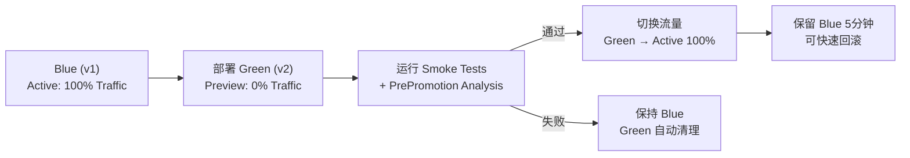
```mermaid
graph LR
    V1["Blue (v1)<br/>Active: 100% Traffic"] --> Verify["部署 Green (v2)<br/>Preview: 0% Traffic"]
    Verify --> Test["运行 Smoke Tests<br/>+ PrePromotion Analysis"]
    Test -->|"通过"| Switch["切换流量<br/>Green → Active 100%"]
    Test -->|"失败"| Abort["保持 Blue<br/>Green 自动清理"]
    Switch --> Wait["保留 Blue 5分钟<br/>可快速回滚"]
```

### 24.3 金丝雀发布（Canary with Analysis）

```yaml
apiVersion: argoproj.io/v1alpha1
kind: Rollout
metadata:
  name: my-app
spec:
  replicas: 10
  strategy:
    canary:
      steps:
      - setWeight: 10          # 10% 流量到新版本
      - pause: {duration: 5m}  # 观察5分钟
      - setWeight: 30          # 30% 流量
      - pause: {duration: 5m}
      - setWeight: 50          # 50% 流量
      - analysis:              # 自动分析指标
          templates:
          - templateName: error-rate-check
      - setWeight: 100         # 全部流量
      maxSurge: "25%"
      maxUnavailable: 0

---
# AnalysisTemplate: 基于 Prometheus 指标自动判断
apiVersion: argoproj.io/v1alpha1
kind: AnalysisTemplate
metadata:
  name: error-rate-check
spec:
  metrics:
  - name: error-rate
    interval: 30s
    successCondition: result[0] < 0.01    # 错误率 < 1%
    failureLimit: 3                        # 连续3次失败 → 自动回滚
    provider:
      prometheus:
        address: http://prometheus:9090
        query: |
          rate(http_requests_total{status=~"5.."}[1m]) /
          rate(http_requests_total[1m])
```

### 24.4 蓝绿 vs 金丝雀选型

| | 蓝绿 (Blue-Green) | 金丝雀 (Canary) |
|---|---|---|
| **复杂度** | 低 | 中 → 高 |
| **需要流量管理器** | 可选 | 精细控制时需要 (Istio/ALB Ingress) |
| **流量控制** | 0% 或 100% | 任意比例（10%→30%→50%→100%） |
| **爆炸半径** | 切换瞬间全量 | 逐步扩大，可中途止损 |
| **适用** | 有状态服务、队列消费者 | 无状态 HTTP 服务 |
| **自动验证** | ✅ PrePromotion Analysis | ✅ 多步 Analysis |
| **失败回滚** | 切回旧 Service | 自动缩回 + 流量切回 |

### 24.5 最佳实践

```
1. 先用蓝绿，成熟后转金丝雀 → 渐进式提升信心
2. 指标要能在 5-15 分钟内判断部署成功与否
3. AnalysisTemplate 至少包含：错误率 + 延迟 P99 + 资源使用
4. failureLimit 设 3（不因瞬时波动误判）
5. 与 ArgoCD 集成：Rollout CR 和 Application 在同一个 Git 仓库
6. 生产金丝雀必须配合流量管理器（Istio/ALB Ingress/SMI）
```

---

---

## 第八部分：AI 驱动运维

## 25. AIOps 核心能力与成熟度

### 25.1 五大能力

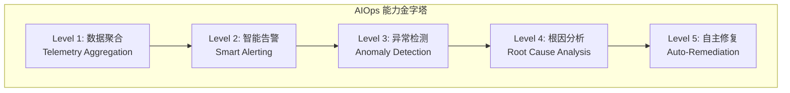
```mermaid
graph TB
    subgraph "AIOps 能力金字塔"
        L5["Level 5: 自主修复<br/>Auto-Remediation"]
        L4["Level 4: 根因分析<br/>Root Cause Analysis"]
        L3["Level 3: 异常检测<br/>Anomaly Detection"]
        L2["Level 2: 智能告警<br/>Smart Alerting"]
        L1["Level 1: 数据聚合<br/>Telemetry Aggregation"]
    end

    L1 --> L2 --> L3 --> L4 --> L5
```

| 级别 | 能力 | 技术手段 | 当前成熟度 |
|------|------|---------|-----------|
| L1 | 数据聚合 | Prometheus + Loki + Tempo | ✅ 成熟 |
| L2 | 智能告警 | 动态阈值 + 告警降噪 | ✅ 成熟 |
| L3 | 异常检测 | ML 时间序列 + 统计模型 | ✅ 成熟 |
| L4 | 根因分析 | 因果图 + 拓扑分析 + LLM | ⚠️ 发展中 |
| L5 | 自主修复 | Agentic AI + 多智能体 | 🔬 前沿探索 |

### 25.2 关键趋势

| 趋势 | 说明 | 代表 |
|------|------|------|
| **LLM + 运维** | 自然语言查询 + 解释 + 建议 | K8sGPT, AWS DevOps Agent |
| **Agentic AI** | 独立执行多步骤排查修复 | AWS DevOps Agent (Frontier Agent) |
| **MCP 协议集成** | LLM 通过标准协议访问工具和数据 | Datadog MCP Server |
| **多智能体** | 不同 Agent 分工：检测→分析→修复→验证 | AWS 多 Agent 架构 |

---

## 26. AWS DevOps Agent 深度解析

### 26.1 什么是 Frontier Agent

AWS DevOps Agent 是 AWS 在 2025 年 12 月推出的"前沿智能体"（Frontier Agent），代表新一代 AI Agent：

> **Frontier Agent** = 自主 + 大规模 + 长时间工作（小时/天），无需持续人工干预。

### 26.2 多智能体架构

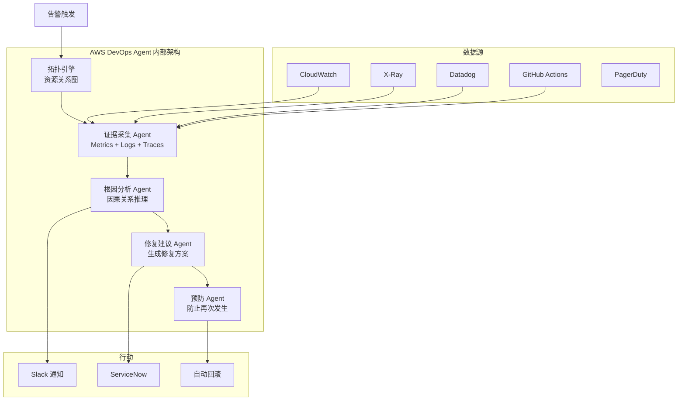
```mermaid
graph TB
    subgraph "AWS DevOps Agent 内部架构"
        Topo["拓扑引擎<br/>资源关系图"]
        EvidenceAgent["证据采集 Agent<br/>Metrics + Logs + Traces"]
        RCA_Agent["根因分析 Agent<br/>因果关系推理"]
        MitigationAgent["修复建议 Agent<br/>生成修复方案"]
        PreventionAgent["预防 Agent<br/>防止再次发生"]
    end
    
    subgraph "数据源"
        CW["CloudWatch"]
        XRay["X-Ray"]
        DD["Datadog"]
        GitHub_C["GitHub Actions"]
        PagerDuty["PagerDuty"]
    end
    
    subgraph "行动"
        Slack["Slack 通知"]
        Tickets["ServiceNow"]
        Rollback["自动回滚"]
    end

    Alert["告警触发"] --> Topo
    Topo --> EvidenceAgent
    CW --> EvidenceAgent
    XRay --> EvidenceAgent
    DD --> EvidenceAgent
    GitHub_C --> EvidenceAgent
    
    EvidenceAgent --> RCA_Agent
    RCA_Agent --> MitigationAgent
    MitigationAgent --> PreventionAgent
    
    RCA_Agent --> Slack
    MitigationAgent --> Tickets
    PreventionAgent --> Rollback
```

### 26.3 工作流程

```
1. 告警触发（PagerDuty / CloudWatch Alarm）
2. DevOps Agent 自动接收告警，开始自主调查
3. 拓扑引擎：绘制受影响资源的关系图
4. 证据采集：并行拉取 Metrics、Logs、Traces、Deployment 历史
5. 根因分析：相关性分析 + 时间线对齐 + 变更事件匹配
6. 生成修复方案：带置信度评分
7. 推送到 Slack：通知 on-call 工程师
8. 工程师批准 → 自动执行修复
9. 预防建议：更新 Runbook / 调整监控阈值
```

### 26.4 实际效果

| 指标 | 传统模式 | AWS DevOps Agent |
|------|---------|-------------------|
| MTTR (平均修复时间) | 小时级 | **分钟级** |
| 人工调查时间 | 数小时 | 零（Agent 自动） |
| 数据关联 | 手动跨工具切换 | 自动跨平台 |
| 根因定位准确率 | — | 带置信度评分 |
| 预防建议 | 事后复盘 | 实时预防 |

---

## 27. LLM + K8s：K8sGPT 实践

### 27.1 K8sGPT 架构

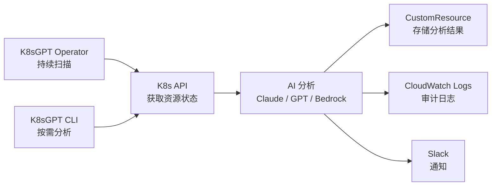
```mermaid
graph LR
    K8sGPT_Op["K8sGPT Operator<br/>持续扫描"] --> K8s_API["K8s API<br/>获取资源状态"]
    K8s_API --> Analysis["AI 分析<br/>Claude / GPT / Bedrock"]
    Analysis --> CR["CustomResource<br/>存储分析结果"]
    Analysis --> CW_Logs["CloudWatch Logs<br/>审计日志"]
    Analysis --> Slack["Slack<br/>通知"]
    
    K8sGPT_CLI["K8sGPT CLI<br/>按需分析"] --> K8s_API
```

### 27.2 使用示例

```bash
# 安装 K8sGPT CLI
brew install k8sgpt

# 扫描集群问题（使用 Bedrock Claude）
k8sgpt analyze --backend amazonbedrock --explain

# 输出示例：
# ❌ Pod default/my-app-7d4f8b9c6-x2k4j is in CrashLoopBackOff
#
# 🔍 AI 分析：
# 该 Pod 的健康检查端点 /healthz 返回 500。
# 检查日志发现 OutOfMemoryError。
# 建议：将 memory limit 从 256Mi 增加到 512Mi。
#
# 📝 自动修复：已生成 Mutation CR，等待批准。
```

### 27.3 K8sGPT Operator 自动修复

```yaml
# K8sGPT 生成的可审计修复方案
apiVersion: k8sgpt.ai/v1alpha1
kind: Mutation
metadata:
  name: fix-oom-my-app
spec:
  resource:
    kind: Deployment
    name: my-app
  changes:
    - path: /spec/template/spec/containers/0/resources/limits/memory
      from: "256Mi"
      to: "512Mi"
  riskLevel: low
  rollbackAvailable: true
```

---

## 28. 三云 AIOps 方案对比

| 能力 | AWS | Azure | 阿里云 |
|------|-----|-------|--------|
| **AI 异常检测** | DevOps Guru, CloudWatch Anomaly | Monitor AIOps, Smart Detection | ARMS 智能诊断 |
| **根因分析** | DevOps Agent Multi-Agent RCA | App Insights Smart Detection | ARMS 拓扑分析 |
| **自主修复** | DevOps Agent (Frontier Agent) 🔬 | Azure Automation + Copilot | AHAS 降级预案 |
| **LLM 聊天** | Amazon Q Developer | Azure Copilot | — |
| **K8s 原生 AI** | K8sGPT + Bedrock | K8sGPT + Azure OpenAI | — |
| **MCP 集成** | Datadog MCP Server | — | — |
| **成熟度** | ⭐⭐⭐⭐⭐ | ⭐⭐⭐ | ⭐⭐⭐ |
| **开源方案** | K8sGPT + OpenLLM | K8sGPT + Azure OpenAI | 自研为主 |

---

## 第九部分：最佳实践

## 29. 云原生选型决策树

```mermaid
flowchart TD
    Start["开始架构设计"] --> Q1{"负载类型？"}
    
    Q1 -->|"事件驱动<br/>不可预测尖刺"| Lambda_Fn["Lambda / Functions / FC"]
    Q1 -->|"长期运行<br/>微服务"| Q2{"团队 K8s 能力？"}
    Q1 -->|"批处理<br/>定时任务"| Q3{"执行时长？"}
    
    Q2 -->|"无 / 不想学"| Q4{"技术栈？"}
    Q4 -->|"Java/Spring Cloud"| SAE["阿里云 SAE"]
    Q4 -->|"Docker 容器"| Fargate["ECS Fargate / ACA"]
    Q2 -->|"有 / 需要 K8s 生态"| K8s["EKS / AKS / ACK"]
    
    Q3 -->|"<15分钟"| Lambda_Fn
    Q3 -->|">15分钟"| Fargate

    Lambda_Fn --> Best1["✅ 最快上市<br/>最低运维"]
    SAE --> Best2["✅ Spring Cloud 一站式"]
    Fargate --> Best3["✅ 容器不碰 K8s"]
    K8s --> Best4["✅ 最大灵活度<br/>最高复杂度"]
```

## 30. FinOps 成本优化

### 30.1 成本金字塔

```mermaid
graph TB
    L1["L1: Spot / 抢占实例  <br/>节省 60-90%"] --> L2
    L2["L2: 保留实例 / Savings Plans<br/>节省 30-50%"] --> L3
    L3["L3: Graviton / ARM 实例<br/>节省 20-30%"] --> L4
    L4["L4: Right-Sizing<br/>节省 20-60%"] --> L5
    L5["L5: 架构优化<br/>Serverless / 事件驱动"]
```

### 30.2 三云成本优化对比

| 策略 | AWS | Azure | 阿里云 |
|------|-----|-------|--------|
| **Spot 实例** | EC2 Spot (70-90% off) | Spot VM | ECI Spot |
| **预留实例** | Savings Plans | Reserved Instances | 预留实例券 |
| **ARM 省钱** | Graviton (20% off) | Ampere ARM | 倚天实例 |
| **Serverless** | Lambda/Fargate | Functions/ACA | FC/SAE/ASK |
| **控制面** | EKS $73/月 | AKS 免费 | ACK 免费 |
| **成本工具** | Cost Explorer | Cost Management | 成本管家 |
| **AI 优化** | Compute Optimizer | Advisor | ARMS 洞察 |

### 30.3 真实成本对比（3 服务场景）

| 方案 | 月成本 | 运维人力 | 最佳适用 |
|------|--------|---------|---------|
| ECS Fargate | ~$480 | 低 | 简单微服务 |
| EKS EC2+Spot | ~$350 | 中高 | K8s 生态需要 |
| AKS + Spot | ~$320 | 中 | Azure 原生 |
| ACK + SAE 混合 | ~$250 | 低 | Spring Cloud |
| Lambda-only | 按量$变动 | 最低 | 事件驱动 |

---

## 31. 安全左移与供应链安全

### 31.1 安全左移全景

```mermaid
graph LR
    subgraph "开发阶段"
        SAST["SAST<br/>代码扫描"]
        SCA["SCA<br/>依赖扫描"]
        SecretScan["密钥扫描<br/>git-secrets"]
    end
    
    subgraph "构建阶段"
        ImageScan["镜像扫描<br/>Trivy / ECR Scan"]
        SignVerify["签名验证<br/>Cosign / Notary"]
        SBOM["SBOM 生成<br/>Syft"]
    end
    
    subgraph "部署阶段"
        Admission["准入控制<br/>OPA / Kyverno"]
        NP["网络策略<br/>默认拒绝"]
        RBAC["最小权限<br/>RBAC"]
    end
    
    subgraph "运行时"
        ThreatDetect["威胁检测<br/>Falco / Defender"]
        RuntimeScan["运行时扫描<br/>持续漏洞"]
        Audit["审计日志<br/>CloudTrail / 操作审计"]
    end

    Code["代码提交"] --> SAST
    SAST --> Build["构建镜像"] --> ImageScan
    Build --> Deploy["部署到 K8s"] --> Admission
    Deploy --> Runtime["生产运行"] --> ThreatDetect
```

### 31.2 必做安全清单

```
□ 镜像签名 + 准入校验（禁止未签名镜像）
□ 默认拒绝所有 Pod 间流量 → 显式允许
□ 每个 ServiceAccount 绑定最小 IAM Role
□ Secrets Store CSI → 密钥不落盘
□ OPA/Kyverno 策略：禁止 privileged / hostNetwork / latest tag
□ Falco 运行时威胁检测
□ 定期镜像扫描（Trivy 每日）
□ Git 提交签名验证
□ 审计日志开启（CloudTrail / 操作审计 / Azure Activity Log）
```

---

## 第十部分：跨云对比扩展

## 32. 跨云数据库对比

### 32.1 云原生数据库架构演进

```mermaid
graph LR
    subgraph "传统"
        MySQL["MySQL on EC2<br/>自建主从"]
    end
    subgraph "托管"
        RDS["RDS<br/>托管 MySQL"]
    end
    subgraph "云原生"
        Aurora["Aurora<br/>存算分离"]
        PolarDB["PolarDB<br/>RDMA + 共享存储"]
    end
    MySQL -->|"减少运维"| RDS
    RDS -->|"架构重构"| Aurora
    RDS -->|"架构重构"| PolarDB
```

### 32.2 核心产品对比

| 维度 | AWS Aurora MySQL | AWS RDS MySQL | Azure SQL Hyperscale | Azure DB for MySQL | 阿里云 PolarDB MySQL | 阿里云 RDS MySQL |
|------|-----------------|---------------|---------------------|-------------------|--------------------|-------------------|
| **架构** | 存算分离，6副本3AZ | 传统主从，EBS | 存算分离，页服务器 | 传统主从 | 存算分离，RDMA | 传统主从 |
| **最大存储** | 128 TB | 64 TB | 100 TB | 16 TB | 100 TB | 32 TB |
| **读副本** | 15个（<100ms延迟） | 5个 | 4个 | 10个 | 16个（<1ms延迟） | 5个 |
| **写性能** | 3-5x MySQL | 1x | 快读横向扩展 | 1x | 3-5x MySQL | 1x |
| **Serverless** | ✅ Aurora Serverless v2 | ❌ | ✅ Serverless tier | ❌ | ❌ | ❌ |
| **HTAP** | ❌ | ❌ | ❌ | ❌ | ✅ IMCI列存 | ❌ |
| **全球数据库** | ✅ Aurora Global DB | ⚠️ 跨区域只读 | ✅ Active Geo-Replication | ⚠️ 跨区域只读 | ✅ PolarDB GDN | ⚠️ 灾备实例 |
| **中国合规** | ❌ | ❌ | ❌ | ❌ | ✅ 原生等保 | ✅ |

### 32.3 选型指南

```
你的场景 → 推荐数据库：

中国+OLTP+HTAP需要 → PolarDB（唯一HTAP方案）
全球部署+MySQL → Aurora Global DB
简单托管+不想改代码 → RDS
SQL Server 生态 → Azure SQL
成本敏感+低流量 → RDS + Reserved Instance
弹性尖峰流量 → Aurora Serverless v2
PostgreSQL 偏好 → Aurora PostgreSQL / PolarDB PostgreSQL
```

---

## 33. 跨云消息队列对比

### 33.1 消息队列全景

| 维度 | AWS SQS | AWS SNS | Azure Service Bus | Azure Event Hubs | 阿里云 RocketMQ |
|------|---------|---------|-------------------|-----------------|----------------|
| **模型** | 点对点队列 | 发布订阅 | 队列 + 主题 | 事件流 | 队列 + 主题 + 流 |
| **最大消息** | 256 KB (2GB扩展) | 256 KB | 256 KB (100 MB Premium) | 1 MB | 4 MB |
| **最大保留** | 14天 | — | 无限 | 7天 | 3天 |
| **有序** | ✅ FIFO | ❌ | ✅ Sessions | ❌ | ✅ 分区有序 |
| **事务** | ❌ | ❌ | ✅ | ❌ | ✅ 事务消息 |
| **死信队列** | ✅ 原生 | ❌ | ✅ 内置 | ✅ | ✅ |
| **协议** | HTTPS | HTTPS | AMQP 1.0 / HTTPS | AMQP / Kafka | TCP / HTTP |
| **吞吐** | 近乎无限 | 数百万/秒 | ~2000/秒 (Standard) | TB级 | 10万+ TPS |
| **定时消息** | ⚠️ Delay Queue (≤15min) | ❌ | ✅ 任意时间 | ❌ | ✅ 18个延迟级别 |
| **适用场景** | 任务分发、微服务解耦 | 广播通知 | 企业集成、工作流 | 流式处理、遥测 | 分布式事务、金融级 |

### 33.2 选型决策

```mermaid
flowchart TD
    Start["选消息队列"]
    Start --> Q1{"需要事务消息<br/>或金融级可靠性？"}
    Q1 -->|"是"| RocketMQ["阿里云 RocketMQ<br/>事务 + 顺序 + 定时"]
    Q1 -->|"否"| Q2{"消息模式？"}
    Q2 -->|"点对点任务分发"| Q3{"是否在 AWS?"}
    Q3 -->|"是"| SQS["SQS<br/>简单可靠"]
    Q3 -->|"否，Azure"| SB["Service Bus Queue"]
    Q2 -->|"发布订阅广播"| Q4{"云平台？"}
    Q4 -->|"AWS"| SNS_SQS["SNS → SQS<br/>扇出模式"]
    Q4 -->|"Azure"| SBT["Service Bus Topics"]
    Q2 -->|"流式处理/大数据"| Q5{"每秒百万级？"}
    Q5 -->|"是"| Kafka["Kafka / Event Hubs"]
    Q5 -->|"否"| Q6{"平台？"}
    Q6 -->|"AWS"| Kinesis["Kinesis"]
    Q6 -->|"Azure"| EventHubs["Event Hubs"]
    Q6 -->|"阿里云"| RocketMQ_Stream["RocketMQ Stream"]
```

---

## 34. 跨区域灾备模式

### 34.1 三种灾备模式

```mermaid
graph TB
    subgraph "Active-Active（双活）"
        AA1["Region A: 100%配置<br/>Traffic: 50%"]
        AA2["Region B: 100%配置<br/>Traffic: 50%"]
        AA_GLB["Global LB: Weighted"]
        AA1 --- AA_GLB --- AA2
    end
    
    subgraph "Active-Passive（主备）"
        AP1["Region A: Active<br/>Traffic: 100%"]
        AP2["Region B: Standby<br/>Traffic: 0%"]
        AP_DNS["DNS Failover"]
        AP1 --- AP_DNS -.->|"故障切换"| AP2
    end
    
    subgraph "Backup-Restore（备份恢复）"
        BR1["Region A: Active"]
        BR2["Region B: Cold"]
        BR_Velero["Velero Backup → S3 Cross-Region"]
        BR1 --> BR_Velero --> BR2
    end
```

### 34.2 对比选型

| 维度 | Active-Active | Active-Passive | Backup & Restore |
|------|--------------|----------------|------------------|
| **RTO（恢复时间）** | <1 分钟（自动切换） | 15-60 分钟（需缩小+恢复） | 数小时 |
| **RPO（数据丢失）** | 近零（同步复制） | 1小时（备份间隔） | 24小时 |
| **额外成本** | ~100% | 30-50% | ~10% |
| **实现复杂度** | ⭐⭐⭐⭐⭐ | ⭐⭐⭐ | ⭐ |
| **数据一致性** | 需应用层处理 | 备份恢复保证 | 备份恢复保证 |
| **适用场景** | 金融、支付、核心业务 | 企业内部系统、SaaS后台 | 非关键系统、开发环境 |

### 34.3 三云灾备方案

| | AWS | Azure | 阿里云 |
|---|---|---|---|
| **全局负载均衡** | Route 53 + Global Accelerator | Azure Front Door + Traffic Manager | 全局流量管理 GTM |
| **数据库跨区域** | Aurora Global DB, DynamoDB Global Tables | Azure SQL Active Geo-Replication, Cosmos DB Multi-Region | PolarDB GDN, Redis 全球多活 |
| **K8s 备份** | Velero + S3 Cross-Region | Velero + RA-GRS Storage | Velero + OSS 跨区域复制 |
| **K8s GitOps DR** | ArgoCD + ApplicationSet 自动切换 | Flux + Azure Arc 多集群 | ACK One + GitOps 多集群 |
| **一键切换** | Route 53 Failover Routing | Azure Front Door Priority Routing | GTM 健康检查切换 |

### 34.4 DR 最佳实践

```
1. 备份策略：Velero 每小时全量 + WAL 持续 → 满足大部分 RPO
2. 定期演练：每月一次 DR 演练（Fire Drill）
3. 自动化切换：DNS failover + K8s 自动扩缩
4. GitOps 恢复：ArgoCD 在 DR 集群已部署 → 自动同步
5. 成本控制：Passive 集群最小规模（1-2节点），按需扩缩
6. Runbook 模板：明确每个步骤的执行人和时间预算
7. 监控告警：跨区域健康检查，5分钟无响应 → 触发切换
```

---

## 35. 每章速查卡片

### 三云选型卡片

| 场景 | 一句话 | 首选方案 |
|------|--------|---------|
| 最简单容器 | 不想碰 YAML 和节点 | **ECS Fargate** / 阿里云 SAE |
| 需要 K8s 生态 | Helm/Operator/CRD | EKS / AKS / ACK |
| 事件驱动 | 代码即函数，毫秒计费 | Lambda / Functions / FC |
| Serverless 容器 | 容器 + 零运维 | ACA / SAE / ASK |
| Spring Cloud 上云 | Nacos/Sentinel 全托管 | **阿里云 SAE + MSE** |
| 多语言 + 平台工程 | 统一 K8s 底座 | Backstage + ArgoCD + Crossplane |
| 中国大陆合规 | 数据不出境 | **阿里云**（唯一选项） |
| 全球多区域 | 最低延迟 | AWS（最多 Region） |
| 微软生态深度集成 | AD + GitHub + Azure | **Azure** |
| 最低成本 | Spot + ARM + Serverless | ECS EC2+Spot / ASK |

### GitOps 决策卡片

| 场景 | 选 ArgoCD | 选 Flux |
|------|----------|---------|
| 需要 Web UI | ✅ | ❌ |
| Azure 用户 | — | ✅ 原生扩展 |
| 阿里云用户 | ✅ ACK One 内置 | — |
| 镜像自动更新 | 需插件 | ✅ 原生 |
| SOPS 加密 | 需插件 | ✅ 原生 |
| 多租户 | ✅ Projects | ⚠️ 命名空间 |
| 渐进式交付 | ✅ Argo Rollouts | ✅ Flagger |

### 灾备决策卡片

| RTO 要求 | 推荐模式 | 关键组件 |
|---------|---------|---------|
| < 1 分钟 | Active-Active | Global LB + 数据库同步复制 |
| < 1 小时 | Active-Passive | Velero + 预热节点 + DNS failover |
| < 24 小时 | Backup & Restore | Velero daily + S3 跨区域 |

---

## 第十一部分：速查与思考

## 36. 互动思考题

### 第一部分：云原生全景

1. 为什么说"Kubernetes is boring"是最高评价？成熟的基础设施应该有哪些特征？
2. 98% 组织采用云原生，但只有 59% 说"大部分开发已云原生化"。中间差距在哪？
3. 为什么 CNCF 2025 调查首次显示"文化变革"超过"技术复杂度"成为最大挑战？

### 第二部分：三云选型

4. ECS Fargate vs EKS Fargate，什么场景下 EKS 比 ECS 每月多花 $73 是值得的？
5. Azure ACA 和阿里云 SAE 都标榜"不用 K8s 也能享受容器"。它们解决了什么核心痛点？丢失了什么能力？
6. 一个使用 Spring Cloud Alibaba 的团队要上云，你会推荐 ACK、SAE 还是 ASK？为什么？

### 第三部分：平台工程

7. "平台即产品"（Platform as a Product）理念和传统"运维工具"思维有什么本质区别？
8. App of Apps 模式解决了什么问题？如果不用这个模式会有什么后果？
9. 为什么 CNCF 数据显示 0% 的 Explorers 使用 GitOps，而 58% 的 Innovators 使用？

### 第四部分：AI 驱动运维

10. AWS DevOps Agent 被称为 "Frontier Agent"，和传统 ChatOps Bot 有什么区别？
11. K8sGPT 的 Mutation CR 为什么需要人工批准？自动修复的安全边界在哪里？
12. 如果一个组织刚起步做 AIOps，从哪个能力开始最容易见效？为什么？

---

## 37. 思考题参考答案

### 第一部分：云原生全景

**Q1: 为什么说"Kubernetes is boring"是最高评价？**

成熟的底层基础设施应该像自来水或电力 — 开着就行，不用想。特征：
- **可靠**：没有意外故障，行为完全可预测
- **稳定**：API 不随版本大改，升级不破坏现有工作负载
- **枯燥**：边缘情况已发现并解决，社区经验丰富

类比 Linux：2000 年代在争论 Linux 能否用于生产，现在不会有人问这个问题。K8s 在 2025 年进入了同样的阶段。

**Q2: 98% 采用但只有 59% 深度使用，差距在哪？**

"采用" = 至少有一个 K8s 集群在跑，可能只是试点。"大部分云原生化" = 核心技术栈全部基于云原生重构。差距原因：
1. **遗留系统**：老单体应用迁移成本高
2. **组织阻力**：传统运维团队需要技能转型
3. **认知负荷**：K8s 复杂度让中小团队望而却步
4. ROI 不明确：部分负载不需要 K8s 的复杂度

**Q3: 为什么文化变革超过技术复杂度成为最大挑战？**

技术在变简单（托管服务、平台工程），但组织在变复杂：
- 传统的"开发写代码 → 运维部署"模式被打破
- 开发者需要懂基础设施，运维需要写代码
- 权责边界模糊，审批流程不适配持续交付
- 这是**社会技术系统**问题，不是纯技术问题

---

### 第二部分：三云选型

**Q4: 什么时候 EKS 比 ECS 每月多花 $73 值得？**

$73/月（~525元）换来的价值：
1. **Helm Charts**：社区数十万 Chart 开箱即用（ECS 每个服务要自己写 CloudFormation）
2. **Operator 模式**：自动化管理 Kafka/ES/Redis 等有状态服务
3. **CRD 扩展**：自定义资源类型（Certificate、ServiceMonitor...）
4. **多集群一致性**：开发/测试/生产完全相同的部署描述
5. **团队复用**：招聘 K8s 背景的人比 ECS 特定技能容易

决策线：**团队 >10 人 + 需要 Helm/Operator → EKS 值得。否则 ECS 更省心。**

**Q5: ACA/SAE 解决了什么？丢失了什么？**

解决的核心痛点：
- 不用学 K8s（Pod/Deployment/Service/Ingress/CNI...）
- 零节点管理（无需考虑容量规划、OS 升级、安全补丁）
- 秒级弹性（内置 KEDA/Dapr，开箱即用）

丢失的能力：
- 不能用 Helm Charts
- 不能装 Operator（无法自动管理 Kafka/ES）
- 不能自定义 CNI/网络策略
- 不能运行非标准工作负载（需要 sidecar 容器等）

结论：**80% 的微服务不需要 K8s 的强大能力，ACA/SAE 正好覆盖这 80%。**

**Q6: Spring Cloud Alibaba 团队选 ACK、SAE 还是 ASK？**

```
团队规模 < 5人，快速交付 → SAE（Nacos/Sentinel 全托管，零运维）
团队 5-20人，需要定制 → ACK + MSE（K8s 灵活度 + MSE 托管微服务组件）
团队 > 20人，多云策略 → ACK（标准 K8s，可迁移）
Serverless 弹性优先 → ASK（按 Pod 付费，批处理/CI/CD 最优）
```

---

### 第三部分：平台工程

**Q7: "平台即产品" vs "运维工具"思维？**

| | 运维工具思维 | 平台即产品 |
|---|---|---|
| 出发点 | "运维需要什么" | **"开发者需要什么"** |
| 交付物 | 工具/脚本/文档 | 自助 API + 黄金路径 |
| 用户关系 | 提交工单 → 等待处理 | 自助点击 → 即时获得 |
| 衡量指标 | 工单处理速度 | **DORA 指标 + 平台采纳率** |
| 迭代方式 | 需求驱动 | 产品路线图 + 用户反馈 |
| 核心问题 | "怎么让 K8s 更好管理" | **"怎么让开发者更快交付"** |

**Q8: App of Apps 模式解决什么问题？**

不用 App of Apps 的后果：
```
手动部署 10 个集群 × 20 个组件 = 200 次 ArgoCD Application 创建
每次新增集群 = 重新配置 20 次
配置漂移 = 每个集群独立维护 = 灾难
```

用 App of Apps：
```yaml
# 一个根 Application 管理一切
# 新增集群 → 自动部署所有组件
# 更新配置 → 一次 commit，所有集群同步
```

**Q9: 为什么 0% Explorers 用 GitOps，58% Innovators 用？**

GitOps 需要先决条件：
1. **声明式基础设施**（IaC 成熟度）
2. **版本控制文化**（不只是存代码，是存一切配置）
3. **持续部署能力**（手动部署用 GitOps 没意义）
4. **平台团队**（有人维护 GitOps 引擎）

Explorers 还在"怎么让 K8s 跑起来"阶段，GitOps 是"跑起来之后怎么管"的工具。

---

### 第四部分：AI 驱动运维

**Q10: Frontier Agent vs 传统 ChatOps Bot？**

| | ChatOps Bot | Frontier Agent (AWS DevOps Agent) |
|---|---|---|
| 触发方式 | 人提问 → Bot 回答 | **自主检测 → 主动调查** |
| 工作时间 | 被动等待 | **24x7 自主运行数小时/天** |
| 能力范围 | 回答预设问题 | 跨工具关联分析（Metrics+Logs+Traces+Deploy） |
| 行动方式 | 给建议，等人执行 | 生成修复方案 + Slack 通知 + 等待批准 |
| 学习能力 | 静态知识库 | 学习资源拓扑关系，每次调查都积累经验 |

本质区别：**Bot 是你的工具，Agent 是你的队友。**

**Q11: K8sGPT Mutation CR 为什么需要人工批准？**

自动修复的安全边界：
```
可以安全自动修复的：
├─ 增加 CPU/Memory limits（不会破坏功能）
├─ 重启 CrashLoop BackOff Pod（恢复性操作）
└─ 清理孤儿资源（无业务影响）

必须人工批准：
├─ 修改网络策略（可能暴露/阻断服务）
├─ 变更 Deployment 副本数（成本影响）
├─ 修改镜像版本（可能引入新 Bug）
└─ 删除任何资源（不可逆操作）
```

K8sGPT 的 Mutation CR 设计：机器建议 + 人类决策 = **安全与效率的最佳平衡点**。

**Q12: 刚起步做 AIOps，从哪个能力开始？**

**推荐：从 L2 智能告警入手。**

理由：
1. **见效最快**：动态阈值 + 告警降噪 = 秒级见效，不需要 ML 训练
2. **数据基础**：做好告警 = 自动为 L3（异常检测）准备好了数据
3. **组织接受度高**：告警是运维的日常，AI 辅助告警阻力最小
4. **渐进路径**：L2 智能告警 → L3 异常检测 → L4 根因分析 → L5 自主修复

具体实施：
```
第1周：接入 CloudWatch Anomaly Detection / Azure Monitor Smart Alerts
第2周：告警降噪（相同类型合并、非工作时间抑制）
第3周：告警 → Slack 自动富化（附带相关 Logs/Traces 链接）
第4周：引入 K8sGPT CLI 按需扫描集群问题
```

> **不要在第一天就追求 L5 自主修复 — 那会在你建立信任之前就破坏信任。**

---

> **全文 36 章，九大部分，覆盖 AWS × Azure × 阿里云全栈对比、平台工程、GitOps、AI 驱动运维四大主题。**
> 
> 参考来源：CNCF 2025 Annual Survey、AWS DevOps Blog、Microsoft Azure Architecture Center、阿里云官方文档、Argo Rollouts Documentation。
