# 数据结构与算法深度解析 (Java 图文版)

> 每个算法配图解——先看图理解，再看代码实现。从面试到 Spring 源码落地。

---

## 目录

### 基础篇
- [1. 复杂度分析](#1-复杂度分析)
- [2. 数组与链表](#2-数组与链表)
- [3. 栈与队列](#3-栈与队列)
- [4. 哈希表](#4-哈希表)
- [5. 排序算法](#5-排序算法)
- [6. 二分查找](#6-二分查找)

### 进阶篇
- [7. 二叉树](#7-二叉树)
- [8. 堆与优先队列](#8-堆与优先队列)
- [9. 回溯算法](#9-回溯算法)
- [10. 动态规划](#10-动态规划)
- [11. 图论](#11-图论)

### 高级篇
- [12. Trie 前缀树](#12-trie-前缀树)
- [13. 并查集 Union-Find](#13-并查集-union-find)
- [14. 线段树与树状数组](#14-线段树与树状数组)
- [15. 字符串算法](#15-字符串算法)
- [16. 位运算技巧](#16-位运算技巧)
- [17. 设计模式题](#17-设计模式题)

### Spring 落地篇
- [18. 算法在 Spring 全家桶中的应用](#18-算法在-spring-全家桶中的应用)

---

# 基础篇

## 1. 复杂度分析

### 1.1 时间复杂度全景


### 1.2 不同 n 下算法能跑吗？

| n | 可用算法 | 不可用 |
|----|---------|--------|
| ≤ 10 | O(n!) 全排列 | — |
| ≤ 20 | O(2ⁿ) 子集枚举 | O(n!) |
| ≤ 100 | O(n³) Floyd | O(2ⁿ) |
| ≤ 10³ | O(n²) 简单 DP | O(n³) |
| ≤ 10⁵ | O(n log n) 排序 | O(n²) |
| ≤ 10⁶ | O(n) 线性扫描 | O(n log n) ❌ |
| ≤ 10⁹ | O(log n) 二分 | O(n) ❌ |

---

## 2. 数组与链表

### 2.1 双指针本质

```
问题: 在排序数组中找两数之和 = target

       [2, 7, 11, 15]  target = 9
        ↑          ↑
       left      right

左指针 left = 0, 右指针 right = 3
  sum = 2 + 15 = 17 > 9 → 太大了, right 左移
  sum = 2 + 11 = 13 > 9 → 还是大, right 再左移
  sum = 2 + 7  = 9  ✅ 找到!

每次移动一个指针, O(n) 完成。
```

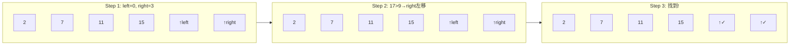

### 2.2 链表反转图解

```
反转前:  head → [1] → [2] → [3] → null

Step 0:  prev=null, curr=[1]
         null ← ? [1] → [2] → [3] → null
                  ↑curr

Step 1:  记 nxt=[2], 反转 [1]→null
         null ← [1]    [2] → [3] → null
           ↑prev ↑curr

Step 2:  记 nxt=[3], 反转 [2]→[1]
         null ← [1] ← [2]    [3] → null
                    ↑prev  ↑curr

Step 3:  反转 [3]→[2]
         null ← [1] ← [2] ← [3]
                            ↑prev
完成:    [3] → [2] → [1] → null
```

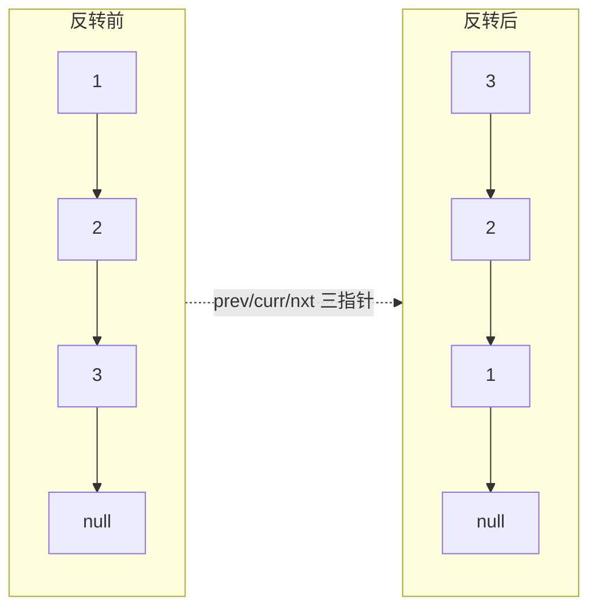

```java
// 反转链表 — 对照上图理解每一步
public ListNode reverseList(ListNode head) {
    ListNode prev = null, curr = head;
    while (curr != null) {
        ListNode next = curr.next;  // 1. 记下后继 (下一步要去哪)
        curr.next = prev;           // 2. 反转: 掉头指向前驱
        prev = curr;                // 3. prev 跟进一步
        curr = next;                // 4. curr 跟进一步
    }
    return prev;
}
```

### 2.3 环形检测 — 快慢指针

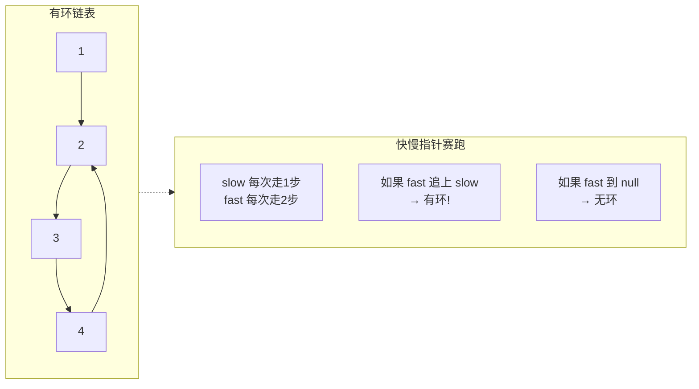

---

## 3. 栈与队列

### 3.1 单调栈 — 下一个更大元素

```
问题: 数组中每个元素右边第一个比它大的元素

nums = [2, 1, 2, 4, 3]

栈的视角 (从右往左看):

                        ┌───┐
  i=4, v=3 → push 3     │ 3 │   栈: [3]
                        └───┘
                        ┌───┐
  i=3, v=4 → pop 3     │ 4 │   栈: [4]  (3比4小, 被弹出)
                        └───┘
                        ┌───┐
  i=2, v=2 → 栈顶4>2   │ 2 │   栈: [4,2]  res[2]=4
                        │ 4 │
                        └───┘
                        ┌───┐
  i=1, v=1 → 栈顶2>1   │ 1 │   栈: [4,2,1]  res[1]=2
                        │ 2 │
                        │ 4 │
                        └───┘
                        ┌───┐
  i=0, v=2 → pop 1,2   │ 4 │   栈: [4]  res[0]=4
                        └───┘

结果: [4, 2, 4, -1, -1]
```

```java
public int[] nextGreaterElement(int[] nums) {
    int[] res = new int[nums.length];
    Arrays.fill(res, -1);
    Deque<Integer> stack = new ArrayDeque<>();  // 存索引

    for (int i = 0; i < nums.length; i++) {
        // ★ 当前元素比栈顶大 → 栈顶的答案找到了
        while (!stack.isEmpty() && nums[stack.peek()] < nums[i])
            res[stack.pop()] = nums[i];
        stack.push(i);
    }
    return res;
}
```

### 3.2 队列 — BFS 按层遍历的秘诀

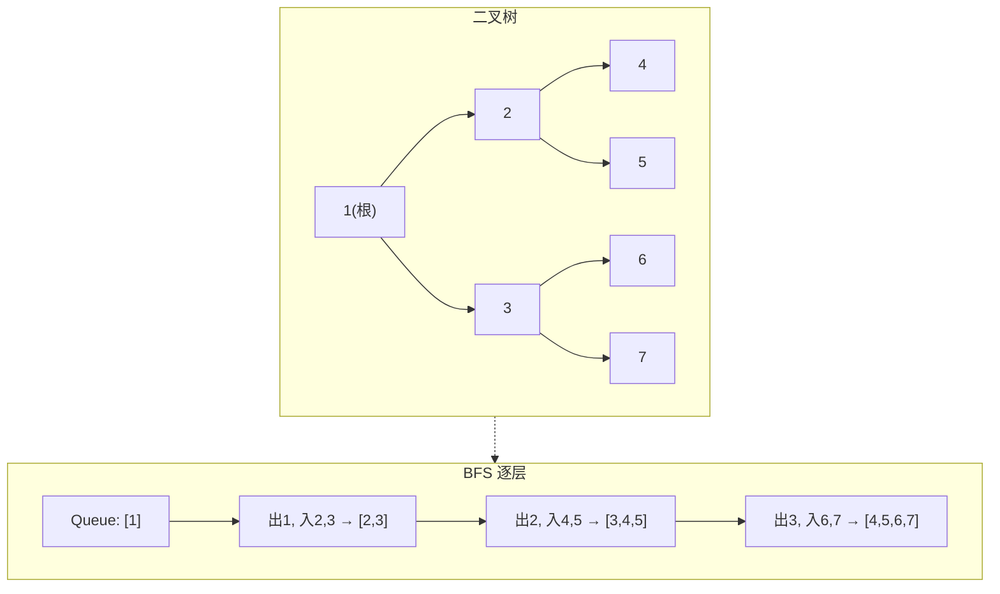

```java
// BFS 逐层处理的关键: for (int i = q.size(); i > 0; i--)
public List<List<Integer>> levelOrder(TreeNode root) {
    List<List<Integer>> res = new ArrayList<>();
    if (root == null) return res;
    Queue<TreeNode> q = new LinkedList<>(); q.offer(root);

    while (!q.isEmpty()) {
        List<Integer> level = new ArrayList<>();
        int size = q.size();  // ★ 关键: 当前层的节点数
        for (int i = 0; i < size; i++) {
            TreeNode node = q.poll();
            level.add(node.val);
            if (node.left != null) q.offer(node.left);
            if (node.right != null) q.offer(node.right);
        }
        res.add(level);
    }
    return res;
}
```

---

## 4. 哈希表

### 4.1 哈希冲突怎么解决？

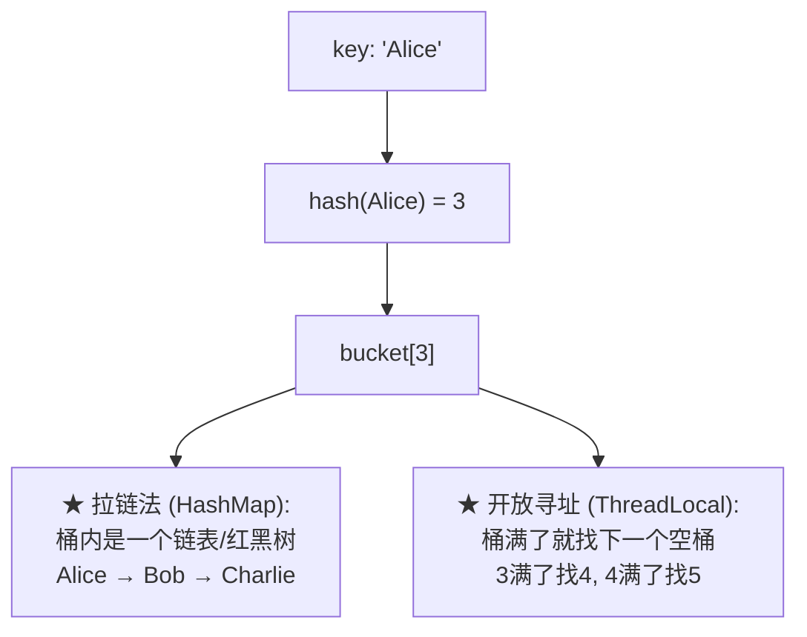

### 4.2 HashMap 为什么用 (n-1) & hash？

```
假设 table.length = 16 (n=16)

  n     = 16 = 0001 0000
  n-1   = 15 = 0000 1111

  hash  =      0101 1010
  n-1   =    & 0000 1111
  ─────────────────────
  index =      0000 1010 = 10

★ 本质: (n-1) & hash = hash % n
  但当 n = 2ᵏ 时, & 比 % 快 10+ 倍!
```

---

## 5. 排序算法

### 5.1 快排分区过程图解

```
快排是怎么把数组分成"小于 pivot"和"大于 pivot"的?

arr = [3, 1, 4, 1, 5, 9, 2, 6], pivot = arr[7] = 6

i=0: 3 < 6 → swap(0,0) → [3,1,4,1,5,9,2,6]  i=1
i=1: 1 < 6 → swap(1,1) → [3,1,4,1,5,9,2,6]  i=2
i=2: 4 < 6 → swap(2,2) → [3,1,4,1,5,9,2,6]  i=3
i=3: 1 < 6 → swap(3,3) → [3,1,4,1,5,9,2,6]  i=4
i=4: 5 < 6 → swap(4,4) → [3,1,4,1,5,9,2,6]  i=5
i=5: 9 > 6 → 不动                       i=5
i=6: 2 < 6 → swap(5,6) → [3,1,4,1,5,2,9,6]  i=6
最后: swap(i=6, hi=7) → [3,1,4,1,5,2, 6, 9]
                               ≤6的都在左边 ↑  ↑ ≥6的在右边
```

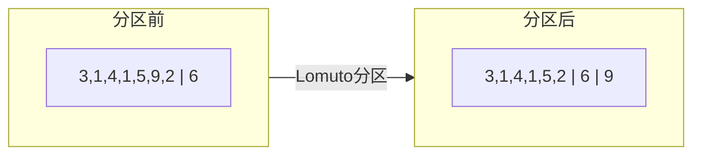

### 5.2 排序算法选择

| 场景 | 推荐 | 原因 |
|------|------|------|
| 通用 | Arrays.sort() | Dual-Pivot QuickSort |
| 对象排序 | **TimSort** (稳定) | 实际数据最优 |
| 需要稳定 | 归并排序 | 保持相等元素顺序 |
| 取 Top K | PriorityQueue / Quick Select | 不需要全排序 |
| 几乎有序 | 插入排序 | 接近 O(n) |

---

## 6. 二分查找

### 6.1 左边界 vs 右边界 — 一图搞懂

```
nums = [1, 2, 2, 2, 3, 4], target = 2

索引:  0  1  2  3  4  5
值:   [1, 2, 2, 2, 3, 4]
         ↑     ↑
    左边界=1  右边界=4 (第一个>2的位置)

二分查找:  返回 2 (任意一个2的位置)
lowerBound: 返回 1 (第一个 ≥ 2 的位置)
upperBound: 返回 4 (第一个 > 2 的位置)
```

```java
// 三个变体, 区别只在 if 条件
int binarySearch(int[] a, int t) { /* nums[mid] == t → 返回 */ }
int lowerBound(int[] a, int t)   { /* nums[mid] >= t → hi = mid */ }
int upperBound(int[] a, int t)   { /* nums[mid] >  t → hi = mid */ }
```

---

# 进阶篇

## 7. 二叉树

### 7.1 三种 DFS 遍历 — 一句话记一辈子

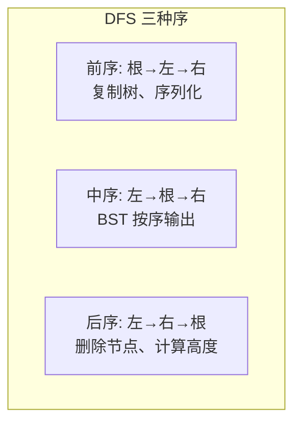

```
     1
    / \
   2   3
  / \
 4   5

前序: 1 → 2 → 4 → 5 → 3  (根最先)
中序: 4 → 2 → 5 → 1 → 3  (BST 有序: 从小到大!)
后序: 4 → 5 → 2 → 3 → 1  (子节点先, 根最后)
```

### 7.2 怎么从"前序+中序"还原一棵树？

```
前序: [3, 9, 20, 15, 7]  → 根是 3
中序: [9, 3, 15, 20, 7]  → 3 左边是左子树 [9], 右边是右子树 [15,20,7]

Step 1: 前序[0]=3 是根, 中序找到 3, 左边9是左, 右边15,20,7是右
Step 2: 左子树: 前序[9] 中序[9] → 9 是叶节点
Step 3: 右子树: 前序[20,15,7] 中序[15,20,7]
         → 20 是根, 中序找到20, 左边15是左, 右边7是右

还原:
        3
       / \
      9   20
         /  \
        15   7
```

```java
public TreeNode buildTree(int[] pre, int[] in) {
    // 用 HashMap 存中序索引, O(1) 找到 root 位置
    Map<Integer, Integer> map = new HashMap<>();
    for (int i = 0; i < in.length; i++) map.put(in[i], i);
    return build(pre, 0, pre.length-1, in, 0, in.length-1, map);
}
```

### 7.3 LCA 最近公共祖先

```
找节点 4 和 7 的最近公共祖先:

        3
       / \
      5   1
     / \ / \
    6  2 0  8
      / \
     7   4

★ 结论: 5

原理:
  从 root 开始:
    left = 找(4,7) 在左子树中的结果 → 返回 5
    right = 找(4,7) 在右子树中的结果 → 返回 null
    左有 5, 右为 null → 说明都在左边 → 返回 5
```

---

## 8. 堆与优先队列

### 8.1 堆的操作图解

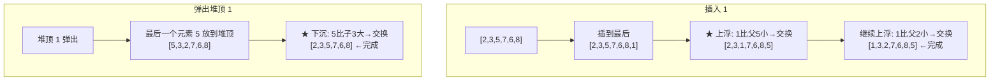

### 8.2 数据流中位数 — 双堆

```
流: [5] → [5,3] → [5,3,8] → [5,3,8,1]

大顶堆(存小数)    小顶堆(存大数)    中位数
   [5]              []              5
   [3]              [5]             4.0
   [5,3]            [8]             5
   [3,1]            [5,8]           4.0

★ 大顶堆存较小的一半, 小顶堆存较大的一半
  维护 lo.size >= hi.size
  中位数 = lo.size > hi.size ? lo.peek() : (lo+hi)/2
```

---

## 9. 回溯算法

### 9.1 决策树 — 全排列

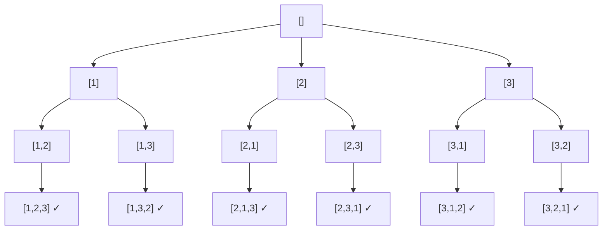

### 9.2 N 皇后

```
4 皇后问题 — 每行放一个皇后, 不能互相攻击

  . Q . .      . . Q .
  . . . Q      Q . . .
  Q . . .      . . . Q
  . . Q .      . Q . .

★ 约束: 不能同行 / 同列 / 同对角线
  对角线公式:  row-col 相同 = 同一主对角线
              row+col 相同 = 同一副对角线
```

---

## 10. 动态规划

### 10.1 01 背包 — 为什么倒序

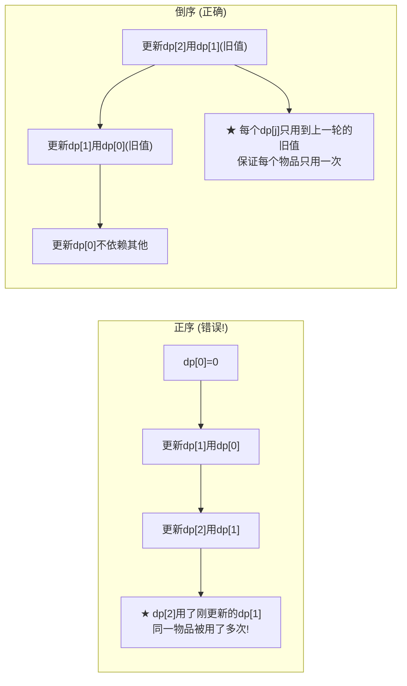

### 10.2 LIS — 纸牌游戏理解最长递增子序列

```
nums = [3, 5, 6, 2, 5, 4, 19, 5, 6, 7, 8, 2, 7, 8]

规则: 每张牌只能放在比它大的牌上面, 尽量放最左边.

牌堆:
  堆1: 3, 2, 2
  堆2: 5, 5, 4
  堆3: 6, 5, 5
  堆4: 19, 6, 6
  堆5: 7, 7
  堆6: 8, 8

★ LIS 长度 = 堆的数量 = 6
```

### 10.3 编辑距离 — 莱文斯坦距离

```
word1 = "horse", word2 = "ros"

dp 表格 (纵向: horse, 横向: ros):

    "" r  o  s
""   0  1  2  3
h    1  1  2  3
o    2  2  1  2
r    3  2  2  2
s    4  3  3  2
e    5  4  4  3  ← 答案: dp[5][3] = 3

操作:
  horse → rorse (h→r)
  rorse → rose  (删r)
  rose  → ros   (删e)
```

---

## 11. 图论

### 11.1 Dijkstra — 贪心找最短

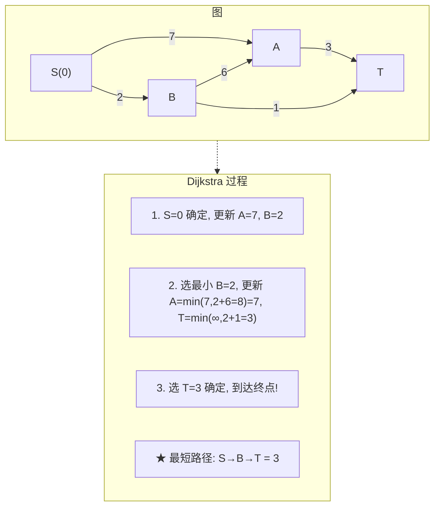

### 11.2 拓扑排序 — 选课顺序

```
课程依赖: A→C, B→C, C→D, C→E
(先修 A 和 B 才能修 C, 修完 C 才能修 D 和 E)

入度: A=0, B=0, C=2, D=1, E=1

BFS:
  Round 1: 入度为 0 的入队 → [A, B]
  Round 2: 出 A, C 入度-1=1; 出 B, C 入度-1=0 → C 入队 → [C]
  Round 3: 出 C, D入度=0, E入度=0 → [D, E]
  Round 4: 出 D, 出 E

结果: [A, B, C, D, E] (或者 [B, A, C, D, E] 等)
```

---

# 高级篇

## 12. Trie 前缀树

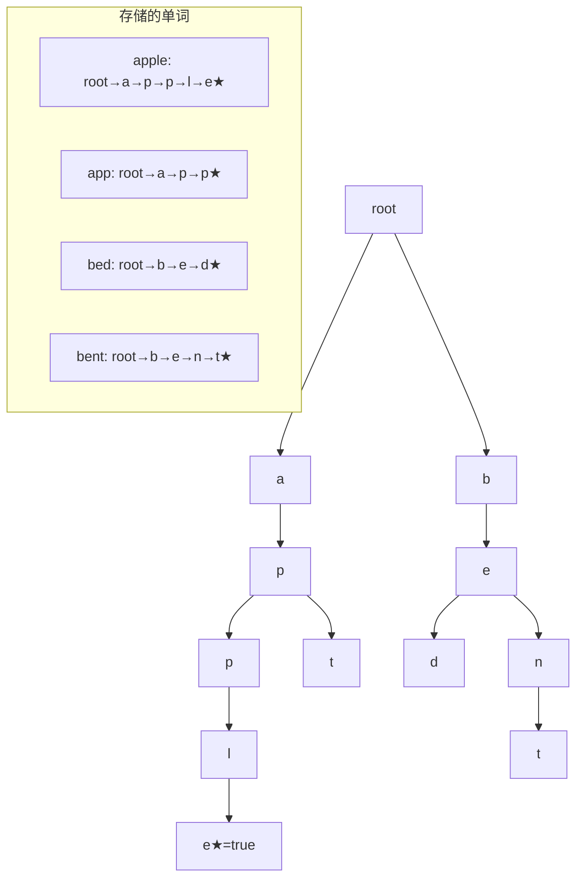

---

## 13. 并查集 Union-Find

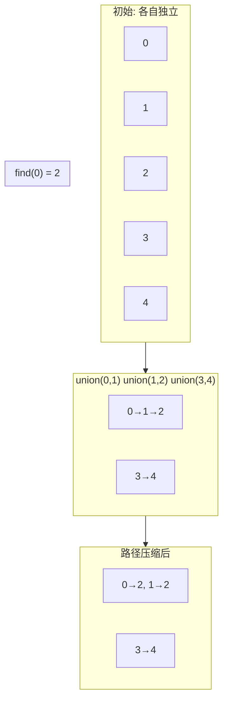

```
★ 两步优化:
  路径压缩: find 时把路径上所有节点直接连到根
  按秩合并: 小树连到大树下面, 避免退化成链表

  优化后: 操作近乎 O(1) (阿克曼函数反函数 α(n) ≤ 4)
```

---

## 14. 线段树与树状数组

### 14.1 线段树结构

```
原始数组: [1, 3, 5, 7, 9, 11]
线段树 (每个节点存区间和):

                     [0-5]sum=36
                    /           \
            [0-2]sum=9        [3-5]sum=27
           /        \         /        \
    [0-1]sum=4  [2]sum=5  [3-4]sum=16  [5]sum=11
     /      \
[0]sum=1  [1]sum=3

★ 查询 [1-4] 的和: [0-2]的右半 + [3-4] = 5 + 16 = 21
  不用遍历 5 个元素, 只需 2 次 O(log n)
```

### 14.2 树状数组 lowbit

```
lowbit = x & -x (取 x 二进制最低位的 1)

x=6   = 0110
-x    = 1010 (补码)
x&-x  = 0010 = 2

树状数组: tree[i] 管 [i-lowbit(i)+1, i] 区间的和

i=1 (0001): lowbit=1 → tree[1] 管 [1,1]
i=2 (0010): lowbit=2 → tree[2] 管 [1,2]
i=3 (0011): lowbit=1 → tree[3] 管 [3,3]
i=4 (0100): lowbit=4 → tree[4] 管 [1,4]
...
```

---

## 15. 字符串算法

### 15.1 KMP — next 数组的本质

```
pattern = "ababc"

next[i] = pattern[0..i] 的最长相同前后缀长度

i=0: "a"        → 前后缀 "" = 0      next[0]=0
i=1: "ab"       → 前后缀 "" = 0      next[1]=0
i=2: "aba"      → 前后缀 "a" = 1     next[2]=1
i=3: "abab"     → 前后缀 "ab" = 2    next[3]=2
i=4: "ababc"    → 前后缀 "" = 0      next[4]=0

next=[0,0,1,2,0]

★ 匹配失败时: j = next[j-1]
  (不用回到开头, 跳到"已知能匹配"的最长前缀位置继续试)
```

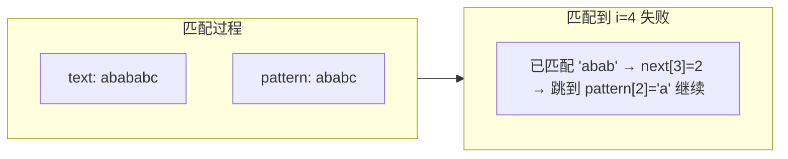

---

## 16. 位运算技巧

### 16.1 位运算全景

```
x & 1          → 判奇偶: 奇数返回1, 偶返回0
x & (x-1)      → ★ 消除最低位 1 (统计 1 的个数, 判 2 的幂)
x & -x         → ★ 获取最低位 1 (树状数组 lowbit)
x ^ x          → 0  (相同异或得 0)
x ^ 0          → x  (与 0 异或不变)
a ^ b ^ a      → b  (异或满足交换律, 可用于找唯一出现数)

举例: x=12 (1100)
  x-1  = 1011
  x&(x-1) = 1000 = 8  ← 最低位 1 被消除!
```

---

## 17. 设计模式题

### 17.1 LRU — 哈希表 + 双向链表

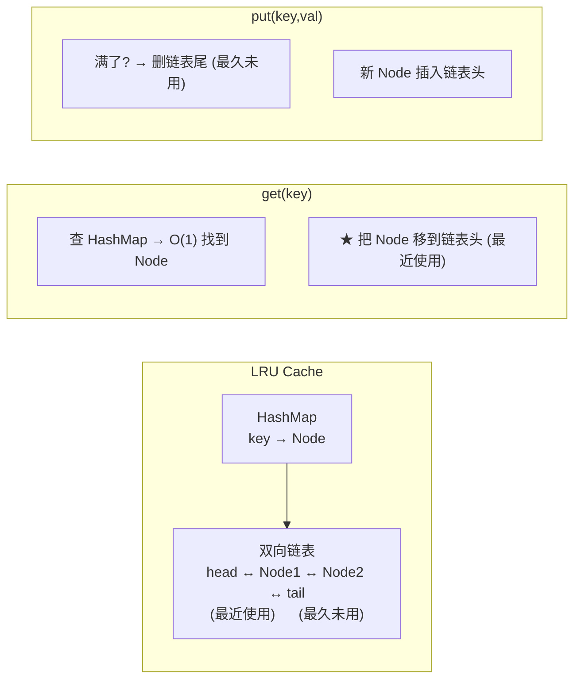

---

## 18. 算法在 Spring 全家桶中的应用

### 18.1 HashMap → IoC 容器三级缓存

```
Spring 为什么用 ConcurrentHashMap 存 Bean?

  getBean("userService") 的查找过程:
    L1 → L2 → L3, 每层都是 HashMap.get() = O(1)

  如果用 ArrayList: 1000 个 Bean, 平均查 500 次 = O(n)
  用 HashMap: 1 次 hash 运算 = O(1)
```

### 18.2 拓扑排序 → @DependsOn

```
@DependsOn("dataSource") → dataSource 必须在当前 Bean 之前初始化

Spring 内部: 对 Bean 依赖图做拓扑排序
  边的方向: 被依赖的 → 依赖它的 (B 被 A 依赖 → B→A)
  无环 → 生成拓扑序 → 依次初始化
  有环 → BeanCurrentlyInCreationException!
```

### 18.3 Trie 变体 → AntPathMatcher

```
URL 模式匹配: /api/users/**/orders

拆成: ["api", "users", "**", "orders"]
逐段匹配:
  /api → ✓
  /api/users → ✓
  /api/users/123 → ** 匹配任意段 ✓
  /api/users/123/orders → ✓

本质是 Trie 的通配符变体。
```

### 18.4 分治 → DispatcherServlet

```
doDispatch() 的三大步:

  getHandler()    → 分解: 找出谁处理这个请求
      ↓
  handle()        → 治理: 执行处理器 (Controller)
      ↓
  processResult() → 合并: 渲染结果 (JSON/HTML 返回)
```

### 18.5 LRU → Caffeine 缓存

```
Spring Cache 默认用 Caffeine (W-TinyLFU, LRU 的进化):

  @Cacheable("users")
  public User getUser(Long id) { ... }

  缓存满了 → 驱逐最不常用的条目
  底层: ConcurrentHashMap + 频率计数器
```

### 18.6 贪心 → MessageConverter 选择

```
返回 JSON 还是 XML? Spring 选第一个能处理的 Converter:

  for (HttpMessageConverter c : converters)
      if (c.canWrite(type)) return c;  // ★ 贪婪匹配

  converters 列表已排好序:
    1. MappingJackson2HttpMessageConverter (JSON)
    2. Jaxb2RootElementHttpMessageConverter (XML)
    ...
```

---

*全文 18 章图文版，每个算法配有图解 + 代码 + Spring 应用场景。*
