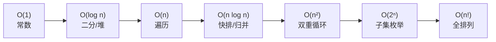
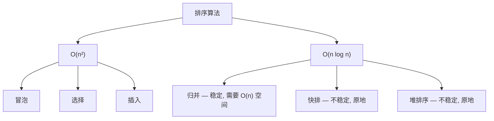
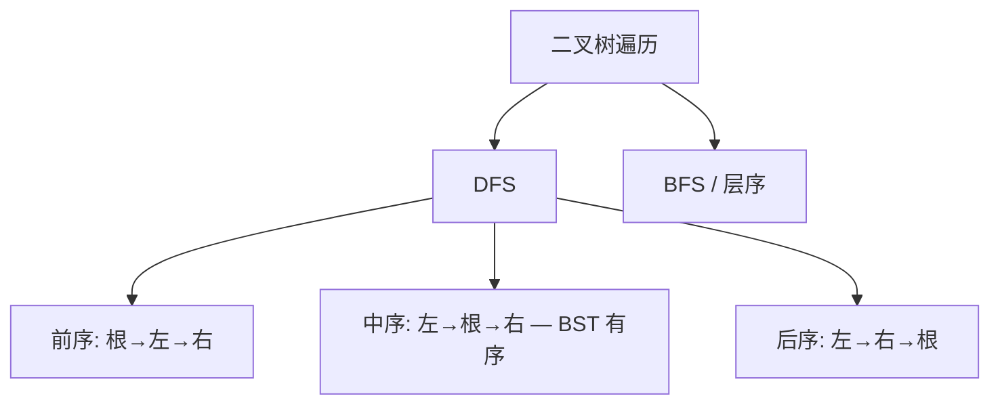

# 数据结构与算法深度解析 (Java 版)

> 从 O(n) 到 AC 自动机——体系化进阶路线，覆盖面试到竞赛。

---

## 目录

### 基础篇
- [1. 复杂度分析](#1-复杂度分析)
- [2. 数组与链表](#2-数组与链表)
- [3. 栈与队列](#3-栈与队列)
- [4. 哈希表](#4-哈希表)
- [5. 递归与分治](#5-递归与分治)
- [6. 排序算法](#6-排序算法)
- [7. 二分查找](#7-二分查找)

### 进阶篇
- [8. 二叉树](#8-二叉树)
- [9. 堆与优先队列](#9-堆与优先队列)
- [10. 贪心算法](#10-贪心算法)
- [11. 动态规划](#11-动态规划)
- [12. 回溯算法](#12-回溯算法)
- [13. 图论](#13-图论)

### 高级篇
- [14. Trie 前缀树](#14-trie-前缀树)
- [15. 并查集 Union-Find](#15-并查集-union-find)
- [16. 线段树与树状数组](#16-线段树与树状数组)
- [17. 字符串算法](#17-字符串算法)
- [18. 位运算技巧](#18-位运算技巧)
- [19. 设计模式题](#19-设计模式题)
- [20. 面试高频模板](#20-面试高频模板)

---

# 基础篇

## 1. 复杂度分析



| 复杂度 | 典型算法 | n=100 | n=10⁶ |
|--------|---------|-------|-------|
| O(1) | 哈希查找 | 瞬间 | 瞬间 |
| O(log n) | 二分搜索 | ~7次 | ~20次 |
| O(n) | 线性扫描 | 0.1ms | 1ms |
| O(n log n) | 归并排序 | 0.7ms | 20ms |
| O(n²) | 选择排序 | 10ms | **17分钟** ❌ |
| O(2ⁿ) | 子集枚举 | **不可行** | ❌ |

### 1.2 主定理

```
T(n) = a·T(n/b) + f(n)

归并排序: T(n) = 2T(n/2) + n
  a=2, b=2, log₂2=1, f(n)=n → 情况2 → O(n log n)

二分查找: T(n) = T(n/2) + 1
  a=1, b=2, log₂1=0, f(n)=1 → 情况2 → O(log n)
```

---

## 2. 数组与链表

### 2.1 双指针 — 解决 80% 数组题

```java
// 对撞指针: 两数之和 II
public int[] twoSum(int[] nums, int target) {
    int left = 0, right = nums.length - 1;
    while (left < right) {
        int sum = nums[left] + nums[right];
        if (sum == target) return new int[]{left + 1, right + 1};
        else if (sum < target) left++;
        else right--;
    }
    return new int[]{-1, -1};
}

// 快慢指针: 原地去重
public int removeDuplicates(int[] nums) {
    int slow = 0;
    for (int fast = 1; fast < nums.length; fast++) {
        if (nums[fast] != nums[slow]) {
            slow++;
            nums[slow] = nums[fast];
        }
    }
    return slow + 1;
}

// 滑动窗口: 定长子数组最大和
public int maxSumSubarray(int[] nums, int k) {
    int windowSum = 0;
    for (int i = 0; i < k; i++) windowSum += nums[i];
    int maxSum = windowSum;
    for (int i = k; i < nums.length; i++) {
        windowSum += nums[i] - nums[i - k];
        maxSum = Math.max(maxSum, windowSum);
    }
    return maxSum;
}
```

### 2.2 链表核心

```java
class ListNode {
    int val;
    ListNode next;
    ListNode(int val) { this.val = val; }
    ListNode(int val, ListNode next) { this.val = val; this.next = next; }
}

// ★ 反转链表 (迭代)
public ListNode reverseList(ListNode head) {
    ListNode prev = null, curr = head;
    while (curr != null) {
        ListNode next = curr.next;  // 1. 记下后继
        curr.next = prev;           // 2. 反转指向
        prev = curr;                // 3. prev 前进
        curr = next;                // 4. curr 前进
    }
    return prev;
}

// 反转链表 (递归)
public ListNode reverseListRecursive(ListNode head) {
    if (head == null || head.next == null) return head;
    ListNode newHead = reverseListRecursive(head.next);
    head.next.next = head;  // ★ 后驱指回自己
    head.next = null;
    return newHead;
}

// ★ 快慢指针: 判环
public boolean hasCycle(ListNode head) {
    ListNode slow = head, fast = head;
    while (fast != null && fast.next != null) {
        slow = slow.next;
        fast = fast.next.next;
        if (slow == fast) return true;
    }
    return false;
}

// ★ 哑节点: 简化删除
public ListNode removeElements(ListNode head, int val) {
    ListNode dummy = new ListNode(0, head);
    ListNode curr = dummy;
    while (curr.next != null) {
        if (curr.next.val == val) curr.next = curr.next.next;
        else curr = curr.next;
    }
    return dummy.next;
}
```

### 2.3 数组 vs 链表

| 操作 | 数组 | 链表 |
|------|------|------|
| 随机访问 get(i) | O(1) | O(n) |
| 头部插入 | O(n) | O(1) |
| 尾部追加 | O(1)* | O(1) |
| 中间插入 | O(n) | O(1)* |
| 删除 | O(n) | O(1)* |

---

## 3. 栈与队列

### 3.1 单调栈 — 下一个更大元素

```java
public int[] nextGreaterElement(int[] nums) {
    int[] res = new int[nums.length];
    Arrays.fill(res, -1);
    Deque<Integer> stack = new ArrayDeque<>();  // 存索引, 栈内值递减
    
    for (int i = 0; i < nums.length; i++) {
        while (!stack.isEmpty() && nums[stack.peek()] < nums[i]) {
            res[stack.pop()] = nums[i];
        }
        stack.push(i);
    }
    return res;
}

// 有效的括号
public boolean isValid(String s) {
    Deque<Character> stack = new ArrayDeque<>();
    for (char ch : s.toCharArray()) {
        if (ch == '(' || ch == '[' || ch == '{') {
            stack.push(ch);
        } else {
            if (stack.isEmpty()) return false;
            char top = stack.pop();
            if (ch == ')' && top != '(') return false;
            if (ch == ']' && top != '[') return false;
            if (ch == '}' && top != '{') return false;
        }
    }
    return stack.isEmpty();
}
```

### 3.2 单调队列 — 滑动窗口最大值

```java
public int[] maxSlidingWindow(int[] nums, int k) {
    Deque<Integer> dq = new ArrayDeque<>();  // 存索引, 队首最大
    int[] res = new int[nums.length - k + 1];
    
    for (int i = 0; i < nums.length; i++) {
        if (!dq.isEmpty() && dq.peekFirst() <= i - k) dq.pollFirst();
        while (!dq.isEmpty() && nums[dq.peekLast()] < nums[i]) dq.pollLast();
        dq.offerLast(i);
        if (i >= k - 1) res[i - k + 1] = nums[dq.peekFirst()];
    }
    return res;
}
```

---

## 4. 哈希表

```java
// ★ 两数之和 — HashMap O(n)
public int[] twoSum(int[] nums, int target) {
    Map<Integer, Integer> map = new HashMap<>();  // val → index
    for (int i = 0; i < nums.length; i++) {
        int complement = target - nums[i];
        if (map.containsKey(complement))
            return new int[]{map.get(complement), i};
        map.put(nums[i], i);
    }
    return new int[]{-1, -1};
}

// ★ 最长无重复子串 — 滑动窗口 + HashMap
public int lengthOfLongestSubstring(String s) {
    Map<Character, Integer> lastSeen = new HashMap<>();
    int left = 0, maxLen = 0;
    for (int right = 0; right < s.length(); right++) {
        char ch = s.charAt(right);
        if (lastSeen.containsKey(ch) && lastSeen.get(ch) >= left) {
            left = lastSeen.get(ch) + 1;
        }
        lastSeen.put(ch, right);
        maxLen = Math.max(maxLen, right - left + 1);
    }
    return maxLen;
}
```

---

## 5. 递归与分治

```java
// ★ 归并排序 — 分治经典
public void mergeSort(int[] arr, int lo, int hi) {
    if (lo >= hi) return;
    int mid = lo + (hi - lo) / 2;
    mergeSort(arr, lo, mid);
    mergeSort(arr, mid + 1, hi);
    merge(arr, lo, mid, hi);
}

private void merge(int[] arr, int lo, int mid, int hi) {
    int[] temp = new int[hi - lo + 1];
    int i = lo, j = mid + 1, k = 0;
    while (i <= mid && j <= hi) {
        temp[k++] = arr[i] <= arr[j] ? arr[i++] : arr[j++];
    }
    while (i <= mid) temp[k++] = arr[i++];
    while (j <= hi) temp[k++] = arr[j++];
    System.arraycopy(temp, 0, arr, lo, temp.length);
}

// 记忆化递归 — 斐波那契
Map<Integer, Integer> memo = new HashMap<>();

public int fib(int n) {
    if (n <= 1) return n;
    if (memo.containsKey(n)) return memo.get(n);
    int val = fib(n - 1) + fib(n - 2);
    memo.put(n, val);
    return val;
}
```

---

## 6. 排序算法



```java
// ★ 快速排序 (Lomuto 分区)
public void quickSort(int[] arr, int lo, int hi) {
    if (lo >= hi) return;
    int pivot = arr[hi], i = lo;
    for (int j = lo; j < hi; j++) {
        if (arr[j] <= pivot) {
            swap(arr, i, j); i++;
        }
    }
    swap(arr, i, hi);
    quickSort(arr, lo, i - 1);
    quickSort(arr, i + 1, hi);
}

// ★ Quick Select — 第 K 大 O(n) 平均
public int findKthLargest(int[] nums, int k) {
    k = nums.length - k;  // 转第 k 小
    return quickSelect(nums, 0, nums.length - 1, k);
}

private int quickSelect(int[] nums, int lo, int hi, int k) {
    int pivot = nums[hi], i = lo;
    for (int j = lo; j < hi; j++) {
        if (nums[j] <= pivot) { swap(nums, i, j); i++; }
    }
    swap(nums, i, hi);
    if (i == k) return nums[i];
    return i < k ? quickSelect(nums, i + 1, hi, k) : quickSelect(nums, lo, i - 1, k);
}

private void swap(int[] arr, int i, int j) {
    int tmp = arr[i]; arr[i] = arr[j]; arr[j] = tmp;
}
```

---

## 7. 二分查找

```java
// ★ 精确查找
public int binarySearch(int[] nums, int target) {
    int lo = 0, hi = nums.length - 1;
    while (lo <= hi) {
        int mid = lo + (hi - lo) / 2;  // ★ 防溢出
        if (nums[mid] == target) return mid;
        else if (nums[mid] < target) lo = mid + 1;
        else hi = mid - 1;
    }
    return -1;
}

// ★ 左边界 (第一个 ≥ target)
public int lowerBound(int[] nums, int target) {
    int lo = 0, hi = nums.length;
    while (lo < hi) {
        int mid = lo + (hi - lo) / 2;
        if (nums[mid] >= target) hi = mid;
        else lo = mid + 1;
    }
    return lo;
}

// ★ 右边界 (第一个 > target)
public int upperBound(int[] nums, int target) {
    int lo = 0, hi = nums.length;
    while (lo < hi) {
        int mid = lo + (hi - lo) / 2;
        if (nums[mid] > target) hi = mid;
        else lo = mid + 1;
    }
    return lo;
}
```

---

# 进阶篇

## 8. 二叉树



```java
class TreeNode {
    int val;
    TreeNode left, right;
    TreeNode(int val) { this.val = val; }
}

// ★ 迭代中序
public List<Integer> inorderTraversal(TreeNode root) {
    List<Integer> res = new ArrayList<>();
    Deque<TreeNode> stack = new ArrayDeque<>();
    TreeNode curr = root;
    while (curr != null || !stack.isEmpty()) {
        while (curr != null) {         // 1. 一路向左
            stack.push(curr);
            curr = curr.left;
        }
        curr = stack.pop();            // 2. 处理节点
        res.add(curr.val);
        curr = curr.right;             // 3. 转向右子树
    }
    return res;
}

// ★ 前序+中序 → 构建
public TreeNode buildTree(int[] preorder, int[] inorder) {
    Map<Integer, Integer> inMap = new HashMap<>();
    for (int i = 0; i < inorder.length; i++) inMap.put(inorder[i], i);
    return build(preorder, 0, preorder.length - 1, inorder, 0, inorder.length - 1, inMap);
}

private TreeNode build(int[] pre, int ps, int pe, int[] in, 
                       int is_, int ie, Map<Integer, Integer> inMap) {
    if (ps > pe) return null;
    TreeNode root = new TreeNode(pre[ps]);
    int split = inMap.get(root.val);
    int leftSize = split - is_;
    root.left = build(pre, ps + 1, ps + leftSize, in, is_, split - 1, inMap);
    root.right = build(pre, ps + leftSize + 1, pe, in, split + 1, ie, inMap);
    return root;
}

// ★ 验证 BST
public boolean isValidBST(TreeNode root) {
    return isValidBST(root, Long.MIN_VALUE, Long.MAX_VALUE);
}

private boolean isValidBST(TreeNode node, long lo, long hi) {
    if (node == null) return true;
    if (node.val <= lo || node.val >= hi) return false;
    return isValidBST(node.left, lo, node.val) && 
           isValidBST(node.right, node.val, hi);
}

// ★ LCA 最近公共祖先
public TreeNode lowestCommonAncestor(TreeNode root, TreeNode p, TreeNode q) {
    if (root == null || root == p || root == q) return root;
    TreeNode left = lowestCommonAncestor(root.left, p, q);
    TreeNode right = lowestCommonAncestor(root.right, p, q);
    if (left != null && right != null) return root;
    return left != null ? left : right;
}
```

---

## 9. 堆与优先队列

```java
// ★ Top K — 小顶堆
public int[] topK(int[] nums, int k) {
    PriorityQueue<Integer> pq = new PriorityQueue<>();  // 默认小顶堆
    for (int num : nums) {
        pq.offer(num);
        if (pq.size() > k) pq.poll();
    }
    return pq.stream().mapToInt(i -> i).toArray();
}

// ★ 合并 K 个有序链表
public ListNode mergeKLists(ListNode[] lists) {
    PriorityQueue<ListNode> pq = new PriorityQueue<>((a, b) -> a.val - b.val);
    for (ListNode node : lists) if (node != null) pq.offer(node);
    
    ListNode dummy = new ListNode(0), curr = dummy;
    while (!pq.isEmpty()) {
        ListNode min = pq.poll();
        curr.next = min; curr = curr.next;
        if (min.next != null) pq.offer(min.next);
    }
    return dummy.next;
}

// ★ 数据流中位数 — 双堆
class MedianFinder {
    private PriorityQueue<Integer> lo;  // 大顶堆 — 较小一半
    private PriorityQueue<Integer> hi;  // 小顶堆 — 较大一半
    
    public MedianFinder() {
        lo = new PriorityQueue<>((a, b) -> b - a);  // 反向 = 大顶堆
        hi = new PriorityQueue<>();
    }
    
    public void addNum(int num) {
        lo.offer(num);
        hi.offer(lo.poll());
        if (hi.size() > lo.size()) lo.offer(hi.poll());
    }
    
    public double findMedian() {
        if (lo.size() > hi.size()) return lo.peek();
        return (lo.peek() + hi.peek()) / 2.0;
    }
}
```

---

## 10. 贪心算法

```java
// ★ 跳跃游戏 — 最远可达
public boolean canJump(int[] nums) {
    int farthest = 0;
    for (int i = 0; i < nums.length; i++) {
        if (i > farthest) return false;
        farthest = Math.max(farthest, i + nums[i]);
    }
    return true;
}

// ★ 区间调度 — 最多不重叠区间
public int maxNonOverlapping(int[][] intervals) {
    Arrays.sort(intervals, (a, b) -> a[1] - b[1]);  // 按结束排序
    int count = 0, end = Integer.MIN_VALUE;
    for (int[] it : intervals) {
        if (it[0] >= end) { count++; end = it[1]; }
    }
    return count;
}
```

---

## 11. 动态规划

```java
// ★ 01 背包
public int knapsack(int[] weights, int[] values, int capacity) {
    int[] dp = new int[capacity + 1];
    for (int i = 0; i < weights.length; i++) {
        for (int j = capacity; j >= weights[i]; j--) {  // ★ 倒序
            dp[j] = Math.max(dp[j], dp[j - weights[i]] + values[i]);
        }
    }
    return dp[capacity];
}

// ★ 最长递增子序列 LIS — O(n log n)
public int lengthOfLIS(int[] nums) {
    List<Integer> tails = new ArrayList<>();
    for (int num : nums) {
        int i = Collections.binarySearch(tails, num);
        if (i < 0) i = -(i + 1);
        if (i == tails.size()) tails.add(num);
        else tails.set(i, num);
    }
    return tails.size();
}

// ★ 编辑距离
public int minDistance(String word1, String word2) {
    int m = word1.length(), n = word2.length();
    int[][] dp = new int[m + 1][n + 1];
    for (int i = 0; i <= m; i++) dp[i][0] = i;
    for (int j = 0; j <= n; j++) dp[0][j] = j;
    
    for (int i = 1; i <= m; i++) {
        for (int j = 1; j <= n; j++) {
            if (word1.charAt(i-1) == word2.charAt(j-1))
                dp[i][j] = dp[i-1][j-1];
            else
                dp[i][j] = 1 + Math.min(dp[i-1][j], 
                           Math.min(dp[i][j-1], dp[i-1][j-1]));
        }
    }
    return dp[m][n];
}

// ★ 最长公共子序列 LCS
public int longestCommonSubsequence(String text1, String text2) {
    int m = text1.length(), n = text2.length();
    int[][] dp = new int[m + 1][n + 1];
    for (int i = 1; i <= m; i++) {
        for (int j = 1; j <= n; j++) {
            if (text1.charAt(i-1) == text2.charAt(j-1))
                dp[i][j] = dp[i-1][j-1] + 1;
            else
                dp[i][j] = Math.max(dp[i-1][j], dp[i][j-1]);
        }
    }
    return dp[m][n];
}
```

---

## 12. 回溯算法

```java
// ★ 全排列
public List<List<Integer>> permute(int[] nums) {
    List<List<Integer>> res = new ArrayList<>();
    backtrack(res, new ArrayList<>(), nums, new boolean[nums.length]);
    return res;
}

private void backtrack(List<List<Integer>> res, List<Integer> path,
                       int[] nums, boolean[] used) {
    if (path.size() == nums.length) { res.add(new ArrayList<>(path)); return; }
    for (int i = 0; i < nums.length; i++) {
        if (used[i]) continue;
        used[i] = true; path.add(nums[i]);
        backtrack(res, path, nums, used);
        path.remove(path.size() - 1); used[i] = false;
    }
}

// ★ 子集
public List<List<Integer>> subsets(int[] nums) {
    List<List<Integer>> res = new ArrayList<>();
    backtrackSub(res, new ArrayList<>(), nums, 0);
    return res;
}

private void backtrackSub(List<List<Integer>> res, List<Integer> path,
                          int[] nums, int start) {
    res.add(new ArrayList<>(path));  // ★ 每个节点都是答案
    for (int i = start; i < nums.length; i++) {
        path.add(nums[i]);
        backtrackSub(res, path, nums, i + 1);
        path.remove(path.size() - 1);
    }
}

// ★ N 皇后
public List<List<String>> solveNQueens(int n) {
    List<List<String>> res = new ArrayList<>();
    char[][] board = new char[n][n];
    for (char[] row : board) Arrays.fill(row, '.');
    boolean[] cols = new boolean[n];
    boolean[] diag1 = new boolean[2 * n];  // row - col + n
    boolean[] diag2 = new boolean[2 * n];  // row + col
    backtrackNQ(res, board, 0, cols, diag1, diag2);
    return res;
}
```

---

## 13. 图论

```java
// ★ 拓扑排序 (BFS / Kahn)
public int[] topologicalSort(int n, int[][] edges) {
    int[] indegree = new int[n];
    List<Integer>[] graph = new ArrayList[n];
    for (int i = 0; i < n; i++) graph[i] = new ArrayList<>();
    for (int[] e : edges) { graph[e[0]].add(e[1]); indegree[e[1]]++; }
    
    Queue<Integer> q = new LinkedList<>();
    for (int i = 0; i < n; i++) if (indegree[i] == 0) q.offer(i);
    
    int[] order = new int[n]; int idx = 0;
    while (!q.isEmpty()) {
        int node = q.poll(); order[idx++] = node;
        for (int nb : graph[node]) {
            if (--indegree[nb] == 0) q.offer(nb);
        }
    }
    return idx == n ? order : new int[0];
}

// ★ Dijkstra
public Map<Integer, Integer> dijkstra(Map<Integer, List<int[]>> graph, int start) {
    Map<Integer, Integer> dist = new HashMap<>();
    for (int node : graph.keySet()) dist.put(node, Integer.MAX_VALUE);
    dist.put(start, 0);
    
    PriorityQueue<int[]> pq = new PriorityQueue<>((a, b) -> a[1] - b[1]);
    pq.offer(new int[]{start, 0});
    
    while (!pq.isEmpty()) {
        int[] cur = pq.poll();
        int node = cur[0], d = cur[1];
        if (d > dist.get(node)) continue;  // ★ 懒惰删除
        for (int[] edge : graph.get(node)) {
            int nb = edge[0], w = edge[1];
            if (dist.get(node) + w < dist.get(nb)) {
                dist.put(nb, dist.get(node) + w);
                pq.offer(new int[]{nb, dist.get(nb)});
            }
        }
    }
    return dist;
}
```

---

# 高级篇

## 14. Trie 前缀树

```java
class TrieNode {
    TrieNode[] children = new TrieNode[26];
    boolean isEnd;
}

class Trie {
    private TrieNode root = new TrieNode();
    
    public void insert(String word) {
        TrieNode node = root;
        for (char ch : word.toCharArray()) {
            int idx = ch - 'a';
            if (node.children[idx] == null) node.children[idx] = new TrieNode();
            node = node.children[idx];
        }
        node.isEnd = true;
    }
    
    public boolean search(String word) {
        TrieNode node = find(word);
        return node != null && node.isEnd;
    }
    
    public boolean startsWith(String prefix) {
        return find(prefix) != null;
    }
    
    private TrieNode find(String prefix) {
        TrieNode node = root;
        for (char ch : prefix.toCharArray()) {
            int idx = ch - 'a';
            if (node.children[idx] == null) return null;
            node = node.children[idx];
        }
        return node;
    }
}
```

---

## 15. 并查集 Union-Find

```java
class UnionFind {
    private int[] parent, rank;
    
    public UnionFind(int n) {
        parent = new int[n]; rank = new int[n];
        for (int i = 0; i < n; i++) parent[i] = i;
    }
    
    public int find(int x) {
        if (parent[x] != x) parent[x] = find(parent[x]);  // ★ 路径压缩
        return parent[x];
    }
    
    public boolean union(int x, int y) {
        int px = find(x), py = find(y);
        if (px == py) return false;
        if (rank[px] < rank[py]) parent[px] = py;
        else if (rank[px] > rank[py]) parent[py] = px;
        else { parent[py] = px; rank[px]++; }
        return true;
    }
}
```

---

## 16. 线段树与树状数组

```java
// ★ 树状数组 BIT — 单点更新 + 区间查询 O(log n)
class BIT {
    private int[] tree;
    public BIT(int n) { tree = new int[n + 1]; }
    
    public void update(int i, int delta) {
        while (i < tree.length) {
            tree[i] += delta; i += i & -i;  // ★ lowbit
        }
    }
    
    public int query(int i) {
        int sum = 0;
        while (i > 0) { sum += tree[i]; i -= i & -i; }
        return sum;
    }
    
    public int rangeSum(int l, int r) {
        return query(r) - query(l - 1);
    }
}

// ★ 线段树 — 区间更新 + 区间查询
class SegmentTree {
    private int[] tree, lazy; private int n;
    
    public SegmentTree(int[] nums) {
        n = nums.length; tree = new int[4 * n]; lazy = new int[4 * n];
        build(nums, 0, 0, n - 1);
    }
    
    private void build(int[] nums, int node, int lo, int hi) {
        if (lo == hi) { tree[node] = nums[lo]; return; }
        int mid = lo + (hi - lo) / 2;
        build(nums, node * 2 + 1, lo, mid);
        build(nums, node * 2 + 2, mid + 1, hi);
        tree[node] = tree[node * 2 + 1] + tree[node * 2 + 2];
    }
    
    public void updateRange(int l, int r, int val) {
        updateRange(0, 0, n - 1, l, r, val);
    }
    
    private void updateRange(int node, int lo, int hi, int l, int r, int val) {
        if (lazy[node] != 0) {
            tree[node] += (hi - lo + 1) * lazy[node];
            if (lo != hi) { lazy[node*2+1] += lazy[node]; lazy[node*2+2] += lazy[node]; }
            lazy[node] = 0;
        }
        if (lo > r || hi < l) return;
        if (l <= lo && hi <= r) {
            tree[node] += (hi - lo + 1) * val;
            if (lo != hi) { lazy[node*2+1] += val; lazy[node*2+2] += val; }
            return;
        }
        int mid = lo + (hi - lo) / 2;
        updateRange(node * 2 + 1, lo, mid, l, r, val);
        updateRange(node * 2 + 2, mid + 1, hi, l, r, val);
        tree[node] = tree[node * 2 + 1] + tree[node * 2 + 2];
    }
}
```

---

## 17. 字符串算法

```java
// ★ KMP — O(n+m)
public int kmp(String text, String pattern) {
    int[] next = buildNext(pattern);
    int j = 0;
    for (int i = 0; i < text.length(); i++) {
        while (j > 0 && text.charAt(i) != pattern.charAt(j)) j = next[j - 1];
        if (text.charAt(i) == pattern.charAt(j)) j++;
        if (j == pattern.length()) return i - j + 1;
    }
    return -1;
}

private int[] buildNext(String pattern) {
    int[] next = new int[pattern.length()];
    for (int i = 1, j = 0; i < pattern.length(); i++) {
        while (j > 0 && pattern.charAt(i) != pattern.charAt(j)) j = next[j - 1];
        if (pattern.charAt(i) == pattern.charAt(j)) j++;
        next[i] = j;
    }
    return next;
}
```

---

## 18. 位运算技巧

```java
x & 1          // 判奇偶
x & (x - 1)    // ★ 消除最低位 1
x & -x         // ★ 获取最低位 1 (lowbit)
x | (1 << i)   // 设置第 i 位为 1
x ^ (1 << i)   // 翻转第 i 位

// ★ 统计 1 的个数
int countOnes(int n) {
    int count = 0;
    while (n != 0) { n &= n - 1; count++; }
    return count;
}

// ★ 只出现一次的数
int singleNumber(int[] nums) {
    int res = 0;
    for (int n : nums) res ^= n;  // a ^ a = 0
    return res;
}

// ★ 快速幂
long powMod(long x, long n, long mod) {
    long res = 1;
    while (n > 0) {
        if ((n & 1) == 1) res = res * x % mod;
        x = x * x % mod; n >>= 1;
    }
    return res;
}
```

---

## 19. 设计模式题

```java
// ★ LRU Cache
class LRUCache {
    private LinkedHashMap<Integer, Integer> map;
    private int cap;
    
    public LRUCache(int capacity) {
        cap = capacity;
        map = new LinkedHashMap<>(capacity, 0.75f, true) {
            @Override
            protected boolean removeEldestEntry(Map.Entry<Integer, Integer> eldest) {
                return size() > cap;
            }
        };
    }
    
    public int get(int key) { return map.getOrDefault(key, -1); }
    public void put(int key, int value) { map.put(key, value); }
}
```

---

## 20. 面试高频模板

### 20.1 解题套路

| 问题特征 | 算法 | 数据结构 |
|----------|------|----------|
| 求所有解 | **回溯** | List + boolean[] used |
| 求最优解 | **DP** | int[] dp / int[][] dp |
| 求 Top K | **堆** | PriorityQueue |
| 数组有序 | **二分/双指针** | while (lo < hi) |
| 树的问题 | **DFS/BFS** | 递归 / Queue |
| 图的最短路径 | **Dijkstra/BFS** | PriorityQueue |
| 连通性 | **并查集** | int[] parent |
| 前缀匹配 | **Trie** | TrieNode[] |

### 20.2 时间复杂度判断

```
n ≤ 10      → O(n!)    全排列
n ≤ 20      → O(2ⁿ)    子集枚举
n ≤ 100     → O(n³)    Floyd, 区间 DP
n ≤ 1000    → O(n²)    简单 DP
n ≤ 10⁵     → O(n log n) 排序
n ≤ 10⁶     → O(n)     扫描, BFS
n ≤ 10⁹     → O(log n) 二分
```

### 20.3 Java 常用方法

```java
// 排序
Arrays.sort(arr);
Arrays.sort(arr, (a, b) -> b - a);  // 降序

// 二分
int idx = Arrays.binarySearch(arr, target);
if (idx < 0) idx = -(idx + 1);  // 插入点

// 集合
List<Integer> list = new ArrayList<>();
Set<Integer> set = new HashSet<>();
Map<Integer, Integer> map = new HashMap<>();
Deque<Integer> stack = new ArrayDeque<>();
Queue<Integer> queue = new LinkedList<>();
PriorityQueue<Integer> minHeap = new PriorityQueue<>();
PriorityQueue<Integer> maxHeap = new PriorityQueue<>((a, b) -> b - a);

// 流式操作
int[] arr = list.stream().mapToInt(i -> i).toArray();
long count = list.stream().filter(x -> x > 0).count();
```

---

## 21. 布隆过滤器 Bloom Filter

**应用**：Redis 缓存穿透防护、Google BigTable、Chrome 恶意 URL 检测。

```java
// 用 BitSet + 多个 Hash 函数实现
class BloomFilter {
    private BitSet bits;
    private int size, hashCount;
    
    public BloomFilter(int expectedSize, double fpp) {
        // n = 预期插入量, p = 误判率
        size = (int) (-expectedSize * Math.log(fpp) / (Math.log(2) * Math.log(2)));
        hashCount = (int) (size / expectedSize * Math.log(2));
        bits = new BitSet(size);
    }
    
    public void add(String s) {
        for (int i = 0; i < hashCount; i++) {
            bits.set(hash(s, i) % size);
        }
    }
    
    public boolean mightContain(String s) {
        for (int i = 0; i < hashCount; i++) {
            if (!bits.get(hash(s, i) % size)) return false;
        }
        return true;
    }
    
    private int hash(String s, int seed) {
        int h = seed;
        for (char c : s.toCharArray()) h = h * 31 + c;
        return Math.abs(h);
    }
}
```

| 特性 | 说明 |
|------|------|
| 空间 | 极小 (1 亿数据 ~120MB) |
| 查询 | O(k), k = hash 次数 |
| 误报 | 可能说"有"但实际"没有" |
| 漏报 | 不可能说"没有"但实际"有" |

---

## 22. 跳表 Skip List

**应用**：Redis ZSet 底层、LevelDB MemTable。

```java
class SkipListNode {
    int val;
    SkipListNode[] next;  // next[i] = 第 i 层的下一个节点
    
    public SkipListNode(int val, int level) {
        this.val = val;
        this.next = new SkipListNode[level + 1];
    }
}

class SkipList {
    private static final double P = 0.5;
    private static final int MAX_LEVEL = 16;
    private SkipListNode head;
    private int level;
    private Random rand = new Random();
    
    public SkipList() {
        head = new SkipListNode(Integer.MIN_VALUE, MAX_LEVEL);
        level = 0;
    }
    
    public boolean search(int target) {
        SkipListNode cur = head;
        for (int i = level; i >= 0; i--) {
            while (cur.next[i] != null && cur.next[i].val < target)
                cur = cur.next[i];
        }
        cur = cur.next[0];
        return cur != null && cur.val == target;
    }
    
    public void add(int num) {
        SkipListNode[] update = new SkipListNode[MAX_LEVEL + 1];
        SkipListNode cur = head;
        for (int i = level; i >= 0; i--) {
            while (cur.next[i] != null && cur.next[i].val < num)
                cur = cur.next[i];
            update[i] = cur;
        }
        
        int newLevel = randomLevel();
        if (newLevel > level) {
            for (int i = level + 1; i <= newLevel; i++) update[i] = head;
            level = newLevel;
        }
        
        SkipListNode node = new SkipListNode(num, newLevel);
        for (int i = 0; i <= newLevel; i++) {
            node.next[i] = update[i].next[i];
            update[i].next[i] = node;
        }
    }
    
    private int randomLevel() {
        int lvl = 0;
        while (rand.nextDouble() < P && lvl < MAX_LEVEL) lvl++;
        return lvl;
    }
}
```

| 对比 | 跳表 | 红黑树 |
|------|------|--------|
| 实现复杂度 | **简单** | 复杂 |
| 范围查询 | ✅ 天然支持 | ⚠️ 需中序遍历 |
| 并发友好 | ✅ 局部锁 | ❌ 全局重平衡 |

---

## 23. Morris 遍历 (O(1) 空间遍历二叉树)

```java
// ★ 不使用栈/递归, O(1) 空间 O(n) 时间的中序遍历
public List<Integer> morrisInorder(TreeNode root) {
    List<Integer> res = new ArrayList<>();
    TreeNode cur = root;
    
    while (cur != null) {
        if (cur.left == null) {
            res.add(cur.val);       // 无左子树 → 访问当前
            cur = cur.right;         // 转向右
        } else {
            TreeNode pre = cur.left;
            while (pre.right != null && pre.right != cur)
                pre = pre.right;     // 找前驱
    
            if (pre.right == null) { // 第一次访问 → 建立线索
                pre.right = cur;
                cur = cur.left;
            } else {                // 第二次访问 → 断开线索
                pre.right = null;
                res.add(cur.val);
                cur = cur.right;
            }
        }
    }
    return res;
}
```

---

## 24. 图论进阶

### 24.1 Floyd-Warshall — 全源最短路径 O(n³)

```java
// dist[i][j] 初始化为边的权值或 INF
public void floydWarshall(int[][] dist, int n) {
    for (int k = 0; k < n; k++)      // ★ 中转点放最外层
        for (int i = 0; i < n; i++)
            for (int j = 0; j < n; j++)
                if (dist[i][k] + dist[k][j] < dist[i][j])
                    dist[i][j] = dist[i][k] + dist[k][j];
}
```

### 24.2 Bellman-Ford — 负权边 O(VE)

```java
public int[] bellmanFord(int n, int[][] edges, int start) {
    int[] dist = new int[n];
    Arrays.fill(dist, Integer.MAX_VALUE); dist[start] = 0;
    
    for (int i = 0; i < n - 1; i++) {  // 松弛 n-1 次
        boolean updated = false;
        for (int[] e : edges) {
            int u = e[0], v = e[1], w = e[2];
            if (dist[u] != Integer.MAX_VALUE && dist[u] + w < dist[v]) {
                dist[v] = dist[u] + w; updated = true;
            }
        }
        if (!updated) break;  // ★ 提前终止
    }
    
    // 第 n 次检测负环
    for (int[] e : edges)
        if (dist[e[0]] + e[2] < dist[e[1]]) return null;  // 负环
    return dist;
}
```

### 24.3 Prim — 最小生成树 O(E log V)

```java
public int prim(List<int[]>[] graph, int n) {
    boolean[] visited = new boolean[n];
    PriorityQueue<int[]> pq = new PriorityQueue<>((a, b) -> a[1] - b[1]);
    pq.offer(new int[]{0, 0});  // {节点, 边权}
    int total = 0, count = 0;
    
    while (!pq.isEmpty() && count < n) {
        int[] cur = pq.poll();
        if (visited[cur[0]]) continue;
        visited[cur[0]] = true; total += cur[1]; count++;
        for (int[] e : graph[cur[0]])
            if (!visited[e[0]]) pq.offer(e);
    }
    return total;
}
```

### 24.4 Tarjan — 强连通分量 SCC

```java
public List<List<Integer>> tarjanSCC(List<Integer>[] graph, int n) {
    int[] dfn = new int[n], low = new int[n];
    boolean[] inStack = new boolean[n];
    Arrays.fill(dfn, -1);
    Deque<Integer> stack = new ArrayDeque<>();
    List<List<Integer>> scc = new ArrayList<>();
    int[] time = {0};
    
    for (int i = 0; i < n; i++)
        if (dfn[i] == -1) tarjan(i, graph, dfn, low, inStack, stack, scc, time);
    return scc;
}

private void tarjan(int u, List<Integer>[] g, int[] dfn, int[] low,
        boolean[] inStack, Deque<Integer> stack, List<List<Integer>> scc, int[] time) {
    dfn[u] = low[u] = ++time[0];
    stack.push(u); inStack[u] = true;
    
    for (int v : g[u]) {
        if (dfn[v] == -1) {
            tarjan(v, g, dfn, low, inStack, stack, scc, time);
            low[u] = Math.min(low[u], low[v]);
        } else if (inStack[v]) {
            low[u] = Math.min(low[u], dfn[v]);
        }
    }
    
    if (dfn[u] == low[u]) {  // u 是 SCC 的根
        List<Integer> comp = new ArrayList<>();
        int v;
        do {
            v = stack.pop(); inStack[v] = false;
            comp.add(v);
        } while (v != u);
        scc.add(comp);
    }
}
```

### 24.5 网络流 — Edmonds-Karp (BFS + 增广路)

```java
public int maxFlow(int n, int[][] capacity, int s, int t) {
    int[][] resid = new int[n][n];
    for (int[] e : capacity) resid[e[0]][e[1]] = e[2];
    
    int flow = 0;
    int[] parent = new int[n];
    
    while (bfs(resid, s, t, parent)) {  // ★ BFS 找增广路
        int pathFlow = Integer.MAX_VALUE;
        for (int v = t; v != s; v = parent[v])
            pathFlow = Math.min(pathFlow, resid[parent[v]][v]);
        
        for (int v = t; v != s; v = parent[v]) {
            resid[parent[v]][v] -= pathFlow;
            resid[v][parent[v]] += pathFlow;
        }
        flow += pathFlow;
    }
    return flow;
}

private boolean bfs(int[][] resid, int s, int t, int[] parent) {
    Arrays.fill(parent, -1); parent[s] = s;
    Queue<Integer> q = new LinkedList<>(); q.offer(s);
    while (!q.isEmpty()) {
        int u = q.poll();
        for (int v = 0; v < resid.length; v++) {
            if (parent[v] == -1 && resid[u][v] > 0) {
                parent[v] = u;
                if (v == t) return true;
                q.offer(v);
            }
        }
    }
    return false;
}
```

---

## 25. 博弈论基础

```java
// ★ Nim 游戏: 异或和 ≠ 0 → 先手必胜
public boolean canWinNim(int[] piles) {
    int xor = 0;
    for (int p : piles) xor ^= p;
    return xor != 0;
}

// ★ 石子游戏 — Minimax + Memo
public boolean stoneGame(int[] piles) {
    int n = piles.length;
    int[][] dp = new int[n][n];
    for (int i = 0; i < n; i++) dp[i][i] = piles[i];
    
    for (int len = 2; len <= n; len++) {
        for (int i = 0; i + len - 1 < n; i++) {
            int j = i + len - 1;
            dp[i][j] = Math.max(piles[i] - dp[i+1][j],
                                piles[j] - dp[i][j-1]);
        }
    }
    return dp[0][n-1] > 0;
}
```

---

## 26. 前缀和与差分数组

```java
// ★ 前缀和: O(1) 区间求和
class PrefixSum {
    int[] pre;
    public PrefixSum(int[] nums) {
        pre = new int[nums.length + 1];
        for (int i = 0; i < nums.length; i++)
            pre[i + 1] = pre[i] + nums[i];
    }
    public int rangeSum(int l, int r) { return pre[r + 1] - pre[l]; }
}

// ★ 差分数组: O(1) 区间增减
class Difference {
    int[] diff;
    public Difference(int[] nums) {
        diff = new int[nums.length];
        diff[0] = nums[0];
        for (int i = 1; i < nums.length; i++)
            diff[i] = nums[i] - nums[i - 1];
    }
    public void increment(int l, int r, int val) {
        diff[l] += val;
        if (r + 1 < diff.length) diff[r + 1] -= val;
    }
    public int[] result() {
        int[] res = new int[diff.length];
        res[0] = diff[0];
        for (int i = 1; i < diff.length; i++) res[i] = res[i-1] + diff[i];
        return res;
    }
}

// ★ 二维前缀和
class PrefixSum2D {
    int[][] pre;
    public PrefixSum2D(int[][] matrix) {
        int m = matrix.length, n = matrix[0].length;
        pre = new int[m + 1][n + 1];
        for (int i = 0; i < m; i++)
            for (int j = 0; j < n; j++)
                pre[i+1][j+1] = pre[i][j+1] + pre[i+1][j] - pre[i][j] + matrix[i][j];
    }
    public int sumRegion(int r1, int c1, int r2, int c2) {
        return pre[r2+1][c2+1] - pre[r1][c2+1] - pre[r2+1][c1] + pre[r1][c1];
    }
}
```

---

## 27. 单调栈应用大全

```java
// ★ 接雨水 (Trapping Rain Water) — 单调栈
public int trap(int[] height) {
    Deque<Integer> stack = new ArrayDeque<>();
    int water = 0;
    for (int i = 0; i < height.length; i++) {
        while (!stack.isEmpty() && height[i] > height[stack.peek()]) {
            int top = stack.pop();
            if (stack.isEmpty()) break;
            int w = i - stack.peek() - 1;
            int h = Math.min(height[i], height[stack.peek()]) - height[top];
            water += w * h;
        }
        stack.push(i);
    }
    return water;
}

// ★ 柱状图中最大矩形 — 单调栈
public int largestRectangleArea(int[] heights) {
    Deque<Integer> stack = new ArrayDeque<>();
    int maxArea = 0;
    
    for (int i = 0; i <= heights.length; i++) {
        int h = (i == heights.length) ? 0 : heights[i];
        while (!stack.isEmpty() && h < heights[stack.peek()]) {
            int height = heights[stack.pop()];
            int width = stack.isEmpty() ? i : i - stack.peek() - 1;
            maxArea = Math.max(maxArea, height * width);
        }
        stack.push(i);
    }
    return maxArea;
}

// ★ 每日温度 — 单调栈经典
public int[] dailyTemperatures(int[] temperatures) {
    int[] res = new int[temperatures.length];
    Deque<Integer> stack = new ArrayDeque<>();
    for (int i = 0; i < temperatures.length; i++) {
        while (!stack.isEmpty() && temperatures[i] > temperatures[stack.peek()]) {
            int prev = stack.pop();
            res[prev] = i - prev;
        }
        stack.push(i);
    }
    return res;
}
```

---

## 28. 矩阵快速幂 DP

```java
// ★ 斐波那契 O(log n) — 矩阵快速幂
// [F(n)  ] = [1 1]^(n-1) × [F(1)]
// [F(n-1)]   [1 0]        [F(0)]

public long fibMatrix(long n) {
    if (n <= 1) return n;
    long[][] base = {{1, 1}, {1, 0}};
    long[][] res = matrixPow(base, n - 1);
    return res[0][0];
}

private long[][] matrixPow(long[][] a, long n) {
    long[][] res = {{1, 0}, {0, 1}};  // 单位矩阵
    while (n > 0) {
        if ((n & 1) == 1) res = multiply(res, a);
        a = multiply(a, a);
        n >>= 1;
    }
    return res;
}

private long[][] multiply(long[][] a, long[][] b) {
    long[][] c = new long[2][2];
    c[0][0] = a[0][0]*b[0][0] + a[0][1]*b[1][0];
    c[0][1] = a[0][0]*b[0][1] + a[0][1]*b[1][1];
    c[1][0] = a[1][0]*b[0][0] + a[1][1]*b[1][0];
    c[1][1] = a[1][0]*b[0][1] + a[1][1]*b[1][1];
    return c;
}
```

---

## 29. 蓄水池抽样

```java
// ★ 从数据流中随机选 k 个元素 (不知道总数)
class ReservoirSampling {
    private Random rand = new Random();
    
    public int[] sample(int[] stream, int k) {
        int[] reservoir = new int[k];
        // 1. 前 k 个直接放入
        for (int i = 0; i < k; i++) reservoir[i] = stream[i];
        // 2. 第 i 个以 k/i 的概率替换
        for (int i = k; i < stream.length; i++) {
            int j = rand.nextInt(i + 1);
            if (j < k) reservoir[j] = stream[i];
        }
        return reservoir;
    }
}

// ★ Boyer-Moore 多数投票 — 找 > n/2 的元素 O(n) O(1)
public int majorityElement(int[] nums) {
    int candidate = 0, count = 0;
    for (int num : nums) {
        if (count == 0) candidate = num;
        count += (num == candidate) ? 1 : -1;
    }
    return candidate;
}
```

---

## 30. Flood Fill 与扫线算法

```java
// ★ 岛屿数量 — DFS Flood Fill
public int numIslands(char[][] grid) {
    int count = 0;
    for (int i = 0; i < grid.length; i++) {
        for (int j = 0; j < grid[0].length; j++) {
            if (grid[i][j] == '1') { dfs(grid, i, j); count++; }
        }
    }
    return count;
}

private void dfs(char[][] grid, int i, int j) {
    if (i < 0 || i >= grid.length || j < 0 || j >= grid[0].length || grid[i][j] == '0')
        return;
    grid[i][j] = '0';
    dfs(grid, i+1, j); dfs(grid, i-1, j);
    dfs(grid, i, j+1); dfs(grid, i, j-1);
}

// ★ 扫线算法 — 会议室 II (最多同时进行的会议)
public int minMeetingRooms(int[][] intervals) {
    int n = intervals.length;
    int[] starts = new int[n], ends = new int[n];
    for (int i = 0; i < n; i++) { starts[i] = intervals[i][0]; ends[i] = intervals[i][1]; }
    Arrays.sort(starts); Arrays.sort(ends);
    
    int rooms = 0, endIdx = 0;
    for (int start : starts) {
        if (start < ends[endIdx]) rooms++;
        else endIdx++;
    }
    return rooms;
}
```

---

## 31. Z 算法 — 线性字符串匹配

```java
// ★ Z 数组: z[i] = s[0:] 与 s[i:] 的最长公共前缀长度
//   匹配: concat = pattern + "$" + text, 找 z[i] == len(pattern)
public int[] computeZ(String s) {
    int n = s.length();
    int[] z = new int[n];
    int l = 0, r = 0;
    
    for (int i = 1; i < n; i++) {
        if (i <= r) z[i] = Math.min(r - i + 1, z[i - l]);
        while (i + z[i] < n && s.charAt(z[i]) == s.charAt(i + z[i]))
            z[i]++;
        if (i + z[i] - 1 > r) { l = i; r = i + z[i] - 1; }
    }
    return z;
}
```

---

## 32. 状态压缩 DP

```java
// ★ 旅行商问题 TSP — 状态压缩 DP O(n²·2ⁿ)
public int tsp(int[][] dist) {
    int n = dist.length;
    int[][] dp = new int[1 << n][n];  // dp[mask][i] = 访问过 mask, 当前在 i 的最短路径
    for (int[] row : dp) Arrays.fill(row, Integer.MAX_VALUE / 2);
    dp[1][0] = 0;  // 从城市 0 出发
    
    for (int mask = 1; mask < (1 << n); mask++) {
        for (int i = 0; i < n; i++) {
            if ((mask & (1 << i)) == 0) continue;
            for (int j = 0; j < n; j++) {
                if ((mask & (1 << j)) != 0) continue;
                dp[mask | (1 << j)][j] = Math.min(dp[mask | (1 << j)][j],
                                                   dp[mask][i] + dist[i][j]);
            }
        }
    }
    
    int ans = Integer.MAX_VALUE;
    for (int i = 1; i < n; i++) ans = Math.min(ans, dp[(1 << n) - 1][i] + dist[i][0]);
    return ans;
}
```

---

## 33. 红黑树核心操作

```java
// ★ 红黑树五大性质:
// 1. 节点红或黑  2. 根黑  3. 叶(NIL)黑
// 4. 红节点的子节点必黑  5. 任一路径黑节点数相同

enum Color { RED, BLACK }

class RBNode {
    int val; Color color = Color.RED;
    RBNode left, right, parent;
    RBNode(int val) { this.val = val; }
}
```

**旋转与插入修正**：

| 场景 | 操作 |
|------|------|
| 叔叔红 | 父叔变黑，祖父变红，祖父成为新节点 |
| 叔叔黑 (LL) | 右旋祖父 |
| 叔叔黑 (LR) | 左旋父 → 变为 LL |
| 叔叔黑 (RL) | 右旋父 → 变为 RR |
| 叔叔黑 (RR) | 左旋祖父 |

---

## 34. 素数筛与快速幂

```java
// ★ 埃氏筛 O(n log log n)
public boolean[] sieveOfEratosthenes(int n) {
    boolean[] isPrime = new boolean[n + 1];
    Arrays.fill(isPrime, true); isPrime[0] = isPrime[1] = false;
    for (int i = 2; i * i <= n; i++)
        if (isPrime[i])
            for (int j = i * i; j <= n; j += i) isPrime[j] = false;
    return isPrime;
}

// ★ 欧拉筛 / 线性筛 O(n)
public List<Integer> eulerSieve(int n) {
    boolean[] isComposite = new boolean[n + 1];
    List<Integer> primes = new ArrayList<>();
    for (int i = 2; i <= n; i++) {
        if (!isComposite[i]) primes.add(i);
        for (int p : primes) {
            if (i * p > n) break;
            isComposite[i * p] = true;
            if (i % p == 0) break;  // ★ 每个合数只被最小质因数筛一次
        }
    }
    return primes;
}
```

---

## 35. 数据结构选型速查

| 需求 | 选型 | 复杂度 |
|------|------|--------|
| 快速查找 | HashMap / HashSet | O(1) |
| 有序、范围查询 | **TreeMap 红黑树** | O(log n) |
| 最大/最小值 | **堆 PriorityQueue** | O(log n) |
| 前缀匹配 | **Trie** | O(k) |
| 连通性 | **并查集** | O(α(n)) |
| 区间求和/更新 | **树状数组/线段树** | O(log n) |
| 排名/第K大 | **跳表** / 线段树 | O(log n) |
| 去重+判存在 | **布隆过滤器** | O(k), 可能误判 |
| LRU/LFU | **LinkedHashMap** / 双链表+哈希 | O(1) |
| 数据流中位数 | **双堆** | O(log n) |

---

*全文 35 章 Java 版，从初级到高级，30+ 数据结构，100+ 核心算法。*

