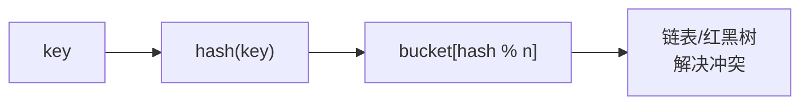
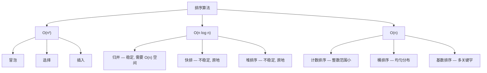
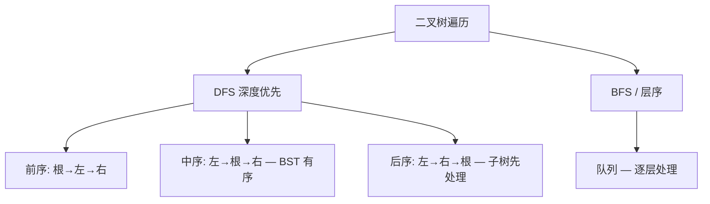

# 数据结构与算法深度解析

> 从 O(n) 到 AC 自动机——体系化进阶路线，覆盖面试到竞赛。

---

## 目录

### 基础篇
- [1. 复杂度分析](#1-复杂度分析)
- [2. 数组与链表](#2-数组与链表)
- [3. 栈与队列](#3-栈与队列)
- [4. 哈希表](#4-哈希表)
- [5. 递归与分治](#5-递归与分治)
- [6. 排序算法](#6-排序算法)
- [7. 二分查找](#7-二分查找)

### 进阶篇
- [8. 二叉树](#8-二叉树)
- [9. 堆与优先队列](#9-堆与优先队列)
- [10. 贪心算法](#10-贪心算法)
- [11. 动态规划](#11-动态规划)
- [12. 回溯算法](#12-回溯算法)
- [13. 图论](#13-图论)

### 高级篇
- [14. Trie 前缀树](#14-trie-前缀树)
- [15. 并查集 Union-Find](#15-并查集-union-find)
- [16. 线段树与树状数组](#16-线段树与树状数组)
- [17. 字符串算法](#17-字符串算法)
- [18. 位运算技巧](#18-位运算技巧)
- [19. 设计模式题](#19-设计模式题)
- [20. 面试高频模板](#20-面试高频模板)

---

# 基础篇

## 1. 复杂度分析

### 1.1 时间复杂度速查


| 复杂度 | 典型算法 | n=100 | n=10⁶ |
|--------|---------|-------|-------|
| O(1) | 哈希查找 | 瞬间 | 瞬间 |
| O(log n) | 二分搜索 | ~7次 | ~20次 |
| O(n) | 线性扫描 | 0.1ms | 1ms |
| O(n log n) | 归并排序 | 0.7ms | 20ms |
| O(n²) | 选择排序 | 10ms | **17分钟** ❌ |
| O(2ⁿ) | 子集枚举 | **不可行** | ❌ |

### 1.2 主定理

```python
# T(n) = a·T(n/b) + f(n)
# 
# 情况1: f(n) = O(n^{log_b a - ε}) → T(n) = Θ(n^{log_b a})
# 情况2: f(n) = Θ(n^{log_b a}) → T(n) = Θ(n^{log_b a}·log n)
# 情况3: f(n) = Ω(n^{log_b a + ε}) → T(n) = Θ(f(n))

# 归并排序: T(n) = 2T(n/2) + n
#   a=2, b=2, log_2 2 = 1, f(n)=n → 情况2 → O(n log n)

# 二分查找: T(n) = T(n/2) + 1  
#   a=1, b=2, log_2 1 = 0, f(n)=1 → 情况2 → O(log n)
```

### 1.3 空间复杂度

```python
# O(1): 原地操作
def reverse_array(arr):
    i, j = 0, len(arr) - 1
    while i < j:
        arr[i], arr[j] = arr[j], arr[i]
        i += 1; j -= 1

# O(n): 需要额外数组
def sorted_squares(nums):
    return sorted([x * x for x in nums])

# O(log n): 递归栈深度
def binary_search(arr, target, lo, hi):
    if lo > hi: return -1
    mid = (lo + hi) // 2
    if arr[mid] == target: return mid
    return binary_search(arr, target, lo, mid-1) if target < arr[mid] \
      else binary_search(arr, target, mid+1, hi)
```

---

## 2. 数组与链表

### 2.1 数组操作核心

```python
# ★ 双指针 — 解决 80% 数组题
# 对撞指针: 两数之和 II、盛水容器
def two_sum_sorted(nums, target):
    left, right = 0, len(nums) - 1
    while left < right:
        s = nums[left] + nums[right]
        if s == target: return [left, right]
        elif s < target: left += 1
        else: right -= 1
    return []

# 快慢指针: 原地去重、移动零
def remove_duplicates(nums):
    slow = 0
    for fast in range(1, len(nums)):
        if nums[fast] != nums[slow]:
            slow += 1
            nums[slow] = nums[fast]
    return slow + 1

# 滑动窗口: 子串问题
def max_sum_subarray(nums, k):
    window_sum = sum(nums[:k])
    max_sum = window_sum
    for i in range(k, len(nums)):
        window_sum += nums[i] - nums[i - k]
        max_sum = max(max_sum, window_sum)
    return max_sum
```

### 2.2 链表核心操作

```python
class ListNode:
    def __init__(self, val=0, next=None):
        self.val = val
        self.next = next

# ★ 反转链表 (迭代)
def reverse_list(head):
    prev, curr = None, head
    while curr:
        nxt = curr.next    # 1. 记下后继
        curr.next = prev   # 2. 反转指向
        prev = curr        # 3. prev 前进
        curr = nxt         # 4. curr 前进
    return prev

# 反转链表 (递归)
def reverse_list_recursive(head):
    if not head or not head.next:
        return head
    new_head = reverse_list_recursive(head.next)
    head.next.next = head  # ★ 精华: 后驱指回自己
    head.next = None
    return new_head

# ★ 快慢指针: 判环、找中点
def has_cycle(head):
    slow = fast = head
    while fast and fast.next:
        slow = slow.next
        fast = fast.next.next
        if slow == fast: return True
    return False

def find_middle(head):
    slow = fast = head
    while fast and fast.next:
        slow = slow.next
        fast = fast.next.next
    return slow

# ★ 哑节点: 简化删除逻辑
def remove_elements(head, val):
    dummy = ListNode(0, head)
    curr = dummy
    while curr.next:
        if curr.next.val == val:
            curr.next = curr.next.next
        else:
            curr = curr.next
    return dummy.next
```

### 2.3 数组 vs 链表

| 操作 | 数组 | 链表 |
|------|------|------|
| 随机访问 get(i) | O(1) | O(n) |
| 头部插入 | O(n) | O(1) |
| 尾部追加 | O(1)* | O(1) |
| 中间插入 | O(n) | O(1)* |
| 删除 | O(n) | O(1)* |

---

## 3. 栈与队列

### 3.1 栈 — LIFO

```python
# ★ 单调栈: 下一个更大元素
def next_greater_element(nums):
    res = [-1] * len(nums)
    stack = []  # 存索引, 保持栈内元素值递减
    for i in range(len(nums)):
        while stack and nums[stack[-1]] < nums[i]:
            idx = stack.pop()
            res[idx] = nums[i]
        stack.append(i)
    return res

# 有效的括号
def is_valid(s):
    pairs = {')': '(', ']': '[', '}': '{'}
    stack = []
    for ch in s:
        if ch in pairs:
            if not stack or stack.pop() != pairs[ch]:
                return False
        else:
            stack.append(ch)
    return not stack

# ★ 用栈实现队列
class MyQueue:
    def __init__(self):
        self.in_stack = []   # 入队
        self.out_stack = []  # 出队
    
    def push(self, x):
        self.in_stack.append(x)
    
    def pop(self):
        if not self.out_stack:
            while self.in_stack:
                self.out_stack.append(self.in_stack.pop())
        return self.out_stack.pop()
```

### 3.2 队列 — FIFO

```python
from collections import deque

# 单调队列: 滑动窗口最大值
def max_sliding_window(nums, k):
    q = deque()  # 存索引, 保持队首最大
    res = []
    for i, v in enumerate(nums):
        # 1. 队首过期弹出
        if q and q[0] <= i - k:
            q.popleft()
        # 2. 保持递减
        while q and nums[q[-1]] < v:
            q.pop()
        q.append(i)
        # 3. 记录结果
        if i >= k - 1:
            res.append(nums[q[0]])
    return res

# BFS 模板
def bfs(start, target):
    q = deque([start])
    visited = {start}
    step = 0
    while q:
        step += 1
        for _ in range(len(q)):  # ★ 按层处理
            node = q.popleft()
            for neighbor in get_neighbors(node):
                if neighbor == target:
                    return step
                if neighbor not in visited:
                    visited.add(neighbor)
                    q.append(neighbor)
    return -1
```

---

## 4. 哈希表

### 4.1 核心原理



```python
# ★ 两数之和 — 哈希表 O(n)
def two_sum(nums, target):
    seen = {}  # val -> index
    for i, v in enumerate(nums):
        complement = target - v
        if complement in seen:
            return [seen[complement], i]
        seen[v] = i
    return []

# ★ 最长无重复子串 — 滑动窗口 + 哈希
def length_of_longest_substring(s):
    last_seen = {}  # char -> last_index
    left = 0
    max_len = 0
    for right, ch in enumerate(s):
        if ch in last_seen and last_seen[ch] >= left:
            left = last_seen[ch] + 1
        last_seen[ch] = right
        max_len = max(max_len, right - left + 1)
    return max_len

# Python: 用 counter 做频次统计
from collections import Counter
freq = Counter("abracadabra")  # Counter({'a':5, 'b':2, 'r':2, 'c':1, 'd':1})
```

---

## 5. 递归与分治

### 5.1 递归三要素

```python
# 1. 终止条件 (base case)
# 2. 递归调用 (缩小问题规模)  
# 3. 合并结果 (combine)

# 归并排序 — 分治经典
def merge_sort(arr):
    if len(arr) <= 1:
        return arr
    
    mid = len(arr) // 2
    left = merge_sort(arr[:mid])
    right = merge_sort(arr[mid:])
    
    return merge(left, right)

def merge(left, right):
    result = []
    i = j = 0
    while i < len(left) and j < len(right):
        if left[i] < right[j]:
            result.append(left[i]); i += 1
        else:
            result.append(right[j]); j += 1
    result.extend(left[i:]); result.extend(right[j:])
    return result
```

### 5.2 记忆化递归

```python
# ★ 斐波那契 — 从 O(2ⁿ) 到 O(n)
from functools import lru_cache

@lru_cache(None)
def fib(n):
    if n <= 1: return n
    return fib(n-1) + fib(n-2)

# 手动记忆化
def fib_memo(n, memo={}):
    if n in memo: return memo[n]
    if n <= 1: return n
    memo[n] = fib_memo(n-1, memo) + fib_memo(n-2, memo)
    return memo[n]
```

---

## 6. 排序算法

### 6.1 全览



### 6.2 核心实现

```python
# ★ 快速排序 (Lomuto 分区)
def quick_sort(arr, lo, hi):
    if lo >= hi: return
    
    pivot = arr[hi]
    i = lo  # i 指向最后一个 ≤ pivot 的位置
    for j in range(lo, hi):
        if arr[j] <= pivot:
            arr[i], arr[j] = arr[j], arr[i]
            i += 1
    arr[i], arr[hi] = arr[hi], arr[i]
    
    quick_sort(arr, lo, i - 1)
    quick_sort(arr, i + 1, hi)

# ★ 快排变体: 第 K 大元素 (Quick Select) — O(n) 平均
def find_kth_largest(nums, k):
    k = len(nums) - k  # 转成第 k 小
    
    def quick_select(lo, hi):
        pivot, i = nums[hi], lo
        for j in range(lo, hi):
            if nums[j] <= pivot:
                nums[i], nums[j] = nums[j], nums[i]
                i += 1
        nums[i], nums[hi] = nums[hi], nums[i]
        
        if i == k: return nums[i]
        elif i < k: return quick_select(i + 1, hi)
        else: return quick_select(lo, i - 1)
    
    return quick_select(0, len(nums) - 1)
```

### 6.3 排序选型

| 场景 | 推荐 | 原因 |
|------|------|------|
| 通用 | **TimSort** (Python 默认) | 实际数据最优 |
| 需要稳定 | 归并排序 | 保持相等元素顺序 |
| 内存敏感 | 堆排序 | O(1) 额外空间 |
| 几乎有序 | 插入排序 | 接近 O(n) |
| 取 Top K | 堆 / Quick Select | 不需要完整排序 |

---

## 7. 二分查找

```python
# ★ 精确查找
def binary_search(nums, target):
    lo, hi = 0, len(nums) - 1
    while lo <= hi:
        mid = lo + (hi - lo) // 2  # ★ 防溢出
        if nums[mid] == target: return mid
        elif nums[mid] < target: lo = mid + 1
        else: hi = mid - 1
    return -1

# ★ 查找左边界 (第一个 ≥ target)
def lower_bound(nums, target):
    lo, hi = 0, len(nums)
    while lo < hi:
        mid = lo + (hi - lo) // 2
        if nums[mid] >= target: hi = mid
        else: lo = mid + 1
    return lo  # 返回第一个满足条件的位置

# ★ 查找右边界 (第一个 > target)
def upper_bound(nums, target):
    lo, hi = 0, len(nums)
    while lo < hi:
        mid = lo + (hi - lo) // 2
        if nums[mid] > target: hi = mid
        else: lo = mid + 1
    return lo

# ★ 二分答案: 在解空间上二分
def min_capacity_to_ship(weights, days):
    def can_ship(cap):
        d, cur = 1, 0
        for w in weights:
            if cur + w > cap:
                d += 1; cur = 0
            cur += w
        return d <= days
    
    lo, hi = max(weights), sum(weights)
    while lo < hi:
        mid = lo + (hi - lo) // 2
        if can_ship(mid): hi = mid
        else: lo = mid + 1
    return lo
```

---

# 进阶篇

## 8. 二叉树

### 8.1 遍历框架



```python
# ★ 三种 DFS 统一模板
def traverse(root):
    if not root: return
    # print(root.val)  # 前序
    traverse(root.left)
    # print(root.val)  # 中序
    traverse(root.right)
    # print(root.val)  # 后序

# 迭代前序 (栈)
def preorder_iterative(root):
    if not root: return []
    stack, res = [root], []
    while stack:
        node = stack.pop()
        res.append(node.val)
        if node.right: stack.append(node.right)  # 先右后左
        if node.left: stack.append(node.left)
    return res

# ★ 迭代中序
def inorder_iterative(root):
    stack, res = [], []
    curr = root
    while curr or stack:
        while curr:          # 1. 一路向左
            stack.append(curr)
            curr = curr.left
        curr = stack.pop()   # 2. 处理节点
        res.append(curr.val)
        curr = curr.right    # 3. 转向右子树
    return res
```

### 8.2 构造二叉树

```python
# ★ 前序+中序 → 构建二叉树（最高频）
def build_tree(preorder, inorder):
    if not preorder: return None
    
    root_val = preorder[0]
    root = TreeNode(root_val)
    split = inorder.index(root_val)
    
    root.left = build_tree(preorder[1:1+split], inorder[:split])
    root.right = build_tree(preorder[1+split:], inorder[split+1:])
    return root

# ★ 验证 BST
def is_valid_bst(root, lo=float('-inf'), hi=float('inf')):
    if not root: return True
    if root.val <= lo or root.val >= hi: return False
    return is_valid_bst(root.left, lo, root.val) and \
           is_valid_bst(root.right, root.val, hi)
```

### 8.3 BST 操作

```python
# 插入
def insert_bst(root, val):
    if not root: return TreeNode(val)
    if val < root.val: root.left = insert_bst(root.left, val)
    else: root.right = insert_bst(root.right, val)
    return root

# ★ 删除 — 三种情况
def delete_node(root, key):
    if not root: return None
    
    if key < root.val:
        root.left = delete_node(root.left, key)
    elif key > root.val:
        root.right = delete_node(root.right, key)
    else:
        # 情况1&2: 单子或无子
        if not root.left: return root.right
        if not root.right: return root.left
        # 情况3: 双子 → 找后继(右子树最小节点)
        succ = root.right
        while succ.left: succ = succ.left
        root.val = succ.val
        root.right = delete_node(root.right, succ.val)
    return root
```

### 8.4 LCA 最近公共祖先

```python
def lowest_common_ancestor(root, p, q):
    if not root or root == p or root == q:
        return root
    left = lowest_common_ancestor(root.left, p, q)
    right = lowest_common_ancestor(root.right, p, q)
    if left and right: return root  # 分别在左右 → 当前即 LCA
    return left or right            # 都在一侧 → 那一侧的结果
```

---

## 9. 堆与优先队列

```python
import heapq

# ★ Top K — 小顶堆
def top_k(nums, k):
    heap = []
    for num in nums:
        heapq.heappush(heap, num)
        if len(heap) > k:
            heapq.heappop(heap)
    return heap  # [k个最大元素]

# ★ 合并 K 个有序链表
def merge_k_lists(lists):
    heap = []
    for i, node in enumerate(lists):
        if node: heapq.heappush(heap, (node.val, i, node))
    
    dummy = curr = ListNode()
    while heap:
        val, i, node = heapq.heappop(heap)
        curr.next = node; curr = curr.next
        if node.next: heapq.heappush(heap, (node.next.val, i, node.next))
    return dummy.next

# ★ 数据流中位数 — 双堆
class MedianFinder:
    def __init__(self):
        self.lo = []  # 大顶堆 (存负数) — 较小的一半
        self.hi = []  # 小顶堆 — 较大的一半
    
    def add_num(self, num):
        heapq.heappush(self.lo, -num)
        heapq.heappush(self.hi, -heapq.heappop(self.lo))
        if len(self.hi) > len(self.lo):
            heapq.heappush(self.lo, -heapq.heappop(self.hi))
    
    def find_median(self):
        if len(self.lo) > len(self.hi):
            return -self.lo[0]
        return (-self.lo[0] + self.hi[0]) / 2
```

---

## 10. 贪心算法

```python
# ★ 跳跃游戏 — 最远可达
def can_jump(nums):
    farthest = 0
    for i, jump in enumerate(nums):
        if i > farthest: return False
        farthest = max(farthest, i + jump)
    return True

# ★ 区间调度 — 选择最多不重叠区间
def max_non_overlapping(intervals):
    intervals.sort(key=lambda x: x[1])  # 按结束时间排序
    count, end = 0, float('-inf')
    for start, finish in intervals:
        if start >= end:
            count += 1
            end = finish
    return count

# ★ 分发糖果 — 两次扫描
def candy(ratings):
    n = len(ratings)
    candies = [1] * n
    # 从左到右: 如果右边 > 左边 → +1
    for i in range(1, n):
        if ratings[i] > ratings[i-1]:
            candies[i] = candies[i-1] + 1
    # 从右到左: 如果左边 > 右边 → 取 max
    for i in range(n-2, -1, -1):
        if ratings[i] > ratings[i+1]:
            candies[i] = max(candies[i], candies[i+1] + 1)
    return sum(candies)
```

---

## 11. 动态规划

### 11.1 DP 五步法

```python
# 1. 定义 dp[i] 的含义
# 2. 找递推关系 (状态转移方程)
# 3. 初始化 base case
# 4. 确定遍历顺序
# 5. 返回结果 (可能需要遍历 dp 取最优)
```

### 11.2 经典 DP

```python
# ★ 01 背包
def knapsack(weights, values, capacity):
    n = len(weights)
    dp = [0] * (capacity + 1)  # 一维优化
    for i in range(n):
        for j in range(capacity, weights[i] - 1, -1):  # ★ 倒序遍历
            dp[j] = max(dp[j], dp[j - weights[i]] + values[i])
    return dp[capacity]

# ★ 最长递增子序列 LIS — O(n log n)
def length_of_lis(nums):
    tails = []  # tails[i] = 长度为 i+1 的 LIS 的最小结尾
    for num in nums:
        i = bisect_left(tails, num)
        if i == len(tails): tails.append(num)
        else: tails[i] = num
    return len(tails)

# ★ 编辑距离
def min_distance(word1, word2):
    m, n = len(word1), len(word2)
    dp = [[0] * (n + 1) for _ in range(m + 1)]
    for i in range(m + 1): dp[i][0] = i
    for j in range(n + 1): dp[0][j] = j
    
    for i in range(1, m + 1):
        for j in range(1, n + 1):
            if word1[i-1] == word2[j-1]:
                dp[i][j] = dp[i-1][j-1]
            else:
                dp[i][j] = 1 + min(dp[i-1][j], dp[i][j-1], dp[i-1][j-1])
    return dp[m][n]

# ★ 最长公共子序列 LCS
def longest_common_subsequence(text1, text2):
    m, n = len(text1), len(text2)
    dp = [[0] * (n + 1) for _ in range(m + 1)]
    for i in range(1, m + 1):
        for j in range(1, n + 1):
            if text1[i-1] == text2[j-1]:
                dp[i][j] = dp[i-1][j-1] + 1
            else:
                dp[i][j] = max(dp[i-1][j], dp[i][j-1])
    return dp[m][n]
```

### 11.3 DP 优化技巧

```python
# ★ 状态压缩: 二维 → 一维
# 01 背包就是状态压缩 dp[j] = max(dp[j], dp[j-w] + v)
# 条件: 状态只依赖上一行，且需要倒序遍历

# ★ 滚动数组: dp[i] 只依赖 dp[i-1] 和 dp[i-2]
def fib(n):
    if n <= 1: return n
    a, b = 0, 1
    for _ in range(2, n + 1):
        a, b = b, a + b
    return b

# ★ 区间 DP 模板
def stone_game(stones):
    n = len(stones)
    dp = [[0] * n for _ in range(n)]
    # 按区间长度遍历
    for length in range(2, n + 1):
        for i in range(n - length + 1):
            j = i + length - 1
            # 最优子结构
            dp[i][j] = max(
                stones[i] - dp[i+1][j],
                stones[j] - dp[i][j-1]
            )
    return dp[0][n-1] > 0
```

---

## 12. 回溯算法

```python
# ★ 回溯框架 — 全排列/组合/子集 三件套
def backtrack(path, choices):
    if 满足条件:
        res.append(path[:])
        return
    
    for choice in choices:
        做选择
        backtrack(path, 新choices)
        撤销选择

# ★ 全排列
def permute(nums):
    res = []
    def backtrack(path, used):
        if len(path) == len(nums):
            res.append(path[:]); return
        for i, n in enumerate(nums):
            if used[i]: continue
            used[i] = True; path.append(n)
            backtrack(path, used)
            path.pop(); used[i] = False
    
    backtrack([], [False] * len(nums))
    return res

# ★ 子集
def subsets(nums):
    res = []
    def backtrack(start, path):
        res.append(path[:])  # ★ 每个节点都是答案
        for i in range(start, len(nums)):
            path.append(nums[i])
            backtrack(i + 1, path)  # ★ i+1 避免重复
            path.pop()
    
    backtrack(0, [])
    return res

# ★ 组合总和 (可重复选)
def combination_sum(candidates, target):
    res = []
    def backtrack(start, path, remaining):
        if remaining == 0: res.append(path[:]); return
        if remaining < 0: return
        for i in range(start, len(candidates)):
            path.append(candidates[i])
            backtrack(i, path, remaining - candidates[i])  # ★ i 不+1(可重复)
            path.pop()
    
    backtrack(0, [], target)
    return res

# ★ N 皇后
def solve_n_queens(n):
    cols, diag1, diag2 = set(), set(), set()
    board = [['.'] * n for _ in range(n)]
    res = []
    
    def backtrack(row):
        if row == n:
            res.append([''.join(r) for r in board]); return
        for col in range(n):
            if col in cols or (row-col) in diag1 or (row+col) in diag2: continue
            cols.add(col); diag1.add(row-col); diag2.add(row+col)
            board[row][col] = 'Q'
            backtrack(row + 1)
            cols.discard(col); diag1.discard(row-col); diag2.discard(row+col)
            board[row][col] = '.'
    
    backtrack(0)
    return res
```

---

## 13. 图论

### 13.1 图的表示

```python
# 邻接表 (最常用)
graph = {
    0: [1, 2],
    1: [0, 3],
    2: [0, 3],
    3: [1, 2]
}

# 邻接矩阵 (稠密图)
matrix = [
    [0, 1, 1, 0],
    [1, 0, 0, 1],
    [1, 0, 0, 1],
    [0, 1, 1, 0],
]
```

### 13.2 图遍历

```python
from collections import deque

# DFS
def dfs(graph, node, visited):
    visited.add(node)
    for neighbor in graph[node]:
        if neighbor not in visited:
            dfs(graph, neighbor, visited)

# BFS (带层级)
def bfs(graph, start):
    q = deque([start])
    visited = {start}
    level = 0
    while q:
        level += 1
        for _ in range(len(q)):
            node = q.popleft()
            for nb in graph[node]:
                if nb not in visited:
                    visited.add(nb)
                    q.append(nb)

# ★ 拓扑排序 (BFS/Kahn)
def topological_sort(n, edges):
    indegree = [0] * n
    graph = [[] for _ in range(n)]
    for u, v in edges:
        graph[u].append(v)
        indegree[v] += 1
    
    q = deque([i for i in range(n) if indegree[i] == 0])
    order = []
    while q:
        node = q.popleft()
        order.append(node)
        for nb in graph[node]:
            indegree[nb] -= 1
            if indegree[nb] == 0:
                q.append(nb)
    
    return order if len(order) == n else []  # 有环返回空
```

### 13.3 最短路径

```python
import heapq

# ★ Dijkstra — 非负权图
def dijkstra(graph, start):
    dist = {node: float('inf') for node in graph}
    dist[start] = 0
    pq = [(0, start)]
    
    while pq:
        d, node = heapq.heappop(pq)
        if d > dist[node]: continue  # ★ 懒惰删除
        for nb, w in graph[node]:
            if dist[node] + w < dist[nb]:
                dist[nb] = dist[node] + w
                heapq.heappush(pq, (dist[nb], nb))
    return dist

# ★ 多源 BFS — 矩阵中的最短距离
def walls_and_gates(rooms):
    INF = 2**31 - 1
    m, n = len(rooms), len(rooms[0])
    q = deque()
    for i in range(m):
        for j in range(n):
            if rooms[i][j] == 0:
                q.append((i, j))
    
    while q:
        i, j = q.popleft()
        for di, dj in [(0,1),(0,-1),(1,0),(-1,0)]:
            ni, nj = i + di, j + dj
            if 0 <= ni < m and 0 <= nj < n and rooms[ni][nj] == INF:
                rooms[ni][nj] = rooms[i][j] + 1
                q.append((ni, nj))
```

---

# 高级篇

## 14. Trie 前缀树

```python
class TrieNode:
    def __init__(self):
        self.children = {}
        self.is_end = False

class Trie:
    def __init__(self):
        self.root = TrieNode()
    
    def insert(self, word):
        node = self.root
        for ch in word:
            if ch not in node.children:
                node.children[ch] = TrieNode()
            node = node.children[ch]
        node.is_end = True
    
    def search(self, word):
        node = self._find(word)
        return node is not None and node.is_end
    
    def starts_with(self, prefix):
        return self._find(prefix) is not None
    
    def _find(self, prefix):
        node = self.root
        for ch in prefix:
            if ch not in node.children:
                return None
            node = node.children[ch]
        return node

# ★ 单词搜索 II — Trie + DFS 回溯
def find_words(board, words):
    trie = Trie()
    for w in words: trie.insert(w)
    
    m, n = len(board), len(board[0])
    res = set()
    
    def dfs(i, j, node, path):
        ch = board[i][j]
        if ch not in node.children: return
        node = node.children[ch]
        path += ch
        if node.is_end: res.add(path)
        
        board[i][j] = '#'
        for di, dj in [(0,1),(1,0),(0,-1),(-1,0)]:
            ni, nj = i+di, j+dj
            if 0 <= ni < m and 0 <= nj < n and board[ni][nj] != '#':
                dfs(ni, nj, node, path)
        board[i][j] = ch
    
    for i in range(m):
        for j in range(n):
            dfs(i, j, trie.root, '')
    return list(res)
```

---

## 15. 并查集 Union-Find

```python
class UnionFind:
    def __init__(self, n):
        self.parent = list(range(n))
        self.rank = [0] * n
    
    def find(self, x):
        if self.parent[x] != x:
            self.parent[x] = self.find(self.parent[x])  # ★ 路径压缩
        return self.parent[x]
    
    def union(self, x, y):
        px, py = self.find(x), self.find(y)
        if px == py: return False
        # ★ 按秩合并
        if self.rank[px] < self.rank[py]:
            self.parent[px] = py
        elif self.rank[px] > self.rank[py]:
            self.parent[py] = px
        else:
            self.parent[py] = px
            self.rank[px] += 1
        return True

# 应用: 冗余连接
def find_redundant_connection(edges):
    uf = UnionFind(len(edges) + 1)
    for u, v in edges:
        if not uf.union(u, v):
            return [u, v]
```

---

## 16. 线段树与树状数组

```python
# ★ 树状数组 BIT — 单点更新 + 区间查询 O(log n)
class BIT:
    def __init__(self, n):
        self.tree = [0] * (n + 1)
    
    def update(self, i, delta):
        while i < len(self.tree):
            self.tree[i] += delta
            i += i & -i  # ★ lowbit
    
    def query(self, i):
        s = 0
        while i > 0:
            s += self.tree[i]
            i -= i & -i
        return s
    
    def range_sum(self, l, r):
        return self.query(r) - self.query(l - 1)

# ★ 线段树 — 区间更新 + 区间查询
class SegmentTree:
    def __init__(self, nums):
        self.n = len(nums)
        self.tree = [0] * (4 * self.n)
        self.lazy = [0] * (4 * self.n)
        self._build(nums, 0, 0, self.n - 1)
    
    def _build(self, nums, node, lo, hi):
        if lo == hi:
            self.tree[node] = nums[lo]
            return
        mid = (lo + hi) // 2
        self._build(nums, node*2+1, lo, mid)
        self._build(nums, node*2+2, mid+1, hi)
        self.tree[node] = self.tree[node*2+1] + self.tree[node*2+2]
    
    def update_range(self, l, r, val, node=0, lo=0, hi=None):
        if hi is None: hi = self.n - 1
        if self.lazy[node] != 0:  # 下推懒标记
            self.tree[node] += (hi - lo + 1) * self.lazy[node]
            if lo != hi:
                self.lazy[node*2+1] += self.lazy[node]
                self.lazy[node*2+2] += self.lazy[node]
            self.lazy[node] = 0
        
        if lo > r or hi < l: return
        if l <= lo and hi <= r:
            self.tree[node] += (hi - lo + 1) * val
            if lo != hi:
                self.lazy[node*2+1] += val
                self.lazy[node*2+2] += val
            return
        
        mid = (lo + hi) // 2
        self.update_range(l, r, val, node*2+1, lo, mid)
        self.update_range(l, r, val, node*2+2, mid+1, hi)
        self.tree[node] = self.tree[node*2+1] + self.tree[node*2+2]
```

---

## 17. 字符串算法

```python
# ★ KMP — 字符串匹配 O(n+m)
def kmp(text, pattern):
    # 构建 next 数组 (部分匹配表)
    nxt = [0] * len(pattern)
    j = 0
    for i in range(1, len(pattern)):
        while j > 0 and pattern[i] != pattern[j]:
            j = nxt[j - 1]
        if pattern[i] == pattern[j]:
            j += 1
            nxt[i] = j
    
    # 匹配
    j = 0
    for i, ch in enumerate(text):
        while j > 0 and ch != pattern[j]:
            j = nxt[j - 1]
        if ch == pattern[j]:
            j += 1
        if j == len(pattern):
            return i - j + 1  # 匹配位置
    return -1

# ★ Rabin-Karp — 滚动哈希
def rabin_karp(text, pattern):
    BASE, MOD = 256, 10**9 + 7
    n, m = len(text), len(pattern)
    
    # 计算 pattern 哈希
    p_hash = 0
    for ch in pattern: p_hash = (p_hash * BASE + ord(ch)) % MOD
    
    # 遍历 text
    t_hash = 0
    base_m = pow(BASE, m - 1, MOD)
    for i in range(n):
        t_hash = (t_hash * BASE + ord(text[i])) % MOD
        if i >= m - 1:
            if t_hash == p_hash and text[i-m+1:i+1] == pattern:
                return i - m + 1
            t_hash = (t_hash - ord(text[i-m+1]) * base_m) % MOD
    return -1

# ★ 最长回文子串 — Manacher O(n)
def longest_palindrome(s):
    T = '#' + '#'.join(s) + '#'
    n = len(T)
    P = [0] * n
    C = R = 0
    for i in range(n):
        mirror = 2 * C - i
        if i < R: P[i] = min(R - i, P[mirror])
        while i + 1 + P[i] < n and i - 1 - P[i] >= 0 and \
              T[i+1+P[i]] == T[i-1-P[i]]:
            P[i] += 1
        if i + P[i] > R:
            C, R = i, i + P[i]
    center = P.index(max(P))
    start = (center - P[center]) // 2
    return s[start:start + P[center]]
```

---

## 18. 位运算技巧

```python
# 基础
x & 1          # 判奇偶
x & (x - 1)    # ★ 消除最低位 1
x & -x         # ★ 获取最低位 1 (lowbit)
x | (1 << i)   # 设置第 i 位为 1
x & ~(1 << i)  # 清除第 i 位
x ^ (1 << i)   # 翻转第 i 位

# ★ 统计 1 的个数
def count_ones(n):
    count = 0
    while n:
        n &= n - 1  # 每次消掉一个 1
        count += 1
    return count

# ★ 只出现一次的数 (其他出现两次)
def single_number(nums):
    res = 0
    for n in nums:
        res ^= n  # a ^ a = 0, a ^ 0 = a
    return res

# ★ 子集枚举
def enumerate_subsets(nums):
    n = len(nums)
    res = []
    for mask in range(1 << n):
        subset = [nums[i] for i in range(n) if mask & (1 << i)]
        res.append(subset)
    return res

# ★ 不用加减乘除做加法
def add(a, b):
    while b:
        carry = (a & b) << 1  # 进位
        a = a ^ b             # 无进位和
        b = carry
    return a
```

---

## 19. 设计模式题

```python
# ★ LRU Cache
class LRUCache:
    def __init__(self, capacity):
        self.cap = capacity
        self.cache = {}
        self.order = OrderedDict()
    
    def get(self, key):
        if key not in self.cache: return -1
        self.order.move_to_end(key)
        return self.cache[key]
    
    def put(self, key, value):
        if key in self.cache:
            self.order.move_to_end(key)
        else:
            if len(self.cache) >= self.cap:
                oldest = next(iter(self.order))
                del self.cache[oldest]
                del self.order[oldest]
            self.order[key] = None
        self.cache[key] = value

# ★ LFU Cache — 频率最低淘汰
class LFUCache:
    def __init__(self, capacity):
        self.cap = capacity
        self.min_freq = 0
        self.key_val = {}       # key → (val, freq)
        self.freq_keys = defaultdict(OrderedDict)  # freq → {key: None}
    
    def get(self, key):
        if key not in self.key_val: return -1
        val, freq = self.key_val[key]
        del self.freq_keys[freq][key]
        if not self.freq_keys[freq] and self.min_freq == freq:
            self.min_freq += 1
        self.freq_keys[freq + 1][key] = None
        self.key_val[key] = (val, freq + 1)
        return val
    
    def put(self, key, value):
        if self.cap == 0: return
        if key in self.key_val:
            _, freq = self.key_val[key]
            self.key_val[key] = (value, freq)
            self.get(key)
            return
        if len(self.key_val) >= self.cap:
            k, _ = self.freq_keys[self.min_freq].popitem(last=False)
            del self.key_val[k]
        self.key_val[key] = (value, 1)
        self.freq_keys[1][key] = None
        self.min_freq = 1
```

---

## 20. 面试高频模板

### 20.1 解题套路速查

| 问题特征 | 算法 | 模板 |
|----------|------|------|
| 求所有解 | **回溯** | backtrack + path + choices |
| 求最优解 (有重叠子问题) | **DP** | dp 数组 + 状态转移 |
| 求 Top K | **堆** | 小顶堆维护 K 个 |
| 数组有序 | **二分 / 双指针** | while lo < hi |
| 树的问题 | **DFS/BFS** | 递归 / 队列 |
| 图的最短路径 | **Dijkstra / BFS** | 优先队列 |
| 连通性 | **并查集** | union + find |
| 前缀匹配 | **Trie** | 多叉树 |
| 区间问题 | **线段树 / 差分数组** | lazy propagation |
| 子串匹配 | **KMP / 滑动窗口** | next 数组 |

### 20.2 时间复杂度判断

```
n ≤ 10       → O(n!) 全排列
n ≤ 20       → O(2ⁿ) 子集枚举
n ≤ 100      → O(n³) Floyd, 区间 DP
n ≤ 1000     → O(n²) 简单 DP, 双重循环
n ≤ 10⁵      → O(n log n) 排序, 堆, 线段树
n ≤ 10⁶      → O(n) 扫描, BFS, 双指针
n ≤ 10⁹      → O(log n) 二分, 快速幂
```

### 20.3 Python 常用技巧

```python
# 内置高效方法
from bisect import bisect_left, bisect_right  # 二分
from collections import defaultdict, deque, Counter, OrderedDict
from functools import lru_cache, reduce
from itertools import permutations, combinations, accumulate
import heapq

# 一行交换
a, b = b, a

# 一行反转
s = s[::-1]

# 列表推导
[i for i in range(10) if i % 2 == 0]

# 字典推导
{v: k for k, v in d.items()}

# 快速幂
def pow_mod(x, n, mod):
    res = 1
    while n:
        if n & 1: res = res * x % mod
        x = x * x % mod; n >>= 1
    return res
```

---

*全文 20 章，从初级到高级，覆盖面试 95% 算法题。*
