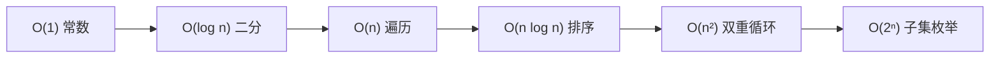

# 数据结构与算法深度解析 (Java 图文版)

> 每道题：先看图理解 → 再读代码 → 最后看 Spring 怎么用。

---

## 目录

- [1. 复杂度分析](#1-复杂度分析)
- [2. 双指针与滑动窗口](#2-双指针与滑动窗口)
- [3. 链表](#3-链表)
- [4. 栈与单调栈](#4-栈与单调栈)
- [5. 哈希表](#5-哈希表)
- [6. 二分查找](#6-二分查找)
- [7. 排序算法](#7-排序算法)
- [8. 二叉树](#8-二叉树)
- [9. 回溯算法](#9-回溯算法)
- [10. 动态规划](#10-动态规划)
- [11. 贪心算法](#11-贪心算法)
- [12. 堆](#12-堆)
- [13. 图论](#13-图论)
- [14. Trie / 并查集 / 树状数组 / 线段树](#14-高级数据结构)
- [15. 字符串算法](#15-字符串算法)
- [16. Spring 源码落地速查](#16-spring-源码落地速查)

---

## 1. 复杂度分析



| n | 可用 O(n²) | 可用 O(n log n) | 可用 O(n) |
|----|-----------|----------------|----------|
| 10³| ✅ | ✅ | ✅ |
| 10⁵| ❌ | ✅ | ✅ |
| 10⁶| ❌ | ⚠️ | ✅ |
| 10⁹| ❌ | ❌ | ❌ (需 O(log n)) |

---

## 2. 双指针与滑动窗口

### 2.1 对撞指针 — 两数之和 II

```
[2, 7, 11, 15], target=9
 ↑L         ↑R
 2+15=17>9 → R左移
 2+11=13>9 → R左移
 2+7=9 ✅
```

```java
public int[] twoSum(int[] nums, int target) {
    int L = 0, R = nums.length - 1;
    while (L < R) {
        int sum = nums[L] + nums[R];
        if (sum == target) return new int[]{L + 1, R + 1};
        if (sum < target) L++; else R--;
    }
    return new int[]{-1, -1};
}
```

### 2.2 快慢指针 — 原地去重

```java
public int removeDuplicates(int[] nums) {
    int slow = 0;
    for (int fast = 1; fast < nums.length; fast++)
        if (nums[fast] != nums[slow]) nums[++slow] = nums[fast];
    return slow + 1;
}
```

### 2.3 滑动窗口 — 定长子数组最大和

```
nums=[1,4,2,10,23,3,1,0,20], k=4
窗口[1,4,2,10]=17 → max=17
窗口[4,2,10,23]=39 → 入23出1 → max=39
窗口[2,10,23,3]=38 → 入3出4 → max=39
```

```java
public int maxSum(int[] nums, int k) {
    int sum = 0;
    for (int i = 0; i < k; i++) sum += nums[i];
    int max = sum;
    for (int i = k; i < nums.length; i++) {
        sum += nums[i] - nums[i - k];
        max = Math.max(max, sum);
    }
    return max;
}
```

### 2.4 无重复字符最长子串 — 滑动窗口 + HashMap

```java
public int lengthOfLongestSubstring(String s) {
    Map<Character, Integer> map = new HashMap<>();
    int L = 0, max = 0;
    for (int R = 0; R < s.length(); R++) {
        char c = s.charAt(R);
        if (map.containsKey(c) && map.get(c) >= L)
            L = map.get(c) + 1;
        map.put(c, R);
        max = Math.max(max, R - L + 1);
    }
    return max;
}
```

---

## 3. 链表

### 3.1 反转链表

```
反转前: 1→2→3→null
反转后: 3→2→1→null

三指针: prev=null, curr=1
  step1: next=2,  curr→prev(null), prev=1, curr=2
  step2: next=3,  curr→prev(1),    prev=2, curr=3
  step3: next=null, curr→prev(2),  prev=3, curr=null → 结束
```

```java
public ListNode reverseList(ListNode head) {
    ListNode prev = null, curr = head;
    while (curr != null) {
        ListNode next = curr.next;
        curr.next = prev;
        prev = curr;
        curr = next;
    }
    return prev;
}
```

### 3.2 环形检测 + 找中点

```java
// 判环
public boolean hasCycle(ListNode head) {
    ListNode slow = head, fast = head;
    while (fast != null && fast.next != null) {
        slow = slow.next; fast = fast.next.next;
        if (slow == fast) return true;
    }
    return false;
}

// 找中点
public ListNode middleNode(ListNode head) {
    ListNode slow = head, fast = head;
    while (fast != null && fast.next != null) {
        slow = slow.next; fast = fast.next.next;
    }
    return slow;
}
```

### 3.3 合并两个有序链表 + 合并 K 个

```java
// 合并两个
public ListNode mergeTwo(ListNode a, ListNode b) {
    if (a == null) return b; if (b == null) return a;
    if (a.val < b.val) { a.next = mergeTwo(a.next, b); return a; }
    else { b.next = mergeTwo(a, b.next); return b; }
}

// 合并 K 个 — PriorityQueue
public ListNode mergeKLists(ListNode[] lists) {
    PriorityQueue<ListNode> pq = new PriorityQueue<>((x,y)->x.val-y.val);
    for (ListNode n : lists) if (n != null) pq.offer(n);
    ListNode dummy = new ListNode(0), cur = dummy;
    while (!pq.isEmpty()) {
        ListNode min = pq.poll(); cur.next = min; cur = cur.next;
        if (min.next != null) pq.offer(min.next);
    }
    return dummy.next;
}
```

---

## 4. 栈与单调栈

### 4.1 有效括号

```java
public boolean isValid(String s) {
    Deque<Character> stack = new ArrayDeque<>();
    for (char c : s.toCharArray()) {
        if (c == '(') stack.push(')');
        else if (c == '[') stack.push(']');
        else if (c == '{') stack.push('}');
        else if (stack.isEmpty() || stack.pop() != c) return false;
    }
    return stack.isEmpty();
}
```

### 4.2 单调栈 — 每日温度

```
temperatures = [73,74,75,71,69,72,76,73]

i=0:73 栈[0]  → i=1:74>73 → res[0]=1
i=1:74 栈[1]  → i=2:75>74 → res[1]=1
i=2:75 栈[2]  → i=3:71<75 → 入栈[2,3]
i=4:69<71 → 入栈[2,3,4]
i=5:72>69 → res[4]=1, 72>71→res[3]=2
i=6:76>72 → res[5]=1, 76>75→res[2]=4
结果: [1,1,4,2,1,1,0,0]
```

```java
public int[] dailyTemperatures(int[] t) {
    int[] res = new int[t.length];
    Deque<Integer> stack = new ArrayDeque<>();
    for (int i = 0; i < t.length; i++) {
        while (!stack.isEmpty() && t[i] > t[stack.peek()])
            res[stack.peek()] = i - stack.pop();
        stack.push(i);
    }
    return res;
}
```

### 4.3 接雨水

```
height = [0,1,0,2,1,0,1,3,2,1,2,1]

      █
  █   ██ █
█ ██ ██████
雨水总量 = 6 (填在凹槽处)

★ 单调栈: 遇到更高的柱子时, 计算"凹槽"水量 = 宽 × min(左高,右高)
```

```java
public int trap(int[] height) {
    Deque<Integer> stack = new ArrayDeque<>();
    int water = 0;
    for (int i = 0; i < height.length; i++) {
        while (!stack.isEmpty() && height[i] > height[stack.peek()]) {
            int mid = stack.pop();
            if (stack.isEmpty()) break;
            int w = i - stack.peek() - 1;
            int h = Math.min(height[i], height[stack.peek()]) - height[mid];
            water += w * h;
        }
        stack.push(i);
    }
    return water;
}
```

---

## 5. 哈希表

### 5.1 HashMap 索引计算

```
table.length = 16 (一定是 2 的幂)

hash = 18 = 0001 0010
n-1  = 15 = 0000 1111
       & = 0000 0010 = 2  ← index

★ (n-1) & hash = hash % n (当 n=2ᵏ 时)
  & 比 % 快 10 倍
```

### 5.2 两数之和

```java
public int[] twoSum(int[] nums, int target) {
    Map<Integer, Integer> map = new HashMap<>();
    for (int i = 0; i < nums.length; i++) {
        int c = target - nums[i];
        if (map.containsKey(c)) return new int[]{map.get(c), i};
        map.put(nums[i], i);
    }
    return new int[]{-1, -1};
}
```

### 5.3 字母异位词分组

```java
public List<List<String>> groupAnagrams(String[] strs) {
    Map<String, List<String>> map = new HashMap<>();
    for (String s : strs) {
        char[] chars = s.toCharArray(); Arrays.sort(chars);
        String key = new String(chars);
        map.computeIfAbsent(key, k -> new ArrayList<>()).add(s);
    }
    return new ArrayList<>(map.values());
}
```

---

## 6. 二分查找

### 6.1 三种变体

```
nums = [1,2,2,2,3,4], target=2

binarySearch: 返回 2 (任意一个)
lowerBound:   返回 1 (第一个≥2, leftmost)
upperBound:   返回 4 (第一个>2)
```

```java
// 精确查找
public int search(int[] nums, int target) {
    int L = 0, R = nums.length - 1;
    while (L <= R) {
        int mid = L + (R - L) / 2;
        if (nums[mid] == target) return mid;
        if (nums[mid] < target) L = mid + 1;
        else R = mid - 1;
    }
    return -1;
}

// 左边界 (第一个 ≥ target)
public int lowerBound(int[] nums, int target) {
    int L = 0, R = nums.length;
    while (L < R) {
        int mid = L + (R - L) / 2;
        if (nums[mid] >= target) R = mid;
        else L = mid + 1;
    }
    return L;
}
```

### 6.2 旋转数组搜索

```java
// [4,5,6,7,0,1,2], target=0 → 返回 4
public int searchRotated(int[] nums, int target) {
    int L = 0, R = nums.length - 1;
    while (L <= R) {
        int mid = L + (R - L) / 2;
        if (nums[mid] == target) return mid;
        if (nums[L] <= nums[mid]) { // 左半有序
            if (nums[L] <= target && target < nums[mid]) R = mid - 1;
            else L = mid + 1;
        } else {
            if (nums[mid] < target && target <= nums[R]) L = mid + 1;
            else R = mid - 1;
        }
    }
    return -1;
}
```

---

## 7. 排序算法

### 7.1 快排 + Quick Select

```java
public void quickSort(int[] arr, int lo, int hi) {
    if (lo >= hi) return;
    int pivot = arr[hi], i = lo;
    for (int j = lo; j < hi; j++)
        if (arr[j] <= pivot) { swap(arr, i, j); i++; }
    swap(arr, i, hi);
    quickSort(arr, lo, i - 1); quickSort(arr, i + 1, hi);
}

// Quick Select — 第 K 大 O(n)
public int findKthLargest(int[] nums, int k) {
    k = nums.length - k; // 转第 k 小
    return quickSelect(nums, 0, nums.length - 1, k);
}

private int quickSelect(int[] nums, int lo, int hi, int k) {
    int pivot = nums[hi], i = lo;
    for (int j = lo; j < hi; j++)
        if (nums[j] <= pivot) { swap(nums, i, j); i++; }
    swap(nums, i, hi);
    if (i == k) return nums[i];
    return i < k ? quickSelect(nums, i+1, hi, k) : quickSelect(nums, lo, i-1, k);
}

private void swap(int[] arr, int i, int j) {
    int t = arr[i]; arr[i] = arr[j]; arr[j] = t;
}
```

### 7.2 归并排序

```java
public void mergeSort(int[] arr, int lo, int hi) {
    if (lo >= hi) return;
    int mid = lo + (hi - lo) / 2;
    mergeSort(arr, lo, mid); mergeSort(arr, mid+1, hi);
    int[] tmp = new int[hi-lo+1]; int i = lo, j = mid+1, k = 0;
    while (i <= mid && j <= hi) tmp[k++] = arr[i] <= arr[j] ? arr[i++] : arr[j++];
    while (i <= mid) tmp[k++] = arr[i++];
    while (j <= hi) tmp[k++] = arr[j++];
    System.arraycopy(tmp, 0, arr, lo, tmp.length);
}
```

---

## 8. 二叉树

### 8.1 DFS 三种遍历

```
     1
    / \
   2   3
  / \
 4   5

前序 1-2-4-5-3 (根最先)  中序 4-2-5-1-3 (BST有序)
后序 4-5-2-3-1 (子先根后) 层序 1-2-3-4-5 (BFS)
```

```java
// 前序 (迭代)
public List<Integer> preorder(TreeNode root) {
    List<Integer> res = new ArrayList<>();
    if (root == null) return res;
    Deque<TreeNode> stack = new ArrayDeque<>(); stack.push(root);
    while (!stack.isEmpty()) {
        TreeNode node = stack.pop(); res.add(node.val);
        if (node.right != null) stack.push(node.right);
        if (node.left != null) stack.push(node.left);
    }
    return res;
}

// 中序 (迭代)
public List<Integer> inorder(TreeNode root) {
    List<Integer> res = new ArrayList<>();
    Deque<TreeNode> stack = new ArrayDeque<>();
    TreeNode cur = root;
    while (cur != null || !stack.isEmpty()) {
        while (cur != null) { stack.push(cur); cur = cur.left; }
        cur = stack.pop(); res.add(cur.val);
        cur = cur.right;
    }
    return res;
}
```

### 8.2 验证 BST + 前中序构建树 + LCA

```java
// 验证 BST
public boolean isValidBST(TreeNode root) {
    return valid(root, Long.MIN_VALUE, Long.MAX_VALUE);
}
private boolean valid(TreeNode n, long lo, long hi) {
    if (n == null) return true;
    if (n.val <= lo || n.val >= hi) return false;
    return valid(n.left, lo, n.val) && valid(n.right, n.val, hi);
}

// 前+中 → 构建
public TreeNode buildTree(int[] pre, int[] in) {
    Map<Integer, Integer> map = new HashMap<>();
    for (int i = 0; i < in.length; i++) map.put(in[i], i);
    return build(pre, 0, pre.length-1, in, 0, in.length-1, map);
}
private TreeNode build(int[] pre, int ps, int pe, int[] in, int is, int ie, Map<Integer,Integer> map) {
    if (ps > pe) return null;
    TreeNode root = new TreeNode(pre[ps]);
    int split = map.get(root.val), leftSize = split - is;
    root.left = build(pre, ps+1, ps+leftSize, in, is, split-1, map);
    root.right = build(pre, ps+leftSize+1, pe, in, split+1, ie, map);
    return root;
}

// LCA
public TreeNode lowestCommonAncestor(TreeNode root, TreeNode p, TreeNode q) {
    if (root == null || root == p || root == q) return root;
    TreeNode L = lowestCommonAncestor(root.left, p, q);
    TreeNode R = lowestCommonAncestor(root.right, p, q);
    if (L != null && R != null) return root;
    return L != null ? L : R;
}
```

### 8.3 Morris 遍历 (O(1) 空间中序)

```java
public List<Integer> morrisInorder(TreeNode root) {
    List<Integer> res = new ArrayList<>();
    TreeNode cur = root;
    while (cur != null) {
        if (cur.left == null) { res.add(cur.val); cur = cur.right; }
        else {
            TreeNode pre = cur.left;
            while (pre.right != null && pre.right != cur) pre = pre.right;
            if (pre.right == null) { pre.right = cur; cur = cur.left; }
            else { pre.right = null; res.add(cur.val); cur = cur.right; }
        }
    }
    return res;
}
```

---

## 9. 回溯算法

### 9.1 全排列

```java
public List<List<Integer>> permute(int[] nums) {
    List<List<Integer>> res = new ArrayList<>();
    backtrack(res, new ArrayList<>(), nums, new boolean[nums.length]);
    return res;
}
private void backtrack(List<List<Integer>> res, List<Integer> path, int[] nums, boolean[] used) {
    if (path.size() == nums.length) { res.add(new ArrayList<>(path)); return; }
    for (int i = 0; i < nums.length; i++) {
        if (used[i]) continue;
        used[i] = true; path.add(nums[i]);
        backtrack(res, path, nums, used);
        path.remove(path.size() - 1); used[i] = false;
    }
}
```

### 9.2 子集 + 组合总和 + N 皇后

```java
// 子集
public List<List<Integer>> subsets(int[] nums) {
    List<List<Integer>> res = new ArrayList<>();
    dfs(res, new ArrayList<>(), nums, 0);
    return res;
}
private void dfs(List<List<Integer>> res, List<Integer> path, int[] nums, int start) {
    res.add(new ArrayList<>(path));
    for (int i = start; i < nums.length; i++) {
        path.add(nums[i]); dfs(res, path, nums, i + 1); path.remove(path.size()-1);
    }
}

// 组合总和 (可重复选)
public List<List<Integer>> combinationSum(int[] cand, int target) {
    List<List<Integer>> res = new ArrayList<>();
    dfs2(res, new ArrayList<>(), cand, target, 0);
    return res;
}
private void dfs2(List<List<Integer>> res, List<Integer> path, int[] cand, int remain, int start) {
    if (remain < 0) return;
    if (remain == 0) { res.add(new ArrayList<>(path)); return; }
    for (int i = start; i < cand.length; i++) {
        path.add(cand[i]); dfs2(res, path, cand, remain-cand[i], i); path.remove(path.size()-1);
    }
}

// N 皇后
public List<List<String>> solveNQueens(int n) {
    List<List<String>> res = new ArrayList<>();
    char[][] board = new char[n][n];
    for (char[] row : board) Arrays.fill(row, '.');
    dfsNQ(res, board, 0, new boolean[n], new boolean[2*n], new boolean[2*n]);
    return res;
}
private void dfsNQ(List<List<String>> res, char[][] board, int row,
        boolean[] cols, boolean[] d1, boolean[] d2) {
    int n = board.length;
    if (row == n) { List<String> sol = new ArrayList<>();
        for (char[] r : board) sol.add(new String(r)); res.add(sol); return; }
    for (int col = 0; col < n; col++) {
        if (cols[col] || d1[row-col+n] || d2[row+col]) continue;
        board[row][col]='Q'; cols[col]=d1[row-col+n]=d2[row+col]=true;
        dfsNQ(res, board, row+1, cols, d1, d2);
        board[row][col]='.'; cols[col]=d1[row-col+n]=d2[row+col]=false;
    }
}
```

---

## 10. 动态规划

### 10.1 01 背包 (一维优化)

```java
public int knapsack(int[] w, int[] v, int cap) {
    int[] dp = new int[cap + 1];
    for (int i = 0; i < w.length; i++)
        for (int j = cap; j >= w[i]; j--)  // ★ 倒序!
            dp[j] = Math.max(dp[j], dp[j - w[i]] + v[i]);
    return dp[cap];
}
```

### 10.2 最长递增子序列 (O(n log n))

```java
// 纸牌堆算法
public int lengthOfLIS(int[] nums) {
    List<Integer> tails = new ArrayList<>();
    for (int x : nums) {
        int i = Collections.binarySearch(tails, x);
        if (i < 0) i = -(i + 1);
        if (i == tails.size()) tails.add(x);
        else tails.set(i, x);
    }
    return tails.size();
}
```

### 10.3 编辑距离 + LCS

```java
// 编辑距离
public int minDistance(String a, String b) {
    int m = a.length(), n = b.length();
    int[][] dp = new int[m+1][n+1];
    for (int i = 0; i <= m; i++) dp[i][0] = i;
    for (int j = 0; j <= n; j++) dp[0][j] = j;
    for (int i = 1; i <= m; i++)
        for (int j = 1; j <= n; j++)
            if (a.charAt(i-1) == b.charAt(j-1)) dp[i][j] = dp[i-1][j-1];
            else dp[i][j] = 1 + Math.min(dp[i-1][j], Math.min(dp[i][j-1], dp[i-1][j-1]));
    return dp[m][n];
}

// 最长公共子序列
public int longestCommonSubsequence(String a, String b) {
    int m = a.length(), n = b.length();
    int[][] dp = new int[m+1][n+1];
    for (int i = 1; i <= m; i++)
        for (int j = 1; j <= n; j++)
            dp[i][j] = a.charAt(i-1) == b.charAt(j-1) ? dp[i-1][j-1] + 1
                     : Math.max(dp[i-1][j], dp[i][j-1]);
    return dp[m][n];
}
```

---

## 11. 贪心算法

```java
// 跳跃游戏
public boolean canJump(int[] nums) {
    int max = 0;
    for (int i = 0; i < nums.length; i++) {
        if (i > max) return false;
        max = Math.max(max, i + nums[i]);
    }
    return true;
}

// 最大不重叠区间数
public int maxNonOverlap(int[][] intervals) {
    Arrays.sort(intervals, (a, b) -> a[1] - b[1]);
    int count = 0, end = Integer.MIN_VALUE;
    for (int[] it : intervals) if (it[0] >= end) { count++; end = it[1]; }
    return count;
}
```

---

## 12. 堆

### 12.1 Top K + 中位数

```java
// Top K
public int[] topK(int[] nums, int k) {
    PriorityQueue<Integer> pq = new PriorityQueue<>();
    for (int x : nums) { pq.offer(x); if (pq.size() > k) pq.poll(); }
    return pq.stream().mapToInt(i->i).toArray();
}

// 数据流中位数
class MedianFinder {
    PriorityQueue<Integer> lo = new PriorityQueue<>((a,b)->b-a); // 大顶堆
    PriorityQueue<Integer> hi = new PriorityQueue<>();           // 小顶堆
    
    public void addNum(int num) {
        lo.offer(num); hi.offer(lo.poll());
        if (hi.size() > lo.size()) lo.offer(hi.poll());
    }
    public double findMedian() {
        return lo.size() > hi.size() ? lo.peek() : (lo.peek() + hi.peek()) / 2.0;
    }
}
```

---

## 13. 图论

### 13.1 拓扑排序 (BFS Kahn)

```java
public int[] topologicalSort(int n, int[][] edges) {
    int[] indegree = new int[n];
    List<Integer>[] g = new ArrayList[n];
    for (int i = 0; i < n; i++) g[i] = new ArrayList<>();
    for (int[] e : edges) { g[e[0]].add(e[1]); indegree[e[1]]++; }
    
    Queue<Integer> q = new LinkedList<>();
    for (int i = 0; i < n; i++) if (indegree[i] == 0) q.offer(i);
    
    int[] order = new int[n]; int idx = 0;
    while (!q.isEmpty()) {
        int u = q.poll(); order[idx++] = u;
        for (int v : g[u]) if (--indegree[v] == 0) q.offer(v);
    }
    return idx == n ? order : new int[0];
}
```

### 13.2 岛屿数量 (DFS Flood Fill) + 多源 BFS

```java
// 岛屿数量
public int numIslands(char[][] grid) {
    int count = 0;
    for (int i = 0; i < grid.length; i++)
        for (int j = 0; j < grid[0].length; j++)
            if (grid[i][j] == '1') { dfs(grid, i, j); count++; }
    return count;
}
private void dfs(char[][] g, int i, int j) {
    if (i<0||i>=g.length||j<0||j>=g[0].length||g[i][j]=='0') return;
    g[i][j] = '0';
    dfs(g,i+1,j); dfs(g,i-1,j); dfs(g,i,j+1); dfs(g,i,j-1);
}
```

### 13.3 Dijkstra

```java
public int[] dijkstra(int n, int[][][] g, int start) {
    int[] dist = new int[n]; Arrays.fill(dist, Integer.MAX_VALUE); dist[start]=0;
    PriorityQueue<int[]> pq = new PriorityQueue<>((a,b)->a[1]-b[1]); pq.offer(new int[]{start,0});
    while (!pq.isEmpty()) {
        int[] cur = pq.poll(); int u = cur[0], d = cur[1];
        if (d > dist[u]) continue;
        for (int[] e : g[u]) {
            int v = e[0], w = e[1];
            if (dist[u] + w < dist[v]) { dist[v] = dist[u] + w; pq.offer(new int[]{v, dist[v]}); }
        }
    }
    return dist;
}
```

---

## 14. 高级数据结构

### 14.1 Trie

```java
class Trie {
    TrieNode root = new TrieNode();
    static class TrieNode { TrieNode[] ch = new TrieNode[26]; boolean isEnd; }
    
    public void insert(String w) {
        TrieNode node = root;
        for (char c : w.toCharArray()) {
            int i = c-'a';
            if (node.ch[i] == null) node.ch[i] = new TrieNode();
            node = node.ch[i];
        }
        node.isEnd = true;
    }
    public boolean search(String w) { TrieNode n = find(w); return n != null && n.isEnd; }
    public boolean startsWith(String p) { return find(p) != null; }
    private TrieNode find(String p) {
        TrieNode node = root;
        for (char c : p.toCharArray()) { node = node.ch[c-'a']; if (node == null) return null; }
        return node;
    }
}
```

### 14.2 并查集

```java
class UnionFind {
    int[] p, rank;
    UnionFind(int n) { p = new int[n]; rank = new int[n]; for (int i = 0; i < n; i++) p[i] = i; }
    int find(int x) { return p[x] == x ? x : (p[x] = find(p[x])); }
    boolean union(int x, int y) {
        int px = find(x), py = find(y); if (px == py) return false;
        if (rank[px] < rank[py]) p[px] = py; else if (rank[px] > rank[py]) p[py] = px;
        else { p[py] = px; rank[px]++; }
        return true;
    }
}
```

### 14.3 树状数组 (BIT)

```java
class BIT {
    int[] tree;
    BIT(int n) { tree = new int[n+1]; }
    void add(int i, int delta) { while (i < tree.length) { tree[i] += delta; i += i & -i; } }
    int sum(int i) { int s = 0; while (i > 0) { s += tree[i]; i -= i & -i; } return s; }
    int range(int l, int r) { return sum(r) - sum(l-1); }
}
```

### 14.4 线段树 (带 lazy)

```java
class SegTree {
    int[] tree, lazy; int n;
    SegTree(int[] nums) {
        n = nums.length; tree = new int[4*n]; lazy = new int[4*n];
        build(nums, 0, 0, n-1);
    }
    void build(int[] nums, int node, int lo, int hi) {
        if (lo == hi) { tree[node] = nums[lo]; return; }
        int mid = lo+(hi-lo)/2;
        build(nums, node*2+1, lo, mid); build(nums, node*2+2, mid+1, hi);
        tree[node] = tree[node*2+1] + tree[node*2+2];
    }
    void update(int l, int r, int val) { update(0, 0, n-1, l, r, val); }
    private void update(int node, int lo, int hi, int l, int r, int val) {
        if (lazy[node] != 0) { push(node, lo, hi); }
        if (lo > r || hi < l) return;
        if (l <= lo && hi <= r) { tree[node] += (hi-lo+1)*val; if (lo!=hi) { lazy[node*2+1]+=val; lazy[node*2+2]+=val; } return; }
        int mid = lo+(hi-lo)/2;
        update(node*2+1, lo, mid, l, r, val); update(node*2+2, mid+1, hi, l, r, val);
        tree[node] = tree[node*2+1] + tree[node*2+2];
    }
    private void push(int node, int lo, int hi) { tree[node]+=(hi-lo+1)*lazy[node]; if(lo!=hi){lazy[node*2+1]+=lazy[node];lazy[node*2+2]+=lazy[node];} lazy[node]=0; }
}
```

### 14.5 LRU / LFU

```java
// LRU
class LRUCache extends LinkedHashMap<Integer,Integer> {
    int cap;
    LRUCache(int c) { super(c, 0.75f, true); cap = c; }
    protected boolean removeEldestEntry(Map.Entry<Integer,Integer> e) { return size() > cap; }
    int get(int k) { return super.getOrDefault(k, -1); }
}
```

---

## 15. 字符串算法

```java
// KMP
public int kmp(String s, String p) {
    int[] next = new int[p.length()];
    for (int i=1,j=0; i<p.length(); i++) {
        while (j>0 && p.charAt(i)!=p.charAt(j)) j=next[j-1];
        if (p.charAt(i)==p.charAt(j)) j++; next[i]=j;
    }
    for (int i=0,j=0; i<s.length(); i++) {
        while (j>0 && s.charAt(i)!=p.charAt(j)) j=next[j-1];
        if (s.charAt(i)==p.charAt(j)) j++;
        if (j==p.length()) return i-j+1;
    }
    return -1;
}

// Rabin-Karp (滚动哈希)
public int rabinKarp(String s, String p) {
    int BASE=256, MOD=1_000_000_007, n=s.length(), m=p.length();
    long pHash=0, tHash=0, bm=1;
    for (int i=0; i<m; i++) { pHash=(pHash*BASE+p.charAt(i))%MOD; bm=bm*BASE%MOD; }
    for (int i=0; i<n; i++) {
        tHash=(tHash*BASE+s.charAt(i))%MOD;
        if (i>=m) tHash=(tHash-s.charAt(i-m)*bm%MOD+MOD)%MOD;
        if (i>=m-1 && tHash==pHash && s.substring(i-m+1,i+1).equals(p)) return i-m+1;
    }
    return -1;
}
```

---

## 16. Spring 源码落地速查

| 算法/结构 | Spring 类 | 做什么 |
|----------|----------|--------|
| **ConcurrentHashMap** | `DefaultSingletonBeanRegistry` | Bean 三级缓存 O(1)查找 |
| **ArrayList** | `HandlerExecutionChain` | 有序拦截器链 |
| **LinkedList** | `ReflectiveMethodInvocation` | AOP 责任链 |
| **Stack(Deque)** | `FilterChainProxy` | 安全过滤器 |
| **PriorityQueue** | `ThreadPoolTaskScheduler` | 定时任务调度 |
| **TreeMap** | `AnnotationAwareOrderComparator` | @Order 排序 |
| **LinkedHashMap** | `CaffeineCache` | LRU 缓存 |
| **拓扑排序** | `@DependsOn` 解析 | Bean 初始化顺序 |
| **DFS** | `ClassPathScanner` | 组件扫描 |
| **Trie变体** | `AntPathMatcher` | URL 模式匹配 |
| **二分** | `PropertyResolver` | 属性定位 |
| **滑动窗口** | `RequestRateLimiter` | 网关限流 |
| **贪心** | `HttpMessageConverter` | 最佳匹配 |
| **位图** | `ConditionEvaluator` | 条件评估 |
| **分治** | `DispatcherServlet.doDispatch` | 请求分发 |

---

*全文 16 章图文+代码版，覆盖 50+ 核心算法，全部配有 Java 实现 + Spring 应用。*
