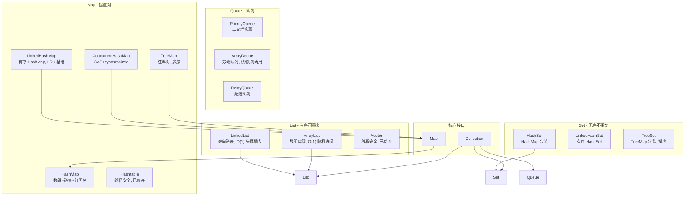
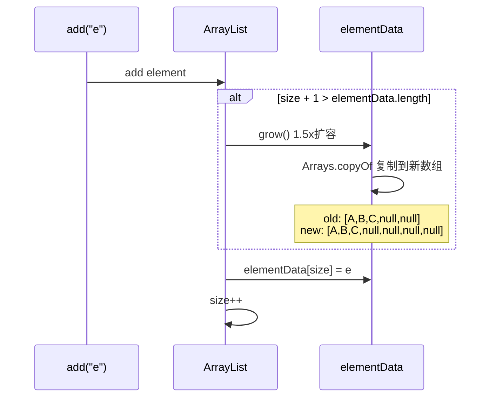
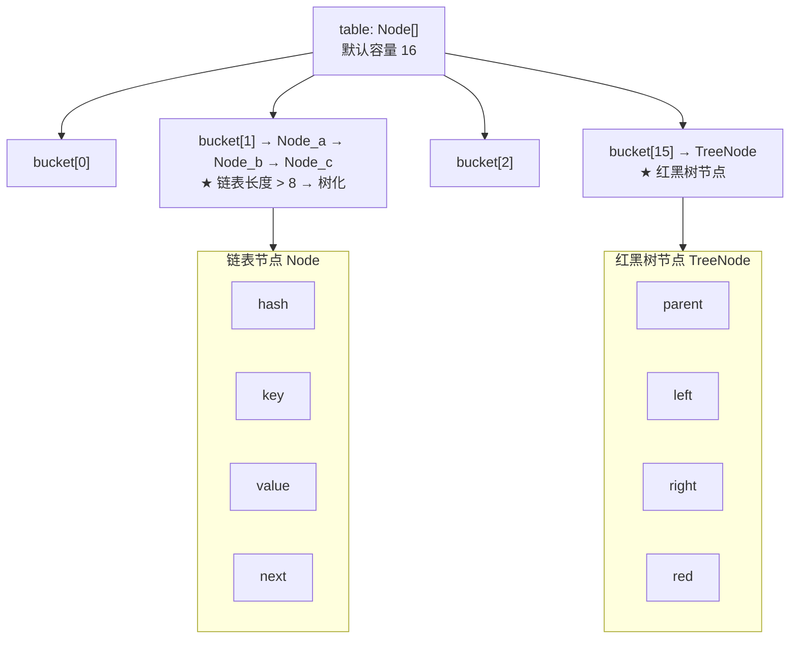
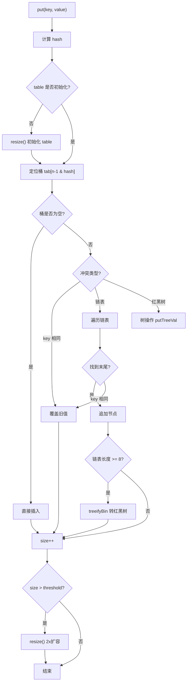
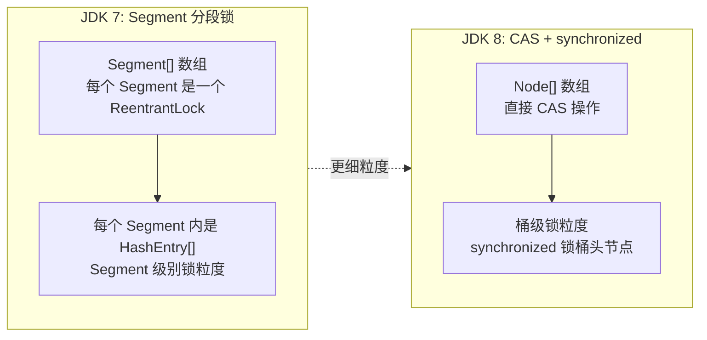
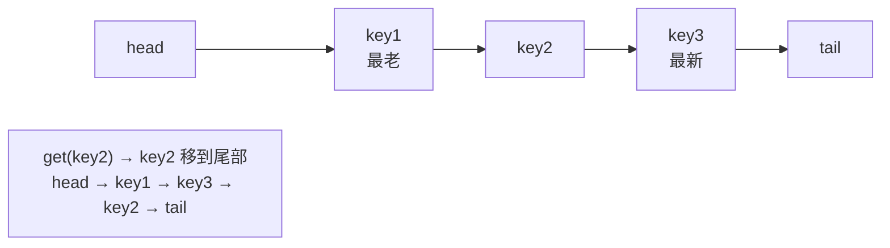
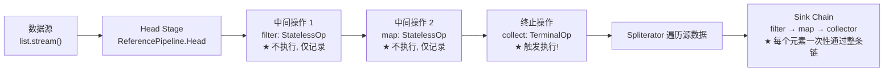

# Java Collections & Stream 源码深度解析

> **面试命中率 90%+**：ArrayList 扩容、HashMap 哈希算法、ConcurrentHashMap CAS、Stream 惰性求值。

---

## 目录

- [1. 集合框架全景架构](#1-集合框架全景架构)
- [2. ArrayList 源码详解](#2-arraylist-源码详解)
- [3. LinkedList 源码详解](#3-linkedlist-源码详解)
- [4. HashMap 源码详解（JDK 8）](#4-hashmap-源码详解jdk-8)
- [5. ConcurrentHashMap 源码详解](#5-concurrenthashmap-源码详解)
- [6. LinkedHashMap 与 LRU 缓存](#6-linkedhashmap-与-lru-缓存)
- [7. TreeMap 与红黑树](#7-treemap-与红黑树)
- [8. Stream API 源码深度](#8-stream-api-源码深度)
- [9. 设计模式在集合中的应用](#9-设计模式在集合中的应用)
- [10. 面试真题与陷阱](#10-面试真题与陷阱)

---

## 1. 集合框架全景架构



### 1.1 时间复杂度总表

| 类 | get | add | remove | contains | 迭代 | 有序 |
|----|-----|-----|--------|----------|------|------|
| **ArrayList** | O(1) | O(1) 均摊 | O(n) | O(n) | O(n) | ✅ 插入序 |
| **LinkedList** | O(n) | O(1) | O(1) | O(n) | O(n) | ✅ 插入序 |
| **HashSet** | — | O(1) | O(1) | O(1) | O(n) | ❌ |
| **TreeSet** | — | O(log n) | O(log n) | O(log n) | O(n) | ✅ 排序序 |
| **HashMap** | O(1) | O(1) | O(1) | O(1) | O(n) | ❌ |
| **TreeMap** | O(log n) | O(log n) | O(log n) | O(log n) | O(n) | ✅ 排序序 |
| **ConcurrentHashMap** | O(1) | O(1) | O(1) | — | O(n) | ❌ |

---

## 2. ArrayList 源码详解

### 2.1 核心数据结构

```java
public class ArrayList<E> extends AbstractList<E> {
    // ★ 底层就是一个 Object 数组
    transient Object[] elementData;  // transient: 手动序列化, 避免空位浪费
    
    private int size;  // ★ 实际元素数量 (不同于 elementData.length!)
    
    // 默认容量
    private static final int DEFAULT_CAPACITY = 10;
    
    // ★ 共享空数组 (new ArrayList<>() 不立即创建 10 容量)
    private static final Object[] EMPTY_ELEMENTDATA = {};
    private static final Object[] DEFAULTCAPACITY_EMPTY_ELEMENTDATA = {};
}
```

### 2.2 add() 与扩容机制

```java
// ArrayList.add(E e) 完整流程
public boolean add(E e) {
    // 1. 确保容量足够 (modCount++)
    ensureCapacityInternal(size + 1);
    // 2. 放入数组
    elementData[size++] = e;
    return true;
}

// 扩容核心逻辑 ★
private void grow(int minCapacity) {
    int oldCapacity = elementData.length;
    // ★ 1.5 倍扩容: new = old + (old >> 1)
    int newCapacity = oldCapacity + (oldCapacity >> 1);
    
    if (newCapacity - minCapacity < 0)
        newCapacity = minCapacity;
    if (newCapacity - MAX_ARRAY_SIZE > 0)
        newCapacity = hugeCapacity(minCapacity);
    
    // ★ 核心操作: 复制数组
    elementData = Arrays.copyOf(elementData, newCapacity);
}
```



**扩容代价**：每次扩容都要 `Arrays.copyOf`（底层 `System.arraycopy` 是 native 方法），O(n)。所以如果预知容量，**一定要用 `new ArrayList<>(n)` 指定初始容量**。

### 2.3 remove() 与 modCount

```java
// ArrayList.remove(int index)
public E remove(int index) {
    rangeCheck(index);
    modCount++;  // ★ 记录结构性修改
    
    E oldValue = elementData(index);
    int numMoved = size - index - 1;
    if (numMoved > 0)
        // ★ 将 index+1 后的元素整体前移一位
        System.arraycopy(elementData, index+1, elementData, index, numMoved);
    
    elementData[--size] = null; // ★ 置 null 让 GC 回收
    return oldValue;
}
```

**modCount 的作用**：fail-fast 机制。如果在迭代时修改了集合（`modCount != expectedModCount`），抛出 `ConcurrentModificationException`。

```java
// 典型 fail-fast 场景
for (String s : list) {
    list.remove(s);  // ★ ConcurrentModificationException!
}
// 正确做法: Iterator.remove()
Iterator<String> it = list.iterator();
while (it.hasNext()) {
    if (condition(it.next())) it.remove();
}
```

### 2.4 ArrayList vs 数组

| 维度 | ArrayList | 数组 |
|------|-----------|------|
| 扩容 | 自动 1.5x | 手动 |
| 泛型 | ✅ | ❌（协变） |
| 元素类型 | 引用类型（有装箱开销） | 基本类型 |
| 序列化 | 手动（跳过空位） | — |
| 内存 | 有空位浪费 | 精确 |

---

## 3. LinkedList 源码详解

### 3.1 双向链表结构

```java
public class LinkedList<E> {
    transient Node<E> first;  // 头节点
    transient Node<E> last;   // 尾节点
    
    // ★ 内部节点类
    private static class Node<E> {
        E item;
        Node<E> next;
        Node<E> prev;
        Node(Node<E> prev, E element, Node<E> next) {
            this.item = element;
            this.next = next;
            this.prev = prev;
        }
    }
}
```

### 3.2 Queue 接口实现

```java
// LinkedList 同时实现了 List 和 Deque, 所以可以当:
// 1. 列表: add(e) / get(i) / remove(i)
// 2. 栈: push(e) / pop()       (底层 addFirst/removeFirst)
// 3. 队列: offer(e) / poll()   (底层 addLast/removeFirst)
// 4. 双端队列: addFirst/Last, removeFirst/Last

// 当栈用时:
Deque<Integer> stack = new LinkedList<>();
stack.push(1);  // [1]
stack.push(2);  // [2,1]
stack.pop();    // 2, 栈变 [1]

// ★ 注意: Stack 类已废弃, 用 Deque 替代
```

### 3.3 ArrayList vs LinkedList 选择

| 场景 | 推荐 | 原因 |
|------|------|------|
| 频繁随机访问 get(i) | ArrayList | O(1) vs O(n) |
| 频繁尾部追加 | ArrayList | O(1) 均摊 |
| 频繁头部插入 | LinkedList | O(1) vs O(n) |
| 频繁遍历 | ArrayList | 内存连续, CPU 缓存友好 |
| 内存敏感 | ArrayList | Node 有 prev/next 指针开销(24B/节点) |
| 大量数据频繁删除 | LinkedList | O(1) vs O(n) |

> 绝大多数场景用 ArrayList。LinkedList 只有在频繁头部操作且不需要随机访问时才考虑。

---

## 4. HashMap 源码详解（JDK 8）

### 4.1 数据结构：数组 + 链表 + 红黑树



### 4.2 hash 算法

```java
// ★ HashMap 的 hash 算法 — 扰动函数
static final int hash(Object key) {
    int h;
    // 1. key.hashCode()
    // 2. 高 16 位 异或 低 16 位
    return (key == null) ? 0 : (h = key.hashCode()) ^ (h >>> 16);
}

// 定位桶: tab[(n - 1) & hash]
// n = table.length, 一定是 2 的幂 (16, 32, 64...)
// (n - 1) & hash 等价于 hash % n, 但位运算更快
```

**为什么扰动？** 如果只用 `hashCode()` 的低位，高位差异会被 `(n-1) & hash` 忽略。`hashCode() ^ (hashCode >>> 16)` 让高位和低位混合，减少哈希冲突。

```
示例: n = 16, n-1 = 15 = 0000 1111

不扰动:
  key1: 0000 0000 0001 0001 → &15 = 0001
  key2: 1111 0000 0001 0001 → &15 = 0001  ← 冲突!

扰动后:
  key2: 1111 0000 0000 1110 → &15 = 1110  ← 不冲突!
```

### 4.3 put() 完整流程

```java
// HashMap.put(key, value) 完整流程(简化)
final V putVal(int hash, K key, V value, boolean onlyIfAbsent, boolean evict) {
    Node<K,V>[] tab; Node<K,V> p; int n, i;
    
    // 1. 第一次 put → 初始化 table (延迟创建!)
    if ((tab = table) == null || (n = tab.length) == 0)
        n = (tab = resize()).length;
    
    // 2. 定位桶, 如果为空 → 直接插入
    if ((p = tab[i = (n - 1) & hash]) == null)
        tab[i] = newNode(hash, key, value, null);
    else {
        // 3. 桶非空 → 处理冲突
        Node<K,V> e; K k;
        if (p.hash == hash && ((k = p.key) == key || key.equals(k)))
            e = p;  // 3a. key 相同 → 覆盖
        else if (p instanceof TreeNode)
            e = ((TreeNode<K,V>)p).putTreeVal(this, tab, hash, key, value); // 3b. 树节点
        else {
            for (int binCount = 0; ; ++binCount) {
                if ((e = p.next) == null) {  // 3c. 遍历链表
                    p.next = newNode(hash, key, value, null);
                    // ★ 链表长度 >= 8 → 树化
                    if (binCount >= TREEIFY_THRESHOLD - 1)
                        treeifyBin(tab, hash);
                    break;
                }
                if (e.hash == hash && ((k = e.key) == key || key.equals(k)))
                    break;
                p = e;
            }
        }
        if (e != null) { // 覆盖旧值
            V oldValue = e.value;
            if (!onlyIfAbsent || oldValue == null)
                e.value = value;
            return oldValue;
        }
    }
    ++modCount;
    // ★ 4. size > threshold → 扩容
    if (++size > threshold) resize();
    return null;
}
```



### 4.4 resize() 扩容机制

```java
final Node<K,V>[] resize() {
    Node<K,V>[] oldTab = table;
    int oldCap = (oldTab == null) ? 0 : oldTab.length;
    int oldThr = threshold;
    int newCap, newThr = 0;
    
    if (oldCap > 0) {
        // ★ 已初始化: 2 倍扩容
        newCap = oldCap << 1;
        newThr = oldThr << 1;
    } else {
        // ★ 首次初始化: 容量 = 16, 阈值 = 12 (16 * 0.75)
        newCap = DEFAULT_INITIAL_CAPACITY;  // 16
        newThr = (int)(DEFAULT_LOAD_FACTOR * DEFAULT_INITIAL_CAPACITY); // 12
    }
    
    // ★ 迁移数据: 每个桶的节点重新 hash 分配到新 table
    // 因为 n 变为 2n, (n-1) & hash 只有 1 位变化
    // 所以每个桶的节点分为两组: 留在原位置 / 原位置 + oldCap
    Node<K,V>[] newTab = (Node<K,V>[])new Node[newCap];
    table = newTab;
    
    for (int j = 0; j < oldCap; ++j) {
        Node<K,V> e = oldTab[j];
        if (e != null) {
            // ... 拆分为 loHead/loTail(留在原位) 和 hiHead/hiTail(移到 j+oldCap)
        }
    }
    return newTab;
}
```

**扩容优化**：JDK 8 将每个桶的链表分为**高位链和低位链**，不需要重新计算 hash。因为 `n` 是 2 的幂，扩容后 hash 只多判断 1 位。

### 4.5 树化与反树化

```java
// 树化条件:
// 1. 链表长度 >= TREEIFY_THRESHOLD (8)
// 2. table.length >= MIN_TREEIFY_CAPACITY (64)

// 反树化条件:
// 1. 树节点数量 <= UNTREEIFY_THRESHOLD (6) — resize 或 remove 时触发

// 为什么阈值是 8?
// 泊松分布: 负载因子 0.75 下, 链表长度 >= 8 的概率 < 千万分之一
// 所以正常情况下不会树化, 树化是为了防御恶意哈希碰撞
```

---

## 5. ConcurrentHashMap 源码详解

### 5.1 JDK 7 vs JDK 8 核心变化



### 5.2 put() 核心逻辑

```java
// ConcurrentHashMap.putVal() ★
final V putVal(K key, V value, boolean onlyIfAbsent) {
    // key/value 都不能为 null!
    int hash = spread(key.hashCode());
    int binCount = 0;
    
    for (Node<K,V>[] tab = table;;) {
        Node<K,V> f; int n, i, fh;
        
        // 1. table 未初始化 → CAS 初始化
        if (tab == null || (n = tab.length) == 0)
            tab = initTable();
        
        // 2. 桶为空 → ★ CAS 直接插入, 无锁!
        else if ((f = tabAt(tab, i = (n - 1) & hash)) == null) {
            if (casTabAt(tab, i, null, new Node<K,V>(hash, key, value, null)))
                break;
        }
        
        // 3. 正在扩容 → ★ 帮助扩容
        else if ((fh = f.hash) == MOVED)
            tab = helpTransfer(tab, f);
        
        // 4. 桶非空 → ★ synchronized 锁桶头节点
        else {
            synchronized (f) {  // 锁粒度: 单个桶!
                // ... 链表/树插入逻辑 (与 HashMap 类似)
            }
        }
    }
    // 5. 检查是否需要扩容 (addCount 中 CAS 计数)
    addCount(1L, binCount);
    return null;
}
```

### 5.3 size() 的并发计数

```java
// ★ 不是直接返回 AtomicInteger, 而是用分段计数!
// CounterCell 数组 + baseCount — 类似 LongAdder 的设计

// 添加计数:
private final void addCount(long x, int check) {
    CounterCell[] as; long b, s;
    // CAS 竞争 baseCount
    if ((as = counterCells) != null ||
        !U.compareAndSwapLong(this, BASECOUNT, b = baseCount, s = b + x)) {
        // CAS 失败 → 加到 CounterCell (每个线程有自己的 Cell)
        CounterCell a; long v; int m;
        boolean uncontended = true;
        if (as == null || (m = as.length - 1) < 0 ||
            (a = as[ThreadLocalRandom.getProbe() & m]) == null ||
            !(uncontended = U.compareAndSwapLong(a, CELLVALUE, v = a.value, v + x))) {
            fullAddCount(x, uncontended); // 重试或扩容 Cell 数组
            return;
        }
    }
}

// 获取大小: baseCount + 所有 CounterCell 的值
public int size() {
    long n = sumCount();
    return ((n < 0L) ? 0 : (n > (long)Integer.MAX_VALUE) ? Integer.MAX_VALUE : (int)n);
}
```

### 5.4 HashMap vs ConcurrentHashMap 对比

| 维度 | HashMap | ConcurrentHashMap (JDK 8) |
|------|---------|--------------------------|
| 线程安全 | ❌ | ✅ |
| key/value 可为 null | ✅ | ❌ (NPE) |
| 锁粒度 | — | **桶级** (synchronized) |
| 读操作加锁 | — | **无锁** (volatile 保证可见性) |
| 迭代器 | fail-fast | **弱一致性** (不抛异常) |
| 扩容 | 单线程 | **多线程协同** |

---

## 6. LinkedHashMap 与 LRU 缓存

### 6.1 双向链表维护插入/访问顺序

```java
// LinkedHashMap = HashMap + 双向链表
public class LinkedHashMap<K,V> extends HashMap<K,V> {
    // ★ 额外维护的头尾指针
    transient LinkedHashMap.Entry<K,V> head;
    transient LinkedHashMap.Entry<K,V> tail;
    
    // ★ accessOrder = false: 插入顺序(默认)
    //    accessOrder = true:  访问顺序(LRU)
    final boolean accessOrder;
}
```

### 6.2 实现 LRU 缓存

```java
// ★ 最简单的 LRU 缓存实现
class LRUCache<K, V> extends LinkedHashMap<K, V> {
    private final int maxSize;
    
    public LRUCache(int maxSize) {
        // ★ 构造器: accessOrder = true = LRU 模式
        super(maxSize, 0.75f, true);
        this.maxSize = maxSize;
    }
    
    @Override
    protected boolean removeEldestEntry(Map.Entry<K, V> eldest) {
        // ★ 当 size > maxSize 时自动移除最老的条目
        return size() > maxSize;
    }
}

// 使用:
LRUCache<String, User> cache = new LRUCache<>(100);
cache.put("user:1", user);
cache.get("user:1");  // ★ 访问后移到链表尾部(最近使用)
// 当超过 100 条时, 最老的(最少使用的)自动被移除
```



---

## 7. TreeMap 与红黑树

### 7.1 红黑树五大性质

```
1. 每个节点是红色或黑色
2. 根节点是黑色
3. 叶子节点(NIL)是黑色
4. 红色节点的两个子节点都是黑色
5. 任意节点到其所有后代叶子的简单路径上, 黑色节点数相同

性质5保证: 最长路径 ≤ 2 × 最短路径 (近似平衡)
```

### 7.2 TreeMap 排序

```java
// 自然排序 (key 实现 Comparable)
TreeMap<String, Integer> map1 = new TreeMap<>();

// 自定义排序
TreeMap<String, Integer> map2 = new TreeMap<>((a, b) -> b.compareTo(a));  // 降序

// ★ TreeMap 的 key 必须可比较, 否则 put 时 ClassCastException
```

### 7.3 HashMap vs TreeMap

| 维度 | HashMap | TreeMap |
|------|---------|---------|
| 顺序 | 无 | **有序**(自然序或自定义) |
| 时间复杂度 | O(1) | **O(log n)** |
| 底层 | 数组+链表+红黑树 | **红黑树** |
| key 要求 | equals + hashCode | **Comparable 或 Comparator** |
| null key | ✅ | ❌ (NPE) |
| 子集操作 | ❌ | ✅ subMap/headMap/tailMap |

---

## 8. Stream API 源码深度

### 8.1 惰性求值 + 流水线



**核心概念**：Stream 的中间操作是**惰性**的——只记录操作链，不执行。终止操作时才触发整条流水线对每个元素依次执行。

```java
// 这不是先 filter 全量, 再 map 全量, 再 collect!
list.stream()
    .filter(x -> x > 0)   // ★ 构建时不执行
    .map(x -> x * 2)      // ★ 构建时不执行
    .collect(toList());   // ★ 这里才执行!

// 实际执行顺序 (每个元素一次性走完整条链):
//   元素1 → filter → map → collect → 
//   元素2 → filter → map → collect → ...
```

### 8.2 核心源码：流水线构建与执行

```java
// 中间操作示例: filter()
public final Stream<P_OUT> filter(Predicate<? super P_OUT> predicate) {
    Objects.requireNonNull(predicate);
    // ★ 不执行! 只创建一个新的 Stage 节点, 记录操作
    return new StatelessOp<P_OUT, P_OUT>(this, StreamShape.REFERENCE,
            StreamOpFlag.NOT_SIZED) {
        @Override
        Sink<P_OUT> opWrapSink(int flags, Sink<P_OUT> sink) {
            return new Sink.ChainedReference<P_OUT, P_OUT>(sink) {
                @Override
                public void accept(P_OUT u) {
                    if (predicate.test(u))   // 满足条件 → 传给下游
                        downstream.accept(u);
                    // ★ 不满足条件 → 到此结束(短路)
                }
            };
        }
    };
}

// 终止操作: collect()
final <R, A> R evaluate(TerminalOp<E_OUT, R> terminalOp) {
    if (linkedOrConsumed) throw new IllegalStateException("stream reused");
    linkedOrConsumed = true;
    // ★ 触发流水线执行
    return isParallel()
           ? terminalOp.evaluateParallel(this, sourceSpliterator(terminalOp.getOpFlags()))
           : terminalOp.evaluateSequential(this, sourceSpliterator(terminalOp.getOpFlags()));
}
```

### 8.3 并行流陷阱

```java
// ❌ 共享可变状态 — 结果不确定!
List<Integer> result = new ArrayList<>();
IntStream.range(0, 1000)
    .parallel()              // ★ 并行流
    .forEach(result::add);   // ArrayList 非线程安全!→ 结果错乱

// ✅ 正确用法: 用 collect
List<Integer> result = IntStream.range(0, 1000)
    .parallel()
    .boxed()
    .collect(Collectors.toList());

// ★ 并行流适用条件:
// 1. 数据量大 (N > 10000)
// 2. 计算密集 (每个元素耗时)
// 3. 无共享可变状态
// 4. 无同步操作(如 I/O)
```

### 8.4 高频 Collector

| Collector | 功能 | 示例 |
|-----------|------|------|
| `toList()` | 收集为 List | `collect(toList())` |
| `toSet()` | 收集为 Set | `collect(toSet())` |
| `toMap()` | 收集为 Map（key 冲突报错） | `collect(toMap(User::getId, u->u))` |
| `toMap(Function,Function,BinaryOperator)` | key 冲突时合并 | `collect(toMap(User::getId, u->u, (a,b)->b))` |
| `groupingBy()` | 分组 | `collect(groupingBy(User::getCity))` |
| `partitioningBy()` | 按布尔分区 | `collect(partitioningBy(User::isVip))` |
| `joining()` | 字符串拼接 | `collect(joining(", "))` |
| `reducing()` | 归约 | `collect(reducing(0, User::getAge, Integer::sum))` |

---

## 9. 设计模式在集合中的应用

### 9.1 装饰器模式 — Collections.unmodifiableXxx()

```java
// ★ 装饰器模式: 给普通集合包装一层"不可修改"外壳
List<String> list = new ArrayList<>();
List<String> unmodifiable = Collections.unmodifiableList(list);
unmodifiable.add("x");  // ❌ UnsupportedOperationException!

// 源码: UnmodifiableList 继承 List, 持有原始 List 引用
//       所有修改方法 override 为抛异常
//       读取方法 delegate 到原始 List
```

### 9.2 适配器模式 — Arrays.asList()

```java
// ★ 适配器: 数组 → List (不是真正的 List!)
String[] arr = {"a", "b", "c"};
List<String> list = Arrays.asList(arr);

// 陷阱 1: list.add("d") → ❌ UnsupportedOperationException (固定长度)
// 陷阱 2: arr[0] = "x" → list.get(0) 变为 "x" (共享底层数组!)

// 正确做法:
List<String> real = new ArrayList<>(Arrays.asList(arr));
```

### 9.3 迭代器模式 — Iterator / for-each

```
Java 集合框架的核心就是迭代器模式:
  - Collection 接口 extends Iterable (提供 iterator())
  - for-each 语法糖编译后就是 Iterator 调用
  - 每种集合有自己的 Iterator 实现 (ArrayList.Itr, HashMap.EntryIterator...)
```

### 9.4 策略模式 — Comparator

```java
// ★ 排序策略在运行时决定
list.sort((a, b) -> a.getName().compareTo(b.getName()));  // 策略 A: 按名称
list.sort((a, b) -> Integer.compare(a.getAge(), b.getAge()));  // 策略 B: 按年龄
list.sort(Comparator.comparing(User::getAge).reversed());      // 策略 C: 按年龄降序
```

---

## 10. 面试真题与陷阱

### 10.1 ArrayList

**Q1: `new ArrayList<>(10)` 和 `new ArrayList<>()` 有什么区别？**

| 维度 | `new ArrayList<>()` | `new ArrayList<>(10)` |
|------|---------------------|----------------------|
| 初始容量 | 0 (JDK 7+) | 10 |
| 首次 add 时 | 扩容到 10 | 不扩容 |
| 已知容量 | 多一次扩容 | 无额外扩容 |

**Q2: `ArrayList` 的 `subList()` 返回的是什么？**

```java
List<String> list = new ArrayList<>(List.of("A", "B", "C"));
List<String> sub = list.subList(0, 2);  // ["A", "B"]

sub.add("X");  // ★ 修改 subList → 原 list 也变了!
// list = ["A", "B", "X", "C"]
// subList 是原 list 的视图, 共享底层数组!
```

### 10.2 HashMap

**Q3: HashMap 的容量为什么是 2 的幂？**

因为 `(n - 1) & hash` 取模运算等价于 `hash % n`（当 n 是 2 的幂时）。位运算 `&` 比取模 `%` 快一个数量级。

**Q4: HashMap 的负载因子为什么是 0.75？**

时空权衡：太低→频繁扩容浪费空间；太高→冲突增加降低效率。0.75 是泊松分布计算的最优值。

**Q5: 为什么重写 `equals()` 必须重写 `hashCode()`？**

HashMap 先用 `hashCode()` 定位桶，再用 `equals()` 比较 key。如果 `equals` 相等但 `hashCode` 不同，会定位到不同桶，导致"相等的 key"get 不到值。

### 10.3 ConcurrentHashMap

**Q6: ConcurrentHashMap 的 key/value 为什么不能为 null？**

歧义问题：`map.get(key)` 返回 null 是"key 不存在"还是"value 就是 null"？在并发环境下无法区分。HashMap 允许 null 是因为非并发场景可以通过 `containsKey()` 区分。

### 10.4 Stream

**Q7: Stream 可以复用吗？**

```java
Stream<String> stream = list.stream();
stream.filter(...);             // 第一次使用 ✅
stream.map(...);                // ❌ IllegalStateException: stream already operated upon!
// Stream 只能消费一次!
```

### 10.5 快速决策：什么场景用什么集合？

| 场景 | 选择 |
|------|------|
| 需要 `get(i)` 快速随机访问 | `ArrayList` |
| 频繁头部插入/删除 | `LinkedList`（但数据量大时 `ArrayDeque` 更好） |
| 需要 key-value 但不排序 | `HashMap` |
| 需要 key-value 且排序 | `TreeMap` |
| 需要线程安全的 HashMap | `ConcurrentHashMap` |
| 需要 LRU 缓存 | `LinkedHashMap(accessOrder=true)` |
| 需要去重 | `HashSet` (无顺序) / `TreeSet` (排序) |
| 需要栈 | `ArrayDeque` (比 `Stack` 快) |
| 需要队列 | `ArrayDeque` 或 `LinkedList` |
| 需要优先级队列 | `PriorityQueue` |
| 只读集合 | `List.of()` / `Collections.unmodifiableList()` |

---

*全文 10 章，基于 JDK 8/11/17/21 源码编写。*
