# JDK 核心源码深度解析

> JUC 并发、Collections & Stream、IO/NIO/AIO、Thread/反射/泛型/SPI/time/MethodHandle — 24 章全覆盖。

---

## 目录

### 第一部分：JUC 并发编程
- [1. AQS 抽象队列同步器](#1-aqs-抽象队列同步器)
- [2. ThreadPoolExecutor 线程池](#2-threadpoolexecutor-线程池)
- [3. JUC 工具类](#3-juc-工具类)
- [4. CompletableFuture 异步编程](#4-completablefuture-异步编程)
- [5. ForkJoinPool 分治框架](#5-forkjoinpool-分治框架)

### 第二部分：Collections & Stream
- [6. 集合框架全景架构](#6-集合框架全景架构)
- [7. ArrayList 源码详解](#7-arraylist-源码详解)
- [8. LinkedList 源码详解](#8-linkedlist-源码详解)
- [9. HashMap 源码详解（JDK 8）](#9-hashmap-源码详解jdk-8)
- [10. ConcurrentHashMap 源码详解](#10-concurrenthashmap-源码详解)
- [11. LinkedHashMap 与 LRU 缓存](#11-linkedhashmap-与-lru-缓存)
- [12. TreeMap 与红黑树](#12-treemap-与红黑树)
- [13. Stream API 源码深度](#13-stream-api-源码深度)
- [14. 设计模式在集合中的应用（装饰器/适配器/迭代器/策略）](#14-设计模式在集合中的应用)
- [15. 面试真题与陷阱 + 场景选型速查表](#15-面试真题与陷阱)

### 第三部分：IO/NIO/AIO
- [16. Java IO 装饰器模式](#16-java-io-装饰器模式)
- [17. NIO 三大组件](#17-nio-三大组件)
- [18. AIO 异步 IO](#18-aio-异步-io)

### 第四部分：Java 底层机制
- [19. Thread 状态机与 wait/notify](#19-thread-状态机与-waitnotify)
- [20. 反射与 JDK 动态代理](#20-反射与-jdk-动态代理)
- [21. Java 泛型深度](#21-java-泛型深度)
- [22. SPI 服务发现机制](#22-spi-服务发现机制)
- [23. java.time 时间 API](#23-javatime-时间-api)
- [24. MethodHandle 与 invokedynamic](#24-methodhandle-与-invokedynamic)

---

# 第二部分：Collections & Stream

> 面试命中率 90%+：ArrayList 扩容、HashMap 哈希算法、ConcurrentHashMap CAS、Stream 惰性求值。

## 7. ArrayList 源码详解

### 2.1 核心数据结构

```java
public class ArrayList<E> extends AbstractList<E> {
    // ★ 底层就是一个 Object 数组
    transient Object[] elementData;  // transient: 手动序列化, 避免空位浪费
    
    private int size;  // ★ 实际元素数量 (不同于 elementData.length!)
    
    // 默认容量
    private static final int DEFAULT_CAPACITY = 10;
    
    // ★ 共享空数组 (new ArrayList<>() 不立即创建 10 容量)
    private static final Object[] EMPTY_ELEMENTDATA = {};
    private static final Object[] DEFAULTCAPACITY_EMPTY_ELEMENTDATA = {};
}
```

### 2.2 add() 与扩容机制

```java
// ArrayList.add(E e) 完整流程
public boolean add(E e) {
    // 1. 确保容量足够 (modCount++)
    ensureCapacityInternal(size + 1);
    // 2. 放入数组
    elementData[size++] = e;
    return true;
}

// 扩容核心逻辑 ★
private void grow(int minCapacity) {
    int oldCapacity = elementData.length;
    // ★ 1.5 倍扩容: new = old + (old >> 1)
    int newCapacity = oldCapacity + (oldCapacity >> 1);
    
    if (newCapacity - minCapacity < 0)
        newCapacity = minCapacity;
    if (newCapacity - MAX_ARRAY_SIZE > 0)
        newCapacity = hugeCapacity(minCapacity);
    
    // ★ 核心操作: 复制数组
    elementData = Arrays.copyOf(elementData, newCapacity);
}
```

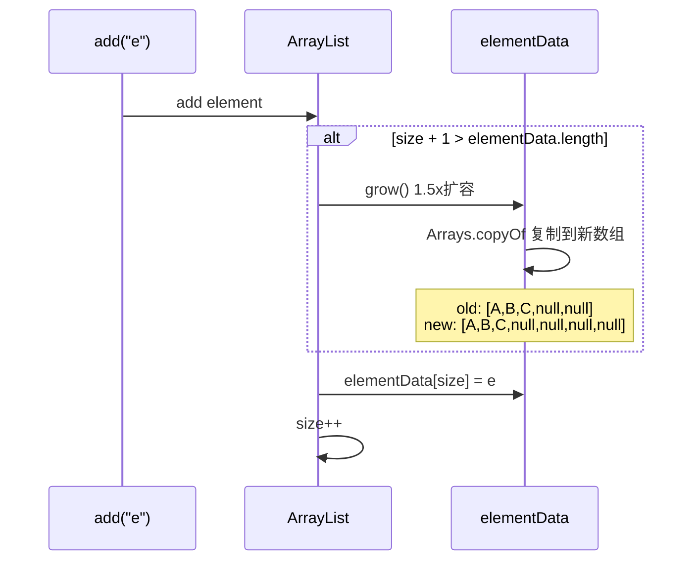

**扩容代价**：每次扩容都要 `Arrays.copyOf`（底层 `System.arraycopy` 是 native 方法），O(n)。所以如果预知容量，**一定要用 `new ArrayList<>(n)` 指定初始容量**。

### 2.3 remove() 与 modCount

```java
// ArrayList.remove(int index)
public E remove(int index) {
    rangeCheck(index);
    modCount++;  // ★ 记录结构性修改
    
    E oldValue = elementData(index);
    int numMoved = size - index - 1;
    if (numMoved > 0)
        // ★ 将 index+1 后的元素整体前移一位
        System.arraycopy(elementData, index+1, elementData, index, numMoved);
    
    elementData[--size] = null; // ★ 置 null 让 GC 回收
    return oldValue;
}
```

**modCount 的作用**：fail-fast 机制。如果在迭代时修改了集合（`modCount != expectedModCount`），抛出 `ConcurrentModificationException`。

```java
// 典型 fail-fast 场景
for (String s : list) {
    list.remove(s);  // ★ ConcurrentModificationException!
}
// 正确做法: Iterator.remove()
Iterator<String> it = list.iterator();
while (it.hasNext()) {
    if (condition(it.next())) it.remove();
}
```

### 2.4 ArrayList vs 数组

| 维度 | ArrayList | 数组 |
|------|-----------|------|
| 扩容 | 自动 1.5x | 手动 |
| 泛型 | ✅ | ❌（协变） |
| 元素类型 | 引用类型（有装箱开销） | 基本类型 |
| 序列化 | 手动（跳过空位） | — |
| 内存 | 有空位浪费 | 精确 |

---

## 8. LinkedList 源码详解

### 3.1 双向链表结构

```java
public class LinkedList<E> {
    transient Node<E> first;  // 头节点
    transient Node<E> last;   // 尾节点
    
    // ★ 内部节点类
    private static class Node<E> {
        E item;
        Node<E> next;
        Node<E> prev;
        Node(Node<E> prev, E element, Node<E> next) {
            this.item = element;
            this.next = next;
            this.prev = prev;
        }
    }
}
```

### 3.2 Queue 接口实现

```java
// LinkedList 同时实现了 List 和 Deque, 所以可以当:
// 1. 列表: add(e) / get(i) / remove(i)
// 2. 栈: push(e) / pop()       (底层 addFirst/removeFirst)
// 3. 队列: offer(e) / poll()   (底层 addLast/removeFirst)
// 4. 双端队列: addFirst/Last, removeFirst/Last

// 当栈用时:
Deque<Integer> stack = new LinkedList<>();
stack.push(1);  // [1]
stack.push(2);  // [2,1]
stack.pop();    // 2, 栈变 [1]

// ★ 注意: Stack 类已废弃, 用 Deque 替代
```

### 3.3 ArrayList vs LinkedList 选择

| 场景 | 推荐 | 原因 |
|------|------|------|
| 频繁随机访问 get(i) | ArrayList | O(1) vs O(n) |
| 频繁尾部追加 | ArrayList | O(1) 均摊 |
| 频繁头部插入 | LinkedList | O(1) vs O(n) |
| 频繁遍历 | ArrayList | 内存连续, CPU 缓存友好 |
| 内存敏感 | ArrayList | Node 有 prev/next 指针开销(24B/节点) |
| 大量数据频繁删除 | LinkedList | O(1) vs O(n) |

> 绝大多数场景用 ArrayList。LinkedList 只有在频繁头部操作且不需要随机访问时才考虑。

---

## 9. HashMap 源码详解（JDK 8）

### 4.1 数据结构：数组 + 链表 + 红黑树

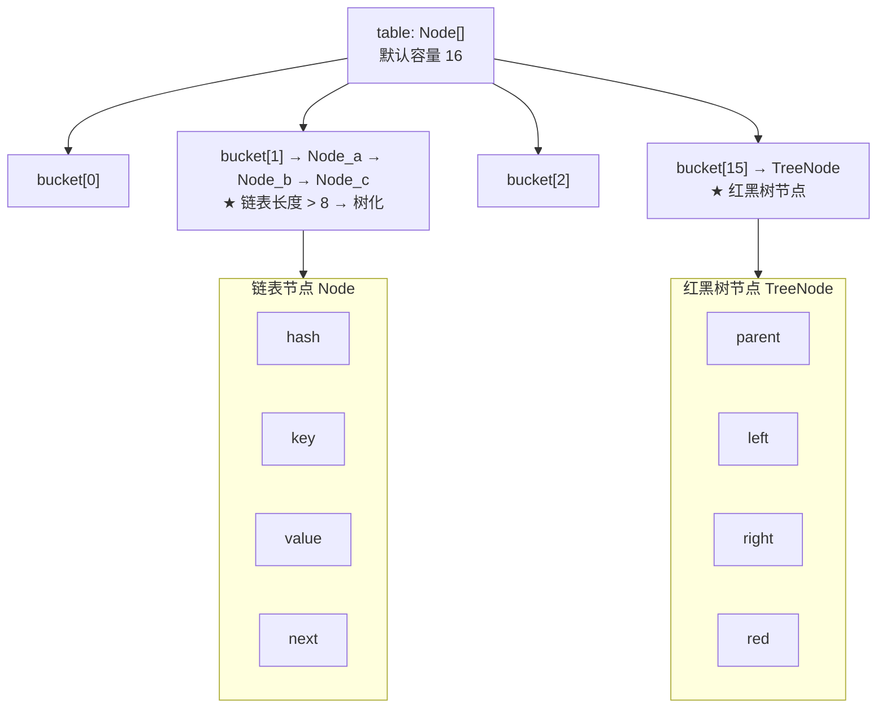

### 4.2 hash 算法

```java
// ★ HashMap 的 hash 算法 — 扰动函数
static final int hash(Object key) {
    int h;
    // 1. key.hashCode()
    // 2. 高 16 位 异或 低 16 位
    return (key == null) ? 0 : (h = key.hashCode()) ^ (h >>> 16);
}

// 定位桶: tab[(n - 1) & hash]
// n = table.length, 一定是 2 的幂 (16, 32, 64...)
// (n - 1) & hash 等价于 hash % n, 但位运算更快
```

**为什么扰动？** 如果只用 `hashCode()` 的低位，高位差异会被 `(n-1) & hash` 忽略。`hashCode() ^ (hashCode >>> 16)` 让高位和低位混合，减少哈希冲突。

```
示例: n = 16, n-1 = 15 = 0000 1111

不扰动:
  key1: 0000 0000 0001 0001 → &15 = 0001
  key2: 1111 0000 0001 0001 → &15 = 0001  ← 冲突!

扰动后:
  key2: 1111 0000 0000 1110 → &15 = 1110  ← 不冲突!
```

### 4.3 put() 完整流程

```java
// HashMap.put(key, value) 完整流程(简化)
final V putVal(int hash, K key, V value, boolean onlyIfAbsent, boolean evict) {
    Node<K,V>[] tab; Node<K,V> p; int n, i;
    
    // 1. 第一次 put → 初始化 table (延迟创建!)
    if ((tab = table) == null || (n = tab.length) == 0)
        n = (tab = resize()).length;
    
    // 2. 定位桶, 如果为空 → 直接插入
    if ((p = tab[i = (n - 1) & hash]) == null)
        tab[i] = newNode(hash, key, value, null);
    else {
        // 3. 桶非空 → 处理冲突
        Node<K,V> e; K k;
        if (p.hash == hash && ((k = p.key) == key || key.equals(k)))
            e = p;  // 3a. key 相同 → 覆盖
        else if (p instanceof TreeNode)
            e = ((TreeNode<K,V>)p).putTreeVal(this, tab, hash, key, value); // 3b. 树节点
        else {
            for (int binCount = 0; ; ++binCount) {
                if ((e = p.next) == null) {  // 3c. 遍历链表
                    p.next = newNode(hash, key, value, null);
                    // ★ 链表长度 >= 8 → 树化
                    if (binCount >= TREEIFY_THRESHOLD - 1)
                        treeifyBin(tab, hash);
                    break;
                }
                if (e.hash == hash && ((k = e.key) == key || key.equals(k)))
                    break;
                p = e;
            }
        }
        if (e != null) { // 覆盖旧值
            V oldValue = e.value;
            if (!onlyIfAbsent || oldValue == null)
                e.value = value;
            return oldValue;
        }
    }
    ++modCount;
    // ★ 4. size > threshold → 扩容
    if (++size > threshold) resize();
    return null;
}
```

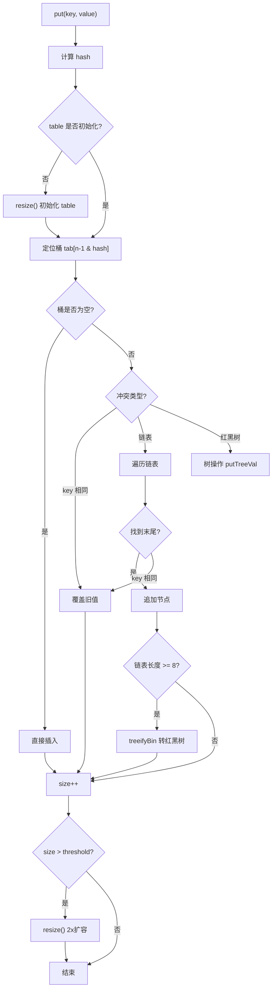

### 4.4 resize() 扩容机制

```java
final Node<K,V>[] resize() {
    Node<K,V>[] oldTab = table;
    int oldCap = (oldTab == null) ? 0 : oldTab.length;
    int oldThr = threshold;
    int newCap, newThr = 0;
    
    if (oldCap > 0) {
        // ★ 已初始化: 2 倍扩容
        newCap = oldCap << 1;
        newThr = oldThr << 1;
    } else {
        // ★ 首次初始化: 容量 = 16, 阈值 = 12 (16 * 0.75)
        newCap = DEFAULT_INITIAL_CAPACITY;  // 16
        newThr = (int)(DEFAULT_LOAD_FACTOR * DEFAULT_INITIAL_CAPACITY); // 12
    }
    
    // ★ 迁移数据: 每个桶的节点重新 hash 分配到新 table
    // 因为 n 变为 2n, (n-1) & hash 只有 1 位变化
    // 所以每个桶的节点分为两组: 留在原位置 / 原位置 + oldCap
    Node<K,V>[] newTab = (Node<K,V>[])new Node[newCap];
    table = newTab;
    
    for (int j = 0; j < oldCap; ++j) {
        Node<K,V> e = oldTab[j];
        if (e != null) {
            // ... 拆分为 loHead/loTail(留在原位) 和 hiHead/hiTail(移到 j+oldCap)
        }
    }
    return newTab;
}
```

**扩容优化**：JDK 8 将每个桶的链表分为**高位链和低位链**，不需要重新计算 hash。因为 `n` 是 2 的幂，扩容后 hash 只多判断 1 位。

### 4.5 树化与反树化

```java
// 树化条件:
// 1. 链表长度 >= TREEIFY_THRESHOLD (8)
// 2. table.length >= MIN_TREEIFY_CAPACITY (64)

// 反树化条件:
// 1. 树节点数量 <= UNTREEIFY_THRESHOLD (6) — resize 或 remove 时触发

// 为什么阈值是 8?
// 泊松分布: 负载因子 0.75 下, 链表长度 >= 8 的概率 < 千万分之一
// 所以正常情况下不会树化, 树化是为了防御恶意哈希碰撞
```

---

## 10. ConcurrentHashMap 源码详解

### 5.1 JDK 7 vs JDK 8 核心变化

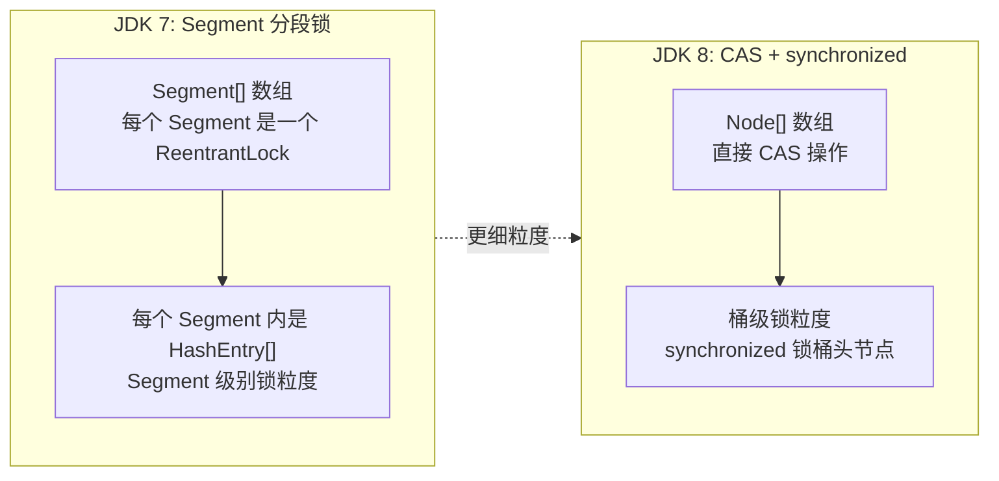

### 5.2 put() 核心逻辑

```java
// ConcurrentHashMap.putVal() ★
final V putVal(K key, V value, boolean onlyIfAbsent) {
    // key/value 都不能为 null!
    int hash = spread(key.hashCode());
    int binCount = 0;
    
    for (Node<K,V>[] tab = table;;) {
        Node<K,V> f; int n, i, fh;
        
        // 1. table 未初始化 → CAS 初始化
        if (tab == null || (n = tab.length) == 0)
            tab = initTable();
        
        // 2. 桶为空 → ★ CAS 直接插入, 无锁!
        else if ((f = tabAt(tab, i = (n - 1) & hash)) == null) {
            if (casTabAt(tab, i, null, new Node<K,V>(hash, key, value, null)))
                break;
        }
        
        // 3. 正在扩容 → ★ 帮助扩容
        else if ((fh = f.hash) == MOVED)
            tab = helpTransfer(tab, f);
        
        // 4. 桶非空 → ★ synchronized 锁桶头节点
        else {
            synchronized (f) {  // 锁粒度: 单个桶!
                // ... 链表/树插入逻辑 (与 HashMap 类似)
            }
        }
    }
    // 5. 检查是否需要扩容 (addCount 中 CAS 计数)
    addCount(1L, binCount);
    return null;
}
```

### 5.3 size() 的并发计数

```java
// ★ 不是直接返回 AtomicInteger, 而是用分段计数!
// CounterCell 数组 + baseCount — 类似 LongAdder 的设计

// 添加计数:
private final void addCount(long x, int check) {
    CounterCell[] as; long b, s;
    // CAS 竞争 baseCount
    if ((as = counterCells) != null ||
        !U.compareAndSwapLong(this, BASECOUNT, b = baseCount, s = b + x)) {
        // CAS 失败 → 加到 CounterCell (每个线程有自己的 Cell)
        CounterCell a; long v; int m;
        boolean uncontended = true;
        if (as == null || (m = as.length - 1) < 0 ||
            (a = as[ThreadLocalRandom.getProbe() & m]) == null ||
            !(uncontended = U.compareAndSwapLong(a, CELLVALUE, v = a.value, v + x))) {
            fullAddCount(x, uncontended); // 重试或扩容 Cell 数组
            return;
        }
    }
}

// 获取大小: baseCount + 所有 CounterCell 的值
public int size() {
    long n = sumCount();
    return ((n < 0L) ? 0 : (n > (long)Integer.MAX_VALUE) ? Integer.MAX_VALUE : (int)n);
}
```

### 5.4 HashMap vs ConcurrentHashMap 对比

| 维度 | HashMap | ConcurrentHashMap (JDK 8) |
|------|---------|--------------------------|
| 线程安全 | ❌ | ✅ |
| key/value 可为 null | ✅ | ❌ (NPE) |
| 锁粒度 | — | **桶级** (synchronized) |
| 读操作加锁 | — | **无锁** (volatile 保证可见性) |
| 迭代器 | fail-fast | **弱一致性** (不抛异常) |
| 扩容 | 单线程 | **多线程协同** |

---

## 11. LinkedHashMap 与 LRU 缓存

### 6.1 双向链表维护插入/访问顺序

```java
// LinkedHashMap = HashMap + 双向链表
public class LinkedHashMap<K,V> extends HashMap<K,V> {
    // ★ 额外维护的头尾指针
    transient LinkedHashMap.Entry<K,V> head;
    transient LinkedHashMap.Entry<K,V> tail;
    
    // ★ accessOrder = false: 插入顺序(默认)
    //    accessOrder = true:  访问顺序(LRU)
    final boolean accessOrder;
}
```

### 6.2 实现 LRU 缓存

```java
// ★ 最简单的 LRU 缓存实现
class LRUCache<K, V> extends LinkedHashMap<K, V> {
    private final int maxSize;
    
    public LRUCache(int maxSize) {
        // ★ 构造器: accessOrder = true = LRU 模式
        super(maxSize, 0.75f, true);
        this.maxSize = maxSize;
    }
    
    @Override
    protected boolean removeEldestEntry(Map.Entry<K, V> eldest) {
        // ★ 当 size > maxSize 时自动移除最老的条目
        return size() > maxSize;
    }
}

// 使用:
LRUCache<String, User> cache = new LRUCache<>(100);
cache.put("user:1", user);
cache.get("user:1");  // ★ 访问后移到链表尾部(最近使用)
// 当超过 100 条时, 最老的(最少使用的)自动被移除
```

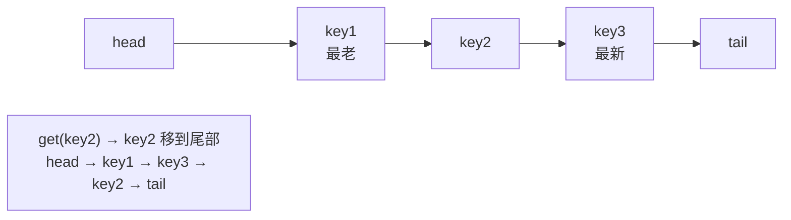

---

## 12. TreeMap 与红黑树

### 7.1 红黑树五大性质

```
1. 每个节点是红色或黑色
2. 根节点是黑色
3. 叶子节点(NIL)是黑色
4. 红色节点的两个子节点都是黑色
5. 任意节点到其所有后代叶子的简单路径上, 黑色节点数相同

性质5保证: 最长路径 ≤ 2 × 最短路径 (近似平衡)
```

### 7.2 TreeMap 排序

```java
// 自然排序 (key 实现 Comparable)
TreeMap<String, Integer> map1 = new TreeMap<>();

// 自定义排序
TreeMap<String, Integer> map2 = new TreeMap<>((a, b) -> b.compareTo(a));  // 降序

// ★ TreeMap 的 key 必须可比较, 否则 put 时 ClassCastException
```

### 7.3 HashMap vs TreeMap

| 维度 | HashMap | TreeMap |
|------|---------|---------|
| 顺序 | 无 | **有序**(自然序或自定义) |
| 时间复杂度 | O(1) | **O(log n)** |
| 底层 | 数组+链表+红黑树 | **红黑树** |
| key 要求 | equals + hashCode | **Comparable 或 Comparator** |
| null key | ✅ | ❌ (NPE) |
| 子集操作 | ❌ | ✅ subMap/headMap/tailMap |

---

## 13. Stream API 源码深度

### 8.1 惰性求值 + 流水线

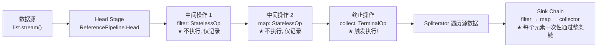

**核心概念**：Stream 的中间操作是**惰性**的——只记录操作链，不执行。终止操作时才触发整条流水线对每个元素依次执行。

```java
// 这不是先 filter 全量, 再 map 全量, 再 collect!
list.stream()
    .filter(x -> x > 0)   // ★ 构建时不执行
    .map(x -> x * 2)      // ★ 构建时不执行
    .collect(toList());   // ★ 这里才执行!

// 实际执行顺序 (每个元素一次性走完整条链):
//   元素1 → filter → map → collect → 
//   元素2 → filter → map → collect → ...
```

### 8.2 核心源码：流水线构建与执行

```java
// 中间操作示例: filter()
public final Stream<P_OUT> filter(Predicate<? super P_OUT> predicate) {
    Objects.requireNonNull(predicate);
    // ★ 不执行! 只创建一个新的 Stage 节点, 记录操作
    return new StatelessOp<P_OUT, P_OUT>(this, StreamShape.REFERENCE,
            StreamOpFlag.NOT_SIZED) {
        @Override
        Sink<P_OUT> opWrapSink(int flags, Sink<P_OUT> sink) {
            return new Sink.ChainedReference<P_OUT, P_OUT>(sink) {
                @Override
                public void accept(P_OUT u) {
                    if (predicate.test(u))   // 满足条件 → 传给下游
                        downstream.accept(u);
                    // ★ 不满足条件 → 到此结束(短路)
                }
            };
        }
    };
}

// 终止操作: collect()
final <R, A> R evaluate(TerminalOp<E_OUT, R> terminalOp) {
    if (linkedOrConsumed) throw new IllegalStateException("stream reused");
    linkedOrConsumed = true;
    // ★ 触发流水线执行
    return isParallel()
           ? terminalOp.evaluateParallel(this, sourceSpliterator(terminalOp.getOpFlags()))
           : terminalOp.evaluateSequential(this, sourceSpliterator(terminalOp.getOpFlags()));
}
```

### 8.3 并行流陷阱

```java
// ❌ 共享可变状态 — 结果不确定!
List<Integer> result = new ArrayList<>();
IntStream.range(0, 1000)
    .parallel()              // ★ 并行流
    .forEach(result::add);   // ArrayList 非线程安全!→ 结果错乱

// ✅ 正确用法: 用 collect
List<Integer> result = IntStream.range(0, 1000)
    .parallel()
    .boxed()
    .collect(Collectors.toList());

// ★ 并行流适用条件:
// 1. 数据量大 (N > 10000)
// 2. 计算密集 (每个元素耗时)
// 3. 无共享可变状态
// 4. 无同步操作(如 I/O)
```

### 8.4 高频 Collector

| Collector | 功能 | 示例 |
|-----------|------|------|
| `toList()` | 收集为 List | `collect(toList())` |
| `toSet()` | 收集为 Set | `collect(toSet())` |
| `toMap()` | 收集为 Map（key 冲突报错） | `collect(toMap(User::getId, u->u))` |
| `toMap(Function,Function,BinaryOperator)` | key 冲突时合并 | `collect(toMap(User::getId, u->u, (a,b)->b))` |
| `groupingBy()` | 分组 | `collect(groupingBy(User::getCity))` |
| `partitioningBy()` | 按布尔分区 | `collect(partitioningBy(User::isVip))` |
| `joining()` | 字符串拼接 | `collect(joining(", "))` |
| `reducing()` | 归约 | `collect(reducing(0, User::getAge, Integer::sum))` |

---

## 14. 设计模式在集合中的应用

### 9.1 装饰器模式 — Collections.unmodifiableXxx()

```java
// ★ 装饰器模式: 给普通集合包装一层"不可修改"外壳
List<String> list = new ArrayList<>();
List<String> unmodifiable = Collections.unmodifiableList(list);
unmodifiable.add("x");  // ❌ UnsupportedOperationException!

// 源码: UnmodifiableList 继承 List, 持有原始 List 引用
//       所有修改方法 override 为抛异常
//       读取方法 delegate 到原始 List
```

### 9.2 适配器模式 — Arrays.asList()

```java
// ★ 适配器: 数组 → List (不是真正的 List!)
String[] arr = {"a", "b", "c"};
List<String> list = Arrays.asList(arr);

// 陷阱 1: list.add("d") → ❌ UnsupportedOperationException (固定长度)
// 陷阱 2: arr[0] = "x" → list.get(0) 变为 "x" (共享底层数组!)

// 正确做法:
List<String> real = new ArrayList<>(Arrays.asList(arr));
```

### 9.3 迭代器模式 — Iterator / for-each

```
Java 集合框架的核心就是迭代器模式:
  - Collection 接口 extends Iterable (提供 iterator())
  - for-each 语法糖编译后就是 Iterator 调用
  - 每种集合有自己的 Iterator 实现 (ArrayList.Itr, HashMap.EntryIterator...)
```

### 9.4 策略模式 — Comparator

```java
// ★ 排序策略在运行时决定
list.sort((a, b) -> a.getName().compareTo(b.getName()));  // 策略 A: 按名称
list.sort((a, b) -> Integer.compare(a.getAge(), b.getAge()));  // 策略 B: 按年龄
list.sort(Comparator.comparing(User::getAge).reversed());      // 策略 C: 按年龄降序
```

---

## 15. 面试真题与陷阱

### 10.1 ArrayList

**Q1: `new ArrayList<>(10)` 和 `new ArrayList<>()` 有什么区别？**

| 维度 | `new ArrayList<>()` | `new ArrayList<>(10)` |
|------|---------------------|----------------------|
| 初始容量 | 0 (JDK 7+) | 10 |
| 首次 add 时 | 扩容到 10 | 不扩容 |
| 已知容量 | 多一次扩容 | 无额外扩容 |

**Q2: `ArrayList` 的 `subList()` 返回的是什么？**

```java
List<String> list = new ArrayList<>(List.of("A", "B", "C"));
List<String> sub = list.subList(0, 2);  // ["A", "B"]

sub.add("X");  // ★ 修改 subList → 原 list 也变了!
// list = ["A", "B", "X", "C"]
// subList 是原 list 的视图, 共享底层数组!
```

### 10.2 HashMap

**Q3: HashMap 的容量为什么是 2 的幂？**

因为 `(n - 1) & hash` 取模运算等价于 `hash % n`（当 n 是 2 的幂时）。位运算 `&` 比取模 `%` 快一个数量级。

**Q4: HashMap 的负载因子为什么是 0.75？**

时空权衡：太低→频繁扩容浪费空间；太高→冲突增加降低效率。0.75 是泊松分布计算的最优值。

**Q5: 为什么重写 `equals()` 必须重写 `hashCode()`？**

HashMap 先用 `hashCode()` 定位桶，再用 `equals()` 比较 key。如果 `equals` 相等但 `hashCode` 不同，会定位到不同桶，导致"相等的 key"get 不到值。

### 10.3 ConcurrentHashMap

**Q6: ConcurrentHashMap 的 key/value 为什么不能为 null？**

歧义问题：`map.get(key)` 返回 null 是"key 不存在"还是"value 就是 null"？在并发环境下无法区分。HashMap 允许 null 是因为非并发场景可以通过 `containsKey()` 区分。

### 10.4 Stream

**Q7: Stream 可以复用吗？**

```java
Stream<String> stream = list.stream();
stream.filter(...);             // 第一次使用 ✅
stream.map(...);                // ❌ IllegalStateException: stream already operated upon!
// Stream 只能消费一次!
```

### 10.5 快速决策：什么场景用什么集合？

| 场景 | 选择 |
|------|------|
| 需要 `get(i)` 快速随机访问 | `ArrayList` |
| 频繁头部插入/删除 | `LinkedList`（但数据量大时 `ArrayDeque` 更好） |
| 需要 key-value 但不排序 | `HashMap` |
| 需要 key-value 且排序 | `TreeMap` |
| 需要线程安全的 HashMap | `ConcurrentHashMap` |
| 需要 LRU 缓存 | `LinkedHashMap(accessOrder=true)` |
| 需要去重 | `HashSet` (无顺序) / `TreeSet` (排序) |
| 需要栈 | `ArrayDeque` (比 `Stack` 快) |
| 需要队列 | `ArrayDeque` 或 `LinkedList` |
| 需要优先级队列 | `PriorityQueue` |
| 只读集合 | `List.of()` / `Collections.unmodifiableList()` |

---


# 第三部分：IO/NIO/AIO
- [6. Java IO 装饰器模式](#6-java-io-装饰器模式)
- [7. NIO 三大组件](#7-nio-三大组件)
- [8. AIO 异步 IO](#8-aio-异步-io)

### 第四部分：Java 底层机制
- [9. Thread 状态机与 wait/notify](#9-thread-状态机与-waitnotify)
- [10. 反射与 JDK 动态代理](#10-反射与-jdk-动态代理)
- [11. Java 泛型深度](#11-java-泛型深度)
- [12. SPI 服务发现机制](#12-spi-服务发现机制)
- [13. java.time 时间 API](#13-javatime-时间-api)
- [14. MethodHandle 与 invokedynamic](#14-methodhandle-与-invokedynamic)

---

# 第一部分：JUC 并发编程

## 11. AQS 抽象队列同步器

AQS（AbstractQueuedSynchronizer）是 JUC 的**基石**。`ReentrantLock`、`CountDownLatch`、`Semaphore`、`ReentrantReadWriteLock` 全部基于它。

### 1.1 AQS 核心结构

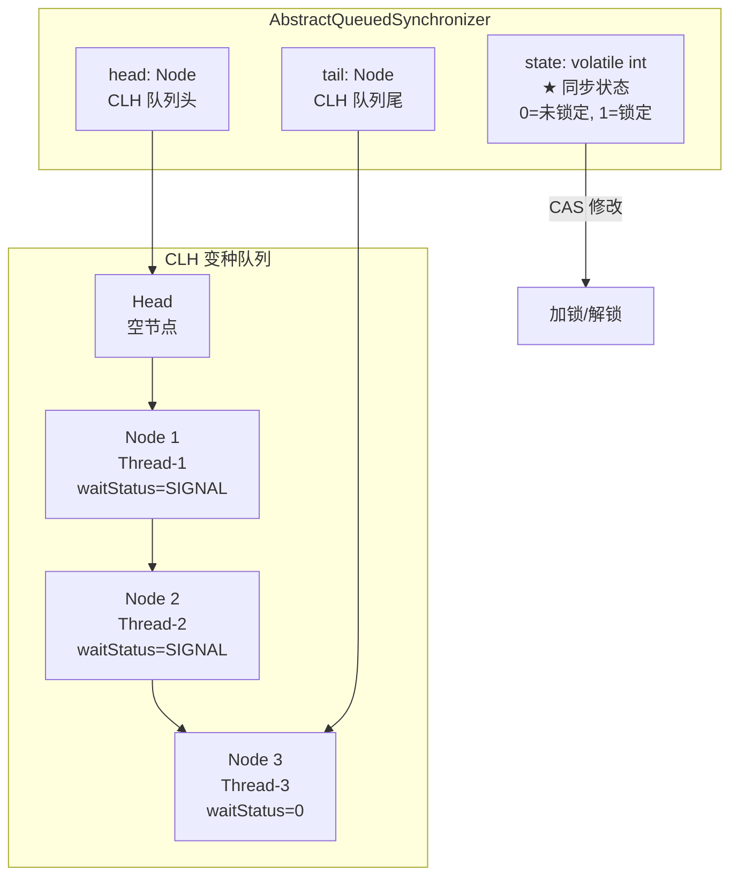

**核心字段**：

```java
public abstract class AbstractQueuedSynchronizer {
    // ★ 同步状态 (volatile 保证可见性)
    private volatile int state;
    
    // ★ CLH 变种队列 (FIFO 双向链表)
    private transient volatile Node head;
    private transient volatile Node tail;
    
    // 内部节点类
    static final class Node {
        volatile Node prev;
        volatile Node next;
        volatile Thread thread;    // 等待的线程
        volatile int waitStatus;   // CANCELLED/SIGNAL/CONDITION/PROPAGATE
        Node nextWaiter;           // Condition 队列的下一个
    }
}
```

### 1.2 ReentrantLock 加锁流程

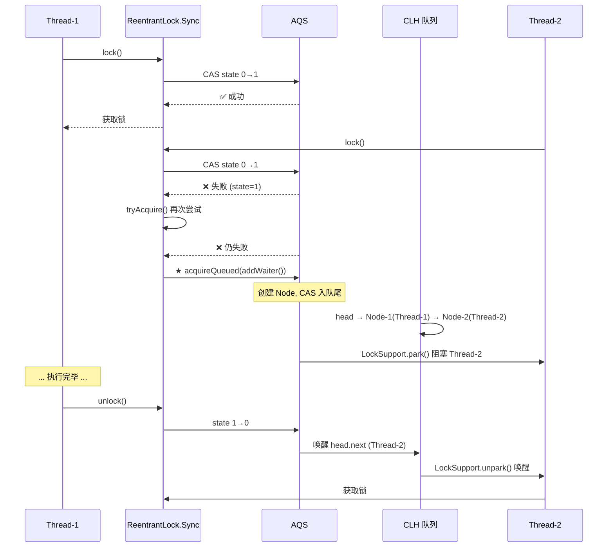

**核心源码（简化版）**：

```java
// NonfairSync.lock()
final void lock() {
    // ★ 1. 直接 CAS 抢锁 (非公平)
    if (compareAndSetState(0, 1))
        setExclusiveOwnerThread(Thread.currentThread());
    else
        // 2. CAS 失败 → 走 AQS 标准流程
        acquire(1);
}

// AQS.acquire()
public final void acquire(int arg) {
    if (!tryAcquire(arg) &&           // 再次尝试
        acquireQueued(addWaiter(Node.EXCLUSIVE), arg))  // 入队 + 阻塞
        selfInterrupt();
}

// ★ addWaiter: 创建节点, CAS 入队
private Node addWaiter(Node mode) {
    Node node = new Node(Thread.currentThread(), mode);
    Node pred = tail;
    if (pred != null) {
        node.prev = pred;
        if (compareAndSetTail(pred, node)) {  // ★ CAS 设置 tail
            pred.next = node;
            return node;
        }
    }
    enq(node);  // CAS 失败或队列为空 → 自旋入队
    return node;
}

// ★ acquireQueued: 入队后自旋抢锁或阻塞
final boolean acquireQueued(final Node node, int arg) {
    boolean failed = true;
    try {
        boolean interrupted = false;
        for (;;) {
            final Node p = node.predecessor();
            if (p == head && tryAcquire(arg)) {  // ★ 前驱是 head 才能抢
                setHead(node);  // 设置自己为新 head
                p.next = null;  // 帮助 GC
                failed = false;
                return interrupted;
            }
            // ★ shouldParkAfterFailedAcquire: 前驱 SIGNAL → park
            if (shouldParkAfterFailedAcquire(p, node) &&
                parkAndCheckInterrupt())      // ★ LockSupport.park(this)
                interrupted = true;
        }
    } finally {
        if (failed) cancelAcquire(node);
    }
}
```

### 1.3 公平锁 vs 非公平锁

```java
// 公平锁 FairSync.tryAcquire()
protected final boolean tryAcquire(int acquires) {
    if (getState() == 0) {
        // ★ 先检查队列中是否有等待者
        if (!hasQueuedPredecessors() &&
            compareAndSetState(0, acquires)) {
            setExclusiveOwnerThread(Thread.currentThread());
            return true;
        }
    }
    return false;
}

// 非公平锁 NonfairSync.tryAcquire()
protected final boolean tryAcquire(int acquires) {
    if (getState() == 0) {
        // ★ 不检查队列, 直接抢!
        if (compareAndSetState(0, acquires)) {
            setExclusiveOwnerThread(Thread.currentThread());
            return true;
        }
    }
    return false;
}
```

| 维度 | 公平锁 | 非公平锁 |
|------|--------|----------|
| 获取顺序 | FIFO | 随机（可插队） |
| 性能 | 低（需切换线程） | **高**（减少上下文切换） |
| 饥饿 | ❌ 不会 | ⚠️ 可能 |
| 默认 | — | **ReentrantLock 默认** |

### 1.4 AQS 子类速查

| 实现类 | state 含义 | 独占/共享 |
|--------|-----------|----------|
| `ReentrantLock` | 0=未锁, 1+=重入次数 | 独占 |
| `CountDownLatch` | count=剩余计数 | 共享 |
| `Semaphore` | permits=剩余许可 | 共享 |
| `ReentrantReadWriteLock` | 高16位=读, 低16位=写 | 写独占, 读共享 |

---

## 12. ThreadPoolExecutor 线程池

### 2.1 核心参数与执行流程

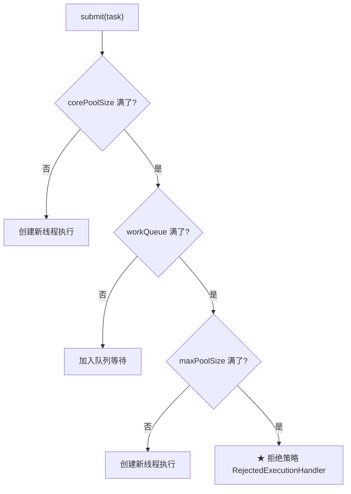

```java
// 7 个核心参数
new ThreadPoolExecutor(
    2,                                     // corePoolSize: 常驻线程数
    4,                                     // maxPoolSize: 最大线程数
    60, TimeUnit.SECONDS,                  // keepAliveTime: 空闲线程存活时间
    new LinkedBlockingQueue<>(100),        // workQueue: 阻塞队列
    Executors.defaultThreadFactory(),      // threadFactory: 线程工厂
    new ThreadPoolExecutor.CallerRunsPolicy() // handler: 拒绝策略
);
```

### 2.2 四种拒绝策略

| 策略 | 行为 | 适用场景 |
|------|------|----------|
| `AbortPolicy`（默认） | 抛 `RejectedExecutionException` | 必须感知拒绝 |
| `CallerRunsPolicy` | 由调用线程执行 | **★ 推荐**: 降级, 减缓提交速度 |
| `DiscardPolicy` | 静默丢弃 | 允许丢失（不推荐） |
| `DiscardOldestPolicy` | 丢弃队头任务, 重新提交 | 允许丢弃旧任务 |

### 2.3 线程池大小公式

```
CPU 密集型: 线程数 = CPU 核数 + 1
I/O 密集型: 线程数 = CPU 核数 × (1 + 平均等待时间 / 平均计算时间)
实际公式:   线程数 = CPU 核数 / (1 - 阻塞系数)     (阻塞系数 ≈ 0.8~0.9)
```

```java
int cpuCores = Runtime.getRuntime().availableProcessors();
// CPU 密集型
int poolSize = cpuCores + 1;
// I/O 密集型
int ioPoolSize = cpuCores * 2;  // 经验值
```

### 2.4 禁止用 Executors 创建线程池

```java
// ❌ 禁止! 队列无界 → OOM
Executors.newFixedThreadPool(10);      // LinkedBlockingQueue(Integer.MAX_VALUE)
Executors.newSingleThreadExecutor();   // 同上
Executors.newCachedThreadPool();       // 线程数 Integer.MAX_VALUE

// ✅ 必须用 ThreadPoolExecutor 显式指定参数
```

### 2.5 线程池状态机

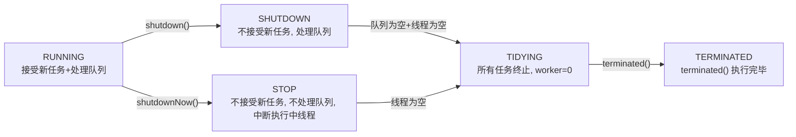

---

## 13. JUC 工具类

### 3.1 CountDownLatch — 一等多

```java
// ★ 主线程等待所有子线程完成
CountDownLatch latch = new CountDownLatch(3);

for (int i = 0; i < 3; i++) {
    new Thread(() -> {
        doWork();
        latch.countDown();  // ★ 计数 -1
    }).start();
}

latch.await();  // ★ 阻塞直到 count = 0
System.out.println("所有线程完成");

// 源码: 基于 AQS 共享模式
// state = count, countDown() = releaseShared(1) → state--
// await() = acquireSharedInterruptibly → 自旋 + park
```

### 3.2 CyclicBarrier — 互相等待

```java
// ★ 所有线程都到齐后一起继续
CyclicBarrier barrier = new CyclicBarrier(3, () -> {
    System.out.println("都到齐了, 执行回调");  // ★ 最后一个到达的线程执行
});

for (int i = 0; i < 3; i++) {
    new Thread(() -> {
        doPhase1();
        barrier.await();  // ★ 阻塞, 等待其他人
        doPhase2();       // 所有人到齐后一起开始
    }).start();
}

// ★ 可复用: reset() 后可以再次使用 (CountDownLatch 不可复用)
```

### 3.3 Semaphore — 限流

```java
// ★ 同时最多 5 个线程访问资源
Semaphore semaphore = new Semaphore(5);

for (int i = 0; i < 20; i++) {
    new Thread(() -> {
        try {
            semaphore.acquire();  // ★ 获取许可 (阻塞直到有许可)
            doLimitedWork();
        } finally {
            semaphore.release();  // ★ 释放许可
        }
    }).start();
}

// 源码: 基于 AQS 共享模式
// state = permits, acquire() → state--, release() → state++
```

### 3.4 CountDownLatch vs CyclicBarrier vs Semaphore

| 维度 | CountDownLatch | CyclicBarrier | Semaphore |
|------|---------------|---------------|-----------|
| 含义 | 一等多 | 互相等 | 限流 |
| 可复用 | ❌ | ✅ (`reset()`) | ✅ |
| 计数器 | countDown 减 | await 增 | acquire 减 |
| 典型场景 | 主等子完成 | 多线程协作 | 连接池限流 |

---

## 14. CompletableFuture 异步编程

### 4.1 核心方法链

```java
// ★ 异步执行 → 转换 → 组合 → 回调
CompletableFuture.supplyAsync(() -> getUser(1L))       // 1. 异步获取用户
    .thenApply(user -> user.getName())                  // 2. 提取姓名 (同步转换)
    .thenApplyAsync(name -> name.toUpperCase())         // 3. 大写转换 (异步)
    .thenAccept(name -> System.out.println(name))       // 4. 消费结果
    .exceptionally(e -> {                               // 5. 异常处理
        System.err.println("出错了: " + e);
        return null;
    });

// ★ 两个异步结果合并
CompletableFuture<String> cf1 = CompletableFuture.supplyAsync(() -> "Hello");
CompletableFuture<String> cf2 = CompletableFuture.supplyAsync(() -> "World");
cf1.thenCombine(cf2, (s1, s2) -> s1 + " " + s2)        // "Hello World"
   .thenAccept(System.out::println);

// ★ 任意一个完成就继续
cf1.applyToEither(cf2, s -> s.toUpperCase())
   .thenAccept(System.out::println);

// ★ 等待所有完成
CompletableFuture.allOf(cf1, cf2, cf3).join();

// ★ 等待任意一个完成
CompletableFuture.anyOf(cf1, cf2, cf3).join();
```

### 4.2 thenApply vs thenCompose

```java
// thenApply: 同步映射 T → U
CompletableFuture<Integer> cf = 
    CompletableFuture.supplyAsync(() -> "42")
        .thenApply(Integer::parseInt);  // String → Integer

// thenCompose: 异步平铺 (避免 CompletableFuture<CompletableFuture<U>>)
CompletableFuture<User> cf2 =
    CompletableFuture.supplyAsync(() -> 1L)
        .thenCompose(id -> getUserAsync(id));  // ★ 返回 CompletableFuture<User>, 不是嵌套
```

### 4.3 allOf + stream 获取所有结果

```java
List<CompletableFuture<User>> futures = userIds.stream()
    .map(id -> CompletableFuture.supplyAsync(() -> getUser(id)))
    .toList();

// ★ allOf + join 收集结果
List<User> users = futures.stream()
    .map(CompletableFuture::join)   // 阻塞等待每个结果
    .toList();
```

---

## 15. ForkJoinPool 分治框架

### 5.1 核心思想

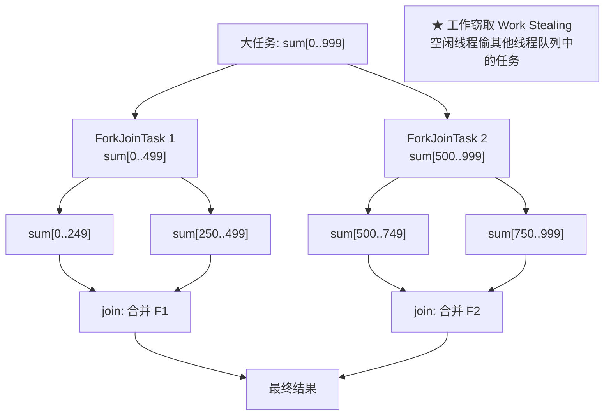

```java
// ForkJoin 求和
class SumTask extends RecursiveTask<Long> {
    private final long[] arr;
    private final int start, end;
    
    @Override
    protected Long compute() {
        if (end - start <= 1000) {
            // ★ 足够小 → 直接计算
            long sum = 0;
            for (int i = start; i < end; i++) sum += arr[i];
            return sum;
        }
        // ★ 否则 → 分治
        int mid = (start + end) / 2;
        SumTask left = new SumTask(arr, start, mid);
        SumTask right = new SumTask(arr, mid, end);
        left.fork();             // 异步执行左半
        return right.compute() + left.join();  // 右同步 + 等待左
    }
}

// 使用
ForkJoinPool pool = new ForkJoinPool();
SumTask task = new SumTask(arr, 0, arr.length);
long result = pool.invoke(task);
```

**核心优化**：每个工作线程有自己的双端队列。自己的任务从队头取（LIFO），其他线程来偷时从队尾取（FIFO），减少竞争。

---

# 第三部分：IO/NIO/AIO

## 16. Java IO 装饰器模式

### 6.1 BIO 流体系

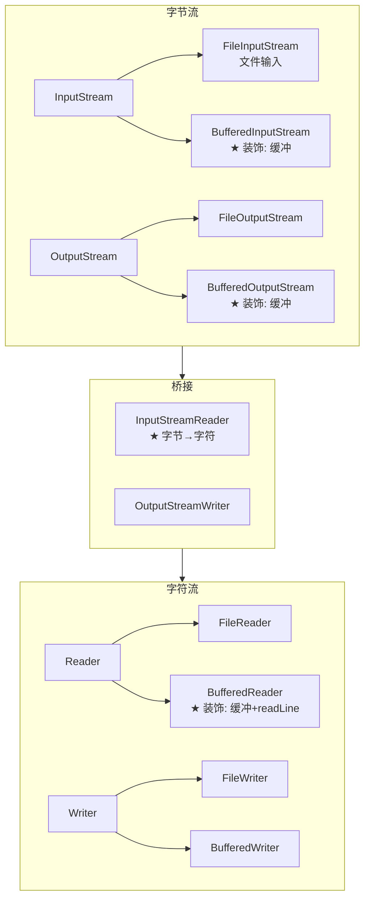

```java
// 装饰器模式的经典: 层层包装
BufferedReader reader = new BufferedReader(          // 装饰: 缓冲
    new InputStreamReader(                            // 桥接: 字节→字符
        new FileInputStream("file.txt"), "UTF-8"));  // 原始: 字节流

// 等价于 (Files.newBufferedReader 内部做了相同包装)
BufferedReader reader = Files.newBufferedReader(Path.of("file.txt"));
```

### 6.2 BIO 的问题

```java
// BIO 的问题: 一个连接一个线程
ServerSocket server = new ServerSocket(8080);
while (true) {
    Socket client = server.accept();  // ★ 阻塞等待连接
    new Thread(() -> {
        InputStream in = client.getInputStream();
        byte[] buf = new byte[1024];
        in.read(buf);  // ★ 阻塞等待数据
        // ... 处理 ...
    }).start();
}
// 问题: 10000 个连接 → 10000 个线程 → OOM / 上下文切换暴涨
```

---

## 17. NIO 三大组件

### 7.1 Channel + Buffer + Selector

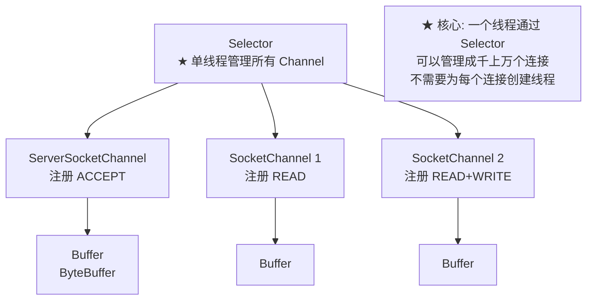

```java
// NIO 非阻塞服务器
Selector selector = Selector.open();
ServerSocketChannel server = ServerSocketChannel.open();
server.bind(new InetSocketAddress(8080));
server.configureBlocking(false);                    // ★ 非阻塞
server.register(selector, SelectionKey.OP_ACCEPT);  // ★ 注册 ACCEPT

while (true) {
    selector.select();  // ★ 阻塞直到有就绪的 Channel
    
    for (SelectionKey key : selector.selectedKeys()) {
        if (key.isAcceptable()) {
            SocketChannel client = server.accept();
            client.configureBlocking(false);
            client.register(selector, SelectionKey.OP_READ);
        } else if (key.isReadable()) {
            SocketChannel client = (SocketChannel) key.channel();
            ByteBuffer buf = ByteBuffer.allocate(1024);
            client.read(buf);
            // 处理数据...
        }
        iterator.remove();  // ★ 必须手动移除!
    }
}
```

### 7.2 ByteBuffer 三指针

```java
// ★ ByteBuffer 的三个关键指针
ByteBuffer buf = ByteBuffer.allocate(10);  // position=0, limit=10, capacity=10

buf.put((byte) 'H');   // position=1
buf.put((byte) 'i');   // position=2

buf.flip();            // ★ 写模式→读模式: limit=position, position=0

char c1 = (char) buf.get();  // 读 'H', position=1
char c2 = (char) buf.get();  // 读 'i', position=2

buf.compact();         // ★ 压缩: 将未读数据移到开头, position=未读长度

buf.clear();           // 清空(数据不清理, 仅重置指针)
```

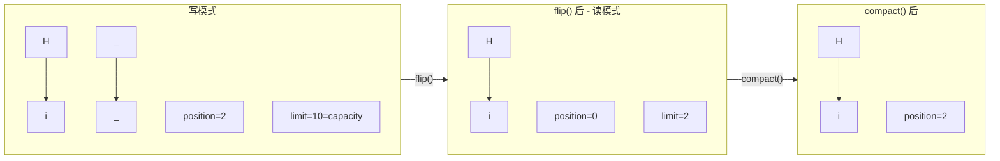

### 7.3 BIO vs NIO vs AIO

| 维度 | BIO | NIO | AIO (NIO 2) |
|------|-----|-----|------------|
| I/O 模型 | 同步阻塞 | 同步非阻塞 | 异步非阻塞 |
| 线程模型 | 1 连接 : 1 线程 | **1 线程 : N 连接** | 回调 |
| 适用场景 | 低并发、短连接 | **高并发、长连接** | 高并发 I/O |
| Java 实现 | `ServerSocket` | `Selector` + `Channel` | `AsynchronousServerSocketChannel` |
| 数据读取 | `read()` 阻塞 | `select()` 监听就绪 | `read()` + `CompletionHandler` |

---

## 18. AIO 异步 IO

```java
// AIO: 发起 IO 操作后立即返回, 完成时自动回调
AsynchronousServerSocketChannel server = 
    AsynchronousServerSocketChannel.open();
server.bind(new InetSocketAddress(8080));

// ★ 异步 accept: 有连接时自动回调
server.accept(null, new CompletionHandler<AsynchronousSocketChannel, Void>() {
    @Override
    public void completed(AsynchronousSocketChannel client, Void attachment) {
        // 成功: 处理当前连接
        ByteBuffer buf = ByteBuffer.allocate(1024);
        client.read(buf, null, new CompletionHandler<Integer, Void>() {
            @Override
            public void completed(Integer bytesRead, Void att) {
                // ★ 数据读取完成, 自动回调
                buf.flip();
                // 处理 buf...
            }
            @Override
            public void failed(Throwable exc, Void att) { /* ... */ }
        });
        // ★ 继续接受下一个连接
        server.accept(null, this);
    }
    @Override
    public void failed(Throwable exc, Void attachment) { /* ... */ }
});
```

---

# 第四部分：Java 底层机制

## 19. Thread 状态机与 wait/notify

### 9.1 六种线程状态

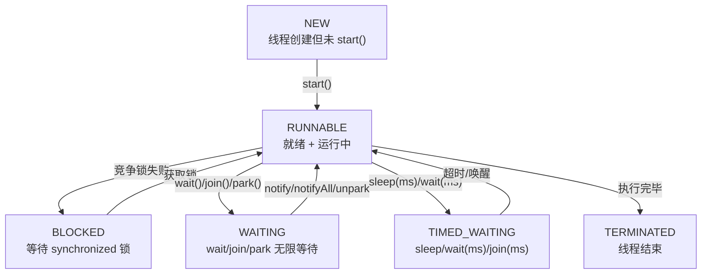

### 9.2 wait/notify 核心规则

```java
// ★ wait/notify 必须在 synchronized 块内调用!
synchronized (lock) {
    while (condition) {     // ★ 必须用 while 而不是 if!
        lock.wait();        // 释放锁 + 阻塞
    }
    // 执行业务...
}

synchronized (lock) {
    lock.notifyAll();  // ★ 优先用 notifyAll 而不是 notify
}

// 为什么用 while 而不是 if?
// 1. 虚假唤醒 (spurious wakeup): JVM 可能无缘无故唤醒线程
// 2. 多消费者竞争: A 被唤醒, 但 B 先拿到锁消费了数据
// while 会重新检查条件, if 不会
```

### 9.3 interrupt 深入

```java
// ★ interrupt() 不会直接停止线程, 而是设置中断标志!
Thread t = new Thread(() -> {
    while (!Thread.currentThread().isInterrupted()) {
        // 正常执行...
        try {
            Thread.sleep(1000);
        } catch (InterruptedException e) {
            // ★ sleep/wait/join 收到 interrupt 时抛出异常
            // ★ 并且清除中断标志!
            Thread.currentThread().interrupt();  // ★ 重新设置中断标志
            break;
        }
    }
});
t.start();
t.interrupt();  // 设置中断标志, 如果线程在 sleep 则抛 InterruptedException
```

---

## 20. 反射与 JDK 动态代理

### 10.1 反射核心 API

```java
// ★ 获取 Class 的三种方式
Class<?> clazz1 = User.class;
Class<?> clazz2 = new User().getClass();
Class<?> clazz3 = Class.forName("com.example.User");

// 操作字段
Field field = clazz.getDeclaredField("name");
field.setAccessible(true);             // ★ 绕过 private
String name = (String) field.get(obj);
field.set(obj, "NewName");

// 操作方法
Method method = clazz.getDeclaredMethod("setName", String.class);
method.invoke(obj, "NewName");

// 操作构造器
Constructor<?> ctor = clazz.getDeclaredConstructor(String.class);
User user = (User) ctor.newInstance("Tom");
```

### 10.2 JDK 动态代理原理

```java
// ★ 接口
public interface UserService {
    void save(User user);
}

// ★ 代理处理器
public class LogInvocationHandler implements InvocationHandler {
    private final Object target;
    
    public LogInvocationHandler(Object target) {
        this.target = target;
    }
    
    @Override
    public Object invoke(Object proxy, Method method, Object[] args) throws Throwable {
        System.out.println("Before: " + method.getName());  // ★ 前置增强
        Object result = method.invoke(target, args);         // 委托目标方法
        System.out.println("After: " + method.getName());    // ★ 后置增强
        return result;
    }
}

// ★ 创建代理
UserService proxy = (UserService) Proxy.newProxyInstance(
    UserService.class.getClassLoader(),
    new Class[]{UserService.class},
    new LogInvocationHandler(new UserServiceImpl())
);
proxy.save(user);  // ★ 自动触发 LogInvocationHandler.invoke()
```

**底层原理**：

```java
// Proxy.newProxyInstance 内部:
// 1. 调用 ProxyGenerator.generateProxyClass() 生成字节码
// 2. 通过 native 方法 defineClass0() 加载类
// 3. 生成的代理类大致结构:
public class $Proxy0 extends Proxy implements UserService {
    private static Method m1;  // save 方法
    
    public $Proxy0(InvocationHandler h) { super(h); }
    
    public final void save(User user) {
        // ★ 调用 InvocationHandler.invoke
        h.invoke(this, m1, new Object[]{user});
    }
}
```

---

## 21. Java 泛型深度

### 11.1 类型擦除

```java
// ★ 泛型只在编译期存在, 运行时全部擦除
List<String> strList = new ArrayList<>();
List<Integer> intList = new ArrayList<>();

// 运行时: 两个都是 ArrayList (raw type)
System.out.println(strList.getClass() == intList.getClass()); // ★ true!

// 这就是为什么不能 new T(), new T[], instanceof T
```

### 11.2 PECS 原则

```
Producer Extends, Consumer Super

? extends T: 只能读 (producer), 不能写
? super T:   只能写 (consumer), 读只能读到 Object
```

```java
// ★ Producer Extends: 从集合中读取
public void printAll(List<? extends Number> list) {
    for (Number n : list) {          // ✅ 读: 知道至少是 Number
        System.out.println(n);
    }
    // list.add(10);                 // ❌ 写: 不知道具体是 Integer 还是 Double
}

// ★ Consumer Super: 往集合中写入
public void addNumbers(List<? super Integer> list) {
    list.add(1);                     // ✅ 写: 知道至少能存 Integer
    list.add(2);
    // Integer i = list.get(0);      // ❌ 读: 只知道是 Object
}

// 应用: Collections.copy()
// public static <T> void copy(List<? super T> dest, List<? extends T> src)
// dest 是 consumer (写入) → ? super T
// src 是 producer (读取) → ? extends T
```

### 11.3 协变与逆变

```java
// ★ Java 数组是协变 (Covariant)
Number[] nums = new Integer[10];  // ✅ 编译通过
nums[0] = 3.14;                   // ❌ 运行时 ArrayStoreException!

// ★ 泛型是不可变 (Invariant)
List<Number> nums = new ArrayList<Integer>();  // ❌ 编译错误!
// 正确: 用通配符
List<? extends Number> nums = new ArrayList<Integer>();  // ✅
```

---

## 22. SPI 服务发现机制

### 12.1 SPI 原理

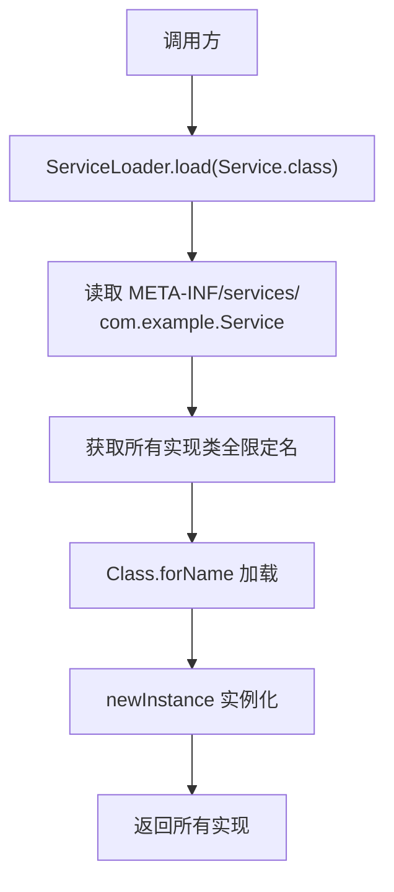

**JDBC 驱动加载就是 SPI 的经典案例**：

```java
// JDBC 4.0+: 不需要 Class.forName("com.mysql.cj.jdbc.Driver")!
// 因为 DriverManager 内部使用了 SPI

// mysql-connector-java.jar 中的文件:
// META-INF/services/java.sql.Driver
// 内容: com.mysql.cj.jdbc.Driver

// ServiceLoader 自动发现并加载
ServiceLoader<Driver> loader = ServiceLoader.load(Driver.class);
for (Driver driver : loader) {
    System.out.println("Found driver: " + driver.getClass().getName());
}
```

### 12.2 SPI 使用示例

```java
// 1. 定义接口
public interface PaymentService {
    void pay(BigDecimal amount);
}

// 2. 实现类 (在另一个 JAR 中)
public class AlipayService implements PaymentService {
    @Override
    public void pay(BigDecimal amount) {
        System.out.println("支付宝支付: " + amount);
    }
}

// 3. META-INF/services/com.example.PaymentService 文件:
// com.example.AlipayService

// 4. 调用方:
ServiceLoader<PaymentService> loader = ServiceLoader.load(PaymentService.class);
for (PaymentService service : loader) {
    service.pay(new BigDecimal("100"));  // 自动发现并调用!
}
```

---

## 23. java.time 时间 API

### 13.1 核心类速查

```java
// ★ 时间线
Instant now = Instant.now();                    // UTC 时间戳: 2024-01-15T10:30:00Z

// ★ 日期(无时间)
LocalDate date = LocalDate.of(2024, 1, 15);     // 2024-01-15

// ★ 时间(无日期)
LocalTime time = LocalTime.of(10, 30, 0);       // 10:30:00

// ★ 日期+时间(无时区)
LocalDateTime dt = LocalDateTime.of(date, time); // 2024-01-15T10:30:00

// ★ 日期+时间+时区
ZonedDateTime zdt = dt.atZone(ZoneId.of("Asia/Shanghai"));
// 2024-01-15T10:30:00+08:00[Asia/Shanghai]

// ★ 计算
LocalDate nextWeek = date.plusWeeks(1);          // 下周
long days = ChronoUnit.DAYS.between(date, nextWeek); // 7
```

### 13.2 不可变 + 线程安全

```java
// ★ java.time 所有类都是 immutable, 线程安全!
LocalDate date = LocalDate.of(2024, 1, 15);
date.plusDays(1);        // 返回新对象, 不修改原对象
System.out.println(date); // 仍然是 2024-01-15

// ★ 与旧 API 互转
Date oldDate = new Date();
Instant instant = oldDate.toInstant();           // Date → Instant
LocalDateTime ldt = LocalDateTime.ofInstant(instant, ZoneId.systemDefault());
Date newDate = Date.from(ldt.atZone(ZoneId.systemDefault()).toInstant());
```

---

## 24. MethodHandle 与 invokedynamic

### 14.1 MethodHandle vs 反射

```java
// ★ 反射: JVM 黑箱, 每次调用都要安全检查
Method method = String.class.getMethod("length");
method.invoke("hello");  // 慢

// ★ MethodHandle: 直接绑定到方法, 接近字节码级别的调用
MethodHandles.Lookup lookup = MethodHandles.lookup();
MethodType mt = MethodType.methodType(int.class);  // 返回 int, 无参数
MethodHandle mh = lookup.findVirtual(String.class, "length", mt);
int len = (int) mh.invokeExact("hello");  // 快! 接近原生调用

// ★ 性能对比: MethodHandle > 反射 > 普通反射
```

### 14.2 invokedynamic 指令

```java
// Lambda 表达式编译后使用 invokedynamic
// 源码: list.forEach(x -> System.out.println(x));
//
// 编译后的字节码:
// invokedynamic #2 <accept, BootstrapMethods #0>
// BootstrapMethods:
//   0: REF_invokeStatic LambdaMetafactory.metafactory(...)
//
// ★ 运行时 JVM 调用 LambdaMetafactory 动态生成实现类
//    而不是编译时就固定
```

**为什么用 invokedynamic？**

```java
// 问题: 如果 Lambda 在编译时就生成匿名内部类:
//   1. 每个 Lambda → 一个 .class 文件 → 类爆炸
//   2. 无法改变实现策略

// invokedynamic 解决方案:
//   1. 编译时: 只记录 Bootstrap Method
//   2. 运行时: Bootstrap Method 决定如何实现 Lambda
//      - 可以生成内部类
//      - 可以使用 MethodHandle
//      - 可以缓存结果
//      - JVM 可以自由优化实现
```

### 14.3 反射/MethodHandle/VarHandle 对比

| 维度 | 反射 | MethodHandle | VarHandle (JDK 9+) |
|------|------|-------------|-------------------|
| 调用方式 | `invoke()` | `invokeExact()` / `invoke()` | `get()` / `set()` / `compareAndSet()` |
| 安全检查 | 每次都有 | 只在创建时 | 只在创建时 |
| 性能 | 慢 | **接近原生** | **接近原生** |
| 访问字段 | ✅ | ✅ | **✅ + CAS 原子操作** |
| 签名检查 | 运行时宽松 | **编译时严格(invokeExact)** | 编译时严格 |

---

*全文 24 章，基于 JDK 8/11/17/21 源码编写。*
