# JVM 源码深度解析

> **HotSpot JVM** 架构全景，覆盖类加载 → 内存模型 → GC → JIT 编译 → 调优实战，图文并茂。

---

## 目录

- [1. JVM 总体架构](#1-jvm-总体架构)
- [2. 类加载子系统](#2-类加载子系统)
- [3. 运行时数据区](#3-运行时数据区)
- [4. 对象创建与内存布局](#4-对象创建与内存布局)
- [5. 垃圾回收算法](#5-垃圾回收算法)
- [6. 经典垃圾收集器](#6-经典垃圾收集器)
- [7. 低延迟收集器：G1 / ZGC / Shenandoah](#7-低延迟收集器g1--zgc--shenandoah)
- [8. JIT 即时编译](#8-jit-即时编译)
- [9. 类文件结构与字节码](#9-类文件结构与字节码)
- [10. JVM 启动流程](#10-jvm-启动流程)
- [11. JVM 调优实战](#11-jvm-调优实战)
- [12. 常见 OOM 与排查](#12-常见-oom-与排查)
- [13. Java 内存模型 JMM](#13-java-内存模型-jmm)
- [14. synchronized 锁升级](#14-synchronized-锁升级)
- [15. SafePoint 安全点](#15-safepoint-安全点)
- [16. JFR 与诊断](#16-jfr-与诊断)
- [17. 虚拟线程](#17-虚拟线程)
- [18. 附录：高级参数速查](#18-附录高级参数速查)
- [19. 设计哲学与演化历程](#19-设计哲学与演化历程)

---

## 1. JVM 总体架构

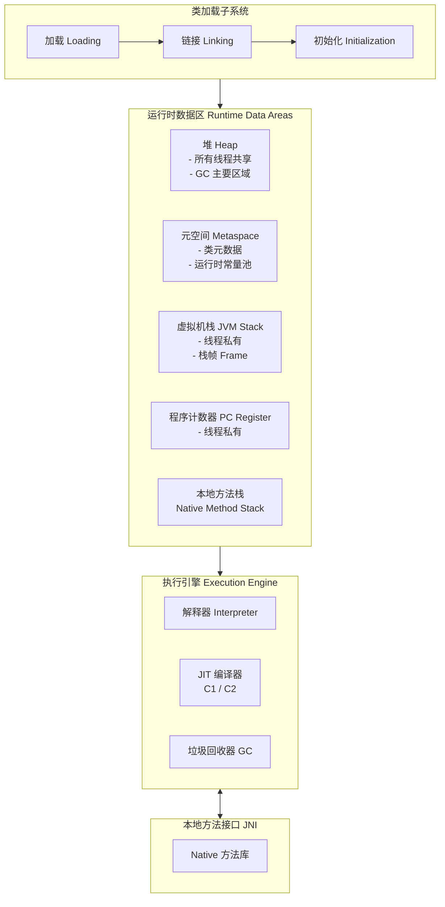

**JVM 规范 vs HotSpot 实现**：

| 组件 | JVM 规范定义 | HotSpot 实现 |
|------|-------------|-------------|
| 类加载器 | 双亲委派模型 | `Bootstrap` → `Platform` → `App` 三级 |
| 堆 | 对象存储区 | 分代：新生代(Eden+S0+S1) + 老年代 |
| 方法区 | 类元数据存储 | 元空间 Metaspace(直接内存) |
| GC | 自动内存回收 | 7 种收集器可选 |
| JIT | 热点代码编译 | C1(Client) + C2(Server) 分层编译 |

---

## 2. 类加载子系统

### 2.1 类加载三阶段

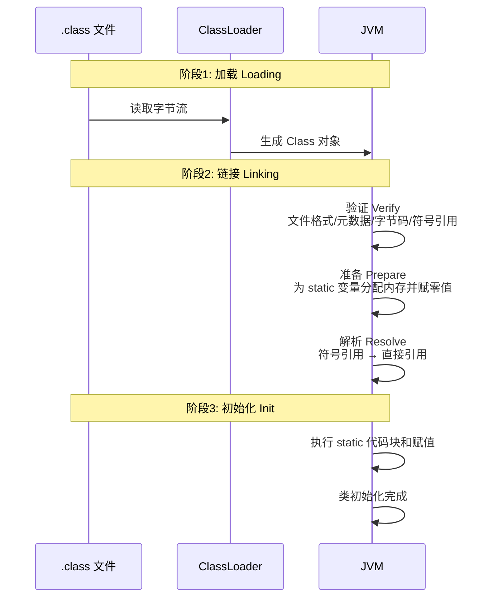

### 2.2 双亲委派模型

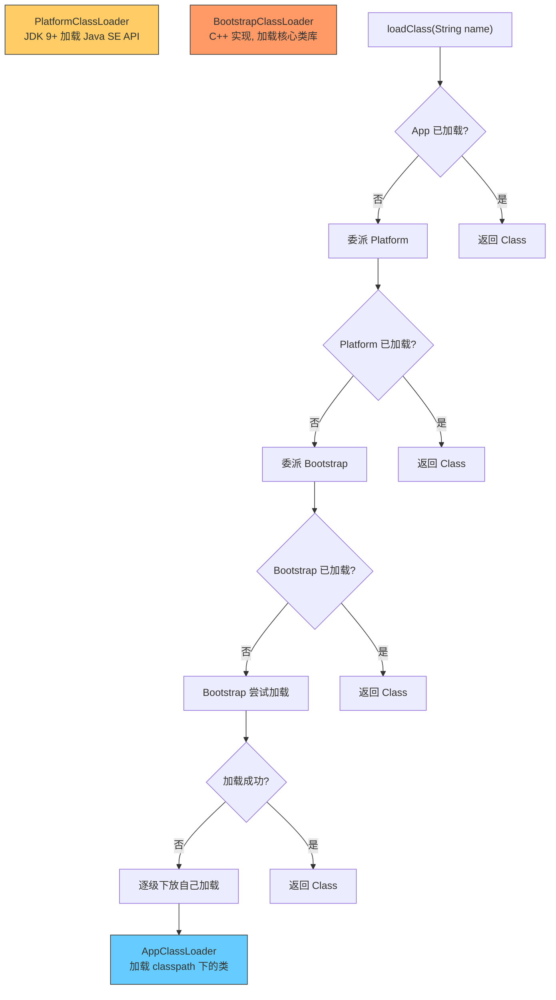

**核心源码（ClassLoader.loadClass）**：

```java
protected Class<?> loadClass(String name, boolean resolve) throws ClassNotFoundException {
    synchronized (getClassLoadingLock(name)) {
        // 1. 检查是否已加载
        Class<?> c = findLoadedClass(name);
        if (c == null) {
            try {
                // 2. ★ 委派父加载器
                if (parent != null) {
                    c = parent.loadClass(name, false);
                } else {
                    c = findBootstrapClassOrNull(name);
                }
            } catch (ClassNotFoundException e) {
                // 3. 父加载器加载失败 → 自己加载
            }
            if (c == null) {
                // 4. ★ findClass 由子类实现
                c = findClass(name);
            }
        }
        if (resolve) resolveClass(c);
        return c;
    }
}
```

**打破双亲委派**：Tomcat 的 `WebappClassLoader` 先自己加载（隔离不同应用的类），JDBC 用 `ThreadContextClassLoader` 加载 SPI 实现类。

### 2.3 类加载时机

JVM 规范规定**六种主动引用**会触发初始化：

| 场景 | 代码示例 | 触发 |
|------|----------|------|
| new 对象 | `new User()` | ✅ |
| 反射 | `Class.forName("User")` | ✅ |
| 访问父类 static | 子类初始化 → 父类先初始化 | ✅ |
| main 方法类 | 入口类直接初始化 | ✅ |
| static 方法/字段 | `User.getName()` | ✅ |
| default 方法 | 接口实现类初始化 → 接口初始化 | ✅ |

**被动引用（不触发初始化）**：
- `Parent.class` 不会初始化 Parent
- `Parent.constant` 访问编译期常量不会初始化（常量已存入调用类的常量池）
- 定义对象数组 `Parent[] arr = new Parent[10]` 不会初始化

---

## 3. 运行时数据区

### 3.1 线程私有区域

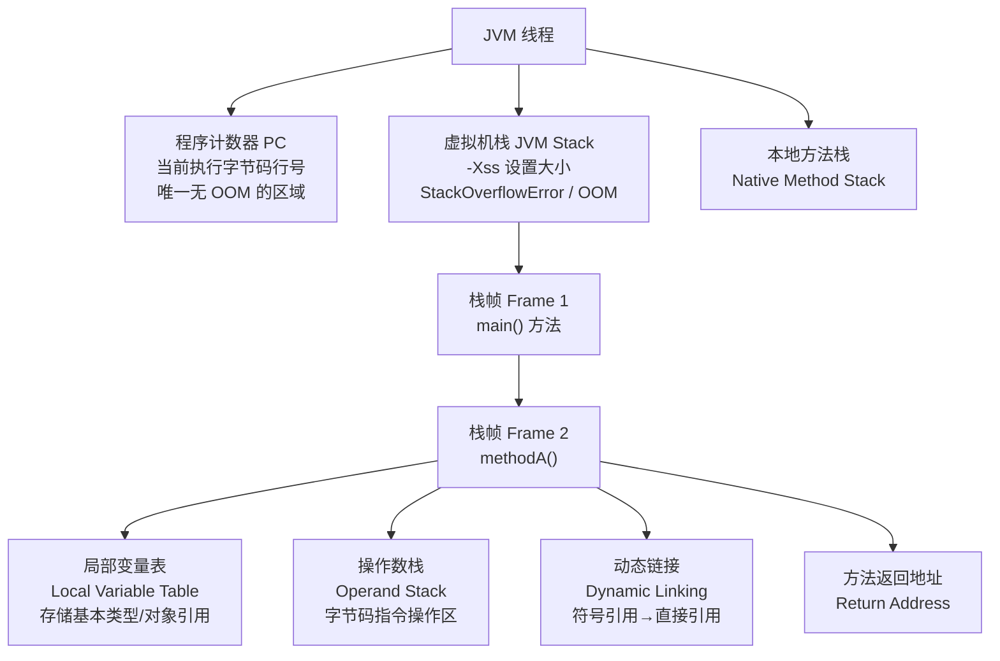

**栈帧的入栈与出栈**：

```java
public int add(int a, int b) {
    return a + b;  // 对应字节码:
    // iload_1    -- 将局部变量表[1] (a) 压入操作数栈
    // iload_2    -- 将局部变量表[2] (b) 压入操作数栈
    // iadd       -- 弹出两个 int, 相加, 结果压入栈顶
    // ireturn    -- 返回栈顶值
}
```

### 3.2 线程共享区域 — 堆 Heap

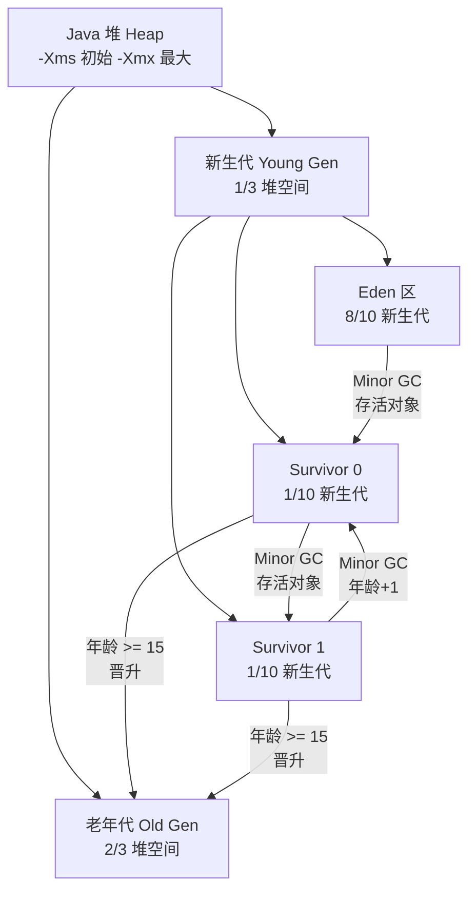

**对象晋升老年代的四种情况**：

| 情况 | 条件 | 参数 |
|------|------|------|
| 年龄达标 | 经历 Minor GC 存活次数 ≥ 15 | `-XX:MaxTenuringThreshold=15` |
| 动态年龄判断 | Survivor 中同年龄对象总大小 > Survivor 的 50% | `-XX:TargetSurvivorRatio=50` |
| 大对象直接进老年代 | 对象大小 > 阈值 | `-XX:PretenureSizeThreshold` |
| 空间分配担保失败 | Minor GC 后 Survivor 放不下 | 直接进老年代 |

### 3.3 元空间 Metaspace（方法区的 HotSpot 实现）

```
JDK 7 及以前: 永久代 PermGen（堆内, -XX:PermSize, -XX:MaxPermSize）
JDK 8 及以后: 元空间 Metaspace（直接内存, -XX:MetaspaceSize, -XX:MaxMetaspaceSize）
```

**为什么移除永久代？**
1. 永久代大小难确定（太小→OOM，太大→浪费）
2. 永久代 GC 复杂（类卸载条件苛刻）
3. 与 JRockit 合并后统一用 Metaspace

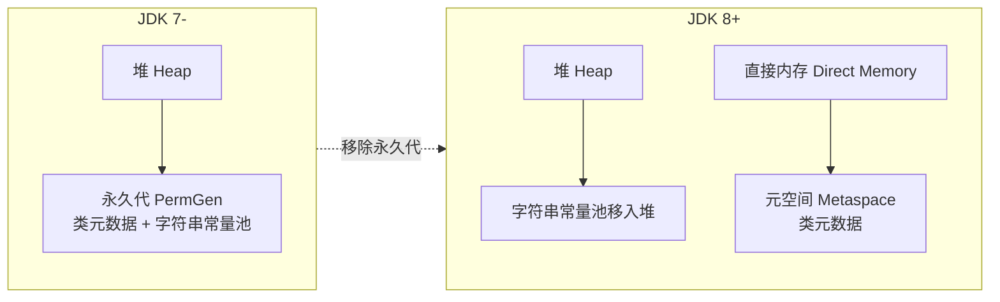

### 3.4 运行时常量池 vs 字符串常量池

| 维度 | 运行时常量池 | 字符串常量池 |
|------|-------------|-------------|
| 存储内容 | 类/方法/字段的符号引用 + 字面量 | 字符串字面量 + `intern()` 结果 |
| 位置（JDK 8+） | Metaspace | Heap |
| 是否有 OOM | 是 (`java.lang.OutOfMemoryError: Metaspace`) | 是 (`java.lang.OutOfMemoryError: Java heap space`) |
| `String.intern()` | 不相关 | ✅ 将字符串放入池中 |

---

## 4. 对象创建与内存布局

### 4.1 对象创建流程

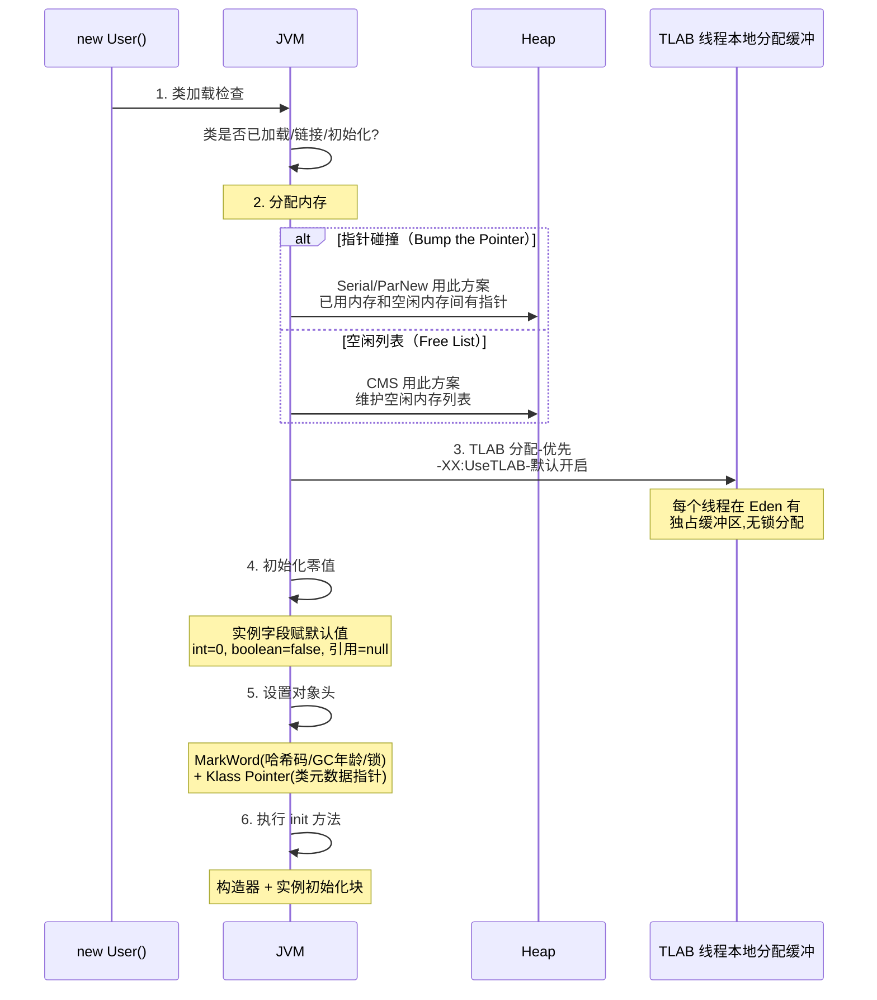

### 4.2 对象内存布局

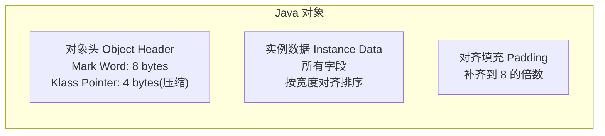

**Mark Word 的 5 种状态**（64 位 JVM）：

| 锁状态 | 标志位 | 存储内容 |
|--------|--------|----------|
| 无锁 | 001 | hashCode(25) + age(4) + biased_lock(1) |
| 偏向锁 | 101 | threadId(54) + epoch(2) + age(4) |
| 轻量级锁 | 00 | 指向线程栈中 Lock Record 的指针 |
| 重量级锁 | 10 | 指向 Monitor 对象的指针 |
| GC 标记 | 11 | 空（GC 线程专用） |

**压缩指针**：`-XX:+UseCompressedOops`（默认开启）。64 位 JVM 下，对象引用从 8 字节压缩为 4 字节。条件是堆 < 32GB。

---

## 5. 垃圾回收算法

### 5.1 判断对象存活

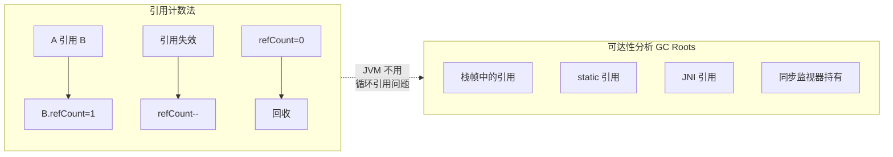

**GC Roots 包含**：
1. 虚拟机栈中引用的对象
2. 方法区 static 属性引用的对象
3. 方法区常量池引用的对象
4. Native 方法中引用的对象
5. 被同步锁持有的对象

### 5.2 四种引用级别

```java
// 强引用: 永不回收
Object obj = new Object();

// 软引用: 内存不足时回收（适合缓存）
SoftReference<Object> soft = new SoftReference<>(new Object());

// 弱引用: 下次 GC 一定回收（适合 WeakHashMap）
WeakReference<Object> weak = new WeakReference<>(new Object());

// 虚引用: 无法获取对象，仅用于回收通知
PhantomReference<Object> phantom = new PhantomReference<>(new Object(), queue);
```

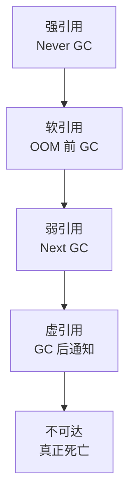

### 5.3 三大基础 GC 算法

| 算法 | 原理 | 优点 | 缺点 | JVM 使用位置 |
|------|------|------|------|-------------|
| **标记-清除** | 标记存活→清除未标记 | 简单 | 碎片化 | CMS 老年代 |
| **标记-复制** | 存活对象复制到新空间→清空旧空间 | 无碎片，快 | 浪费一半空间 | 新生代 |
| **标记-整理** | 标记存活→移到一端→清边界外 | 无碎片 | STW 长 | Serial/Parallel Old 老年代 |

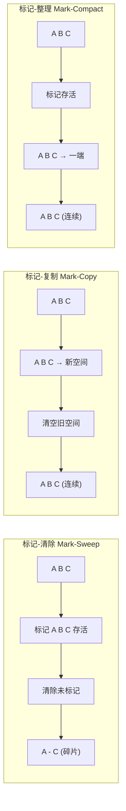

---

## 6. 经典垃圾收集器

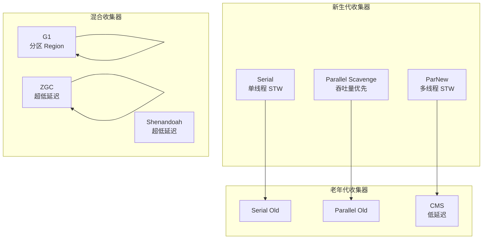

### 6.1 Serial / Serial Old — 单线程

```
特点: 单线程, STW(Stop The World), 适合单核/小内存
参数: -XX:+UseSerialGC
新生代: 标记-复制
老年代: 标记-整理
```

### 6.2 Parallel Scavenge / Parallel Old — 吞吐量优先

```
特点: 多线程 STW, 关注吞吐量(用户代码时间/总时间)
参数: -XX:+UseParallelGC
      -XX:MaxGCPauseMillis=200    目标最大停顿
      -XX:GCTimeRatio=99          吞吐量目标 99%
自适应: -XX:+UseAdaptiveSizePolicy 自动调新生代大小等
```

### 6.3 ParNew + CMS — 低延迟

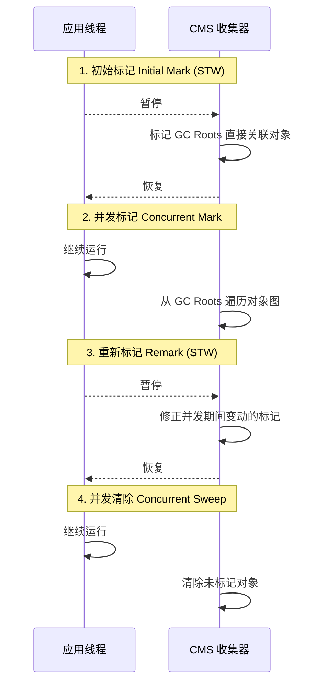

**CMS 三大缺点**：
1. **CPU 敏感**：并发阶段占用 CPU 线程
2. **浮动垃圾**：并发清除期间的垃圾下次 GC 才收
3. **碎片化**：标记-清除导致碎片→`Serial Old` 兜底

---

## 7. 低延迟收集器：G1 / ZGC / Shenandoah

### 7.1 G1 分区模型

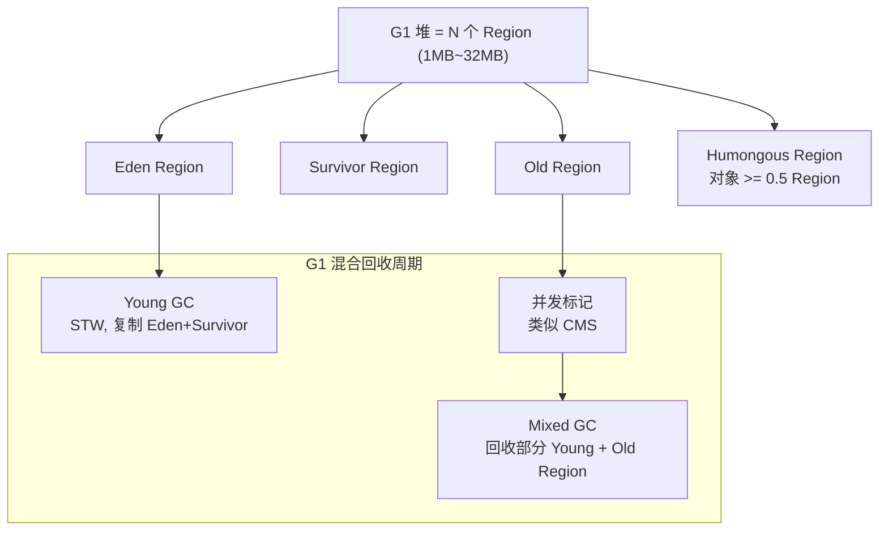

**G1 核心参数**：

```bash
-XX:+UseG1GC                     # 启用 G1
-XX:MaxGCPauseMillis=200         # 目标最大停顿 200ms
-XX:G1HeapRegionSize=4M          # Region 大小（1~32M，2 的幂）
-XX:InitiatingHeapOccupancyPercent=45  # 堆占用 45% 触发并发标记
-XX:G1NewSizePercent=5           # 新生代最小占比
-XX:G1MaxNewSizePercent=60       # 新生代最大占比
```

### 7.2 ZGC — 亚毫秒级延迟

```
核心: 染色指针 Colored Pointers + 读屏障 Load Barrier
目标: 任意堆大小, STW < 1ms
参数: -XX:+UseZGC -Xmx16G

染色指针: 64 位指针中 42 位存地址, 4 位存 GC 状态
  [Remapped][Marked0][Marked1][Finalizable] | [42 bits addr] | [18 bits unused]
```

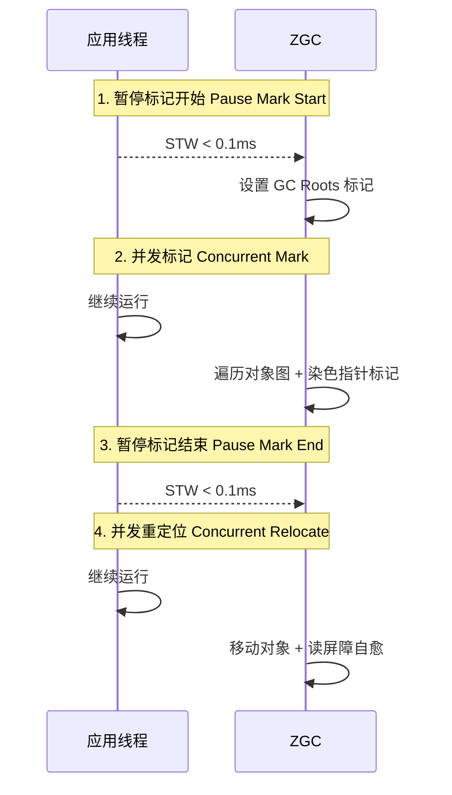

### 7.3 收集器对比总表

| 收集器 | STW | 算法 | 适用堆 | 适用场景 |
|--------|-----|------|--------|----------|
| Serial | 长 | 标记-复制 | < 100M | 单核/小应用 |
| Parallel | 长 | 标记-复制 | < 4G | 批处理/吞吐量优先 |
| CMS | 中 | 标记-清除 | < 8G | Web 应用(JDK 8) |
| **G1** | 可控 | 分区复制 | 4G~64G | ★ 默认(JDK 9+) |
| **ZGC** | < 1ms | 染色指针 | 8M~16T | 超低延迟/大堆 |
| Shenandoah | < 10ms | Brooks 指针 | 4G~64G | 低延迟 |

---

## 8. JIT 即时编译

### 8.1 解释执行 vs 编译执行

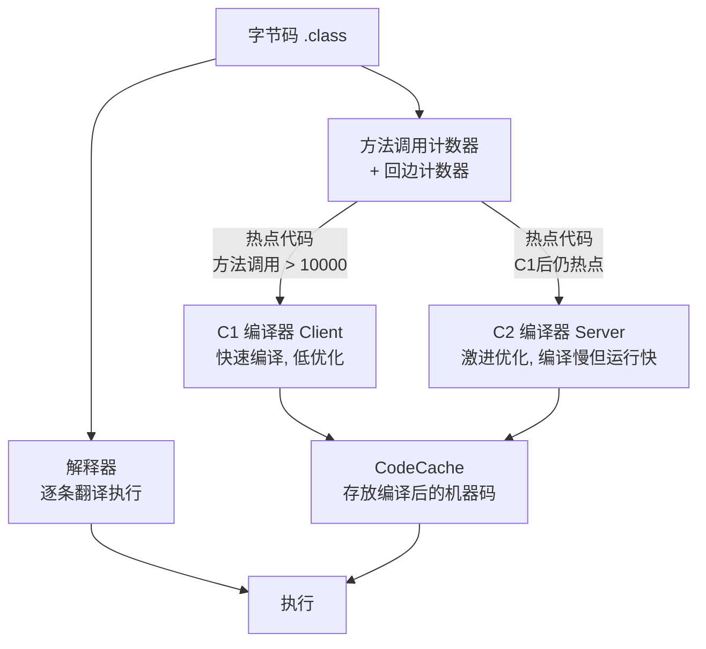

**热点探测方式**（HotSpot 用计数器）：
- 方法调用计数器：方法被调用次数
- 回边计数器：循环执行次数

```
分层编译（-XX:+TieredCompilation, JDK 8+ 默认）:
  Level 0: 解释执行
  Level 1: C1 无 profiling
  Level 2: C1 带简单 profiling
  Level 3: C1 带完整 profiling
  Level 4: C2 激进优化
```

### 8.2 C2 激进优化技术

| 优化 | 原理 | 示例 |
|------|------|------|
| **方法内联** | 小方法直接嵌入调用方 | `getX()` 替换为 `this.x` |
| **逃逸分析** | 对象不逃逸→栈上分配/标量替换 | `new Point(1,2)` → `int x=1; int y=2` |
| **锁消除** | 逃逸分析证明无竞争→干掉 `synchronized` | `StringBuffer.append()` 在局部变量中 |
| **锁粗化** | 连续加锁→合并为一次 | 循环内的 `synchronized` 提到循环外 |
| **空值检查消除** | 未抛 NPE→后续检查去掉 | `obj.method()` 第二次调用不检查 null |
| **数组边界检查消除** | 循环范围安全→去掉 | `for(i=0;i<len;i++) arr[i]` 安全则去边界检查 |

```java
// 逃逸分析示例
public int sum() {
    Point p = new Point(1, 2);  // ★ 对象不逃逸方法
    return p.x + p.y;
    // JIT 优化后: return 1 + 2; (标量替换)
    // 不会在堆上分配 Point 对象!
}
```

---

## 9. 类文件结构与字节码

### 9.1 Class 文件结构

```
ClassFile {
    u4             magic;               // CAFEBABE
    u2             minor_version;
    u2             major_version;       // 52 = JDK 8, 61 = JDK 17
    u2             constant_pool_count;
    cp_info        constant_pool[constant_pool_count-1];
    u2             access_flags;        // public/abstract/final...
    u2             this_class;
    u2             super_class;
    u2             interfaces_count;
    u2             interfaces[interfaces_count];
    u2             fields_count;
    field_info     fields[fields_count];
    u2             methods_count;
    method_info    methods[methods_count];
    u2             attributes_count;
    attribute_info attributes[attributes_count];
}
```

### 9.2 字节码指令分类

```java
// 源文件: Hello.java
public class Hello {
    public int add(int a, int b) {
        return a + b;
    }
}

// 编译: javac Hello.java
// 反编译: javap -verbose Hello.class

// add 方法字节码:
//  0: iload_1       // 将第1个 int 参数压入操作数栈
//  1: iload_2       // 将第2个 int 参数压入操作数栈
//  2: iadd          // 弹出两个 int, 相加, 结果压栈
//  3: ireturn       // 返回栈顶 int
```

| 类别 | 指令 | 含义 |
|------|------|------|
| 加载/存储 | `iload`, `istore`, `aload`, `astore` | 局部变量表 ↔ 操作数栈 |
| 算术 | `iadd`, `isub`, `imul`, `idiv` | int 运算 |
| 对象 | `new`, `getfield`, `putfield` | 创建/访问对象 |
| 方法 | `invokevirtual`, `invokespecial`, `invokestatic`, `invokeinterface`, `invokedynamic` | 方法调用 |
| 控制 | `ifeq`, `goto`, `tableswitch` | 分支跳转 |
| 返回 | `ireturn`, `areturn`, `return` | 方法返回 |

### 9.3 五种方法调用指令

| 指令 | 调用目标 | 例子 |
|------|----------|------|
| `invokestatic` | 静态方法 | `Math.abs(x)` |
| `invokespecial` | 构造器/私有方法/父类方法 | `new User()` / `super.method()` |
| `invokevirtual` | 虚方法（多态） | `user.toString()` |
| `invokeinterface` | 接口方法 | `list.size()` |
| `invokedynamic` | 动态调用点 | Lambda 表达式 |

---

## 10. JVM 启动流程

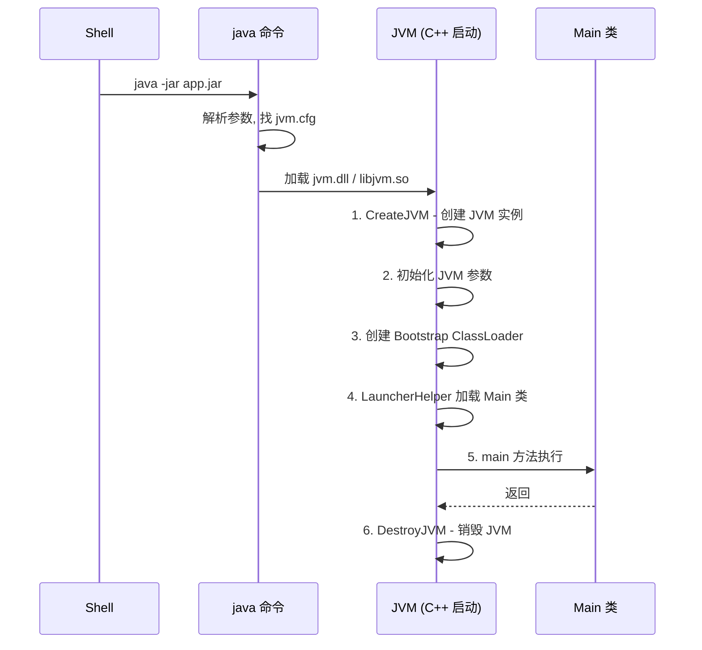

---

## 11. JVM 调优实战

> 核心原则：**测量 → 分析 → 调整 → 验证**，禁止凭感觉改参数。

### 11.1 核心监控工具与真实输出

```bash
# 1. jps: 查看 JVM 进程
$ jps -l
12345 com.example.AppMain
12346 sun.tools.jps.Jps

# 2. jstat: 实时 GC 监控（最常用）
$ jstat -gcutil 12345 1000 5
  S0     S1     E      O      M     CCS    YGC     YGCT    FGC    FGCT     GCT
  0.00  99.80  45.12  23.45  96.78  94.32   1234   12.345     5    2.345   14.690
  0.00  99.80  48.33  23.45  96.78  94.32   1234   12.345     5    2.345   14.690
# S0/S1: Survivor 使用率  E: Eden 使用率  O: 老年代使用率
# M: Metaspace使用率  YGC: Young GC次数  FGC: Full GC次数
# YGCT: Young GC总时间  FGCT: Full GC总时间

# 3. jstack: 线程快照
$ jstack 12345 | grep -A5 "Thread.State"
# "http-nio-8080-exec-1" #28 daemon prio=5 tid=0x... nid=0x5a3f waiting
#    java.lang.Thread.State: WAITING (parking)
#         at sun.misc.Unsafe.park(Native Method)

# 4. jmap: 堆分析
$ jmap -histo:live 12345 | head -20
 num     #instances         #bytes  class name
   1:       1854321       59338272  [C           ★ char[] 占 59M
   2:       1234567       29629608  java.lang.String
   3:        500000       24000000  com.example.User  ★ User 对象 24M
   4:        100000       16000000  [B
# 按实例数量和字节数排序, 快速定位"谁占内存最多"

# 5. jcmd: 多功能诊断(JDK 7+)
$ jcmd 12345 VM.flags          # 当前有效 JVM 参数
$ jcmd 12345 GC.heap_info      # 堆详情
$ jcmd 12345 Thread.print      # 等同于 jstack
$ jcmd 12345 GC.run            # 触发一次 Full GC
```

### 11.2 GC 日志深度解读

```bash
# JDK 9+ 统一日志格式
-Xlog:gc*=info:file=gc.log:time,level,tags

# 实际日志示例:
[2024-01-15T10:30:00.123+0800][info][gc,start] GC(1234) Pause Young (Allocation Failure)
[2024-01-15T10:30:00.123+0800][info][gc,heap] GC(1234) Eden: 65536K->0K(76288K)
[2024-01-15T10:30:00.123+0800][info][gc,heap] GC(1234) Survivor: 10240K->0K(10240K)
[2024-01-15T10:30:00.123+0800][info][gc,heap] GC(1234) Old: 10240K->20480K(175104K)
[2024-01-15T10:30:00.126+0800][info][gc     ] GC(1234) Pause Young 3.456ms
# 解读:
#   新生代: Eden 65M→0(Survivor 放不下, 0→0)
#   老年代: 10M→20M(对象晋升)
#   总堆: 75M→20M(回收了 55M)
#   耗时: 3.456ms ← 正常

# ★ 异常信号:
# Full GC 频繁 (> 1次/小时) → 内存泄漏或堆太小
# Young GC 耗时 > 100ms → 新生代太大或对象太大
# GC 后老年代持续增长不回降 → 内存泄漏
# Promotion Failed → Survivor 太小, 对象直接进老年代
```

### 11.3 五种真实场景调优案例

#### 场景 1: 高并发 Web API（QPS 5000, 4C8G）

```bash
# 症状: 高峰期 Young GC 每 2 秒一次, 每次 50ms, 接口 P99 波动大
# jstat -gcutil 输出:
  S0     S1     E      O      M     YGC    FGC
  50.00  0.00   99.00  45.00  96.00  4500   3

# 分析: Eden 每 2 秒打满→Young GC 频繁→对象晋升过快
# 调优:
java -Xms4G -Xmx4G \
     -XX:NewRatio=1 \           # ★ 新生代:老年代 = 1:1 (默认 1:2)
     -XX:SurvivorRatio=4 \      # ★ Eden:S0:S1 = 4:1:1 (默认 8:1:1)
     -XX:MaxTenuringThreshold=8 \ # ★ 降低晋升年龄
     -XX:+UseG1GC \
     -XX:MaxGCPauseMillis=100 \
     -jar app.jar

# 效果: Young GC 降到每 15 秒一次, 每次 20ms
```

#### 场景 2: 批处理大文件（单机, 目标吞吐量最大）

```bash
# 症状: 处理 100GB 日志文件, 长时间运行 CPU 100%
# 调优:
java -Xms8G -Xmx8G \
     -XX:+UseParallelGC \        # ★ 吞吐量优先(不是 G1!)
     -XX:ParallelGCThreads=8 \   # GC 线程数 = CPU 核数
     -XX:GCTimeRatio=19 \        # ★ GC 时间占比 ≤ 5% (1/20)
     -jar batch.jar

# 效果: STW 每次 200ms 但次数少, 总吞吐量 99%
```

#### 场景 3: 内存泄漏导致的 OOM

```bash
# 症状: 运行几天后 OOM, 重启恢复
# 第一步: 保留现场
-XX:+HeapDumpOnOutOfMemoryError -XX:HeapDumpPath=/dump/

# 第二步: MAT 分析 heap.hprof
#   → Leak Suspects → 发现 ConcurrentHashMap 持有 200 万个对象
#   → Dominator Tree → 追溯到定时任务每次 put 不清除旧数据
#   → Path to GC Roots → static 变量引用 → 确认泄漏

# 第三步: 修复代码
@Scheduled(fixedRate = 60000)
public void refreshCache() {
    Map<String, User> newData = loadFromDB();
    userCache.clear();              // ★ 先清理!
    userCache.putAll(newData);
}
```

#### 场景 4: Docker 容器内 OOMKilled

```bash
# 症状: K8s Pod 频繁被 kill, 日志显示 Exit Code 137 (OOMKilled)
# Docker 限制 2G, 但 JVM 按物理机分配了 4G 堆

# 修复:
# JDK 8/9/10: 手动计算
-XX:MaxRAMPercentage=75.0     # ★ JVM 使用容器内存的 75%
# 容器 2G → JVM 堆 ≤ 1.5G, 剩余 0.5G 给 Metaspace/栈/Native

# JDK 10+: 自动感知
-XX:+UseContainerSupport      # ★ 默认开启
-Xlog:os+container=trace      # 查看容器检测日志
```

#### 场景 5: Metaspace OOM（动态代理过多）

```bash
# 症状: java.lang.OutOfMemoryError: Metaspace
# jstat -gc 显示: MU(Metaspace Used) 持续增长, 已达 MaxMetaspaceSize

# 排查:
$ jcmd <pid> VM.classloader_stats
# 输出:
# ClassLoader        Parent       Classes  ChunkSz
# bootstrap          null         3000     4.2M
# app                 platform     15000    35.8M  ← ★ 自己应用的类 1.5 万!
# CGLIB$Proxy_1      app          5000     12.3M  ← ★ CGLIB 代理类太多!

# 根因: 代码中反复创建 CGLIB 代理而没有缓存代理对象
# 修复: 缓存代理, 或使用 JDK 动态代理(不生成新类)
```

### 11.4 jstack 实战：排查死锁与 CPU 高

```bash
# 1. 排查 CPU 100%
$ top -H -p <pid>              # 找到 CPU 最高的线程 TID
$ printf "%x\n" <tid>          # TID 转十六进制
$ jstack <pid> | grep -A20 <nid>  # 找到对应线程的堆栈

# 输出示例:
# "main" #1 prio=5 tid=0x... nid=0x5a3f runnable
#    at com.example.SlowService.calculate(SlowService.java:25)  ← ★ 热点方法

# 2. 排查死锁
$ jstack -l <pid> | grep "deadlock"
# Found 1 deadlock.
# "Thread-1": waiting to lock Monitor@0x..., held by "Thread-2"
# "Thread-2": waiting to lock Monitor@0x..., held by "Thread-1"
```

---

## 12. 常见 OOM 与排查

### 12.1 OOM 全景诊断流程

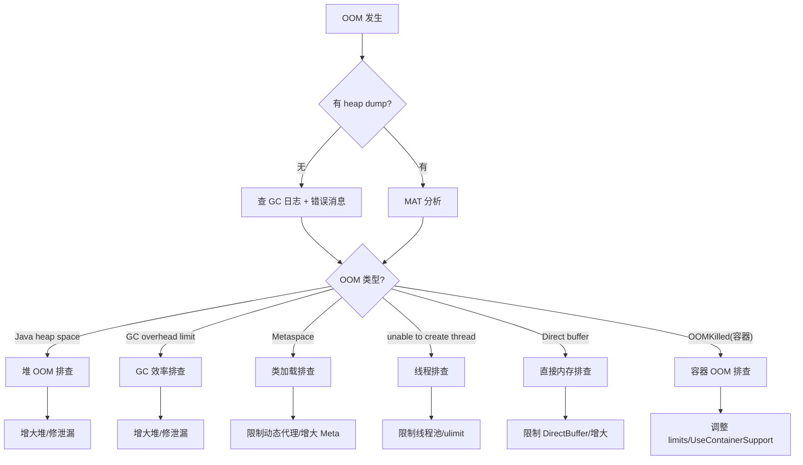

### 12.2 六种 OOM 逐一拆解

#### 12.2.1 Java heap space

```java
// ★ 最经典的 OOM, 分为"真不够"和"泄漏"两种

// 类型 A: 真不够——堆确实太小
// 现象: -Xmx256M, Dump 分析无异常大对象
// 修复: -Xmx1G

// 类型 B: 内存泄漏——垃圾越积越多
// 现象: Dump 分析发现某类对象数量持续增长
// 检测: jstat -gcutil 每 10 秒采样, 老年代持续增长不回降
```

**5 种常见泄漏模式**：

```java
// 模式 1: static 集合永不清理
public class DataHolder {
    private static final List<byte[]> DATA = new ArrayList<>();
    public static void add(byte[] data) { DATA.add(data); }
    // ★ DATA 是 GC Root, 永远可达, 永远不回收
}

// 模式 2: ThreadLocal 未清理
public class RequestContext {
    private static final ThreadLocal<Map<String, Object>> CTX = new ThreadLocal<>();
    public static void set() { CTX.set(new HashMap<>()); }
    // ★ 线程池线程不销毁 → ThreadLocal 值永远不释放!
    // 修复: finally { CTX.remove(); }
}

// 模式 3: 监听器未注销
public class EventBus {
    private final List<EventListener> listeners = new CopyOnWriteArrayList<>();
    public void register(EventListener l) { listeners.add(l); }
    // ★ 只有 addListener, 没有 removeListener!
    // 修复: 提供 unregister(), 或使用 WeakReference
}

// 模式 4: 内部类持有外部引用
public class MainView {
    private byte[] hugeBitmap = new byte[100 * 1024 * 1024]; // 100MB
    void onClick() {
        new Thread(() -> {
            // 匿名内部类默认持有外部类 MainView.this 的引用
            // 此线程长时间运行 → hugeBitmap 无法回收!
        }).start();
    }
    // 修复: 用静态内部类, 或将 hugeBitmap 置 null
}

// 模式 5: 字符串 substring JDK 6 陷阱(已修复)
// JDK 6: substring() 共享底层 char[], 小串引用大串 → 大串无法回收
// JDK 7+: substring() 复制 char[], 已修复
```

#### 12.2.2 GC overhead limit exceeded

```bash
# 错误消息:
# java.lang.OutOfMemoryError: GC overhead limit exceeded

# 含义: 98% 的时间在做 GC, 但只回收了 <2% 的堆
# JVM 认为"再 GC 也没用", 主动抛出 OOM

# 典型场景: 堆 256M, 应用实际需要 1G
# jstat 输出:
  S0    S1    E      O      M     FGC    FGCT
  0.00  100. 100.0  99.99  96.00  9999   3600.0
# FGC=9999 次! 几乎每秒一次 Full GC

# 修复: 增大堆 → -Xmx2G
# 临时关闭(不推荐): -XX:-UseGCOverheadLimit
```

#### 12.2.3 Metaspace

```bash
# 错误: java.lang.OutOfMemoryError: Metaspace

# 排查步骤:
# 1. 确认 Metaspace 使用情况
$ jstat -gc <pid> 1000
 MU      MC      CCSC
 250.0   256.0   32.0
# MU=250M, MC=256M(最大值) → 即将 OOM

# 2. 找谁加载了这么多类
$ jcmd <pid> VM.classloader_stats
# 发现 CGLIB$Proxy 类 10000+

# 修复:
# 短期: -XX:MaxMetaspaceSize=512M
# 长期: 缓存代理, 不用每次 new Proxy
```

#### 12.2.4 unable to create new native thread

```bash
# 错误: java.lang.OutOfMemoryError: unable to create new native thread

# 根因: 不是 JVM 堆不够, 是 OS 线程数超限!
# 每个线程默认栈 1MB(-Xss), 加上 JVM 开销约 2MB
# 4G 内存 → 最多 ~2000 个线程

# 排查:
$ ulimit -u          # 用户最大进程数(含线程)
$ jstack <pid> | grep "Thread.State" | wc -l   # 当前线程数
$ cat /proc/sys/kernel/threads-max    # 系统最大线程数

# 修复:
# 1. 减少线程池大小 (根本解决)
# 2. 减小栈: -Xss512k
# 3. 增大 ulimit: ulimit -u 65535
# 4. JDK 21+: 换虚拟线程 (栈按需分配)
```

#### 12.2.5 Direct buffer memory

```bash
# 错误: java.lang.OutOfMemoryError: Direct buffer memory

# 根因: NIO 的 ByteBuffer.allocateDirect() 使用堆外内存
# 默认 ≈ -Xmx 值, 但不在堆内!

# 排查:
$ jcmd <pid> VM.native_memory summary
# - Direct Buffer (reserved=1024M, committed=1020M) ← 快满了!

# 修复:
-XX:MaxDirectMemorySize=2G    # 显式增大
# 代码: 确保 DirectByteBuffer 被 GC 回收(可能被 Finalizer 延迟)
```

#### 12.2.6 Docker OOMKilled

```bash
# K8s Pod 被 kill, exit code 137 (= 128 + 9, SIGKILL)

# 根因: Java 进程(堆+Metaspace+栈+Native+Direct) > container limits
# JDK 8/9 不感知容器限制, 按物理机内存计算

# 修复:
-XX:MaxRAMPercentage=75.0    # ★ Linux 容器下必须加!
-XX:InitialRAMPercentage=75.0
-XX:+UseContainerSupport     # JDK 10+ 默认

# 验证:
$ java -XX:+PrintFlagsFinal -version | grep RAM
# MaxRAMPercentage = 75.0
```

### 12.3 MAT 分析实战三步

```bash
# Step 1: 获取 Dump
# 自动(OOM时): -XX:+HeapDumpOnOutOfMemoryError -XX:HeapDumpPath=/dump/
# 手动: jmap -dump:live,format=b,file=heap.hprof <pid>

# Step 2: 用 MAT 打开 → Leak Suspects Report
# 会告诉你"哪个对象持有最多内存"和"引用链"

# Step 3: 定位泄漏代码
# 路径: Dominator Tree → 找到可疑大对象 → 
#       右键 "Path to GC Roots" → "exclude weak references" →
#       看到引用链: static → HashMap → ArrayList → byte[]
#       → 确认 static 集合未清理
```

### 12.4 快速决策：OOM 怎么修？

| 场景 | 判断方法 | 立即操作 | 长期方案 |
|------|----------|----------|----------|
| 真不够 | Dump 分析无异常大对象, 堆使用率持续 90%+ | 加大 `-Xmx` | 评估合理性 |
| 内存泄漏 | `jstat` 老年代持续增长；Dump 见某对象数量异常 | 重启（治标） | MAT 分析 → 修代码 |
| GC overhead | `jstat` Full GC 每秒一次 | 加大 `-Xmx` 或重启 | 修泄漏或堆太小 |
| Metaspace | `jstat` MU 逼近 MC | `-XX:MaxMetaspaceSize=512M` | 减少动态类生成 |
| 线程超限 | `jstack | wc -l` > 预期 | 缩小线程池 | 调整线程池参数 |
| 容器 OOM | Exit Code 137 | 加 `MaxRAMPercentage=75` | 规范容器 JVM 参数 |

---

## 13. Java 内存模型 JMM

JMM（Java Memory Model）不是 JVM 内存结构，而是**多线程环境下的内存可见性规范**。

### 13.1 CPU 缓存一致性问题

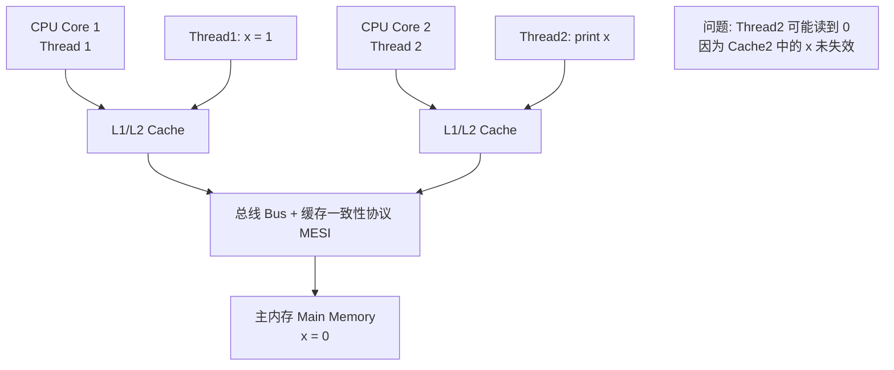

### 13.2 volatile 的三大特性

```java
// volatile 保证:
// 1. 可见性: 写 volatile → 立即刷新到主内存
// 2. 有序性: 禁止指令重排（内存屏障）
// 3. ★ 不保证原子性: volatile int count = 0; count++ 仍非原子

class VolatileExample {
    private volatile boolean flag = false;
    private int data = 0;
    
    // Thread 1: 写
    public void writer() {
        data = 42;        // 1. 写普通变量
        flag = true;      // 2. 写 volatile → ★ StoreStore 屏障
        // 保证: flag=true 可见时, data=42 一定可见
    }
    
    // Thread 2: 读
    public void reader() {
        if (flag) {       // ★ LoadLoad 屏障
            System.out.println(data);  // 一定看到 42
        }
    }
}
```

**volatile 底层实现**：

```asm
# volatile 写对应的汇编（x86）
mov [flag], 1        # 写入
lock addl $0, (%rsp)  # ★ lock 前缀指令 → StoreLoad 屏障
                      # 作用: 清空 StoreBuffer + 使其他 CPU 的 CacheLine 失效
```

### 13.3 happens-before 规则

| 规则 | 含义 | 示例 |
|------|------|------|
| **程序顺序规则** | 同一线程内，前面的操作 happens-before 后面 | `x=1; y=2;` → `happens-before` |
| **volatile 规则** | volatile 写 happens-before 后续 volatile 读 | `writer()` → `happens-before` → `reader()` |
| **锁规则** | unlock happens-before 后续 lock | `synchronized` 释放 → 获取 |
| **传递性** | A → B, B → C ⇒ A → C | — |
| **线程启动规则** | `start()` happens-before 线程内所有操作 | `t.start()` → `t.run()` |
| **线程终止规则** | 线程内操作 happens-before `join()` 返回 | `t.run()` → `t.join()` |

### 13.4 CAS 与原子操作

```java
// CAS: Compare And Swap — 无锁原子操作
// 底层: lock cmpxchg 指令（x86）

public class AtomicInteger {
    private volatile int value;  // ★ volatile 保证可见性
    
    public final int incrementAndGet() {
        // ★ 自旋 + CAS
        for (;;) {
            int current = get();
            int next = current + 1;
            if (compareAndSet(current, next))  // CAS
                return next;
        }
    }
    
    // Unsafe.compareAndSwapInt → JNI → lock cmpxchg
}
```

---

## 14. synchronized 锁升级

synchronized 在 HotSpot 中经历了**无锁 → 偏向锁 → 轻量级锁 → 重量级锁**的四级演化。

### 14.1 锁升级流程图

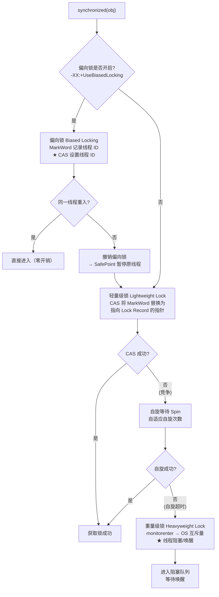

### 14.2 四种锁状态对比

| 锁状态 | MarkWord 标志 | 适用场景 | 开销 | JDK 15+ |
|--------|--------------|----------|------|---------|
| 无锁 | 001 | 初始状态 | 零 | — |
| **偏向锁** | 101 | 单线程反复获取 | 极低（CAS 一次） | **默认禁用** |
| **轻量级锁** | 00 | 多线程交替执行（无竞争） | 低（CAS + 自旋） | — |
| **重量级锁** | 10 | 多线程并发竞争 | 高（系统调用） | — |

```bash
# JDK 15+ 偏向锁默认禁用（Renaissance 基准测试发现现代应用收益小）
-XX:+UseBiasedLocking    # 手动开启
```

### 14.3 synchronized 底层实现

```bytecode
// Java 源码
public synchronized void method() {
    // 方法体
}

// 对应字节码:
//  方法标志: ACC_SYNCHRONIZED
//  自动在方法入口 monitorenter, 出口 monitorexit

// 同步块:
synchronized(obj) { ... }

// 字节码:
//   aload_1
//   dup
//   astore_2
//   monitorenter    ← ★ 进入 Monitor
//   ... 代码 ...
//   aload_2
//   monitorexit     ← ★ 正常退出
//   goto end
//   aload_2
//   monitorexit     ← ★ 异常退出（finally）
// end:
```

---

## 15. SafePoint 安全点

SafePoint 是 JVM **暂停所有用户线程以执行 GC 的位置**。不是任何位置都能 GC——只有线程到达 SafePoint 时才能暂停。

### 15.1 SafePoint 的本质

```mermaid
sequenceDiagram
    participant GC as GC 线程
    participant T1 as 用户线程 1
    participant T2 as 用户线程 2

    GC->>GC: 需要 GC, 设置全局标志
    GC->>T1: 等待 Thread 1 到达 SafePoint
    GC->>T2: 等待 Thread 2 到达 SafePoint

    Note over T1: 执行中... 检查标志位
    T1->>T1: 到达 SafePoint → 暂停
    T1-->>GC: 已暂停

    Note over T2: 执行中... 检查标志位
    T2->>T2: 到达 SafePoint → 暂停
    T2-->>GC: 已暂停

    Note over GC: ★ 所有线程到达 → STW
    GC->>GC: 执行 GC
    GC->>T1: 恢复线程
    GC->>T2: 恢复线程
```

### 15.2 SafePoint 位置

JIT 在编译代码时，**在以下位置插入 SafePoint 检查**：

| 位置 | 示例 |
|------|------|
| 方法返回前 | `return` 之前 |
| 循环回边 | `for` / `while` 的末尾 |
| 异常抛出点 | `athrow` 之前 |

```java
// JIT 编译后插入 SafePoint 检查的伪代码:
for (int i = 0; i < 1000000; i++) {
    // 用户代码
    if (i % 100 == 0) {
        // ★ JIT 插入的 SafePoint 检查
        if (global_flag_set) { read_polling_page(); }
    }
}
// 问题: 大循环内如果没有 SafePoint → "TTSP 问题"
// (Time To SafePoint) → STW 延迟飙升
```

### 15.3 Counted Loop 和 SafePoint 的坑

```java
// ❌ 这个循环没有 SafePoint!
for (long i = 0; i < Long.MAX_VALUE; i++) {
    // 空循环, JIT 将其优化为 counted loop
    // JIT 认为执行时间短, 不插入 SafePoint 检查
    // → GC 必须等待此循环跑完 → STW 巨长!
}

// ✅ 修复:
for (long i = 0; i < Long.MAX_VALUE; i++) {
    Thread.yield();  // 或任何方法调用 → 产生 SafePoint
}
```

---

## 16. JFR 与诊断

JFR（Java Flight Recorder）是 JDK 内置的**低开销性能监控框架**（< 1% 性能影响）。

### 16.1 JFR 核心事件类型

```bash
# 启动 JFR 记录（JDK 9+）
java -XX:StartFlightRecording=duration=60s,filename=recording.jfr -jar app.jar

# 运行时控制
jcmd <pid> JFR.start duration=60s filename=myrecording.jfr
jcmd <pid> JFR.dump filename=myrecording.jfr
jcmd <pid> JFR.stop

# 查看 JFR 文件
jfr print --events GC,CPULoad recording.jfr  # 命令行查看
# 或: JDK Mission Control (JMC) 图形界面打开
```

| 事件类别 | 包含内容 |
|----------|----------|
| **GC** | 每次 GC 的持续时间、回收量、原因 |
| **Compilation** | JIT 编译耗时、CodeCache 使用 |
| **Thread** | 线程阻塞时间、锁等待、上下文切换 |
| **File I/O** | 文件读写耗时、路径、大小 |
| **Socket I/O** | 网络读写耗时、地址、数据量 |
| **Exception** | 异常类型、抛出次数 |
| **Allocation** | 对象分配的类、大小、线程 |

### 16.2 hs_err 崩溃日志解读

```bash
# JVM 崩溃时自动生成 hs_err_pid.log
# 关键信息:

# 1. 崩溃原因
# Internal Error (safepoint.cpp:333), pid=12345, tid=12346
# guarantee(result) failed: result must be true

# 2. 当前线程
# Current thread (0x00007f...): JavaThread "main" [_thread_in_native, id=12346]

# 3. 堆信息
# Heap:
#  PSYoungGen      total 76288K, used 10240K
#  ParOldGen       total 175104K, used 0K

# 4. Native 内存
# Native Memory Tracking:
#   Total: reserved=5G, committed=3G
```

---

## 17. 虚拟线程

JDK 21 正式引入**虚拟线程**（Project Loom），一个 JVM 可创建**百万级**虚拟线程。

### 17.1 平台线程 vs 虚拟线程

```mermaid
flowchart TB
    subgraph PLATFORM["平台线程 Platform Thread"]
        P1["线程 1"] --> OS1["OS 线程 1"]
        P2["线程 2"] --> OS2["OS 线程 2"]
        P3["线程 3"] --> OS3["OS 线程 3"]
        NoteP["1:1 映射<br/>每个 Java 线程 = 一个 OS 线程<br/>默认栈 1MB"]
    end

    subgraph VIRTUAL["虚拟线程 Virtual Thread"]
        V1["虚拟线程 1"]
        V2["虚拟线程 2"]
        V3["虚拟线程 3"]
        V9999["... 10000 个虚拟线程"]
        
        Carrier1["平台线程 A<br/>(Carrier Thread)"]
        Carrier2["平台线程 B<br/>(Carrier Thread)"]
        
        V1 --> Carrier1
        V2 --> Carrier1
        V3 --> Carrier2
        V9999 --> Carrier2
        
        Carrier1 --> OS_A["OS 线程"]
        Carrier2 --> OS_B["OS 线程"]
        
        NoteV['M:N 映射<br/>虚拟线程在阻塞时自动"卸下"<br/>让 Carrier 线程处理其他虚拟线程<br/>默认栈：按需动态增长']
    end
```

### 17.2 虚拟线程使用

```java
// 方式 1: Thread.ofVirtual()
Thread vThread = Thread.ofVirtual()
    .name("my-virtual-thread")
    .start(() -> {
        System.out.println("Hello from virtual thread");
    });
vThread.join();

// 方式 2: Executors.newVirtualThreadPerTaskExecutor()
try (ExecutorService executor = Executors.newVirtualThreadPerTaskExecutor()) {
    for (int i = 0; i < 1_000_000; i++) {
        executor.submit(() -> {
            Thread.sleep(1000);  // ★ 阻塞时自动卸载
            return "done";
        });
    }
}  // 100 万个虚拟线程!

// Spring Boot 3.2+ 启用虚拟线程:
// spring.threads.virtual.enabled=true
```

### 17.3 虚拟线程 vs 线程池

| 维度 | 线程池 | 虚拟线程 |
|------|--------|----------|
| 创建成本 | 高（~1MB 栈 + OS 资源） | 低（对象头 + 动态栈） |
| 阻塞代价 | 线程阻塞 → 无法复用 | 自动卸载 → Carrier 继续工作 |
| 最大数量 | 数千 | **百万级** |
| 适用场景 | CPU 密集型 | **I/O 密集型** |
| 编程模型 | `CompletableFuture` / 响应式 | **同步代码**（像写同步代码一样写异步） |

---

## 18. 附录：高级参数速查

| 分类 | 参数 | 含义 |
|------|------|------|
| **JFR** | `-XX:StartFlightRecording=filename=rec.jfr` | 启动时开始记录 |
| **CDS** | `-XX:ArchiveClassesAtExit=app-cds.jsa` | 运行时生成 CDS 归档 |
| **CDS** | `-XX:SharedArchiveFile=app-cds.jsa` | 使用 CDS 归档 |
| **NMT** | `-XX:NativeMemoryTracking=summary` | 开启 Native 内存追踪 |
| **NMT** | `jcmd <pid> VM.native_memory summary` | 查看 Native 内存 |
| **调试** | `-XX:+PrintFlagsFinal` | 打印所有 JVM 参数终值 |
| **调试** | `-XX:+UnlockDiagnosticVMOptions` | 解锁诊断参数 |
| **逃逸分析** | `-XX:+DoEscapeAnalysis` | 默认开启 |
| **去优化** | `-XX:+TraceDeoptimization` | 追踪去优化事件 |
| **字符串去重** | `-XX:+UseStringDeduplication` | G1 下字符串去重 |
| **NUMA** | `-XX:+UseNUMA` | NUMA 感知分配 |
| **容器** | `-XX:+UseContainerSupport` | Docker 下自动感知内存限制 |
| **大页** | `-XX:+UseLargePages` | 启用大页内存 |

---

---

## 19. 设计哲学与演化历程

> JVM 不是一天建成的——每个设计决策背后都有"当时为什么这么选"和"后来为什么改了"的故事。

### 19.1 为什么选择"虚拟机"而不是"直接编译"？

**1995 年，Java 面临的选择**：

```mermaid
flowchart TB
    subgraph A["方案 A: AOT 编译 - C/C++ 路线"]
        A1["源码 → 编译 → 平台二进制"]
        A2["✅ 性能高"]
        A3["❌ 每个平台编译一次"]
    end
    
    subgraph B["方案 B: 纯解释执行"]
        B1["源码 → 字节码 → 解释执行"]
        B2["✅ 跨平台"]
        B3["❌ 性能差 10-100x"]
    end
    
    subgraph C["方案 C: 虚拟机 + JIT - Java 选择"]
        C1["源码 → 字节码 → 解释运行 → 热点 JIT 编译"]
        C2["✅ 跨平台 + 运行时优化 + 性能接近原生"]
        C3["⚠️ 预热时间长 + 内存开销"]
    end
    
    A -.->|"目标: Write Once Run Anywhere"| C
    B -.->|"性能不可接受"| C
```

### 19.2 为什么选择自动 GC？

C/C++ 的 `malloc/free` 是内存泄漏和悬空指针的第一大来源。Java 选择 **"程序员不管理内存"**——让 JVM 自动回收，代价是 STW 停顿，但绝大多数应用可容忍。

### 19.3 为什么字节码是"基于栈"而不是"基于寄存器"？

| 维度 | 基于栈 Java | 基于寄存器 Dalvik/ART |
|------|-----------|---------------------|
| 指令长度 | 短（无操作数） | 长（含寄存器号） |
| 跨平台 | ✅ 无关寄存器数量 | ❌ 需适配架构 |
| 执行效率 | 低（更多指令） | 高（更少指令） |

Java 在 1995 年首要目标是跨平台——不同 CPU 寄存器数量不同，栈模型无感。

### 19.4 为什么 HotSpot 要"解释器 + JIT"混合？

**二八定律**：20% 的代码消耗 80% 的运行时间。只需编译那 20%。

```mermaid
flowchart LR
    START["方法被调用"] --> INTERP["解释执行<br/>启动快, 立即响应"]
    INTERP --> COUNTER{"调用 > 阈值?"}
    COUNTER -->|"否"| INTERP
    COUNTER -->|"是"| C1["C1 编译<br/>快速编译, 中等优化"]
    C1 --> COUNTER2{"仍然是热点?"}
    COUNTER2 -->|"是"| C2["C2 编译<br/>慢编译, 激进优化"]
    COUNTER2 -->|"否"| C1
    C2 --> DEOPT{"假设失效?"}
    DEOPT -->|"是"| INTERP
    DEOPT -->|"否"| C2
```

**逆优化 Deoptimization**：C2 基于乐观假设（如引用永不为 null）。假设失效时**回退到解释执行**而非崩溃。

### 19.5 为什么移除永久代？

- 永久代大小难定：太小→OOM，太大→浪费堆空间
- 字符串常量池移入堆：避免永久代 OOM
- 类卸载在永久代中需 Full GC，元空间中更灵活
- HotSpot 与 JRockit 合并：JRockit 无永久代

### 19.6 为什么 G1 取代 CMS？

| 缺陷 | CMS | G1 改进 |
|------|-----|--------|
| 碎片化 | 标记-清除 → 碎片 → Serial Old 兜底 | 标记-复制 → 无碎片 |
| 停顿不可控 | 碎片化导致 Full GC 不可预测 | `-XX:MaxGCPauseMillis` 可控 |
| CPU 竞争 | 并发阶段与用户线程抢 CPU | 分区 Region，优先回收收益最大的 |

### 19.7 为什么 ZGC 的目标是 <1ms STW？

核心目标：**GC 停顿不随堆大小增长**。

```mermaid
flowchart LR
    CMS["CMS: 8G→50ms, 32G→2s"] -.-> G1
    G1["G1: 8G→20ms, 32G→500ms"] -.-> ZGC
    ZGC["ZGC: 8G/32G/1T → 均 <1ms<br/>★ 停顿与堆大小无关"]
```

关键技术：染色指针（GC 状态编码在指针中）+ 读屏障（读引用时自愈）。

### 19.8 关键版本演化

| 版本 | 年份 | 关键变化 | 设计意图 |
|------|------|----------|----------|
| JDK 1.0 | 1996 | 初代 JVM, 解释执行 | 验证 Write Once Run Anywhere |
| JDK 1.2 | 1998 | 引入 JIT, 分代 GC | 解决"Java 太慢" |
| JDK 5 | 2004 | 泛型, CMS GC | 追赶 C# 语言特性 |
| JDK 8 | 2014 | Lambda, Stream, **Metaspace** | 拥抱函数式编程 |
| JDK 9 | 2017 | 模块系统, **G1 默认** | 瘦身 JDK + 改善 GC |
| JDK 11 | 2018 | ZGC 试验 | LTS, 低延迟探索 |
| JDK 17 | 2021 | ZGC 增强, 密封类 | LTS, 锁定未来十年 |
| JDK 21 | 2023 | **虚拟线程**, ZGC 分代 | 百万级并发 |

### 19.9 设计哲学总结

| 原则 | 体现 | 权衡 |
|------|------|------|
| **跨平台优先** | 字节码 + JVM | 牺牲原生性能（用 JIT 补回） |
| **安全优先** | 自动 GC + 数组边界检查 | 牺牲手动控制自由 |
| **渐进增强** | 解释 → C1 → C2 分层编译 | 牺牲预热时间 |
| **零开销抽象** | 逃逸分析 + 标量替换 | 开发者无感, JIT 负责优化 |
| **向下兼容** | 25 年前的 .class 仍可运行 | 牺牲清理过时 API 的勇气 |
| **适时演进** | 移除 PermGen / CMS / 偏向锁 | 不怕打破旧设计 |

> 理解 JVM 的设计哲学，比记住 `-XX:` 参数重要 10 倍。参数会变，设计思想贯穿 30 年。


*全文 19 章，基于 HotSpot JVM (JDK 8/11/17/21) 编写。*
