# MySQL 源码深度解析

> **InnoDB 内核**：B+Tree 索引、MVCC 多版本并发控制、锁机制、Redo/Undo/Binlog 三大日志、SQL 优化实战。

---

## 目录

- [1. MySQL 架构全景](#1-mysql-架构全景)
- [2. InnoDB 存储引擎架构](#2-innodb-存储引擎架构)
- [3. B+Tree 索引原理](#3-btree-索引原理)
- [4. 事务隔离级别与 MVCC](#4-事务隔离级别与-mvcc)
- [5. 锁机制详解](#5-锁机制详解)
- [6. 三大日志：Redo / Undo / Binlog](#6-三大日志redo--undo--binlog)
- [7. SQL 执行全链路](#7-sql-执行全链路)
- [8. SQL 优化实战](#8-sql-优化实战)
- [9. 慢查询与 Explain 详解](#9-慢查询与-explain-详解)
- [10. 数据库设计原则](#10-数据库设计原则)
- [11. 主从复制与读写分离](#11-主从复制与读写分离)
- [12. 分库分表](#12-分库分表)
- [13. 面试真题与陷阱](#13-面试真题与陷阱)
- [14. InnoDB 进阶机制](#14-innodb-进阶机制)
- [15. MySQL 8.0 关键新特性](#15-mysql-80-关键新特性)
- [16. 设计哲学与权衡](#16-设计哲学与权衡)
- [17. 实战案例](#17-实战案例)

---

## 1. MySQL 架构全景

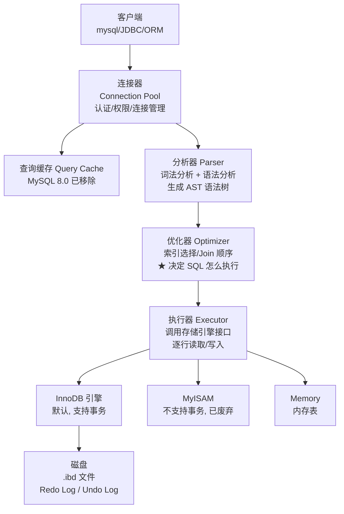

**Server 层 vs 存储引擎层**：

| 层 | 职责 | 是否可替换 |
|----|------|-----------|
| **Server 层** | 连接、解析、优化、执行、内置函数 | ❌ 固定 |
| **存储引擎层** | 数据存储、索引实现、事务、锁 | ✅ 可插拔（InnoDB/MyISAM/Memory） |

---

## 2. InnoDB 存储引擎架构

### 2.1 内存 + 磁盘双层结构

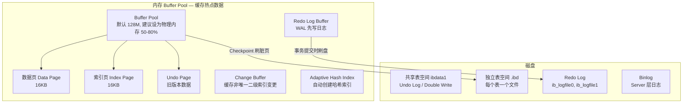

### 2.2 InnoDB 页结构

```
InnoDB Page (16KB, 默认):
┌─────────────────────────────┐
│ File Header       (38B)     │  页类型/页号/校验和
│ Page Header       (56B)     │  槽数量/记录数/层级
│ Infimum + Supremum (26B)   │  最小/最大虚拟记录
│ User Records      (变长)    │  ★ 实际数据行
│ Free Space        (变长)    │  空闲空间
│ Page Directory    (变长)    │  槽位数组(二分查找)
│ File Trailer      (8B)      │  校验和
└─────────────────────────────┘
```

**Compact 行格式**：

```
字段1长度 | 字段2长度 | NULL标志位 | 记录头(5B) | 列1数据 | 列2数据 | ...

记录头信息(5B):
  - delete_flag: 1bit (标记删除 → 由 Purge 线程清理)
  - min_rec_flag: 1bit (B+Tree 非叶子页最小记录)
  - n_owned: 4bit (当前记录拥有的记录数, 用于 Page Directory)
  - heap_no: 13bit (记录在页中的位置编号)
  - record_type: 3bit (0=普通, 1=B+非叶子, 2=Infimum, 3=Supremum)
  - next_record: 16bit (★ 下一条记录的相对偏移, 形成单向链表)
```

---

## 3. B+Tree 索引原理

### 3.1 为什么是 B+Tree 而不是其他？

| 数据结构 | 读 O(log n) | 范围查询 | 磁盘友好 | MySQL 选择 |
|----------|------------|----------|----------|-----------|
| **哈希表** | O(1) | ❌ | ❌ | 自适应哈希（辅助） |
| **二叉搜索树** | 可能 O(n) | ✅ | ❌（深度大） | ❌ |
| **AVL/红黑树** | O(log n) | ✅ | ❌（深度大，随机IO） | ❌ |
| **B-Tree** | O(log n) | ⚠️ 需回退 | ✅ | ❌ |
| **B+Tree** | O(log n) | **✅ 叶子链表** | **✅ 高度低** | ★ |

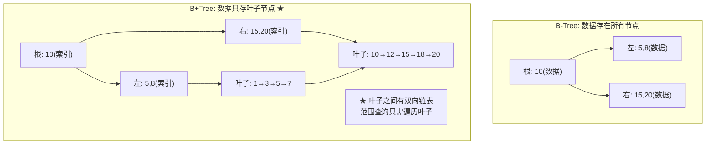

**B+Tree 的核心优势**：

1. **高度低**：3 层 B+Tree 可存约 2000 万行数据（假设每行 1KB）
2. **叶子层链表**：`SELECT * FROM t WHERE id BETWEEN 100 AND 200` 只需定位 100 然后沿着链表遍历
3. **非叶子节点只存索引 key**：一个 16KB 页可以存更多索引项，树更矮

### 3.2 聚簇索引 vs 二级索引

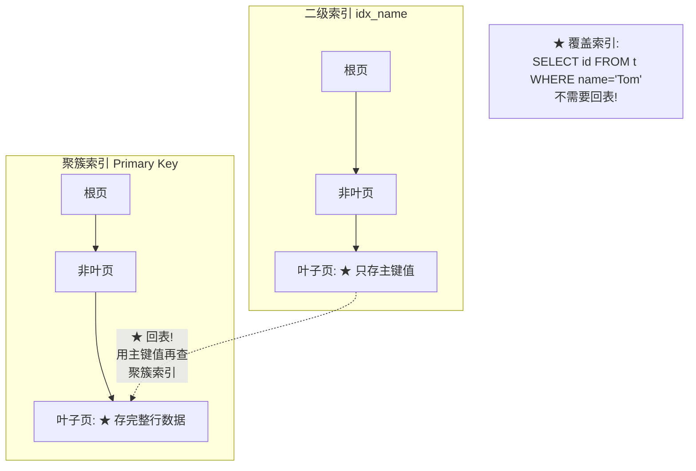

```sql
-- 回表示例:
SELECT * FROM users WHERE name = 'Tom';
-- ① 走 idx_name 二级索引 → 找到 Tom 对应的主键 id=100
-- ② ★ 回表: 用 id=100 再到聚簇索引查完整行 → 额外磁盘 IO!

-- 避免回表:
SELECT id, name FROM users WHERE name = 'Tom';
-- ★ 覆盖索引: id 和 name 都在 idx_name 中, 不需要回表!
```

### 3.3 索引优化黄金法则

| 法则 | 说明 | 反例 |
|------|------|------|
| **最左前缀** | 联合索引 `(a,b,c)` → a / a,b / a,b,c 都能用 | 跳过 a 直接用 b → 失效 |
| **覆盖索引** | SELECT 的列都包含在索引中 | `SELECT *` → 无法覆盖 |
| **避免函数** | `WHERE YEAR(date) = 2024` → 索引失效 | 改为 `WHERE date >= '2024-01-01' AND date < '2025-01-01'` |
| **避免隐式转换** | `WHERE phone = 13800138000` 如果 phone 是 `VARCHAR` → 失效 | `WHERE phone = '13800138000'` |

---

## 4. 事务隔离级别与 MVCC

### 4.1 四种隔离级别


| 隔离级别 | 脏读 | 不可重复读 | 幻读 | InnoDB 实现 |
|----------|------|-----------|------|------------|
| READ UNCOMMITTED | ✅ | ✅ | ✅ | 无锁读 |
| READ COMMITTED | ❌ | ✅ | ✅ | 每次语句创建新 ReadView |
| **REPEATABLE READ** | ❌ | ❌ | ⚠️ 部分 | ★ 事务开始时创建 ReadView |
| SERIALIZABLE | ❌ | ❌ | ❌ | 锁读 |

### 4.2 MVCC 多版本并发控制

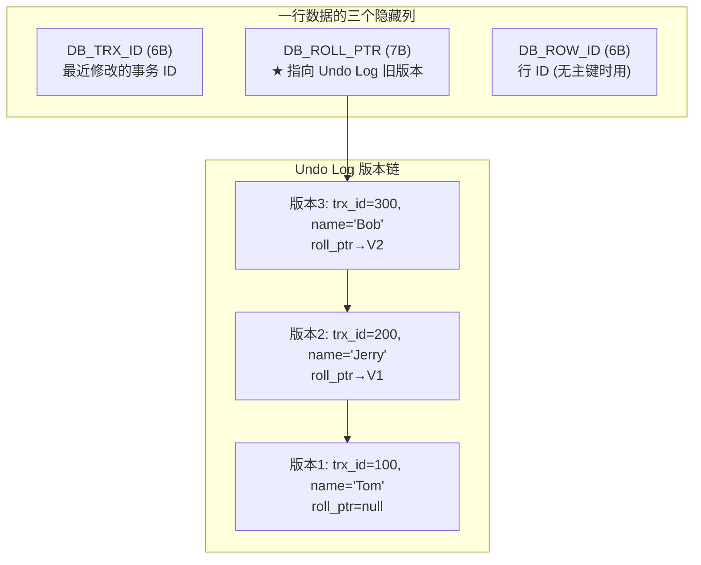

**MVCC 的核心原理 — ReadView**：

```sql
-- ★ REPEATABLE READ 下:
-- 事务开始时就创建 ReadView, 记录:
--   1. m_ids: 当前活跃事务 ID 列表
--   2. min_trx_id: 活跃事务最小 ID
--   3. max_trx_id: 下一个要分配的事务 ID

-- 可见性判断:
SELECT * FROM users WHERE id = 1;

-- 对于每一行:
-- if trx_id < min_trx_id:        ✅ 可见 (事务在 ReadView 创建前已提交)
-- if trx_id >= max_trx_id:       ❌ 不可见 (事务在 ReadView 创建后才开始)
-- if trx_id in m_ids:            ❌ 不可见 (事务在 ReadView 创建时仍活跃)
--    → 沿 roll_ptr 找 Undo Log 中的可见版本
-- else:                          ✅ 可见 (事务在 ReadView 创建时已提交)
```

**RR vs RC 的 ReadView 区别**：

```sql
-- RR: ReadView 在事务开始时创建一次
--     整个事务期间用同一个 ReadView → 可重复读

-- RC: 每次语句执行时创建新的 ReadView
--     能读到其他事务已提交的修改 → 不可重复读
```

---

## 5. 锁机制详解

### 5.1 锁的类型全景

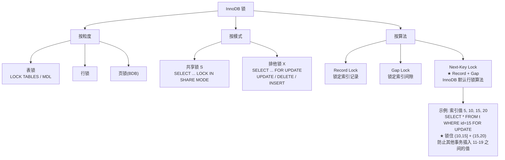

### 5.2 Next-Key Lock 解决幻读

```sql
-- 表: id(主键) = 1, 5, 10, 15, 20

-- RR 隔离级别下:
SELECT * FROM t WHERE id = 10 FOR UPDATE;
-- 加锁: Record Lock on id=10
--       Gap Lock on (5,10)
--       Gap Lock on (10,15)
-- ★ 其他事务不能插入 id=6,7,8,9,11,12,13,14!

SELECT * FROM t WHERE id > 10 AND id < 15 FOR UPDATE;
-- 加锁: Gap Lock on (10,15)
-- 其他事务不能插入 id=11,12,13,14
```

### 5.3 死锁排查

```sql
-- ★ 死锁场景:
-- Thread A: UPDATE t SET name='a' WHERE id=1; -- 锁 id=1
--           UPDATE t SET name='b' WHERE id=2; -- 等待 id=2
-- Thread B: UPDATE t SET name='c' WHERE id=2; -- 锁 id=2
--           UPDATE t SET name='d' WHERE id=1; -- 等待 id=1 → 死锁!

-- 查看当前锁:
SELECT * FROM performance_schema.data_locks;

-- 查看死锁日志:
SHOW ENGINE INNODB STATUS\G
-- LATEST DETECTED DEADLOCK 部分

-- 预防:
-- 1. 所有事务按相同顺序加锁
-- 2. 尽量使用索引, 避免锁升级为表锁
-- 3. 缩短事务时间
```

---

## 6. 三大日志：Redo / Undo / Binlog

### 6.1 日志全景

```mermaid
flowchart TB
    subgraph INNODB["InnoDB 引擎层"]
        REDO["Redo Log<br/>★ 物理日志: 记录"页做了什么修改"<br/>循环写, 空间固定<br/>作用: Crash Recovery"]
        UNDO["Undo Log<br/>★ 逻辑日志: 记录"修改前的数据"<br/>作用: 事务回滚 + MVCC"]
    end
    
    subgraph SERVER["Server 层"]
        BINLOG["Binlog<br/>★ 逻辑日志: 记录 SQL 语句<br/>追加写, 无限增长<br/>作用: 主从复制 + 数据恢复"]
    end
    
    TX["事务执行"] --> REDO
    REDO -->|"两阶段提交"| BINLOG
    TX --> UNDO
```

### 6.2 Redo Log — 崩溃恢复

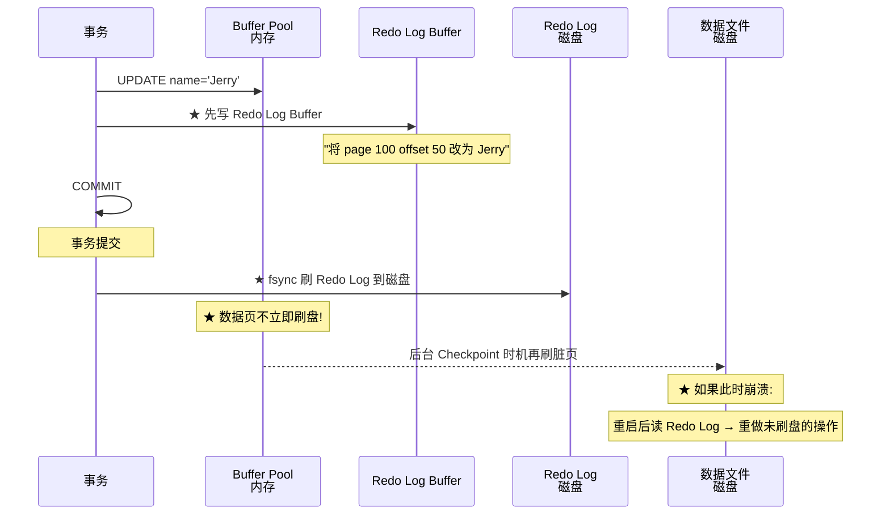

**WAL (Write-Ahead Logging) 核心思想**：修改数据前先写日志。顺序写 Redo Log 比随机写数据页快 100 倍。

### 6.3 两阶段提交

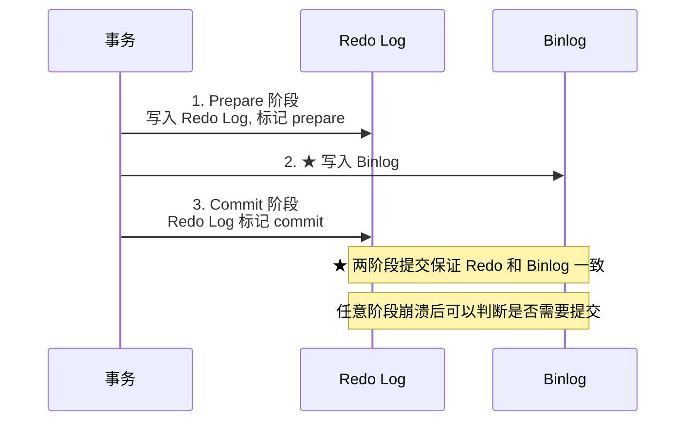

**为什么需要两阶段提交？**

```
场景1: Redo 写了但 Binlog 没写 → 主从数据不一致!
场景2: Binlog 写了但 Redo 没 commit → 同上!

两阶段提交解决:
  崩溃时检查: Redo 中有 prepare 标记 + Binlog 完整 → 提交
              Redo 中有 prepare 标记 + Binlog 不完整 → 回滚
```

### 6.4 日志对比

| 维度 | Redo Log | Undo Log | Binlog |
|------|----------|----------|--------|
| 所属层 | InnoDB | InnoDB | **Server 层** |
| 记录内容 | 物理: 页的修改 | 逻辑: 行修改前的值 | 逻辑: SQL 语句 |
| 存储方式 | 循环写, 固定大小 | 随机写, Undo 表空间 | 追加写, 无限增长 |
| 作用 | **Crash Recovery** | **回滚 + MVCC** | **主从复制 + 数据恢复** |
| 刷盘时机 | 事务提交时 | 事务开始时 | 事务提交时 |

---

## 7. SQL 执行全链路

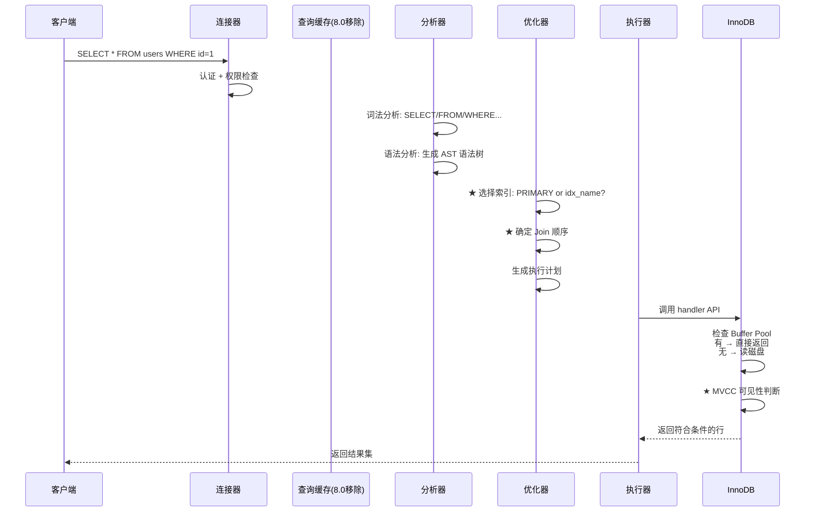

---

## 8. SQL 优化实战

### 8.1 索引优化 Checklist

```sql
-- 1. ★ 最左前缀原则检查
-- 索引: (a, b, c)
SELECT * FROM t WHERE a = 1;              -- ✅ 用索引
SELECT * FROM t WHERE a = 1 AND b = 2;    -- ✅ 用索引
SELECT * FROM t WHERE b = 2 AND c = 3;    -- ❌ 跳过 a, 索引失效!
SELECT * FROM t WHERE a = 1 AND c = 3;    -- ⚠️ 只用 a 列, c 不生效

-- 2. ★ 不等操作符的位置决定范围查询生效范围
-- 索引: (a, b, c)
SELECT * FROM t WHERE a = 1 AND b > 2 AND c = 3;
-- ✅ a=1 精确, b>2 范围, c=3 索引失效(范围后的列不再使用)

-- 3. LIKE 以通配符开头 → 索引失效
SELECT * FROM t WHERE name LIKE '%Tom';    -- ❌
SELECT * FROM t WHERE name LIKE 'Tom%';    -- ✅

-- 4. OR → 两边都要有索引
SELECT * FROM t WHERE a = 1 OR b = 2;
-- ⚠️ a 有索引 b 无索引 → 全表扫描!
```

### 8.2 Join 优化

```sql
-- ★ Join Buffer (Block Nested-Loop) 原理
-- 驱动表 t1 (小表), 被驱动表 t2 (大表)
SELECT * FROM t1 JOIN t2 ON t1.id = t2.t1_id;

-- 优化策略:
-- 1. ★ 小表驱动大表: t1 尽量小
-- 2. ★ 被驱动表关联字段必须有索引: CREATE INDEX idx_t2_t1_id ON t2(t1_id)
-- 3. 避免 SELECT *: 需要的数据列越少 → Join Buffer 能装更多行

-- ★ MySQL 8.0 的 Hash Join (等值连接)
-- 不再用 BNL, 而是对驱动表建 Hash Table
```

### 8.3 分页优化

```sql
-- ❌ 慢: 大偏移量全表扫描
SELECT * FROM users ORDER BY id LIMIT 1000000, 20;
-- 扫描 1000020 行, 丢弃 1000000 行!

-- ✅ 方案1: 基于主键的延迟关联
SELECT * FROM users
WHERE id >= (SELECT id FROM users ORDER BY id LIMIT 1000000, 1)
ORDER BY id LIMIT 20;

-- ✅ 方案2: 游标分页 (适合连续翻页)
SELECT * FROM users WHERE id > 1000000 ORDER BY id LIMIT 20;
-- 前端记录 last_id, 下一页传 last_id
```

### 8.4 count() 优化

```sql
-- ★ count(*)  ≠  count(1)  ≠  count(column)
-- InnoDB 下 count(*) 和 count(1) 性能几乎相同 (MySQL 8.0 优化后)
-- count(column) 不统计 NULL

-- ★ 大表 count 优化:
-- 方案1: 用 EXPLAIN 估算
EXPLAIN SELECT COUNT(*) FROM users;  -- rows 就是近似值

-- 方案2: 单独维护计数表
-- 每次 INSERT → count+1, DELETE → count-1
```

---

## 9. 慢查询与 Explain 详解

### 9.1 开启慢查询

```sql
-- 查看慢查询配置
SHOW VARIABLES LIKE 'slow_query%';
SHOW VARIABLES LIKE 'long_query_time';

-- 开启
SET GLOBAL slow_query_log = ON;
SET GLOBAL long_query_time = 1;       -- > 1 秒的查询记录
SET GLOBAL log_queries_not_using_indexes = ON;  -- 记录未使用索引的查询

-- ★ 生产推荐: 
SET GLOBAL long_query_time = 0.1;     -- > 100ms 就记录
```

### 9.2 Explain 字段全解

```sql
EXPLAIN SELECT * FROM users u
JOIN orders o ON u.id = o.user_id
WHERE u.status = 'ACTIVE' AND o.amount > 100;
```

| 字段 | 含义 | 关注点 |
|------|------|--------|
| **id** | 执行顺序 | id 越大越先执行 |
| **select_type** | 查询类型 | SIMPLE/PRIMARY/SUBQUERY/DERIVED |
| **type** | ★ 访问类型 | **最重点!** |
| **key** | ★ 实际使用的索引 | NULL = 全表扫描 |
| **rows** | ★ 预估扫描行数 | 越小越好 |
| **Extra** | 额外信息 | Using filesort/Using temporary = ⚠️ |

**type 从好到差**：

```
NULL > system > const > eq_ref > ref > range > index > ALL
                                     ★               ★
                                  目标级别         必须避免
```

```sql
-- const: 主键等值查询 (最快)
EXPLAIN SELECT * FROM users WHERE id = 1;           -- type=const ★

-- eq_ref: Join 时用主键/唯一索引关联
EXPLAIN SELECT * FROM u JOIN o ON o.id = u.id;      -- type=eq_ref ★

-- ref: 非唯一索引等值查询
EXPLAIN SELECT * FROM users WHERE name = 'Tom';     -- type=ref ★

-- range: 索引范围扫描
EXPLAIN SELECT * FROM users WHERE id > 100;          -- type=range

-- index: 全索引扫描 (比 ALL 好, 但比 ref 差)
EXPLAIN SELECT id FROM users;                        -- type=index

-- ALL: 全表扫描 (★ 必须优化!)
EXPLAIN SELECT * FROM users WHERE status = 'NEW';    -- type=ALL ❌
```

**Extra 关键值**：

| 值 | 含义 | 对策 |
|----|------|------|
| `Using index` | ★ 覆盖索引，最优 | 不需要改 |
| `Using where` | 正常 | 正常过滤 |
| `Using filesort` | ⚠️ 额外排序，需要优化 | 加索引覆盖 ORDER BY |
| `Using temporary` | ⚠️ 临时表，需要优化 | 加索引规避临时表 |
| `Using index condition` | 索引下推 ICP | 正常优化 |

---

## 10. 数据库设计原则

### 10.1 范式与反范式

| 范式 | 要求 | 优点 | 缺点 |
|------|------|------|------|
| **1NF** | 列不可再分 | 数据原子性 | 冗余 |
| **2NF** | 消除部分函数依赖 | 减少冗余 | 需要 Join |
| **3NF** | 消除传递函数依赖 | 更新无异常 | Join 更多 |
| **反范式** | 适当冗余加速查询 | 减少 Join | 更新需维护 |

```sql
-- ★ 实际项目中: 3NF 保证更新正确, 反范式(冗余)保证查询速度
-- 订单表通常保留当时的价格(冗余), 而不是 Join 去查历史价格
CREATE TABLE orders (
    id BIGINT PRIMARY KEY,
    product_name VARCHAR(200),   -- ★ 冗余! 但查询时不用 Join
    product_price DECIMAL(10,2), -- ★ 冗余当时价格
    created_at DATETIME
);
```

### 10.2 字段类型选择

| 场景 | 推荐 | 避免 |
|------|------|------|
| 主键/Join列 | `BIGINT` | `VARCHAR` (慢) |
| 状态字段 | `TINYINT` + 注释 | `VARCHAR` |
| 金额 | `DECIMAL(18,2)` | `FLOAT` (精度丢失) |
| 时间 | `DATETIME(3)` | `TIMESTAMP` (2038 问题) |
| 大文本 | `TEXT` + 独立存储 | 与其他列一起 |
| IP 地址 | `INT UNSIGNED` + `INET_ATON()` | `VARCHAR(15)` |
| 布尔值 | `TINYINT(1)` | `ENUM` (扩展难) |

### 10.3 索引设计原则

```
1. ★ 必然要建:
   - WHERE 条件列
   - JOIN 关联列
   - ORDER BY / GROUP BY 列

2. ★ 不要建:
   - 区分度低的列 (性别: 只有 M/F → 索引无意义)
   - 频繁更新的列 (索引维护开销)
   - 长字符串 (可用前缀索引)

3. ★ 联合索引 vs 单列索引:
   - 如果有 a=1 AND b=2 和 只有 a=1 的查询:
     建 (a,b) 联合索引, 不要分别建 idx_a 和 idx_b
     (a,b) 能同时满足 a 单列和 a+b 组合
```

---

## 11. 主从复制与读写分离

### 11.1 复制原理

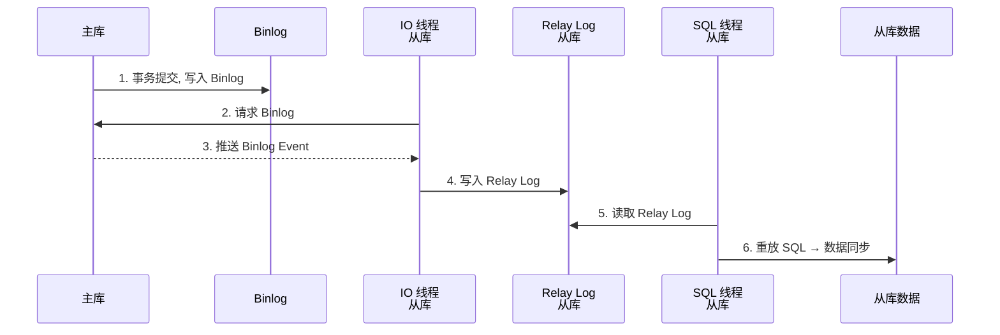

### 11.2 复制延迟原因与应对

```sql
-- 查看延迟:
SHOW SLAVE STATUS\G
-- Seconds_Behind_Master: 延迟秒数

-- 延迟原因:
-- 1. 从库 SQL 线程单线程 (MySQL 5.6-) → 升级到 5.7+ MTS 并行复制
-- 2. 主库大事务 → 拆分小事务
-- 3. 从库硬件差 → 升级从库

-- 应对延迟:
-- ★ 写后立刻读 → 强制走主库
-- ★ 业务可容忍延迟 → 走从库
```

---

## 12. 分库分表

### 12.1 分片策略

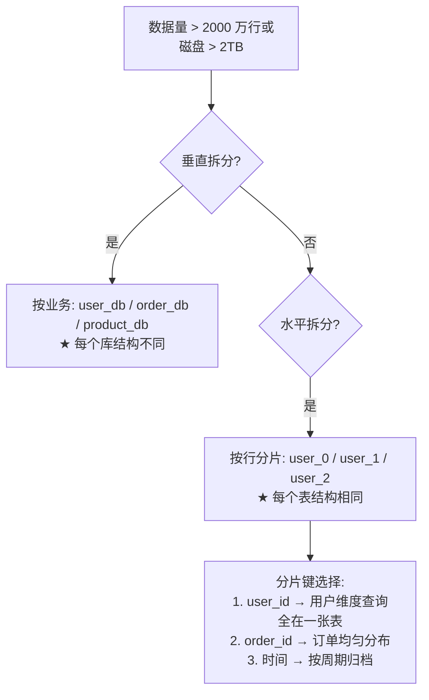

### 12.2 分片后的问题

| 问题 | 解决方案 |
|------|----------|
| 全局唯一 ID | **Snowflake** / 号段模式 / Redis 自增 |
| 跨分片 Join | 应用层聚合 / 冗余数据 / 全局表 |
| 跨分片事务 | **Seata AT/TCC** / 最终一致性 |
| 扩容 | 一致性 Hash / 双写迁移 |
| 分片键选择 | 选最常用的查询维度 |

---

## 13. 面试真题与陷阱

### 13.1 高频真题

**Q1: InnoDB 为什么用 B+Tree 而不用 B-Tree？**

B+Tree 的数据只存叶子层，非叶子节点存更多索引 → 树高度更低 → 磁盘 IO 更少。且叶子层有双向链表 → 范围查询不需要回到非叶子节点。

**Q2: 什么是回表？怎么避免？**

二级索引叶子存的是主键值，找到主键后还需到聚簇索引查完整行 = 回表。避免：用覆盖索引使 SELECT 的列都在索引中。

**Q3: MVCC 如何实现可重复读？**

RR 级别在事务开始创建 ReadView，后续读用同一个 ReadView 判断可见性，看不到其他事务提交的修改。

**Q4: Next-Key Lock 如何解决幻读？**

`Record Lock + Gap Lock` 既锁记录又锁间隙，阻止其他事务插入满足条件的行。

**Q5: count(*) 怎么优化？**

InnoDB 下不存在 count 缓存（MVCC 每个事务看到的数据不同）。优化：用 EXPLAIN 估算或单独维护计数表。

### 13.2 常见陷阱

```sql
-- 陷阱1: 索引失效 — 隐式类型转换
CREATE INDEX idx_phone ON users(phone);  -- phone 是 VARCHAR

SELECT * FROM users WHERE phone = 13800138000;   -- ❌ 全表扫描!
SELECT * FROM users WHERE phone = '13800138000'; -- ✅ 走索引

-- 陷阱2: 事务中混用存储引擎
START TRANSACTION;
INSERT INTO innodb_table VALUES (1);   -- 事务生效
INSERT INTO myisam_table VALUES (1);   -- ★ 自动提交! MyISAM 不支持事务
ROLLBACK;  -- innodb 回滚, myisam 的数据已提交!

-- 陷阱3: 长事务不提交
START TRANSACTION;
UPDATE users SET status = 'DONE' WHERE id = 1;
-- ... 长时间不提交 ... 
-- ★ Undo Log 无法回收 → 历史版本链暴涨 → 查询变慢
```

---

*全文 17 章，基于 MySQL 8.0 / InnoDB 编写。*

---

## 14. InnoDB 进阶机制

### 14.1 Double Write Buffer — 部分写失效的最后防线

InnoDB 页是 16KB，但磁盘扇区通常是 512B 或 4KB。如果一个 16KB 页的写入只完成了一半就断电——这个页就被"写花"了。**Redo Log 恢复不了这种情况**（Redo 记录的是"page 100 改成 Jerry"的物理操作，但如果 page 100 本身已损坏，重做也没用）。

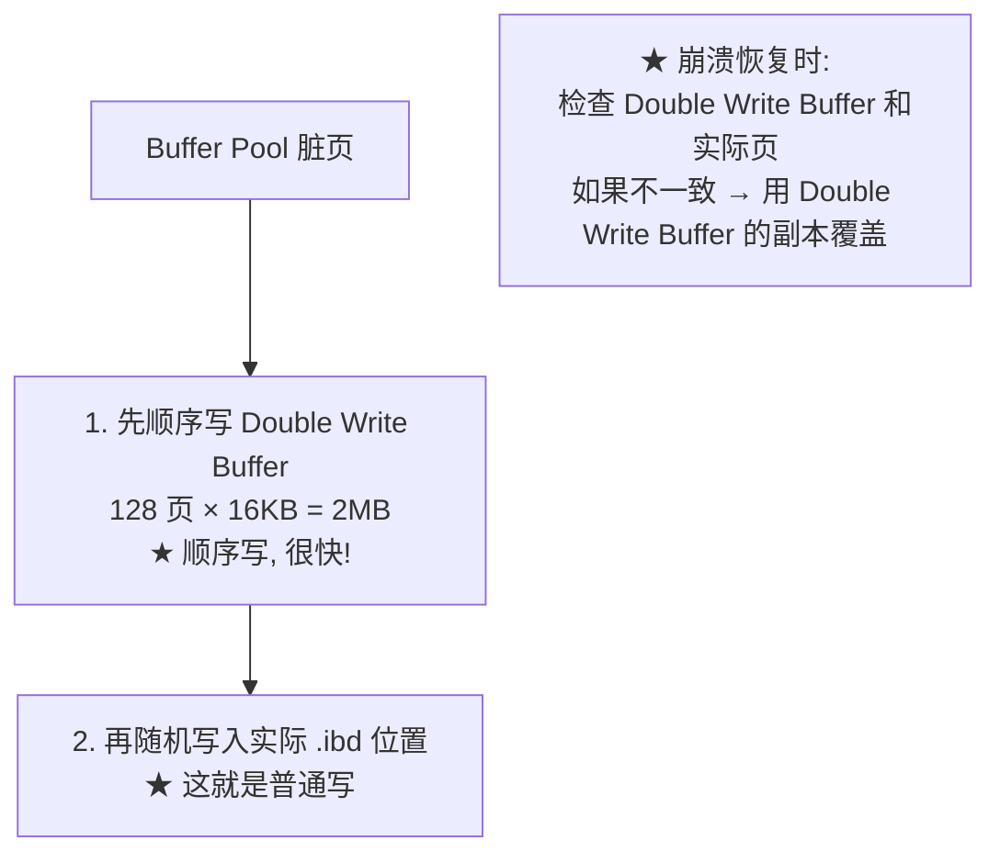

```sql
-- 查看 Double Write 状态
SHOW GLOBAL STATUS LIKE '%dblwr%';
-- Innodb_dblwr_pages_written: double write 写入的页数
-- Innodb_dblwr_writes: double write 操作次数
```

### 14.2 Change Buffer — 写缓存的加速器

当修改二级索引页时，如果该页**不在 Buffer Pool 中**，InnoDB 不会立刻读磁盘获取该页，而是把修改操作缓存在 Change Buffer 中。该页被读取时，再把 Change Buffer 中的修改合并（merge）到页中。

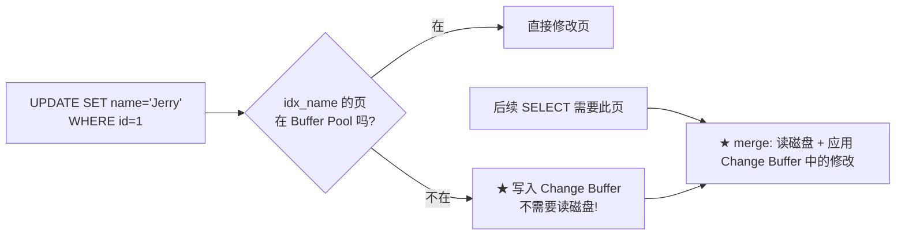

```sql
-- Change Buffer 生效条件:
-- 1. ★ 只对非唯一二级索引生效
--    (唯一索引需要检查唯一性 → 必须读磁盘)
-- 2. 页不在 Buffer Pool 中
-- 3. 写多读少的场景收益最大

-- 查看 Change Buffer 状态
SHOW ENGINE INNODB STATUS\G
-- INSERT BUFFER AND ADAPTIVE HASH INDEX 部分
```

### 14.3 Buffer Pool 三大链表

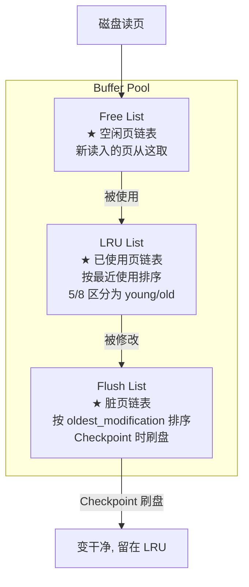

```sql
-- Buffer Pool 调优
-- innodb_buffer_pool_size: 总大小 (推荐物理内存 50-80%)
-- innodb_buffer_pool_instances: 拆成多个实例减少竞争 (≥4)
-- innodb_old_blocks_pct: LRU 中 old 区比例 (默认 37%)
-- innodb_old_blocks_time: 进入 old 区后 1 秒内被访问不算"热", 不移入 young

-- innodb_buffer_pool_size = 8G, innodb_buffer_pool_instances = 8
-- → 每个实例 1G, 减少 Buffer Pool mutex 竞争
```

### 14.4 Adaptive Hash Index — B+Tree 上的自动哈希

InnoDB 会监控 B+Tree 的查询模式。如果某个索引被**等值查询频繁访问**，自动为该索引页构建哈希表——把 B+Tree 的 O(log n) 降为 O(1)。

```sql
-- 自动生效, 无需配置
-- 条件: 等值查询频繁, 且查询模式稳定

-- 查看 AHI 状态
SHOW ENGINE INNODB STATUS\G
-- 找到 "INSERT BUFFER AND ADAPTIVE HASH INDEX"
-- Hash table size: 34679, node heap: 2330 buffer(s)

-- ★ 关闭(极少需要, 除非遇到 AHI 锁竞争):
-- SET GLOBAL innodb_adaptive_hash_index = OFF;
```

### 14.5 Purge 线程 — MVCC 的"保洁员"

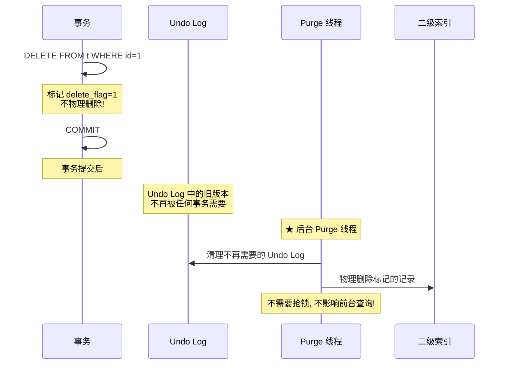

```sql
-- ★ 长事务的危害:
-- 事务 A 一直不提交 → ReadView 一直持有 → 
-- Purge 线程无法清理此 ReadView 之后的 Undo Log →
-- Undo 表空间无限膨胀 → 查询遍历长版本链 → 变慢!

-- 监控:
SELECT trx_id, trx_started, TIMESTAMPDIFF(SECOND, trx_started, NOW()) AS sec
FROM information_schema.innodb_trx
WHERE TIMESTAMPDIFF(SECOND, trx_started, NOW()) > 60;
-- ★ 超过 60 秒未提交的事务 → 告警!
```

---

## 15. MySQL 8.0 关键新特性

| 特性 | 8.0 之前 | 8.0 | 收益 |
|------|---------|-----|------|
| **Hash Join** | 仅 BNL | ★ `t1 JOIN t2 ON t1.a=t2.b` 用 Hash Join | 等值 Join 快 10x |
| **降序索引** | 忽略 DESC, 排序需 filesort | ★ `INDEX idx(a ASC, b DESC)` 真正生效 | 避免 filesort |
| **不可见索引** | 只能删除索引测试 | ★ `ALTER INDEX idx INVISIBLE` | 安全测试索引效果 |
| **直方图统计** | 仅基数统计 | ★ `ANALYZE TABLE t UPDATE HISTOGRAM` | 优化器选择更精准 |
| **原子 DDL** | `TRUNCATE` 半路崩溃 → 表损坏 | ★ 原子化, 要么全成功要么全回滚 | 崩溃安全 |
| **NOWAIT / SKIP LOCKED** | 锁等待只能阻塞 | ★ `SELECT ... FOR UPDATE NOWAIT` | 秒杀/抢购场景 |
| **窗口函数** | 靠子查询自 Join | ★ `ROW_NUMBER() OVER(PARTITION BY dept ORDER BY salary DESC)` | 复杂分析一行 SQL |
| **JSON_TABLE** | JSON 只能简单查询 | ★ 将 JSON 数组转为关系表 | 与 SQL 无缝互操作 |
| **角色管理** | 无 | ★ `CREATE ROLE / GRANT ROLE` | 权限管理更灵活 |

```sql
-- 降序索引示例
CREATE INDEX idx_created_desc ON orders(created_at DESC);

-- 不可见索引: 测试删除索引的影响
ALTER INDEX idx_name INVISIBLE;
-- 观察性能... 如果 OK:
ALTER INDEX idx_name VISIBLE;  -- 恢复, 或 DROP INDEX

-- 窗口函数: 每个部门工资排名
SELECT dept, name, salary,
       ROW_NUMBER() OVER(PARTITION BY dept ORDER BY salary DESC) AS rnk
FROM employees;

-- NOWAIT: 秒杀不下单
SELECT stock FROM products WHERE id = 100 FOR UPDATE NOWAIT;
-- 如果被锁 → 立即报错, 不用等!
```

---

## 16. 设计哲学与权衡

### 16.1 为什么选择 B+Tree 作为默认索引？

```
磁盘的特性决定了数据库索引的选择:
  - 顺序读写: 100MB/s
  - 随机读写: 1MB/s  ← ★ 100 倍差距!

B+Tree 的优势:
  1. 高度极低 (3层 ≈ 2000万行) → 磁盘IO次数少
  2. 叶子层双向链表 → 范围查询只需要一次定位 + 顺序遍历
  3. 非叶子节点只存 key → 一个页能存更多索引项 → 树更矮

对比:
  - 哈希: O(1) 但范围查询要全表 → 数据库查询 90% 是范围
  - 红黑树: O(log n) 但高度大 → 100万行需要20层 → 20次随机IO ❌
```

### 16.2 为什么选择 MVCC 而不是简单的读写锁？

```
方案 A: 读写锁
  - 读锁: 查询时加 S 锁 → 其他事务不能写 → 并发差
  - 写锁: 修改时加 X 锁 → 其他事务不能读写 → 吞吐量低

方案 B: MVCC (InnoDB的选择)
  - 读: 基于快照版本, ★ 不需要加锁 → 写不阻塞读
  - 写: 创建新版本, 旧版本保留给正在读的事务
  - 代价: 需要 Undo Log 存储旧版本 → 空间换并发
  - 收益: 读并发提升 100x+
```

### 16.3 为什么需要 WAL（Write-Ahead Logging）？

```
问题: 修改一个页需要:
  1. 读磁盘 (随机IO, 慢)
  2. 修改内存
  3. 写回磁盘 (随机IO, 慢)

WAL 的思路:
  1. 修改内存 (快)
  2. 写 Redo Log (顺序IO, ★ 100x 快!)
  3. 返回"事务已提交"
  4. 后台慢慢将脏页刷回磁盘 (不阻塞事务)

关键洞察: 顺序写 100 倍于随机写
  Redo Log 是顺序写 → 事务提交很快
  数据文件是随机写 → 后台慢慢做
```

### 16.4 为什么 MySQL 8.0 移除查询缓存？

```
问题: 查询缓存失效太频繁!
  - 表上任何修改 → 整表缓存全部失效
  - 高并发写入的表 → 缓存命中率几乎为 0
  - 缓存锁竞争 → MySQL 5.7 默认禁用

替代方案:
  - 应用层缓存 (Redis)
  - 更精细的控制粒度
  - 对只读表/配置表仍有价值 → 用 Redis 替代
```

### 16.5 为什么两阶段提交？

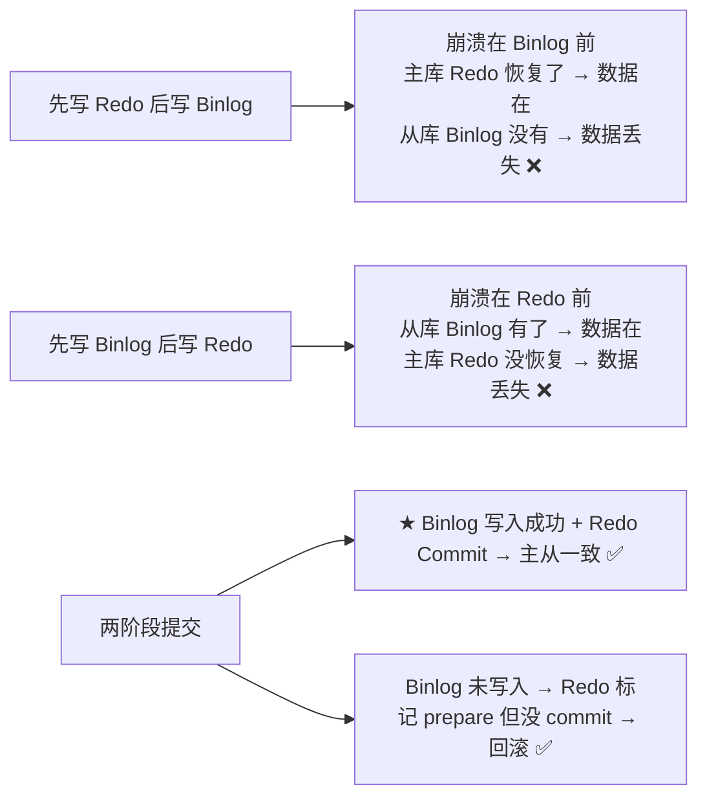

### 16.6 设计决策速查

| 决策 | 原因 | 代价 |
|------|------|------|
| B+Tree | 减少磁盘 IO + 范围查询快 | 插入可能页分裂 |
| MVCC | 读写不互斥, 高并发 | Undo Log 空间开销 |
| WAL | 顺序写快 100x | Redo Log 大小需合理配置 |
| 两阶段提交 | 主从一致性 | 多一次 fsync |
| 移除查询缓存 | 高并发写入时缓存失效严重 | 丢失简单场景的加速 |
| Double Write | 防止部分写失效 | 每次写多写一次（但顺序写, 开销小） |

---

## 17. 实战案例

### 案例 1: 慢查询优化 — 从 5 秒到 3 毫秒

```sql
-- 原 SQL (5秒)
SELECT * FROM orders
WHERE YEAR(created_at) = 2024 AND status = 'PAID'
ORDER BY amount DESC LIMIT 20;

-- Explain 输出:
-- type: ALL, rows: 5000000, Extra: Using where; Using filesort

-- ★ 问题: YEAR() 导致索引失效 + SELECT * + filesort
-- 优化:
-- 1. 建联合索引
CREATE INDEX idx_created_status_amount ON orders(created_at, status, amount);

-- 2. 改 SQL
SELECT id, order_no, amount, created_at FROM orders
WHERE created_at >= '2024-01-01' AND created_at < '2025-01-01'
  AND status = 'PAID'
ORDER BY amount DESC LIMIT 20;

-- 重新 Explain:
-- type: range, rows: 25000, Extra: Using index condition
-- 执行时间: 3ms ← ★ 快 1600x!
```

### 案例 2: 长事务导致的性能雪崩

```sql
-- 现象: 应用响应突然从 10ms 飙升到 2s, QPS 骤降

-- 排查:
-- 1. 查看当前事务
SELECT * FROM information_schema.innodb_trx\G
-- 发现一个事务运行了 3600 秒! (1小时前开始的)

-- 2. 查看锁等待
SELECT * FROM performance_schema.data_lock_waits;

-- ★ 根因: 定时任务开了事务忘记提交
-- START TRANSACTION; ...大批量操作... -- 忘了 COMMIT!

-- 3. Kill 长事务
SELECT CONCAT('KILL ', trx_mysql_thread_id, ';')
FROM information_schema.innodb_trx
WHERE TIMESTAMPDIFF(SECOND, trx_started, NOW()) > 300;

-- ★ 预防:
-- innodb_trx: 监控长事务 > 60 秒 → 告警
-- 代码规范: @Transactional 方法不要做 IO/网络调用
```

### 案例 3: Join 从 30 秒到 50 毫秒

```sql
-- 原 SQL (30秒)
SELECT u.name, COUNT(o.id)
FROM users u LEFT JOIN orders o ON u.id = o.user_id
GROUP BY u.id;

-- Explain:
-- users: 10万行, orders: 500万行
-- Using join buffer (Block Nested Loop)  ← ★ 没走索引!

-- 排查: orders.user_id 没索引!
CREATE INDEX idx_orders_user_id ON orders(user_id);

-- 重新 Explain:
-- users: type=index (全索引扫描, 可接受)
-- orders: type=ref, key=idx_orders_user_id  ← ★ 走索引了!
-- 执行时间: 50ms ← ★ 快 600x!
```

### 案例 4: 分页优化

```sql
-- 场景: 后台管理系统, 按创建时间倒序翻页, 共 500 万行

-- ❌ 第 1000 页 (5秒)
SELECT * FROM orders ORDER BY created_at DESC LIMIT 10000, 20;

-- ✅ 方案 1: 游标分页 (10ms)
-- 第 1 页: SELECT * FROM orders ORDER BY created_at DESC, id DESC LIMIT 20;
-- 前端记录最后一条: created_at='2024-01-15 10:00:00', id=1000
-- 第 2 页: 
SELECT * FROM orders 
WHERE (created_at, id) < ('2024-01-15 10:00:00', 1000)
ORDER BY created_at DESC, id DESC LIMIT 20;
-- ★ 需要联合索引: INDEX idx_created_id(created_at, id)
```


