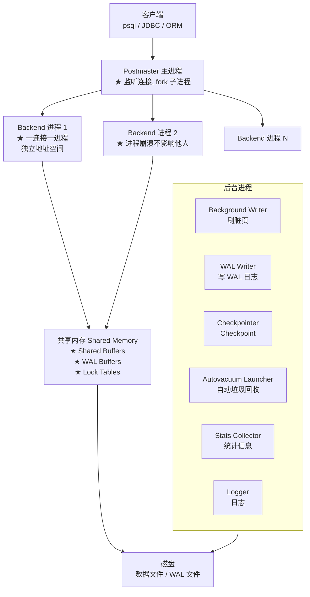
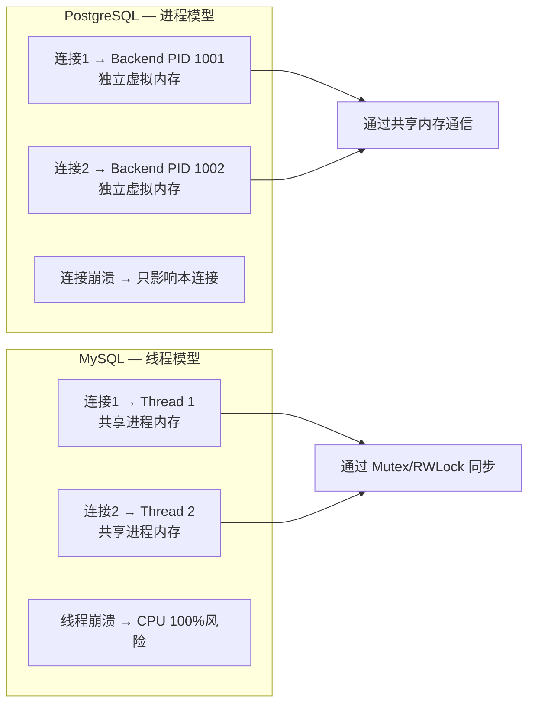
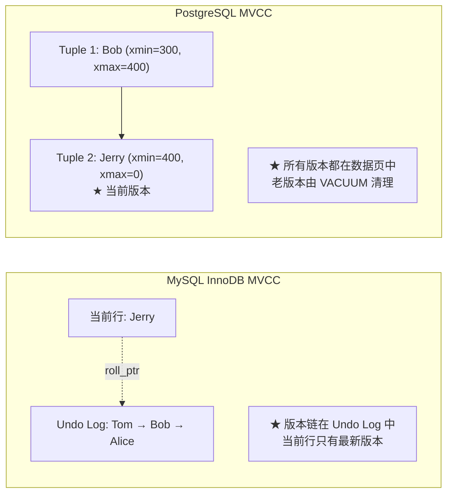
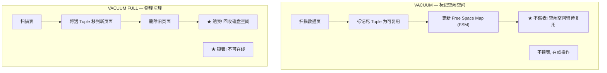
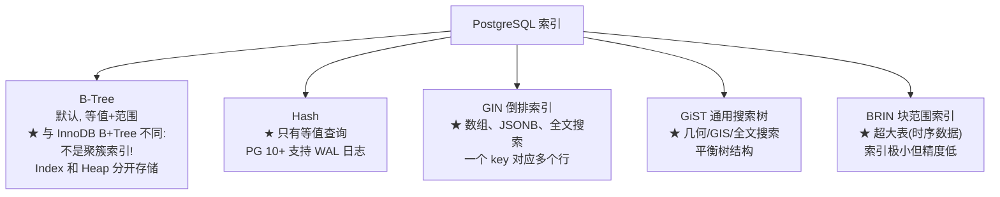
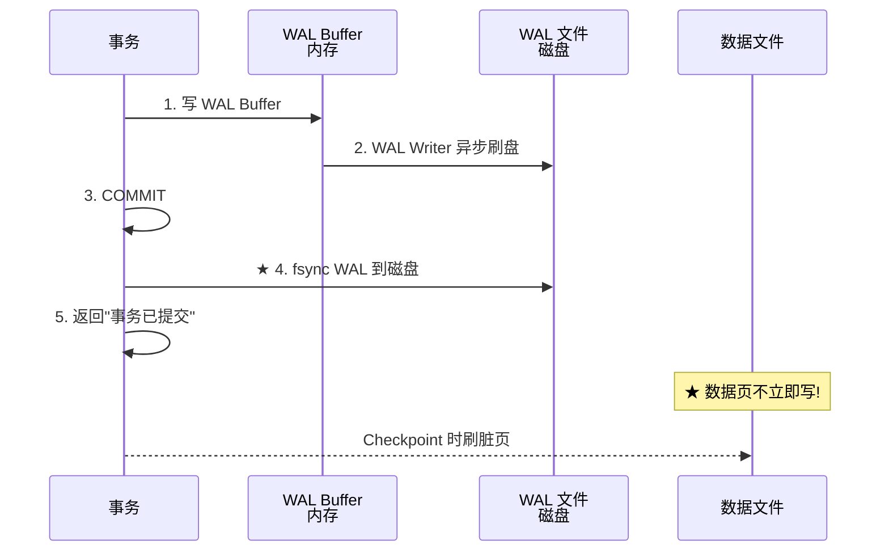
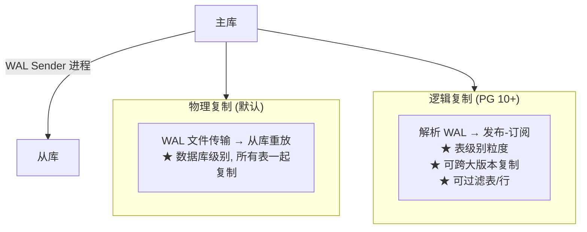

# PostgreSQL 源码深度解析

> **进程模型多版本并发**：与 MySQL 截然不同的设计哲学——MVCC 无 Undo Log、VACUUM 垃圾回收、四种索引类型、最严谨的 SQL 标准支持。

---

## 目录

- [1. PostgreSQL 架构全景](#1-postgresql-架构全景)
- [2. 进程模型 vs MySQL 线程模型](#2-进程模型-vs-mysql-线程模型)
- [3. 存储引擎与页结构](#3-存储引擎与页结构)
- [4. MVCC 多版本并发控制](#4-mvcc-多版本并发控制)
- [5. VACUUM 垃圾回收](#5-vacuum-垃圾回收)
- [6. 四种索引类型](#6-四种索引类型)
- [7. WAL 预写日志](#7-wal-预写日志)
- [8. 查询优化器](#8-查询优化器)
- [9. 扩展生态](#9-扩展生态)
- [10. 主从复制](#10-主从复制)
- [11. PostgreSQL vs MySQL 全面对比](#11-postgresql-vs-mysql-全面对比)
- [12. 面试真题与实战](#12-面试真题与实战)

---

## 1. PostgreSQL 架构全景



---

## 2. 进程模型 vs MySQL 线程模型



| 维度 | PostgreSQL 进程模型 | MySQL 线程模型 |
|------|-------------------|---------------|
| 内存隔离 | ✅ 强（独立地址空间） | ❌ 弱（共享地址空间） |
| 稳定性 | ✅ 单个连接崩不影响全局 | ⚠️ 线程 bug 可能影响全局 |
| 上下文切换 | ⚠️ 重（进程切换） | ✅ 轻（线程切换） |
| 连接池必要性 | **必须**（PgBouncer） | 建议 |
| 共享内存 | 通过 `mmap` + `shmget` | 进程内直接访问 |
| 适合 CPU | 多核 | 少核 |

```sql
-- PostgreSQL 必须用连接池!
-- 每个连接 fork 一个进程(约 5-10MB), 1000 连接 = 5-10GB 内存

-- 方案1: PgBouncer (轻量级, 推荐)
-- pgbouncer.ini:
-- pool_mode = transaction
-- max_client_conn = 1000
-- default_pool_size = 25

-- 方案2: HikariCP (应用层)
# Spring Boot:
spring.datasource.hikari.maximumPoolSize=25
```

---

## 3. 存储引擎与页结构

### 3.1 PostgreSQL 不支持存储引擎切换

与 MySQL 不同，PostgreSQL **只有一个存储引擎**。它不像 InnoDB/MyISAM 那样可切换——所有特性（事务、MVCC、索引）都是内核原生支持，一个引擎提供所有。

### 3.2 页结构

```
PostgreSQL Page (8KB, 默认):
┌─────────────────────────────┐
│ PageHeaderData     (24B)    │  LSN / 校验和 / 空闲空间指针
│ ItemIdData[]       (变长)   │  ★ 行指针数组 (linp)
│ Free Space         (变长)   │  空闲空间
│ Tuple Data         (变长)   │  ★ 实际数据行 (从页尾向前增长)
│ Special Space      (变长)   │  索引页专用
└─────────────────────────────┘

★ 与 MySQL 的关键区别:
  - ItemIdData 指向 Tuple 的偏移量 (类似数组索引)
  - 空闲空间在中间, 数据和指针从两端向中间增长
  - Tuple 可以跨页 (TOAST: 大对象自动分片)
```

### 3.3 Tuple 结构（数据行）

```
Tuple (元组, 即一行数据):
┌──────────────────────────────────────────────────┐
│ xmin (4B)        │ ★ 创建此版本的事务 ID          │
│ xmax (4B)        │ ★ 删除此版本的事务 ID          │
│ cmin (4B)        │ 命令 ID (事务内部)              │
│ cmax (4B)        │ 命令 ID                         │
│ ctid (6B)        │ ★ (页号, 偏移) — 物理位置       │
│ infomask (2B)    │ 标志位 (是否已提交/是否 HOT 更新)│
│ NULL bitmap      │ NULL 列位图                     │
│ user data        │ 实际列数据                       │
└──────────────────────────────────────────────────┘

★ 关键洞察: 每个 Tuple 自带 xmin 和 xmax!
  不需要像 InnoDB 那样去 Undo Log 找版本 —
  版本信息就在 Tuple 里!
```

---

## 4. MVCC 多版本并发控制

### 4.1 PostgreSQL MVCC vs MySQL InnoDB MVCC



**核心区别**：

| 维度 | MySQL InnoDB | PostgreSQL |
|------|-------------|-----------|
| 版本存储 | 只有最新版本在行中, 旧版本在 **Undo Log** | **所有版本都在数据页中** |
| 版本查找 | 沿 roll_ptr 遍历 Undo Log 链表 | xmin/xmax 直接判断可见性 |
| 旧版本清理 | Purge 线程 | **VACUUM (手动/自动)** |
| 回滚 | Undo Log 回滚 | **直接标记 xmax, 不回滚页面** |
| 优缺点 | 更新快(只改当前行), 旧版本查找慢 | **更新慢(写新 Tuple), 查询快(不需要回链)** |

### 4.2 可见性判断

```sql
-- PostgreSQL 快照 (Snapshot):
-- 每个事务开始时获取当前快照, 包含:
--   xmin: 最早仍活跃的事务 ID
--   xmax: 下一个要分配的事务 ID
--   xip[]: 当前活跃事务 ID 列表

-- 对 Tuple (xmin=100, xmax=200) 的可见性判断:
-- 
-- 1. xmin 对应的事务已提交且 xmin < snapshot.xmin
--    → ✅ 可见 (创建者在快照前已提交)
--
-- 2. xmin 对应的事务在 xip 列表中(仍活跃)
--    → ❌ 不可见 (创建者还没提交)
--
-- 3. xmax 不为 0:
--    a) xmax 在 xip 中 → ✅ 可见 (删除者还没提交, 行未死)
--    b) xmax 不在 xip 中 → ❌ 不可见 (删除者已提交, 行已死)
--
-- 4. xmin 在 xip 中且 xmin = 当前事务
--    → ✅ 可见 (自己创建的)
```

### 4.3 事务隔离级别

| 级别 | PostgreSQL | MySQL |
|------|-----------|-------|
| READ UNCOMMITTED | ❌ **不支持** (等同于 RC) | ✅ |
| READ COMMITTED | ✅ 默认 | ❌ (默认 RR) |
| REPEATABLE READ | ✅ 无幻读 | ⚠️ 部分幻读 |
| SERIALIZABLE | ✅ **SSI 实现, 真正可串行** | ✅ 锁实现 |

```sql
-- PostgreSQL 的 SERIALIZABLE 最特殊:
-- 不是锁, 而是 Serializable Snapshot Isolation (SSI)
-- 检测"读写依赖环" → 如果冲突, 回滚其中一个事务
-- 代价: 可能回滚(应用需处理 retry)

-- 查看当前隔离级别:
SHOW transaction_isolation;  -- 默认 read committed
```

---

## 5. VACUUM 垃圾回收

VACUUM 是 PostgreSQL 特有的**核心维护操作**。因为 PG 的 MVCC 是直接在数据页中保留所有版本，所以需要定期清理"对任何事务都不可见"的旧版本。

### 5.1 VACUUM vs VACUUM FULL



```sql
-- 手动 VACUUM
VACUUM users;                         -- 标记空间, 不锁表
VACUUM FULL users;                    -- ★ 物理整理, 锁表! 谨慎使用!
VACUUM ANALYZE users;                 -- 回收 + 更新统计信息

-- ★ 死 Tuple 比例查询:
SELECT schemaname, relname,
       n_live_tup AS live, n_dead_tup AS dead,
       round(100.0 * n_dead_tup / NULLIF(n_live_tup + n_dead_tup, 0), 2) AS dead_ratio
FROM pg_stat_user_tables
WHERE n_dead_tup > 10000
ORDER BY n_dead_tup DESC;

-- dead_ratio > 20% → 需要 VACUUM
```

### 5.2 Autovacuum — 自动垃圾回收

```sql
-- ★ 默认开启! 不需要手动 VACUUM
SHOW autovacuum;  -- on

-- 触发条件 (两个都满足才触发):
-- 1. 死 Tuple 数 > autovacuum_vacuum_threshold + autovacuum_vacuum_scale_factor * 活行数
--    (默认: 50 + 0.2 * live)
-- 2. 距离上次 VACUUM > autovacuum_naptime (默认 1min)

-- ★ 高频更新表调优:
ALTER TABLE orders SET (
    autovacuum_vacuum_scale_factor = 0.05,   -- 5% 死行就触发 (默认 20%)
    autovacuum_vacuum_threshold = 1000
);

-- Autovacuum 监控:
SELECT relname, last_autovacuum, autovacuum_count, n_dead_tup
FROM pg_stat_user_tables
ORDER BY n_dead_tup DESC;
```

### 5.3 VACUUM FAIL 的后果：事务 ID 回卷

```sql
-- ★ PostgreSQL 的事务 ID 是 32 位 (约 40 亿)
-- 用完会发生 "事务 ID 回卷" → 数据库进入只读模式 → 需要停机维护!

-- 预防: 自动触发 aggressive VACUUM (更频繁, 跳过索引清理豁免)
-- 监控:
SELECT datname, age(datfrozenxid) AS xid_age
FROM pg_database
ORDER BY xid_age DESC;
-- ★ age > 2 亿 → 需要关注!
-- ★ age > 10 亿 → 危险!
```

---

## 6. 四种索引类型



### 6.1 索引速查

| 类型 | 适用 | 大小 | 查询类型 |
|------|------|------|----------|
| **B-Tree** | 通用 (默认) | 中 | `=, >, <, BETWEEN, LIKE 'abc%'` |
| **Hash** | 等值查询 | 小 | `=` |
| **GIN** | `@>`, `?`, `@@` | 大 | 数组包含, JSON键存在, 全文搜索 |
| **GiST** | 几何距离 | 大 | `<<->>`, `@>`, `&&` |
| **BRIN** | 10 亿行时序表 | 极小 | 范围扫描 (精度低) |

```sql
-- GIN: JSONB 查询
CREATE INDEX idx_gin_tags ON products USING GIN (tags);
SELECT * FROM products WHERE tags @> '{"color":"red"}';  -- 包含查询

-- GIN: 全文搜索
CREATE INDEX idx_fts ON articles USING GIN (to_tsvector('english', content));
SELECT * FROM articles WHERE to_tsvector('english', content) @@ to_tsquery('hello & world');

-- BRIN: 10 亿行日志表
CREATE INDEX idx_brin_time ON logs USING BRIN (created_at)
WITH (pages_per_range = 32);  -- 每 32 个页一个摘要
-- 索引只有几十 MB, B-Tree 可能要几百 GB!
```

### 6.2 非聚簇索引 — Secondary Index 直接指向 Heap

```sql
-- ★ 与 MySQL 的关键区别:
-- MySQL: 二级索引 → 聚簇索引 → 数据行 (两次 B+Tree 查找)
-- PostgreSQL: 二级索引 → 直接指向 Heap Tuple (一次 B-Tree 查找)

-- Index Only Scan: 如果所需列都在索引中, 不需要查 Heap
-- 但需要 VACUUM 更新 Visibility Map (标记页中所有 Tuple 都可见)
CREATE INDEX idx_name ON users (name) INCLUDE (email);  -- PG 11+ 覆盖索引

-- 查看索引使用情况:
SELECT schemaname, tablename, indexname,
       idx_scan, idx_tup_read, idx_tup_fetch
FROM pg_stat_user_indexes
ORDER BY idx_scan DESC;
```

---

## 7. WAL 预写日志

### 7.1 WAL 核心流程



### 7.2 WAL 相关参数

```sql
-- WAL 级别 (控制写入量):
-- minimal: 只保证崩溃恢复 (不能做 PITR 和复制)
-- replica: 默认, 支持复制
-- logical: 支持逻辑复制 + 逻辑解码
ALTER SYSTEM SET wal_level = 'replica';

-- WAL 大小
-- max_wal_size = 1GB (默认)
-- min_wal_size = 80MB
-- ★ 大的 max_wal_size → 减少 Checkpoint 频率 → 提升写入性能
-- ★ 但崩溃恢复时间增加 (需要重做更多 WAL)

-- 同步提交:
-- on: 默认, 事务提交 fsync WAL → 最安全, 稍慢
-- off: 事务提交不 fsync → 最快, 可能丢数据
-- remote_write: 主从复制用
ALTER SYSTEM SET synchronous_commit = 'on';
```

---

## 8. 查询优化器

### 8.1 基于成本的优化器 (CBO)

```sql
-- ★ PostgreSQL 的优化器比 MySQL 更强大:
-- 1. 支持遗传算法 (GEQO) 解决多表 Join 顺序组合爆炸
-- 2. 支持自定义统计 (多列依赖统计)
-- 3. 支持并行查询计划 (多个 Worker 同时扫描)

EXPLAIN (ANALYZE, BUFFERS) SELECT * FROM orders WHERE user_id = 100;
```

### 8.2 EXPLAIN 扫描类型

| 类型 | 含义 | 性能 |
|------|------|------|
| **Seq Scan** | 全表扫描 | ❌ |
| **Index Scan** | 索引扫描 + 回 Heap 取数据 | ✅ |
| **Index Only Scan** | 只扫索引, 不回 Heap | ★ 最优 |
| **Bitmap Scan** | 先扫索引建 Bitmap, 再批量回表 | ✅ 大量行时 |
| **Parallel Seq Scan** | 多 Worker 并行扫描 | ✅ |

```sql
-- Index Only Scan 条件:
-- 1. SELECT 的列都在索引中
-- 2. Visibility Map 标记该页所有 Tuple 对当前事务可见
--    (需要 VACUUM 定期更新 Visibility Map!)

-- 强制使用:
SET enable_seqscan = OFF;  -- 临时禁止全表扫描(开发调试用, 生产勿用)
```

---

## 9. 扩展生态

PostgreSQL 最强大的特性之一是**扩展(Extension)**——通过插件系统添加新功能，无需修改内核。

```sql
-- 查看已安装扩展
SELECT * FROM pg_extension;

-- 安装扩展
CREATE EXTENSION IF NOT EXISTS "uuid-ossp";   -- UUID 生成
CREATE EXTENSION IF NOT EXISTS "pg_stat_statements";  -- SQL 统计
```

### 9.1 核心扩展

| 扩展 | 功能 | 为什么重要 |
|------|------|-----------|
| **PostGIS** | 地理空间数据 | ★ PG 最大杀手级应用, 替代 Oracle Spatial |
| **TimescaleDB** | 时序数据 | 自动分区 + 压缩 + 数据保留策略 |
| **pg_stat_statements** | SQL 统计分析 | 找出最耗时的查询 |
| **pg_partman** | 自动分区管理 | 按时间自动创建/删除分区 |
| **pg_cron** | 定时任务 | 数据库内置 Cron |
| **pgAudit** | 审计日志 | 合规审计 |
| **pgvector** | 向量搜索 | AI Embedding 相似度搜索 |
| **Citus** | 分布式数据库 | 水平分片, 并行查询 |

### 9.2 PostGIS 地理查询

```sql
-- 查找 5 公里内的所有餐厅
SELECT name, ST_Distance(location, 'POINT(121.5 31.2)'::geography) AS dist
FROM restaurants
WHERE ST_DWithin(location, 'POINT(121.5 31.2)'::geography, 5000)
ORDER BY dist;
```

---

## 10. 主从复制



```sql
-- 查看复制状态
SELECT * FROM pg_stat_replication;

-- 逻辑复制设置:
-- 主库:
CREATE PUBLICATION my_pub FOR TABLE users, orders;
-- 从库:
CREATE SUBSCRIPTION my_sub CONNECTION 'host=master dbname=mydb' PUBLICATION my_pub;
```

---

## 11. PostgreSQL vs MySQL 全面对比

| 维度 | PostgreSQL | MySQL 8.0 |
|------|-----------|-----------|
| **架构** | 进程模型, 一连接一进程 | 线程模型, 共享进程 |
| **MVCC** | Tuple 多版本 + VACUUM 清理 | Undo Log 版本链 + Purge 线程 |
| **索引** | B-Tree/Hash/GiST/GIN/BRIN | B+Tree/Hash/FullText/Spatial |
| **SQL 标准** | ★ 最接近标准, 窗口函数/CTE/LATERAL | 宽松, 8.0 追赶 |
| **JSON** | JSONB (二进制存储, GIN 索引) | JSON (文本存储, 虚拟列索引) |
| **全文搜索** | 内置, `tsvector` + GIN | 内置, ngram parser |
| **扩展性** | ★ 极强 (PostGIS/TimescaleDB/pgvector) | 弱 (靠 MySQL Shell/Plugin) |
| **连接池** | **必须** PgBouncer | 可选 HikariCP |
| **复制** | 物理 + 逻辑 (发布-订阅) | Binlog 复制 + GTID |
| **数据类型** | ★ 丰富 (Array/Hstore/Enum/Range/UUID) | 较少 |
| **GIS** | PostGIS ★ | 内置简单 GIS |
| **开源协议** | PostgreSQL License (类 MIT) | GPL |
| **维护成本** | 需要关注 VACUUM | 不需要 |

### 选型指南

| 场景 | 推荐 | 原因 |
|------|------|------|
| 地理空间数据 | **PostgreSQL + PostGIS** | PostGIS 是行业标准 |
| JSON 文档存储 | **PostgreSQL JSONB** | GIN 索引 + 二进制存储 |
| 复杂分析查询 | **PostgreSQL** | 优化器更强大, CTE/LATERAL/窗口函数 |
| 高并发简单读写 | **MySQL** | 线程模型更轻量 |
| 时序数据 | **PostgreSQL + TimescaleDB** | 专用时序扩展 |
| 全文搜索 | **PostgreSQL** | 内置功能更强 |
| 标准 SQL 合规 | **PostgreSQL** | 最接近 SQL 标准 |
| 嵌入式/IoT | **MySQL / SQLite** | PG 进程模型太重 |

---

## 12. 面试真题与实战

### Q1: PostgreSQL MVCC 与 MySQL MVCC 的核心区别？

PG 在数据页中保留所有 Tuple 版本，通过 xmin/xmax 判断可见性，用 VACUUM 清理死 Tuple。MySQL 只在行中保留最新版本，旧版本存在 Undo Log 中，通过 roll_ptr 链表查找。

**结果**：PG 查询更快（不需要回链），但写入更慢（要写新 Tuple）且需要维护 VACUUM。

### Q2: VACUUM FULL 和 VACUUM 的区别？

`VACUUM` 只标记死 Tuple 空间为可复用，不缩表，不锁表。`VACUUM FULL` 物理整理并释放磁盘空间，但会**排他锁表**，阻塞所有读写。

### Q3: 为什么 PostgreSQL 需要连接池？

每个连接 fork 一个进程，约 5-10MB 内存。1000 个直连 = 5-10GB 内存。必须用 PgBouncer 等连接池复用后端进程。

### Q4: PostgreSQL 没有聚簇索引，查询性能如何保证？

二级索引直接指向 Heap Tuple 物理位置（ctid），不需要像 MySQL 那样回表到聚簇索引。加上 Index Only Scan + Visibility Map，可以实现比 MySQL 覆盖索引更高的性能。

### Q5: PostgreSQL 适合什么场景不适合什么场景？

**适合**：复杂查询、GIS、JSONB、分析型、时序数据、SQL 合规要求高。
**不适合**：极简 CRUD（进程模型偏重）、需要多存储引擎切换、对 MySQL 生态依赖深的场景。

---

*全文 12 章，基于 PostgreSQL 16 编写。*
