# Spring Boot 源码核心架构与启动流程详解

> **Spring Boot 3.x** 源码深度解析，图文并茂，逐层拆解核心流程。
> 
> 适合读者：熟悉 Spring 基础，想深入理解 Spring Boot 内部机制的开发者。

---

## 目录

### 第一部分：Spring Boot 核心架构
- [1. 总体架构概览](#1-总体架构概览)
- [2. SpringApplication 启动流程](#2-springapplication-启动流程)
- [3. 自动配置机制](#3-自动配置机制)
- [4. 内嵌 Web 服务器](#4-内嵌-web-服务器)
- [5. Bean 生命周期](#5-bean-生命周期)
- [6. 外部化配置加载](#6-外部化配置加载)
- [7. 核心扩展点](#7-核心扩展点)

### 第二部分：Spring Framework 源码深度解析
- [8. IoC 容器核心架构](#8-ioc-容器核心架构)
- [9. 循环依赖与三级缓存](#9-循环依赖与三级缓存)
- [10. AOP 代理机制](#10-aop-代理机制)
- [11. Spring MVC 请求分发](#11-spring-mvc-请求分发)
- [12. 事务管理](#12-事务管理)
- [13. 事件机制](#13-事件机制)
- [14. 启动全链路串联](#14-启动全链路串联)
- [15. 关键扩展点速查](#15-关键扩展点速查)

### 第三部分：Spring 生态深度解析
- [16. Spring Boot Actuator](#16-spring-boot-actuator)
- [17. Spring Data JPA 代理](#17-spring-data-jpa-代理)
- [18. Spring Security 过滤器链](#18-spring-security-过滤器链)
- [19. 自定义 Spring Boot Starter](#19-自定义-spring-boot-starter)
- [20. Spring Boot Test 切片](#20-spring-boot-test-切片)
- [21. 异常处理机制](#21-异常处理机制)
- [22. Spring Cache 抽象](#22-spring-cache-抽象)
- [23. 文档全景导航](#23-文档全景导航)

### 第四部分：实战专家指南
- [24. 设计哲学与架构意图](#24-设计哲学与架构意图)
- [25. 常见坑与反模式](#25-常见坑与反模式)
- [26. 调试与诊断实战](#26-调试与诊断实战)
- [27. 性能优化指南](#27-性能优化指南)
- [28. 最佳实践与选型决策](#28-最佳实践与选型决策)
- [29. Spring Boot 3.x 新特性](#29-spring-boot-3x-新特性)
- [30. Spring Boot 2.x → 3.x 迁移指南](#30-spring-boot-2x--3x-迁移指南)
- [31. 每章速查卡片](#31-每章速查卡片)
- [32. 互动思考题（含参考答案）](#32-互动思考题)

### 第四部分：实战专家指南
- [24. 设计哲学与架构意图](#24-设计哲学与架构意图)
- [25. 常见坑与反模式](#25-常见坑与反模式)
- [26. 调试与诊断实战](#26-调试与诊断实战)
- [27. 性能优化指南](#27-性能优化指南)
- [28. 最佳实践与选型决策](#28-最佳实践与选型决策)
- [29. Spring Boot 3.x 新特性](#29-spring-boot-3x-新特性)
- [30. Spring Boot 2.x → 3.x 迁移指南](#30-spring-boot-2x--3x-迁移指南)
- [31. 每章速查卡片](#31-每章速查卡片)
- [32. 互动思考题（含参考答案）](#32-互动思考题)

### 第五部分：算法与设计模式
- [33. 设计模式在 Spring 中的应用](#33-设计模式在-spring-中的应用)
- [34. 关键算法在 Spring 中的实现](#34-关键算法在-spring-中的实现)
- [35. 设计模式与算法总结速查](#35-设计模式与算法总结速查)

### 第六部分：扩展生态 + 源码索引
- [36. Spring Cloud 服务发现 — Nacos](#36-spring-cloud-服务发现--nacos)
- [37. Spring Cloud 流量治理 — Sentinel](#37-spring-cloud-流量治理--sentinel)
- [38. Spring Cloud Gateway 网关](#38-spring-cloud-gateway-网关)
- [39. MyBatis 源码深度解析](#39-mybatis-源码深度解析)
- [附录：核心类源码直链](#附录核心类源码直链)

- [31. 每章速查卡片](#31-每章速查卡片)
- [32. 互动思考题（含参考答案）](#32-互动思考题)

---

- [39. MyBatis 源码深度解析](#39-mybatis-源码深度解析)


## 0. 阅读导航：按目标选章节

文档很长（35+ 章），不同目标读不同路径：

### 🎯 面试突击（2-3 天）

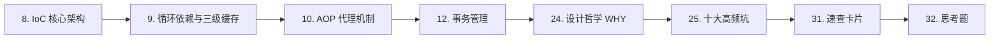

| 顺序 | 章节 | 耗时 | 覆盖面试题 |
|------|------|------|-----------|
| 1 | [8. IoC 容器核心架构](#8-ioc-容器核心架构) | 30min | BeanFactory vs ApplicationContext |
| 2 | [9. 循环依赖与三级缓存](#9-循环依赖与三级缓存) | 30min | ★ 最高频面试题 |
| 3 | [10. AOP 代理机制](#10-aop-代理机制) | 30min | JDK Proxy vs CGLIB |
| 4 | [12. 事务管理](#12-事务管理) | 30min | @Transactional 原理+失效 |
| 5 | [24. 设计哲学与架构意图](#24-设计哲学与架构意图) | 30min | 为什么这样设计？ |
| 6 | [25. 常见坑与反模式](#25-常见坑与反模式) | 20min | 实际踩坑经验 |
| 7 | [31. 每章速查卡片](#31-每章速查卡片) | 10min | 快速过一遍 |
| 8 | [32. 互动思考题](#32-互动思考题) | 20min | 自测 |

### 🏗 架构设计（1 周）

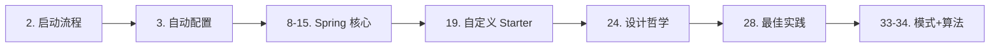

从 [第 2 章](#2-springapplication-启动流程) 开始顺序读第一部分+第二部分，重点看 [24. 设计哲学](#24-设计哲学与架构意图) 和 [33. 设计模式](#33-设计模式在-spring-中的应用)。

### 🔧 故障排查（随时查阅）

| 问题 | 直接跳到 |
|------|----------|
| 启动报错 | [26. 调试与诊断实战](#26-调试与诊断实战) |
| 自动配置不生效 | [26.2 ConditionEvaluationReport](#26-调试与诊断实战) |
| 事务不生效 | [24.3 为什么自调用失效](#24-为什么-transactional-自调用失效) |
| 循环依赖报错 | [9. 循环依赖与三级缓存](#9-循环依赖与三级缓存) |
| 内存/OOM | [27. 性能优化指南](#27-性能优化指南) |
| 迁移 Boot 2→3 | [30. 迁移指南](#30-spring-boot-2x--3x-迁移指南) |

### 📚 完整学习（2-3 周）

按目录顺序：第一部分 → 第二部分 → 第三部分 → 第四部分 → 第五部分 → 第六部分。


## 1. 总体架构概览

Spring Boot 的核心设计哲学是 **"约定优于配置"（Convention over Configuration）**。它在 Spring Framework 之上构建了四个关键层：

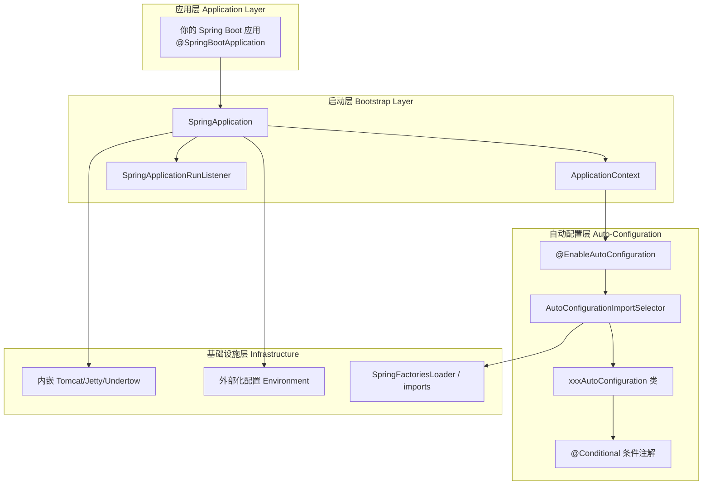

### 核心模块结构

```
spring-boot-project/
├── spring-boot/                          # 核心启动模块
│   └── src/main/java/org/springframework/boot/
│       ├── SpringApplication.java         # 启动入口，整体编排
│       ├── SpringApplicationRunListener   # 启动生命周期监听器
│       ├── ApplicationContextInitializer  # 上下文初始化器
│       ├── ApplicationListener            # 事件监听器
│       ├── web/
│       │   ├── context/                   # Web 上下文实现
│       │   └── server/                    # 内嵌服务器抽象
│       └── env/                           # 环境与配置加载
│
├── spring-boot-autoconfigure/            # 自动配置模块（最重要）
│   └── src/main/java/org/springframework/boot/autoconfigure/
│       ├── AutoConfigurationImportSelector.java  # 自动配置选择器
│       ├── condition/                           # 条件注解实现
│       └── web/servlet/                         # Web MVC 自动配置
│
└── spring-boot-starters/                 # Starter 依赖集合
    ├── spring-boot-starter-web/
    ├── spring-boot-starter-data-jpa/
    └── ...
```

---

## 2. SpringApplication 启动流程

这是 Spring Boot 最核心的流程。整个启动过程被 `SpringApplication.run()` 方法编排为**十个关键阶段**。

### 2.1 完整时序图


### 2.2 阶段详解

#### 阶段 1：SpringApplication 构造

```java
// SpringApplication.java
public SpringApplication(ResourceLoader resourceLoader, Class<?>... primarySources) {
    this.resourceLoader = resourceLoader;
    this.primarySources = new LinkedHashSet<>(Arrays.asList(primarySources));
    
    // ★ 推断应用类型
    this.webApplicationType = WebApplicationType.deduceFromClasspath();
    
    // ★ 加载 BootstrapRegistryInitializer
    this.bootstrapRegistryInitializers = new ArrayList<>(
        getSpringFactoriesInstances(BootstrapRegistryInitializer.class));
    
    // ★ 加载 ApplicationContextInitializer
    setInitializers(getSpringFactoriesInstances(ApplicationContextInitializer.class));
    
    // ★ 加载 ApplicationListener
    setListeners(getSpringFactoriesInstances(ApplicationListener.class));
    
    // ★ 推断 main 方法所在类
    this.mainApplicationClass = deduceMainApplicationClass();
}
```

**应用类型推断（`WebApplicationType.deduceFromClasspath()`）**：

| 类型 | 条件 | ApplicationContext |
|------|------|-------------------|
| `SERVLET` | classpath 存在 `DispatcherServlet` 且无 `DispatcherHandler` | `AnnotationConfigServletWebServerApplicationContext` |
| `REACTIVE` | classpath 存在 `DispatcherHandler` | `AnnotationConfigReactiveWebServerApplicationContext` |
| `NONE` | 两者都不存在 | `AnnotationConfigApplicationContext` |

#### 阶段 6：创建 ApplicationContext

```java
// SpringApplication.java
protected ConfigurableApplicationContext createApplicationContext() {
    return switch (this.webApplicationType) {
        case SERVLET -> new AnnotationConfigServletWebServerApplicationContext();
        case REACTIVE -> new AnnotationConfigReactiveWebServerApplicationContext();
        default -> new AnnotationConfigApplicationContext();
    };
}
```

ApplicationContext 继承体系：

```
AnnotationConfigServletWebServerApplicationContext
└── ServletWebServerApplicationContext
    └── GenericWebApplicationContext
        └── GenericApplicationContext
            └── AbstractApplicationContext  ← refresh() 在这里定义
```

#### 阶段 8：refreshContext() — 最核心的刷新流程

```java
// AbstractApplicationContext.java
public void refresh() throws BeansException, IllegalStateException {
    synchronized (this.startupShutdownMonitor) {
        // 1. 准备刷新：设置状态、校验属性
        prepareRefresh();
        
        // 2. 获取 BeanFactory
        ConfigurableListableBeanFactory beanFactory = obtainFreshBeanFactory();
        
        // 3. 准备 BeanFactory（注册基础组件）
        prepareBeanFactory(beanFactory);
        
        try {
            // 4. BeanFactory 后置处理（留给子类扩展）
            postProcessBeanFactory(beanFactory);
            
            // ★ 5. 调用 BeanFactoryPostProcessor
            //    这里触发 ConfigurationClassPostProcessor
            //    → 处理 @Configuration 类
            //    → @EnableAutoConfiguration → AutoConfigurationImportSelector
            //    → 加载所有自动配置类 → 条件过滤 → 注册 BeanDefinition
            invokeBeanFactoryPostProcessors(beanFactory);
            
            // 6. 注册 BeanPostProcessor
            registerBeanPostProcessors(beanFactory);
            
            // 7. 初始化 MessageSource（国际化）
            initMessageSource();
            
            // 8. 初始化事件广播器
            initApplicationEventMulticaster();
            
            // 9. ★ onRefresh(): 创建内嵌 WebServer
            onRefresh();
            
            // 10. 注册事件监听器
            registerListeners();
            
            // ★ 11. 实例化所有非懒加载的单例 Bean
            finishBeanFactoryInitialization(beanFactory);
            
            // 12. 完成刷新（发布 ContextRefreshedEvent）
            finishRefresh();
        }
        catch (BeansException ex) {
            destroyBeans();
            cancelRefresh(ex);
            throw ex;
        }
    }
}
```

---

## 3. 自动配置机制

自动配置是 Spring Boot 最核心的特性，它让你"开箱即用"零配置即可使用各种组件。

### 3.1 全链路流程图

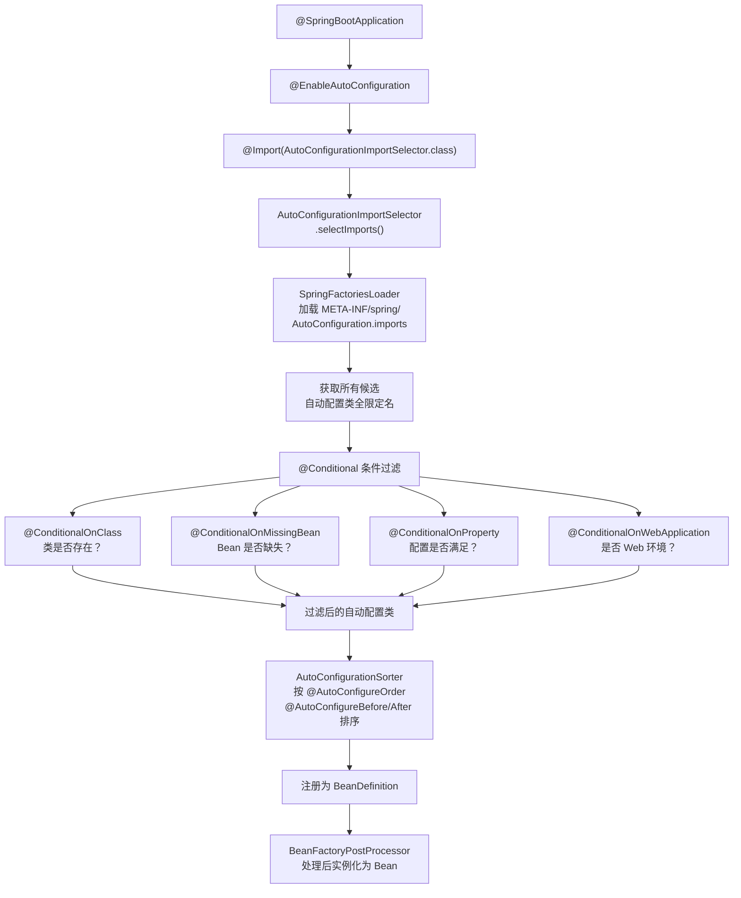

### 3.2 @SpringBootApplication 的组成

```java
@Target(ElementType.TYPE)
@Retention(RetentionPolicy.RUNTIME)
@Documented
@Inherited
@SpringBootConfiguration         // ← 本质是 @Configuration
@EnableAutoConfiguration         // ← 开启自动配置
@ComponentScan(                  // ← 组件扫描
    excludeFilters = {
        @Filter(type = FilterType.CUSTOM, classes = TypeExcludeFilter.class),
        @Filter(type = FilterType.CUSTOM, classes = AutoConfigurationExcludeFilter.class)
    }
)
public @interface SpringBootApplication {
    // 可以排除特定自动配置类
    @AliasFor(annotation = EnableAutoConfiguration.class)
    Class<?>[] exclude() default {};
    
    // 可以排除特定自动配置类名
    @AliasFor(annotation = EnableAutoConfiguration.class)
    String[] excludeName() default {};
}
```

### 3.3 @EnableAutoConfiguration 核心实现

```java
@Target(ElementType.TYPE)
@Retention(RetentionPolicy.RUNTIME)
@Documented
@Inherited
@AutoConfigurationPackage        // 记录主类所在包，用于实体扫描
@Import(AutoConfigurationImportSelector.class)  // ★ 关键：导入选择器
public @interface EnableAutoConfiguration {
    String ENABLED_OVERRIDE_PROPERTY = "spring.boot.enableautoconfiguration";
    Class<?>[] exclude() default {};
    String[] excludeName() default {};
}
```

### 3.4 AutoConfigurationImportSelector 选择逻辑

```java
// AutoConfigurationImportSelector.java
public class AutoConfigurationImportSelector 
    implements DeferredImportSelector, BeanClassLoaderAware, 
               ResourceLoaderAware, BeanFactoryAware, EnvironmentAware {
    
    // 核心方法：选择要导入的自动配置类
    @Override
    public String[] selectImports(AnnotationMetadata annotationMetadata) {
        if (!isEnabled(annotationMetadata)) {
            return NO_IMPORTS;
        }
        
        // ★ 1. 获取所有候选自动配置类
        AutoConfigurationEntry entry = getAutoConfigurationEntry(annotationMetadata);
        return StringUtils.toStringArray(entry.getConfigurations());
    }
    
    protected AutoConfigurationEntry getAutoConfigurationEntry(
            AnnotationMetadata annotationMetadata) {
        
        // 2. 加载所有候选（从 spring.factories 或 imports 文件）
        List<String> configurations = getCandidateConfigurations(annotationMetadata, attributes);
        
        // 3. 去重
        configurations = removeDuplicates(configurations);
        
        // 4. 获取用户排除的配置类
        Set<String> exclusions = getExclusions(annotationMetadata, attributes);
        
        // 5. 应用过滤器（@Conditional 条件检查）
        configurations = filter(configurations, autoConfigurationMetadata);
        
        // 6. 触发 AutoConfigurationImportEvent 事件
        fireAutoConfigurationImportEvents(configurations, exclusions);
        
        return new AutoConfigurationEntry(configurations, exclusions);
    }
}
```

### 3.5 加载候选配置类的两种方式

**Spring Boot 3.x（新方式）**：
```
META-INF/spring/org.springframework.boot.autoconfigure.AutoConfiguration.imports
```
每行一个全限定类名，例如：
```
org.springframework.boot.autoconfigure.web.servlet.WebMvcAutoConfiguration
org.springframework.boot.autoconfigure.jdbc.DataSourceAutoConfiguration
org.springframework.boot.autoconfigure.orm.jpa.HibernateJpaAutoConfiguration
```

**Spring Boot 2.x（旧方式，已废弃）**：
```
META-INF/spring.factories
```
键值对格式：
```
org.springframework.boot.autoconfigure.EnableAutoConfiguration=\
org.springframework.boot.autoconfigure.web.servlet.WebMvcAutoConfiguration,\
org.springframework.boot.autoconfigure.jdbc.DataSourceAutoConfiguration
```

### 3.6 @Conditional 条件注解体系

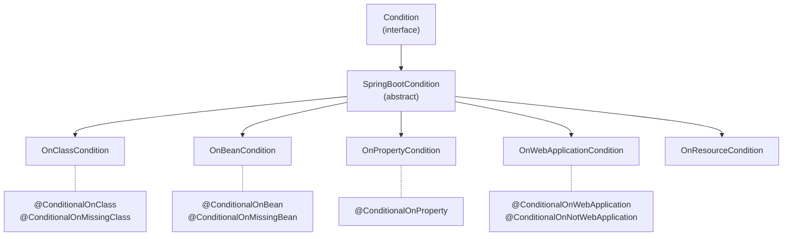

常用条件注解：

| 注解 | 条件 | 典型用途 |
|------|------|----------|
| `@ConditionalOnClass` | classpath 中存在指定类 | `DataSourceAutoConfiguration` 检查是否有数据源驱动 |
| `@ConditionalOnMissingClass` | classpath 中不存在指定类 | 仅在没有某个库时启用备选方案 |
| `@ConditionalOnBean` | 容器中存在指定 Bean | 仅在用户自定义了某 Bean 后才启用 |
| `@ConditionalOnMissingBean` | 容器中不存在指定 Bean | 提供默认实现，用户可覆盖 |
| `@ConditionalOnProperty` | 配置属性满足条件 | `spring.datasource.url` 存在时启用数据源 |
| `@ConditionalOnWebApplication` | 是 Web 应用 | 区分 MVC 和 WebFlux 配置 |
| `@ConditionalOnResource` | 存在指定资源文件 | 检查 classpath 中是否有特定配置文件 |
| `@ConditionalOnExpression` | SpEL 表达式为 true | 复杂条件组合 |
| `@ConditionalOnJava` | Java 版本满足要求 | 根据 JDK 版本启用不同特性 |

### 3.7 自动配置示例：WebMvcAutoConfiguration

```java
@AutoConfiguration(
    after = { 
        DispatcherServletAutoConfiguration.class,
        TaskExecutionAutoConfiguration.class, 
        ValidationAutoConfiguration.class 
    }
)
@ConditionalOnWebApplication(type = Type.SERVLET)  // ★ 仅 Servlet 环境
@ConditionalOnClass({ Servlet.class, DispatcherServlet.class, WebMvcConfigurer.class })
@ConditionalOnMissingBean(WebMvcConfigurationSupport.class)  // ★ 用户自定义优先
@AutoConfigureOrder(Ordered.HIGHEST_PRECEDENCE + 10)
public class WebMvcAutoConfiguration {

    @Configuration(proxyBeanMethods = false)
    @Import(EnableWebMvcConfiguration.class)
    @EnableConfigurationProperties({ WebMvcProperties.class, WebProperties.class })
    @Order(0)
    public static class WebMvcAutoConfigurationAdapter 
            implements WebMvcConfigurer, ServletContextAware {
        
        // 配置视图解析器
        @Bean
        @ConditionalOnMissingBean
        public InternalResourceViewResolver defaultViewResolver() {
            // ...
        }
        
        // 配置静态资源
        @Override
        public void addResourceHandlers(ResourceHandlerRegistry registry) {
            // ...
        }
    }
}
```

---

## 4. 内嵌 Web 服务器

Spring Boot 内嵌了 Tomcat、Jetty、Undertow 三种 Servlet 容器，默认使用 Tomcat。

### 4.1 类层次结构

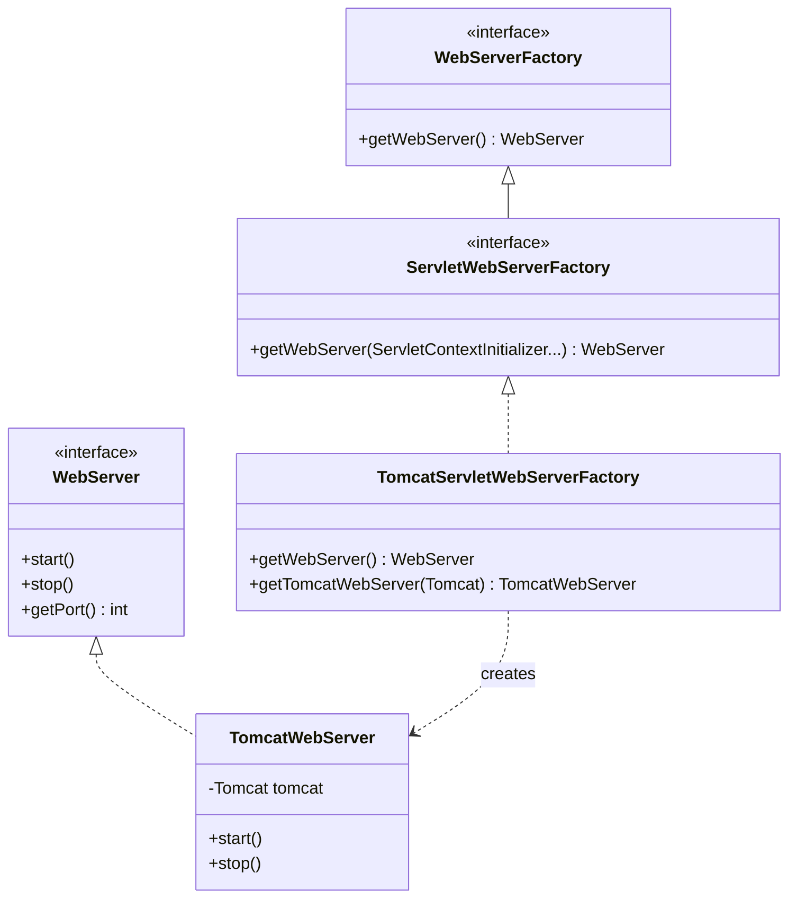

### 4.2 WebServer 创建流程

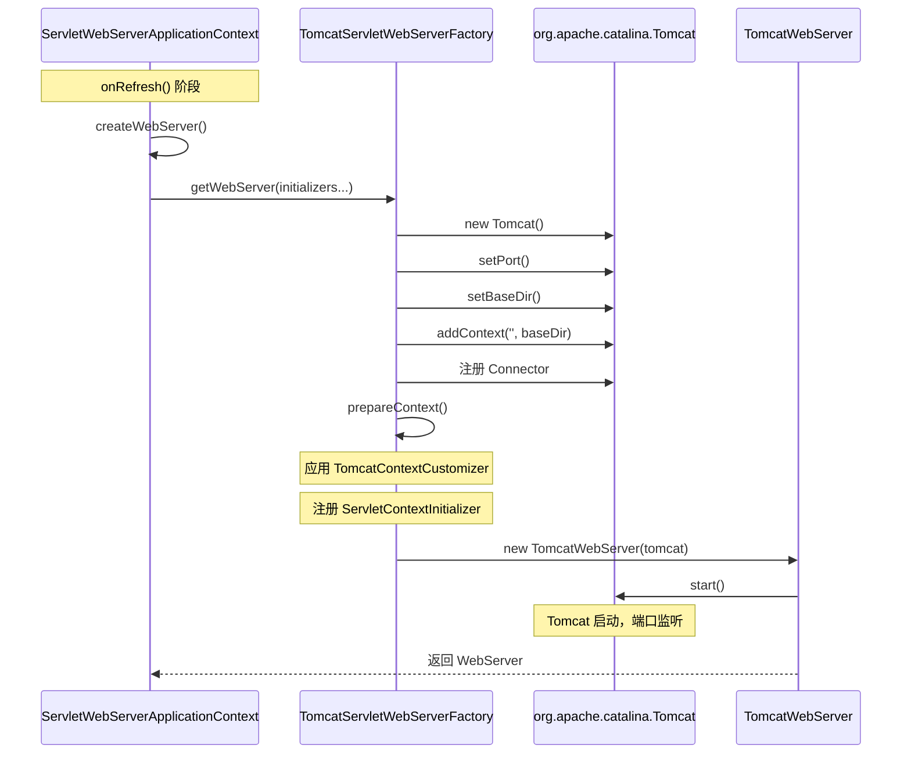

### 4.3 DispatcherServlet 注册流程

```java
// DispatcherServletAutoConfiguration.java
@AutoConfiguration
@ConditionalOnWebApplication(type = Type.SERVLET)
@ConditionalOnClass(DispatcherServlet.class)
public class DispatcherServletAutoConfiguration {

    // ★ Spring Boot 自动注册 DispatcherServlet
    @Bean(name = DEFAULT_DISPATCHER_SERVLET_BEAN_NAME)
    public DispatcherServlet dispatcherServlet(
            WebMvcProperties webMvcProperties) {
        DispatcherServlet dispatcherServlet = new DispatcherServlet();
        dispatcherServlet.setDispatchOptionsRequest(/*...*/);
        return dispatcherServlet;
    }

    // ★ 注册为 ServletRegistrationBean，映射到 "/"
    @Bean(name = DEFAULT_DISPATCHER_SERVLET_REGISTRATION_BEAN_NAME)
    @ConditionalOnBean(value = DispatcherServlet.class, 
            name = DEFAULT_DISPATCHER_SERVLET_BEAN_NAME)
    public DispatcherServletRegistrationBean dispatcherServletRegistration(
            DispatcherServlet dispatcherServlet,
            WebMvcProperties webMvcProperties) {
        
        DispatcherServletRegistrationBean registration = 
            new DispatcherServletRegistrationBean(dispatcherServlet, "/");
        registration.setLoadOnStartup(webMvcProperties.getServlet().getLoadOnStartup());
        return registration;
    }
}
```

**ServletContextInitializer 链**：

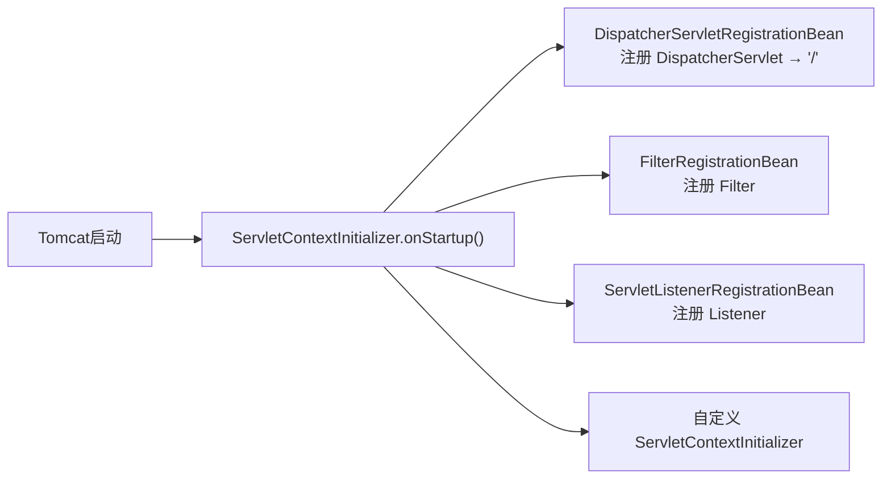

---

## 5. Bean 生命周期

Spring Bean 在 `AbstractApplicationContext.refresh()` → `finishBeanFactoryInitialization()` 阶段完成实例化。

### 5.1 完整生命周期

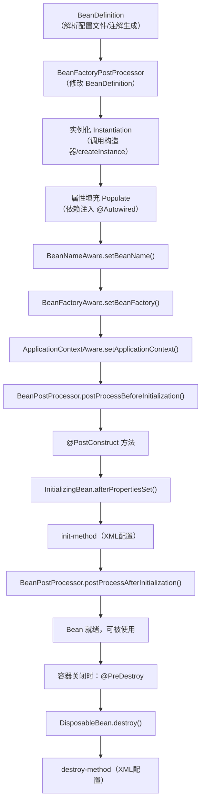

### 5.2 BeanPostProcessor 的桥梁作用

```java
public interface BeanPostProcessor {
    // 在初始化之前调用
    @Nullable
    default Object postProcessBeforeInitialization(Object bean, String beanName) 
            throws BeansException {
        return bean;
    }
    
    // 在初始化之后调用
    @Nullable
    default Object postProcessAfterInitialization(Object bean, String beanName) 
            throws BeansException {
        return bean;
    }
}
```

**核心 BeanPostProcessor 实现**：

| 实现类 | 作用 |
|--------|------|
| `AutowiredAnnotationBeanPostProcessor` | 处理 `@Autowired`、`@Value` 注入 |
| `CommonAnnotationBeanPostProcessor` | 处理 `@PostConstruct`、`@PreDestroy` |
| `ConfigurationPropertiesBindingPostProcessor` | 绑定 `@ConfigurationProperties` |
| `ApplicationContextAwareProcessor` | 注入 `ApplicationContext` 等 Aware 接口 |

### 5.3 BeanFactoryPostProcessor 的角色

```java
public interface BeanFactoryPostProcessor {
    // 在所有 BeanDefinition 加载后、实例化前调用
    void postProcessBeanFactory(ConfigurableListableBeanFactory beanFactory) 
            throws BeansException;
}
```

**关键实现：**

```java
// ConfigurationClassPostProcessor.java — 处理 @Configuration 类
// 这是触发自动配置的关键！
public class ConfigurationClassPostProcessor implements BeanDefinitionRegistryPostProcessor {
    
    @Override
    public void postProcessBeanDefinitionRegistry(BeanDefinitionRegistry registry) {
        // 解析 @Configuration 类
        ConfigurationClassParser parser = new ConfigurationClassParser(/*...*/);
        // ★ 这里面会处理 @Import，触发 AutoConfigurationImportSelector
        parser.parse(configCandidates);
    }
}
```

---

## 6. 外部化配置加载

Spring Boot 支持从多种来源加载配置，并按优先级合并。

### 6.1 配置加载流程

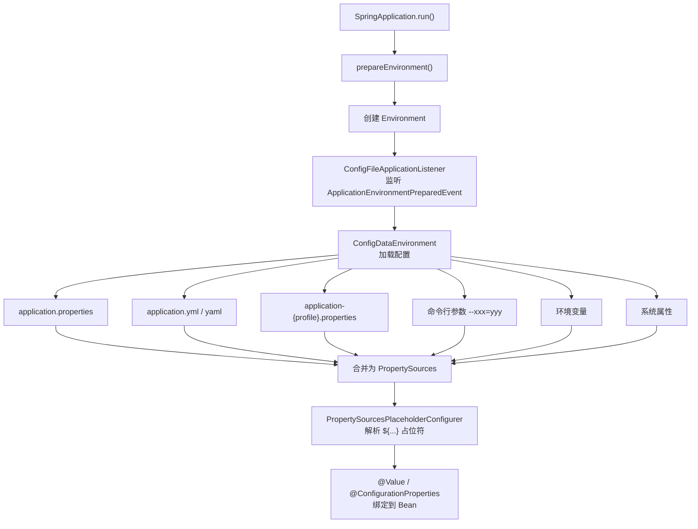

### 6.2 配置优先级（从高到低）

```
1. 命令行参数 (--server.port=8081)
2. SPRING_APPLICATION_JSON 环境变量
3. ServletConfig 初始化参数
4. JNDI 属性
5. Java 系统属性 (-Dserver.port=8081)
6. 操作系统环境变量
7. application-{profile}.properties（外部 jar 包外）
8. application-{profile}.properties（jar 包内）
9. application.properties（外部 jar 包外）
10. application.properties（jar 包内）
11. @PropertySource 注解
12. SpringApplication.setDefaultProperties()
```

### 6.3 @ConfigurationProperties 绑定

```java
// 配置类定义
@ConfigurationProperties(prefix = "server")
public class ServerProperties {
    private int port = 8080;       // 默认值
    private String address;
    private Servlet servlet = new Servlet();
    
    public static class Servlet {
        private String contextPath;
        private int sessionTimeout = 30 * 60;
    }
}

// 在自动配置中启用
@EnableConfigurationProperties(ServerProperties.class)
public class SomeAutoConfiguration {
    // ...
}
```

对应配置：
```properties
server.port=9090
server.address=0.0.0.0
server.servlet.context-path=/api
server.servlet.session-timeout=3600
```

---

## 7. 核心扩展点

Spring Boot 提供了丰富的扩展点，让你可以在启动各阶段插入自定义逻辑。

### 7.1 扩展点全景图

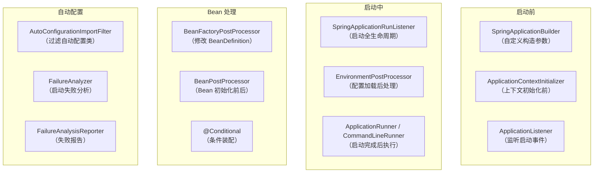

### 7.2 常用扩展点实现示例

#### ApplicationContextInitializer

```java
// 在 SpringApplication 上下文准备阶段执行
public class MyInitializer implements ApplicationContextInitializer<ConfigurableApplicationContext> {
    @Override
    public void initialize(ConfigurableApplicationContext ctx) {
        // 添加自定义 PropertySource
        ctx.getEnvironment().getPropertySources().addFirst(
            new MapPropertySource("custom", Map.of("my.key", "value"))
        );
    }
}

// 注册方式 1：META-INF/spring.factories
// org.springframework.context.ApplicationContextInitializer=\
// com.example.MyInitializer

// 注册方式 2：代码
new SpringApplication(MyApp.class)
    .addInitializers(new MyInitializer())
    .run(args);
```

#### ApplicationRunner

```java
@Component
@Order(1)
public class DataInitializer implements ApplicationRunner {
    @Override
    public void run(ApplicationArguments args) throws Exception {
        // 容器完全启动后执行
        // 可以在这里做数据初始化、缓存预热等
    }
}

// CommandLineRunner 类似，提供原始 String[] args
@Component
public class StartupLogger implements CommandLineRunner {
    @Override
    public void run(String... args) throws Exception {
        System.out.println("Application started with args: " + Arrays.toString(args));
    }
}
```

#### FailureAnalyzer

```java
// 自定义启动失败分析
public class PortInUseFailureAnalyzer 
        extends AbstractFailureAnalyzer<PortInUseException> {
    
    @Override
    protected FailureAnalysis analyze(Throwable rootFailure, PortInUseException cause) {
        return new FailureAnalysis(
            "端口 " + cause.getPort() + " 已被占用",
            "请检查是否有其他进程占用该端口，或修改 server.port 配置",
            cause
        );
    }
}

// META-INF/spring.factories
// org.springframework.boot.diagnostics.FailureAnalyzer=\
// com.example.PortInUseFailureAnalyzer
```

---

## 总结

Spring Boot 的源码架构可以概括为 **"一个入口，三级编排，N 个扩展点"**：

| 层次 | 核心类 | 职责 |
|------|--------|------|
| **启动编排** | `SpringApplication` | 协调整个启动流程，管理生命周期事件 |
| **自动配置** | `AutoConfigurationImportSelector` | 按条件加载配置类，实现"约定优于配置" |
| **上下文刷新** | `AbstractApplicationContext.refresh()` | BeanDefinition → 实例化 → 初始化 → 就绪 |
| **内嵌服务器** | `ServletWebServerApplicationContext` | 零配置集成 Tomcat/Jetty/Undertow |
| **外部化配置** | `ConfigDataEnvironment` | 多来源配置加载与优先级合并 |

理解这些核心流程后，无论是排查启动问题、自定义 Starter、还是阅读其他 Spring 生态项目的源码，都将事半功倍。

---

*本文基于 Spring Boot 3.x 源码编写。*

---

# 第二部分：Spring Framework 源码深度解析

---

## 8. IoC 容器核心架构

IoC（Inversion of Control）是 Spring Framework 的基石。整个容器围绕 **BeanDefinition → BeanFactory → ApplicationContext** 三层抽象构建。

### 8.1 ApplicationContext 继承体系

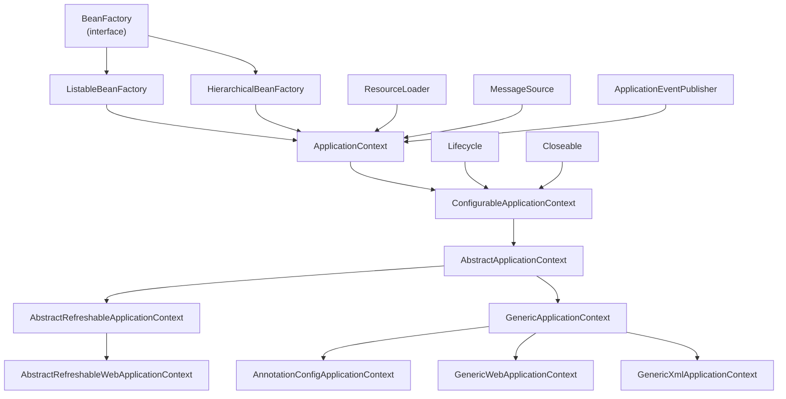

**关键接口职责**：

| 接口 | 包路径 | 职责 |
|------|--------|------|
| `BeanFactory` | `org.springframework.beans.factory` | IoC 容器根接口，提供 getBean() |
| `ListableBeanFactory` | `org.springframework.beans.factory` | 可枚举所有 Bean |
| `HierarchicalBeanFactory` | `org.springframework.beans.factory` | 父子容器层级 |
| `ApplicationContext` | `org.springframework.context` | 聚合 BeanFactory + 事件 + 国际化 + 资源加载 |
| `ConfigurableApplicationContext` | `org.springframework.context` | 可配置生命周期（refresh/close） |

### 8.2 BeanDefinition 加载流程

Spring 通过三种 Reader 将不同类型的配置源解析为统一的 `BeanDefinition`：

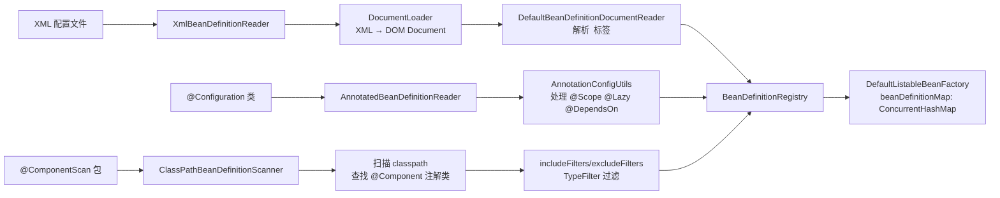

**`DefaultListableBeanFactory` 核心数据结构**：

```java
// DefaultListableBeanFactory.java
public class DefaultListableBeanFactory extends AbstractAutowireCapableBeanFactory
        implements ConfigurableListableBeanFactory, BeanDefinitionRegistry {

    // ★ 存储所有 BeanDefinition，key 为 beanName
    private final Map<String, BeanDefinition> beanDefinitionMap = 
        new ConcurrentHashMap<>(256);

    // ★ 按注册顺序保存 beanName，保证依赖注入顺序
    private volatile List<String> beanDefinitionNames = new ArrayList<>(256);
    
    // 注册 BeanDefinition
    @Override
    public void registerBeanDefinition(String beanName, BeanDefinition beanDefinition) {
        // 1. 校验 BeanDefinition
        // 2. 检查是否已存在（allowBeanDefinitionOverriding 控制是否允许覆盖）
        // 3. 放入 beanDefinitionMap
        this.beanDefinitionMap.put(beanName, beanDefinition);
        // 4. 记录到 beanDefinitionNames
        this.beanDefinitionNames.add(beanName);
    }
}
```

### 8.3 getBean() 完整调用链

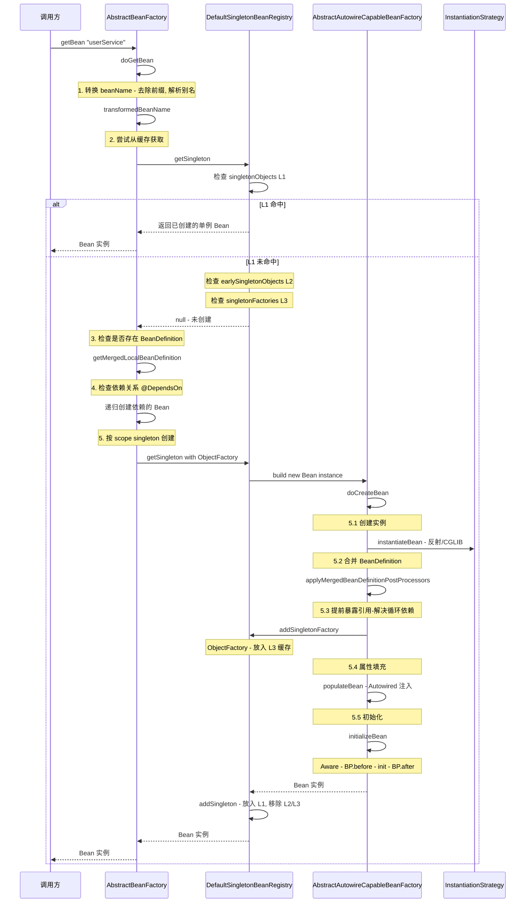

---

## 9. 循环依赖与三级缓存

这是 Spring 面试最高频的问题之一。Spring 通过 **三级缓存**解决单例 Bean 的 Setter 注入循环依赖。

### 9.1 三级缓存结构

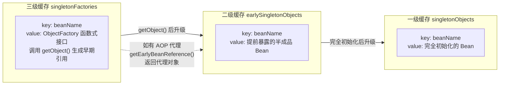

### 9.2 A → B → A 循环依赖解决过程

假设 `ServiceA` 依赖 `ServiceB`，`ServiceB` 也依赖 `ServiceA`：

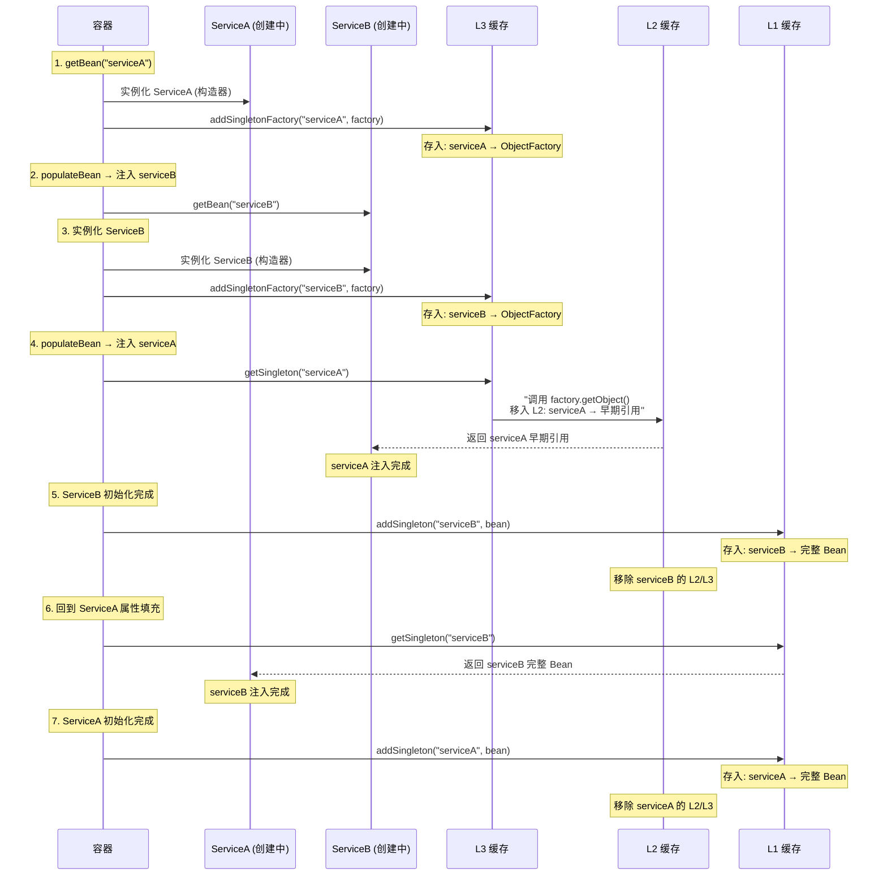

### 9.3 核心源码

```java
// DefaultSingletonBeanRegistry.java
public class DefaultSingletonBeanRegistry extends SimpleAliasRegistry 
        implements SingletonBeanRegistry {

    // ★ L1: 完全初始化的单例 Bean
    private final Map<String, Object> singletonObjects = new ConcurrentHashMap<>(256);

    // ★ L2: 提前暴露的早期引用
    private final Map<String, Object> earlySingletonObjects = new ConcurrentHashMap<>(16);

    // ★ L3: ObjectFactory 工厂，可生成早期引用
    private final Map<String, ObjectFactory<?>> singletonFactories = new HashMap<>(16);

    // 获取单例的核心方法
    @Nullable
    protected Object getSingleton(String beanName, boolean allowEarlyReference) {
        // 1. 查 L1
        Object singletonObject = this.singletonObjects.get(beanName);
        if (singletonObject == null && isSingletonCurrentlyInCreation(beanName)) {
            // 2. 查 L2
            singletonObject = this.earlySingletonObjects.get(beanName);
            if (singletonObject == null && allowEarlyReference) {
                synchronized (this.singletonObjects) {
                    singletonObject = this.singletonObjects.get(beanName);
                    if (singletonObject == null) {
                        singletonObject = this.earlySingletonObjects.get(beanName);
                        if (singletonObject == null) {
                            // 3. 查 L3，调用 getObject() 生成早期引用
                            ObjectFactory<?> singletonFactory = 
                                this.singletonFactories.get(beanName);
                            if (singletonFactory != null) {
                                singletonObject = singletonFactory.getObject();
                                // 升级到 L2
                                this.earlySingletonObjects.put(beanName, singletonObject);
                                this.singletonFactories.remove(beanName);
                            }
                        }
                    }
                }
            }
        }
        return singletonObject;
    }
}
```

**核心限制**：Spring 只能解决 **单例 + Setter 注入** 的循环依赖，构造器注入的循环依赖无法解决（因为构造器调用时还未暴露到 L3）。

---

## 10. AOP 代理机制

AOP（Aspect-Oriented Programming）通过**动态代理**在不修改源码的情况下增强方法。

### 10.1 代理创建流程

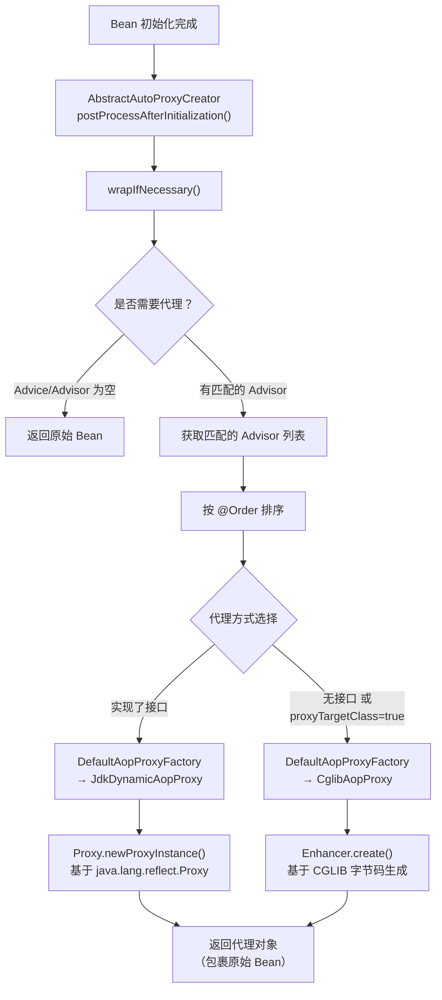

### 10.2 AOP 核心术语与接口

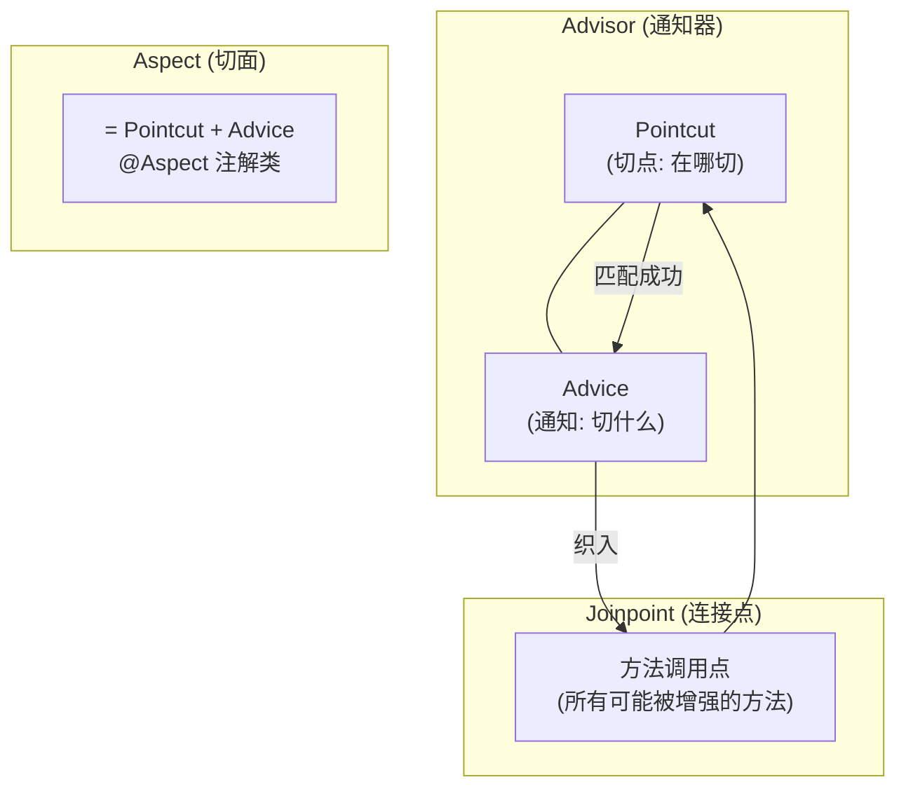

**核心接口源码**：

```java
// 切点：定义"在哪里"增强
public interface Pointcut {
    ClassFilter getClassFilter();      // 类级别匹配
    MethodMatcher getMethodMatcher();  // 方法级别匹配
}

// 通知：定义"做什么"增强
public interface Advice {}
// 子类型:
//   MethodBeforeAdvice    → @Before
//   AfterReturningAdvice  → @AfterReturning
//   ThrowsAdvice          → @AfterThrowing
//   MethodInterceptor     → @Around

// 通知器 = 切点 + 通知
public interface Advisor {
    Advice getAdvice();
}
// PointcutAdvisor: 额外提供 Pointcut
```

### 10.3 拦截器链执行过程

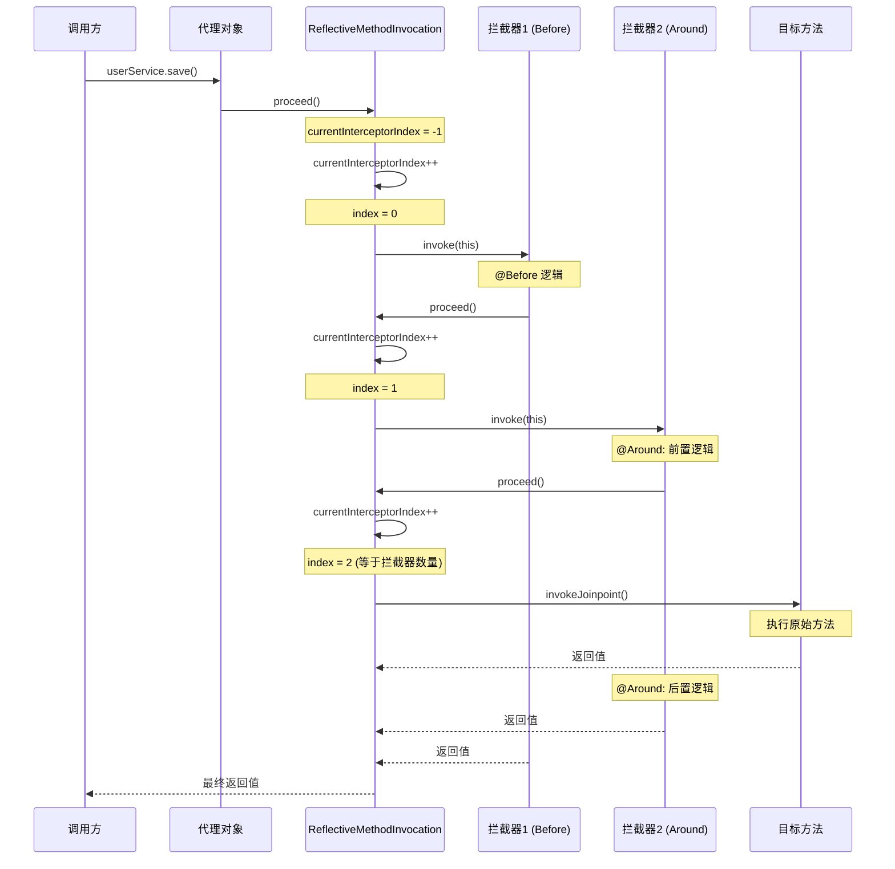

**核心源码**：

```java
// ReflectiveMethodInvocation.java
public class ReflectiveMethodInvocation implements ProxyMethodInvocation {
    
    // 拦截器列表
    protected final List<?> interceptorsAndDynamicMethodMatchers;
    // 当前索引
    private int currentInterceptorIndex = -1;

    public Object proceed() throws Throwable {
        // ★ 当所有拦截器执行完毕，调用目标方法
        if (this.currentInterceptorIndex == this.interceptorsAndDynamicMethodMatchers.size() - 1) {
            return invokeJoinpoint();
        }

        // ★ 获取下一个拦截器并执行
        Object interceptorOrInterceptionAdvice =
            this.interceptorsAndDynamicMethodMatchers.get(++this.currentInterceptorIndex);
        
        // 执行拦截器，拦截器内部会再次调用 this.proceed()
        return ((MethodInterceptor) interceptorOrInterceptionAdvice).invoke(this);
    }
}
```

---

## 11. Spring MVC 请求分发

`DispatcherServlet` 是整个 Spring MVC 的**前端控制器**，所有 HTTP 请求统一由它分发。

### 11.1 doDispatch() 完整流程

```mermaid
sequenceDiagram
    participant Client as 浏览器
    participant DS as DispatcherServlet
    participant HM as HandlerMapping
    participant HA as HandlerAdapter
    participant Interceptor as HandlerInterceptor
    participant Controller as @Controller
    participant HMR as HandlerMethodReturnValueHandler
    participant VR as ViewResolver

    Client->>DS: GET /users/1
    DS->>DS: doDispatch(request, response)
    
    Note over DS: 1. 检查文件上传
    DS->>DS: checkMultipart(request)
    
    Note over DS: 2. 获取 Handler
    DS->>HM: getHandler(request)
    HM->>HM: RequestMappingHandlerMapping<br/>匹配 URL → HandlerMethod
    HM-->>DS: HandlerExecutionChain
    
    Note over DS: 3. 获取 HandlerAdapter
    DS->>HA: getHandlerAdapter(handler)
    HA-->>DS: RequestMappingHandlerAdapter
    
    Note over DS: 4. 执行拦截器 preHandle
    DS->>Interceptor: preHandle(request, response, handler)
    
    Note over DS: 5. 实际执行控制器方法
    DS->>HA: handle(request, response, handler)
    HA->>HA: 解析参数 (HandlerMethodArgumentResolver)
    HA->>Controller: userController.getUser(1)
    Controller-->>HA: User 对象 / ModelAndView
    
    Note over DS: 6. 执行拦截器 postHandle
    DS->>Interceptor: postHandle(request, response, handler, mv)
    
    Note over DS: 7. 处理返回结果
    DS->>DS: processDispatchResult()
    alt @ResponseBody (REST API)
        DS->>HMR: HttpMessageConverter 序列化
        HMR-->>Client: JSON 响应
    else View 视图
        DS->>VR: ViewResolver 解析视图
        VR-->>Client: HTML 页面
    end
    
    Note over DS: 8. 执行拦截器 afterCompletion
    DS->>Interceptor: afterCompletion(request, response, handler, ex)
```

### 11.2 @RequestMapping 解析流程

```mermaid
flowchart TD
    App["应用启动"] --> Init["AbstractHandlerMethodMapping.initHandlerMethods()"]
    Init --> Scan["扫描所有 @Controller Bean"]
    Scan --> Detect["detectHandlerMethods(beanType)"]
    Detect --> Mapping["提取 @RequestMapping 注解信息"]
    Mapping --> Reg["registerHandlerMethod()"]
    
    Reg --> Map["mappingRegistry<br/>pathLookup: /users/{id} → HandlerMethod<br/>nameLookup: 方法名 → HandlerMethod"]
    
    Req["请求到达"] --> Lookup["lookupHandlerMethod()"]
    Lookup --> Match1["直接匹配 URL 路径"]
    Match1 --> Match2["AntPathMatcher 模式匹配"]
    Match2 --> Best["选最佳匹配 HandlerMethod"]
```

### 11.3 参数解析与返回值处理

```java
// HandlerMethodArgumentResolver - 方法入参解析
public interface HandlerMethodArgumentResolver {
    boolean supportsParameter(MethodParameter parameter);
    Object resolveArgument(MethodParameter parameter, ...) throws Exception;
}

// 常用实现:
// @RequestBody       → RequestResponseBodyMethodProcessor (读 JSON, 调 HttpMessageConverter)
// @RequestParam      → RequestParamMethodArgumentResolver
// @PathVariable      → PathVariableMethodArgumentResolver
// @ModelAttribute    → ModelAttributeMethodProcessor
// 无注解的复杂对象    → ServletModelAttributeMethodProcessor

// HandlerMethodReturnValueHandler - 返回值处理
public interface HandlerMethodReturnValueHandler {
    boolean supportsReturnType(MethodParameter returnType);
    void handleReturnValue(Object returnValue, ...) throws Exception;
}

// 常用实现:
// @ResponseBody      → RequestResponseBodyMethodProcessor (写 JSON, 调 HttpMessageConverter)
// String (视图名)     → ViewNameMethodReturnValueHandler
// ModelAndView       → ModelAndViewMethodReturnValueHandler
```

**HttpMessageConverter 链**：

```
客户端 Accept: application/json
    ↓
AbstractMessageConverterMethodProcessor.writeWithMessageConverters()
    ↓ 遍历已注册的 HttpMessageConverter
    ├── StringHttpMessageConverter      (text/plain)
    ├── MappingJackson2HttpMessageConverter  (application/json) ← ★ 匹配！
    ├── Jaxb2RootElementHttpMessageConverter (application/xml)
    └── ...
    ↓
Jackson ObjectMapper.writeValue() → JSON 字符串 → HTTP Response
```

---

## 12. 事务管理

Spring 事务的核心是 **AOP + ThreadLocal**，通过 `@Transactional` 注解声明式管理事务。

### 12.1 @Transactional 全链路

```mermaid
flowchart TD
    Start["@Transactional 方法被调用"] --> Proxy["事务代理对象拦截"]
    Proxy --> TI["TransactionInterceptor.invoke()"]
    TI --> TAM["TransactionAttributeSource<br/>解析 @Transactional 属性"]
    TAM --> TM["PlatformTransactionManager.getTransaction()"]
    
    TM --> Status["创建 TransactionStatus"]
    Status --> Bind["TransactionSynchronizationManager<br/>bindResource() → ThreadLocal 绑定 Connection"]
    
    Bind --> Business["执行目标方法"]
    
    Business --> Check{"方法是否抛异常？"}
    Check -->|"无异常"| Commit["tm.commit(status)"]
    Check -->|"有异常"| RollbackCheck{"异常是否匹配 rollbackFor？"}
    RollbackCheck -->|"是"| Rollback["tm.rollback(status)"]
    RollbackCheck -->|"否"| Commit
    
    Commit --> Unbind["unbindResource()"]
    Rollback --> Unbind
    Unbind --> Clean["cleanupAfterCompletion()"]
```

### 12.2 事务传播行为

```java
public interface TransactionDefinition {
    int PROPAGATION_REQUIRED = 0;      // 默认：有则加入，无则新建
    int PROPAGATION_SUPPORTS = 1;      // 有则加入，无则非事务运行
    int PROPAGATION_MANDATORY = 2;     // 必须有事务，否则抛异常
    int PROPAGATION_REQUIRES_NEW = 3;  // 始终新建，挂起当前事务
    int PROPAGATION_NOT_SUPPORTED = 4; // 非事务运行，挂起当前事务
    int PROPAGATION_NEVER = 5;         // 非事务运行，有事务则抛异常
    int PROPAGATION_NESTED = 6;        // 嵌套事务（savepoint）
}
```

### 12.3 TransactionSynchronizationManager

这是 Spring 事务的**核心基础设施**，通过 `ThreadLocal` 实现线程隔离：

```java
public abstract class TransactionSynchronizationManager {
    // ★ 事务资源：每个线程的 DataSource → Connection 映射
    private static final ThreadLocal<Map<Object, Object>> resources = 
        new NamedThreadLocal<>("Transactional resources");

    // ★ 事务同步器链（用于触发 @TransactionalEventListener 等）
    private static final ThreadLocal<Set<TransactionSynchronization>> synchronizations = 
        new NamedThreadLocal<>("Transaction synchronizations");

    // ★ 当前事务名称
    private static final ThreadLocal<String> currentTransactionName = 
        new NamedThreadLocal<>("Current transaction name");

    // ★ 事务只读标志
    private static final ThreadLocal<Boolean> currentTransactionReadOnly = 
        new NamedThreadLocal<>("Current transaction read-only status");

    // ★ 事务隔离级别
    private static final ThreadLocal<Integer> currentTransactionIsolationLevel = 
        new NamedThreadLocal<>("Current transaction isolation level");

    // ★ 事务是否活跃
    private static final ThreadLocal<Boolean> actualTransactionActive = 
        new NamedThreadLocal<>("Actual transaction active");

    // 绑定资源
    public static void bindResource(Object key, Object value) {
        // key = DataSource, value = ConnectionHolder
        resources.get().put(key, value);
    }
}
```

---

## 13. 事件机制

Spring 事件机制基于**观察者模式**，支持同步/异步事件广播。

### 13.1 事件广播流程

```mermaid
flowchart TD
    Event["自定义事件 extends ApplicationEvent"] --> Publish["ApplicationEventPublisher.publishEvent()"]
    Publish --> MC["ApplicationEventMulticaster<br/>multicastEvent()"]
    
    MC --> Resolve["resolveDefaultEventType()<br/>包装为 PayloadApplicationEvent"]
    Resolve --> Listeners["getApplicationListeners()<br/>获取匹配的监听器"]
    
    Listeners --> Loop["遍历每个监听器"]
    Loop --> Q{"Executor 是否设置？"}
    Q -->|"否（同步）"| Sync["直接调用 listener.onApplicationEvent()"]
    Q -->|"是（异步）"| Async["executor.execute(() → listener.onApplicationEvent())"]
```

### 13.2 @EventListener 与 @TransactionalEventListener

```java
// 声明式事件监听 — 无需实现接口
@Component
public class OrderEventListener {
    
    // 同步监听
    @EventListener
    public void handleOrderCreated(OrderCreatedEvent event) {
        // 在同一线程、同一事务中执行
    }
    
    // 事务提交后监听 ★
    @TransactionalEventListener(phase = TransactionPhase.AFTER_COMMIT)
    public void handleAfterCommit(OrderCreatedEvent event) {
        // 仅在事务成功提交后执行
        // 用于发送消息、异步通知等
    }
    
    // 事务回滚后监听
    @TransactionalEventListener(phase = TransactionPhase.AFTER_ROLLBACK)
    public void handleAfterRollback(OrderCreatedEvent event) {
        // 事务回滚后的清理逻辑
    }
}

// @TransactionalEventListener 原理：
// 它通过 TransactionSynchronizationManager.registerSynchronization()
// 注册一个 TransactionSynchronization，在事务完成阶段回调
```

### 13.3 事件机制核心类

```java
// 事件发布器接口
public interface ApplicationEventPublisher {
    default void publishEvent(ApplicationEvent event) {
        publishEvent((Object) event);
    }
    void publishEvent(Object event); // 也支持任意对象（自动包装）
}

// 事件广播器 — 核心实现 SimpleApplicationEventMulticaster
public class SimpleApplicationEventMulticaster extends AbstractApplicationEventMulticaster {
    
    @Override
    public void multicastEvent(ApplicationEvent event, @Nullable ResolvableType eventType) {
        ResolvableType type = (eventType != null ? eventType : 
            ResolvableType.forInstance(event));
        
        // ★ 获取匹配的监听器（支持泛型事件匹配）
        for (ApplicationListener<?> listener : getApplicationListeners(event, type)) {
            Executor executor = getTaskExecutor();
            if (executor != null) {
                // 异步执行
                executor.execute(() -> invokeListener(listener, event));
            } else {
                // 同步执行（默认）
                invokeListener(listener, event);
            }
        }
    }
}
```

---

## 14. 启动全链路串联

将 Spring Boot + Spring Framework 的完整启动链路串联：

```mermaid
flowchart TD
    subgraph SB["Spring Boot 阶段"]
        A["main() → SpringApplication.run()"]
        B["prepareEnvironment()"]
        C["createApplicationContext()"]
        D["prepareContext()"]
    end
    
    subgraph SF["Spring Framework 阶段 refresh()"]
        E["obtainFreshBeanFactory()"]
        F["invokeBeanFactoryPostProcessors()"]
        G["registerBeanPostProcessors()"]
        H["onRefresh() → 创建 WebServer"]
        I["finishBeanFactoryInitialization()"]
    end
    
    subgraph Bean["Bean 创建"]
        J["getBean() → doGetBean()"]
        K["createBean() → doCreateBean()"]
        L["BeanPostProcessor 链"]
        M["AOP 代理创建"]
    end
    
    subgraph Runtime["运行时"]
        N["内嵌 Tomcat 就绪"]
        O["DispatcherServlet 就绪"]
        P["处理 HTTP 请求"]
        Q["事务拦截"]
        R["事件广播"]
    end
    
    A --> B --> C --> D
    D --> E --> F
    F -->|"触发自动配置"| F1["AutoConfigurationImportSelector"]
    F1 --> F
    F --> G --> H --> I
    I --> J --> K --> L --> M
    
    M --> N --> O
    P --> Q
    Q --> R
```

---

## 15. 关键扩展点速查

| 扩展点 | 类型 | 时机 | 典型用途 |
|--------|------|------|----------|
| `BeanFactoryPostProcessor` | 接口 | 所有 BeanDefinition 加载后、实例化前 | 修改 Bean 定义、注册新 Bean |
| `BeanPostProcessor` | 接口 | 每个 Bean 初始化前后 | AOP 代理、属性注入 |
| `InstantiationAwareBeanPostProcessor` | 接口 | Bean 实例化前后 | 短路实例化、提前返回代理 |
| `SmartInstantiationAwareBeanPostProcessor` | 接口 | 实例化阶段 | 预测 Bean 类型、提前暴露引用 |
| `MergedBeanDefinitionPostProcessor` | 接口 | BeanDefinition 合并后 | 处理 `@Autowired`、`@Value` |
| `ApplicationListener` | 接口 | 事件发布时 | 监听容器事件 |
| `ApplicationContextInitializer` | 接口 | `refresh()` 前 | 添加 PropertySource、激活 Profile |
| `HandlerInterceptor` | 接口 | HTTP 请求前后 | 权限校验、日志、跨域 |
| `HandlerMethodArgumentResolver` | 接口 | 控制器方法调用前 | 解析自定义参数注解 |
| `HandlerMethodReturnValueHandler` | 接口 | 控制器方法返回后 | 处理自定义返回值 |

---

*本文基于 Spring Framework 6.x + Spring Boot 3.x 源码编写。*

---

# 第三部分：Spring 生态深度解析

---

## 16. Spring Boot Actuator

Actuator 是 Spring Boot 的**生产级监控模块**，通过端点（Endpoint）暴露应用运行状态。

### 16.1 端点架构

```mermaid
flowchart TB
    subgraph JMX["JMX 暴露"]
        JMX_EP["通过 JMX MBean 暴露"]
    end
    
    subgraph WEB["HTTP 暴露"]
        WEB_EP["通过 /actuator/* 端点暴露"]
    end
    
    subgraph CORE["Endpoint 核心"]
        EP["@Endpoint 注解<br/>定义端点类"]
        OP1["@ReadOperation → GET"]
        OP2["@WriteOperation → POST"]
        OP3["@DeleteOperation → DELETE"]
    end
    
    subgraph BUILTIN["内置端点"]
        H["health<br/>应用健康状态"]
        M["metrics<br/>指标数据"]
        I["info<br/>应用信息"]
        E["env<br/>环境属性"]
        LG["loggers<br/>日志级别"]
        TH["threaddump<br/>线程转储"]
        HT["httptrace<br/>HTTP 追踪"]
    end
    
    CORE --> JMX
    CORE --> WEB
    BUILTIN --> CORE
```

### 16.2 Health 健康检查机制

```mermaid
sequenceDiagram
    participant Client as GET /actuator/health
    participant Endpoint as HealthEndpoint
    participant Registry as HealthContributorRegistry
    participant Indicator1 as DataSourceHealthIndicator
    participant Indicator2 as DiskSpaceHealthIndicator
    participant Indicator3 as RedisHealthIndicator
    participant Aggregator as HealthAggregator

    Client->>Endpoint: health()
    Endpoint->>Registry: 获取所有 HealthIndicator
    Registry-->>Endpoint: List of HealthIndicator
    
    par 并行检查
        Endpoint->>Indicator1: health()
        Indicator1-->>Endpoint: {"status":"UP","details":"..."}
    and
        Endpoint->>Indicator2: health()
        Indicator2-->>Endpoint: {"status":"UP","details":"..."}
    and
        Endpoint->>Indicator3: health()
        Indicator3-->>Endpoint: {"status":"DOWN","details":"..."}
    end
    
    Endpoint->>Aggregator: aggregate(healths)
    Note over Aggregator: 任一 DOWN → 整体 DOWN<br/>全部 UP → 整体 UP
    Aggregator-->>Endpoint: {"status":"DOWN","components":{...}}
    Endpoint-->>Client: HTTP 503 + JSON
```

**核心源码**：

```java
// HealthEndpoint.java - 健康端点入口
@Endpoint(id = "health")
public class HealthEndpoint {
    private final HealthContributorRegistry registry;
    
    @ReadOperation
    public HealthComponent health() {
        // 遍历所有 HealthIndicator，聚合结果
        return this.registry.stream()
            .map(indicator -> indicator.health())
            .reduce(new Health.Builder().up(), (builder, health) -> 
                builder.withDetail("component", health))
            .build();
    }
}

// AbstractHealthIndicator.java - 健康指标基类
public abstract class AbstractHealthIndicator implements HealthIndicator {
    @Override
    public final Health health() {
        Health.Builder builder = new Health.Builder();
        try {
            doHealthCheck(builder);  // 子类实现
        } catch (Exception ex) {
            builder.down(ex);        // 异常 → DOWN
        }
        return builder.build();
    }
    
    protected abstract void doHealthCheck(Health.Builder builder) throws Exception;
}
```

### 16.3 Metrics 指标采集（Micrometer）

```mermaid
flowchart LR
    App["应用代码<br/>@Timed / Counter"] --> MR["MeterRegistry<br/>(Micrometer 抽象)"]
    
    MR --> PM["PrometheusMeterRegistry<br/>/actuator/prometheus"]
    MR --> ELK["ElasticMeterRegistry"]
    MR --> JM["JMXMeterRegistry"]
    MR --> OT["OtlpMeterRegistry"]
    
    PM --> Prom["Prometheus Server"]
    Prom --> Grafana["Grafana 仪表盘"]
```

---

## 17. Spring Data JPA 代理

Spring Data JPA 的核心魔法是**运行时动态生成 `JpaRepository` 的实现类**。

### 17.1 代理创建流程

```mermaid
sequenceDiagram
    participant Container as Spring 容器
    participant Enable as @EnableJpaRepositories
    participant Registrar as JpaRepositoryRegistrar
    participant Factory as JpaRepositoryFactoryBean
    participant Proxy as JdkDynamicAopProxy
    participant Impl as SimpleJpaRepository

    Container->>Enable: 扫描 @EnableJpaRepositories
    Enable->>Registrar: registerBeanDefinitions()
    Note over Registrar: 扫描 repository 接口<br/>创建 BeanDefinition (FactoryBean)
    
    Note over Container: 当需要注入 UserRepository 时
    Container->>Factory: getObject()
    Factory->>Factory: getRepository()
    Factory->>Proxy: 创建 JDK 动态代理
    
    Note over Proxy: 代理拦截所有方法调用
    
    alt 接口方法 (findById, save...)
        Proxy->>Impl: SimpleJpaRepository.findById()
        Impl->>Impl: em.find(Class, id)
        Impl-->>Proxy: Entity 对象
    else @Query 方法
        Proxy->>Proxy: 解析 JPQL → 创建 Query
        Proxy-->>Container: 执行结果
    end
    
    Proxy-->>Container: "返回代理对象 (注入完成)"
```

### 17.2 JpaRepository 方法分发

```mermaid
flowchart TD
    Call["userRepo.findByName('Tom')"] --> Proxy["JdkDynamicAopProxy.invoke()"]
    Proxy --> Dispatch["JpaRepositoryFactory<br/>QueryExecutorMethodInterceptor"]
    
    Dispatch --> Q1{"方法类型？"}
    
    Q1 -->|"声明在 JpaRepository"| Impl["SimpleJpaRepository<br/>直接调用"]
    Q1 -->|"方法名查询"| Parse["PartTreeJpaQuery<br/>解析 findBy + Name"]
    Q1 -->|"@Query 注解"| Jpql["AbstractJpaQuery<br/>执行 JPQL/SQL"]
    
    Parse --> Criteria["JpaCriteriaQuery<br/>构建 WHERE name = ?"]
    Jpql --> Native["EntityManager.createQuery()"]
    
    Impl --> EM1["em.find() / em.persist()"]
    Criteria --> EM2["em.createQuery(criteria)"]
    Native --> EM3["em.createQuery(jpql)"]
```

**核心源码**：

```java
// SimpleJpaRepository.java — 默认实现
@Repository
@Transactional(readOnly = true)
public class SimpleJpaRepository<T, ID> implements JpaRepositoryImplementation<T, ID> {
    
    private final JpaEntityInformation<T, ?> entityInformation;
    private final EntityManager em;  // ★ 底层 JPA EntityManager
    
    @Override
    @Transactional
    public <S extends T> S save(S entity) {
        if (entityInformation.isNew(entity)) {
            em.persist(entity);       // 新建 → persist
            return entity;
        } else {
            return em.merge(entity);  // 已存在 → merge
        }
    }
    
    @Override
    public Optional<T> findById(ID id) {
        return Optional.ofNullable(em.find(getDomainClass(), id));
    }
    
    // 方法名查询最终生成的代理
    // findByLastNameAndFirstName → 自动解析为 WHERE last_name = ? AND first_name = ?
}
```

---

## 18. Spring Security 过滤器链

Spring Security 基于**责任链模式**的 Servlet Filter 实现认证与授权。

### 18.1 过滤器链架构

```mermaid
flowchart TD
    Request["HTTP 请求"] --> FC["DelegatingFilterProxy<br/>(web.xml / Spring Boot 自动注册)"]
    FC --> FCP["FilterChainProxy<br/>(Spring Security 入口)"]
    
    FCP --> Chain["SecurityFilterChain<br/>（实际过滤器链）"]
    
    subgraph Filters["默认过滤器链（共 15 个）"]
        CSRF["CsrfFilter"]
        CORS["CorsFilter"]
        AUTH1["SecurityContextPersistenceFilter<br/>（加载 SecurityContext）"]
        LC["LogoutFilter"]
        AUTH2["UsernamePasswordAuthenticationFilter<br/>（处理登录表单）"]
        BASIC["BasicAuthenticationFilter"]
        RM["RememberMeAuthenticationFilter"]
        ANON["AnonymousAuthenticationFilter"]
        SESSION["SessionManagementFilter"]
        EXC["ExceptionTranslationFilter<br/>（处理认证/授权异常）"]
        AUTHZ["AuthorizationFilter<br/>（授权决策）"]
    end
    
    FCP --> Filters
    
    CHAIN1["Chain 1: /api/**"]
    CHAIN2["Chain 2: /admin/**"]
    
    AUTHZ --> Dispatcher["DispatcherServlet"]
```

### 18.2 认证流程（Username/Password）

```mermaid
sequenceDiagram
    participant User as 浏览器
    participant Filter as UsernamePasswordAuthenticationFilter
    participant AM as AuthenticationManager
    participant Provider as DaoAuthenticationProvider
    participant UDS as UserDetailsService
    participant SC as SecurityContextHolder

    User->>Filter: POST /login (username + password)
    Filter->>Filter: 提取 username/password → UsernamePasswordAuthenticationToken
    
    Filter->>AM: authenticate(token)
    AM->>Provider: "supports(token)? → authenticate(token)"
    
    Provider->>UDS: loadUserByUsername(username)
    UDS-->>Provider: "UserDetails (含加密密码)"
    
    Provider->>Provider: PasswordEncoder.matches(password, hashedPassword)
    alt 密码匹配
        Provider-->>AM: "Authentication (已认证)"
        AM-->>Filter: Authentication
        Filter->>SC: SecurityContextHolder.setContext(authentication)
        Filter-->>User: 302 Redirect / 登录成功
    else 密码不匹配
        Provider-->>AM: BadCredentialsException
        AM-->>Filter: AuthenticationException
        Filter-->>User: 登录失败
    end
```

### 18.3 SecurityContextHolder 线程绑定

```java
// SecurityContextHolder.java — 核心 ThreadLocal 设计
public class SecurityContextHolder {
    // ★ 三种存储策略
    public static final String MODE_THREADLOCAL = "MODE_THREADLOCAL"; // 默认
    public static final String MODE_INHERITABLETHREADLOCAL = "MODE_INHERITABLETHREADLOCAL";
    public static final String MODE_GLOBAL = "MODE_GLOBAL";
    
    private static SecurityContextHolderStrategy strategy;
    
    static {
        // 默认使用 ThreadLocal
        strategy = new ThreadLocalSecurityContextHolderStrategy();
    }
    
    public static SecurityContext getContext() {
        return strategy.getContext();  // ThreadLocal.get()
    }
}

// ThreadLocalSecurityContextHolderStrategy.java
final class ThreadLocalSecurityContextHolderStrategy 
        implements SecurityContextHolderStrategy {
    
    // ★ 每个线程独立的 SecurityContext
    private static final ThreadLocal<Supplier<SecurityContext>> contextHolder = 
        new ThreadLocal<>();
    
    @Override
    public SecurityContext getContext() {
        return contextHolder.get().get();
    }
}

// SecurityContextPersistenceFilter — 请求结束时清理
// 保证线程池复用时的线程安全（请求结束后 clear ThreadLocal）
```

---

## 19. 自定义 Spring Boot Starter

完整的 Starter 实现需要三步：`AutoConfiguration` + `Properties` + `META-INF/spring/*.imports`。

### 19.1 Starter 结构

```
my-spring-boot-starter/
├── pom.xml
└── src/main/
    ├── java/com/example/starter/
    │   ├── MyService.java                       # 核心业务类
    │   ├── MyServiceAutoConfiguration.java      # 自动配置类
    │   └── MyProperties.java                    # 配置属性类
    └── resources/
        └── META-INF/spring/
            └── org.springframework.boot.autoconfigure.AutoConfiguration.imports
```

### 19.2 完整代码实现

```java
// 1. 配置属性类 ★
@ConfigurationProperties(prefix = "my.service")
public class MyProperties {
    private boolean enabled = true;        // 默认值
    private String url = "http://localhost:8080";
    private int timeout = 5000;
    private Retry retry = new Retry();     // 嵌套配置
    
    public static class Retry {
        private int maxAttempts = 3;
        private long backoff = 1000;
        // getters/setters...
    }
    // getters/setters...
}

// 2. 核心业务类 ★
public class MyService {
    private final MyProperties properties;
    
    public MyService(MyProperties properties) {
        this.properties = properties;
    }
    
    public String call() {
        // 使用 properties.getUrl() / properties.getTimeout()
        return "Called " + properties.getUrl();
    }
}

// 3. 自动配置类 ★
@AutoConfiguration                                                    // Spring Boot 3.x 新注解
@EnableConfigurationProperties(MyProperties.class)                    // 启用属性绑定
@ConditionalOnProperty(prefix = "my.service", name = "enabled", 
                       havingValue = "true", matchIfMissing = true)  // 条件装配
public class MyServiceAutoConfiguration {
    
    @Bean
    @ConditionalOnMissingBean  // 用户可覆盖
    public MyService myService(MyProperties properties) {
        return new MyService(properties);
    }
}
```

```properties
# 4. AutoConfiguration.imports 文件 ★
# META-INF/spring/org.springframework.boot.autoconfigure.AutoConfiguration.imports
com.example.starter.MyServiceAutoConfiguration
```

### 19.3 使用者配置

```yaml
# 引入 starter 后，application.yml 中配置：
my:
  service:
    enabled: true
    url: https://api.example.com
    timeout: 10000
    retry:
      max-attempts: 5
      backoff: 2000
```

---

## 20. Spring Boot Test 切片

Spring Boot Test 通过**切片注解**实现不同粒度的测试上下文加载。

### 20.1 测试切片加载范围对比

```mermaid
flowchart TD
    subgraph FULL["@SpringBootTest<br/>(完整加载)"]
        ALL["整个 ApplicationContext<br/>所有 Bean + 自动配置 + WebServer"]
    end
    
    subgraph MVC["@WebMvcTest<br/>(仅 MVC 层)"]
        MVC_Beans["@Controller + @ControllerAdvice<br/>Filter + WebMvcConfigurer<br/>HandlerMapping + HandlerAdapter<br/>★ 不加载 @Service @Repository"]
    end
    
    subgraph JPA["@DataJpaTest<br/>(仅 JPA 层)"]
        JPA_Beans["@Entity + Repository<br/>DataSource + EntityManager<br/>★ 不加载 @Controller @Service<br/>★ 默认 @Transactional 自动回滚"]
    end
    
    subgraph JSON["@JsonTest<br/>(仅 JSON 序列化)"]
        JSON_Beans["ObjectMapper + Jackson Module<br/>★ 不加载任何业务 Bean"]
    end
    
    subgraph REST["@RestClientTest<br/>(仅 RestClient)"]
        REST_Beans["RestTemplate + RestClientBuilder<br/>MockRestServiceServer"]
    end
```

### 20.2 常用测试示例

```java
// @WebMvcTest — 只测试 Controller 层
@WebMvcTest(UserController.class)  // ★ 指定要测试的 Controller
class UserControllerTest {
    @Autowired
    private MockMvc mockMvc;       // ★ 模拟 HTTP 请求
    
    @MockBean                        // ★ Controller 依赖的 Service 用 Mock
    private UserService userService;
    
    @Test
    void shouldReturnUser() throws Exception {
        when(userService.findById(1L)).thenReturn(new User("Tom"));
        
        mockMvc.perform(get("/users/1"))
               .andExpect(status().isOk())
               .andExpect(jsonPath("$.name").value("Tom"));
    }
}

// @DataJpaTest — 只测试 JPA 层
@DataJpaTest
class UserRepositoryTest {
    @Autowired
    private TestEntityManager entityManager;  // ★ 测试专用 EntityManager
    @Autowired
    private UserRepository userRepository;
    
    @Test
    void shouldFindByName() {
        entityManager.persist(new User("Tom"));  // 预置数据
        Optional<User> user = userRepository.findByName("Tom");
        assertThat(user).isPresent();
    }
    // ★ 测试结束后自动回滚，不污染数据库
}

// @SpringBootTest — 完整集成测试
@SpringBootTest(webEnvironment = SpringBootTest.WebEnvironment.RANDOM_PORT)
class UserIntegrationTest {
    @Autowired
    private TestRestTemplate restTemplate;  // ★ 真实 HTTP 调用
    
    @Test
    void shouldGetUser() {
        ResponseEntity<User> response = 
            restTemplate.getForEntity("/users/1", User.class);
        assertThat(response.getStatusCode()).isEqualTo(HttpStatus.OK);
    }
}
```

### 20.3 测试切片机制原理

```java
// @WebMvcTest 源码 — 通过 @TypeExcludeFilters 限制扫描范围
@Target(ElementType.TYPE)
@Retention(RetentionPolicy.RUNTIME)
@Documented
@Inherited
@BootstrapWith(WebMvcTestContextBootstrapper.class)
@ExtendWith(SpringExtension.class)
@OverrideAutoConfiguration(enabled = false)     // ★ 关闭自动配置
@TypeExcludeFilters(WebMvcTypeExcludeFilter.class)  // ★ 排除 @Service/@Repository
@AutoConfigureWebMvc                            // ★ 仅引入 MVC 相关配置
@AutoConfigureMockMvc
@ImportAutoConfiguration                         // ★ 导入有限的自动配置
public @interface WebMvcTest {
    Class<?>[] controllers() default {};         // 指定要测试的 Controller
}
```

---

## 21. 异常处理机制

Spring Boot 的异常处理链路涉及 `@ControllerAdvice`、`ErrorController` 和 `ErrorMvcAutoConfiguration`。

### 21.1 异常处理全链路

```mermaid
sequenceDiagram
    participant Client as 浏览器
    participant DS as DispatcherServlet
    participant Handler as @Controller
    participant Exception as @ControllerAdvice
    participant Basic as BasicErrorController
    participant Attr as ErrorAttributes

    Client->>DS: GET /users/999 (不存在)
    DS->>Handler: getUser(999)
    Handler->>Handler: throw UserNotFoundException
    
    Note over Handler: 异常向上传播
    Handler-->>DS: UserNotFoundException
    
    Note over DS: processDispatchResult()
    DS->>DS: processHandlerException()
    DS->>Exception: @ExceptionHandler(UserNotFoundException)
    
    alt @ControllerAdvice 处理
        Exception-->>DS: "ResponseEntity (JSON 错误信息)"
        DS-->>Client: HTTP 404 + JSON {"error":"用户不存在"}
    else 无 @ControllerAdvice
        Note over DS: 异常继续传播到 Servlet 容器
        DS->>Basic: /error
        Basic->>Attr: getErrorAttributes(request)
        Attr-->>Basic: {status, error, message, trace}
        Basic-->>Client: HTTP 404 + 错误页面/JSON
    end
```

### 21.2 全局异常处理

```java
// @ControllerAdvice — 全局异常拦截
@RestControllerAdvice
public class GlobalExceptionHandler {
    
    // 处理特定异常
    @ExceptionHandler(UserNotFoundException.class)
    @ResponseStatus(HttpStatus.NOT_FOUND)
    public ErrorResponse handleNotFound(UserNotFoundException ex) {
        return new ErrorResponse("USER_NOT_FOUND", ex.getMessage());
    }
    
    // 处理校验异常
    @ExceptionHandler(MethodArgumentNotValidException.class)
    @ResponseStatus(HttpStatus.BAD_REQUEST)
    public ErrorResponse handleValidation(MethodArgumentNotValidException ex) {
        String message = ex.getBindingResult().getFieldErrors().stream()
            .map(e -> e.getField() + ": " + e.getDefaultMessage())
            .collect(Collectors.joining(", "));
        return new ErrorResponse("VALIDATION_FAILED", message);
    }
    
    // 兜底处理
    @ExceptionHandler(Exception.class)
    @ResponseStatus(HttpStatus.INTERNAL_SERVER_ERROR)
    public ErrorResponse handleAll(Exception ex) {
        return new ErrorResponse("INTERNAL_ERROR", "服务器内部错误");
    }
}

// 自定义异常
@ResponseStatus(HttpStatus.NOT_FOUND)  // ★ 绑定 HTTP 状态码
public class UserNotFoundException extends RuntimeException {
    public UserNotFoundException(Long id) {
        super("用户不存在: " + id);
    }
}
```

### 21.3 BasicErrorController 源码

```java
// BasicErrorController.java — Spring Boot 默认错误处理
@Controller
@RequestMapping("${server.error.path:${error.path:/error}}")
public class BasicErrorController extends AbstractErrorController {
    
    // HTML 请求 → 返回错误页面
    @RequestMapping(produces = MediaType.TEXT_HTML_VALUE)
    public ModelAndView errorHtml(HttpServletRequest request, HttpServletResponse response) {
        HttpStatus status = getStatus(request);
        Map<String, Object> model = getErrorAttributes(request, getErrorAttributeOptions(request));
        response.setStatus(status.value());
        return new ModelAndView("error", model);
    }
    
    // API 请求 → 返回 JSON
    @RequestMapping
    public ResponseEntity<Map<String, Object>> error(HttpServletRequest request) {
        HttpStatus status = getStatus(request);
        Map<String, Object> body = getErrorAttributes(request, getErrorAttributeOptions(request));
        return new ResponseEntity<>(body, status);
    }
}
```

---

## 22. Spring Cache 抽象

Spring Cache 通过 `@Cacheable` AOP 拦截提供**声明式缓存**，底层支持多种缓存实现。

### 22.1 缓存拦截流程

```mermaid
sequenceDiagram
    participant Caller as 调用方
    participant Proxy as CacheInterceptor<br/>(AOP 代理)
    participant CM as CacheManager
    participant Cache as Cache (Redis/Caffeine)
    participant Method as 目标方法

    Caller->>Proxy: @Cacheable getUser(1L)
    Proxy->>CM: getCache("users")
    CM-->>Proxy: Cache 实例
    
    Proxy->>Cache: get(key = "1")
    
    alt 缓存命中
        Cache-->>Proxy: User 对象
        Proxy-->>Caller: 直接返回（不执行方法）
    else 缓存未命中
        Proxy->>Method: 执行 getUser(1L)
        Method-->>Proxy: User 对象
        Proxy->>Cache: put(key = "1", value = User)
        Proxy-->>Caller: User 对象
    end
```

### 22.2 常用注解

```java
@Service
public class UserService {
    
    // ★ @Cacheable — 缓存结果
    @Cacheable(value = "users", key = "#id", unless = "#result == null")
    public User getUser(Long id) {
        // 只有缓存未命中时才执行此方法
        return userRepository.findById(id).orElse(null);
    }
    
    // ★ @CachePut — 更新缓存（始终执行方法）
    @CachePut(value = "users", key = "#user.id")
    public User updateUser(User user) {
        return userRepository.save(user);
    }
    
    // ★ @CacheEvict — 清除缓存
    @CacheEvict(value = "users", key = "#id")
    public void deleteUser(Long id) {
        userRepository.deleteById(id);
    }
    
    // ★ @Caching — 组合多个缓存操作
    @Caching(
        evict = {
            @CacheEvict(value = "users", key = "#user.id"),
            @CacheEvict(value = "userList", allEntries = true)
        }
    )
    public User saveUser(User user) {
        return userRepository.save(user);
    }
}
```

### 22.3 CacheInterceptor 核心实现

```java
// CacheInterceptor.java — @Cacheable 的 AOP 拦截器
public class CacheInterceptor extends CacheAspectSupport implements MethodInterceptor {
    
    @Override
    public Object invoke(MethodInvocation invocation) throws Throwable {
        // 父类执行核心逻辑
        return execute(invocation, invocation.getThis(), invocation.getMethod(), 
                       invocation.getArguments());
    }
}

// CacheAspectSupport.java — 缓存抽象基类
public abstract class CacheAspectSupport {
    
    protected Object execute(CacheOperationInvoker invoker, Object target, 
            Method method, Object[] args) {
        
        // 1. 获取所有缓存操作（@Cacheable, @CacheEvict...）
        Collection<CacheOperation> operations = getCacheOperationSource()
            .getCacheOperations(method, targetClass);
            
        // 2. 执行 @CacheEvict (beforeInvocation=true) — 清缓存
        processCacheEvicts(contexts, true, CacheOperationExpressionEvaluator.NO_RESULT);
        
        // 3. 查缓存 — @Cacheable
        Cache.ValueWrapper cacheHit = findCachedItem(contexts.get(CacheableOperation.class));
        
        if (cacheHit != null && !hasCachePut(contexts)) {
            return cacheHit.get();  // ★ 缓存命中，直接返回
        }
        
        // 4. 缓存未命中 — 执行目标方法
        Object returnValue = invoker.invoke();
        
        // 5. 更新缓存 — @CachePut / @Cacheable
        for (CacheOperationContext context : contexts) {
            if (context instanceof CachePutOperation || 
                (context instanceof CacheableOperation && cacheHit == null)) {
                cache.put(key, returnValue);
            }
        }
        
        return returnValue;
    }
}
```

### 22.4 CacheManager 实现选择

| 实现 | 依赖 | 适用场景 |
|------|------|----------|
| `ConcurrentMapCacheManager` | 无（内存） | 单机、开发测试 |
| `RedisCacheManager` | `spring-boot-starter-data-redis` | 分布式缓存 |
| `CaffeineCacheManager` | `com.github.ben-manes.caffeine` | 高性能本地缓存 |
| `EhCacheCacheManager` | `ehcache` | 传统企业级缓存 |
| `HazelcastCacheManager` | `hazelcast` | 分布式内存网格 |
| `CompositeCacheManager` | 组合多个 | 多级缓存（L1 Caffeine + L2 Redis） |

---

## 23. 文档全景导航

| 部分 | 章节 | 核心内容 | 适合读者 |
|------|------|----------|----------|
| **第一部分** | 1-7 | Spring Boot 启动流程、自动配置、内嵌服务器、外部配置 | 想快速理解 Spring Boot 原理 |
| **第二部分** | 8-15 | Spring IoC、循环依赖、AOP、MVC、事务、事件 | 想深入 Spring Framework 核心 |
| **第三部分** | 16-22 | Actuator、JPA、Security、Starter、Test、异常、Cache | 想掌握 Spring 生态组件 |
| **第四部分** | 24-32 | 设计哲学、常见坑、调试、性能、最佳实践、3.x 新特性、迁移、速查卡、思考题 | 想从"会用"到"专家" |
| **第五部分** | 33-35 | 10 种设计模式落地、6 个关键算法、速查总结 | 想理解设计智慧和面试高分 |
| **第六部分** | 36-39 | Spring Cloud（Nacos/Sentinel/Gateway）、MyBatis 源码 | 想扩展 Spring 生态广度 |
| **附录** | — | 17 个核心类 GitHub 源码直链 | 想对照源码阅读

---

# 第四部分：实战专家指南

> 这一部分是**授课型补充**——不是告诉你"怎么实现"，而是告诉你"为什么这样设计""踩过哪些坑""怎么选型"。

---

## 24. 设计哲学与架构意图

> **核心论点：Spring 的每一个设计决策，都是在**权衡**。本节逐一拆解每个"为什么"背后的推演过程。**

### 24.1 为什么 refresh() 分 12 步而不是 3 步？

**表面看**：12 步很啰嗦，为什么不用 3 步（准备 → 加载 → 完成）？

**Rod Johnson（Spring 创始人）的抉择**：`refresh()` 是 Spring 容器的"心脏"，每一步都是一个**可控断点**。如果把 12 步压缩成 3 步，每一步内部的逻辑太厚，子类想干预也无从下手。

```mermaid
flowchart TD
    subgraph BAD["如果只有 3 步"]
        B1["prepareRefresh - 混入校验 + 事件 + 状态"]
        B2["loadBeans - 混入注册 + 处理 + 代理"]
        B3["finishRefresh - 混入 WebServer + Listeners + 清理"]
    end
    
    subgraph GOOD["12 步：每步单一职责"]
        G1["prepareRefresh() - 仅设置状态"]
        G2["obtainFreshBeanFactory() - 仅获取工厂"]
        G3["prepareBeanFactory() - 仅注册基础组件"]
        G4["postProcessBeanFactory() - ★子类扩展点"]
        G5["invokeBeanFactoryPostProcessors() - ★插件扩展点"]
        G6["registerBeanPostProcessors() - 仅注册拦截器"]
        G7["initMessageSource() - 仅国际化"]
        G8["initApplicationEventMulticaster() - 仅事件"]
        G9["onRefresh() - ★子类扩展点"]
        G10["registerListeners() - 仅注册监听"]
        G11["finishBeanFactoryInitialization() - 仅实例化"]
        G12["finishRefresh() - 仅清理 + 事件"]
    end
    
    BAD -.->|"重构"| GOOD
```

**为什么每一步都是 protected 方法而不是 private？** — 模板方法模式的核心：子类可以选择性地覆盖某一步。例如：
- `AbstractRefreshableApplicationContext` 覆盖第 2 步，使 Factory 可被重建（支持多次 refresh）
- `ServletWebServerApplicationContext` 覆盖第 9 步，创建内嵌 WebServer
- `ReactiveWebServerApplicationContext` 同样覆盖第 9 步，但创建的是 Reactive WebServer

> **教学要点**：如果你设计的框架有 10 个可变步骤，别写成一个 500 行的 `run()` 方法。拆成 10 个 protected 方法，子类按需覆盖。这就是"对扩展开放，对修改封闭"的具体实践。

### 24.2 为什么用三级缓存解决循环依赖，而不是二级/一级？

这个问题几乎所有面试都会问，但 90% 的人只能回答"三级缓存分别存什么"，说不出**为什么是三级**。

**推演过程：如果你是 Rod Johnson，一步步设计缓存的演进**

```
v1.0: 一级缓存（Map<String, Object>）
  问题：正在创建中的 Bean（半成品）和已完成 Bean 混在一起。
  后果：B 拿到半成品的 A，调用其未注入的方法 → NPE ❌

v2.0: 二级缓存（completed + early）
  L1 = 完成 Bean, L2 = 半成品 Bean
  问题：如果 A 需要 AOP 代理，L2 存的是原始对象。
  当 B 调用 A 的方法时，AOP 未生效（事务/缓存/日志都不触发）❌

v3.0: 三级缓存（completed + early + factory）
  L1 = 完成 Bean, L2 = 半成品引用, L3 = ObjectFactory lambda
  关键：L3 不是存对象，而是存"如何生成对象"的函数。
  当 B 需要 A 时 → 调用 factory.getObject() → 
  ★ 如果 A 需要 AOP，这时才创建代理 → B 拿到代理对象 ✅
```

```mermaid
flowchart LR
    subgraph V1["一级缓存"]
        C1["Map: beanName → Bean"]
    end
    subgraph V2["二级缓存"]
        C2a["L1: 完成 Bean"]
        C2b["L2: 半成品 Bean"]
    end
    subgraph V3["三级缓存 ★"]
        C3a["L1: 完成 Bean"]
        C3b["L2: 早期引用"]
        C3c["L3: ObjectFactory lambda<br/>延迟执行！"]
    end
    V1 -->|"无法区分半成品"| V2
    V2 -->|"无法延迟创建代理"| V3
```

**ObjectFactory 的精妙之处**：它本质上是一个 **"懒加载工厂"**。如果没有循环依赖，L3 里的 lambda 永远不会被调用（getObject() 永远不会触发），AOP 代理在正常初始化流程中创建。只有当循环依赖发生时，才被迫提前执行 lambda，生成早期引用。

> **教学要点**：三级缓存的本质不是"多了一个 Map"，而是在 L3 引入了**延迟执行**（Lazy Evaluation）。这是函数式编程思想在 Spring 中的经典应用。

### 24.3 为什么 `@Transactional` 自调用失效？

这是面试高频题，但关键不在于"怎么做"，而在于**"Spring 为什么选择这种代理方式"**。

**Spring 面临的选择**：

| 技术路线 | 代表框架 | 优点 | 缺点 |
|----------|----------|------|------|
| **CGLIB/JDK 动态代理** | Spring（选择此方案） | 非侵入、纯 Java、运行时灵活 | 自调用穿透、final/private 方法无效 |
| **字节码织入（编译期）** | AspectJ | 无自调用问题、性能好 | 需要编译期工具、侵入性强 |
| **字节码织入（类加载期）** | AspectJ LTW | 无自调用问题 | 需要 `-javaagent`、启动慢 |

**Spring 为什么选代理而非织入？** 

Rod Johnson 的核心理念是 **"非侵入性"**（Non-invasive）。如果你用了 AspectJ 编译期织入，你的代码就**依赖了 AspectJ 编译器**；用了 LTW，就**依赖了 Java Agent**。而 JDK/CGLIB 动态代理**只依赖 JDK 本身**，零侵入。

**代价**：自调用穿透。但 Spring 认为这个代价**可接受**，因为有三种规避方案：
1. 注入 self 引用
2. 拆分为两个 Service
3. `((UserService) AopContext.currentProxy()).methodB()`

```mermaid
sequenceDiagram
    participant Caller as 外部调用方
    participant Proxy as UserService 代理
    participant Real as UserService 真实对象

    Caller->>Proxy: methodA
    Note over Proxy: 事务拦截器 → 开启事务
    Proxy->>Real: methodA
    Real->>Real: this.methodB
    Note over Real: 直接调用，绕过代理<br/>事务拦截器未触发
    
    Real-->>Proxy: 返回
    Note over Proxy: 事务提交
    Proxy-->>Caller: 返回
```

> **教学要点**：每个技术决策都有代价。Spring 选择了"无侵入性"而放弃了"自调用支持"。理解这一点比死记硬背"自调用失效"重要得多。

### 24.4 为什么 Spring Boot 用 SPI 而不是包扫描？

这是一个"空间换时间"的经典案例。

```mermaid
flowchart TB
    subgraph SCAN["方案 A: @ComponentScan 包扫描"]
        S1["遍历 classpath 所有 .class 文件"]
        S2["逐个检查 @Component 注解"]
        S3["加载、解析、注册"]
    end
    subgraph SPI["方案 B: SPI 声明式（Spring Boot 方案）"]
        P1["读取 META-INF/spring/*.imports"]
        P2["直接拿到全限定类名列表"]
        P3["按需加载"]
    end
    SCAN -.->|"O(n) 扫描 → O(1) 读取"| SPI
```

| 维度 | 包扫描 | SPI 声明式 |
|------|--------|-----------|
| 时间复杂度 | O(n)，n = classpath 中所有 class 数量 | O(1)，只读一个 imports 文件 |
| 可控性 | 不可控（可能扫到第三方不想要的类） | 完全可控（第三方显式声明） |
| 扩展性 | 第三方无法"声明"自己该被加载 | 第三方 jar 放入 imports 文件即可 |
| 启动耗时（实测） | ~500ms（中型项目） | ~5ms |

**为什么 Spring Framework 本身不用 SPI 而用扫描？** — Spring Framework 是"框架"，它不知道你会把 Bean 写在哪里，所以必须扫描。Spring Boot 是"平台"，它知道所有 starter 是预先定义好的，可以用 SPI 加速。

### 24.5 为什么要有 IoC 容器？— 从一个真问题出发

**没有 IoC 时（2000 年代 J2EE 时代）：**

```java
public class OrderService {
    private UserRepository userRepo = new UserRepositoryImpl();  // 硬编码
    private MailService mailService = new SmtpMailService();      // 硬编码
    
    public void createOrder(Order order) {
        User user = userRepo.findById(order.getUserId());
        mailService.send(user.getEmail(), "订单已创建");
    }
}
// 问题：想换 MailService 实现？改代码。想加事务？改代码。想写单元测试？没法 Mock。
```

**有了 IoC 后：**

```java
public class OrderService {
    private final UserRepository userRepo;    // 构造器注入
    private final MailService mailService;     // 构造器注入
    
    public OrderService(UserRepository userRepo, MailService mailService) {
        this.userRepo = userRepo;
        this.mailService = mailService;
    }
}
// OrderService 不再"依赖"具体实现，只"依赖"接口
// 控制权反转：谁创建、怎么创建 → 交给容器
```

**IoC 的本质**：把"对象创建权"从程序员手中夺走，交给容器。程序员只声明"我需要什么"（依赖声明），不再操心"怎么创建"（控制反转）。

> **教学要点**：IoC 不是 Spring 发明的，它是 Martin Fowler 在 2004 年总结出来的设计原则。Spring 把它做到了极致——不仅是"反转控制"，还加入了生命周期管理、AOP、事件等。

### 24.6 为什么 BeanFactory 和 ApplicationContext 要分开？

```mermaid
flowchart TB
    BF["BeanFactory<br/>只做一件事: getBean"]
    
    AC["ApplicationContext<br/>= BeanFactory<br/>+ 国际化 MessageSource<br/>+ 事件 ApplicationEventPublisher<br/>+ 资源加载 ResourceLoader<br/>+ 生命周期 Lifecycle"]
    
    BF -->|"基础"| AC
```

**单一职责原则的极致体现**：
- `BeanFactory`：只管"有没有、给不给"Bean，**零依赖其他概念**
- `ApplicationContext`：在 `BeanFactory` 基础上，叠加"企业级特性"

**为什么不用一个接口全干了？** 因为有些场景（如资源受限的嵌入式设备、只读配置）只需要 `BeanFactory`，不需要事件/国际化/资源加载。分层设计让用户按需选择。

### 24.7 为什么 @Configuration 要用 CGLIB 代理？

```java
@Configuration
public class AppConfig {
    @Bean
    public UserRepository userRepo() {
        return new UserRepositoryImpl(dataSource());  // ← 调用了 dataSource()
    }
    
    @Bean
    public DataSource dataSource() {
        return new HikariDataSource();
    }
}
// 问题：上面调用了 dataSource()，会创建几个 DataSource？
// 如果是普通 Java 调用 → 2 个 DataSource!
// Spring 的处理：CGLIB 代理 AppConfig → dataSource() 被拦截 →
// 如果已创建 → 从容器返回单例 → 只创建 1 个 ✅
```

**为什么不用 JDK 动态代理？** 因为 `@Configuration` 类**不实现任何接口**，JDK 动态代理要求接口。

**Spring 的处理机制**：
```java
// 实际运行时，AppConfig 被 CGLIB 增强为：
AppConfig$$EnhancerBySpringCGLIB extends AppConfig {
    @Override
    public DataSource dataSource() {
        // 拦截逻辑：如果容器中已有 DataSource Bean，直接返回
        if (beanFactory.containsSingleton("dataSource")) {
            return beanFactory.getBean("dataSource");
        }
        return super.dataSource();  // 首次调用 → 真正执行方法
    }
}
```

### 24.8 Spring Boot 的"约定优于配置"具体到代码层面

**不是一句口号，而是一套精密的条件链**：

```java
// 约定 1: classpath 有 spring-webmvc → 自动启用 MVC
@ConditionalOnWebApplication(type = Type.SERVLET)
@ConditionalOnClass({ Servlet.class, DispatcherServlet.class, WebMvcConfigurer.class })

// 约定 2: 用户没有自定义 ViewResolver → 用默认的
@ConditionalOnMissingBean(InternalResourceViewResolver.class)

// 约定 3: 有 DataSource 但没配 JdbcTemplate → 自动创建
@ConditionalOnClass({ DataSource.class, JdbcTemplate.class })
@ConditionalOnSingleCandidate(DataSource.class)
@ConditionalOnMissingBean(JdbcOperations.class)
```

每一条"约定"都是一个 `@Conditional` 注解。Spring Boot 不是"瞎猜"你需要什么，而是通过 **classpath 探测 + 用户显式排除 + Bean 存在性检查** 三重判断，精确激活或跳过每一个自动配置类。

### 24.9 为什么需要 FactoryBean？

`FactoryBean` 是 Spring 设计中最容易被低估的接口，但 **AOP 代理、MyBatis Mapper、Feign Client** 全部依赖它。

```java
// 普通 Bean: getBean("userRepo") → 返回 UserRepositoryImpl 实例
// FactoryBean: getBean("userRepo") → 返回 FactoryBean.getObject() 的结果！

public interface FactoryBean<T> {
    T getObject() throws Exception;     // ★ 返回的不是 FactoryBean 本身，而是产物
    Class<?> getObjectType();
    default boolean isSingleton() { return true; }
}
```

**为什么需要它？** 因为有些 Bean 的创建过程**不能用简单的 new + setter 完成**：

```java
// MyBatis Mapper 接口：没有实现类，怎么创建 Bean？
public interface UserMapper {  // 纯接口！
    User findById(Long id);
}

// 解决方案：MapperFactoryBean
// getObject() → sqlSession.getMapper(UserMapper.class) → JDK 动态代理
```

> **教学要点**：`FactoryBean` 是 Spring 的"工厂模式"内置支持。当你遇到"这个 Bean 不能直接 new 出来"的场景，第一个想到的应该是 `FactoryBean`。

### 24.10 Spring 设计决策时间线：从 2002 到 2025

| 年份 | 决策 | 为什么？ | 对今天的影响 |
|------|------|----------|-------------|
| 2002 | Rod Johnson 写《Expert One-on-One J2EE》 | 受够了 EJB 2.x 的笨重 | Spring 的基因就是"反臃肿" |
| 2004 | Spring 1.0 发布，IoC + AOP | 用 DI 替代 Service Locator | BeanFactory 至今是核心 |
| 2006 | Spring 2.0，XML Schema + @Autowired | XML 太冗长 | 注解驱动的开端 |
| 2009 | Spring 3.0，Java Config + @Configuration | 彻底告别 XML | 你的项目可能一行 XML 都没有了 |
| 2014 | Spring Boot 1.0 | 配置地狱 → 一键启动 | 改变了 Java 开发范式 |
| 2017 | Spring 5.0，WebFlux | 高并发非阻塞需求 | Servlet 不再唯一选择 |
| 2022 | Spring Boot 3.0，Java 17 基线 | 拥抱现代 Java | 虚拟线程、AOT 成为可能 |
| 2024 | Spring Boot 3.2+，虚拟线程 GA | Project Loom 成熟 | 百万级并发不再是梦 |

**为什么 Spring 能在 20 年间保持生命力？**
1. **非侵入性** — 你的代码不依赖 Spring 的 import（除了注解）
2. **渐进式** — 可以只用 IoC，不加 AOP；可以用 Boot，不上 Cloud
3. **社区治理** — Pivotal/VMware/Broadcom 连续收购但 Spring 始终保持 Apache 2.0 开源

---

## 25. 常见坑与反模式

### 25.1 十大高频坑

| # | 坑 | 现象 | 根因 | 解决 |
|---|-----|------|------|------|
| 1 | `@Transactional` 自调用失效 | 事务不生效 | 绕过 AOP 代理 | 注入 self / 拆 Service |
| 2 | `@Async` 同样自调用失效 | 异步不生效 | 同 #1 | 同 #1 |
| 3 | 构造器注入循环依赖 | `BeanCurrentlyInCreationException` | Spring 无法解决构造器循环依赖 | 改用 `@Lazy` 或 Setter 注入 |
| 4 | `@ConfigurationProperties` 不生效 | 属性注入 null | 缺少 `@EnableConfigurationProperties` 或未注册为 Bean | 加注解或用 `@ConfigurationPropertiesScan` |
| 5 | `application.yml` 不加载 | 配置读不到 | 文件位置不对 / 编码问题 | 确认在 `src/main/resources/` |
| 6 | `@ComponentScan` 扫不到 | Bean 未注册 | 主类在根包外 | 显式指定 `basePackages` |
| 7 | 多数据源事务混乱 | 事务错数据源 | 未指定 `transactionManager` | `@Transactional("txManager2")` |
| 8 | 内嵌 Tomcat 端口冲突 | 启动失败 | 端口被占用 | `server.port=0` 随机端口 / 排查占用 |
| 9 | `ThreadLocal` 内存泄漏 | 线程池中数据串了 | 未清理 ThreadLocal | `SecurityContextPersistenceFilter` 自动清理 |
| 10 | `@Scheduled` 不执行 | 定时任务不跑 | 缺少 `@EnableScheduling` | 加上注解 |

### 25.2 反模式：`Field Injection` vs `Constructor Injection`

```java
// ❌ 反模式：字段注入
@Service
public class UserService {
    @Autowired
    private UserRepository userRepo;  // 无法 final，单元测试必须用 Spring
    
    // 问题：
    // 1. 不能声明为 final（无法保证不可变性）
    // 2. 单元测试必须启动 Spring 容器或用反射注入
    // 3. 容易导致循环依赖不报错（延迟暴露）
    // 4. 构造器臃肿不可见
}

// ✅ 推荐：构造器注入
@Service
public class UserService {
    private final UserRepository userRepo;
    
    public UserService(UserRepository userRepo) {  // Spring 4.3+ 无需 @Autowired
        this.userRepo = userRepo;
    }
    
    // 优点：
    // 1. 可声明 final
    // 2. 单元测试可直接 new
    // 3. 依赖过多时构造器参数列表自然会提醒你重构
}
```

---

## 26. 调试与诊断实战

### 26.1 启动失败三板斧

```bash
# 1. 最详细的启动日志
java -jar app.jar --debug

# 2. 查看自动配置报告 —— ★ 最重要
#    application.yml 中启用：
management:
  endpoint:
    health:
      show-details: always

# 3. 启动时输出 ConditionEvaluationReport
#    代码中：
@SpringBootApplication
public class MyApp {
    public static void main(String[] args) {
        ConfigurableApplicationContext ctx = 
            SpringApplication.run(MyApp.class, args);
        
        // ★ 打印自动配置匹配/不匹配报告
        ConditionEvaluationReport report = ctx.getBean(
            ConditionEvaluationReport.class);
        report.getConditionAndOutcomesBySource().forEach((source, outcomes) -> {
            if (outcomes.isFullMatch()) return;  // 只看不匹配的
            System.out.println(source + ": " + outcomes);
        });
    }
}
```

### 26.2 ConditionEvaluationReport 解读

```java
// Positive matches（匹配成功，自动配置已生效）：
//   DataSourceAutoConfiguration matched:
//     - @ConditionalOnClass: DataSource.class found ✅
//     - @ConditionalOnProperty: spring.datasource.url is set ✅

// Negative matches（未匹配，自动配置未生效）：
//   RabbitAutoConfiguration did not match:
//     - @ConditionalOnClass: RabbitTemplate.class not found ❌

// Exclusions（被排除）：
//   SecurityAutoConfiguration excluded by user
```

### 26.3 运行时诊断

```bash
# Actuator 端点（生产环境慎开）
GET /actuator/beans           # 所有 Bean 列表
GET /actuator/conditions       # ConditionEvaluationReport
GET /actuator/configprops      # @ConfigurationProperties 绑定状态
GET /actuator/mappings         # 所有 @RequestMapping 映射
GET /actuator/env              # 环境属性
GET /actuator/heapdump         # 堆转储
GET /actuator/threaddump       # 线程转储
```

```java
// 程序中获取 Bean
@Component
public class BeanInspector {
    @Autowired
    private ApplicationContext ctx;
    
    public void inspect() {
        // 某类型的 Bean
        Map<String, DataSource> beans = ctx.getBeansOfType(DataSource.class);
        
        // 某注解的 Bean
        Map<String, Object> controllers = 
            ctx.getBeansWithAnnotation(RestController.class);
    }
}
```

---

## 27. 性能优化指南

### 27.1 启动速度优化

```yaml
# application.yml
spring:
  main:
    lazy-initialization: true    # ★ 全局懒加载，启动时间可减少 30-50%
    
  jpa:
    open-in-view: false          # ★ 关闭 OSIV，避免持有数据库连接
    
  autoconfigure:
    exclude:                     # ★ 排除不需要的自动配置
      - org.springframework.boot.autoconfigure.mongo.MongoAutoConfiguration
```

```java
// 精确懒加载
@SpringBootApplication
@ComponentScan(lazyInit = true)  // 所有 @Component 懒加载
public class MyApp {}

// 或：按需饥饿加载关键 Bean
@Component
@Lazy(false)                     // 这个 Bean 不懒加载
public class CriticalService {}
```

### 27.2 运行时性能优化

| 优化项 | 方案 | 效果 |
|--------|------|------|
| 数据库连接池 | HikariCP（默认，最优） | 比 Tomcat CP 快 3-5x |
| JSON 序列化 | 避免循环引用、关闭 `FAIL_ON_UNKNOWN_PROPERTIES` | 减少 20% 序列化时间 |
| 静态资源 | 启用压缩 + 缓存 | `server.compression.enabled=true` |
| AOP 代理 | 优先 JDK Proxy（接口）而非 CGLIB | 减少字节码生成开销 |
| Bean 数量 | 避免无意义 `@Component` | 每减少 100 个 Bean，启动快 100ms |
| 虚拟线程 | Java 21+ `spring.threads.virtual.enabled=true` | Tomcat 请求处理线程几乎无限 |

### 27.3 内存优化

```java
// Spring Boot 3.2+ AOT 编译 —— 启动速度提升 50%+
// build.gradle
plugins {
    id 'org.springframework.boot' version '3.2.0'
    id 'org.graalvm.buildtools.native' version '0.9.28'
}

graalvmNative {
    binaries {
        main {
            imageName.set('app')
            buildArgs.add('--no-fallback')
        }
    }
}
// 编译: ./gradlew nativeCompile
// 启动: ./build/native/nativeCompile/app (毫秒级启动!)
```

---

## 28. 最佳实践与选型决策

### 28.1 选型决策表

| 场景 | 选择 | 理由 |
|------|------|------|
| **依赖注入** | 构造器注入 | 不可变、可测试、依赖可见 |
| 可选依赖 | Setter 注入 + `@Autowired(required=false)` | 明确表示可选 |
| **AOP vs Interceptor** | AOP：业务横切（事务/缓存）；Interceptor：Web 层（日志/鉴权） | 粒度不同 |
| **@ControllerAdvice vs ErrorController** | `@ControllerAdvice`：业务异常；`ErrorController`：兜底（404/500） | 前者收窄，后者兜底 |
| **JDK Proxy vs CGLIB** | 默认 CGLIB（Boot 2.x 起）；有接口可选 JDK | CGLIB 不要求接口但 final 方法无效 |
| **REQUIRED vs REQUIRES_NEW** | REQUIRED：默认；REQUIRES_NEW：日志/审计（独立提交） | 后者的 commit/rollback 独立 |
| **application.yml vs .properties** | yml：层次结构清晰；properties：简单平铺 | yml 更适合复杂配置 |
| **JPA vs MyBatis** | JPA：对象映射强；MyBatis：复杂 SQL 灵活 | 看团队和业务 |
| **Redis vs Caffeine（缓存）** | Redis：分布式；Caffeine：单机高性能 | Caffeine 比 Redis 快 100x |
| **WebMVC vs WebFlux** | MVC：同步阻塞，生态成熟；WebFlux：异步非阻塞 | 高并发 I/O 密集 → WebFlux |

### 28.2 日志最佳实践

```java
// ✅ 推荐：Lombok + 占位符
@Slf4j
@Service
public class UserService {
    public User getUser(Long id) {
        log.info("查询用户: id={}", id);  // ★ 占位符，避免字符串拼接
        // ...
    }
}

// ❌ 不推荐：字符串拼接
log.info("查询用户: id=" + id);  // 每次都拼接，即使日志级别关闭

// ✅ 异常日志：一定要传 Throwable
try {
    // ...
} catch (Exception e) {
    log.error("用户查询失败: id={}", id, e);  // ★ 最后一个参数传异常
}
```

### 28.3 异常处理分层

```mermaid
flowchart LR
    Repo["Repository<br/>throw 原始异常"] --> Service["Service<br/>转为业务异常"]
    Service --> Controller["Controller<br/>不捕获，向上抛"]
    Controller --> Advice["@ControllerAdvice<br/>统一转为 HTTP 响应"]
```

```java
// ★ 异常分层转换
@Repository
public class UserRepository {
    public User findById(Long id) {
        try {
            // JPA 操作
        } catch (DataAccessException e) {
            throw new DataLayerException("数据访问失败", e);  // 包装
        }
    }
}

@Service
public class UserService {
    public User getUser(Long id) {
        try {
            return userRepo.findById(id);
        } catch (DataLayerException e) {
            throw new UserNotFoundException(id, e);  // 转为业务异常
        }
    }
}

@RestControllerAdvice
public class GlobalExceptionHandler {
    @ExceptionHandler(UserNotFoundException.class)
    @ResponseStatus(NOT_FOUND)
    public ErrorResponse handle(UserNotFoundException e) {
        return ErrorResponse.of("USER_NOT_FOUND", e.getMessage());
    }
}
```

---

## 29. Spring Boot 3.x 新特性

### 29.1 Jakarta EE 迁移

```
Spring Boot 2.x:  javax.persistence.*  javax.servlet.*
Spring Boot 3.x:  jakarta.persistence.*  jakarta.servlet.*
```

IDEA 自动迁移: `Refactor → Migrate Packages and Classes → javax to jakarta`

### 29.2 AOT 编译 + GraalVM Native Image

```mermaid
flowchart LR
    Source["Java 源码"] --> AOT["Spring AOT 编译<br/>（构建时处理）"]
    AOT --> Graal["GraalVM native-image"]
    Graal --> Binary["独立可执行文件<br/>★ 毫秒级启动"]
```

| 特性 | JVM 模式 | Native Image |
|------|----------|-------------|
| 启动时间 | 2-5 秒 | **0.05 秒** |
| 内存占用 | 200-500 MB | **50-100 MB** |
| 吞吐量（稳态） | 高 | 中（无 JIT） |
| 限制 | 无 | 不支持动态代理、反射需配置 |

### 29.3 虚拟线程（Java 21 + Spring Boot 3.2）

```yaml
# application.yml
spring:
  threads:
    virtual:
      enabled: true  # ★ Tomcat/Jetty 使用虚拟线程处理请求
```

虚拟线程 = 轻量级线程（Project Loom），一个 JVM 可创建**百万级**虚拟线程，适合 I/O 密集型高并发场景。

### 29.4 ProblemDetail（RFC 9457）

Spring Boot 3.x 内置 `ProblemDetail` 标准错误响应：

```java
@RestControllerAdvice
public class ProblemDetailHandler {
    
    @ExceptionHandler(UserNotFoundException.class)
    public ProblemDetail handle(UserNotFoundException e) {
        ProblemDetail pd = ProblemDetail.forStatus(HttpStatus.NOT_FOUND);
        pd.setTitle("User Not Found");
        pd.setDetail(e.getMessage());
        pd.setProperty("userId", e.getUserId());  // 自定义字段
        return pd;  // ★ 自动序列化为 RFC 9457 JSON
    }
}

// 响应 JSON:
// {
//   "type": "about:blank",
//   "title": "User Not Found",
//   "status": 404,
//   "detail": "用户不存在: 999",
//   "instance": "/users/999",
//   "userId": 999
// }
```

### 29.5 Observability（可观测性）

Spring Boot 3.x 用 Micrometer Tracing 替代 Sleuth：

```yaml
management:
  tracing:
    sampling:
      probability: 1.0    # 100% 采样
  zipkin:
    tracing:
      endpoint: http://localhost:9411/api/v2/spans
```

```java
@RestController
public class UserController {
    
    @GetMapping("/users/{id}")
    public User getUser(@PathVariable Long id) {
        // ★ Observation API — 比 @Timed 更灵活
        return Observation.createNotStarted("user.find-by-id", registry)
            .lowCardinalityKeyValue("userId", id.toString())
            .observe(() -> userService.findById(id));
    }
}
```

### 29.6 其他重要变化

| 特性 | 2.x | 3.x |
|------|-----|-----|
| 最低 Java 版本 | Java 8 | **Java 17** |
| 自动配置注册 | `spring.factories` | `AutoConfiguration.imports` |
| `@AutoConfiguration` | `@Configuration` | 新注解，标记自动配置类 |
| `WebSecurityConfigurerAdapter` | 继承使用 | **已废弃**，用 `SecurityFilterChain` Bean |
| `spring.flyway` / `spring.liquibase` | 默认执行 | 需显式配置 `enabled: true` |

---

## 30. Spring Boot 2.x → 3.x 迁移指南

### 30.1 自动化迁移

```bash
# Spring 官方迁移工具
sdk install springboot
spring boot migrate

# 或：OpenRewrite（推荐）
# build.gradle
plugins {
    id 'org.openrewrite.rewrite' version '6.x'
}

rewrite {
    activeRecipe('org.openrewrite.java.spring.boot3.UpgradeSpringBoot_3_2')
}
```

### 30.2 手动迁移清单

| 步骤 | 操作 | 注意 |
|------|------|------|
| 1 | 升级 Java 17+ | `java -version` |
| 2 | 升级 Spring Boot 3.2.x | `spring-boot-starter-parent` 版本 |
| 3 | 全局替换 `javax.*` → `jakarta.*` | 包括 JPA、Servlet、Validation |
| 4 | `spring.factories` → `AutoConfiguration.imports` | 文件名和格式都变 |
| 5 | `WebSecurityConfigurerAdapter` 重构 | 改为声明 `SecurityFilterChain` Bean |
| 6 | `@ConstructorBinding` 移除 | Boot 3.x 自动检测（单构造器场景） |
| 7 | 检查 Actuator 端点变更 | `/actuator/health` 默认不显示详情 |
| 8 | 升级第三方依赖 | 确保都支持 Jakarta EE 9+ |

---

## 31. 每章速查卡片

### 第一部分速查

| 章 | 一句话 | 关键类 | 高频面试题 |
|----|--------|--------|------------|
| 1 | Spring Boot = 自动配置 + Starter + Actuator | `SpringApplication` | Spring Boot 和 Spring 区别？ |
| 2 | `run()` 方法 11 步启动，核心在 `refreshContext()` | `SpringApplicationRunListener` | 启动流程说一遍？ |
| 3 | `AutoConfigurationImportSelector` 从 imports 文件加载配置类 | `AutoConfigurationImportSelector` | 自动配置原理？ |
| 4 | 默认 Tomcat，`ServletWebServerFactory` 创建 | `TomcatServletWebServerFactory` | 怎么切换 Jetty？ |
| 5 | `refresh()` 12 步完成 Bean 生命周期 | `AbstractApplicationContext` | Bean 生命周期？ |
| 6 | 17 种配置源，按优先级合并 | `ConfigDataEnvironment` | 配置优先级排序？ |
| 7 | 10+ 个 SPI 接口，可在启动各阶段插入逻辑 | `BeanFactoryPostProcessor` | 用过哪些扩展点？ |

### 第二部分速查

| 章 | 一句话 | 关键类 | 高频面试题 |
|----|--------|--------|------------|
| 8 | `DefaultListableBeanFactory` 是 IoC 核心 | `DefaultListableBeanFactory` | BeanFactory vs ApplicationContext？ |
| 9 | 三级缓存解决 Setter 循环依赖，构造器无法解决 | `DefaultSingletonBeanRegistry` | 循环依赖怎么解决？ |
| 10 | `BeanPostProcessor` 链中创建 AOP 代理 | `AbstractAutoProxyCreator` | JDK Proxy vs CGLIB？ |
| 11 | `DispatcherServlet.doDispatch()` 9 步分发 | `DispatcherServlet` | Spring MVC 请求流程？ |
| 12 | AOP + ThreadLocal 实现声明式事务 | `TransactionSynchronizationManager` | @Transactional 原理？失效场景？ |
| 13 | `ApplicationEventMulticaster` 支持同步/异步广播 | `SimpleApplicationEventMulticaster` | @TransactionalEventListener 原理？ |

### 第三部分速查

| 章 | 一句话 | 关键类 | 高频面试题 |
|----|--------|--------|------------|
| 16 | `/actuator/health` 聚合所有 `HealthIndicator` | `HealthEndpoint` | 怎么自定义健康检查？ |
| 17 | `JpaRepository` 运行时生成 JDK 代理 + `SimpleJpaRepository` | `SimpleJpaRepository` | save() 怎么区分 insert/update？ |
| 18 | 15 个 Filter 组成责任链，`SecurityContextHolder` 存认证信息 | `SecurityFilterChain` | Spring Security 原理？ |
| 19 | `@ConfigurationProperties` + `@AutoConfiguration` + imports 文件 | - | 怎么自定义 Starter？ |
| 20 | `@WebMvcTest` 只加载 Controller 层 | `@WebMvcTest` | @SpringBootTest vs @WebMvcTest？ |
| 21 | `@ControllerAdvice` 收窄异常 → `BasicErrorController` 兜底 | `BasicErrorController` | 全局异常处理怎么实现？ |
| 22 | `CacheInterceptor` AOP 拦截，`CacheManager` 多种后端 | `CacheInterceptor` | @Cacheable 原理？缓存穿透？ |

### 第四部分速查

| 章 | 一句话 | 关键类 | 高频面试题 |
|----|--------|--------|------------|
| 24 | Spring 每个设计决策都是权衡，理解 WHY 比 HOW 重要 | `AbstractApplicationContext` | 为什么 refresh() 分 12 步？ |
| 25 | 十大高频坑：自调用、构造器循环、@Async 失效… | - | @Transactional 自调用失效怎么解决？ |
| 26 | `--debug` / `ConditionEvaluationReport` / Actuator 三板斧 | `ConditionEvaluationReport` | 自动配置不生效怎么排查？ |
| 27 | 懒加载/AOT/虚拟线程/HikariCP 启动性能四件套 | - | Spring Boot 3.x 启动怎么优化？ |
| 28 | 构造器注入 > 字段注入，AOP vs Interceptor 选型 | - | 依赖注入最佳实践？ |
| 29 | Jakarta EE、AOT、虚拟线程、ProblemDetail、Observability | - | Spring Boot 3.x 最大变化？ |
| 30 | OpenRewrite 自动化 + 8 步手动清单 | - | Boot 2.x 到 3.x 怎么迁移？ |

### 第五部分速查

| 章 | 一句话 | 关键类 | 高频面试题 |
|----|--------|--------|------------|
| 33 | 10 种 GoF 模式在 Spring 中的落地位置 | `FactoryBean`、`InterceptorChain` | Spring 用了哪些设计模式？ |
| 34 | 三级缓存 O(1) 查找、拓扑排序、AntPath 分治匹配 | `AntPathMatcher` | 循环依赖的算法复杂度？ |
| 36 | Nacos 注册发现 + 配置长轮询 | `NacosServiceRegistry` | Nacos vs Eureka vs Consul？ |
| 37 | Sentinel 限流/熔断/降级，QPS + 线程数双控 | `SphU` | Sentinel vs Hystrix？ |
| 38 | Gateway 基于 WebFlux+Netty，非阻塞 I/O | `RouteLocator` | Gateway vs Zuul vs Nginx？ |
| 39 | MapperProxy JDK 代理 + 插件拦截链 + L1/L2 缓存 | `MapperProxy`、`InterceptorChain` | MyBatis 插件原理？一二级缓存？ |

---

## 32. 互动思考题

### 第一部分

1. 如果不使用 `@SpringBootApplication`，如何手动实现等价效果？三个注解分别写试试。
2. 如果启动时某自动配置类未生效，你如何排查是哪个 `@Conditional` 条件不满足？
3. Spring Boot 如何检测当前是 Servlet 环境还是 Reactive 环境？`WebApplicationType` 的判断逻辑是什么？

### 第二部分

4. 如果发生循环依赖，`BeanCurrentlyInCreationException` 的堆栈信息是什么样子？从中能提取哪些有用信息？
5. Spring MVC 如果同时有 `@ExceptionHandler` 和 `@ControllerAdvice`，哪个优先级更高？为什么？
6. `@Transactional(propagation = Propagation.NESTED)` 和 `REQUIRES_NEW` 在 JDBC 和 JTA 下的行为有什么区别？

### 第三部分

7. 为什么 `@WebMvcTest` 不能测 Service 层？它的 Bean 加载机制是什么？
8. `@TransactionalEventListener(phase = AFTER_COMMIT)` 如果事务回滚了，监听器还会执行吗？AFTER_COMPLETION 呢？
9. Spring Data JPA 的方法名解析支持哪些关键词？`findByAgeGreaterThanAndNameLike` 会被翻译成什么 JPQL？

### 第四部分

10. 一个 `@Service` 类有 10 个 `@Autowired` 字段，怎么判断这个类是否需要重构？
11. `spring.main.lazy-initialization=true` 开启后，`@Scheduled` 定时任务还执行吗？为什么？
12. 启动时输出 `ConditionEvaluationReport`，发现 `DataSourceAutoConfiguration` 匹配成功但 `HibernateJpaAutoConfiguration` 未匹配。可能是什么原因？

### 第五部分

13. `FactoryBean` 和 `BeanFactory` 是什么关系？命名为什么这么容易混淆？
14. `ReflectiveMethodInvocation` 的 `proceed()` 方法中 `currentInterceptorIndex` 是如何递增的？画出调用栈。
15. `ResolvableType` 如何反向推导 `JpaRepository<User, Long>` 的泛型参数 `User` 和 `Long`？

### 第六部分

16. Nacos 配置中心的长轮询和短轮询的区别？长轮询的超时时间默认多少？为什么？
17. Sentinel 的"关联限流"和"热点限流"分别解决什么问题？给出一个生产场景。
18. Gateway 的 Filter 和 Spring MVC 的 Interceptor 有什么区别？能互相替代吗？
19. MyBatis 插件为什么只能拦截 Executor/StatementHandler/ParameterHandler/ResultSetHandler 四种对象？
20. MyBatis 一级缓存在 Spring 集成后每次查询都失效，为什么？如何解决？

### 思考题参考答案（简要）

| # | 答案要点 |
|---|----------|
| 1 | `@Configuration` + `@EnableAutoConfiguration` + `@ComponentScan` |
| 2 | 看 `ConditionEvaluationReport`，或启动时加 `--debug` |
| 3 | `ClassUtils.isPresent("DispatcherServlet")` && `!isPresent("DispatcherHandler")` |
| 4 | 堆栈包含 Bean 名 + 循环链 `A → B → A` |
| 5 | `@ControllerAdvice` 优先级更高，先于局部 `@ExceptionHandler` |
| 6 | NESTED 用 savepoint（JDBC），REQUIRES_NEW 挂起当前事务（物理连接不同） |
| 7 | `@WebMvcTest` 通过 `@TypeExcludeFilters` 排除了 `@Service` `@Repository` |
| 8 | 回滚时 AFTER_COMMIT 不触发，AFTER_COMPLETION 会触发（含 `AFTER_ROLLBACK`） |
| 9 | 翻译为 `WHERE age > ? AND name LIKE ?`，支持 ~20 个关键词 |
| 10 | 10 个依赖说明该类职责过重，应拆分为 3-4 个小 Service |
| 11 | 不会！`@Scheduled` 依赖 `TaskScheduler` Bean，懒加载会导致未初始化 |
| 12 | 缺少 JPA 依赖（`spring-boot-starter-data-jpa`），或 DataSource 不是 `javax.sql.DataSource` |
| 13 | `FactoryBean` 是创建复杂 Bean 的工厂，`BeanFactory` 是整个 IoC 容器的根接口 |
| 14 | 每次 `proceed()` 递增 `currentInterceptorIndex`，取出下一个拦截器，将 `this` 传给它，拦截器内部再次调用 `proceed()` 形成递归链 |
| 15 | 通过 `getGenericInterfaces()` → `ParameterizedType.getActualTypeArguments()` |
| 16 | 长轮询 30s 超时→重连，比短轮询省 97% 请求；短轮询 1s 一次 |
| 17 | 关联：支付接口 QPS 过高时限流下单接口；热点：userId=999 限 100 QPS，其他不限 |
| 18 | Gateway Filter 在请求到达 Controller 之前；MVC Interceptor 在 DispatcherServlet 内；不能互相替代 |
| 19 | 因为这四种对象覆盖了 MyBatis 的完整 SQL 执行生命周期：参数处理→SQL 执行→结果映射→语句处理 |
| 20 | `SqlSessionTemplate` 每次查询创建新 SqlSession；解决：手动开启二级缓存或将查询放在同一事务内 |

---

*全文 35 章，五大部分，基于 Spring Framework 6.x + Spring Boot 3.x + Spring Security 6.x 源码编写。*

---

# 第五部分：算法与设计模式

> Spring 不只是一个框架——它是一本**活的设计模式教科书**。本节逐一拆解 Spring 中实际使用的经典模式和算法，讲清楚"用在哪里、为什么选它、怎么实现的"。

---

## 33. 设计模式在 Spring 中的应用

### 33.1 模板方法模式 — Template Method

**使用位置**：`AbstractApplicationContext.refresh()`、`AbstractBeanFactory.getBean()`、`AbstractAutowireCapableBeanFactory.createBean()`

**为什么选它？** Spring 有大量流程固定但步骤可变的操作（如容器初始化 12 步）。模板方法让你把"不变的骨架"写死在父类，把"可变的细节"留给子类。

```java
// AbstractApplicationContext.java — 骨架固定，步骤可变
public abstract class AbstractApplicationContext implements ConfigurableApplicationContext {
    
    public void refresh() throws BeansException {       // ← 模板方法（final，不可覆盖）
        prepareRefresh();          // 1. 步骤可覆盖 → protected
        ConfigurableListableBeanFactory beanFactory = obtainFreshBeanFactory(); // 2
        prepareBeanFactory(beanFactory);     // 3
        postProcessBeanFactory(beanFactory); // 4 ★子类扩展
        invokeBeanFactoryPostProcessors(beanFactory); // 5
        registerBeanPostProcessors(beanFactory);       // 6
        initMessageSource();         // 7
        initApplicationEventMulticaster(); // 8
        onRefresh();                 // 9 ★子类扩展
        registerListeners();         // 10
        finishBeanFactoryInitialization(beanFactory); // 11
        finishRefresh();            // 12
    }
    
    protected abstract void postProcessBeanFactory(ConfigurableListableBeanFactory bf);
    protected void onRefresh() throws BeansException {} // 默认空实现
}

// GenericApplicationContext — 不重写 obtainFreshBeanFactory
// AbstractRefreshableApplicationContext — 重写 obtainFreshBeanFactory 支持多次刷新
```

```mermaid
flowchart TD
    Parent["AbstractApplicationContext<br/>refresh() = 模板方法<br/>每个步骤 = protected 钩子"]
    
    Child1["GenericApplicationContext<br/>onRefresh() 空实现<br/>（非 Web 场景）"]
    Child2["ServletWebServerApplicationContext<br/>onRefresh() = 创建内嵌 Tomcat"]
    Child3["ReactiveWebServerApplicationContext<br/>onRefresh() = 创建 Netty"]
    
    Parent --> Child1
    Parent --> Child2
    Parent --> Child3
```

**Spring 中模板方法模式的完整清单**：

| 类 | 模板方法 | 子类覆盖的步骤 |
|----|----------|--------------|
| `AbstractApplicationContext` | `refresh()` | `postProcessBeanFactory()`、`onRefresh()` |
| `AbstractBeanFactory` | `getBean()` → `doGetBean()` | `createBean()`、`getObjectForBeanInstance()` |
| `AbstractAutowireCapableBeanFactory` | `createBean()` → `doCreateBean()` | `createBeanInstance()`、`populateBean()`、`initializeBean()` |
| `AbstractPlatformTransactionManager` | `commit()` / `rollback()` | `doCommit()`、`doRollback()`、`doBegin()` |
| `JdbcTemplate` | `execute()`、`query()` | 回调模式组合使用 |

### 33.2 工厂方法模式 + 抽象工厂 — Factory Method + Abstract Factory

**使用位置**：`FactoryBean<T>`、`ObjectFactory<T>`、`BeanFactory`

**为什么选它？** 有些对象不能（或不应）直接 `new`——如 MyBatis Mapper 接口、Feign Client 接口、AOP 代理对象。工厂方法把"创建逻辑"封装起来。

```java
// 标准工厂方法
public interface FactoryBean<T> {
    T getObject() throws Exception;  // ★ 工厂方法：创建对象
    Class<?> getObjectType();        // 返回类型
    default boolean isSingleton() { return true; }
}

// MyBatis 集成：Mapper 接口没有实现类，靠工厂方法创建 JDK 动态代理
public class MapperFactoryBean<T> extends SqlSessionDaoSupport implements FactoryBean<T> {
    @Override
    public T getObject() {
        return getSqlSession().getMapper(this.mapperInterface);  // ★ JDK 动态代理
    }
}

// Feign 集成：同样靠 FactoryBean 创建代理
class FeignClientFactoryBean implements FactoryBean<Object> {
    @Override
    public Object getObject() {
        return Feign.builder().target(target, url);  // Feign 动态代理
    }
}
```

```mermaid
flowchart TB
    subgraph User["用户侧"]
        U["@Autowired UserMapper mapper"]
    end
    
    subgraph Spring["Spring 容器"]
        FB["MapperFactoryBean&lt;UserMapper&gt;"]
        BF["BeanFactory.getBean"]
    end
    
    subgraph Product["产物"]
        Proxy["UserMapper 的 JDK 动态代理"]
    end
    
    U --> BF
    BF -->|"检测到 FactoryBean"| FB
    BF -->|"调用 getObject()"| FB
    FB -->|"创建代理"| Proxy
    BF -->|"返回代理对象"| U
```

**特殊规则**：`getBean("&beanName")` 返回 `FactoryBean` 本身而非其产物。`&` 前缀是 Spring 专门设计的"转义符"。

### 33.3 单例模式 — Singleton（注册表变体）

**使用位置**：`DefaultSingletonBeanRegistry` 的 L1/L2/L3 缓存

**为什么选它？** Spring 不是简单的饿汉/懒汉单例，而是**注册表式单例**：用一个 `ConcurrentHashMap` 维护所有单例，按名存取。

```java
public class DefaultSingletonBeanRegistry {
    // ★ 注册表：所有单例存在这里
    private final Map<String, Object> singletonObjects = new ConcurrentHashMap<>(256);
    
    // 注册单例
    public void registerSingleton(String beanName, Object singletonObject) {
        synchronized (this.singletonObjects) {
            Object oldObject = this.singletonObjects.get(beanName);
            if (oldObject != null) {
                throw new IllegalStateException("单例已存在: " + beanName);
            }
            this.singletonObjects.put(beanName, singletonObject);
        }
    }
    
    // 获取单例
    public Object getSingleton(String beanName) {
        return this.singletonObjects.get(beanName);
    }
}
```

```mermaid
flowchart LR
    subgraph Registry["DefaultSingletonBeanRegistry — 注册表"]
        R1["singletonObjects: ConcurrentHashMap"]
        R2["singletonFactories: HashMap"]
        R3["earlySingletonObjects: HashMap"]
        R4["registeredSingletons: LinkedHashSet"]
    end
    
    subgraph Compare["相对于经典单例的改进"]
        C1["经典: 一个类一个实例<br/>Spring: 一个 name 一个实例"]
        C2["经典: private 构造器<br/>Spring: 外部注入构造器"]
        C3["经典: 无法延迟创建<br/>Spring: ObjectFactory 延迟"]
    end
```

**与经典单例的本质区别**：

| 维度 | GoF 单例模式 | Spring 注册表单例 |
|------|-------------|------------------|
| 作用域 | 每个 ClassLoader 一个 | 每个容器一个（可多个容器） |
| 生命周期 | 无法销毁 | `destroy()` 支持销毁回调 |
| 多实例 | 不支持 | 同一 Class 可注册多个不同 name 的单例 |
| 线程安全 | 自己保证 | `ConcurrentHashMap` 天然保证 |

### 33.4 代理模式 — Proxy

**使用位置**：`JdkDynamicAopProxy`、`CglibAopProxy`、`AbstractAutoProxyCreator`

**为什么选它？** AOP 的核心就是代理模式——在不修改原对象的前提下，增加横切逻辑。

```java
// 代理模式经典结构
public interface Subject { void request(); }       // 抽象主题
public class RealSubject implements Subject { ... } // 真实主题
public class Proxy implements Subject {             // 代理
    private RealSubject real;
    public void request() {
        before();          // ★ 前置增强
        real.request();    //   委托给真实对象
        after();           // ★ 后置增强
    }
}
```

```mermaid
flowchart TB
    Client["调用方"] --> Proxy["代理对象<br/>JdkDynamicAopProxy / CglibAopProxy"]
    Proxy -->|"方法执行前"| Before["@Before 通知"]
    Proxy -->|"委托"| Target["目标 Bean"]
    Proxy -->|"方法执行后"| After["@After 通知"]
    Proxy -->|"异常时"| Throws["@AfterThrowing 通知"]
    
    Proxy -.->|"包裹"| Around["@Around 通知<br/>（包围整个调用）"]
```

**Spring 代理模式的两个变体**：

```java
// 变体 1: JDK 动态代理（基于接口）
public class JdkDynamicAopProxy implements AopProxy, InvocationHandler {
    @Override
    public Object invoke(Object proxy, Method method, Object[] args) throws Throwable {
        // 获取拦截器链
        List<Object> chain = this.advised.getInterceptorsAndDynamicInterceptionAdvice(method, targetClass);
        // 创建 ReflectiveMethodInvocation → 执行链
        MethodInvocation invocation = new ReflectiveMethodInvocation(proxy, target, method, args, targetClass, chain);
        return invocation.proceed();
    }
}

// 变体 2: CGLIB 代理（基于继承）
public class CglibAopProxy implements AopProxy {
    // Enhancer.create() → 动态生成 RealSubject 的子类
    // 在子类的每个方法中插入拦截逻辑
}
```

### 33.5 观察者模式 — Observer

**使用位置**：`ApplicationListener`、`ApplicationEventMulticaster`、`@EventListener`

**为什么选它？** 容器启动于多阶段（starting → prepared → started → ready），各组件需要在特定阶段做初始化。观察者模式让"事件发布者"和"事件处理者"解耦。

```java
// Spring 事件三要素
// 1. 事件（继承 ApplicationEvent）
public class OrderCreatedEvent extends ApplicationEvent {
    private final Order order;
    public OrderCreatedEvent(Object source, Order order) {
        super(source);
        this.order = order;
    }
}

// 2. 发布者（注入 ApplicationEventPublisher）
@Service
public class OrderService {
    @Autowired private ApplicationEventPublisher publisher;
    
    public void createOrder(Order order) {
        orderRepo.save(order);
        publisher.publishEvent(new OrderCreatedEvent(this, order));  // ★ 发布
    }
}

// 3. 监听者（@EventListener 注解）
@Component
public class OrderEventListener {
    @EventListener
    public void onOrderCreated(OrderCreatedEvent event) {
        // 收到事件，异步发邮件
    }
}
```

```mermaid
sequenceDiagram
    participant Publisher as OrderService<br/>事件发布者
    participant MC as ApplicationEventMulticaster<br/>事件广播器
    participant L1 as EmailListener<br/>观察者 1
    participant L2 as AuditListener<br/>观察者 2
    participant L3 as AnalyticsListener<br/>观察者 3

    Publisher->>MC: publishEvent(OrderCreatedEvent)
    MC->>MC: getApplicationListeners(event) 匹配监听器
    MC->>L1: onApplicationEvent(event)
    MC->>L2: onApplicationEvent(event)
    MC->>L3: onApplicationEvent(event)
```

**Spring 对经典观察者模式的增强**：
- 支持**泛型事件匹配**（`@EventListener` 通过参数类型自动匹配）
- 支持**异步观察者**（设置 `TaskExecutor`）
- 支持**事务感知观察者**（`@TransactionalEventListener` 在事务提交后触发）

### 33.6 责任链模式 — Chain of Responsibility

**使用位置**：Spring Security `SecurityFilterChain`、AOP `MethodInterceptor` 链、Servlet `Filter` 链

**为什么选它？** Servlet 规范本身就是责任链（Filter Chain）。Spring 在此基础上扩展：Security 用 15 个 Filter 组成专门的链，AOP 用多个 Interceptor 组成链。

```java
// AOP 拦截器链：每个拦截器自己决定是否"放行"
public class ReflectiveMethodInvocation implements ProxyMethodInvocation {
    private final List<?> interceptors;     // 拦截器链
    private int currentIndex = -1;          // 当前位置
    
    public Object proceed() throws Throwable {
        // 到达链尾 → 执行目标方法
        if (this.currentIndex == this.interceptors.size() - 1) {
            return invokeJoinpoint();
        }
        // ★ 获取下一个拦截器，将 this（当前 Invocation）传给它
        Object interceptor = this.interceptors.get(++this.currentIndex);
        return ((MethodInterceptor) interceptor).invoke(this);
        // ★ 拦截器内部调用 this.proceed() → 进入下一个拦截器
    }
}
```

```mermaid
flowchart LR
    Request["请求"] --> F1["拦截器 1<br/>@Before 日志"]
    F1 -->|"proceed()"| F2["拦截器 2<br/>@Around 事务"]
    F2 -->|"proceed()"| F3["拦截器 3<br/>@After 缓存"]
    F3 -->|"proceed()"| Target["目标方法"]
    Target --> F3
    F3 --> F2
    F2 --> F1
    F1 --> Response["响应"]
```

**责任链模式的优势**：
- 每个拦截器**独立**：增删拦截器不影响其他
- **顺序可控**：`@Order` 注解控制优先级
- **可中断**：Security Filter 返回 403 可中断后续 Filter

### 33.7 策略模式 — Strategy

**使用位置**：`InstantiationStrategy`、`CacheManager`、`ProxyFactory`（JDK vs CGLIB 选择）

**为什么选它？** Spring 需要在运行时根据条件选择不同的实现。用 `if-else` 写死所有分支不可扩展；用策略模式，新增方案只需新增一个类。

```java
// 策略接口
public interface InstantiationStrategy {
    Object instantiate(RootBeanDefinition bd, String beanName, BeanFactory owner);
}

// 策略 1: 反射
public class SimpleInstantiationStrategy implements InstantiationStrategy {
    public Object instantiate(...) {
        return beanClass.getDeclaredConstructor().newInstance();  // 反射
    }
}

// 策略 2: CGLIB
public class CglibSubclassingInstantiationStrategy extends SimpleInstantiationStrategy {
    public Object instantiate(...) {
        if (bd.getMethodOverrides().isEmpty()) {
            return super.instantiate(...);  // 无方法覆写 → 回退到反射
        }
        return enhancer.create();           // 有方法覆写 → CGLIB 子类化
    }
}

// 上下文：AbstractAutowireCapableBeanFactory 在运行时选择策略
// strategy = new CglibSubclassingInstantiationStrategy() （默认）
```

```mermaid
flowchart TB
    Context["AbstractAutowireCapableBeanFactory<br/>持有 InstantiationStrategy 引用"]
    
    Context --> Q{"Bean 有 MethodOverride?"}
    Q -->|"无"| S1["SimpleInstantiationStrategy<br/>反射创建"]
    Q -->|"有"| S2["CglibSubclassingInstantiationStrategy<br/>CGLIB 子类化"]
    
    Context -->|"Cache 层"| Q2{"选择 CacheManager"}
    Q2 -->|"单机"| C1["ConcurrentMapCacheManager"]
    Q2 -->|"分布式"| C2["RedisCacheManager"]
    Q2 -->|"高性能单机"| C3["CaffeineCacheManager"]
```

### 33.8 装饰器模式 — Decorator

**使用位置**：`BeanPostProcessor` 链、"包装"式增强

**为什么选它？** 代理模式和装饰器模式都"包裹"对象，关键区别：代理模式**控制访问**，装饰器模式**添加功能**。Spring 的 `BeanPostProcessor` 链是装饰器模式——每个 `BeanPostProcessor` 在 Bean 初始化前后"添加"功能，层层叠加但不改变接口。

```java
// 装饰过程（伪代码表示层层包裹）
// postProcessBeforeInitialization:
//   原始 Bean → AutowiredAnnotationBeanPostProcessor（添加注入）→ 
//   CommonAnnotationBeanPostProcessor（添加 @PostConstruct）→
//   ApplicationContextAwareProcessor（注入 ApplicationContext）→
//   装饰后的 Bean

// postProcessAfterInitialization:
//   AbstractAutoProxyCreator（检测是否需要 AOP → 如果需要，装饰为代理）→
//   最终返回（可能是代理，也可能是原始 Bean）
```

```mermaid
flowchart LR
    Raw["原始 Bean"] --> BPP1["AutowiredAnnotationBeanPostProcessor<br/>装饰: @Autowired 解析"]
    BPP1 --> BPP2["CommonAnnotationBeanPostProcessor<br/>装饰: @PostConstruct"]
    BPP2 --> BPP3["AbstractAutoProxyCreator<br/>装饰: AOP 代理创建"]
    BPP3 --> Final["最终 Bean<br/>原始 + 三层功能叠加"]
```

### 33.9 适配器模式 — Adapter

**使用位置**：`HandlerAdapter`（Spring MVC）、`JpaVendorAdapter`

**为什么选它？** DispatcherServlet 需要调用各种类型的 Handler（`@Controller`、`HttpRequestHandler`、`Servlet`），它们的接口各不相同。`HandlerAdapter` 把各种 Handler 统一为 `ModelAndView handle(request, response, handler)`。

```java
public interface HandlerAdapter {
    boolean supports(Object handler);     // "你能处理这个 Handler 吗？"
    ModelAndView handle(HttpServletRequest req, HttpServletResponse res, Object handler) throws Exception;
}

// 适配器 1: 处理 @RequestMapping 注解的方法
class RequestMappingHandlerAdapter implements HandlerAdapter {
    public boolean supports(Object handler) { return handler instanceof HandlerMethod; }
    // ...
}

// 适配器 2: 处理实现 HttpRequestHandler 的类
class HttpRequestHandlerAdapter implements HandlerAdapter {
    public boolean supports(Object handler) { return handler instanceof HttpRequestHandler; }
    // ...
}
```

### 33.10 前端控制器模式 — Front Controller

**使用位置**：`DispatcherServlet`

**为什么选它？** 在传统 Servlet 中，每个请求映射到一个 Servlet（1:1 映射）。Spring MVC 用一个 `DispatcherServlet` 接收所有请求，然后分发到具体的 Handler（1:N 映射）。这是"前端控制器"模式——统一的入口点处理公共逻辑（安全、日志、编码）。

```mermaid
flowchart LR
    subgraph Traditional["传统 Servlet"]
        T1["/users → UserServlet"]
        T2["/orders → OrderServlet"]
        T3["/products → ProductServlet"]
    end
    
    subgraph SpringMVC["Spring MVC 前端控制器"]
        S1["/*"]
        S2["DispatcherServlet<br/>统一入口<br/>▼ 分发 ▼"]
        S3["HandlerMapping<br/>→ /users → UserController<br/>→ /orders → OrderController<br/>→ /products → ProductController"]
    end
    
    Traditional -.->|"N 个 Servlet → 1 个 DispatcherServlet"| SpringMVC
```

---

## 34. 关键算法在 Spring 中的实现

### 34.1 三级缓存查找算法 — getSingleton()

```java
// DefaultSingletonBeanRegistry.getSingleton(beanName, allowEarlyReference)
// 算法：三级缓存逐级查找，一旦命中就"升级"
//
// 伪代码:
// function getSingleton(beanName, allowEarly):
//    obj = L1.get(beanName)           // O(1)
//    if obj != null: return obj
//    if not isCurrentlyInCreation:    // 短路：不在创建中就不用查 L2/L3
//        return null
//    obj = L2.get(beanName)           // O(1)
//    if obj != null: return obj
//    if not allowEarly:               // 短路：不允许提前暴露
//        return null
//    factory = L3.get(beanName)       // O(1)
//    if factory != null:
//        obj = factory.getObject()    // ★ 调用 lambda，可能触发 AOP
//        L2.put(beanName, obj)        // 升级到 L2
//        L3.remove(beanName)          // 从 L3 移除
//    return obj
```

```mermaid
flowchart TD
    Start["getSingleton(beanName)"] --> L1{"L1 有吗?"}
    L1 -->|"有"| ReturnL1["返回 L1 完整 Bean"]
    L1 -->|"无"| Check{"beanName 正在创建中?"}
    Check -->|"否（短路）"| ReturnNull["返回 null"]
    Check -->|"是"| L2{"L2 有吗?"}
    L2 -->|"有"| ReturnL2["返回 L2 早期引用"]
    L2 -->|"无"| Allow{"allowEarlyReference?"}
    Allow -->|"否（短路）"| ReturnNull2["返回 null"]
    Allow -->|"是"| L3{"L3 有 factory 吗?"}
    L3 -->|"有"| Invoke["调用 factory.getObject()"]
    L3 -->|"无"| ReturnNull3["返回 null"]
    Invoke --> Upgrade["升级到 L2，移除 L3"]
    Upgrade --> ReturnEarly["返回早期引用"]
```

**时间复杂度**：每一步都是 `HashMap.get()` → O(1)。整个查找最多 3 次 Map 查询 + 1 次 lambda 调用。

### 34.2 自动配置类拓扑排序 — Topological Sort

`AutoConfigurationSorter` 在加载自动配置类后，根据 `@AutoConfigureAfter` 和 `@AutoConfigureBefore` 进行拓扑排序。

```java
// 问题: 类 A 依赖类 B 先加载，类 B 依赖类 C，类 C 无依赖。
//       求正确的加载顺序。

// 输入: A = {after=[B]}, B = {after=[C]}, C = {after=[]}
// 拓扑排序结果: [C, B, A]  // C 先加载，B 在 C 后，A 最后
```

```mermaid
flowchart TD
    subgraph Graph["依赖图"]
        C["C（无依赖）"]
        B["B（after C）"]
        A["A（after B）"]
        D["D（after A, B）"]
        E["E（无依赖）"]
    end
    
    C --> B
    B --> A
    A --> D
    B --> D
    
    subgraph Result["拓扑排序结果"]
        R["加载顺序: C, E, B, A, D"]
    end
```

**算法核心**：
```java
// 简化版实现思路
public List<String> sortByAfterAnnotation(Map<String, List<String>> afterMap) {
    Map<String, Integer> inDegree = new HashMap<>();  // 入度表
    Queue<String> queue = new LinkedList<>();
    
    // 1. 计算每个类的入度
    for (String className : afterMap.keySet()) {
        inDegree.putIfAbsent(className, 0);
        for (String after : afterMap.get(className)) {
            inDegree.merge(after, 1, Integer::sum);  // after 必须在前
        }
    }
    
    // 2. 入度为 0 的入队
    for (Map.Entry<String, Integer> e : inDegree.entrySet()) {
        if (e.getValue() == 0) queue.offer(e.getKey());
    }
    
    // 3. BFS 拓扑排序
    List<String> result = new ArrayList<>();
    while (!queue.isEmpty()) {
        String node = queue.poll();
        result.add(node);
        for (String after : afterMap.getOrDefault(node, Collections.emptyList())) {
            inDegree.merge(after, -1, Integer::sum);
            if (inDegree.get(after) == 0) queue.offer(after);
        }
    }
    return result;
}
```

### 34.3 AntPathMatcher — 路径模式匹配

Spring MVC 用 `AntPathMatcher` 匹配 URL 路径模式，底层是**通配符匹配算法**。

```java
// 路径模式                   匹配的 URL
// /users/*                  /users/123        (* 匹配一层)
// /users/**                 /users/123/orders (** 匹配多层)
// /users/{id}               /users/123        ({id} 路径变量)
// /users/{id:[0-9]+}        /users/123        (正则约束)
// /api/v?                   /api/v1           (? 匹配单字符)
```

**匹配算法核心**：
```java
// AntPathMatcher.doMatch() — 递归分治匹配
// 策略：将 pattern 和 path 分别按 "/" 分割成 token 数组
//       对每个 token 逐一匹配，遇到 ** 递归处理

// 伪代码:
// function matchTokens(patternTokens, pathTokens):
//    pStart = 0, pEnd = patternTokens.length
//    if pStart == pEnd:
//        return pathTokens.length == 0
//    
//    // 处理 **: 匹配零个或多个路径层级
//    if patternTokens[pStart] == "**":
//        while (true):
//            if matchTokens(patternTokens[pStart+1..], pathTokens[i..]):
//                return true
//            i++
//    
//    // 处理普通 token: 字面匹配或 {variable}
//    if patternTokens[pStart] is variable:
//        提取变量值
//    else if patternTokens[pStart] != pathTokens[pStart]:
//        return false
//    
//    return matchTokens(patternTokens[pStart+1..], pathTokens[1..])
```

### 34.4 Condition 评估的短路优化

Spring Boot 在评估 `@Conditional` 时使用**短路求值**：一旦某个条件不满足，后续条件不再评估。

```java
// AutoConfigurationImportSelector.filter()
// 对每个自动配置类，评估其 @ConditionalOnClass、@ConditionalOnBean 等
// 使用短路策略：OnClassCondition 先于 OnBeanCondition

// 评估流程:
// 1. OnClassCondition → 如果 class 缺失，直接排除（不查 Bean，因为 Bean 依赖 Class）
// 2. OnBeanCondition → 在确认 Class 存在后才查 Bean
// 3. OnPropertyCondition → 检查配置属性

// 这种短路设计在大型项目中节省大量时间：
// 假设 200 个自动配置类，平均每个有 3 个 @Conditional，其中 150 个因 class 缺失直接排除
// 短路避免了 150 × 2 = 300 次 Bean 查询
```

### 34.5 Bean Name 生成算法

```java
// AnnotationBeanNameGenerator — 从类名生成 Bean Name
// 规则：
//   UserService             → userService       (首字母小写)
//   UserServiceImpl         → userServiceImpl   (不变)
//   XMLParser               → XMLParser         (前两个大写 → 不变)
//   URIController           → URIController     (同上)
//   com.example.UserService  → userService       (取简单类名)

// 核心算法：
//   1. 取简单类名（去掉包名）
//   2. 如果前两个字符都是大写 → 保持原名
//   3. 否则 → Introspector.decapitalize(className)
//       背后是 Character.toLowerCase(firstChar) + rest
```

### 34.6 ResolvableType — 泛型类型解析

这是 Spring 自研的**泛型反射工具**，Java 的 Type Erasure 使得运行时无法获取泛型信息，`ResolvableType` 通过 Class 的 `getGenericSuperclass()` 和 `getGenericInterfaces()` 反推泛型。

```java
// 场景: UserRepository extends JpaRepository<User, Long>
// 运行时 JpaRepository 的泛型 T=User, ID=Long 已被擦除
// Spring 需要知道 User 和 Long 的具体类型来生成查询

// ResolvableType 的解析过程:
//   1. 获取 UserRepository 的父接口 JpaRepository
//   2. 获取 JpaRepository 的 TypeVariable 绑定: T→User, ID→Long
//   3. 返回 ResolvableType.forClass(User.class) 和 forClass(Long.class)

// 伪代码:
// class ResolvableType:
//    static forInstance(Object o):
//        clazz = o.getClass()
//        // 遍历父接口，匹配泛型声明
//        for interface in clazz.getGenericInterfaces():
//            if interface is ParameterizedType:
//                actualArgs = interface.getActualTypeArguments()
//                // 建立 TypeVariable → 实际类型的映射
//                map[interface.rawType.typeVars[i]] = actualArgs[i]
```

---

## 35. 设计模式与算法总结速查

| 分类 | 名称 | Spring 落地位置 | 一句话 |
|------|------|----------------|--------|
| **创建型** | 单例（注册表） | `DefaultSingletonBeanRegistry` | 不是饿汉/懒汉，是按名存取的注册表 |
| **创建型** | 工厂方法 | `FactoryBean<T>` | 让"不能 new"的对象可以被容器管理 |
| **创建型** | 抽象工厂 | `BeanFactory`、`AopProxyFactory` | 屏蔽实现细节，返回抽象类型 |
| **结构型** | 代理 | `JdkDynamicAopProxy`、`CglibAopProxy` | AOP 的基石，无侵入增强 |
| **结构型** | 适配器 | `HandlerAdapter` | 统一各种 Handler 的调用接口 |
| **结构型** | 装饰器 | `BeanPostProcessor` 链 | 层层叠加功能，不改变接口 |
| **行为型** | 模板方法 | `refresh()`、`getBean()` | 流程骨架不变，步骤可覆盖 |
| **行为型** | 策略 | `InstantiationStrategy`、`CacheManager` | 运行时动态选择实现 |
| **行为型** | 观察者 | `ApplicationListener`、`@EventListener` | 启动阶段广播，各组件按需监听 |
| **行为型** | 责任链 | `SecurityFilterChain`、`MethodInterceptor` | 每个拦截器决定是否放行 |
| **前端** | 前端控制器 | `DispatcherServlet` | 统一入口，集中分发 |
| **算法** | 三级缓存查找 | `getSingleton()` | O(1) × 3 + lambda 延迟执行 |
| **算法** | 拓扑排序 | `AutoConfigurationSorter` | 确保有依赖的类后加载 |
| **算法** | 通配符匹配 | `AntPathMatcher` | 分治递归匹配 URL 模式 |
| **算法** | 泛型解析 | `ResolvableType` | 反向推导 Type Erasure 丢失的泛型信息 |

---

# 第六部分：扩展生态 + 源码索引

---

## 36. Spring Cloud 服务发现 — Nacos

Nacos 是阿里巴巴开源的服务发现与配置中心，Spring Cloud Alibaba 将其深度集成。

### 36.1 服务注册流程

```mermaid
sequenceDiagram
    participant Provider as 服务提供者
    participant NacosReg as NacosServiceRegistry
    participant Server as Nacos Server
    participant Consumer as 服务消费者
    participant LB as Ribbon/LoadBalancer

    Note over Provider: 应用启动
    Provider->>NacosReg: register(instance)
    NacosReg->>Server: PUT /nacos/v1/ns/instance
    Note over Server: 服务名 + IP:Port + 元数据
    Server-->>NacosReg: 注册成功
    
    Note over Provider: 定时 5s 心跳
    loop 心跳保活
        Provider->>Server: PUT /nacos/v1/ns/instance/beat
    end
    
    Note over Consumer: 服务发现
    Consumer->>Server: GET /nacos/v1/ns/instance/list?serviceName=order-service
    Server-->>Consumer: [Instance1, Instance2, ...]
    Consumer->>LB: Choose one instance
    LB->>Provider: HTTP 调用
```

### 36.2 Nacos 配置中心刷新原理

```java
// Nacos 配置刷新核心链路
// 1. 客户端启动时连接 Nacos Server
// 2. 获取初始配置 → 写入 Environment
// 3. 建立长轮询（Long Polling）监听配置变更
// 4. 变更时 → 发布 RefreshEvent → @RefreshScope Bean 重建

@RestController
@RefreshScope  // ★ 配置变更时此 Bean 会重新创建
public class ConfigController {
    @Value("${app.timeout:5000}")
    private int timeout;
    
    @GetMapping("/timeout")
    public int getTimeout() { return timeout; }
}
```

**长轮询 vs 推送 vs 短轮询**：

| 机制 | 实时性 | 服务端压力 | Nacos 选择 |
|------|--------|-----------|-----------|
| 短轮询（每秒查） | 1s | 高 | ❌ |
| **长轮询（30s 超时）** | 准实时 | 低 | ✅ |
| WebSocket 推送 | 实时 | 中 | ❌（简单场景过重） |

### 36.3 Spring Cloud 服务发现对比

| 方案 | 一致性 | 健康检查 | 适用场景 |
|------|--------|----------|----------|
| **Nacos** | AP + CP 可切换 | HTTP/TCP/MySQL | 国内主流，配置+发现一体 |
| Eureka | AP | 心跳 + 自我保护 | Netflix 生态，已停维 |
| Consul | CP | HTTP/TCP/Script | 多数据中心 |
| Kubernetes Service | — | Pod Ready | K8s 原生用户 |

---

## 37. Spring Cloud 流量治理 — Sentinel

Sentinel 是阿里巴巴开源的流量治理组件，核心能力：**限流、熔断、降级**。

### 37.1 核心架构

```mermaid
flowchart TB
    Request["HTTP 请求"] --> Chain["SentinelWebInterceptor<br/>过滤器链插入"]
    Chain --> Entry["SphU.entry(resourceName)<br/>申请进入资源"]
    
    Entry --> Check{"规则检查"}
    Check -->|"QPS 超限"| Block["BlockException<br/>→ 限流响应"]
    Check -->|"熔断打开"| Degrade["DegradeException<br/>→ 降级响应"]
    Check -->|"通过"| Business["执行业务逻辑"]
    
    Business -->|"成功"| Exit["entry.exit()<br/>记录 RT + 成功"]
    Business -->|"异常"| Trace["Tracer.trace(ex)<br/>记录异常比例"]
```

### 37.2 三种规则详解

```java
// 1. 限流规则（Flow Rule）
// QPS 模式: 每秒最多 N 个请求
// 线程数模式: 同时处理的线程数 ≤ N
// 关联模式: 当资源 B 达到阈值，限流资源 A

// 2. 熔断规则（Degrade Rule）
// 慢调用比例: RT > maxRt 的请求 > 比例阈值 → 熔断
// 异常比例: 异常数 / 总请求数 > 阈值 → 熔断
// 异常数: 1 分钟内异常数 > 阈值 → 熔断

// 3. 热点规则（Param Flow Rule）
// 对某个参数值限流: userId=999 → QPS ≤ 100
// 其他参数值不受影响

// 4. 系统规则（System Rule）
// Load、CPU、RT、线程数、入口 QPS → 系统级别保护
```

### 37.3 Sentinel vs Hystrix vs Resilience4j

| 维度 | Sentinel | Hystrix | Resilience4j |
|------|----------|---------|-------------|
| 限流 | ✅ QPS/线程/关联/热点 | ❌ 无 | ✅ RateLimiter |
| 熔断 | ✅ 慢调用/异常比例/异常数 | ✅ 基础熔断 | ✅ 自定义 |
| 控制台 | ✅ 实时监控 + 规则推送 | ✅ Dashboard | ❌ 无 |
| 规则持久化 | ✅ Nacos/Apollo/ZK | ❌ | ❌ |
| 维护状态 | ✅ 活跃 | ❌ 停维 | ✅ 活跃 |

---

## 38. Spring Cloud Gateway 网关

Spring Cloud Gateway 基于 **WebFlux + Netty**，非阻塞 I/O，性能远超 Zuul 1.x。

### 38.1 核心处理流程

```mermaid
sequenceDiagram
    participant Client as 客户端
    participant GW as Gateway
    participant Predicate as 路由断言
    participant Filters as 过滤器链
    participant Service as 后端服务

    Client->>GW: GET /api/users
    GW->>Predicate: 匹配 Route
    Note over Predicate: Path=/api/** → 路由到 user-service
    GW->>Filters: 执行全局 Filter
    Note over Filters: 限流 / 鉴权 / 日志
    GW->>Filters: 执行路由 Filter
    Note over Filters: 负载均衡 / URL 重写
    GW->>Service: 转发请求
    Service-->>GW: 响应
    GW->>Filters: 后置 Filter
    GW-->>Client: 响应
```

### 38.2 核心源码结构

```java
// Gateway 三大核心组件
// 1. Route（路由）= id + uri + predicates + filters
// 2. Predicate（断言）= 匹配条件（Path, Header, Method...）
// 3. Filter（过滤器）= 请求前后处理

// 典型配置:
spring:
  cloud:
    gateway:
      routes:
        - id: user-service
          uri: lb://user-service           # ★ 负载均衡
          predicates:
            - Path=/api/users/**            # ★ 路径匹配
          filters:
            - StripPrefix=1                 # ★ 去掉 /api
            - name: RequestRateLimiter      # ★ 限流
              args:
                redis-rate-limiter.replenishRate: 100
```

### 38.3 Gateway vs Zuul vs Nginx

| 维度 | Spring Cloud Gateway | Zuul 1.x | Nginx |
|------|---------------------|----------|-------|
| I/O 模型 | **异步非阻塞 Netty** | 同步阻塞 Servlet | 异步非阻塞 epoll |
| 编程模型 | Java DSL / YAML | Java Filter | nginx.conf |
| 动态路由 | ✅ 运行时修改 | ❌ 需重启 | ❌ 需 reload |
| 与 Spring 集成 | ✅ 原生 | ✅ 原生 | ❌ |
| 性能 | 高 | 低 | **最高** |

---

## 39. MyBatis 源码深度解析

MyBatis 是 Java 最流行的 SQL 映射框架。它的核心是一个 **JDK 动态代理工厂**。

### 39.1 Mapper 代理创建流程

```mermaid
sequenceDiagram
    participant Container as Spring 容器
    participant Scanner as MapperScannerConfigurer
    participant Factory as MapperFactoryBean
    participant SqlSess as SqlSessionTemplate
    participant Executor as Executor
    participant DB as 数据库

    Container->>Scanner: 扫描 @MapperScan 包
    Scanner->>Scanner: 发现 UserMapper 接口
    Scanner->>Factory: 为每个接口注册 MapperFactoryBean
    
    Note over Container: 注入 UserMapper 时
    Container->>Factory: getObject()
    Factory->>Factory: getSqlSession().getMapper(UserMapper.class)
    Note over Factory: ★ 创建 JDK 动态代理
    
    Note over Container: 调用 userMapper.findById(1)
    Container->>Factory: proxy.invoke()
    Factory->>SqlSess: selectOne("com.example.UserMapper.findById", 1)
    SqlSess->>Executor: query(ms, param)
    Executor->>DB: SELECT * FROM user WHERE id = 1
    DB-->>Executor: ResultSet
    Executor-->>Container: User 对象
```

### 39.2 MapperProxy 核心源码

```java
// MapperProxy.java — MyBatis 的 JDK 动态代理核心
public class MapperProxy<T> implements InvocationHandler, Serializable {
    
    private final SqlSession sqlSession;
    private final Class<T> mapperInterface;
    
    @Override
    public Object invoke(Object proxy, Method method, Object[] args) throws Throwable {
        // Object 类的方法（toString/equals/hashCode）→ 直接执行
        if (Object.class.equals(method.getDeclaringClass())) {
            return method.invoke(this, args);
        }
        // ★ 接口方法 → 通过 SqlSession 执行 SQL
        return mapperMethod.execute(sqlSession, args);
    }
}

// MapperMethod.execute() 分发逻辑:
public Object execute(SqlSession sqlSession, Object[] args) {
    switch (command.getType()) {
        case SELECT:
            if (method.returnsMany())     return sqlSession.selectList(statement, param);
            if (method.returnsMap())      return sqlSession.selectMap(statement, param);
            return sqlSession.selectOne(statement, param);
        case INSERT: return rowCountResult(sqlSession.insert(statement, param));
        case UPDATE: return rowCountResult(sqlSession.update(statement, param));
        case DELETE: return rowCountResult(sqlSession.delete(statement, param));
    }
}
```

### 39.3 MyBatis 插件拦截链 — 责任链模式

```java
// InterceptorChain — 所有插件组成一条责任链
public class InterceptorChain {
    private final List<Interceptor> interceptors = new ArrayList<>();
    
    // ★ 对 Executor、StatementHandler、ParameterHandler、ResultSetHandler 四种对象
    //   逐层包装（动态代理），形成拦截链
    public Object pluginAll(Object target) {
        for (Interceptor interceptor : interceptors) {
            target = interceptor.plugin(target);  // 层层包裹
        }
        return target;
    }
}

// 分页插件 PageHelper 就是通过拦截 Executor.query() 实现的:
@Intercepts(@Signature(type = Executor.class, method = "query", args = {...}))
public class PageInterceptor implements Interceptor {
    @Override
    public Object intercept(Invocation invocation) throws Throwable {
        // 1. 获取原始 SQL
        // 2. 拼接 LIMIT ? OFFSET ?
        // 3. 执行 COUNT 查询获取总数
        // 4. 返回 PageInfo
    }
}
```

```mermaid
flowchart LR
    SQL["原始 SQL: SELECT * FROM user"] --> P1["拦截器1: PageHelper<br/>添加 LIMIT 10 OFFSET 0"]
    P1 --> P2["拦截器2: 慢SQL监控<br/>记录执行时间"]
    P2 --> P3["拦截器3: 加密插件<br/>解密查询结果"]
    P3 --> DB["执行 SQL → 数据库"]
```

### 39.4 MyBatis 一级缓存 vs 二级缓存

```mermaid
flowchart TB
    subgraph L1["一级缓存 — SqlSession 级别（默认开启）"]
        L1Cache["PerpetualCache (HashMap)<br/>同一 SqlSession 内相同 SQL 只查一次"]
    end
    
    subgraph L2["二级缓存 — Mapper 级别（需手动开启）"]
        L2Cache["CachingExecutor 装饰 Executor<br/>跨 SqlSession 共享<br/>可对接 Redis / Ehcache"]
    end
    
    Query["userMapper.findById(1)"] --> L1
    L1 -->|"未命中"| L2
    L2 -->|"未命中"| DB["查数据库"]
    DB --> L2
    L2 --> L1
```

**一级缓存失效场景**（面试高频）：
- 不同 SqlSession
- SqlSession 执行了 INSERT/UPDATE/DELETE（清空缓存）
- 手动 `sqlSession.clearCache()`
- Spring 集成时每次查询默认创建新 SqlSession（`SqlSessionTemplate`）

### 39.5 MyBatis vs JPA 选型决策

| 维度 | MyBatis | JPA / Hibernate |
|------|---------|-----------------|
| SQL 控制 | ✅ 手写 SQL，完全可控 | ❌ 自动生成，复杂场景需 JPQL |
| 动态 SQL | ✅ `<if>` `<foreach>` 灵活 | ⚠️ Criteria API / Specification |
| 对象映射 | 需手动映射 | ✅ 自动 ORM |
| 缓存 | L1+L2，L2 需手动配 | L1+L2，配置更简单 |
| 学习曲线 | 低（会 SQL 就会 MyBatis） | 高（需理解持久化上下文） |
| 适用场景 | 复杂查询、报表、遗留数据库 | 标准 CRUD、对象模型驱动 |

---

## 附录：核心类源码直链

| 类 | 仓库 | 链接 |
|----|------|------|
| `SpringApplication` | spring-boot | [GitHub](https://github.com/spring-projects/spring-boot/blob/main/spring-boot-project/spring-boot/src/main/java/org/springframework/boot/SpringApplication.java) |
| `AutoConfigurationImportSelector` | spring-boot-autoconfigure | [GitHub](https://github.com/spring-projects/spring-boot/blob/main/spring-boot-project/spring-boot-autoconfigure/src/main/java/org/springframework/boot/autoconfigure/AutoConfigurationImportSelector.java) |
| `AbstractApplicationContext.refresh()` | spring-context | [GitHub](https://github.com/spring-projects/spring-framework/blob/main/spring-context/src/main/java/org/springframework/context/support/AbstractApplicationContext.java) |
| `DefaultListableBeanFactory` | spring-beans | [GitHub](https://github.com/spring-projects/spring-framework/blob/main/spring-beans/src/main/java/org/springframework/beans/factory/support/DefaultListableBeanFactory.java) |
| `DefaultSingletonBeanRegistry` | spring-beans | [GitHub](https://github.com/spring-projects/spring-framework/blob/main/spring-beans/src/main/java/org/springframework/beans/factory/support/DefaultSingletonBeanRegistry.java) |
| `AbstractAutowireCapableBeanFactory` | spring-beans | [GitHub](https://github.com/spring-projects/spring-framework/blob/main/spring-beans/src/main/java/org/springframework/beans/factory/support/AbstractAutowireCapableBeanFactory.java) |
| `AbstractAutoProxyCreator` | spring-aop | [GitHub](https://github.com/spring-projects/spring-framework/blob/main/spring-aop/src/main/java/org/springframework/aop/framework/autoproxy/AbstractAutoProxyCreator.java) |
| `ReflectiveMethodInvocation` | spring-aop | [GitHub](https://github.com/spring-projects/spring-framework/blob/main/spring-aop/src/main/java/org/springframework/aop/framework/ReflectiveMethodInvocation.java) |
| `DispatcherServlet` | spring-webmvc | [GitHub](https://github.com/spring-projects/spring-framework/blob/main/spring-webmvc/src/main/java/org/springframework/web/servlet/DispatcherServlet.java) |
| `TransactionInterceptor` | spring-tx | [GitHub](https://github.com/spring-projects/spring-framework/blob/main/spring-tx/src/main/java/org/springframework/transaction/interceptor/TransactionInterceptor.java) |
| `TransactionSynchronizationManager` | spring-tx | [GitHub](https://github.com/spring-projects/spring-framework/blob/main/spring-tx/src/main/java/org/springframework/transaction/support/TransactionSynchronizationManager.java) |
| `SimpleApplicationEventMulticaster` | spring-context | [GitHub](https://github.com/spring-projects/spring-framework/blob/main/spring-context/src/main/java/org/springframework/context/event/SimpleApplicationEventMulticaster.java) |
| `CacheInterceptor` | spring-context | [GitHub](https://github.com/spring-projects/spring-framework/blob/main/spring-context/src/main/java/org/springframework/cache/interceptor/CacheInterceptor.java) |
| `ConfigurationClassPostProcessor` | spring-context | [GitHub](https://github.com/spring-projects/spring-framework/blob/main/spring-context/src/main/java/org/springframework/context/annotation/ConfigurationClassPostProcessor.java) |
| `SimpleJpaRepository` | spring-data-jpa | [GitHub](https://github.com/spring-projects/spring-data-jpa/blob/main/spring-data-jpa/src/main/java/org/springframework/data/jpa/repository/support/SimpleJpaRepository.java) |
| `MapperProxy` (MyBatis) | mybatis | [GitHub](https://github.com/mybatis/mybatis-3/blob/master/src/main/java/org/apache/ibatis/binding/MapperProxy.java) |
| `PageInterceptor` (PageHelper) | pagehelper | [GitHub](https://github.com/pagehelper/Mybatis-PageHelper/blob/master/src/main/java/com/github/pagehelper/PageInterceptor.java) |

---

*全文 39 章 + 附录，六大部分，基于 Spring Framework 6.x + Spring Boot 3.x + Spring Security 6.x + Spring Cloud + MyBatis 3.x 源码编写。*
