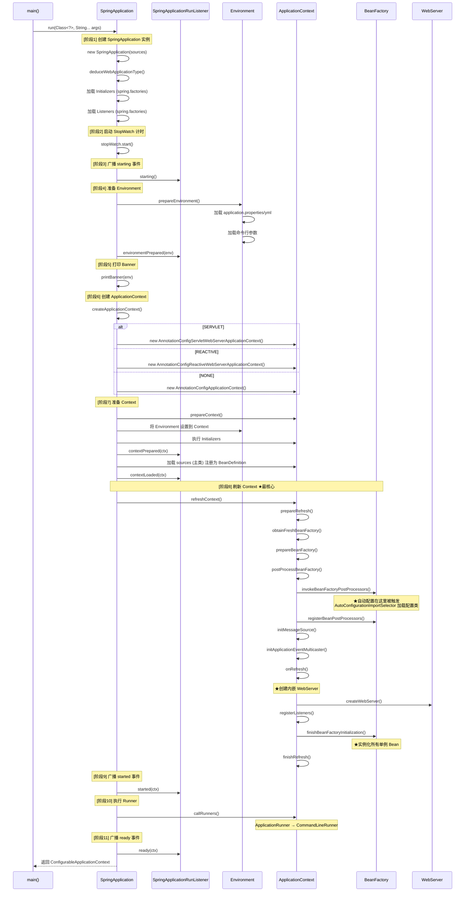
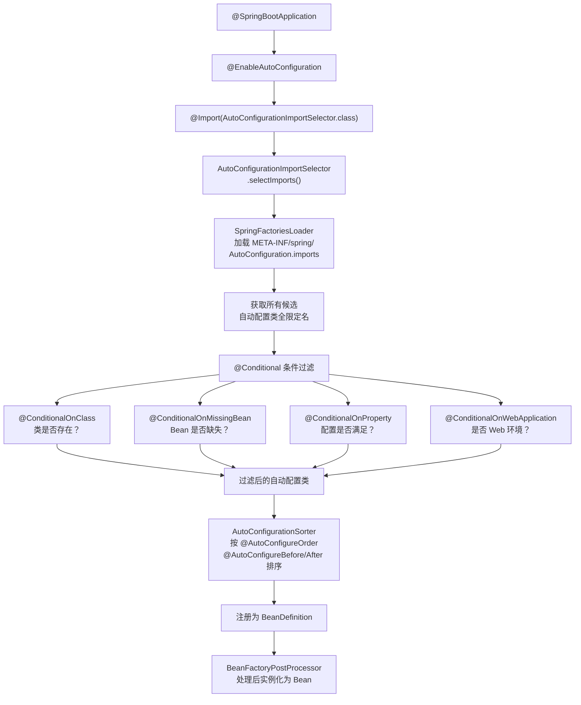
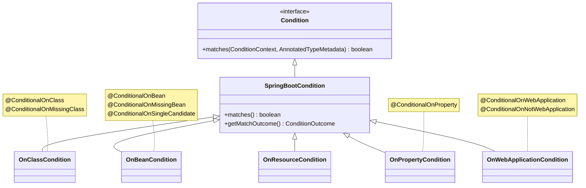
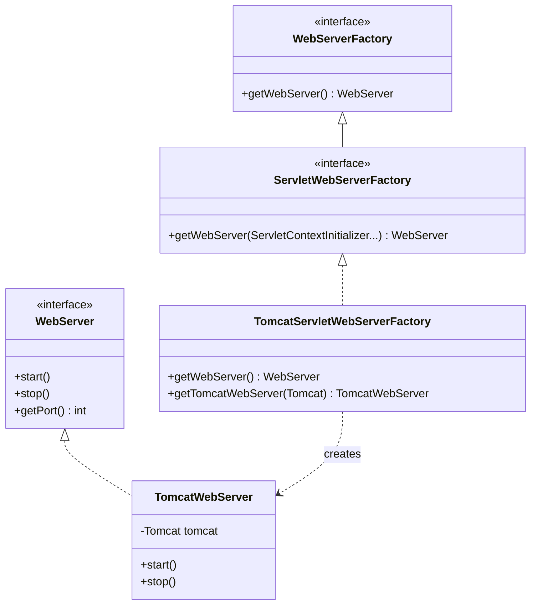
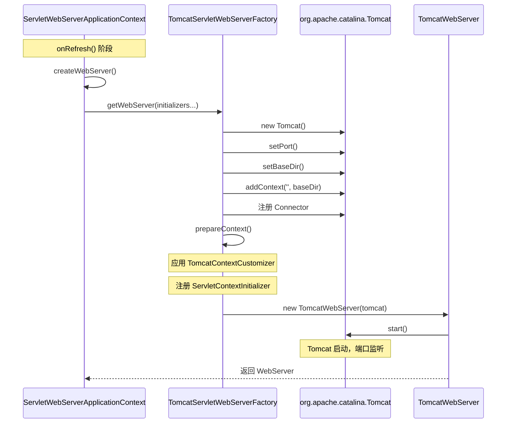
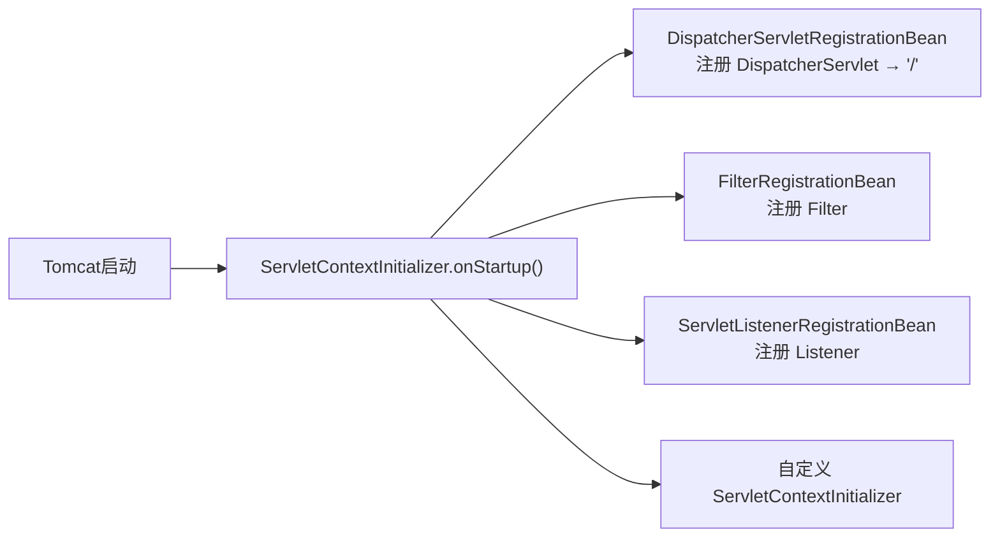
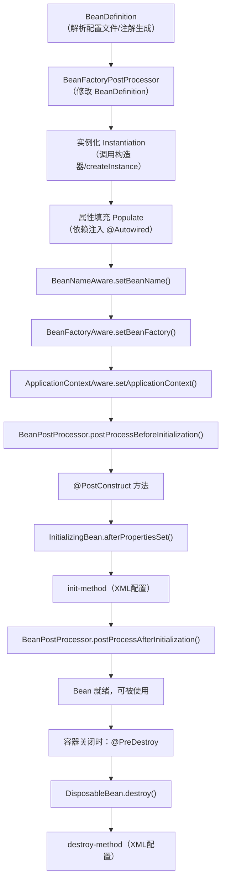
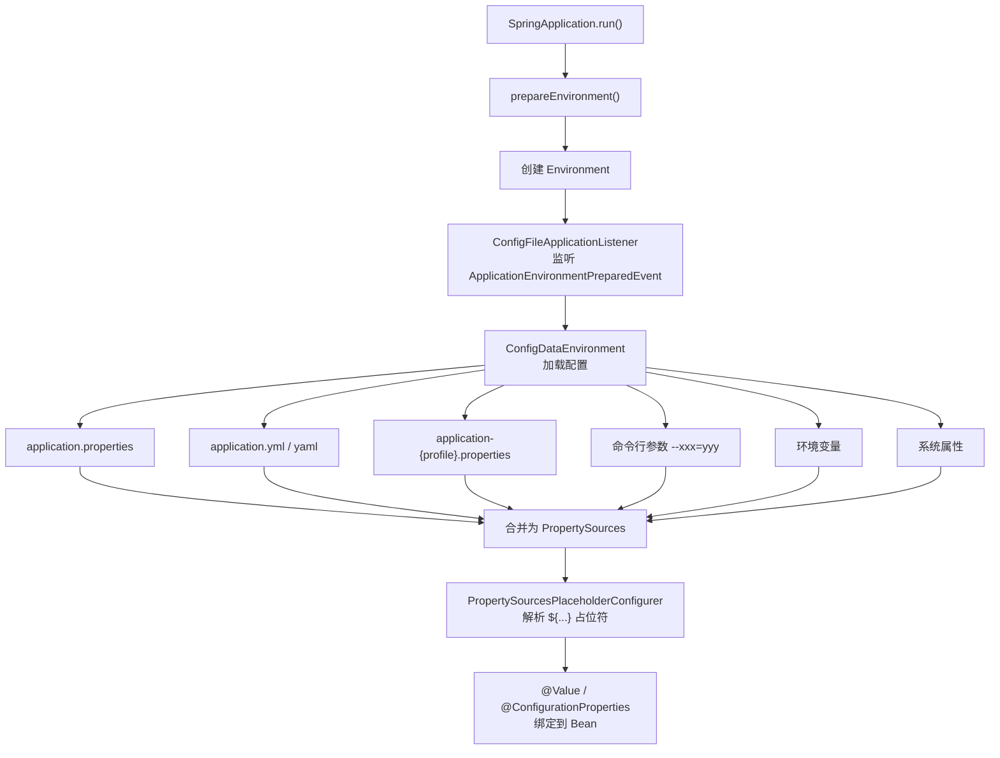
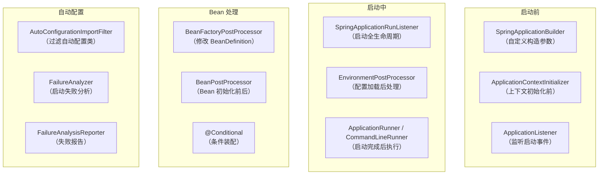

# Spring Boot 源码核心架构与启动流程详解

> **Spring Boot 3.x** 源码深度解析，图文并茂，逐层拆解核心流程。
> 
> 适合读者：熟悉 Spring 基础，想深入理解 Spring Boot 内部机制的开发者。

---

## 目录

- [1. 总体架构概览](#1-总体架构概览)
- [2. SpringApplication 启动流程](#2-springapplication-启动流程)
- [3. 自动配置机制](#3-自动配置机制)
- [4. 内嵌 Web 服务器](#4-内嵌-web-服务器)
- [5. Bean 生命周期](#5-bean-生命周期)
- [6. 外部化配置加载](#6-外部化配置加载)
- [7. 核心扩展点](#7-核心扩展点)

---

## 1. 总体架构概览

Spring Boot 的核心设计哲学是 **"约定优于配置"（Convention over Configuration）**。它在 Spring Framework 之上构建了四个关键层：

```mermaid
graph TB
    subgraph "应用层 Application Layer"
        A[你的 Spring Boot 应用<br/>@SpringBootApplication]
    end

    subgraph "自动配置层 Auto-Configuration"
        B1[@EnableAutoConfiguration]
        B2[AutoConfigurationImportSelector]
        B3[xxxAutoConfiguration 类]
        B4[@Conditional 条件注解]
    end

    subgraph "启动层 Bootstrap Layer"
        C1[SpringApplication]
        C2[ApplicationContext]
        C3[SpringApplicationRunListener]
    end

    subgraph "基础设施层 Infrastructure"
        D1[内嵌 Tomcat/Jetty/Undertow]
        D2[外部化配置 Environment]
        D3[SpringFactoriesLoader / imports]
    end

    A --> C1
    C1 --> C2
    C1 --> C3
    B1 --> B2
    B2 --> B3
    B3 --> B4
    C2 --> B1
    C1 --> D1
    C1 --> D2
    B2 --> D3
```

### 核心模块结构

```
spring-boot-project/
├── spring-boot/                          # 核心启动模块
│   └── src/main/java/org/springframework/boot/
│       ├── SpringApplication.java         # 启动入口，整体编排
│       ├── SpringApplicationRunListener   # 启动生命周期监听器
│       ├── ApplicationContextInitializer  # 上下文初始化器
│       ├── ApplicationListener            # 事件监听器
│       ├── web/
│       │   ├── context/                   # Web 上下文实现
│       │   └── server/                    # 内嵌服务器抽象
│       └── env/                           # 环境与配置加载
│
├── spring-boot-autoconfigure/            # 自动配置模块（最重要）
│   └── src/main/java/org/springframework/boot/autoconfigure/
│       ├── AutoConfigurationImportSelector.java  # 自动配置选择器
│       ├── condition/                           # 条件注解实现
│       └── web/servlet/                         # Web MVC 自动配置
│
└── spring-boot-starters/                 # Starter 依赖集合
    ├── spring-boot-starter-web/
    ├── spring-boot-starter-data-jpa/
    └── ...
```

---

## 2. SpringApplication 启动流程

这是 Spring Boot 最核心的流程。整个启动过程被 `SpringApplication.run()` 方法编排为**十个关键阶段**。

### 2.1 完整时序图



### 2.2 阶段详解

#### 阶段 1：SpringApplication 构造

```java
// SpringApplication.java
public SpringApplication(ResourceLoader resourceLoader, Class<?>... primarySources) {
    this.resourceLoader = resourceLoader;
    this.primarySources = new LinkedHashSet<>(Arrays.asList(primarySources));
    
    // ★ 推断应用类型
    this.webApplicationType = WebApplicationType.deduceFromClasspath();
    
    // ★ 加载 BootstrapRegistryInitializer
    this.bootstrapRegistryInitializers = new ArrayList<>(
        getSpringFactoriesInstances(BootstrapRegistryInitializer.class));
    
    // ★ 加载 ApplicationContextInitializer
    setInitializers(getSpringFactoriesInstances(ApplicationContextInitializer.class));
    
    // ★ 加载 ApplicationListener
    setListeners(getSpringFactoriesInstances(ApplicationListener.class));
    
    // ★ 推断 main 方法所在类
    this.mainApplicationClass = deduceMainApplicationClass();
}
```

**应用类型推断（`WebApplicationType.deduceFromClasspath()`）**：

| 类型 | 条件 | ApplicationContext |
|------|------|-------------------|
| `SERVLET` | classpath 存在 `DispatcherServlet` 且无 `DispatcherHandler` | `AnnotationConfigServletWebServerApplicationContext` |
| `REACTIVE` | classpath 存在 `DispatcherHandler` | `AnnotationConfigReactiveWebServerApplicationContext` |
| `NONE` | 两者都不存在 | `AnnotationConfigApplicationContext` |

#### 阶段 6：创建 ApplicationContext

```java
// SpringApplication.java
protected ConfigurableApplicationContext createApplicationContext() {
    return switch (this.webApplicationType) {
        case SERVLET -> new AnnotationConfigServletWebServerApplicationContext();
        case REACTIVE -> new AnnotationConfigReactiveWebServerApplicationContext();
        default -> new AnnotationConfigApplicationContext();
    };
}
```

ApplicationContext 继承体系：

```
AnnotationConfigServletWebServerApplicationContext
└── ServletWebServerApplicationContext
    └── GenericWebApplicationContext
        └── GenericApplicationContext
            └── AbstractApplicationContext  ← refresh() 在这里定义
```

#### 阶段 8：refreshContext() — 最核心的刷新流程

```java
// AbstractApplicationContext.java
public void refresh() throws BeansException, IllegalStateException {
    synchronized (this.startupShutdownMonitor) {
        // 1. 准备刷新：设置状态、校验属性
        prepareRefresh();
        
        // 2. 获取 BeanFactory
        ConfigurableListableBeanFactory beanFactory = obtainFreshBeanFactory();
        
        // 3. 准备 BeanFactory（注册基础组件）
        prepareBeanFactory(beanFactory);
        
        try {
            // 4. BeanFactory 后置处理（留给子类扩展）
            postProcessBeanFactory(beanFactory);
            
            // ★ 5. 调用 BeanFactoryPostProcessor
            //    这里触发 ConfigurationClassPostProcessor
            //    → 处理 @Configuration 类
            //    → @EnableAutoConfiguration → AutoConfigurationImportSelector
            //    → 加载所有自动配置类 → 条件过滤 → 注册 BeanDefinition
            invokeBeanFactoryPostProcessors(beanFactory);
            
            // 6. 注册 BeanPostProcessor
            registerBeanPostProcessors(beanFactory);
            
            // 7. 初始化 MessageSource（国际化）
            initMessageSource();
            
            // 8. 初始化事件广播器
            initApplicationEventMulticaster();
            
            // 9. ★ onRefresh(): 创建内嵌 WebServer
            onRefresh();
            
            // 10. 注册事件监听器
            registerListeners();
            
            // ★ 11. 实例化所有非懒加载的单例 Bean
            finishBeanFactoryInitialization(beanFactory);
            
            // 12. 完成刷新（发布 ContextRefreshedEvent）
            finishRefresh();
        }
        catch (BeansException ex) {
            destroyBeans();
            cancelRefresh(ex);
            throw ex;
        }
    }
}
```

---

## 3. 自动配置机制

自动配置是 Spring Boot 最核心的特性，它让你"开箱即用"零配置即可使用各种组件。

### 3.1 全链路流程图



### 3.2 @SpringBootApplication 的组成

```java
@Target(ElementType.TYPE)
@Retention(RetentionPolicy.RUNTIME)
@Documented
@Inherited
@SpringBootConfiguration         // ← 本质是 @Configuration
@EnableAutoConfiguration         // ← 开启自动配置
@ComponentScan(                  // ← 组件扫描
    excludeFilters = {
        @Filter(type = FilterType.CUSTOM, classes = TypeExcludeFilter.class),
        @Filter(type = FilterType.CUSTOM, classes = AutoConfigurationExcludeFilter.class)
    }
)
public @interface SpringBootApplication {
    // 可以排除特定自动配置类
    @AliasFor(annotation = EnableAutoConfiguration.class)
    Class<?>[] exclude() default {};
    
    // 可以排除特定自动配置类名
    @AliasFor(annotation = EnableAutoConfiguration.class)
    String[] excludeName() default {};
}
```

### 3.3 @EnableAutoConfiguration 核心实现

```java
@Target(ElementType.TYPE)
@Retention(RetentionPolicy.RUNTIME)
@Documented
@Inherited
@AutoConfigurationPackage        // 记录主类所在包，用于实体扫描
@Import(AutoConfigurationImportSelector.class)  // ★ 关键：导入选择器
public @interface EnableAutoConfiguration {
    String ENABLED_OVERRIDE_PROPERTY = "spring.boot.enableautoconfiguration";
    Class<?>[] exclude() default {};
    String[] excludeName() default {};
}
```

### 3.4 AutoConfigurationImportSelector 选择逻辑

```java
// AutoConfigurationImportSelector.java
public class AutoConfigurationImportSelector 
    implements DeferredImportSelector, BeanClassLoaderAware, 
               ResourceLoaderAware, BeanFactoryAware, EnvironmentAware {
    
    // 核心方法：选择要导入的自动配置类
    @Override
    public String[] selectImports(AnnotationMetadata annotationMetadata) {
        if (!isEnabled(annotationMetadata)) {
            return NO_IMPORTS;
        }
        
        // ★ 1. 获取所有候选自动配置类
        AutoConfigurationEntry entry = getAutoConfigurationEntry(annotationMetadata);
        return StringUtils.toStringArray(entry.getConfigurations());
    }
    
    protected AutoConfigurationEntry getAutoConfigurationEntry(
            AnnotationMetadata annotationMetadata) {
        
        // 2. 加载所有候选（从 spring.factories 或 imports 文件）
        List<String> configurations = getCandidateConfigurations(annotationMetadata, attributes);
        
        // 3. 去重
        configurations = removeDuplicates(configurations);
        
        // 4. 获取用户排除的配置类
        Set<String> exclusions = getExclusions(annotationMetadata, attributes);
        
        // 5. 应用过滤器（@Conditional 条件检查）
        configurations = filter(configurations, autoConfigurationMetadata);
        
        // 6. 触发 AutoConfigurationImportEvent 事件
        fireAutoConfigurationImportEvents(configurations, exclusions);
        
        return new AutoConfigurationEntry(configurations, exclusions);
    }
}
```

### 3.5 加载候选配置类的两种方式

**Spring Boot 3.x（新方式）**：
```
META-INF/spring/org.springframework.boot.autoconfigure.AutoConfiguration.imports
```
每行一个全限定类名，例如：
```
org.springframework.boot.autoconfigure.web.servlet.WebMvcAutoConfiguration
org.springframework.boot.autoconfigure.jdbc.DataSourceAutoConfiguration
org.springframework.boot.autoconfigure.orm.jpa.HibernateJpaAutoConfiguration
```

**Spring Boot 2.x（旧方式，已废弃）**：
```
META-INF/spring.factories
```
键值对格式：
```
org.springframework.boot.autoconfigure.EnableAutoConfiguration=\
org.springframework.boot.autoconfigure.web.servlet.WebMvcAutoConfiguration,\
org.springframework.boot.autoconfigure.jdbc.DataSourceAutoConfiguration
```

### 3.6 @Conditional 条件注解体系



常用条件注解：

| 注解 | 条件 | 典型用途 |
|------|------|----------|
| `@ConditionalOnClass` | classpath 中存在指定类 | `DataSourceAutoConfiguration` 检查是否有数据源驱动 |
| `@ConditionalOnMissingClass` | classpath 中不存在指定类 | 仅在没有某个库时启用备选方案 |
| `@ConditionalOnBean` | 容器中存在指定 Bean | 仅在用户自定义了某 Bean 后才启用 |
| `@ConditionalOnMissingBean` | 容器中不存在指定 Bean | 提供默认实现，用户可覆盖 |
| `@ConditionalOnProperty` | 配置属性满足条件 | `spring.datasource.url` 存在时启用数据源 |
| `@ConditionalOnWebApplication` | 是 Web 应用 | 区分 MVC 和 WebFlux 配置 |
| `@ConditionalOnResource` | 存在指定资源文件 | 检查 classpath 中是否有特定配置文件 |
| `@ConditionalOnExpression` | SpEL 表达式为 true | 复杂条件组合 |
| `@ConditionalOnJava` | Java 版本满足要求 | 根据 JDK 版本启用不同特性 |

### 3.7 自动配置示例：WebMvcAutoConfiguration

```java
@AutoConfiguration(
    after = { 
        DispatcherServletAutoConfiguration.class,
        TaskExecutionAutoConfiguration.class, 
        ValidationAutoConfiguration.class 
    }
)
@ConditionalOnWebApplication(type = Type.SERVLET)  // ★ 仅 Servlet 环境
@ConditionalOnClass({ Servlet.class, DispatcherServlet.class, WebMvcConfigurer.class })
@ConditionalOnMissingBean(WebMvcConfigurationSupport.class)  // ★ 用户自定义优先
@AutoConfigureOrder(Ordered.HIGHEST_PRECEDENCE + 10)
public class WebMvcAutoConfiguration {

    @Configuration(proxyBeanMethods = false)
    @Import(EnableWebMvcConfiguration.class)
    @EnableConfigurationProperties({ WebMvcProperties.class, WebProperties.class })
    @Order(0)
    public static class WebMvcAutoConfigurationAdapter 
            implements WebMvcConfigurer, ServletContextAware {
        
        // 配置视图解析器
        @Bean
        @ConditionalOnMissingBean
        public InternalResourceViewResolver defaultViewResolver() {
            // ...
        }
        
        // 配置静态资源
        @Override
        public void addResourceHandlers(ResourceHandlerRegistry registry) {
            // ...
        }
    }
}
```

---

## 4. 内嵌 Web 服务器

Spring Boot 内嵌了 Tomcat、Jetty、Undertow 三种 Servlet 容器，默认使用 Tomcat。

### 4.1 类层次结构



### 4.2 WebServer 创建流程



### 4.3 DispatcherServlet 注册流程

```java
// DispatcherServletAutoConfiguration.java
@AutoConfiguration
@ConditionalOnWebApplication(type = Type.SERVLET)
@ConditionalOnClass(DispatcherServlet.class)
public class DispatcherServletAutoConfiguration {

    // ★ Spring Boot 自动注册 DispatcherServlet
    @Bean(name = DEFAULT_DISPATCHER_SERVLET_BEAN_NAME)
    public DispatcherServlet dispatcherServlet(
            WebMvcProperties webMvcProperties) {
        DispatcherServlet dispatcherServlet = new DispatcherServlet();
        dispatcherServlet.setDispatchOptionsRequest(/*...*/);
        return dispatcherServlet;
    }

    // ★ 注册为 ServletRegistrationBean，映射到 "/"
    @Bean(name = DEFAULT_DISPATCHER_SERVLET_REGISTRATION_BEAN_NAME)
    @ConditionalOnBean(value = DispatcherServlet.class, 
            name = DEFAULT_DISPATCHER_SERVLET_BEAN_NAME)
    public DispatcherServletRegistrationBean dispatcherServletRegistration(
            DispatcherServlet dispatcherServlet,
            WebMvcProperties webMvcProperties) {
        
        DispatcherServletRegistrationBean registration = 
            new DispatcherServletRegistrationBean(dispatcherServlet, "/");
        registration.setLoadOnStartup(webMvcProperties.getServlet().getLoadOnStartup());
        return registration;
    }
}
```

**ServletContextInitializer 链**：



---

## 5. Bean 生命周期

Spring Bean 在 `AbstractApplicationContext.refresh()` → `finishBeanFactoryInitialization()` 阶段完成实例化。

### 5.1 完整生命周期



### 5.2 BeanPostProcessor 的桥梁作用

```java
public interface BeanPostProcessor {
    // 在初始化之前调用
    @Nullable
    default Object postProcessBeforeInitialization(Object bean, String beanName) 
            throws BeansException {
        return bean;
    }
    
    // 在初始化之后调用
    @Nullable
    default Object postProcessAfterInitialization(Object bean, String beanName) 
            throws BeansException {
        return bean;
    }
}
```

**核心 BeanPostProcessor 实现**：

| 实现类 | 作用 |
|--------|------|
| `AutowiredAnnotationBeanPostProcessor` | 处理 `@Autowired`、`@Value` 注入 |
| `CommonAnnotationBeanPostProcessor` | 处理 `@PostConstruct`、`@PreDestroy` |
| `ConfigurationPropertiesBindingPostProcessor` | 绑定 `@ConfigurationProperties` |
| `ApplicationContextAwareProcessor` | 注入 `ApplicationContext` 等 Aware 接口 |

### 5.3 BeanFactoryPostProcessor 的角色

```java
public interface BeanFactoryPostProcessor {
    // 在所有 BeanDefinition 加载后、实例化前调用
    void postProcessBeanFactory(ConfigurableListableBeanFactory beanFactory) 
            throws BeansException;
}
```

**关键实现：**

```java
// ConfigurationClassPostProcessor.java — 处理 @Configuration 类
// 这是触发自动配置的关键！
public class ConfigurationClassPostProcessor implements BeanDefinitionRegistryPostProcessor {
    
    @Override
    public void postProcessBeanDefinitionRegistry(BeanDefinitionRegistry registry) {
        // 解析 @Configuration 类
        ConfigurationClassParser parser = new ConfigurationClassParser(/*...*/);
        // ★ 这里面会处理 @Import，触发 AutoConfigurationImportSelector
        parser.parse(configCandidates);
    }
}
```

---

## 6. 外部化配置加载

Spring Boot 支持从多种来源加载配置，并按优先级合并。

### 6.1 配置加载流程



### 6.2 配置优先级（从高到低）

```
1. 命令行参数 (--server.port=8081)
2. SPRING_APPLICATION_JSON 环境变量
3. ServletConfig 初始化参数
4. JNDI 属性
5. Java 系统属性 (-Dserver.port=8081)
6. 操作系统环境变量
7. application-{profile}.properties（外部 jar 包外）
8. application-{profile}.properties（jar 包内）
9. application.properties（外部 jar 包外）
10. application.properties（jar 包内）
11. @PropertySource 注解
12. SpringApplication.setDefaultProperties()
```

### 6.3 @ConfigurationProperties 绑定

```java
// 配置类定义
@ConfigurationProperties(prefix = "server")
public class ServerProperties {
    private int port = 8080;       // 默认值
    private String address;
    private Servlet servlet = new Servlet();
    
    public static class Servlet {
        private String contextPath;
        private int sessionTimeout = 30 * 60;
    }
}

// 在自动配置中启用
@EnableConfigurationProperties(ServerProperties.class)
public class SomeAutoConfiguration {
    // ...
}
```

对应配置：
```properties
server.port=9090
server.address=0.0.0.0
server.servlet.context-path=/api
server.servlet.session-timeout=3600
```

---

## 7. 核心扩展点

Spring Boot 提供了丰富的扩展点，让你可以在启动各阶段插入自定义逻辑。

### 7.1 扩展点全景图



### 7.2 常用扩展点实现示例

#### ApplicationContextInitializer

```java
// 在 SpringApplication 上下文准备阶段执行
public class MyInitializer implements ApplicationContextInitializer<ConfigurableApplicationContext> {
    @Override
    public void initialize(ConfigurableApplicationContext ctx) {
        // 添加自定义 PropertySource
        ctx.getEnvironment().getPropertySources().addFirst(
            new MapPropertySource("custom", Map.of("my.key", "value"))
        );
    }
}

// 注册方式 1：META-INF/spring.factories
// org.springframework.context.ApplicationContextInitializer=\
// com.example.MyInitializer

// 注册方式 2：代码
new SpringApplication(MyApp.class)
    .addInitializers(new MyInitializer())
    .run(args);
```

#### ApplicationRunner

```java
@Component
@Order(1)
public class DataInitializer implements ApplicationRunner {
    @Override
    public void run(ApplicationArguments args) throws Exception {
        // 容器完全启动后执行
        // 可以在这里做数据初始化、缓存预热等
    }
}

// CommandLineRunner 类似，提供原始 String[] args
@Component
public class StartupLogger implements CommandLineRunner {
    @Override
    public void run(String... args) throws Exception {
        System.out.println("Application started with args: " + Arrays.toString(args));
    }
}
```

#### FailureAnalyzer

```java
// 自定义启动失败分析
public class PortInUseFailureAnalyzer 
        extends AbstractFailureAnalyzer<PortInUseException> {
    
    @Override
    protected FailureAnalysis analyze(Throwable rootFailure, PortInUseException cause) {
        return new FailureAnalysis(
            "端口 " + cause.getPort() + " 已被占用",
            "请检查是否有其他进程占用该端口，或修改 server.port 配置",
            cause
        );
    }
}

// META-INF/spring.factories
// org.springframework.boot.diagnostics.FailureAnalyzer=\
// com.example.PortInUseFailureAnalyzer
```

---

## 总结

Spring Boot 的源码架构可以概括为 **"一个入口，三级编排，N 个扩展点"**：

| 层次 | 核心类 | 职责 |
|------|--------|------|
| **启动编排** | `SpringApplication` | 协调整个启动流程，管理生命周期事件 |
| **自动配置** | `AutoConfigurationImportSelector` | 按条件加载配置类，实现"约定优于配置" |
| **上下文刷新** | `AbstractApplicationContext.refresh()` | BeanDefinition → 实例化 → 初始化 → 就绪 |
| **内嵌服务器** | `ServletWebServerApplicationContext` | 零配置集成 Tomcat/Jetty/Undertow |
| **外部化配置** | `ConfigDataEnvironment` | 多来源配置加载与优先级合并 |

理解这些核心流程后，无论是排查启动问题、自定义 Starter、还是阅读其他 Spring 生态项目的源码，都将事半功倍。

---

*本文基于 Spring Boot 3.x 源码编写。*
