# Spring Boot 源码核心架构与启动流程详解

> **Spring Boot 3.x** 源码深度解析，图文并茂，逐层拆解核心流程。
> 
> 适合读者：熟悉 Spring 基础，想深入理解 Spring Boot 内部机制的开发者。

---

## 目录

### 第一部分：Spring Boot 核心架构
- [1. 总体架构概览](#1-总体架构概览)
- [2. SpringApplication 启动流程](#2-springapplication-启动流程)
- [3. 自动配置机制](#3-自动配置机制)
- [4. 内嵌 Web 服务器](#4-内嵌-web-服务器)
- [5. Bean 生命周期](#5-bean-生命周期)
- [6. 外部化配置加载](#6-外部化配置加载)
- [7. 核心扩展点](#7-核心扩展点)

### 第二部分：Spring Framework 源码深度解析
- [8. IoC 容器核心架构](#8-ioc-容器核心架构)
- [9. 循环依赖与三级缓存](#9-循环依赖与三级缓存)
- [10. AOP 代理机制](#10-aop-代理机制)
- [11. Spring MVC 请求分发](#11-spring-mvc-请求分发)
- [12. 事务管理](#12-事务管理)
- [13. 事件机制](#13-事件机制)
- [14. 启动全链路串联](#14-启动全链路串联)
- [15. 关键扩展点速查](#15-关键扩展点速查)

### 第三部分：Spring 生态深度解析
- [16. Spring Boot Actuator](#16-spring-boot-actuator)
- [17. Spring Data JPA 代理](#17-spring-data-jpa-代理)
- [18. Spring Security 过滤器链](#18-spring-security-过滤器链)
- [19. 自定义 Spring Boot Starter](#19-自定义-spring-boot-starter)
- [20. Spring Boot Test 切片](#20-spring-boot-test-切片)
- [21. 异常处理机制](#21-异常处理机制)
- [22. Spring Cache 抽象](#22-spring-cache-抽象)
- [23. 文档全景导航](#23-文档全景导航)

### 第四部分：实战专家指南
- [24. 设计哲学与架构意图](#24-设计哲学与架构意图)
- [25. 常见坑与反模式](#25-常见坑与反模式)
- [26. 调试与诊断实战](#26-调试与诊断实战)
- [27. 性能优化指南](#27-性能优化指南)
- [28. 最佳实践与选型决策](#28-最佳实践与选型决策)
- [29. Spring Boot 3.x 新特性](#29-spring-boot-3x-新特性)
- [30. Spring Boot 2.x → 3.x 迁移指南](#30-spring-boot-2x--3x-迁移指南)
- [31. 每章速查卡片](#31-每章速查卡片)
- [32. 互动思考题（含参考答案）](#32-互动思考题)

---

## 1. 总体架构概览

Spring Boot 的核心设计哲学是 **"约定优于配置"（Convention over Configuration）**。它在 Spring Framework 之上构建了四个关键层：

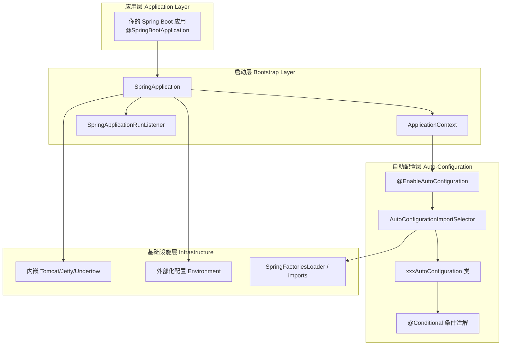
```mermaid
flowchart TB
    subgraph APP["应用层 Application Layer"]
        A["你的 Spring Boot 应用<br/>@SpringBootApplication"]
    end

    subgraph AC["自动配置层 Auto-Configuration"]
        B1["@EnableAutoConfiguration"]
        B2["AutoConfigurationImportSelector"]
        B3["xxxAutoConfiguration 类"]
        B4["@Conditional 条件注解"]
    end

    subgraph BL["启动层 Bootstrap Layer"]
        C1["SpringApplication"]
        C2["ApplicationContext"]
        C3["SpringApplicationRunListener"]
    end

    subgraph INFRA["基础设施层 Infrastructure"]
        D1["内嵌 Tomcat/Jetty/Undertow"]
        D2["外部化配置 Environment"]
        D3["SpringFactoriesLoader / imports"]
    end

    A --> C1
    C1 --> C2
    C1 --> C3
    B1 --> B2
    B2 --> B3
    B3 --> B4
    C2 --> B1
    C1 --> D1
    C1 --> D2
    B2 --> D3
```

### 核心模块结构

```
spring-boot-project/
├── spring-boot/                          # 核心启动模块
│   └── src/main/java/org/springframework/boot/
│       ├── SpringApplication.java         # 启动入口，整体编排
│       ├── SpringApplicationRunListener   # 启动生命周期监听器
│       ├── ApplicationContextInitializer  # 上下文初始化器
│       ├── ApplicationListener            # 事件监听器
│       ├── web/
│       │   ├── context/                   # Web 上下文实现
│       │   └── server/                    # 内嵌服务器抽象
│       └── env/                           # 环境与配置加载
│
├── spring-boot-autoconfigure/            # 自动配置模块（最重要）
│   └── src/main/java/org/springframework/boot/autoconfigure/
│       ├── AutoConfigurationImportSelector.java  # 自动配置选择器
│       ├── condition/                           # 条件注解实现
│       └── web/servlet/                         # Web MVC 自动配置
│
└── spring-boot-starters/                 # Starter 依赖集合
    ├── spring-boot-starter-web/
    ├── spring-boot-starter-data-jpa/
    └── ...
```

---

## 2. SpringApplication 启动流程

这是 Spring Boot 最核心的流程。整个启动过程被 `SpringApplication.run()` 方法编排为**十个关键阶段**。

### 2.1 完整时序图


```mermaid
sequenceDiagram
    participant Main as main()
    participant SA as SpringApplication
    participant Listener as SpringApplicationRunListener
    participant Env as Environment
    participant Ctx as ApplicationContext
    participant BF as BeanFactory
    participant Server as WebServer

    Main->>SA: run(Class<?>, String... args)
    
    Note over SA: [阶段1] 创建 SpringApplication 实例
    SA->>SA: new SpringApplication(sources)
    SA->>SA: deduceWebApplicationType()
    SA->>SA: 加载 Initializers (spring.factories)
    SA->>SA: 加载 Listeners (spring.factories)
    
    Note over SA: [阶段2] 启动 StopWatch 计时
    SA->>SA: stopWatch.start()
    
    Note over SA: [阶段3] 广播 starting 事件
    SA->>Listener: starting()
    
    Note over SA: [阶段4] 准备 Environment
    SA->>Env: prepareEnvironment()
    Env->>Env: 加载 application.properties/yml
    Env->>Env: 加载命令行参数
    SA->>Listener: environmentPrepared(env)
    
    Note over SA: [阶段5] 打印 Banner
    SA->>SA: printBanner(env)
    
    Note over SA: [阶段6] 创建 ApplicationContext
    SA->>SA: createApplicationContext()
    alt SERVLET
        SA->>Ctx: new AnnotationConfigServletWebServerApplicationContext()
    else REACTIVE
        SA->>Ctx: new AnnotationConfigReactiveWebServerApplicationContext()
    else NONE
        SA->>Ctx: new AnnotationConfigApplicationContext()
    end
    
    Note over SA: [阶段7] 准备 Context
    SA->>Ctx: prepareContext()
    SA->>Env: 将 Environment 设置到 Context
    SA->>Ctx: 执行 Initializers
    SA->>Listener: contextPrepared(ctx)
    SA->>Ctx: "加载 sources (主类) 注册为 BeanDefinition"
    SA->>Listener: contextLoaded(ctx)
    
    Note over SA,BF: [阶段8] 刷新 Context ★最核心
    SA->>Ctx: refreshContext()
    Ctx->>Ctx: prepareRefresh()
    Ctx->>Ctx: obtainFreshBeanFactory()
    Ctx->>Ctx: prepareBeanFactory()
    Ctx->>Ctx: postProcessBeanFactory()
    Ctx->>BF: invokeBeanFactoryPostProcessors()
    Note over BF: ★自动配置在这里被触发<br/>AutoConfigurationImportSelector 加载配置类
    Ctx->>BF: registerBeanPostProcessors()
    Ctx->>Ctx: initMessageSource()
    Ctx->>Ctx: initApplicationEventMulticaster()
    Ctx->>Ctx: onRefresh()
    Note over Ctx: ★创建内嵌 WebServer
    Ctx->>Server: createWebServer()
    Ctx->>Ctx: registerListeners()
    Ctx->>BF: finishBeanFactoryInitialization()
    Note over BF: ★实例化所有单例 Bean
    Ctx->>Ctx: finishRefresh()
    
    Note over SA: [阶段9] 广播 started 事件
    SA->>Listener: started(ctx)
    
    Note over SA: [阶段10] 执行 Runner
    SA->>Ctx: callRunners()
    Note over Ctx: ApplicationRunner → CommandLineRunner
    
    Note over SA: [阶段11] 广播 ready 事件
    SA->>Listener: ready(ctx)
    
    SA-->>Main: 返回 ConfigurableApplicationContext
```

### 2.2 阶段详解

#### 阶段 1：SpringApplication 构造

```java
// SpringApplication.java
public SpringApplication(ResourceLoader resourceLoader, Class<?>... primarySources) {
    this.resourceLoader = resourceLoader;
    this.primarySources = new LinkedHashSet<>(Arrays.asList(primarySources));
    
    // ★ 推断应用类型
    this.webApplicationType = WebApplicationType.deduceFromClasspath();
    
    // ★ 加载 BootstrapRegistryInitializer
    this.bootstrapRegistryInitializers = new ArrayList<>(
        getSpringFactoriesInstances(BootstrapRegistryInitializer.class));
    
    // ★ 加载 ApplicationContextInitializer
    setInitializers(getSpringFactoriesInstances(ApplicationContextInitializer.class));
    
    // ★ 加载 ApplicationListener
    setListeners(getSpringFactoriesInstances(ApplicationListener.class));
    
    // ★ 推断 main 方法所在类
    this.mainApplicationClass = deduceMainApplicationClass();
}
```

**应用类型推断（`WebApplicationType.deduceFromClasspath()`）**：

| 类型 | 条件 | ApplicationContext |
|------|------|-------------------|
| `SERVLET` | classpath 存在 `DispatcherServlet` 且无 `DispatcherHandler` | `AnnotationConfigServletWebServerApplicationContext` |
| `REACTIVE` | classpath 存在 `DispatcherHandler` | `AnnotationConfigReactiveWebServerApplicationContext` |
| `NONE` | 两者都不存在 | `AnnotationConfigApplicationContext` |

#### 阶段 6：创建 ApplicationContext

```java
// SpringApplication.java
protected ConfigurableApplicationContext createApplicationContext() {
    return switch (this.webApplicationType) {
        case SERVLET -> new AnnotationConfigServletWebServerApplicationContext();
        case REACTIVE -> new AnnotationConfigReactiveWebServerApplicationContext();
        default -> new AnnotationConfigApplicationContext();
    };
}
```

ApplicationContext 继承体系：

```
AnnotationConfigServletWebServerApplicationContext
└── ServletWebServerApplicationContext
    └── GenericWebApplicationContext
        └── GenericApplicationContext
            └── AbstractApplicationContext  ← refresh() 在这里定义
```

#### 阶段 8：refreshContext() — 最核心的刷新流程

```java
// AbstractApplicationContext.java
public void refresh() throws BeansException, IllegalStateException {
    synchronized (this.startupShutdownMonitor) {
        // 1. 准备刷新：设置状态、校验属性
        prepareRefresh();
        
        // 2. 获取 BeanFactory
        ConfigurableListableBeanFactory beanFactory = obtainFreshBeanFactory();
        
        // 3. 准备 BeanFactory（注册基础组件）
        prepareBeanFactory(beanFactory);
        
        try {
            // 4. BeanFactory 后置处理（留给子类扩展）
            postProcessBeanFactory(beanFactory);
            
            // ★ 5. 调用 BeanFactoryPostProcessor
            //    这里触发 ConfigurationClassPostProcessor
            //    → 处理 @Configuration 类
            //    → @EnableAutoConfiguration → AutoConfigurationImportSelector
            //    → 加载所有自动配置类 → 条件过滤 → 注册 BeanDefinition
            invokeBeanFactoryPostProcessors(beanFactory);
            
            // 6. 注册 BeanPostProcessor
            registerBeanPostProcessors(beanFactory);
            
            // 7. 初始化 MessageSource（国际化）
            initMessageSource();
            
            // 8. 初始化事件广播器
            initApplicationEventMulticaster();
            
            // 9. ★ onRefresh(): 创建内嵌 WebServer
            onRefresh();
            
            // 10. 注册事件监听器
            registerListeners();
            
            // ★ 11. 实例化所有非懒加载的单例 Bean
            finishBeanFactoryInitialization(beanFactory);
            
            // 12. 完成刷新（发布 ContextRefreshedEvent）
            finishRefresh();
        }
        catch (BeansException ex) {
            destroyBeans();
            cancelRefresh(ex);
            throw ex;
        }
    }
}
```

---

## 3. 自动配置机制

自动配置是 Spring Boot 最核心的特性，它让你"开箱即用"零配置即可使用各种组件。

### 3.1 全链路流程图

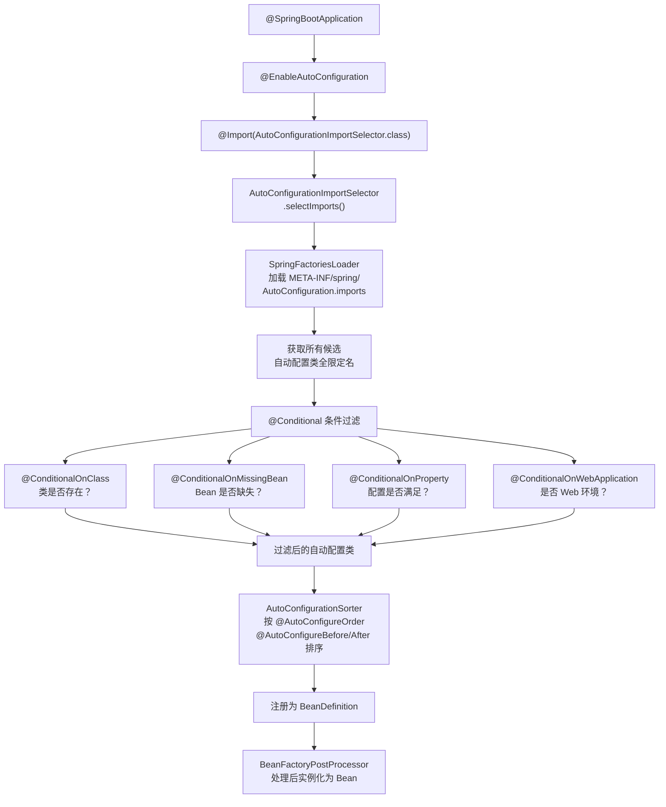
```mermaid
flowchart TD
    A["@SpringBootApplication"] --> B["@EnableAutoConfiguration"]
    B --> C["@Import(AutoConfigurationImportSelector.class)"]
    C --> D["AutoConfigurationImportSelector<br/>.selectImports()"]
    
    D --> E["SpringFactoriesLoader<br/>加载 META-INF/spring/<br/>AutoConfiguration.imports"]
    
    E --> F["获取所有候选<br/>自动配置类全限定名"]
    
    F --> G["@Conditional 条件过滤"]
    
    G --> G1["@ConditionalOnClass<br/>类是否存在？"]
    G --> G2["@ConditionalOnMissingBean<br/>Bean 是否缺失？"]
    G --> G3["@ConditionalOnProperty<br/>配置是否满足？"]
    G --> G4["@ConditionalOnWebApplication<br/>是否 Web 环境？"]
    
    G1 --> H["过滤后的自动配置类"]
    G2 --> H
    G3 --> H
    G4 --> H
    
    H --> I["AutoConfigurationSorter<br/>按 @AutoConfigureOrder<br/>@AutoConfigureBefore/After 排序"]
    
    I --> J["注册为 BeanDefinition"]
    J --> K["BeanFactoryPostProcessor<br/>处理后实例化为 Bean"]
```

### 3.2 @SpringBootApplication 的组成

```java
@Target(ElementType.TYPE)
@Retention(RetentionPolicy.RUNTIME)
@Documented
@Inherited
@SpringBootConfiguration         // ← 本质是 @Configuration
@EnableAutoConfiguration         // ← 开启自动配置
@ComponentScan(                  // ← 组件扫描
    excludeFilters = {
        @Filter(type = FilterType.CUSTOM, classes = TypeExcludeFilter.class),
        @Filter(type = FilterType.CUSTOM, classes = AutoConfigurationExcludeFilter.class)
    }
)
public @interface SpringBootApplication {
    // 可以排除特定自动配置类
    @AliasFor(annotation = EnableAutoConfiguration.class)
    Class<?>[] exclude() default {};
    
    // 可以排除特定自动配置类名
    @AliasFor(annotation = EnableAutoConfiguration.class)
    String[] excludeName() default {};
}
```

### 3.3 @EnableAutoConfiguration 核心实现

```java
@Target(ElementType.TYPE)
@Retention(RetentionPolicy.RUNTIME)
@Documented
@Inherited
@AutoConfigurationPackage        // 记录主类所在包，用于实体扫描
@Import(AutoConfigurationImportSelector.class)  // ★ 关键：导入选择器
public @interface EnableAutoConfiguration {
    String ENABLED_OVERRIDE_PROPERTY = "spring.boot.enableautoconfiguration";
    Class<?>[] exclude() default {};
    String[] excludeName() default {};
}
```

### 3.4 AutoConfigurationImportSelector 选择逻辑

```java
// AutoConfigurationImportSelector.java
public class AutoConfigurationImportSelector 
    implements DeferredImportSelector, BeanClassLoaderAware, 
               ResourceLoaderAware, BeanFactoryAware, EnvironmentAware {
    
    // 核心方法：选择要导入的自动配置类
    @Override
    public String[] selectImports(AnnotationMetadata annotationMetadata) {
        if (!isEnabled(annotationMetadata)) {
            return NO_IMPORTS;
        }
        
        // ★ 1. 获取所有候选自动配置类
        AutoConfigurationEntry entry = getAutoConfigurationEntry(annotationMetadata);
        return StringUtils.toStringArray(entry.getConfigurations());
    }
    
    protected AutoConfigurationEntry getAutoConfigurationEntry(
            AnnotationMetadata annotationMetadata) {
        
        // 2. 加载所有候选（从 spring.factories 或 imports 文件）
        List<String> configurations = getCandidateConfigurations(annotationMetadata, attributes);
        
        // 3. 去重
        configurations = removeDuplicates(configurations);
        
        // 4. 获取用户排除的配置类
        Set<String> exclusions = getExclusions(annotationMetadata, attributes);
        
        // 5. 应用过滤器（@Conditional 条件检查）
        configurations = filter(configurations, autoConfigurationMetadata);
        
        // 6. 触发 AutoConfigurationImportEvent 事件
        fireAutoConfigurationImportEvents(configurations, exclusions);
        
        return new AutoConfigurationEntry(configurations, exclusions);
    }
}
```

### 3.5 加载候选配置类的两种方式

**Spring Boot 3.x（新方式）**：
```
META-INF/spring/org.springframework.boot.autoconfigure.AutoConfiguration.imports
```
每行一个全限定类名，例如：
```
org.springframework.boot.autoconfigure.web.servlet.WebMvcAutoConfiguration
org.springframework.boot.autoconfigure.jdbc.DataSourceAutoConfiguration
org.springframework.boot.autoconfigure.orm.jpa.HibernateJpaAutoConfiguration
```

**Spring Boot 2.x（旧方式，已废弃）**：
```
META-INF/spring.factories
```
键值对格式：
```
org.springframework.boot.autoconfigure.EnableAutoConfiguration=\
org.springframework.boot.autoconfigure.web.servlet.WebMvcAutoConfiguration,\
org.springframework.boot.autoconfigure.jdbc.DataSourceAutoConfiguration
```

### 3.6 @Conditional 条件注解体系

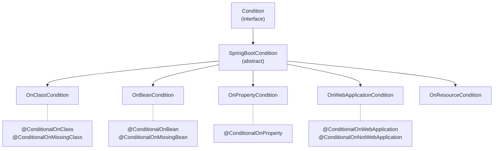
```mermaid
flowchart TB
    Condition["Condition<br/>(interface)"] --> SpringBootCondition["SpringBootCondition<br/>(abstract)"]
    SpringBootCondition --> OnClassCondition["OnClassCondition"]
    SpringBootCondition --> OnBeanCondition["OnBeanCondition"]
    SpringBootCondition --> OnPropertyCondition["OnPropertyCondition"]
    SpringBootCondition --> OnWebApplicationCondition["OnWebApplicationCondition"]
    SpringBootCondition --> OnResourceCondition["OnResourceCondition"]
    
    OnClassCondition -.- A["@ConditionalOnClass<br/>@ConditionalOnMissingClass"]
    OnBeanCondition -.- B["@ConditionalOnBean<br/>@ConditionalOnMissingBean"]
    OnPropertyCondition -.- C["@ConditionalOnProperty"]
    OnWebApplicationCondition -.- D["@ConditionalOnWebApplication<br/>@ConditionalOnNotWebApplication"]
```

常用条件注解：

| 注解 | 条件 | 典型用途 |
|------|------|----------|
| `@ConditionalOnClass` | classpath 中存在指定类 | `DataSourceAutoConfiguration` 检查是否有数据源驱动 |
| `@ConditionalOnMissingClass` | classpath 中不存在指定类 | 仅在没有某个库时启用备选方案 |
| `@ConditionalOnBean` | 容器中存在指定 Bean | 仅在用户自定义了某 Bean 后才启用 |
| `@ConditionalOnMissingBean` | 容器中不存在指定 Bean | 提供默认实现，用户可覆盖 |
| `@ConditionalOnProperty` | 配置属性满足条件 | `spring.datasource.url` 存在时启用数据源 |
| `@ConditionalOnWebApplication` | 是 Web 应用 | 区分 MVC 和 WebFlux 配置 |
| `@ConditionalOnResource` | 存在指定资源文件 | 检查 classpath 中是否有特定配置文件 |
| `@ConditionalOnExpression` | SpEL 表达式为 true | 复杂条件组合 |
| `@ConditionalOnJava` | Java 版本满足要求 | 根据 JDK 版本启用不同特性 |

### 3.7 自动配置示例：WebMvcAutoConfiguration

```java
@AutoConfiguration(
    after = { 
        DispatcherServletAutoConfiguration.class,
        TaskExecutionAutoConfiguration.class, 
        ValidationAutoConfiguration.class 
    }
)
@ConditionalOnWebApplication(type = Type.SERVLET)  // ★ 仅 Servlet 环境
@ConditionalOnClass({ Servlet.class, DispatcherServlet.class, WebMvcConfigurer.class })
@ConditionalOnMissingBean(WebMvcConfigurationSupport.class)  // ★ 用户自定义优先
@AutoConfigureOrder(Ordered.HIGHEST_PRECEDENCE + 10)
public class WebMvcAutoConfiguration {

    @Configuration(proxyBeanMethods = false)
    @Import(EnableWebMvcConfiguration.class)
    @EnableConfigurationProperties({ WebMvcProperties.class, WebProperties.class })
    @Order(0)
    public static class WebMvcAutoConfigurationAdapter 
            implements WebMvcConfigurer, ServletContextAware {
        
        // 配置视图解析器
        @Bean
        @ConditionalOnMissingBean
        public InternalResourceViewResolver defaultViewResolver() {
            // ...
        }
        
        // 配置静态资源
        @Override
        public void addResourceHandlers(ResourceHandlerRegistry registry) {
            // ...
        }
    }
}
```

---

## 4. 内嵌 Web 服务器

Spring Boot 内嵌了 Tomcat、Jetty、Undertow 三种 Servlet 容器，默认使用 Tomcat。

### 4.1 类层次结构

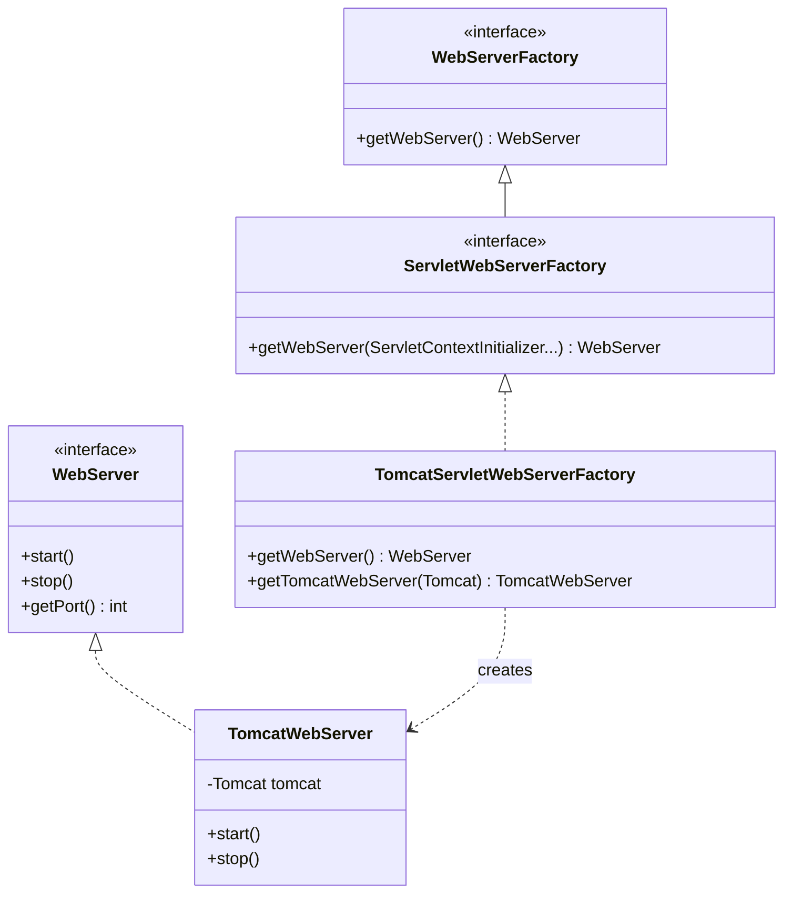
```mermaid
classDiagram
    class WebServer {
        <<interface>>
        +start()
        +stop()
        +getPort() int
    }
    
    class WebServerFactory {
        <<interface>>
        +getWebServer() WebServer
    }
    
    class ServletWebServerFactory {
        <<interface>>
        +getWebServer(ServletContextInitializer...) WebServer
    }
    
    class TomcatServletWebServerFactory {
        +getWebServer() WebServer
        +getTomcatWebServer(Tomcat) TomcatWebServer
    }
    
    class TomcatWebServer {
        -Tomcat tomcat
        +start()
        +stop()
    }
    
    WebServer <|.. TomcatWebServer
    WebServerFactory <|-- ServletWebServerFactory
    ServletWebServerFactory <|.. TomcatServletWebServerFactory
    TomcatServletWebServerFactory ..> TomcatWebServer : creates
```

### 4.2 WebServer 创建流程

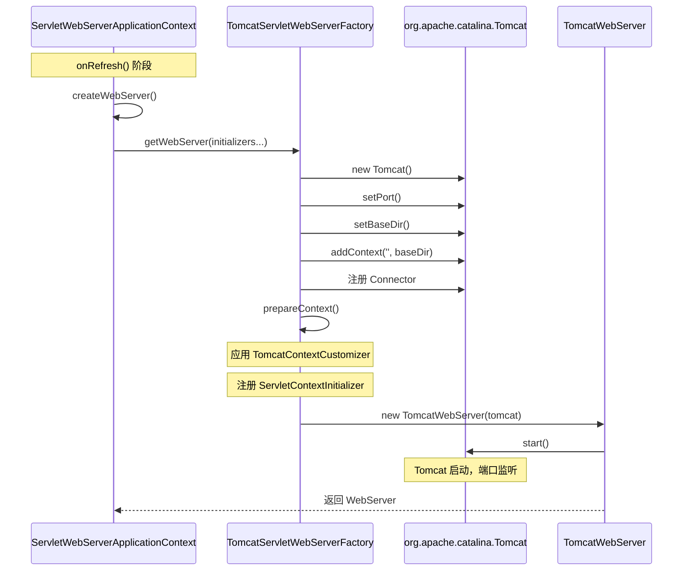
```mermaid
sequenceDiagram
    participant AC as ServletWebServerApplicationContext
    participant Factory as TomcatServletWebServerFactory
    participant Tomcat as org.apache.catalina.Tomcat
    participant WS as TomcatWebServer
    
    Note over AC: onRefresh() 阶段
    AC->>AC: createWebServer()
    AC->>Factory: getWebServer(initializers...)
    
    Factory->>Tomcat: new Tomcat()
    Factory->>Tomcat: setPort()
    Factory->>Tomcat: setBaseDir()
    Factory->>Tomcat: addContext('', baseDir)
    Factory->>Tomcat: 注册 Connector
    
    Factory->>Factory: prepareContext()
    Note over Factory: 应用 TomcatContextCustomizer
    Note over Factory: 注册 ServletContextInitializer
    
    Factory->>WS: new TomcatWebServer(tomcat)
    WS->>Tomcat: start()
    Note over Tomcat: Tomcat 启动，端口监听
    
    WS-->>AC: 返回 WebServer
```

### 4.3 DispatcherServlet 注册流程

```java
// DispatcherServletAutoConfiguration.java
@AutoConfiguration
@ConditionalOnWebApplication(type = Type.SERVLET)
@ConditionalOnClass(DispatcherServlet.class)
public class DispatcherServletAutoConfiguration {

    // ★ Spring Boot 自动注册 DispatcherServlet
    @Bean(name = DEFAULT_DISPATCHER_SERVLET_BEAN_NAME)
    public DispatcherServlet dispatcherServlet(
            WebMvcProperties webMvcProperties) {
        DispatcherServlet dispatcherServlet = new DispatcherServlet();
        dispatcherServlet.setDispatchOptionsRequest(/*...*/);
        return dispatcherServlet;
    }

    // ★ 注册为 ServletRegistrationBean，映射到 "/"
    @Bean(name = DEFAULT_DISPATCHER_SERVLET_REGISTRATION_BEAN_NAME)
    @ConditionalOnBean(value = DispatcherServlet.class, 
            name = DEFAULT_DISPATCHER_SERVLET_BEAN_NAME)
    public DispatcherServletRegistrationBean dispatcherServletRegistration(
            DispatcherServlet dispatcherServlet,
            WebMvcProperties webMvcProperties) {
        
        DispatcherServletRegistrationBean registration = 
            new DispatcherServletRegistrationBean(dispatcherServlet, "/");
        registration.setLoadOnStartup(webMvcProperties.getServlet().getLoadOnStartup());
        return registration;
    }
}
```

**ServletContextInitializer 链**：

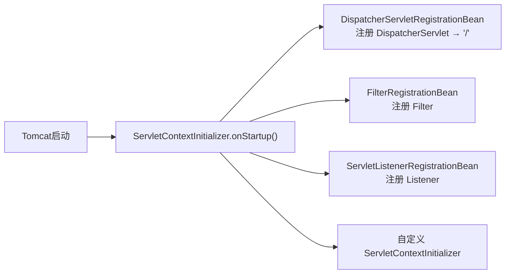
```mermaid
flowchart LR
    A["Tomcat启动"] --> B["ServletContextInitializer.onStartup()"]
    B --> C1["DispatcherServletRegistrationBean<br/>注册 DispatcherServlet → '/'"]
    B --> C2["FilterRegistrationBean<br/>注册 Filter"]
    B --> C3["ServletListenerRegistrationBean<br/>注册 Listener"]
    B --> C4["自定义 ServletContextInitializer"]
```

---

## 5. Bean 生命周期

Spring Bean 在 `AbstractApplicationContext.refresh()` → `finishBeanFactoryInitialization()` 阶段完成实例化。

### 5.1 完整生命周期

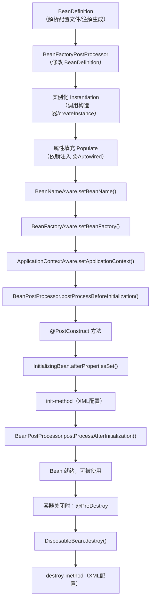
```mermaid
flowchart TD
    A["BeanDefinition<br/>（解析配置文件/注解生成）"] --> B["BeanFactoryPostProcessor<br/>（修改 BeanDefinition）"]
    B --> C["实例化 Instantiation<br/>（调用构造器/createInstance）"]
    C --> D["属性填充 Populate<br/>（依赖注入 @Autowired）"]
    D --> E["BeanNameAware.setBeanName()"]
    E --> F["BeanFactoryAware.setBeanFactory()"]
    F --> G["ApplicationContextAware.setApplicationContext()"]
    G --> H["BeanPostProcessor.postProcessBeforeInitialization()"]
    H --> I["@PostConstruct 方法"]
    I --> J["InitializingBean.afterPropertiesSet()"]
    J --> K["init-method（XML配置）"]
    K --> L["BeanPostProcessor.postProcessAfterInitialization()"]
    L --> M["Bean 就绪，可被使用"]
    M --> N["容器关闭时：@PreDestroy"]
    N --> O["DisposableBean.destroy()"]
    O --> P["destroy-method（XML配置）"]
```

### 5.2 BeanPostProcessor 的桥梁作用

```java
public interface BeanPostProcessor {
    // 在初始化之前调用
    @Nullable
    default Object postProcessBeforeInitialization(Object bean, String beanName) 
            throws BeansException {
        return bean;
    }
    
    // 在初始化之后调用
    @Nullable
    default Object postProcessAfterInitialization(Object bean, String beanName) 
            throws BeansException {
        return bean;
    }
}
```

**核心 BeanPostProcessor 实现**：

| 实现类 | 作用 |
|--------|------|
| `AutowiredAnnotationBeanPostProcessor` | 处理 `@Autowired`、`@Value` 注入 |
| `CommonAnnotationBeanPostProcessor` | 处理 `@PostConstruct`、`@PreDestroy` |
| `ConfigurationPropertiesBindingPostProcessor` | 绑定 `@ConfigurationProperties` |
| `ApplicationContextAwareProcessor` | 注入 `ApplicationContext` 等 Aware 接口 |

### 5.3 BeanFactoryPostProcessor 的角色

```java
public interface BeanFactoryPostProcessor {
    // 在所有 BeanDefinition 加载后、实例化前调用
    void postProcessBeanFactory(ConfigurableListableBeanFactory beanFactory) 
            throws BeansException;
}
```

**关键实现：**

```java
// ConfigurationClassPostProcessor.java — 处理 @Configuration 类
// 这是触发自动配置的关键！
public class ConfigurationClassPostProcessor implements BeanDefinitionRegistryPostProcessor {
    
    @Override
    public void postProcessBeanDefinitionRegistry(BeanDefinitionRegistry registry) {
        // 解析 @Configuration 类
        ConfigurationClassParser parser = new ConfigurationClassParser(/*...*/);
        // ★ 这里面会处理 @Import，触发 AutoConfigurationImportSelector
        parser.parse(configCandidates);
    }
}
```

---

## 6. 外部化配置加载

Spring Boot 支持从多种来源加载配置，并按优先级合并。

### 6.1 配置加载流程

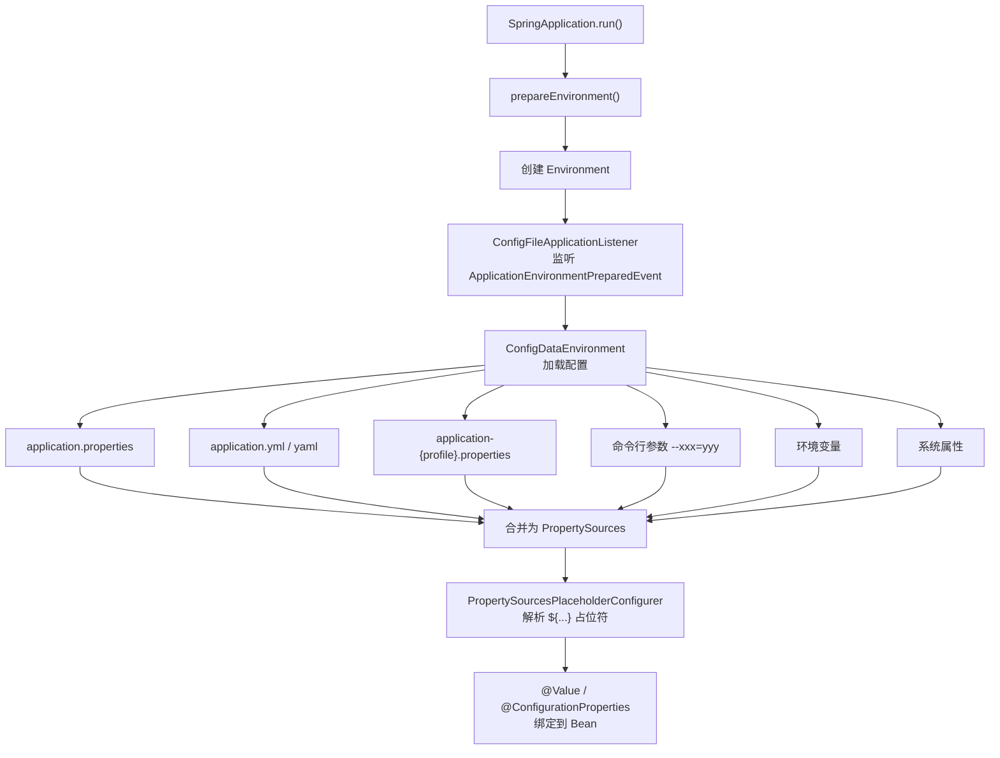
```mermaid
flowchart TD
    A["SpringApplication.run()"] --> B["prepareEnvironment()"]
    B --> C["创建 Environment"]
    C --> D["ConfigFileApplicationListener<br/>监听 ApplicationEnvironmentPreparedEvent"]
    D --> E["ConfigDataEnvironment<br/>加载配置"]
    
    E --> F1["application.properties"]
    E --> F2["application.yml / yaml"]
    E --> F3["application-{profile}.properties"]
    E --> F4["命令行参数 --xxx=yyy"]
    E --> F5["环境变量"]
    E --> F6["系统属性"]
    
    F1 --> G["合并为 PropertySources"]
    F2 --> G
    F3 --> G
    F4 --> G
    F5 --> G
    F6 --> G
    G --> H["PropertySourcesPlaceholderConfigurer<br/>解析 ${...} 占位符"]
    H --> I["@Value / @ConfigurationProperties<br/>绑定到 Bean"]
```

### 6.2 配置优先级（从高到低）

```
1. 命令行参数 (--server.port=8081)
2. SPRING_APPLICATION_JSON 环境变量
3. ServletConfig 初始化参数
4. JNDI 属性
5. Java 系统属性 (-Dserver.port=8081)
6. 操作系统环境变量
7. application-{profile}.properties（外部 jar 包外）
8. application-{profile}.properties（jar 包内）
9. application.properties（外部 jar 包外）
10. application.properties（jar 包内）
11. @PropertySource 注解
12. SpringApplication.setDefaultProperties()
```

### 6.3 @ConfigurationProperties 绑定

```java
// 配置类定义
@ConfigurationProperties(prefix = "server")
public class ServerProperties {
    private int port = 8080;       // 默认值
    private String address;
    private Servlet servlet = new Servlet();
    
    public static class Servlet {
        private String contextPath;
        private int sessionTimeout = 30 * 60;
    }
}

// 在自动配置中启用
@EnableConfigurationProperties(ServerProperties.class)
public class SomeAutoConfiguration {
    // ...
}
```

对应配置：
```properties
server.port=9090
server.address=0.0.0.0
server.servlet.context-path=/api
server.servlet.session-timeout=3600
```

---

## 7. 核心扩展点

Spring Boot 提供了丰富的扩展点，让你可以在启动各阶段插入自定义逻辑。

### 7.1 扩展点全景图

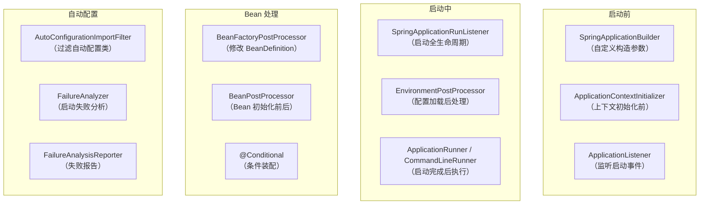
```mermaid
flowchart TD
    subgraph PRE["启动前"]
        A1["SpringApplicationBuilder<br/>（自定义构造参数）"]
        A2["ApplicationContextInitializer<br/>（上下文初始化前）"]
        A3["ApplicationListener<br/>（监听启动事件）"]
    end
    
    subgraph DURING["启动中"]
        B1["SpringApplicationRunListener<br/>（启动全生命周期）"]
        B2["EnvironmentPostProcessor<br/>（配置加载后处理）"]
        B3["ApplicationRunner / CommandLineRunner<br/>（启动完成后执行）"]
    end
    
    subgraph BEAN["Bean 处理"]
        C1["BeanFactoryPostProcessor<br/>（修改 BeanDefinition）"]
        C2["BeanPostProcessor<br/>（Bean 初始化前后）"]
        C3["@Conditional<br/>（条件装配）"]
    end
    
    subgraph AUTO["自动配置"]
        D1["AutoConfigurationImportFilter<br/>（过滤自动配置类）"]
        D2["FailureAnalyzer<br/>（启动失败分析）"]
        D3["FailureAnalysisReporter<br/>（失败报告）"]
    end
```

### 7.2 常用扩展点实现示例

#### ApplicationContextInitializer

```java
// 在 SpringApplication 上下文准备阶段执行
public class MyInitializer implements ApplicationContextInitializer<ConfigurableApplicationContext> {
    @Override
    public void initialize(ConfigurableApplicationContext ctx) {
        // 添加自定义 PropertySource
        ctx.getEnvironment().getPropertySources().addFirst(
            new MapPropertySource("custom", Map.of("my.key", "value"))
        );
    }
}

// 注册方式 1：META-INF/spring.factories
// org.springframework.context.ApplicationContextInitializer=\
// com.example.MyInitializer

// 注册方式 2：代码
new SpringApplication(MyApp.class)
    .addInitializers(new MyInitializer())
    .run(args);
```

#### ApplicationRunner

```java
@Component
@Order(1)
public class DataInitializer implements ApplicationRunner {
    @Override
    public void run(ApplicationArguments args) throws Exception {
        // 容器完全启动后执行
        // 可以在这里做数据初始化、缓存预热等
    }
}

// CommandLineRunner 类似，提供原始 String[] args
@Component
public class StartupLogger implements CommandLineRunner {
    @Override
    public void run(String... args) throws Exception {
        System.out.println("Application started with args: " + Arrays.toString(args));
    }
}
```

#### FailureAnalyzer

```java
// 自定义启动失败分析
public class PortInUseFailureAnalyzer 
        extends AbstractFailureAnalyzer<PortInUseException> {
    
    @Override
    protected FailureAnalysis analyze(Throwable rootFailure, PortInUseException cause) {
        return new FailureAnalysis(
            "端口 " + cause.getPort() + " 已被占用",
            "请检查是否有其他进程占用该端口，或修改 server.port 配置",
            cause
        );
    }
}

// META-INF/spring.factories
// org.springframework.boot.diagnostics.FailureAnalyzer=\
// com.example.PortInUseFailureAnalyzer
```

---

## 总结

Spring Boot 的源码架构可以概括为 **"一个入口，三级编排，N 个扩展点"**：

| 层次 | 核心类 | 职责 |
|------|--------|------|
| **启动编排** | `SpringApplication` | 协调整个启动流程，管理生命周期事件 |
| **自动配置** | `AutoConfigurationImportSelector` | 按条件加载配置类，实现"约定优于配置" |
| **上下文刷新** | `AbstractApplicationContext.refresh()` | BeanDefinition → 实例化 → 初始化 → 就绪 |
| **内嵌服务器** | `ServletWebServerApplicationContext` | 零配置集成 Tomcat/Jetty/Undertow |
| **外部化配置** | `ConfigDataEnvironment` | 多来源配置加载与优先级合并 |

理解这些核心流程后，无论是排查启动问题、自定义 Starter、还是阅读其他 Spring 生态项目的源码，都将事半功倍。

---

*本文基于 Spring Boot 3.x 源码编写。*

---

# 第二部分：Spring Framework 源码深度解析

---

## 8. IoC 容器核心架构

IoC（Inversion of Control）是 Spring Framework 的基石。整个容器围绕 **BeanDefinition → BeanFactory → ApplicationContext** 三层抽象构建。

### 8.1 ApplicationContext 继承体系

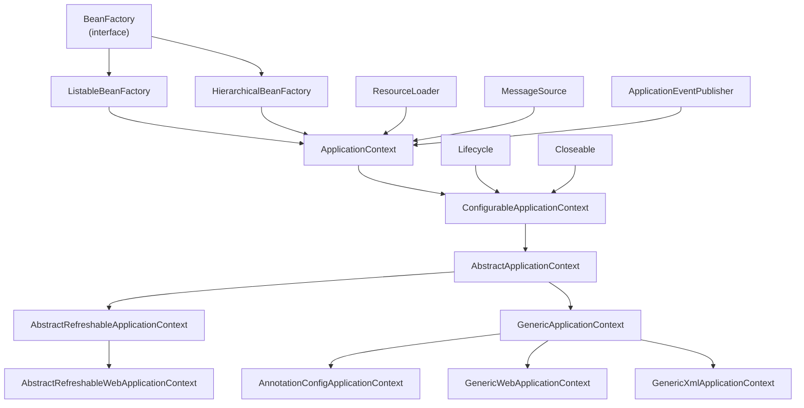
```mermaid
flowchart TB
    BF["BeanFactory<br/>(interface)"]
    LBF["ListableBeanFactory"]
    HBF["HierarchicalBeanFactory"]
    
    AC["ApplicationContext"]
    RL["ResourceLoader"]
    MP["MessageSource"]
    EP["ApplicationEventPublisher"]
    
    CAC["ConfigurableApplicationContext"]
    LS["Lifecycle"]
    CAC2["Closeable"]
    
    AAC["AbstractApplicationContext"]
    
    ARAC["AbstractRefreshableApplicationContext"]
    GAC["GenericApplicationContext"]
    
    ARWAC["AbstractRefreshableWebApplicationContext"]
    ASC["AnnotationConfigApplicationContext"]
    GWA["GenericWebApplicationContext"]
    GWXA["GenericXmlApplicationContext"]
    
    BF --> LBF
    BF --> HBF
    LBF --> AC
    HBF --> AC
    RL --> AC
    MP --> AC
    EP --> AC
    AC --> CAC
    LS --> CAC
    CAC2 --> CAC
    CAC --> AAC
    AAC --> ARAC
    AAC --> GAC
    ARAC --> ARWAC
    GAC --> ASC
    GAC --> GWA
    GAC --> GWXA
```

**关键接口职责**：

| 接口 | 包路径 | 职责 |
|------|--------|------|
| `BeanFactory` | `org.springframework.beans.factory` | IoC 容器根接口，提供 getBean() |
| `ListableBeanFactory` | `org.springframework.beans.factory` | 可枚举所有 Bean |
| `HierarchicalBeanFactory` | `org.springframework.beans.factory` | 父子容器层级 |
| `ApplicationContext` | `org.springframework.context` | 聚合 BeanFactory + 事件 + 国际化 + 资源加载 |
| `ConfigurableApplicationContext` | `org.springframework.context` | 可配置生命周期（refresh/close） |

### 8.2 BeanDefinition 加载流程

Spring 通过三种 Reader 将不同类型的配置源解析为统一的 `BeanDefinition`：

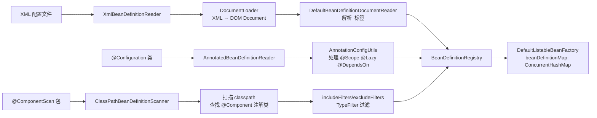
```mermaid
flowchart LR
    XML["XML 配置文件"] --> XmlReader["XmlBeanDefinitionReader"]
    Anno["@Configuration 类"] --> AtReader["AnnotatedBeanDefinitionReader"]
    Scan["@ComponentScan 包"] --> Scanner["ClassPathBeanDefinitionScanner"]
    
    XmlReader --> DocLoader["DocumentLoader<br/>XML → DOM Document"]
    DocLoader --> DefaultReader["DefaultBeanDefinitionDocumentReader<br/>解析 <bean> 标签"]
    
    AtReader --> AnnoUtils["AnnotationConfigUtils<br/>处理 @Scope @Lazy @DependsOn"]
    
    Scanner --> PathResolver["扫描 classpath<br/>查找 @Component 注解类"]
    PathResolver --> Filter["includeFilters/excludeFilters<br/>TypeFilter 过滤"]
    
    DefaultReader --> Registry["BeanDefinitionRegistry"]
    AnnoUtils --> Registry
    Filter --> Registry
    
    Registry --> Map["DefaultListableBeanFactory<br/>beanDefinitionMap: ConcurrentHashMap"]
```

**`DefaultListableBeanFactory` 核心数据结构**：

```java
// DefaultListableBeanFactory.java
public class DefaultListableBeanFactory extends AbstractAutowireCapableBeanFactory
        implements ConfigurableListableBeanFactory, BeanDefinitionRegistry {

    // ★ 存储所有 BeanDefinition，key 为 beanName
    private final Map<String, BeanDefinition> beanDefinitionMap = 
        new ConcurrentHashMap<>(256);

    // ★ 按注册顺序保存 beanName，保证依赖注入顺序
    private volatile List<String> beanDefinitionNames = new ArrayList<>(256);
    
    // 注册 BeanDefinition
    @Override
    public void registerBeanDefinition(String beanName, BeanDefinition beanDefinition) {
        // 1. 校验 BeanDefinition
        // 2. 检查是否已存在（allowBeanDefinitionOverriding 控制是否允许覆盖）
        // 3. 放入 beanDefinitionMap
        this.beanDefinitionMap.put(beanName, beanDefinition);
        // 4. 记录到 beanDefinitionNames
        this.beanDefinitionNames.add(beanName);
    }
}
```

### 8.3 getBean() 完整调用链

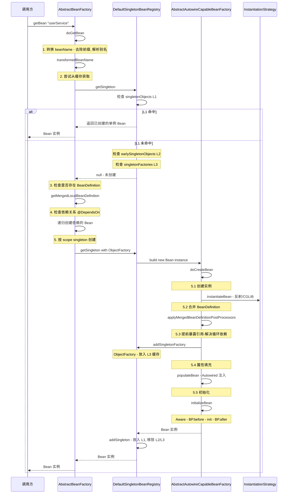
```mermaid
sequenceDiagram
    participant User as 调用方
    participant BF as AbstractBeanFactory
    participant Cache as DefaultSingletonBeanRegistry
    participant Creator as AbstractAutowireCapableBeanFactory
    participant CI as InstantiationStrategy

    User->>BF: getBean "userService"
    BF->>BF: doGetBean

    Note over BF: 1. 转换 beanName - 去除前缀, 解析别名
    BF->>BF: transformedBeanName

    Note over BF: 2. 尝试从缓存获取
    BF->>Cache: getSingleton
    Cache->>Cache: 检查 singletonObjects L1
    alt L1 命中
        Cache-->>BF: 返回已创建的单例 Bean
        BF-->>User: Bean 实例
    else L1 未命中
        Note over Cache: 检查 earlySingletonObjects L2
        Note over Cache: 检查 singletonFactories L3
        Cache-->>BF: null - 未创建

        Note over BF: 3. 检查是否存在 BeanDefinition
        BF->>BF: getMergedLocalBeanDefinition

        Note over BF: 4. 检查依赖关系 @DependsOn
        BF->>BF: 递归创建依赖的 Bean

        Note over BF: 5. 按 scope singleton 创建
        BF->>Cache: getSingleton with ObjectFactory
        Cache->>Creator: build new Bean instance
        Creator->>Creator: doCreateBean

        Note over Creator: 5.1 创建实例
        Creator->>CI: instantiateBean - 反射/CGLIB

        Note over Creator: 5.2 合并 BeanDefinition
        Creator->>Creator: applyMergedBeanDefinitionPostProcessors

        Note over Creator: 5.3 提前暴露引用-解决循环依赖
        Creator->>Cache: addSingletonFactory
        Note over Cache: ObjectFactory - 放入 L3 缓存

        Note over Creator: 5.4 属性填充
        Creator->>Creator: populateBean - Autowired 注入

        Note over Creator: 5.5 初始化
        Creator->>Creator: initializeBean
        Note over Creator: Aware - BP.before - init - BP.after

        Creator-->>Cache: Bean 实例
        Cache->>Cache: addSingleton - 放入 L1, 移除 L2/L3
        Cache-->>BF: Bean 实例

        BF-->>User: Bean 实例
    end
```

---

## 9. 循环依赖与三级缓存

这是 Spring 面试最高频的问题之一。Spring 通过 **三级缓存**解决单例 Bean 的 Setter 注入循环依赖。

### 9.1 三级缓存结构

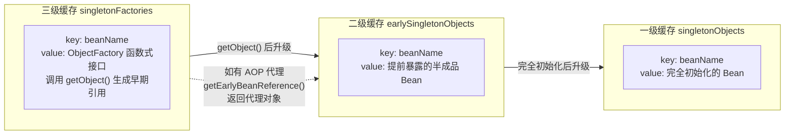
```mermaid
flowchart LR
    subgraph L1["一级缓存 singletonObjects"]
        A["key: beanName<br/>value: 完全初始化的 Bean"]
    end
    
    subgraph L2["二级缓存 earlySingletonObjects"]
        B["key: beanName<br/>value: 提前暴露的半成品 Bean"]
    end
    
    subgraph L3["三级缓存 singletonFactories"]
        C["key: beanName<br/>value: ObjectFactory 函数式接口<br/>调用 getObject() 生成早期引用"]
    end
    
    L3 -->|"getObject() 后升级"| L2
    L2 -->|"完全初始化后升级"| L1
    L3 -.->|"如有 AOP 代理<br/>getEarlyBeanReference()<br/>返回代理对象"| L2
```

### 9.2 A → B → A 循环依赖解决过程

假设 `ServiceA` 依赖 `ServiceB`，`ServiceB` 也依赖 `ServiceA`：

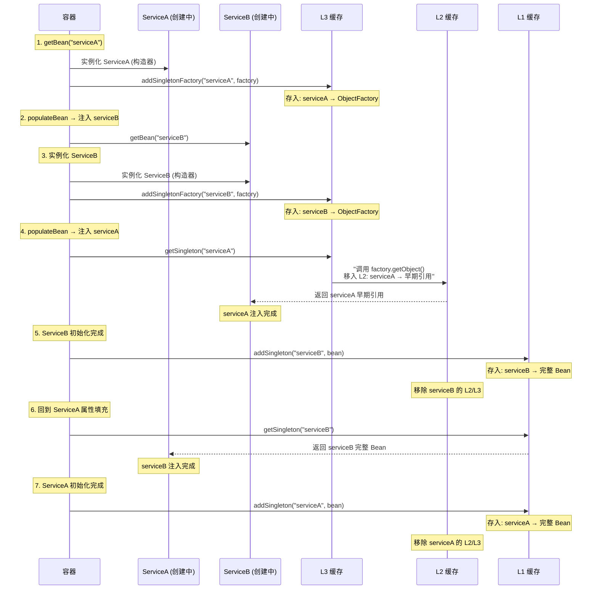
```mermaid
sequenceDiagram
    participant C as 容器
    participant A as ServiceA (创建中)
    participant B as ServiceB (创建中)
    participant L3 as L3 缓存
    participant L2 as L2 缓存
    participant L1 as L1 缓存
    
    Note over C: 1. getBean("serviceA")
    C->>A: 实例化 ServiceA (构造器)
    C->>L3: addSingletonFactory("serviceA", factory)
    Note over L3: 存入: serviceA → ObjectFactory
    
    Note over C: 2. populateBean → 注入 serviceB
    C->>B: getBean("serviceB")
    
    Note over C: 3. 实例化 ServiceB
    C->>B: 实例化 ServiceB (构造器)
    C->>L3: addSingletonFactory("serviceB", factory)
    Note over L3: 存入: serviceB → ObjectFactory
    
    Note over C: 4. populateBean → 注入 serviceA
    C->>L3: getSingleton("serviceA")
    L3->>L2: "调用 factory.getObject()<br/>移入 L2: serviceA → 早期引用"
    L2-->>B: 返回 serviceA 早期引用
    Note over B: serviceA 注入完成
    
    Note over C: 5. ServiceB 初始化完成
    C->>L1: addSingleton("serviceB", bean)
    Note over L1: 存入: serviceB → 完整 Bean
    Note over L2: 移除 serviceB 的 L2/L3
    
    Note over C: 6. 回到 ServiceA 属性填充
    C->>L1: getSingleton("serviceB")
    L1-->>A: 返回 serviceB 完整 Bean
    Note over A: serviceB 注入完成
    
    Note over C: 7. ServiceA 初始化完成
    C->>L1: addSingleton("serviceA", bean)
    Note over L1: 存入: serviceA → 完整 Bean
    Note over L2: 移除 serviceA 的 L2/L3
```

### 9.3 核心源码

```java
// DefaultSingletonBeanRegistry.java
public class DefaultSingletonBeanRegistry extends SimpleAliasRegistry 
        implements SingletonBeanRegistry {

    // ★ L1: 完全初始化的单例 Bean
    private final Map<String, Object> singletonObjects = new ConcurrentHashMap<>(256);

    // ★ L2: 提前暴露的早期引用
    private final Map<String, Object> earlySingletonObjects = new ConcurrentHashMap<>(16);

    // ★ L3: ObjectFactory 工厂，可生成早期引用
    private final Map<String, ObjectFactory<?>> singletonFactories = new HashMap<>(16);

    // 获取单例的核心方法
    @Nullable
    protected Object getSingleton(String beanName, boolean allowEarlyReference) {
        // 1. 查 L1
        Object singletonObject = this.singletonObjects.get(beanName);
        if (singletonObject == null && isSingletonCurrentlyInCreation(beanName)) {
            // 2. 查 L2
            singletonObject = this.earlySingletonObjects.get(beanName);
            if (singletonObject == null && allowEarlyReference) {
                synchronized (this.singletonObjects) {
                    singletonObject = this.singletonObjects.get(beanName);
                    if (singletonObject == null) {
                        singletonObject = this.earlySingletonObjects.get(beanName);
                        if (singletonObject == null) {
                            // 3. 查 L3，调用 getObject() 生成早期引用
                            ObjectFactory<?> singletonFactory = 
                                this.singletonFactories.get(beanName);
                            if (singletonFactory != null) {
                                singletonObject = singletonFactory.getObject();
                                // 升级到 L2
                                this.earlySingletonObjects.put(beanName, singletonObject);
                                this.singletonFactories.remove(beanName);
                            }
                        }
                    }
                }
            }
        }
        return singletonObject;
    }
}
```

**核心限制**：Spring 只能解决 **单例 + Setter 注入** 的循环依赖，构造器注入的循环依赖无法解决（因为构造器调用时还未暴露到 L3）。

---

## 10. AOP 代理机制

AOP（Aspect-Oriented Programming）通过**动态代理**在不修改源码的情况下增强方法。

### 10.1 代理创建流程

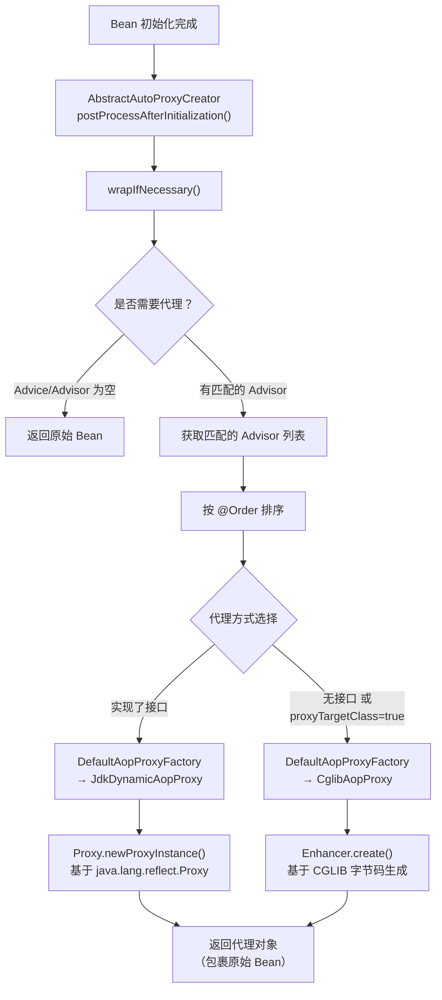
```mermaid
flowchart TD
    Start["Bean 初始化完成"] --> BPP["AbstractAutoProxyCreator<br/>postProcessAfterInitialization()"]
    
    BPP --> Check["wrapIfNecessary()"]
    Check --> Q1{"是否需要代理？"}
    Q1 -->|"Advice/Advisor 为空"| NO["返回原始 Bean"]
    Q1 -->|"有匹配的 Advisor"| Advices["获取匹配的 Advisor 列表"]
    
    Advices --> Sort["按 @Order 排序"]
    Sort --> Q2{"代理方式选择"}
    
    Q2 -->|"实现了接口"| JDK["DefaultAopProxyFactory<br/>→ JdkDynamicAopProxy"]
    Q2 -->|"无接口 或<br/>proxyTargetClass=true"| CGLIB["DefaultAopProxyFactory<br/>→ CglibAopProxy"]
    
    JDK --> JDKP["Proxy.newProxyInstance()<br/>基于 java.lang.reflect.Proxy"]
    CGLIB --> CGLIBP["Enhancer.create()<br/>基于 CGLIB 字节码生成"]
    
    JDKP --> Wrapped["返回代理对象<br/>（包裹原始 Bean）"]
    CGLIBP --> Wrapped
```

### 10.2 AOP 核心术语与接口

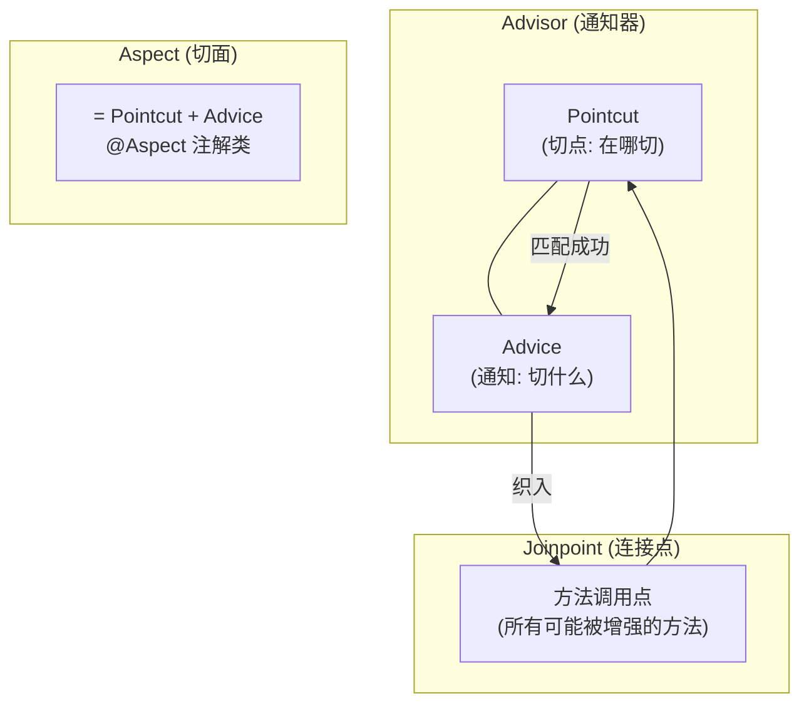
```mermaid
flowchart TB
    subgraph Advisor["Advisor (通知器)"]
        PM["Pointcut<br/>(切点: 在哪切)"]
        AV["Advice<br/>(通知: 切什么)"]
        PM --- AV
    end
    
    subgraph Joinpoint["Joinpoint (连接点)"]
        JP["方法调用点<br/>(所有可能被增强的方法)"]
    end
    
    subgraph Aspect["Aspect (切面)"]
        ASP["= Pointcut + Advice<br/>@Aspect 注解类"]
    end
    
    JP --> PM
    PM -->|"匹配成功"| AV
    AV -->|"织入"| JP
```

**核心接口源码**：

```java
// 切点：定义"在哪里"增强
public interface Pointcut {
    ClassFilter getClassFilter();      // 类级别匹配
    MethodMatcher getMethodMatcher();  // 方法级别匹配
}

// 通知：定义"做什么"增强
public interface Advice {}
// 子类型:
//   MethodBeforeAdvice    → @Before
//   AfterReturningAdvice  → @AfterReturning
//   ThrowsAdvice          → @AfterThrowing
//   MethodInterceptor     → @Around

// 通知器 = 切点 + 通知
public interface Advisor {
    Advice getAdvice();
}
// PointcutAdvisor: 额外提供 Pointcut
```

### 10.3 拦截器链执行过程

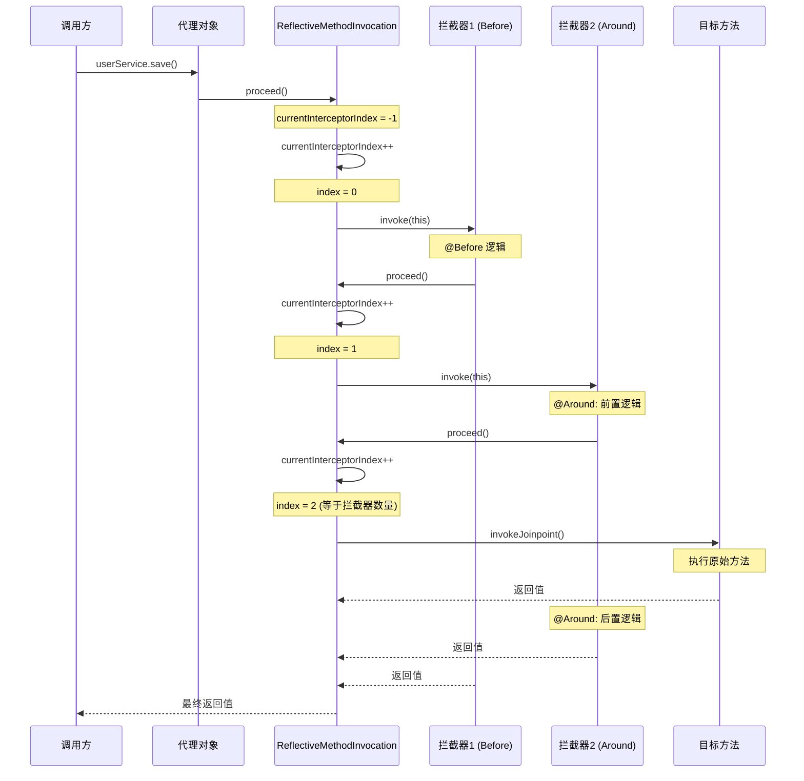
```mermaid
sequenceDiagram
    participant Caller as 调用方
    participant Proxy as 代理对象
    participant RMI as ReflectiveMethodInvocation
    participant Int1 as 拦截器1 (Before)
    participant Int2 as 拦截器2 (Around)
    participant Target as 目标方法

    Caller->>Proxy: userService.save()
    Proxy->>RMI: proceed()
    
    Note over RMI: currentInterceptorIndex = -1
    RMI->>RMI: currentInterceptorIndex++
    Note over RMI: index = 0
    RMI->>Int1: invoke(this)
    Note over Int1: @Before 逻辑
    Int1->>RMI: proceed()
    
    RMI->>RMI: currentInterceptorIndex++
    Note over RMI: index = 1
    RMI->>Int2: invoke(this)
    Note over Int2: @Around: 前置逻辑
    Int2->>RMI: proceed()
    
    RMI->>RMI: currentInterceptorIndex++
    Note over RMI: index = 2 (等于拦截器数量)
    RMI->>Target: invokeJoinpoint()
    Note over Target: 执行原始方法
    Target-->>RMI: 返回值
    
    Note over Int2: @Around: 后置逻辑
    Int2-->>RMI: 返回值
    Int1-->>RMI: 返回值
    RMI-->>Caller: 最终返回值
```

**核心源码**：

```java
// ReflectiveMethodInvocation.java
public class ReflectiveMethodInvocation implements ProxyMethodInvocation {
    
    // 拦截器列表
    protected final List<?> interceptorsAndDynamicMethodMatchers;
    // 当前索引
    private int currentInterceptorIndex = -1;

    public Object proceed() throws Throwable {
        // ★ 当所有拦截器执行完毕，调用目标方法
        if (this.currentInterceptorIndex == this.interceptorsAndDynamicMethodMatchers.size() - 1) {
            return invokeJoinpoint();
        }

        // ★ 获取下一个拦截器并执行
        Object interceptorOrInterceptionAdvice =
            this.interceptorsAndDynamicMethodMatchers.get(++this.currentInterceptorIndex);
        
        // 执行拦截器，拦截器内部会再次调用 this.proceed()
        return ((MethodInterceptor) interceptorOrInterceptionAdvice).invoke(this);
    }
}
```

---

## 11. Spring MVC 请求分发

`DispatcherServlet` 是整个 Spring MVC 的**前端控制器**，所有 HTTP 请求统一由它分发。

### 11.1 doDispatch() 完整流程

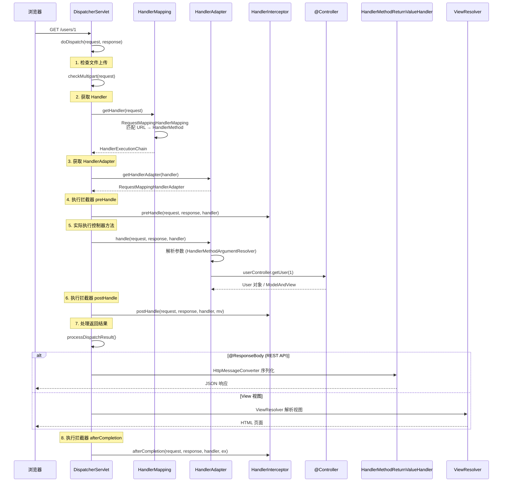
```mermaid
sequenceDiagram
    participant Client as 浏览器
    participant DS as DispatcherServlet
    participant HM as HandlerMapping
    participant HA as HandlerAdapter
    participant Interceptor as HandlerInterceptor
    participant Controller as @Controller
    participant HMR as HandlerMethodReturnValueHandler
    participant VR as ViewResolver

    Client->>DS: GET /users/1
    DS->>DS: doDispatch(request, response)
    
    Note over DS: 1. 检查文件上传
    DS->>DS: checkMultipart(request)
    
    Note over DS: 2. 获取 Handler
    DS->>HM: getHandler(request)
    HM->>HM: RequestMappingHandlerMapping<br/>匹配 URL → HandlerMethod
    HM-->>DS: HandlerExecutionChain
    
    Note over DS: 3. 获取 HandlerAdapter
    DS->>HA: getHandlerAdapter(handler)
    HA-->>DS: RequestMappingHandlerAdapter
    
    Note over DS: 4. 执行拦截器 preHandle
    DS->>Interceptor: preHandle(request, response, handler)
    
    Note over DS: 5. 实际执行控制器方法
    DS->>HA: handle(request, response, handler)
    HA->>HA: 解析参数 (HandlerMethodArgumentResolver)
    HA->>Controller: userController.getUser(1)
    Controller-->>HA: User 对象 / ModelAndView
    
    Note over DS: 6. 执行拦截器 postHandle
    DS->>Interceptor: postHandle(request, response, handler, mv)
    
    Note over DS: 7. 处理返回结果
    DS->>DS: processDispatchResult()
    alt @ResponseBody (REST API)
        DS->>HMR: HttpMessageConverter 序列化
        HMR-->>Client: JSON 响应
    else View 视图
        DS->>VR: ViewResolver 解析视图
        VR-->>Client: HTML 页面
    end
    
    Note over DS: 8. 执行拦截器 afterCompletion
    DS->>Interceptor: afterCompletion(request, response, handler, ex)
```

### 11.2 @RequestMapping 解析流程

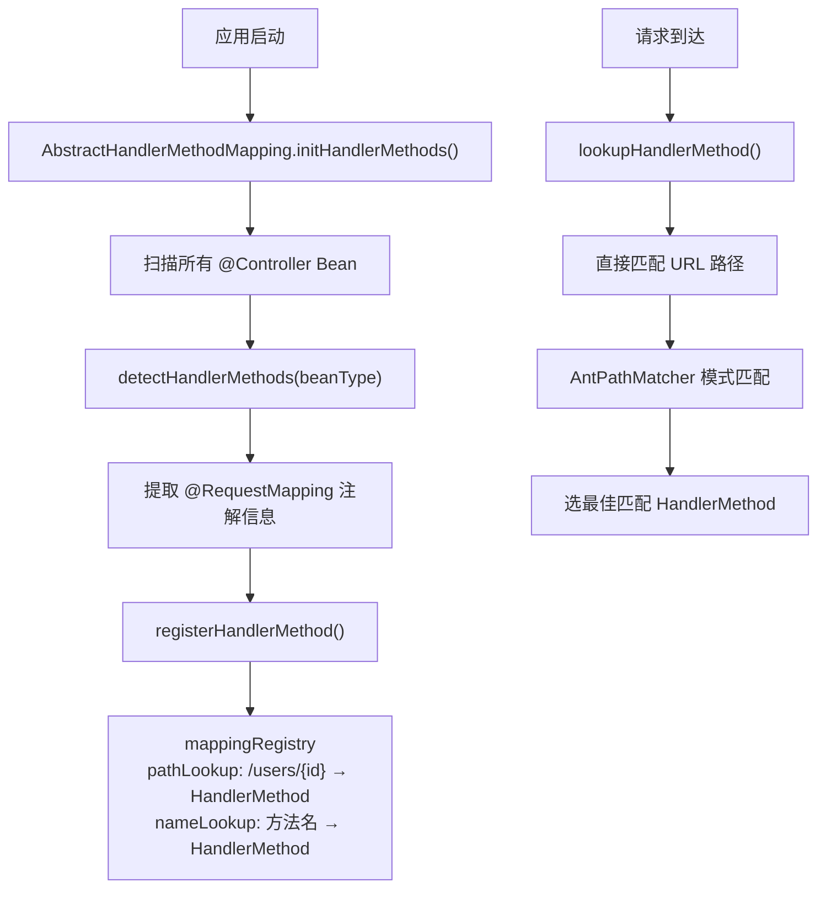
```mermaid
flowchart TD
    App["应用启动"] --> Init["AbstractHandlerMethodMapping.initHandlerMethods()"]
    Init --> Scan["扫描所有 @Controller Bean"]
    Scan --> Detect["detectHandlerMethods(beanType)"]
    Detect --> Mapping["提取 @RequestMapping 注解信息"]
    Mapping --> Reg["registerHandlerMethod()"]
    
    Reg --> Map["mappingRegistry<br/>pathLookup: /users/{id} → HandlerMethod<br/>nameLookup: 方法名 → HandlerMethod"]
    
    Req["请求到达"] --> Lookup["lookupHandlerMethod()"]
    Lookup --> Match1["直接匹配 URL 路径"]
    Match1 --> Match2["AntPathMatcher 模式匹配"]
    Match2 --> Best["选最佳匹配 HandlerMethod"]
```

### 11.3 参数解析与返回值处理

```java
// HandlerMethodArgumentResolver - 方法入参解析
public interface HandlerMethodArgumentResolver {
    boolean supportsParameter(MethodParameter parameter);
    Object resolveArgument(MethodParameter parameter, ...) throws Exception;
}

// 常用实现:
// @RequestBody       → RequestResponseBodyMethodProcessor (读 JSON, 调 HttpMessageConverter)
// @RequestParam      → RequestParamMethodArgumentResolver
// @PathVariable      → PathVariableMethodArgumentResolver
// @ModelAttribute    → ModelAttributeMethodProcessor
// 无注解的复杂对象    → ServletModelAttributeMethodProcessor

// HandlerMethodReturnValueHandler - 返回值处理
public interface HandlerMethodReturnValueHandler {
    boolean supportsReturnType(MethodParameter returnType);
    void handleReturnValue(Object returnValue, ...) throws Exception;
}

// 常用实现:
// @ResponseBody      → RequestResponseBodyMethodProcessor (写 JSON, 调 HttpMessageConverter)
// String (视图名)     → ViewNameMethodReturnValueHandler
// ModelAndView       → ModelAndViewMethodReturnValueHandler
```

**HttpMessageConverter 链**：

```
客户端 Accept: application/json
    ↓
AbstractMessageConverterMethodProcessor.writeWithMessageConverters()
    ↓ 遍历已注册的 HttpMessageConverter
    ├── StringHttpMessageConverter      (text/plain)
    ├── MappingJackson2HttpMessageConverter  (application/json) ← ★ 匹配！
    ├── Jaxb2RootElementHttpMessageConverter (application/xml)
    └── ...
    ↓
Jackson ObjectMapper.writeValue() → JSON 字符串 → HTTP Response
```

---

## 12. 事务管理

Spring 事务的核心是 **AOP + ThreadLocal**，通过 `@Transactional` 注解声明式管理事务。

### 12.1 @Transactional 全链路

```mermaid
flowchart TD
    Start["@Transactional 方法被调用"] --> Proxy["事务代理对象拦截"]
    Proxy --> TI["TransactionInterceptor.invoke()"]
    TI --> TAM["TransactionAttributeSource<br/>解析 @Transactional 属性"]
    TAM --> TM["PlatformTransactionManager.getTransaction()"]
    
    TM --> Status["创建 TransactionStatus"]
    Status --> Bind["TransactionSynchronizationManager<br/>bindResource() → ThreadLocal 绑定 Connection"]
    
    Bind --> Business["执行目标方法"]
    
    Business --> Check{"方法是否抛异常？"}
    Check -->|"无异常"| Commit["tm.commit(status)"]
    Check -->|"有异常"| RollbackCheck{"异常是否匹配 rollbackFor？"}
    RollbackCheck -->|"是"| Rollback["tm.rollback(status)"]
    RollbackCheck -->|"否"| Commit
    
    Commit --> Unbind["unbindResource()"]
    Rollback --> Unbind
    Unbind --> Clean["cleanupAfterCompletion()"]
```

### 12.2 事务传播行为

```java
public interface TransactionDefinition {
    int PROPAGATION_REQUIRED = 0;      // 默认：有则加入，无则新建
    int PROPAGATION_SUPPORTS = 1;      // 有则加入，无则非事务运行
    int PROPAGATION_MANDATORY = 2;     // 必须有事务，否则抛异常
    int PROPAGATION_REQUIRES_NEW = 3;  // 始终新建，挂起当前事务
    int PROPAGATION_NOT_SUPPORTED = 4; // 非事务运行，挂起当前事务
    int PROPAGATION_NEVER = 5;         // 非事务运行，有事务则抛异常
    int PROPAGATION_NESTED = 6;        // 嵌套事务（savepoint）
}
```

### 12.3 TransactionSynchronizationManager

这是 Spring 事务的**核心基础设施**，通过 `ThreadLocal` 实现线程隔离：

```java
public abstract class TransactionSynchronizationManager {
    // ★ 事务资源：每个线程的 DataSource → Connection 映射
    private static final ThreadLocal<Map<Object, Object>> resources = 
        new NamedThreadLocal<>("Transactional resources");

    // ★ 事务同步器链（用于触发 @TransactionalEventListener 等）
    private static final ThreadLocal<Set<TransactionSynchronization>> synchronizations = 
        new NamedThreadLocal<>("Transaction synchronizations");

    // ★ 当前事务名称
    private static final ThreadLocal<String> currentTransactionName = 
        new NamedThreadLocal<>("Current transaction name");

    // ★ 事务只读标志
    private static final ThreadLocal<Boolean> currentTransactionReadOnly = 
        new NamedThreadLocal<>("Current transaction read-only status");

    // ★ 事务隔离级别
    private static final ThreadLocal<Integer> currentTransactionIsolationLevel = 
        new NamedThreadLocal<>("Current transaction isolation level");

    // ★ 事务是否活跃
    private static final ThreadLocal<Boolean> actualTransactionActive = 
        new NamedThreadLocal<>("Actual transaction active");

    // 绑定资源
    public static void bindResource(Object key, Object value) {
        // key = DataSource, value = ConnectionHolder
        resources.get().put(key, value);
    }
}
```

---

## 13. 事件机制

Spring 事件机制基于**观察者模式**，支持同步/异步事件广播。

### 13.1 事件广播流程

```mermaid
flowchart TD
    Event["自定义事件 extends ApplicationEvent"] --> Publish["ApplicationEventPublisher.publishEvent()"]
    Publish --> MC["ApplicationEventMulticaster<br/>multicastEvent()"]
    
    MC --> Resolve["resolveDefaultEventType()<br/>包装为 PayloadApplicationEvent"]
    Resolve --> Listeners["getApplicationListeners()<br/>获取匹配的监听器"]
    
    Listeners --> Loop["遍历每个监听器"]
    Loop --> Q{"Executor 是否设置？"}
    Q -->|"否（同步）"| Sync["直接调用 listener.onApplicationEvent()"]
    Q -->|"是（异步）"| Async["executor.execute(() → listener.onApplicationEvent())"]
```

### 13.2 @EventListener 与 @TransactionalEventListener

```java
// 声明式事件监听 — 无需实现接口
@Component
public class OrderEventListener {
    
    // 同步监听
    @EventListener
    public void handleOrderCreated(OrderCreatedEvent event) {
        // 在同一线程、同一事务中执行
    }
    
    // 事务提交后监听 ★
    @TransactionalEventListener(phase = TransactionPhase.AFTER_COMMIT)
    public void handleAfterCommit(OrderCreatedEvent event) {
        // 仅在事务成功提交后执行
        // 用于发送消息、异步通知等
    }
    
    // 事务回滚后监听
    @TransactionalEventListener(phase = TransactionPhase.AFTER_ROLLBACK)
    public void handleAfterRollback(OrderCreatedEvent event) {
        // 事务回滚后的清理逻辑
    }
}

// @TransactionalEventListener 原理：
// 它通过 TransactionSynchronizationManager.registerSynchronization()
// 注册一个 TransactionSynchronization，在事务完成阶段回调
```

### 13.3 事件机制核心类

```java
// 事件发布器接口
public interface ApplicationEventPublisher {
    default void publishEvent(ApplicationEvent event) {
        publishEvent((Object) event);
    }
    void publishEvent(Object event); // 也支持任意对象（自动包装）
}

// 事件广播器 — 核心实现 SimpleApplicationEventMulticaster
public class SimpleApplicationEventMulticaster extends AbstractApplicationEventMulticaster {
    
    @Override
    public void multicastEvent(ApplicationEvent event, @Nullable ResolvableType eventType) {
        ResolvableType type = (eventType != null ? eventType : 
            ResolvableType.forInstance(event));
        
        // ★ 获取匹配的监听器（支持泛型事件匹配）
        for (ApplicationListener<?> listener : getApplicationListeners(event, type)) {
            Executor executor = getTaskExecutor();
            if (executor != null) {
                // 异步执行
                executor.execute(() -> invokeListener(listener, event));
            } else {
                // 同步执行（默认）
                invokeListener(listener, event);
            }
        }
    }
}
```

---

## 14. 启动全链路串联

将 Spring Boot + Spring Framework 的完整启动链路串联：

```mermaid
flowchart TD
    subgraph SB["Spring Boot 阶段"]
        A["main() → SpringApplication.run()"]
        B["prepareEnvironment()"]
        C["createApplicationContext()"]
        D["prepareContext()"]
    end
    
    subgraph SF["Spring Framework 阶段 refresh()"]
        E["obtainFreshBeanFactory()"]
        F["invokeBeanFactoryPostProcessors()"]
        G["registerBeanPostProcessors()"]
        H["onRefresh() → 创建 WebServer"]
        I["finishBeanFactoryInitialization()"]
    end
    
    subgraph Bean["Bean 创建"]
        J["getBean() → doGetBean()"]
        K["createBean() → doCreateBean()"]
        L["BeanPostProcessor 链"]
        M["AOP 代理创建"]
    end
    
    subgraph Runtime["运行时"]
        N["内嵌 Tomcat 就绪"]
        O["DispatcherServlet 就绪"]
        P["处理 HTTP 请求"]
        Q["事务拦截"]
        R["事件广播"]
    end
    
    A --> B --> C --> D
    D --> E --> F
    F -->|"触发自动配置"| F1["AutoConfigurationImportSelector"]
    F1 --> F
    F --> G --> H --> I
    I --> J --> K --> L --> M
    
    M --> N --> O
    P --> Q
    Q --> R
```

---

## 15. 关键扩展点速查

| 扩展点 | 类型 | 时机 | 典型用途 |
|--------|------|------|----------|
| `BeanFactoryPostProcessor` | 接口 | 所有 BeanDefinition 加载后、实例化前 | 修改 Bean 定义、注册新 Bean |
| `BeanPostProcessor` | 接口 | 每个 Bean 初始化前后 | AOP 代理、属性注入 |
| `InstantiationAwareBeanPostProcessor` | 接口 | Bean 实例化前后 | 短路实例化、提前返回代理 |
| `SmartInstantiationAwareBeanPostProcessor` | 接口 | 实例化阶段 | 预测 Bean 类型、提前暴露引用 |
| `MergedBeanDefinitionPostProcessor` | 接口 | BeanDefinition 合并后 | 处理 `@Autowired`、`@Value` |
| `ApplicationListener` | 接口 | 事件发布时 | 监听容器事件 |
| `ApplicationContextInitializer` | 接口 | `refresh()` 前 | 添加 PropertySource、激活 Profile |
| `HandlerInterceptor` | 接口 | HTTP 请求前后 | 权限校验、日志、跨域 |
| `HandlerMethodArgumentResolver` | 接口 | 控制器方法调用前 | 解析自定义参数注解 |
| `HandlerMethodReturnValueHandler` | 接口 | 控制器方法返回后 | 处理自定义返回值 |

---

*本文基于 Spring Framework 6.x + Spring Boot 3.x 源码编写。*

---

# 第三部分：Spring 生态深度解析

---

## 16. Spring Boot Actuator

Actuator 是 Spring Boot 的**生产级监控模块**，通过端点（Endpoint）暴露应用运行状态。

### 16.1 端点架构

```mermaid
flowchart TB
    subgraph JMX["JMX 暴露"]
        JMX_EP["通过 JMX MBean 暴露"]
    end
    
    subgraph WEB["HTTP 暴露"]
        WEB_EP["通过 /actuator/* 端点暴露"]
    end
    
    subgraph CORE["Endpoint 核心"]
        EP["@Endpoint 注解<br/>定义端点类"]
        OP1["@ReadOperation → GET"]
        OP2["@WriteOperation → POST"]
        OP3["@DeleteOperation → DELETE"]
    end
    
    subgraph BUILTIN["内置端点"]
        H["health<br/>应用健康状态"]
        M["metrics<br/>指标数据"]
        I["info<br/>应用信息"]
        E["env<br/>环境属性"]
        LG["loggers<br/>日志级别"]
        TH["threaddump<br/>线程转储"]
        HT["httptrace<br/>HTTP 追踪"]
    end
    
    CORE --> JMX
    CORE --> WEB
    BUILTIN --> CORE
```

### 16.2 Health 健康检查机制

```mermaid
sequenceDiagram
    participant Client as GET /actuator/health
    participant Endpoint as HealthEndpoint
    participant Registry as HealthContributorRegistry
    participant Indicator1 as DataSourceHealthIndicator
    participant Indicator2 as DiskSpaceHealthIndicator
    participant Indicator3 as RedisHealthIndicator
    participant Aggregator as HealthAggregator

    Client->>Endpoint: health()
    Endpoint->>Registry: 获取所有 HealthIndicator
    Registry-->>Endpoint: List of HealthIndicator
    
    par 并行检查
        Endpoint->>Indicator1: health()
        Indicator1-->>Endpoint: {"status":"UP","details":"..."}
    and
        Endpoint->>Indicator2: health()
        Indicator2-->>Endpoint: {"status":"UP","details":"..."}
    and
        Endpoint->>Indicator3: health()
        Indicator3-->>Endpoint: {"status":"DOWN","details":"..."}
    end
    
    Endpoint->>Aggregator: aggregate(healths)
    Note over Aggregator: 任一 DOWN → 整体 DOWN<br/>全部 UP → 整体 UP
    Aggregator-->>Endpoint: {"status":"DOWN","components":{...}}
    Endpoint-->>Client: HTTP 503 + JSON
```

**核心源码**：

```java
// HealthEndpoint.java - 健康端点入口
@Endpoint(id = "health")
public class HealthEndpoint {
    private final HealthContributorRegistry registry;
    
    @ReadOperation
    public HealthComponent health() {
        // 遍历所有 HealthIndicator，聚合结果
        return this.registry.stream()
            .map(indicator -> indicator.health())
            .reduce(new Health.Builder().up(), (builder, health) -> 
                builder.withDetail("component", health))
            .build();
    }
}

// AbstractHealthIndicator.java - 健康指标基类
public abstract class AbstractHealthIndicator implements HealthIndicator {
    @Override
    public final Health health() {
        Health.Builder builder = new Health.Builder();
        try {
            doHealthCheck(builder);  // 子类实现
        } catch (Exception ex) {
            builder.down(ex);        // 异常 → DOWN
        }
        return builder.build();
    }
    
    protected abstract void doHealthCheck(Health.Builder builder) throws Exception;
}
```

### 16.3 Metrics 指标采集（Micrometer）

```mermaid
flowchart LR
    App["应用代码<br/>@Timed / Counter"] --> MR["MeterRegistry<br/>(Micrometer 抽象)"]
    
    MR --> PM["PrometheusMeterRegistry<br/>/actuator/prometheus"]
    MR --> ELK["ElasticMeterRegistry"]
    MR --> JM["JMXMeterRegistry"]
    MR --> OT["OtlpMeterRegistry"]
    
    PM --> Prom["Prometheus Server"]
    Prom --> Grafana["Grafana 仪表盘"]
```

---

## 17. Spring Data JPA 代理

Spring Data JPA 的核心魔法是**运行时动态生成 `JpaRepository` 的实现类**。

### 17.1 代理创建流程

```mermaid
sequenceDiagram
    participant Container as Spring 容器
    participant Enable as @EnableJpaRepositories
    participant Registrar as JpaRepositoryRegistrar
    participant Factory as JpaRepositoryFactoryBean
    participant Proxy as JdkDynamicAopProxy
    participant Impl as SimpleJpaRepository

    Container->>Enable: 扫描 @EnableJpaRepositories
    Enable->>Registrar: registerBeanDefinitions()
    Note over Registrar: 扫描 repository 接口<br/>创建 BeanDefinition (FactoryBean)
    
    Note over Container: 当需要注入 UserRepository 时
    Container->>Factory: getObject()
    Factory->>Factory: getRepository()
    Factory->>Proxy: 创建 JDK 动态代理
    
    Note over Proxy: 代理拦截所有方法调用
    
    alt 接口方法 (findById, save...)
        Proxy->>Impl: SimpleJpaRepository.findById()
        Impl->>Impl: em.find(Class, id)
        Impl-->>Proxy: Entity 对象
    else @Query 方法
        Proxy->>Proxy: 解析 JPQL → 创建 Query
        Proxy-->>Container: 执行结果
    end
    
    Proxy-->>Container: "返回代理对象 (注入完成)"
```

### 17.2 JpaRepository 方法分发

```mermaid
flowchart TD
    Call["userRepo.findByName('Tom')"] --> Proxy["JdkDynamicAopProxy.invoke()"]
    Proxy --> Dispatch["JpaRepositoryFactory<br/>QueryExecutorMethodInterceptor"]
    
    Dispatch --> Q1{"方法类型？"}
    
    Q1 -->|"声明在 JpaRepository"| Impl["SimpleJpaRepository<br/>直接调用"]
    Q1 -->|"方法名查询"| Parse["PartTreeJpaQuery<br/>解析 findBy + Name"]
    Q1 -->|"@Query 注解"| Jpql["AbstractJpaQuery<br/>执行 JPQL/SQL"]
    
    Parse --> Criteria["JpaCriteriaQuery<br/>构建 WHERE name = ?"]
    Jpql --> Native["EntityManager.createQuery()"]
    
    Impl --> EM1["em.find() / em.persist()"]
    Criteria --> EM2["em.createQuery(criteria)"]
    Native --> EM3["em.createQuery(jpql)"]
```

**核心源码**：

```java
// SimpleJpaRepository.java — 默认实现
@Repository
@Transactional(readOnly = true)
public class SimpleJpaRepository<T, ID> implements JpaRepositoryImplementation<T, ID> {
    
    private final JpaEntityInformation<T, ?> entityInformation;
    private final EntityManager em;  // ★ 底层 JPA EntityManager
    
    @Override
    @Transactional
    public <S extends T> S save(S entity) {
        if (entityInformation.isNew(entity)) {
            em.persist(entity);       // 新建 → persist
            return entity;
        } else {
            return em.merge(entity);  // 已存在 → merge
        }
    }
    
    @Override
    public Optional<T> findById(ID id) {
        return Optional.ofNullable(em.find(getDomainClass(), id));
    }
    
    // 方法名查询最终生成的代理
    // findByLastNameAndFirstName → 自动解析为 WHERE last_name = ? AND first_name = ?
}
```

---

## 18. Spring Security 过滤器链

Spring Security 基于**责任链模式**的 Servlet Filter 实现认证与授权。

### 18.1 过滤器链架构

```mermaid
flowchart TD
    Request["HTTP 请求"] --> FC["DelegatingFilterProxy<br/>(web.xml / Spring Boot 自动注册)"]
    FC --> FCP["FilterChainProxy<br/>(Spring Security 入口)"]
    
    FCP --> Chain["SecurityFilterChain<br/>（实际过滤器链）"]
    
    subgraph Filters["默认过滤器链（共 15 个）"]
        CSRF["CsrfFilter"]
        CORS["CorsFilter"]
        AUTH1["SecurityContextPersistenceFilter<br/>（加载 SecurityContext）"]
        LC["LogoutFilter"]
        AUTH2["UsernamePasswordAuthenticationFilter<br/>（处理登录表单）"]
        BASIC["BasicAuthenticationFilter"]
        RM["RememberMeAuthenticationFilter"]
        ANON["AnonymousAuthenticationFilter"]
        SESSION["SessionManagementFilter"]
        EXC["ExceptionTranslationFilter<br/>（处理认证/授权异常）"]
        AUTHZ["AuthorizationFilter<br/>（授权决策）"]
    end
    
    FCP --> Filters
    
    CHAIN1["Chain 1: /api/**"]
    CHAIN2["Chain 2: /admin/**"]
    
    AUTHZ --> Dispatcher["DispatcherServlet"]
```

### 18.2 认证流程（Username/Password）

```mermaid
sequenceDiagram
    participant User as 浏览器
    participant Filter as UsernamePasswordAuthenticationFilter
    participant AM as AuthenticationManager
    participant Provider as DaoAuthenticationProvider
    participant UDS as UserDetailsService
    participant SC as SecurityContextHolder

    User->>Filter: POST /login (username + password)
    Filter->>Filter: 提取 username/password → UsernamePasswordAuthenticationToken
    
    Filter->>AM: authenticate(token)
    AM->>Provider: "supports(token)? → authenticate(token)"
    
    Provider->>UDS: loadUserByUsername(username)
    UDS-->>Provider: "UserDetails (含加密密码)"
    
    Provider->>Provider: PasswordEncoder.matches(password, hashedPassword)
    alt 密码匹配
        Provider-->>AM: "Authentication (已认证)"
        AM-->>Filter: Authentication
        Filter->>SC: SecurityContextHolder.setContext(authentication)
        Filter-->>User: 302 Redirect / 登录成功
    else 密码不匹配
        Provider-->>AM: BadCredentialsException
        AM-->>Filter: AuthenticationException
        Filter-->>User: 登录失败
    end
```

### 18.3 SecurityContextHolder 线程绑定

```java
// SecurityContextHolder.java — 核心 ThreadLocal 设计
public class SecurityContextHolder {
    // ★ 三种存储策略
    public static final String MODE_THREADLOCAL = "MODE_THREADLOCAL"; // 默认
    public static final String MODE_INHERITABLETHREADLOCAL = "MODE_INHERITABLETHREADLOCAL";
    public static final String MODE_GLOBAL = "MODE_GLOBAL";
    
    private static SecurityContextHolderStrategy strategy;
    
    static {
        // 默认使用 ThreadLocal
        strategy = new ThreadLocalSecurityContextHolderStrategy();
    }
    
    public static SecurityContext getContext() {
        return strategy.getContext();  // ThreadLocal.get()
    }
}

// ThreadLocalSecurityContextHolderStrategy.java
final class ThreadLocalSecurityContextHolderStrategy 
        implements SecurityContextHolderStrategy {
    
    // ★ 每个线程独立的 SecurityContext
    private static final ThreadLocal<Supplier<SecurityContext>> contextHolder = 
        new ThreadLocal<>();
    
    @Override
    public SecurityContext getContext() {
        return contextHolder.get().get();
    }
}

// SecurityContextPersistenceFilter — 请求结束时清理
// 保证线程池复用时的线程安全（请求结束后 clear ThreadLocal）
```

---

## 19. 自定义 Spring Boot Starter

完整的 Starter 实现需要三步：`AutoConfiguration` + `Properties` + `META-INF/spring/*.imports`。

### 19.1 Starter 结构

```
my-spring-boot-starter/
├── pom.xml
└── src/main/
    ├── java/com/example/starter/
    │   ├── MyService.java                       # 核心业务类
    │   ├── MyServiceAutoConfiguration.java      # 自动配置类
    │   └── MyProperties.java                    # 配置属性类
    └── resources/
        └── META-INF/spring/
            └── org.springframework.boot.autoconfigure.AutoConfiguration.imports
```

### 19.2 完整代码实现

```java
// 1. 配置属性类 ★
@ConfigurationProperties(prefix = "my.service")
public class MyProperties {
    private boolean enabled = true;        // 默认值
    private String url = "http://localhost:8080";
    private int timeout = 5000;
    private Retry retry = new Retry();     // 嵌套配置
    
    public static class Retry {
        private int maxAttempts = 3;
        private long backoff = 1000;
        // getters/setters...
    }
    // getters/setters...
}

// 2. 核心业务类 ★
public class MyService {
    private final MyProperties properties;
    
    public MyService(MyProperties properties) {
        this.properties = properties;
    }
    
    public String call() {
        // 使用 properties.getUrl() / properties.getTimeout()
        return "Called " + properties.getUrl();
    }
}

// 3. 自动配置类 ★
@AutoConfiguration                                                    // Spring Boot 3.x 新注解
@EnableConfigurationProperties(MyProperties.class)                    // 启用属性绑定
@ConditionalOnProperty(prefix = "my.service", name = "enabled", 
                       havingValue = "true", matchIfMissing = true)  // 条件装配
public class MyServiceAutoConfiguration {
    
    @Bean
    @ConditionalOnMissingBean  // 用户可覆盖
    public MyService myService(MyProperties properties) {
        return new MyService(properties);
    }
}
```

```properties
# 4. AutoConfiguration.imports 文件 ★
# META-INF/spring/org.springframework.boot.autoconfigure.AutoConfiguration.imports
com.example.starter.MyServiceAutoConfiguration
```

### 19.3 使用者配置

```yaml
# 引入 starter 后，application.yml 中配置：
my:
  service:
    enabled: true
    url: https://api.example.com
    timeout: 10000
    retry:
      max-attempts: 5
      backoff: 2000
```

---

## 20. Spring Boot Test 切片

Spring Boot Test 通过**切片注解**实现不同粒度的测试上下文加载。

### 20.1 测试切片加载范围对比

```mermaid
flowchart TD
    subgraph FULL["@SpringBootTest<br/>(完整加载)"]
        ALL["整个 ApplicationContext<br/>所有 Bean + 自动配置 + WebServer"]
    end
    
    subgraph MVC["@WebMvcTest<br/>(仅 MVC 层)"]
        MVC_Beans["@Controller + @ControllerAdvice<br/>Filter + WebMvcConfigurer<br/>HandlerMapping + HandlerAdapter<br/>★ 不加载 @Service @Repository"]
    end
    
    subgraph JPA["@DataJpaTest<br/>(仅 JPA 层)"]
        JPA_Beans["@Entity + Repository<br/>DataSource + EntityManager<br/>★ 不加载 @Controller @Service<br/>★ 默认 @Transactional 自动回滚"]
    end
    
    subgraph JSON["@JsonTest<br/>(仅 JSON 序列化)"]
        JSON_Beans["ObjectMapper + Jackson Module<br/>★ 不加载任何业务 Bean"]
    end
    
    subgraph REST["@RestClientTest<br/>(仅 RestClient)"]
        REST_Beans["RestTemplate + RestClientBuilder<br/>MockRestServiceServer"]
    end
```

### 20.2 常用测试示例

```java
// @WebMvcTest — 只测试 Controller 层
@WebMvcTest(UserController.class)  // ★ 指定要测试的 Controller
class UserControllerTest {
    @Autowired
    private MockMvc mockMvc;       // ★ 模拟 HTTP 请求
    
    @MockBean                        // ★ Controller 依赖的 Service 用 Mock
    private UserService userService;
    
    @Test
    void shouldReturnUser() throws Exception {
        when(userService.findById(1L)).thenReturn(new User("Tom"));
        
        mockMvc.perform(get("/users/1"))
               .andExpect(status().isOk())
               .andExpect(jsonPath("$.name").value("Tom"));
    }
}

// @DataJpaTest — 只测试 JPA 层
@DataJpaTest
class UserRepositoryTest {
    @Autowired
    private TestEntityManager entityManager;  // ★ 测试专用 EntityManager
    @Autowired
    private UserRepository userRepository;
    
    @Test
    void shouldFindByName() {
        entityManager.persist(new User("Tom"));  // 预置数据
        Optional<User> user = userRepository.findByName("Tom");
        assertThat(user).isPresent();
    }
    // ★ 测试结束后自动回滚，不污染数据库
}

// @SpringBootTest — 完整集成测试
@SpringBootTest(webEnvironment = SpringBootTest.WebEnvironment.RANDOM_PORT)
class UserIntegrationTest {
    @Autowired
    private TestRestTemplate restTemplate;  // ★ 真实 HTTP 调用
    
    @Test
    void shouldGetUser() {
        ResponseEntity<User> response = 
            restTemplate.getForEntity("/users/1", User.class);
        assertThat(response.getStatusCode()).isEqualTo(HttpStatus.OK);
    }
}
```

### 20.3 测试切片机制原理

```java
// @WebMvcTest 源码 — 通过 @TypeExcludeFilters 限制扫描范围
@Target(ElementType.TYPE)
@Retention(RetentionPolicy.RUNTIME)
@Documented
@Inherited
@BootstrapWith(WebMvcTestContextBootstrapper.class)
@ExtendWith(SpringExtension.class)
@OverrideAutoConfiguration(enabled = false)     // ★ 关闭自动配置
@TypeExcludeFilters(WebMvcTypeExcludeFilter.class)  // ★ 排除 @Service/@Repository
@AutoConfigureWebMvc                            // ★ 仅引入 MVC 相关配置
@AutoConfigureMockMvc
@ImportAutoConfiguration                         // ★ 导入有限的自动配置
public @interface WebMvcTest {
    Class<?>[] controllers() default {};         // 指定要测试的 Controller
}
```

---

## 21. 异常处理机制

Spring Boot 的异常处理链路涉及 `@ControllerAdvice`、`ErrorController` 和 `ErrorMvcAutoConfiguration`。

### 21.1 异常处理全链路

```mermaid
sequenceDiagram
    participant Client as 浏览器
    participant DS as DispatcherServlet
    participant Handler as @Controller
    participant Exception as @ControllerAdvice
    participant Basic as BasicErrorController
    participant Attr as ErrorAttributes

    Client->>DS: GET /users/999 (不存在)
    DS->>Handler: getUser(999)
    Handler->>Handler: throw UserNotFoundException
    
    Note over Handler: 异常向上传播
    Handler-->>DS: UserNotFoundException
    
    Note over DS: processDispatchResult()
    DS->>DS: processHandlerException()
    DS->>Exception: @ExceptionHandler(UserNotFoundException)
    
    alt @ControllerAdvice 处理
        Exception-->>DS: "ResponseEntity (JSON 错误信息)"
        DS-->>Client: HTTP 404 + JSON {"error":"用户不存在"}
    else 无 @ControllerAdvice
        Note over DS: 异常继续传播到 Servlet 容器
        DS->>Basic: /error
        Basic->>Attr: getErrorAttributes(request)
        Attr-->>Basic: {status, error, message, trace}
        Basic-->>Client: HTTP 404 + 错误页面/JSON
    end
```

### 21.2 全局异常处理

```java
// @ControllerAdvice — 全局异常拦截
@RestControllerAdvice
public class GlobalExceptionHandler {
    
    // 处理特定异常
    @ExceptionHandler(UserNotFoundException.class)
    @ResponseStatus(HttpStatus.NOT_FOUND)
    public ErrorResponse handleNotFound(UserNotFoundException ex) {
        return new ErrorResponse("USER_NOT_FOUND", ex.getMessage());
    }
    
    // 处理校验异常
    @ExceptionHandler(MethodArgumentNotValidException.class)
    @ResponseStatus(HttpStatus.BAD_REQUEST)
    public ErrorResponse handleValidation(MethodArgumentNotValidException ex) {
        String message = ex.getBindingResult().getFieldErrors().stream()
            .map(e -> e.getField() + ": " + e.getDefaultMessage())
            .collect(Collectors.joining(", "));
        return new ErrorResponse("VALIDATION_FAILED", message);
    }
    
    // 兜底处理
    @ExceptionHandler(Exception.class)
    @ResponseStatus(HttpStatus.INTERNAL_SERVER_ERROR)
    public ErrorResponse handleAll(Exception ex) {
        return new ErrorResponse("INTERNAL_ERROR", "服务器内部错误");
    }
}

// 自定义异常
@ResponseStatus(HttpStatus.NOT_FOUND)  // ★ 绑定 HTTP 状态码
public class UserNotFoundException extends RuntimeException {
    public UserNotFoundException(Long id) {
        super("用户不存在: " + id);
    }
}
```

### 21.3 BasicErrorController 源码

```java
// BasicErrorController.java — Spring Boot 默认错误处理
@Controller
@RequestMapping("${server.error.path:${error.path:/error}}")
public class BasicErrorController extends AbstractErrorController {
    
    // HTML 请求 → 返回错误页面
    @RequestMapping(produces = MediaType.TEXT_HTML_VALUE)
    public ModelAndView errorHtml(HttpServletRequest request, HttpServletResponse response) {
        HttpStatus status = getStatus(request);
        Map<String, Object> model = getErrorAttributes(request, getErrorAttributeOptions(request));
        response.setStatus(status.value());
        return new ModelAndView("error", model);
    }
    
    // API 请求 → 返回 JSON
    @RequestMapping
    public ResponseEntity<Map<String, Object>> error(HttpServletRequest request) {
        HttpStatus status = getStatus(request);
        Map<String, Object> body = getErrorAttributes(request, getErrorAttributeOptions(request));
        return new ResponseEntity<>(body, status);
    }
}
```

---

## 22. Spring Cache 抽象

Spring Cache 通过 `@Cacheable` AOP 拦截提供**声明式缓存**，底层支持多种缓存实现。

### 22.1 缓存拦截流程

```mermaid
sequenceDiagram
    participant Caller as 调用方
    participant Proxy as CacheInterceptor<br/>(AOP 代理)
    participant CM as CacheManager
    participant Cache as Cache (Redis/Caffeine)
    participant Method as 目标方法

    Caller->>Proxy: @Cacheable getUser(1L)
    Proxy->>CM: getCache("users")
    CM-->>Proxy: Cache 实例
    
    Proxy->>Cache: get(key = "1")
    
    alt 缓存命中
        Cache-->>Proxy: User 对象
        Proxy-->>Caller: 直接返回（不执行方法）
    else 缓存未命中
        Proxy->>Method: 执行 getUser(1L)
        Method-->>Proxy: User 对象
        Proxy->>Cache: put(key = "1", value = User)
        Proxy-->>Caller: User 对象
    end
```

### 22.2 常用注解

```java
@Service
public class UserService {
    
    // ★ @Cacheable — 缓存结果
    @Cacheable(value = "users", key = "#id", unless = "#result == null")
    public User getUser(Long id) {
        // 只有缓存未命中时才执行此方法
        return userRepository.findById(id).orElse(null);
    }
    
    // ★ @CachePut — 更新缓存（始终执行方法）
    @CachePut(value = "users", key = "#user.id")
    public User updateUser(User user) {
        return userRepository.save(user);
    }
    
    // ★ @CacheEvict — 清除缓存
    @CacheEvict(value = "users", key = "#id")
    public void deleteUser(Long id) {
        userRepository.deleteById(id);
    }
    
    // ★ @Caching — 组合多个缓存操作
    @Caching(
        evict = {
            @CacheEvict(value = "users", key = "#user.id"),
            @CacheEvict(value = "userList", allEntries = true)
        }
    )
    public User saveUser(User user) {
        return userRepository.save(user);
    }
}
```

### 22.3 CacheInterceptor 核心实现

```java
// CacheInterceptor.java — @Cacheable 的 AOP 拦截器
public class CacheInterceptor extends CacheAspectSupport implements MethodInterceptor {
    
    @Override
    public Object invoke(MethodInvocation invocation) throws Throwable {
        // 父类执行核心逻辑
        return execute(invocation, invocation.getThis(), invocation.getMethod(), 
                       invocation.getArguments());
    }
}

// CacheAspectSupport.java — 缓存抽象基类
public abstract class CacheAspectSupport {
    
    protected Object execute(CacheOperationInvoker invoker, Object target, 
            Method method, Object[] args) {
        
        // 1. 获取所有缓存操作（@Cacheable, @CacheEvict...）
        Collection<CacheOperation> operations = getCacheOperationSource()
            .getCacheOperations(method, targetClass);
            
        // 2. 执行 @CacheEvict (beforeInvocation=true) — 清缓存
        processCacheEvicts(contexts, true, CacheOperationExpressionEvaluator.NO_RESULT);
        
        // 3. 查缓存 — @Cacheable
        Cache.ValueWrapper cacheHit = findCachedItem(contexts.get(CacheableOperation.class));
        
        if (cacheHit != null && !hasCachePut(contexts)) {
            return cacheHit.get();  // ★ 缓存命中，直接返回
        }
        
        // 4. 缓存未命中 — 执行目标方法
        Object returnValue = invoker.invoke();
        
        // 5. 更新缓存 — @CachePut / @Cacheable
        for (CacheOperationContext context : contexts) {
            if (context instanceof CachePutOperation || 
                (context instanceof CacheableOperation && cacheHit == null)) {
                cache.put(key, returnValue);
            }
        }
        
        return returnValue;
    }
}
```

### 22.4 CacheManager 实现选择

| 实现 | 依赖 | 适用场景 |
|------|------|----------|
| `ConcurrentMapCacheManager` | 无（内存） | 单机、开发测试 |
| `RedisCacheManager` | `spring-boot-starter-data-redis` | 分布式缓存 |
| `CaffeineCacheManager` | `com.github.ben-manes.caffeine` | 高性能本地缓存 |
| `EhCacheCacheManager` | `ehcache` | 传统企业级缓存 |
| `HazelcastCacheManager` | `hazelcast` | 分布式内存网格 |
| `CompositeCacheManager` | 组合多个 | 多级缓存（L1 Caffeine + L2 Redis） |

---

## 23. 文档全景导航

| 部分 | 章节 | 核心内容 |
|------|------|----------|
| **第一部分** | 1-7 | Spring Boot 启动流程、自动配置、内嵌服务器、外部配置 |
| **第二部分** | 8-15 | Spring IoC、循环依赖、AOP、MVC、事务、事件 |
| **第三部分** | 16-22 | Actuator、JPA、Security、Starter、Test、异常、Cache |

---

*全文基于 Spring Framework 6.x + Spring Boot 3.x + Spring Security 6.x 源码编写。*

---

# 第四部分：实战专家指南

> 这一部分是**授课型补充**——不是告诉你"怎么实现"，而是告诉你"为什么这样设计""踩过哪些坑""怎么选型"。

---

## 24. 设计哲学与架构意图

理解 Spring 的设计 WHY，比记住源码 HOW 更重要。

### 24.1 为什么 refresh() 分 12 步而不是 3 步？

```mermaid
flowchart LR
    subgraph WHY["设计意图"]
        W1["步骤解耦<br/>每个步骤可独立扩展"]
        W2["失败隔离<br/>某步失败可精准回滚"]
        W3["模板方法模式<br/>子类可覆盖特定步骤"]
    end
```

Spring 采用**模板方法模式**，`refresh()` 每一步都是一个钩子方法：

| 步骤 | 可覆盖性 | 典型扩展 |
|------|----------|----------|
| `prepareRefresh()` | 子类覆盖 | 校验必需属性 |
| `obtainFreshBeanFactory()` | 框架锁定 | `AbstractRefreshableApplicationContext` 覆盖此步以支持 refresh 重建 |
| `postProcessBeanFactory()` | **子类必覆盖** | `ServletWebServerApplicationContext` 在此注册 `WebServerFactory` |
| `invokeBeanFactoryPostProcessors()` | 模板锁定 | 扩展点：`BeanFactoryPostProcessor` 接口 |
| `onRefresh()` | **子类必覆盖** | `SpringApplication.run()` 硬编码改为 12 步模板，每步可独立调试、计时、监控 |

> **教学要点**：这里体现了 Spring 最核心的设计原则——**开放扩展，封闭修改**。

### 24.2 为什么用三级缓存解决循环依赖，而不是二级？

| 方案 | 可行性 | 问题 |
|------|--------|------|
| 一级缓存 | ❌ | 无法区分"正在创建"和"已完成"的 Bean |
| 二级缓存 | ⚠️ | 无法延迟 AOP 代理创建 |
| **三级缓存** | ✅ | L3 存储 `ObjectFactory` 函数式接口，**延迟生成**代理对象 |

**核心原因：AOP 代理需要提前暴露引用。**

```java
// 如果只有二级缓存，AOP 代理会出现问题：
// 场景：A 依赖 B，B 依赖 A，且 A 需要 AOP 代理

// 二缓方案：
//   A 实例化 → put L2(A 原始对象) → 注入 B → B 拿到的是原始 A（非代理！）
//   → A 初始化完成 → AOP 创建代理对象 → 但 B 持有的已经是原始对象的引用 ❌

// 三缓方案：
//   A 实例化 → put L3(factory) → 注入 B → B 需要 A
//   → 调用 factory.getObject() → 此时 getEarlyBeanReference()
//   → ★ 如果需要 AOP 代理，这里就创建代理对象
//   → B 拿到的是代理对象 → 完美 ✅
```

> **教学要点**：三级缓存的本质不是"多了一层缓存"，而是引入了 **`ObjectFactory` 函数式接口的延迟执行能力**。

### 24.3 为什么 `@Transactional` 自调用失效？

**这是面试最高频问题之一。**

```java
@Service
public class UserService {
    
    @Transactional
    public void methodA() {
        // ★ 这里 this 不是代理对象！
        this.methodB();  // ← 自调用，事务失效！
    }
    
    @Transactional(propagation = Propagation.REQUIRES_NEW)
    public void methodB() {
        // 期望：新事务
        // 实际：没有事务！（因为绕过了代理）
    }
}
```

```mermaid
sequenceDiagram
    participant Caller as 外部调用方
    participant Proxy as UserService 代理
    participant Real as UserService 真实对象

    Caller->>Proxy: methodA()
    Note over Proxy: 事务拦截器 → 开启事务
    Proxy->>Real: methodA()
    Real->>Real: this.methodB()
    Note over Real: ★ 直接调用，绕过代理<br/>事务拦截器未触发！
    
    Real-->>Proxy: 返回
    Note over Proxy: 事务提交
    Proxy-->>Caller: 返回
```

**解决方案：**

```java
// 方案 1: 注入自己（Spring 会处理循环依赖）
@Service
public class UserService {
    @Autowired
    private UserService self;  // ★ 注入的是代理对象
    
    @Transactional
    public void methodA() {
        self.methodB();  // ✅ 通过代理调用
    }
}

// 方案 2: 拆分为两个 Service
// 方案 3: AopContext.currentProxy()
```

### 24.4 为什么 Spring Boot 用 SPI 而不是直接扫描？

Spring Boot 自动配置采用 `spring.factories` / `AutoConfiguration.imports` 而不是包扫描，原因：

| 方案 | 优点 | 缺点 |
|------|------|------|
| 包扫描 `@ComponentScan` | 简单 | 慢（扫描所有 class）、不可控（可能扫到不该扫的） |
| **SPI 声明式** | 快（O(1) 读取）、可控（显式声明）、第三方可扩展 | 需要显式声明文件 |

---

## 25. 常见坑与反模式

### 25.1 十大高频坑

| # | 坑 | 现象 | 根因 | 解决 |
|---|-----|------|------|------|
| 1 | `@Transactional` 自调用失效 | 事务不生效 | 绕过 AOP 代理 | 注入 self / 拆 Service |
| 2 | `@Async` 同样自调用失效 | 异步不生效 | 同 #1 | 同 #1 |
| 3 | 构造器注入循环依赖 | `BeanCurrentlyInCreationException` | Spring 无法解决构造器循环依赖 | 改用 `@Lazy` 或 Setter 注入 |
| 4 | `@ConfigurationProperties` 不生效 | 属性注入 null | 缺少 `@EnableConfigurationProperties` 或未注册为 Bean | 加注解或用 `@ConfigurationPropertiesScan` |
| 5 | `application.yml` 不加载 | 配置读不到 | 文件位置不对 / 编码问题 | 确认在 `src/main/resources/` |
| 6 | `@ComponentScan` 扫不到 | Bean 未注册 | 主类在根包外 | 显式指定 `basePackages` |
| 7 | 多数据源事务混乱 | 事务错数据源 | 未指定 `transactionManager` | `@Transactional("txManager2")` |
| 8 | 内嵌 Tomcat 端口冲突 | 启动失败 | 端口被占用 | `server.port=0` 随机端口 / 排查占用 |
| 9 | `ThreadLocal` 内存泄漏 | 线程池中数据串了 | 未清理 ThreadLocal | `SecurityContextPersistenceFilter` 自动清理 |
| 10 | `@Scheduled` 不执行 | 定时任务不跑 | 缺少 `@EnableScheduling` | 加上注解 |

### 25.2 反模式：`Field Injection` vs `Constructor Injection`

```java
// ❌ 反模式：字段注入
@Service
public class UserService {
    @Autowired
    private UserRepository userRepo;  // 无法 final，单元测试必须用 Spring
    
    // 问题：
    // 1. 不能声明为 final（无法保证不可变性）
    // 2. 单元测试必须启动 Spring 容器或用反射注入
    // 3. 容易导致循环依赖不报错（延迟暴露）
    // 4. 构造器臃肿不可见
}

// ✅ 推荐：构造器注入
@Service
public class UserService {
    private final UserRepository userRepo;
    
    public UserService(UserRepository userRepo) {  // Spring 4.3+ 无需 @Autowired
        this.userRepo = userRepo;
    }
    
    // 优点：
    // 1. 可声明 final
    // 2. 单元测试可直接 new
    // 3. 依赖过多时构造器参数列表自然会提醒你重构
}
```

---

## 26. 调试与诊断实战

### 26.1 启动失败三板斧

```bash
# 1. 最详细的启动日志
java -jar app.jar --debug

# 2. 查看自动配置报告 —— ★ 最重要
#    application.yml 中启用：
management:
  endpoint:
    health:
      show-details: always

# 3. 启动时输出 ConditionEvaluationReport
#    代码中：
@SpringBootApplication
public class MyApp {
    public static void main(String[] args) {
        ConfigurableApplicationContext ctx = 
            SpringApplication.run(MyApp.class, args);
        
        // ★ 打印自动配置匹配/不匹配报告
        ConditionEvaluationReport report = ctx.getBean(
            ConditionEvaluationReport.class);
        report.getConditionAndOutcomesBySource().forEach((source, outcomes) -> {
            if (outcomes.isFullMatch()) return;  // 只看不匹配的
            System.out.println(source + ": " + outcomes);
        });
    }
}
```

### 26.2 ConditionEvaluationReport 解读

```java
// Positive matches（匹配成功，自动配置已生效）：
//   DataSourceAutoConfiguration matched:
//     - @ConditionalOnClass: DataSource.class found ✅
//     - @ConditionalOnProperty: spring.datasource.url is set ✅

// Negative matches（未匹配，自动配置未生效）：
//   RabbitAutoConfiguration did not match:
//     - @ConditionalOnClass: RabbitTemplate.class not found ❌

// Exclusions（被排除）：
//   SecurityAutoConfiguration excluded by user
```

### 26.3 运行时诊断

```bash
# Actuator 端点（生产环境慎开）
GET /actuator/beans           # 所有 Bean 列表
GET /actuator/conditions       # ConditionEvaluationReport
GET /actuator/configprops      # @ConfigurationProperties 绑定状态
GET /actuator/mappings         # 所有 @RequestMapping 映射
GET /actuator/env              # 环境属性
GET /actuator/heapdump         # 堆转储
GET /actuator/threaddump       # 线程转储
```

```java
// 程序中获取 Bean
@Component
public class BeanInspector {
    @Autowired
    private ApplicationContext ctx;
    
    public void inspect() {
        // 某类型的 Bean
        Map<String, DataSource> beans = ctx.getBeansOfType(DataSource.class);
        
        // 某注解的 Bean
        Map<String, Object> controllers = 
            ctx.getBeansWithAnnotation(RestController.class);
    }
}
```

---

## 27. 性能优化指南

### 27.1 启动速度优化

```yaml
# application.yml
spring:
  main:
    lazy-initialization: true    # ★ 全局懒加载，启动时间可减少 30-50%
    
  jpa:
    open-in-view: false          # ★ 关闭 OSIV，避免持有数据库连接
    
  autoconfigure:
    exclude:                     # ★ 排除不需要的自动配置
      - org.springframework.boot.autoconfigure.mongo.MongoAutoConfiguration
```

```java
// 精确懒加载
@SpringBootApplication
@ComponentScan(lazyInit = true)  // 所有 @Component 懒加载
public class MyApp {}

// 或：按需饥饿加载关键 Bean
@Component
@Lazy(false)                     // 这个 Bean 不懒加载
public class CriticalService {}
```

### 27.2 运行时性能优化

| 优化项 | 方案 | 效果 |
|--------|------|------|
| 数据库连接池 | HikariCP（默认，最优） | 比 Tomcat CP 快 3-5x |
| JSON 序列化 | 避免循环引用、关闭 `FAIL_ON_UNKNOWN_PROPERTIES` | 减少 20% 序列化时间 |
| 静态资源 | 启用压缩 + 缓存 | `server.compression.enabled=true` |
| AOP 代理 | 优先 JDK Proxy（接口）而非 CGLIB | 减少字节码生成开销 |
| Bean 数量 | 避免无意义 `@Component` | 每减少 100 个 Bean，启动快 100ms |
| 虚拟线程 | Java 21+ `spring.threads.virtual.enabled=true` | Tomcat 请求处理线程几乎无限 |

### 27.3 内存优化

```java
// Spring Boot 3.2+ AOT 编译 —— 启动速度提升 50%+
// build.gradle
plugins {
    id 'org.springframework.boot' version '3.2.0'
    id 'org.graalvm.buildtools.native' version '0.9.28'
}

graalvmNative {
    binaries {
        main {
            imageName.set('app')
            buildArgs.add('--no-fallback')
        }
    }
}
// 编译: ./gradlew nativeCompile
// 启动: ./build/native/nativeCompile/app (毫秒级启动!)
```

---

## 28. 最佳实践与选型决策

### 28.1 选型决策表

| 场景 | 选择 | 理由 |
|------|------|------|
| **依赖注入** | 构造器注入 | 不可变、可测试、依赖可见 |
| 可选依赖 | Setter 注入 + `@Autowired(required=false)` | 明确表示可选 |
| **AOP vs Interceptor** | AOP：业务横切（事务/缓存）；Interceptor：Web 层（日志/鉴权） | 粒度不同 |
| **@ControllerAdvice vs ErrorController** | `@ControllerAdvice`：业务异常；`ErrorController`：兜底（404/500） | 前者收窄，后者兜底 |
| **JDK Proxy vs CGLIB** | 默认 CGLIB（Boot 2.x 起）；有接口可选 JDK | CGLIB 不要求接口但 final 方法无效 |
| **REQUIRED vs REQUIRES_NEW** | REQUIRED：默认；REQUIRES_NEW：日志/审计（独立提交） | 后者的 commit/rollback 独立 |
| **application.yml vs .properties** | yml：层次结构清晰；properties：简单平铺 | yml 更适合复杂配置 |
| **JPA vs MyBatis** | JPA：对象映射强；MyBatis：复杂 SQL 灵活 | 看团队和业务 |
| **Redis vs Caffeine（缓存）** | Redis：分布式；Caffeine：单机高性能 | Caffeine 比 Redis 快 100x |
| **WebMVC vs WebFlux** | MVC：同步阻塞，生态成熟；WebFlux：异步非阻塞 | 高并发 I/O 密集 → WebFlux |

### 28.2 日志最佳实践

```java
// ✅ 推荐：Lombok + 占位符
@Slf4j
@Service
public class UserService {
    public User getUser(Long id) {
        log.info("查询用户: id={}", id);  // ★ 占位符，避免字符串拼接
        // ...
    }
}

// ❌ 不推荐：字符串拼接
log.info("查询用户: id=" + id);  // 每次都拼接，即使日志级别关闭

// ✅ 异常日志：一定要传 Throwable
try {
    // ...
} catch (Exception e) {
    log.error("用户查询失败: id={}", id, e);  // ★ 最后一个参数传异常
}
```

### 28.3 异常处理分层

```mermaid
flowchart LR
    Repo["Repository<br/>throw 原始异常"] --> Service["Service<br/>转为业务异常"]
    Service --> Controller["Controller<br/>不捕获，向上抛"]
    Controller --> Advice["@ControllerAdvice<br/>统一转为 HTTP 响应"]
```

```java
// ★ 异常分层转换
@Repository
public class UserRepository {
    public User findById(Long id) {
        try {
            // JPA 操作
        } catch (DataAccessException e) {
            throw new DataLayerException("数据访问失败", e);  // 包装
        }
    }
}

@Service
public class UserService {
    public User getUser(Long id) {
        try {
            return userRepo.findById(id);
        } catch (DataLayerException e) {
            throw new UserNotFoundException(id, e);  // 转为业务异常
        }
    }
}

@RestControllerAdvice
public class GlobalExceptionHandler {
    @ExceptionHandler(UserNotFoundException.class)
    @ResponseStatus(NOT_FOUND)
    public ErrorResponse handle(UserNotFoundException e) {
        return ErrorResponse.of("USER_NOT_FOUND", e.getMessage());
    }
}
```

---

## 29. Spring Boot 3.x 新特性

### 29.1 Jakarta EE 迁移

```
Spring Boot 2.x:  javax.persistence.*  javax.servlet.*
Spring Boot 3.x:  jakarta.persistence.*  jakarta.servlet.*
```

IDEA 自动迁移: `Refactor → Migrate Packages and Classes → javax to jakarta`

### 29.2 AOT 编译 + GraalVM Native Image

```mermaid
flowchart LR
    Source["Java 源码"] --> AOT["Spring AOT 编译<br/>（构建时处理）"]
    AOT --> Graal["GraalVM native-image"]
    Graal --> Binary["独立可执行文件<br/>★ 毫秒级启动"]
```

| 特性 | JVM 模式 | Native Image |
|------|----------|-------------|
| 启动时间 | 2-5 秒 | **0.05 秒** |
| 内存占用 | 200-500 MB | **50-100 MB** |
| 吞吐量（稳态） | 高 | 中（无 JIT） |
| 限制 | 无 | 不支持动态代理、反射需配置 |

### 29.3 虚拟线程（Java 21 + Spring Boot 3.2）

```yaml
# application.yml
spring:
  threads:
    virtual:
      enabled: true  # ★ Tomcat/Jetty 使用虚拟线程处理请求
```

虚拟线程 = 轻量级线程（Project Loom），一个 JVM 可创建**百万级**虚拟线程，适合 I/O 密集型高并发场景。

### 29.4 ProblemDetail（RFC 9457）

Spring Boot 3.x 内置 `ProblemDetail` 标准错误响应：

```java
@RestControllerAdvice
public class ProblemDetailHandler {
    
    @ExceptionHandler(UserNotFoundException.class)
    public ProblemDetail handle(UserNotFoundException e) {
        ProblemDetail pd = ProblemDetail.forStatus(HttpStatus.NOT_FOUND);
        pd.setTitle("User Not Found");
        pd.setDetail(e.getMessage());
        pd.setProperty("userId", e.getUserId());  // 自定义字段
        return pd;  // ★ 自动序列化为 RFC 9457 JSON
    }
}

// 响应 JSON:
// {
//   "type": "about:blank",
//   "title": "User Not Found",
//   "status": 404,
//   "detail": "用户不存在: 999",
//   "instance": "/users/999",
//   "userId": 999
// }
```

### 29.5 Observability（可观测性）

Spring Boot 3.x 用 Micrometer Tracing 替代 Sleuth：

```yaml
management:
  tracing:
    sampling:
      probability: 1.0    # 100% 采样
  zipkin:
    tracing:
      endpoint: http://localhost:9411/api/v2/spans
```

```java
@RestController
public class UserController {
    
    @GetMapping("/users/{id}")
    public User getUser(@PathVariable Long id) {
        // ★ Observation API — 比 @Timed 更灵活
        return Observation.createNotStarted("user.find-by-id", registry)
            .lowCardinalityKeyValue("userId", id.toString())
            .observe(() -> userService.findById(id));
    }
}
```

### 29.6 其他重要变化

| 特性 | 2.x | 3.x |
|------|-----|-----|
| 最低 Java 版本 | Java 8 | **Java 17** |
| 自动配置注册 | `spring.factories` | `AutoConfiguration.imports` |
| `@AutoConfiguration` | `@Configuration` | 新注解，标记自动配置类 |
| `WebSecurityConfigurerAdapter` | 继承使用 | **已废弃**，用 `SecurityFilterChain` Bean |
| `spring.flyway` / `spring.liquibase` | 默认执行 | 需显式配置 `enabled: true` |

---

## 30. Spring Boot 2.x → 3.x 迁移指南

### 30.1 自动化迁移

```bash
# Spring 官方迁移工具
sdk install springboot
spring boot migrate

# 或：OpenRewrite（推荐）
# build.gradle
plugins {
    id 'org.openrewrite.rewrite' version '6.x'
}

rewrite {
    activeRecipe('org.openrewrite.java.spring.boot3.UpgradeSpringBoot_3_2')
}
```

### 30.2 手动迁移清单

| 步骤 | 操作 | 注意 |
|------|------|------|
| 1 | 升级 Java 17+ | `java -version` |
| 2 | 升级 Spring Boot 3.2.x | `spring-boot-starter-parent` 版本 |
| 3 | 全局替换 `javax.*` → `jakarta.*` | 包括 JPA、Servlet、Validation |
| 4 | `spring.factories` → `AutoConfiguration.imports` | 文件名和格式都变 |
| 5 | `WebSecurityConfigurerAdapter` 重构 | 改为声明 `SecurityFilterChain` Bean |
| 6 | `@ConstructorBinding` 移除 | Boot 3.x 自动检测（单构造器场景） |
| 7 | 检查 Actuator 端点变更 | `/actuator/health` 默认不显示详情 |
| 8 | 升级第三方依赖 | 确保都支持 Jakarta EE 9+ |

---

## 31. 每章速查卡片

### 第一部分速查

| 章 | 一句话 | 关键类 | 高频面试题 |
|----|--------|--------|------------|
| 1 | Spring Boot = 自动配置 + Starter + Actuator | `SpringApplication` | Spring Boot 和 Spring 区别？ |
| 2 | `run()` 方法 11 步启动，核心在 `refreshContext()` | `SpringApplicationRunListener` | 启动流程说一遍？ |
| 3 | `AutoConfigurationImportSelector` 从 imports 文件加载配置类 | `AutoConfigurationImportSelector` | 自动配置原理？ |
| 4 | 默认 Tomcat，`ServletWebServerFactory` 创建 | `TomcatServletWebServerFactory` | 怎么切换 Jetty？ |
| 5 | `refresh()` 12 步完成 Bean 生命周期 | `AbstractApplicationContext` | Bean 生命周期？ |
| 6 | 17 种配置源，按优先级合并 | `ConfigDataEnvironment` | 配置优先级排序？ |
| 7 | 10+ 个 SPI 接口，可在启动各阶段插入逻辑 | `BeanFactoryPostProcessor` | 用过哪些扩展点？ |

### 第二部分速查

| 章 | 一句话 | 关键类 | 高频面试题 |
|----|--------|--------|------------|
| 8 | `DefaultListableBeanFactory` 是 IoC 核心 | `DefaultListableBeanFactory` | BeanFactory vs ApplicationContext？ |
| 9 | 三级缓存解决 Setter 循环依赖，构造器无法解决 | `DefaultSingletonBeanRegistry` | 循环依赖怎么解决？ |
| 10 | `BeanPostProcessor` 链中创建 AOP 代理 | `AbstractAutoProxyCreator` | JDK Proxy vs CGLIB？ |
| 11 | `DispatcherServlet.doDispatch()` 9 步分发 | `DispatcherServlet` | Spring MVC 请求流程？ |
| 12 | AOP + ThreadLocal 实现声明式事务 | `TransactionSynchronizationManager` | @Transactional 原理？失效场景？ |
| 13 | `ApplicationEventMulticaster` 支持同步/异步广播 | `SimpleApplicationEventMulticaster` | @TransactionalEventListener 原理？ |

### 第三部分速查

| 章 | 一句话 | 关键类 | 高频面试题 |
|----|--------|--------|------------|
| 16 | `/actuator/health` 聚合所有 `HealthIndicator` | `HealthEndpoint` | 怎么自定义健康检查？ |
| 17 | `JpaRepository` 运行时生成 JDK 代理 + `SimpleJpaRepository` | `SimpleJpaRepository` | save() 怎么区分 insert/update？ |
| 18 | 15 个 Filter 组成责任链，`SecurityContextHolder` 存认证信息 | `SecurityFilterChain` | Spring Security 原理？ |
| 19 | `@ConfigurationProperties` + `@AutoConfiguration` + imports 文件 | - | 怎么自定义 Starter？ |
| 20 | `@WebMvcTest` 只加载 Controller 层 | `@WebMvcTest` | @SpringBootTest vs @WebMvcTest？ |
| 21 | `@ControllerAdvice` 收窄异常 → `BasicErrorController` 兜底 | `BasicErrorController` | 全局异常处理怎么实现？ |
| 22 | `CacheInterceptor` AOP 拦截，`CacheManager` 多种后端 | `CacheInterceptor` | @Cacheable 原理？缓存穿透？ |

---

## 32. 互动思考题

### 第一部分

1. 如果不使用 `@SpringBootApplication`，如何手动实现等价效果？三个注解分别写试试。
2. 如果启动时某自动配置类未生效，你如何排查是哪个 `@Conditional` 条件不满足？
3. Spring Boot 如何检测当前是 Servlet 环境还是 Reactive 环境？`WebApplicationType` 的判断逻辑是什么？

### 第二部分

4. 如果发生循环依赖，`BeanCurrentlyInCreationException` 的堆栈信息是什么样子？从中能提取哪些有用信息？
5. Spring MVC 如果同时有 `@ExceptionHandler` 和 `@ControllerAdvice`，哪个优先级更高？为什么？
6. `@Transactional(propagation = Propagation.NESTED)` 和 `REQUIRES_NEW` 在 JDBC 和 JTA 下的行为有什么区别？

### 第三部分

7. 为什么 `@WebMvcTest` 不能测 Service 层？它的 Bean 加载机制是什么？
8. `@TransactionalEventListener(phase = AFTER_COMMIT)` 如果事务回滚了，监听器还会执行吗？AFTER_COMPLETION 呢？
9. Spring Data JPA 的方法名解析支持哪些关键词？`findByAgeGreaterThanAndNameLike` 会被翻译成什么 JPQL？

### 思考题参考答案（简要）

| # | 答案要点 |
|---|----------|
| 1 | `@Configuration` + `@EnableAutoConfiguration` + `@ComponentScan` |
| 2 | 看 `ConditionEvaluationReport`，或启动时加 `--debug` |
| 3 | `ClassUtils.isPresent("DispatcherServlet")` && `!isPresent("DispatcherHandler")` |
| 4 | 堆栈包含 Bean 名 + 循环链 `A → B → A` |
| 5 | `@ControllerAdvice` 优先级更高，先于局部 `@ExceptionHandler` |
| 6 | NESTED 用 savepoint（JDBC），REQUIRES_NEW 挂起当前事务（物理连接不同） |
| 7 | `@WebMvcTest` 通过 `@TypeExcludeFilters` 排除了 `@Service` `@Repository` |
| 8 | 回滚时 AFTER_COMMIT 不触发，AFTER_COMPLETION 会触发（含 `AFTER_ROLLBACK`） |
| 9 | 翻译为 `WHERE age > ? AND name LIKE ?`，支持 ~20 个关键词 |

---

*全文 32 章，基于 Spring Framework 6.x + Spring Boot 3.x + Spring Security 6.x 源码编写。*
