# Spring Boot 源码核心架构与启动流程详解

> **Spring Boot 3.x** 源码深度解析，图文并茂，逐层拆解核心流程。
> 
> 适合读者：熟悉 Spring 基础，想深入理解 Spring Boot 内部机制的开发者。

---

## 目录

### 第一部分：Spring Boot 核心架构
- [1. 总体架构概览](#1-总体架构概览)
- [2. SpringApplication 启动流程](#2-springapplication-启动流程)
- [3. 自动配置机制](#3-自动配置机制)
- [4. 内嵌 Web 服务器](#4-内嵌-web-服务器)
- [5. Bean 生命周期](#5-bean-生命周期)
- [6. 外部化配置加载](#6-外部化配置加载)
- [7. 核心扩展点](#7-核心扩展点)

### 第二部分：Spring Framework 源码深度解析
- [8. IoC 容器核心架构](#8-ioc-容器核心架构)
- [9. 循环依赖与三级缓存](#9-循环依赖与三级缓存)
- [10. AOP 代理机制](#10-aop-代理机制)
- [11. Spring MVC 请求分发](#11-spring-mvc-请求分发)
- [12. 事务管理](#12-事务管理)
- [13. 事件机制](#13-事件机制)
- [14. 启动全链路串联](#14-启动全链路串联)
- [15. 关键扩展点速查](#15-关键扩展点速查)

---

## 1. 总体架构概览

Spring Boot 的核心设计哲学是 **"约定优于配置"（Convention over Configuration）**。它在 Spring Framework 之上构建了四个关键层：

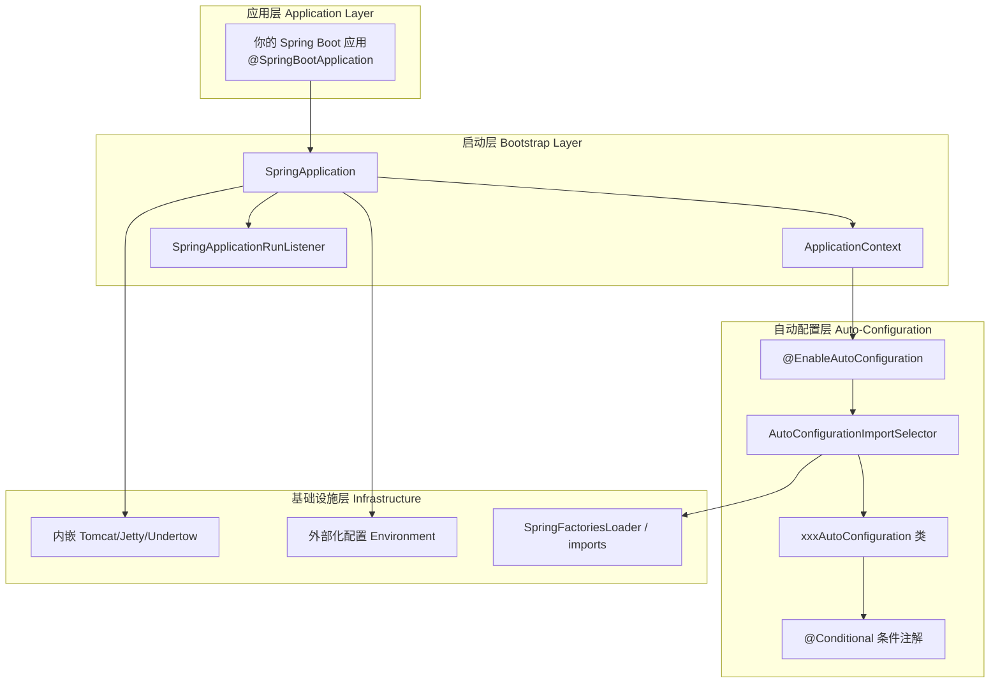
```mermaid
flowchart TB
    subgraph APP["应用层 Application Layer"]
        A["你的 Spring Boot 应用<br/>@SpringBootApplication"]
    end

    subgraph AC["自动配置层 Auto-Configuration"]
        B1["@EnableAutoConfiguration"]
        B2["AutoConfigurationImportSelector"]
        B3["xxxAutoConfiguration 类"]
        B4["@Conditional 条件注解"]
    end

    subgraph BL["启动层 Bootstrap Layer"]
        C1["SpringApplication"]
        C2["ApplicationContext"]
        C3["SpringApplicationRunListener"]
    end

    subgraph INFRA["基础设施层 Infrastructure"]
        D1["内嵌 Tomcat/Jetty/Undertow"]
        D2["外部化配置 Environment"]
        D3["SpringFactoriesLoader / imports"]
    end

    A --> C1
    C1 --> C2
    C1 --> C3
    B1 --> B2
    B2 --> B3
    B3 --> B4
    C2 --> B1
    C1 --> D1
    C1 --> D2
    B2 --> D3
```

### 核心模块结构

```
spring-boot-project/
├── spring-boot/                          # 核心启动模块
│   └── src/main/java/org/springframework/boot/
│       ├── SpringApplication.java         # 启动入口，整体编排
│       ├── SpringApplicationRunListener   # 启动生命周期监听器
│       ├── ApplicationContextInitializer  # 上下文初始化器
│       ├── ApplicationListener            # 事件监听器
│       ├── web/
│       │   ├── context/                   # Web 上下文实现
│       │   └── server/                    # 内嵌服务器抽象
│       └── env/                           # 环境与配置加载
│
├── spring-boot-autoconfigure/            # 自动配置模块（最重要）
│   └── src/main/java/org/springframework/boot/autoconfigure/
│       ├── AutoConfigurationImportSelector.java  # 自动配置选择器
│       ├── condition/                           # 条件注解实现
│       └── web/servlet/                         # Web MVC 自动配置
│
└── spring-boot-starters/                 # Starter 依赖集合
    ├── spring-boot-starter-web/
    ├── spring-boot-starter-data-jpa/
    └── ...
```

---

## 2. SpringApplication 启动流程

这是 Spring Boot 最核心的流程。整个启动过程被 `SpringApplication.run()` 方法编排为**十个关键阶段**。

### 2.1 完整时序图

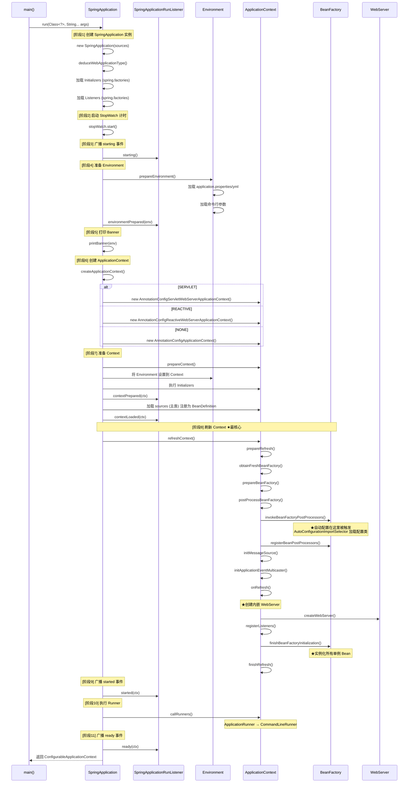
```mermaid
sequenceDiagram
    participant Main as main()
    participant SA as SpringApplication
    participant Listener as SpringApplicationRunListener
    participant Env as Environment
    participant Ctx as ApplicationContext
    participant BF as BeanFactory
    participant Server as WebServer

    Main->>SA: run(Class<?>, String... args)
    
    Note over SA: [阶段1] 创建 SpringApplication 实例
    SA->>SA: new SpringApplication(sources)
    SA->>SA: deduceWebApplicationType()
    SA->>SA: 加载 Initializers (spring.factories)
    SA->>SA: 加载 Listeners (spring.factories)
    
    Note over SA: [阶段2] 启动 StopWatch 计时
    SA->>SA: stopWatch.start()
    
    Note over SA: [阶段3] 广播 starting 事件
    SA->>Listener: starting()
    
    Note over SA: [阶段4] 准备 Environment
    SA->>Env: prepareEnvironment()
    Env->>Env: 加载 application.properties/yml
    Env->>Env: 加载命令行参数
    SA->>Listener: environmentPrepared(env)
    
    Note over SA: [阶段5] 打印 Banner
    SA->>SA: printBanner(env)
    
    Note over SA: [阶段6] 创建 ApplicationContext
    SA->>SA: createApplicationContext()
    alt SERVLET
        SA->>Ctx: new AnnotationConfigServletWebServerApplicationContext()
    else REACTIVE
        SA->>Ctx: new AnnotationConfigReactiveWebServerApplicationContext()
    else NONE
        SA->>Ctx: new AnnotationConfigApplicationContext()
    end
    
    Note over SA: [阶段7] 准备 Context
    SA->>Ctx: prepareContext()
    SA->>Env: 将 Environment 设置到 Context
    SA->>Ctx: 执行 Initializers
    SA->>Listener: contextPrepared(ctx)
    SA->>Ctx: 加载 sources (主类) 注册为 BeanDefinition
    SA->>Listener: contextLoaded(ctx)
    
    Note over SA,BF: [阶段8] 刷新 Context ★最核心
    SA->>Ctx: refreshContext()
    Ctx->>Ctx: prepareRefresh()
    Ctx->>Ctx: obtainFreshBeanFactory()
    Ctx->>Ctx: prepareBeanFactory()
    Ctx->>Ctx: postProcessBeanFactory()
    Ctx->>BF: invokeBeanFactoryPostProcessors()
    Note over BF: ★自动配置在这里被触发<br/>AutoConfigurationImportSelector 加载配置类
    Ctx->>BF: registerBeanPostProcessors()
    Ctx->>Ctx: initMessageSource()
    Ctx->>Ctx: initApplicationEventMulticaster()
    Ctx->>Ctx: onRefresh()
    Note over Ctx: ★创建内嵌 WebServer
    Ctx->>Server: createWebServer()
    Ctx->>Ctx: registerListeners()
    Ctx->>BF: finishBeanFactoryInitialization()
    Note over BF: ★实例化所有单例 Bean
    Ctx->>Ctx: finishRefresh()
    
    Note over SA: [阶段9] 广播 started 事件
    SA->>Listener: started(ctx)
    
    Note over SA: [阶段10] 执行 Runner
    SA->>Ctx: callRunners()
    Note over Ctx: ApplicationRunner → CommandLineRunner
    
    Note over SA: [阶段11] 广播 ready 事件
    SA->>Listener: ready(ctx)
    
    SA-->>Main: 返回 ConfigurableApplicationContext
```

### 2.2 阶段详解

#### 阶段 1：SpringApplication 构造

```java
// SpringApplication.java
public SpringApplication(ResourceLoader resourceLoader, Class<?>... primarySources) {
    this.resourceLoader = resourceLoader;
    this.primarySources = new LinkedHashSet<>(Arrays.asList(primarySources));
    
    // ★ 推断应用类型
    this.webApplicationType = WebApplicationType.deduceFromClasspath();
    
    // ★ 加载 BootstrapRegistryInitializer
    this.bootstrapRegistryInitializers = new ArrayList<>(
        getSpringFactoriesInstances(BootstrapRegistryInitializer.class));
    
    // ★ 加载 ApplicationContextInitializer
    setInitializers(getSpringFactoriesInstances(ApplicationContextInitializer.class));
    
    // ★ 加载 ApplicationListener
    setListeners(getSpringFactoriesInstances(ApplicationListener.class));
    
    // ★ 推断 main 方法所在类
    this.mainApplicationClass = deduceMainApplicationClass();
}
```

**应用类型推断（`WebApplicationType.deduceFromClasspath()`）**：

| 类型 | 条件 | ApplicationContext |
|------|------|-------------------|
| `SERVLET` | classpath 存在 `DispatcherServlet` 且无 `DispatcherHandler` | `AnnotationConfigServletWebServerApplicationContext` |
| `REACTIVE` | classpath 存在 `DispatcherHandler` | `AnnotationConfigReactiveWebServerApplicationContext` |
| `NONE` | 两者都不存在 | `AnnotationConfigApplicationContext` |

#### 阶段 6：创建 ApplicationContext

```java
// SpringApplication.java
protected ConfigurableApplicationContext createApplicationContext() {
    return switch (this.webApplicationType) {
        case SERVLET -> new AnnotationConfigServletWebServerApplicationContext();
        case REACTIVE -> new AnnotationConfigReactiveWebServerApplicationContext();
        default -> new AnnotationConfigApplicationContext();
    };
}
```

ApplicationContext 继承体系：

```
AnnotationConfigServletWebServerApplicationContext
└── ServletWebServerApplicationContext
    └── GenericWebApplicationContext
        └── GenericApplicationContext
            └── AbstractApplicationContext  ← refresh() 在这里定义
```

#### 阶段 8：refreshContext() — 最核心的刷新流程

```java
// AbstractApplicationContext.java
public void refresh() throws BeansException, IllegalStateException {
    synchronized (this.startupShutdownMonitor) {
        // 1. 准备刷新：设置状态、校验属性
        prepareRefresh();
        
        // 2. 获取 BeanFactory
        ConfigurableListableBeanFactory beanFactory = obtainFreshBeanFactory();
        
        // 3. 准备 BeanFactory（注册基础组件）
        prepareBeanFactory(beanFactory);
        
        try {
            // 4. BeanFactory 后置处理（留给子类扩展）
            postProcessBeanFactory(beanFactory);
            
            // ★ 5. 调用 BeanFactoryPostProcessor
            //    这里触发 ConfigurationClassPostProcessor
            //    → 处理 @Configuration 类
            //    → @EnableAutoConfiguration → AutoConfigurationImportSelector
            //    → 加载所有自动配置类 → 条件过滤 → 注册 BeanDefinition
            invokeBeanFactoryPostProcessors(beanFactory);
            
            // 6. 注册 BeanPostProcessor
            registerBeanPostProcessors(beanFactory);
            
            // 7. 初始化 MessageSource（国际化）
            initMessageSource();
            
            // 8. 初始化事件广播器
            initApplicationEventMulticaster();
            
            // 9. ★ onRefresh(): 创建内嵌 WebServer
            onRefresh();
            
            // 10. 注册事件监听器
            registerListeners();
            
            // ★ 11. 实例化所有非懒加载的单例 Bean
            finishBeanFactoryInitialization(beanFactory);
            
            // 12. 完成刷新（发布 ContextRefreshedEvent）
            finishRefresh();
        }
        catch (BeansException ex) {
            destroyBeans();
            cancelRefresh(ex);
            throw ex;
        }
    }
}
```

---

## 3. 自动配置机制

自动配置是 Spring Boot 最核心的特性，它让你"开箱即用"零配置即可使用各种组件。

### 3.1 全链路流程图

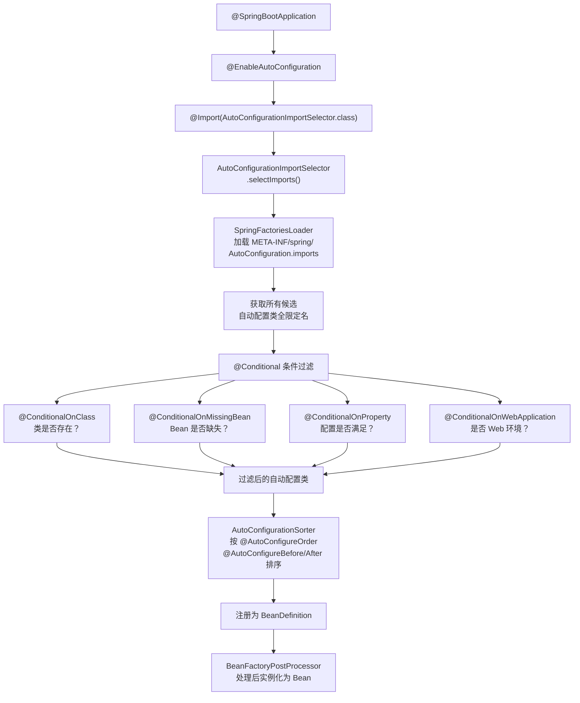
```mermaid
flowchart TD
    A["@SpringBootApplication"] --> B["@EnableAutoConfiguration"]
    B --> C["@Import(AutoConfigurationImportSelector.class)"]
    C --> D["AutoConfigurationImportSelector<br/>.selectImports()"]
    
    D --> E["SpringFactoriesLoader<br/>加载 META-INF/spring/<br/>AutoConfiguration.imports"]
    
    E --> F["获取所有候选<br/>自动配置类全限定名"]
    
    F --> G["@Conditional 条件过滤"]
    
    G --> G1["@ConditionalOnClass<br/>类是否存在？"]
    G --> G2["@ConditionalOnMissingBean<br/>Bean 是否缺失？"]
    G --> G3["@ConditionalOnProperty<br/>配置是否满足？"]
    G --> G4["@ConditionalOnWebApplication<br/>是否 Web 环境？"]
    
    G1 --> H["过滤后的自动配置类"]
    G2 --> H
    G3 --> H
    G4 --> H
    
    H --> I["AutoConfigurationSorter<br/>按 @AutoConfigureOrder<br/>@AutoConfigureBefore/After 排序"]
    
    I --> J["注册为 BeanDefinition"]
    J --> K["BeanFactoryPostProcessor<br/>处理后实例化为 Bean"]
```

### 3.2 @SpringBootApplication 的组成

```java
@Target(ElementType.TYPE)
@Retention(RetentionPolicy.RUNTIME)
@Documented
@Inherited
@SpringBootConfiguration         // ← 本质是 @Configuration
@EnableAutoConfiguration         // ← 开启自动配置
@ComponentScan(                  // ← 组件扫描
    excludeFilters = {
        @Filter(type = FilterType.CUSTOM, classes = TypeExcludeFilter.class),
        @Filter(type = FilterType.CUSTOM, classes = AutoConfigurationExcludeFilter.class)
    }
)
public @interface SpringBootApplication {
    // 可以排除特定自动配置类
    @AliasFor(annotation = EnableAutoConfiguration.class)
    Class<?>[] exclude() default {};
    
    // 可以排除特定自动配置类名
    @AliasFor(annotation = EnableAutoConfiguration.class)
    String[] excludeName() default {};
}
```

### 3.3 @EnableAutoConfiguration 核心实现

```java
@Target(ElementType.TYPE)
@Retention(RetentionPolicy.RUNTIME)
@Documented
@Inherited
@AutoConfigurationPackage        // 记录主类所在包，用于实体扫描
@Import(AutoConfigurationImportSelector.class)  // ★ 关键：导入选择器
public @interface EnableAutoConfiguration {
    String ENABLED_OVERRIDE_PROPERTY = "spring.boot.enableautoconfiguration";
    Class<?>[] exclude() default {};
    String[] excludeName() default {};
}
```

### 3.4 AutoConfigurationImportSelector 选择逻辑

```java
// AutoConfigurationImportSelector.java
public class AutoConfigurationImportSelector 
    implements DeferredImportSelector, BeanClassLoaderAware, 
               ResourceLoaderAware, BeanFactoryAware, EnvironmentAware {
    
    // 核心方法：选择要导入的自动配置类
    @Override
    public String[] selectImports(AnnotationMetadata annotationMetadata) {
        if (!isEnabled(annotationMetadata)) {
            return NO_IMPORTS;
        }
        
        // ★ 1. 获取所有候选自动配置类
        AutoConfigurationEntry entry = getAutoConfigurationEntry(annotationMetadata);
        return StringUtils.toStringArray(entry.getConfigurations());
    }
    
    protected AutoConfigurationEntry getAutoConfigurationEntry(
            AnnotationMetadata annotationMetadata) {
        
        // 2. 加载所有候选（从 spring.factories 或 imports 文件）
        List<String> configurations = getCandidateConfigurations(annotationMetadata, attributes);
        
        // 3. 去重
        configurations = removeDuplicates(configurations);
        
        // 4. 获取用户排除的配置类
        Set<String> exclusions = getExclusions(annotationMetadata, attributes);
        
        // 5. 应用过滤器（@Conditional 条件检查）
        configurations = filter(configurations, autoConfigurationMetadata);
        
        // 6. 触发 AutoConfigurationImportEvent 事件
        fireAutoConfigurationImportEvents(configurations, exclusions);
        
        return new AutoConfigurationEntry(configurations, exclusions);
    }
}
```

### 3.5 加载候选配置类的两种方式

**Spring Boot 3.x（新方式）**：
```
META-INF/spring/org.springframework.boot.autoconfigure.AutoConfiguration.imports
```
每行一个全限定类名，例如：
```
org.springframework.boot.autoconfigure.web.servlet.WebMvcAutoConfiguration
org.springframework.boot.autoconfigure.jdbc.DataSourceAutoConfiguration
org.springframework.boot.autoconfigure.orm.jpa.HibernateJpaAutoConfiguration
```

**Spring Boot 2.x（旧方式，已废弃）**：
```
META-INF/spring.factories
```
键值对格式：
```
org.springframework.boot.autoconfigure.EnableAutoConfiguration=\
org.springframework.boot.autoconfigure.web.servlet.WebMvcAutoConfiguration,\
org.springframework.boot.autoconfigure.jdbc.DataSourceAutoConfiguration
```

### 3.6 @Conditional 条件注解体系

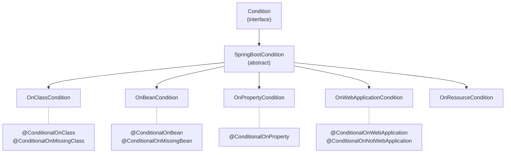
```mermaid
flowchart TB
    Condition["Condition<br/>(interface)"] --> SpringBootCondition["SpringBootCondition<br/>(abstract)"]
    SpringBootCondition --> OnClassCondition["OnClassCondition"]
    SpringBootCondition --> OnBeanCondition["OnBeanCondition"]
    SpringBootCondition --> OnPropertyCondition["OnPropertyCondition"]
    SpringBootCondition --> OnWebApplicationCondition["OnWebApplicationCondition"]
    SpringBootCondition --> OnResourceCondition["OnResourceCondition"]
    
    OnClassCondition -.- A["@ConditionalOnClass<br/>@ConditionalOnMissingClass"]
    OnBeanCondition -.- B["@ConditionalOnBean<br/>@ConditionalOnMissingBean"]
    OnPropertyCondition -.- C["@ConditionalOnProperty"]
    OnWebApplicationCondition -.- D["@ConditionalOnWebApplication<br/>@ConditionalOnNotWebApplication"]
```

常用条件注解：

| 注解 | 条件 | 典型用途 |
|------|------|----------|
| `@ConditionalOnClass` | classpath 中存在指定类 | `DataSourceAutoConfiguration` 检查是否有数据源驱动 |
| `@ConditionalOnMissingClass` | classpath 中不存在指定类 | 仅在没有某个库时启用备选方案 |
| `@ConditionalOnBean` | 容器中存在指定 Bean | 仅在用户自定义了某 Bean 后才启用 |
| `@ConditionalOnMissingBean` | 容器中不存在指定 Bean | 提供默认实现，用户可覆盖 |
| `@ConditionalOnProperty` | 配置属性满足条件 | `spring.datasource.url` 存在时启用数据源 |
| `@ConditionalOnWebApplication` | 是 Web 应用 | 区分 MVC 和 WebFlux 配置 |
| `@ConditionalOnResource` | 存在指定资源文件 | 检查 classpath 中是否有特定配置文件 |
| `@ConditionalOnExpression` | SpEL 表达式为 true | 复杂条件组合 |
| `@ConditionalOnJava` | Java 版本满足要求 | 根据 JDK 版本启用不同特性 |

### 3.7 自动配置示例：WebMvcAutoConfiguration

```java
@AutoConfiguration(
    after = { 
        DispatcherServletAutoConfiguration.class,
        TaskExecutionAutoConfiguration.class, 
        ValidationAutoConfiguration.class 
    }
)
@ConditionalOnWebApplication(type = Type.SERVLET)  // ★ 仅 Servlet 环境
@ConditionalOnClass({ Servlet.class, DispatcherServlet.class, WebMvcConfigurer.class })
@ConditionalOnMissingBean(WebMvcConfigurationSupport.class)  // ★ 用户自定义优先
@AutoConfigureOrder(Ordered.HIGHEST_PRECEDENCE + 10)
public class WebMvcAutoConfiguration {

    @Configuration(proxyBeanMethods = false)
    @Import(EnableWebMvcConfiguration.class)
    @EnableConfigurationProperties({ WebMvcProperties.class, WebProperties.class })
    @Order(0)
    public static class WebMvcAutoConfigurationAdapter 
            implements WebMvcConfigurer, ServletContextAware {
        
        // 配置视图解析器
        @Bean
        @ConditionalOnMissingBean
        public InternalResourceViewResolver defaultViewResolver() {
            // ...
        }
        
        // 配置静态资源
        @Override
        public void addResourceHandlers(ResourceHandlerRegistry registry) {
            // ...
        }
    }
}
```

---

## 4. 内嵌 Web 服务器

Spring Boot 内嵌了 Tomcat、Jetty、Undertow 三种 Servlet 容器，默认使用 Tomcat。

### 4.1 类层次结构

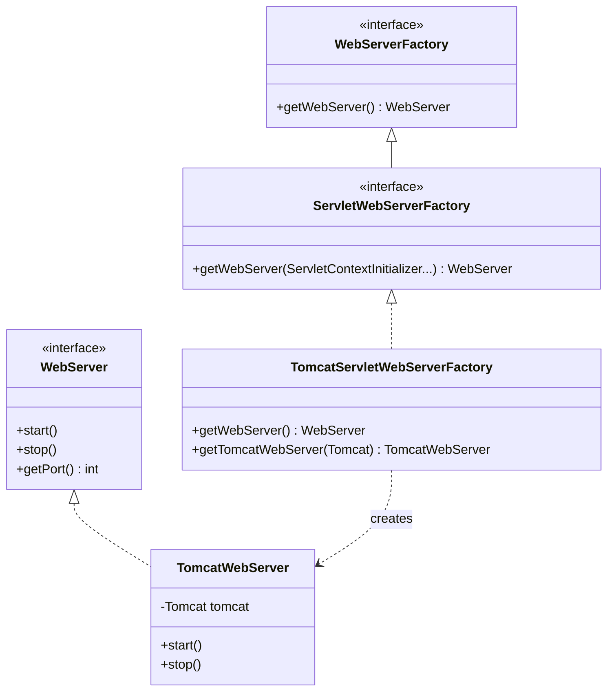
```mermaid
classDiagram
    class WebServer {
        <<interface>>
        +start()
        +stop()
        +getPort() int
    }
    
    class WebServerFactory {
        <<interface>>
        +getWebServer() WebServer
    }
    
    class ServletWebServerFactory {
        <<interface>>
        +getWebServer(ServletContextInitializer...) WebServer
    }
    
    class TomcatServletWebServerFactory {
        +getWebServer() WebServer
        +getTomcatWebServer(Tomcat) TomcatWebServer
    }
    
    class TomcatWebServer {
        -Tomcat tomcat
        +start()
        +stop()
    }
    
    WebServer <|.. TomcatWebServer
    WebServerFactory <|-- ServletWebServerFactory
    ServletWebServerFactory <|.. TomcatServletWebServerFactory
    TomcatServletWebServerFactory ..> TomcatWebServer : creates
```

### 4.2 WebServer 创建流程

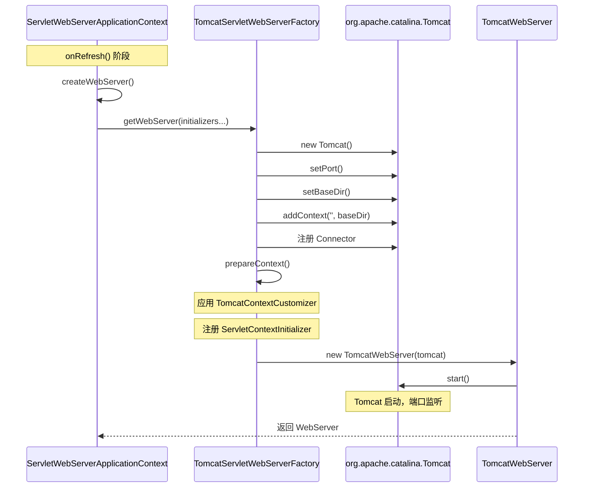
```mermaid
sequenceDiagram
    participant AC as ServletWebServerApplicationContext
    participant Factory as TomcatServletWebServerFactory
    participant Tomcat as org.apache.catalina.Tomcat
    participant WS as TomcatWebServer
    
    Note over AC: onRefresh() 阶段
    AC->>AC: createWebServer()
    AC->>Factory: getWebServer(initializers...)
    
    Factory->>Tomcat: new Tomcat()
    Factory->>Tomcat: setPort()
    Factory->>Tomcat: setBaseDir()
    Factory->>Tomcat: addContext('', baseDir)
    Factory->>Tomcat: 注册 Connector
    
    Factory->>Factory: prepareContext()
    Note over Factory: 应用 TomcatContextCustomizer
    Note over Factory: 注册 ServletContextInitializer
    
    Factory->>WS: new TomcatWebServer(tomcat)
    WS->>Tomcat: start()
    Note over Tomcat: Tomcat 启动，端口监听
    
    WS-->>AC: 返回 WebServer
```

### 4.3 DispatcherServlet 注册流程

```java
// DispatcherServletAutoConfiguration.java
@AutoConfiguration
@ConditionalOnWebApplication(type = Type.SERVLET)
@ConditionalOnClass(DispatcherServlet.class)
public class DispatcherServletAutoConfiguration {

    // ★ Spring Boot 自动注册 DispatcherServlet
    @Bean(name = DEFAULT_DISPATCHER_SERVLET_BEAN_NAME)
    public DispatcherServlet dispatcherServlet(
            WebMvcProperties webMvcProperties) {
        DispatcherServlet dispatcherServlet = new DispatcherServlet();
        dispatcherServlet.setDispatchOptionsRequest(/*...*/);
        return dispatcherServlet;
    }

    // ★ 注册为 ServletRegistrationBean，映射到 "/"
    @Bean(name = DEFAULT_DISPATCHER_SERVLET_REGISTRATION_BEAN_NAME)
    @ConditionalOnBean(value = DispatcherServlet.class, 
            name = DEFAULT_DISPATCHER_SERVLET_BEAN_NAME)
    public DispatcherServletRegistrationBean dispatcherServletRegistration(
            DispatcherServlet dispatcherServlet,
            WebMvcProperties webMvcProperties) {
        
        DispatcherServletRegistrationBean registration = 
            new DispatcherServletRegistrationBean(dispatcherServlet, "/");
        registration.setLoadOnStartup(webMvcProperties.getServlet().getLoadOnStartup());
        return registration;
    }
}
```

**ServletContextInitializer 链**：

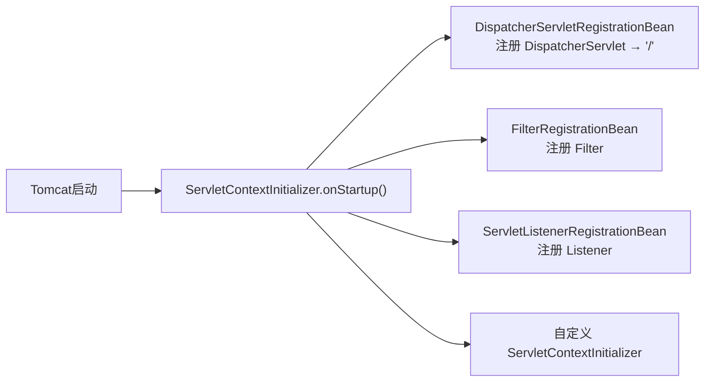
```mermaid
flowchart LR
    A["Tomcat启动"] --> B["ServletContextInitializer.onStartup()"]
    B --> C1["DispatcherServletRegistrationBean<br/>注册 DispatcherServlet → '/'"]
    B --> C2["FilterRegistrationBean<br/>注册 Filter"]
    B --> C3["ServletListenerRegistrationBean<br/>注册 Listener"]
    B --> C4["自定义 ServletContextInitializer"]
```

---

## 5. Bean 生命周期

Spring Bean 在 `AbstractApplicationContext.refresh()` → `finishBeanFactoryInitialization()` 阶段完成实例化。

### 5.1 完整生命周期

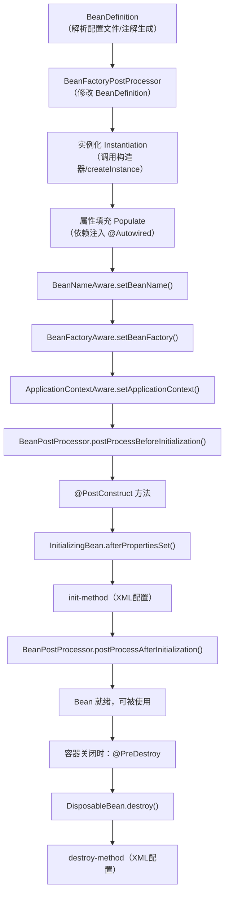
```mermaid
flowchart TD
    A["BeanDefinition<br/>（解析配置文件/注解生成）"] --> B["BeanFactoryPostProcessor<br/>（修改 BeanDefinition）"]
    B --> C["实例化 Instantiation<br/>（调用构造器/createInstance）"]
    C --> D["属性填充 Populate<br/>（依赖注入 @Autowired）"]
    D --> E["BeanNameAware.setBeanName()"]
    E --> F["BeanFactoryAware.setBeanFactory()"]
    F --> G["ApplicationContextAware.setApplicationContext()"]
    G --> H["BeanPostProcessor.postProcessBeforeInitialization()"]
    H --> I["@PostConstruct 方法"]
    I --> J["InitializingBean.afterPropertiesSet()"]
    J --> K["init-method（XML配置）"]
    K --> L["BeanPostProcessor.postProcessAfterInitialization()"]
    L --> M["Bean 就绪，可被使用"]
    M --> N["容器关闭时：@PreDestroy"]
    N --> O["DisposableBean.destroy()"]
    O --> P["destroy-method（XML配置）"]
```

### 5.2 BeanPostProcessor 的桥梁作用

```java
public interface BeanPostProcessor {
    // 在初始化之前调用
    @Nullable
    default Object postProcessBeforeInitialization(Object bean, String beanName) 
            throws BeansException {
        return bean;
    }
    
    // 在初始化之后调用
    @Nullable
    default Object postProcessAfterInitialization(Object bean, String beanName) 
            throws BeansException {
        return bean;
    }
}
```

**核心 BeanPostProcessor 实现**：

| 实现类 | 作用 |
|--------|------|
| `AutowiredAnnotationBeanPostProcessor` | 处理 `@Autowired`、`@Value` 注入 |
| `CommonAnnotationBeanPostProcessor` | 处理 `@PostConstruct`、`@PreDestroy` |
| `ConfigurationPropertiesBindingPostProcessor` | 绑定 `@ConfigurationProperties` |
| `ApplicationContextAwareProcessor` | 注入 `ApplicationContext` 等 Aware 接口 |

### 5.3 BeanFactoryPostProcessor 的角色

```java
public interface BeanFactoryPostProcessor {
    // 在所有 BeanDefinition 加载后、实例化前调用
    void postProcessBeanFactory(ConfigurableListableBeanFactory beanFactory) 
            throws BeansException;
}
```

**关键实现：**

```java
// ConfigurationClassPostProcessor.java — 处理 @Configuration 类
// 这是触发自动配置的关键！
public class ConfigurationClassPostProcessor implements BeanDefinitionRegistryPostProcessor {
    
    @Override
    public void postProcessBeanDefinitionRegistry(BeanDefinitionRegistry registry) {
        // 解析 @Configuration 类
        ConfigurationClassParser parser = new ConfigurationClassParser(/*...*/);
        // ★ 这里面会处理 @Import，触发 AutoConfigurationImportSelector
        parser.parse(configCandidates);
    }
}
```

---

## 6. 外部化配置加载

Spring Boot 支持从多种来源加载配置，并按优先级合并。

### 6.1 配置加载流程

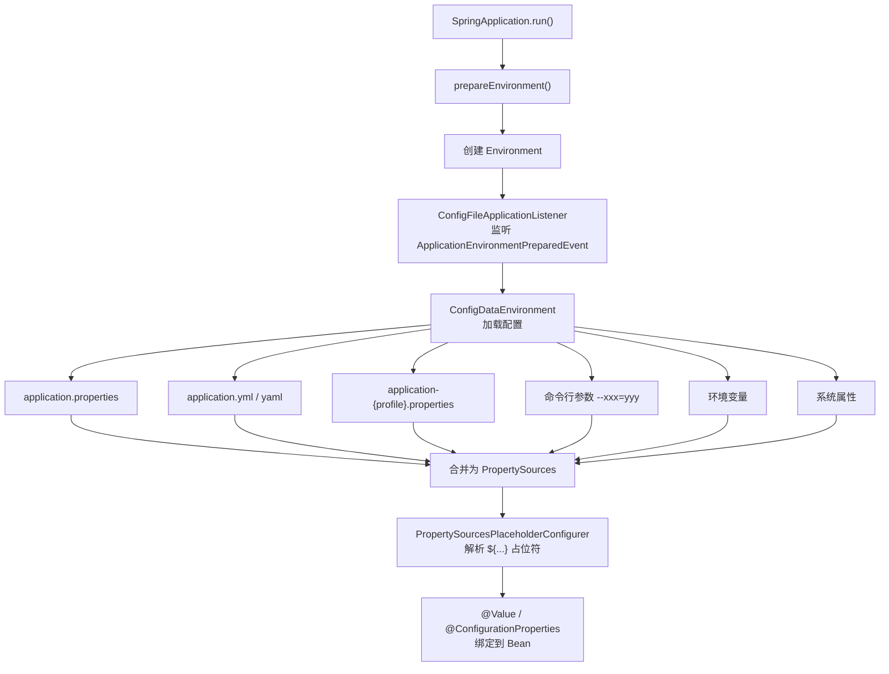
```mermaid
flowchart TD
    A["SpringApplication.run()"] --> B["prepareEnvironment()"]
    B --> C["创建 Environment"]
    C --> D["ConfigFileApplicationListener<br/>监听 ApplicationEnvironmentPreparedEvent"]
    D --> E["ConfigDataEnvironment<br/>加载配置"]
    
    E --> F1["application.properties"]
    E --> F2["application.yml / yaml"]
    E --> F3["application-{profile}.properties"]
    E --> F4["命令行参数 --xxx=yyy"]
    E --> F5["环境变量"]
    E --> F6["系统属性"]
    
    F1 --> G["合并为 PropertySources"]
    F2 --> G
    F3 --> G
    F4 --> G
    F5 --> G
    F6 --> G
    G --> H["PropertySourcesPlaceholderConfigurer<br/>解析 ${...} 占位符"]
    H --> I["@Value / @ConfigurationProperties<br/>绑定到 Bean"]
```

### 6.2 配置优先级（从高到低）

```
1. 命令行参数 (--server.port=8081)
2. SPRING_APPLICATION_JSON 环境变量
3. ServletConfig 初始化参数
4. JNDI 属性
5. Java 系统属性 (-Dserver.port=8081)
6. 操作系统环境变量
7. application-{profile}.properties（外部 jar 包外）
8. application-{profile}.properties（jar 包内）
9. application.properties（外部 jar 包外）
10. application.properties（jar 包内）
11. @PropertySource 注解
12. SpringApplication.setDefaultProperties()
```

### 6.3 @ConfigurationProperties 绑定

```java
// 配置类定义
@ConfigurationProperties(prefix = "server")
public class ServerProperties {
    private int port = 8080;       // 默认值
    private String address;
    private Servlet servlet = new Servlet();
    
    public static class Servlet {
        private String contextPath;
        private int sessionTimeout = 30 * 60;
    }
}

// 在自动配置中启用
@EnableConfigurationProperties(ServerProperties.class)
public class SomeAutoConfiguration {
    // ...
}
```

对应配置：
```properties
server.port=9090
server.address=0.0.0.0
server.servlet.context-path=/api
server.servlet.session-timeout=3600
```

---

## 7. 核心扩展点

Spring Boot 提供了丰富的扩展点，让你可以在启动各阶段插入自定义逻辑。

### 7.1 扩展点全景图

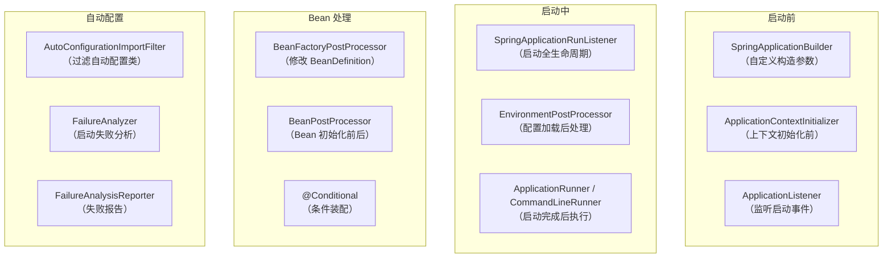
```mermaid
flowchart TD
    subgraph "启动前"
        A1["SpringApplicationBuilder<br/>（自定义构造参数）"]
        A2["ApplicationContextInitializer<br/>（上下文初始化前）"]
        A3["ApplicationListener<br/>（监听启动事件）"]
    end
    
    subgraph "启动中"
        B1["SpringApplicationRunListener<br/>（启动全生命周期）"]
        B2["EnvironmentPostProcessor<br/>（配置加载后处理）"]
        B3["ApplicationRunner / CommandLineRunner<br/>（启动完成后执行）"]
    end
    
    subgraph "Bean 处理"
        C1["BeanFactoryPostProcessor<br/>（修改 BeanDefinition）"]
        C2["BeanPostProcessor<br/>（Bean 初始化前后）"]
        C3["@Conditional<br/>（条件装配）"]
    end
    
    subgraph "自动配置"
        D1["AutoConfigurationImportFilter<br/>（过滤自动配置类）"]
        D2["FailureAnalyzer<br/>（启动失败分析）"]
        D3["FailureAnalysisReporter<br/>（失败报告）"]
    end
```

### 7.2 常用扩展点实现示例

#### ApplicationContextInitializer

```java
// 在 SpringApplication 上下文准备阶段执行
public class MyInitializer implements ApplicationContextInitializer<ConfigurableApplicationContext> {
    @Override
    public void initialize(ConfigurableApplicationContext ctx) {
        // 添加自定义 PropertySource
        ctx.getEnvironment().getPropertySources().addFirst(
            new MapPropertySource("custom", Map.of("my.key", "value"))
        );
    }
}

// 注册方式 1：META-INF/spring.factories
// org.springframework.context.ApplicationContextInitializer=\
// com.example.MyInitializer

// 注册方式 2：代码
new SpringApplication(MyApp.class)
    .addInitializers(new MyInitializer())
    .run(args);
```

#### ApplicationRunner

```java
@Component
@Order(1)
public class DataInitializer implements ApplicationRunner {
    @Override
    public void run(ApplicationArguments args) throws Exception {
        // 容器完全启动后执行
        // 可以在这里做数据初始化、缓存预热等
    }
}

// CommandLineRunner 类似，提供原始 String[] args
@Component
public class StartupLogger implements CommandLineRunner {
    @Override
    public void run(String... args) throws Exception {
        System.out.println("Application started with args: " + Arrays.toString(args));
    }
}
```

#### FailureAnalyzer

```java
// 自定义启动失败分析
public class PortInUseFailureAnalyzer 
        extends AbstractFailureAnalyzer<PortInUseException> {
    
    @Override
    protected FailureAnalysis analyze(Throwable rootFailure, PortInUseException cause) {
        return new FailureAnalysis(
            "端口 " + cause.getPort() + " 已被占用",
            "请检查是否有其他进程占用该端口，或修改 server.port 配置",
            cause
        );
    }
}

// META-INF/spring.factories
// org.springframework.boot.diagnostics.FailureAnalyzer=\
// com.example.PortInUseFailureAnalyzer
```

---

## 总结

Spring Boot 的源码架构可以概括为 **"一个入口，三级编排，N 个扩展点"**：

| 层次 | 核心类 | 职责 |
|------|--------|------|
| **启动编排** | `SpringApplication` | 协调整个启动流程，管理生命周期事件 |
| **自动配置** | `AutoConfigurationImportSelector` | 按条件加载配置类，实现"约定优于配置" |
| **上下文刷新** | `AbstractApplicationContext.refresh()` | BeanDefinition → 实例化 → 初始化 → 就绪 |
| **内嵌服务器** | `ServletWebServerApplicationContext` | 零配置集成 Tomcat/Jetty/Undertow |
| **外部化配置** | `ConfigDataEnvironment` | 多来源配置加载与优先级合并 |

理解这些核心流程后，无论是排查启动问题、自定义 Starter、还是阅读其他 Spring 生态项目的源码，都将事半功倍。

---

*本文基于 Spring Boot 3.x 源码编写。*

---

# 第二部分：Spring Framework 源码深度解析

---

## 8. IoC 容器核心架构

IoC（Inversion of Control）是 Spring Framework 的基石。整个容器围绕 **BeanDefinition → BeanFactory → ApplicationContext** 三层抽象构建。

### 8.1 ApplicationContext 继承体系

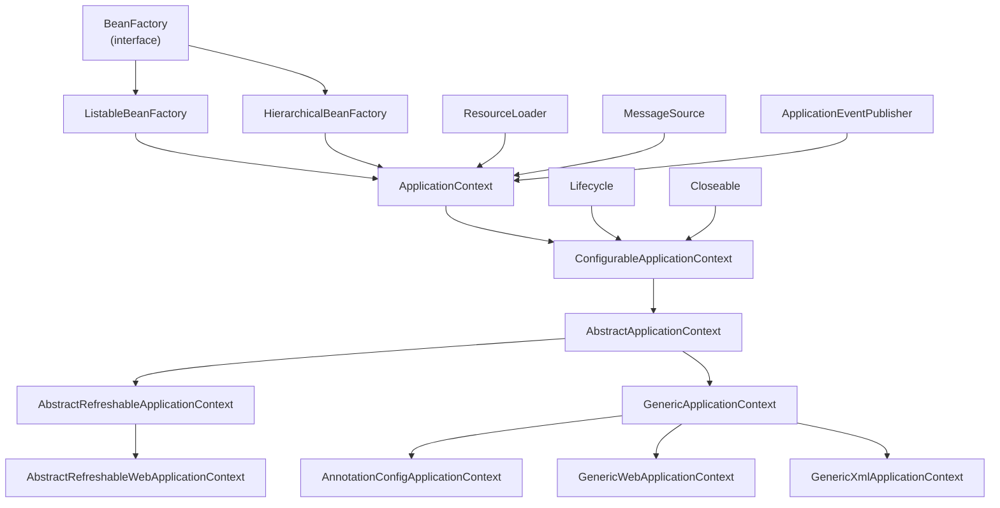
```mermaid
flowchart TB
    BF["BeanFactory<br/>(interface)"]
    LBF["ListableBeanFactory"]
    HBF["HierarchicalBeanFactory"]
    
    AC["ApplicationContext"]
    RL["ResourceLoader"]
    MP["MessageSource"]
    EP["ApplicationEventPublisher"]
    
    CAC["ConfigurableApplicationContext"]
    LS["Lifecycle"]
    CAC2["Closeable"]
    
    AAC["AbstractApplicationContext"]
    
    ARAC["AbstractRefreshableApplicationContext"]
    GAC["GenericApplicationContext"]
    
    ARWAC["AbstractRefreshableWebApplicationContext"]
    ASC["AnnotationConfigApplicationContext"]
    GWA["GenericWebApplicationContext"]
    GWXA["GenericXmlApplicationContext"]
    
    BF --> LBF
    BF --> HBF
    LBF --> AC
    HBF --> AC
    RL --> AC
    MP --> AC
    EP --> AC
    AC --> CAC
    LS --> CAC
    CAC2 --> CAC
    CAC --> AAC
    AAC --> ARAC
    AAC --> GAC
    ARAC --> ARWAC
    GAC --> ASC
    GAC --> GWA
    GAC --> GWXA
```

**关键接口职责**：

| 接口 | 包路径 | 职责 |
|------|--------|------|
| `BeanFactory` | `org.springframework.beans.factory` | IoC 容器根接口，提供 getBean() |
| `ListableBeanFactory` | `org.springframework.beans.factory` | 可枚举所有 Bean |
| `HierarchicalBeanFactory` | `org.springframework.beans.factory` | 父子容器层级 |
| `ApplicationContext` | `org.springframework.context` | 聚合 BeanFactory + 事件 + 国际化 + 资源加载 |
| `ConfigurableApplicationContext` | `org.springframework.context` | 可配置生命周期（refresh/close） |

### 8.2 BeanDefinition 加载流程

Spring 通过三种 Reader 将不同类型的配置源解析为统一的 `BeanDefinition`：

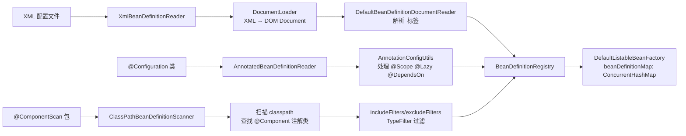
```mermaid
flowchart LR
    XML["XML 配置文件"] --> XmlReader["XmlBeanDefinitionReader"]
    Anno["@Configuration 类"] --> AtReader["AnnotatedBeanDefinitionReader"]
    Scan["@ComponentScan 包"] --> Scanner["ClassPathBeanDefinitionScanner"]
    
    XmlReader --> DocLoader["DocumentLoader<br/>XML → DOM Document"]
    DocLoader --> DefaultReader["DefaultBeanDefinitionDocumentReader<br/>解析 <bean> 标签"]
    
    AtReader --> AnnoUtils["AnnotationConfigUtils<br/>处理 @Scope @Lazy @DependsOn"]
    
    Scanner --> PathResolver["扫描 classpath<br/>查找 @Component 注解类"]
    PathResolver --> Filter["includeFilters/excludeFilters<br/>TypeFilter 过滤"]
    
    DefaultReader --> Registry["BeanDefinitionRegistry"]
    AnnoUtils --> Registry
    Filter --> Registry
    
    Registry --> Map["DefaultListableBeanFactory<br/>beanDefinitionMap: ConcurrentHashMap"]
```

**`DefaultListableBeanFactory` 核心数据结构**：

```java
// DefaultListableBeanFactory.java
public class DefaultListableBeanFactory extends AbstractAutowireCapableBeanFactory
        implements ConfigurableListableBeanFactory, BeanDefinitionRegistry {

    // ★ 存储所有 BeanDefinition，key 为 beanName
    private final Map<String, BeanDefinition> beanDefinitionMap = 
        new ConcurrentHashMap<>(256);

    // ★ 按注册顺序保存 beanName，保证依赖注入顺序
    private volatile List<String> beanDefinitionNames = new ArrayList<>(256);
    
    // 注册 BeanDefinition
    @Override
    public void registerBeanDefinition(String beanName, BeanDefinition beanDefinition) {
        // 1. 校验 BeanDefinition
        // 2. 检查是否已存在（allowBeanDefinitionOverriding 控制是否允许覆盖）
        // 3. 放入 beanDefinitionMap
        this.beanDefinitionMap.put(beanName, beanDefinition);
        // 4. 记录到 beanDefinitionNames
        this.beanDefinitionNames.add(beanName);
    }
}
```

### 8.3 getBean() 完整调用链

```mermaid
sequenceDiagram
    participant User as 调用方
    participant BF as AbstractBeanFactory
    participant Cache as DefaultSingletonBeanRegistry
    participant Create as AbstractAutowireCapableBeanFactory
    participant CI as InstantiationStrategy
    
    User->>BF: getBean("userService")
    BF->>BF: doGetBean()
    
    Note over BF: 1. 转换 beanName<br/>(去除 & 前缀, 解析别名)
    BF->>BF: transformedBeanName()
    
    Note over BF: 2. 尝试从缓存获取
    BF->>Cache: getSingleton(beanName)
    Cache->>Cache: 检查 singletonObjects (L1)
    alt L1 命中
        Cache-->>BF: 返回已创建的单例 Bean
        BF-->>User: Bean 实例
    else L1 未命中
        Note over Cache: 检查 earlySingletonObjects (L2)
        Note over Cache: 检查 singletonFactories (L3)
        Cache-->>BF: null (未创建)
        
        Note over BF: 3. 检查是否存在 BeanDefinition
        BF->>BF: getMergedLocalBeanDefinition(beanName)
        
        Note over BF: 4. 检查依赖关系 @DependsOn
        BF->>BF: 递归创建依赖的 Bean
        
        Note over BF: 5. 按 scope 创建
        
        alt singleton
            BF->>Cache: getSingleton(beanName, ObjectFactory)
            Cache->>Create: createBean(beanName, mbd, args)
            Create->>Create: doCreateBean()
            
            Note over Create: 5.1 创建实例
            Create->>CI: instantiateBean() → 反射/CGLIB
            
            Note over Create: 5.2 合并 BeanDefinition
            Create->>Create: applyMergedBeanDefinitionPostProcessors()
            
            Note over Create: 5.3 ★提前暴露引用(解决循环依赖)
            Create->>Cache: addSingletonFactory(beanName, ()→getEarlyBeanReference())
            Note over Cache: 放入 L3 缓存
            
            Note over Create: 5.4 属性填充
            Create->>Create: populateBean() → @Autowired 注入
            
            Note over Create: 5.5 初始化
            Create->>Create: initializeBean()
            Note over Create: Aware 回调 → BeanPostProcessor.before → init → BeanPostProcessor.after
            
            Create-->>Cache: Bean 实例
            Cache->>Cache: addSingleton() → 放入 L1, 移除 L2/L3
            Cache-->>BF: Bean 实例
        else prototype
            BF->>Create: createBean() (每次新建)
        end
        
        BF-->>User: Bean 实例
    end
```

---

## 9. 循环依赖与三级缓存

这是 Spring 面试最高频的问题之一。Spring 通过 **三级缓存**解决单例 Bean 的 Setter 注入循环依赖。

### 9.1 三级缓存结构

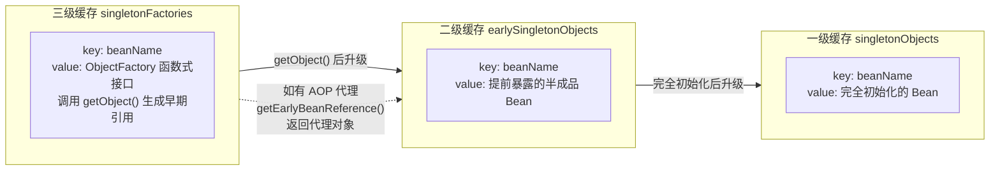
```mermaid
flowchart LR
    subgraph L1["一级缓存 singletonObjects"]
        A["key: beanName<br/>value: 完全初始化的 Bean"]
    end
    
    subgraph L2["二级缓存 earlySingletonObjects"]
        B["key: beanName<br/>value: 提前暴露的半成品 Bean"]
    end
    
    subgraph L3["三级缓存 singletonFactories"]
        C["key: beanName<br/>value: ObjectFactory 函数式接口<br/>调用 getObject() 生成早期引用"]
    end
    
    L3 -->|"getObject() 后升级"| L2
    L2 -->|"完全初始化后升级"| L1
    L3 -.->|"如有 AOP 代理<br/>getEarlyBeanReference()<br/>返回代理对象"| L2
```

### 9.2 A → B → A 循环依赖解决过程

假设 `ServiceA` 依赖 `ServiceB`，`ServiceB` 也依赖 `ServiceA`：

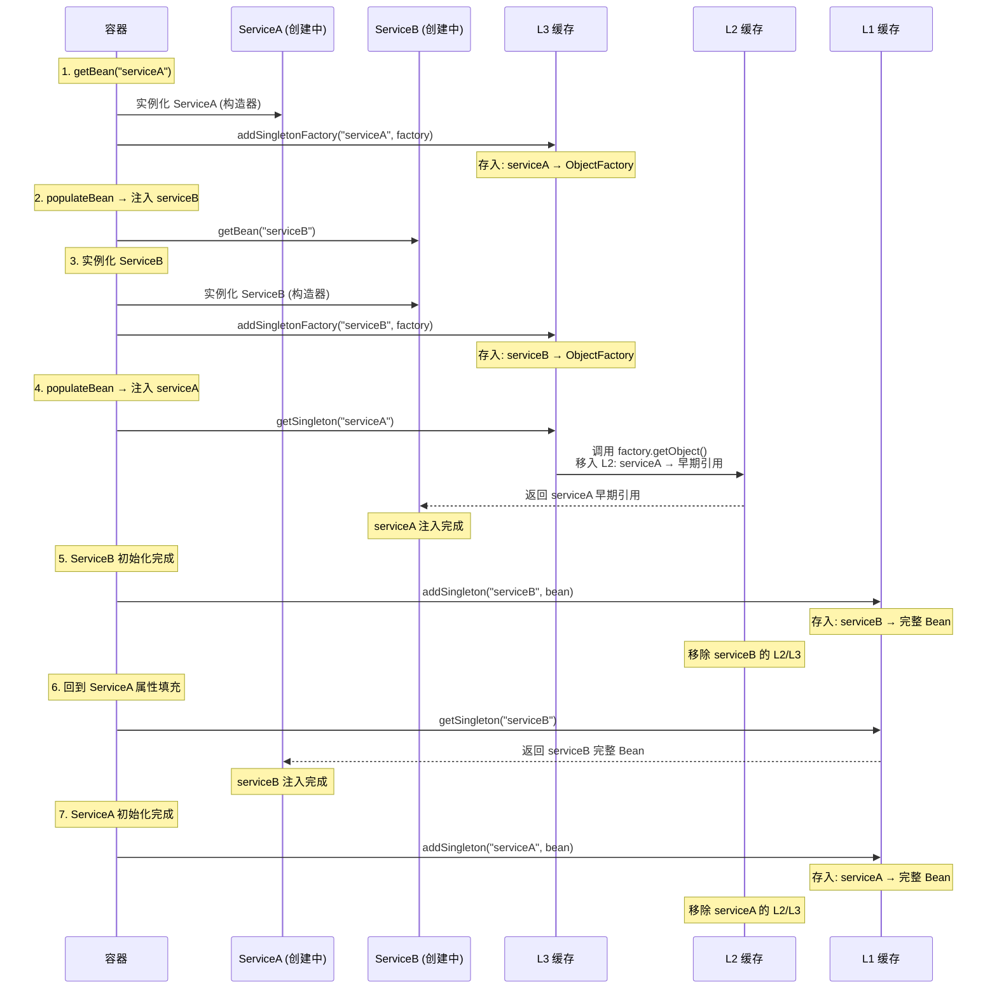
```mermaid
sequenceDiagram
    participant C as 容器
    participant A as ServiceA (创建中)
    participant B as ServiceB (创建中)
    participant L3 as L3 缓存
    participant L2 as L2 缓存
    participant L1 as L1 缓存
    
    Note over C: 1. getBean("serviceA")
    C->>A: 实例化 ServiceA (构造器)
    C->>L3: addSingletonFactory("serviceA", factory)
    Note over L3: 存入: serviceA → ObjectFactory
    
    Note over C: 2. populateBean → 注入 serviceB
    C->>B: getBean("serviceB")
    
    Note over C: 3. 实例化 ServiceB
    C->>B: 实例化 ServiceB (构造器)
    C->>L3: addSingletonFactory("serviceB", factory)
    Note over L3: 存入: serviceB → ObjectFactory
    
    Note over C: 4. populateBean → 注入 serviceA
    C->>L3: getSingleton("serviceA")
    L3->>L2: 调用 factory.getObject()<br/>移入 L2: serviceA → 早期引用
    L2-->>B: 返回 serviceA 早期引用
    Note over B: serviceA 注入完成
    
    Note over C: 5. ServiceB 初始化完成
    C->>L1: addSingleton("serviceB", bean)
    Note over L1: 存入: serviceB → 完整 Bean
    Note over L2: 移除 serviceB 的 L2/L3
    
    Note over C: 6. 回到 ServiceA 属性填充
    C->>L1: getSingleton("serviceB")
    L1-->>A: 返回 serviceB 完整 Bean
    Note over A: serviceB 注入完成
    
    Note over C: 7. ServiceA 初始化完成
    C->>L1: addSingleton("serviceA", bean)
    Note over L1: 存入: serviceA → 完整 Bean
    Note over L2: 移除 serviceA 的 L2/L3
```

### 9.3 核心源码

```java
// DefaultSingletonBeanRegistry.java
public class DefaultSingletonBeanRegistry extends SimpleAliasRegistry 
        implements SingletonBeanRegistry {

    // ★ L1: 完全初始化的单例 Bean
    private final Map<String, Object> singletonObjects = new ConcurrentHashMap<>(256);

    // ★ L2: 提前暴露的早期引用
    private final Map<String, Object> earlySingletonObjects = new ConcurrentHashMap<>(16);

    // ★ L3: ObjectFactory 工厂，可生成早期引用
    private final Map<String, ObjectFactory<?>> singletonFactories = new HashMap<>(16);

    // 获取单例的核心方法
    @Nullable
    protected Object getSingleton(String beanName, boolean allowEarlyReference) {
        // 1. 查 L1
        Object singletonObject = this.singletonObjects.get(beanName);
        if (singletonObject == null && isSingletonCurrentlyInCreation(beanName)) {
            // 2. 查 L2
            singletonObject = this.earlySingletonObjects.get(beanName);
            if (singletonObject == null && allowEarlyReference) {
                synchronized (this.singletonObjects) {
                    singletonObject = this.singletonObjects.get(beanName);
                    if (singletonObject == null) {
                        singletonObject = this.earlySingletonObjects.get(beanName);
                        if (singletonObject == null) {
                            // 3. 查 L3，调用 getObject() 生成早期引用
                            ObjectFactory<?> singletonFactory = 
                                this.singletonFactories.get(beanName);
                            if (singletonFactory != null) {
                                singletonObject = singletonFactory.getObject();
                                // 升级到 L2
                                this.earlySingletonObjects.put(beanName, singletonObject);
                                this.singletonFactories.remove(beanName);
                            }
                        }
                    }
                }
            }
        }
        return singletonObject;
    }
}
```

**核心限制**：Spring 只能解决 **单例 + Setter 注入** 的循环依赖，构造器注入的循环依赖无法解决（因为构造器调用时还未暴露到 L3）。

---

## 10. AOP 代理机制

AOP（Aspect-Oriented Programming）通过**动态代理**在不修改源码的情况下增强方法。

### 10.1 代理创建流程

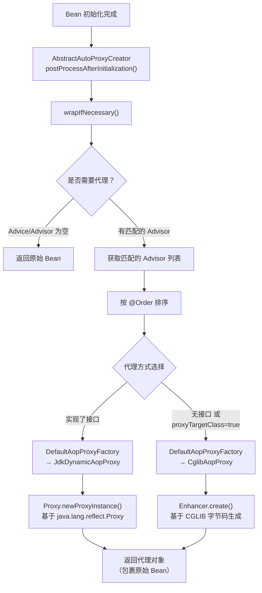
```mermaid
flowchart TD
    Start["Bean 初始化完成"] --> BPP["AbstractAutoProxyCreator<br/>postProcessAfterInitialization()"]
    
    BPP --> Check["wrapIfNecessary()"]
    Check --> Q1{"是否需要代理？"}
    Q1 -->|"Advice/Advisor 为空"| NO["返回原始 Bean"]
    Q1 -->|"有匹配的 Advisor"| Advices["获取匹配的 Advisor 列表"]
    
    Advices --> Sort["按 @Order 排序"]
    Sort --> Q2{"代理方式选择"}
    
    Q2 -->|"实现了接口"| JDK["DefaultAopProxyFactory<br/>→ JdkDynamicAopProxy"]
    Q2 -->|"无接口 或<br/>proxyTargetClass=true"| CGLIB["DefaultAopProxyFactory<br/>→ CglibAopProxy"]
    
    JDK --> JDKP["Proxy.newProxyInstance()<br/>基于 java.lang.reflect.Proxy"]
    CGLIB --> CGLIBP["Enhancer.create()<br/>基于 CGLIB 字节码生成"]
    
    JDKP --> Wrapped["返回代理对象<br/>（包裹原始 Bean）"]
    CGLIBP --> Wrapped
```

### 10.2 AOP 核心术语与接口

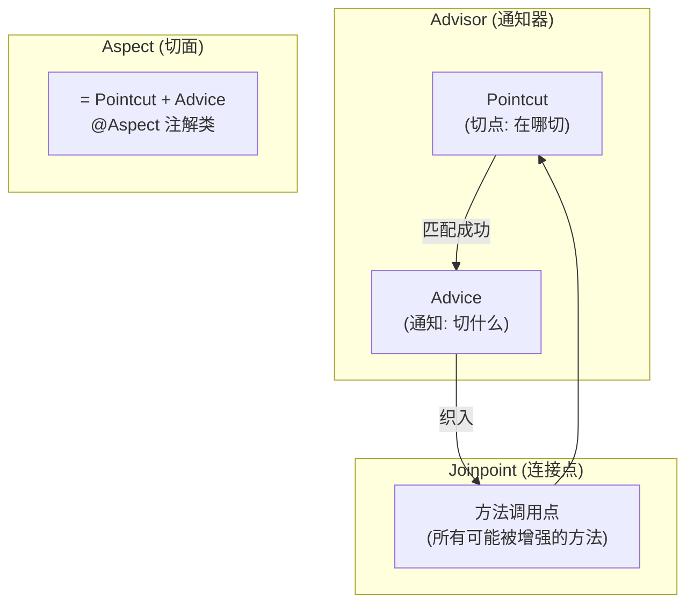
```mermaid
flowchart TB
    subgraph Advisor["Advisor (通知器)"]
        direction LR
        PM["Pointcut<br/>(切点: 在哪切)"]
        AV["Advice<br/>(通知: 切什么)"]
    end
    
    subgraph Joinpoint["Joinpoint (连接点)"]
        JP["方法调用点<br/>(所有可能被增强的方法)"]
    end
    
    subgraph Aspect["Aspect (切面)"]
        ASP["= Pointcut + Advice<br/>@Aspect 注解类"]
    end
    
    JP --> PM
    PM -->|"匹配成功"| AV
    AV -->|"织入"| JP
```

**核心接口源码**：

```java
// 切点：定义"在哪里"增强
public interface Pointcut {
    ClassFilter getClassFilter();      // 类级别匹配
    MethodMatcher getMethodMatcher();  // 方法级别匹配
}

// 通知：定义"做什么"增强
public interface Advice {}
// 子类型:
//   MethodBeforeAdvice    → @Before
//   AfterReturningAdvice  → @AfterReturning
//   ThrowsAdvice          → @AfterThrowing
//   MethodInterceptor     → @Around

// 通知器 = 切点 + 通知
public interface Advisor {
    Advice getAdvice();
}
// PointcutAdvisor: 额外提供 Pointcut
```

### 10.3 拦截器链执行过程

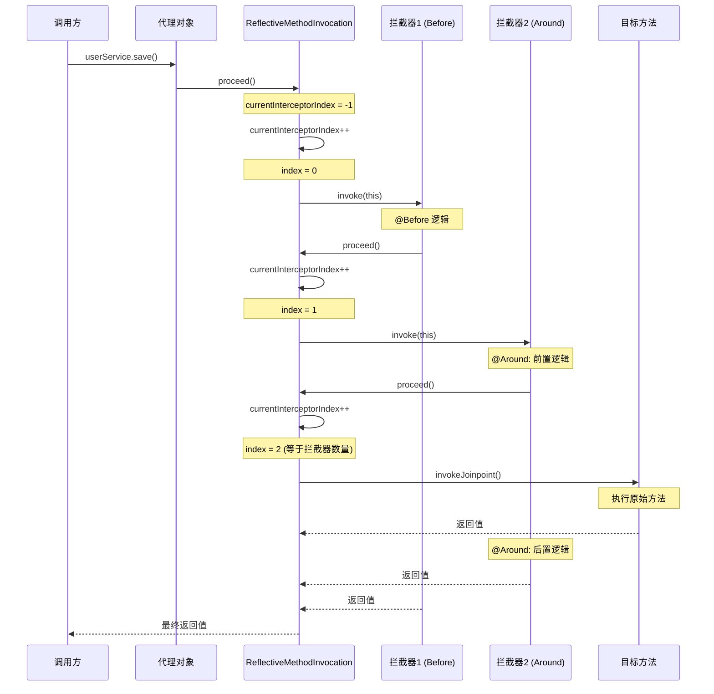
```mermaid
sequenceDiagram
    participant Caller as 调用方
    participant Proxy as 代理对象
    participant RMI as ReflectiveMethodInvocation
    participant Int1 as 拦截器1 (Before)
    participant Int2 as 拦截器2 (Around)
    participant Target as 目标方法

    Caller->>Proxy: userService.save()
    Proxy->>RMI: proceed()
    
    Note over RMI: currentInterceptorIndex = -1
    RMI->>RMI: currentInterceptorIndex++
    Note over RMI: index = 0
    RMI->>Int1: invoke(this)
    Note over Int1: @Before 逻辑
    Int1->>RMI: proceed()
    
    RMI->>RMI: currentInterceptorIndex++
    Note over RMI: index = 1
    RMI->>Int2: invoke(this)
    Note over Int2: @Around: 前置逻辑
    Int2->>RMI: proceed()
    
    RMI->>RMI: currentInterceptorIndex++
    Note over RMI: index = 2 (等于拦截器数量)
    RMI->>Target: invokeJoinpoint()
    Note over Target: 执行原始方法
    Target-->>RMI: 返回值
    
    Note over Int2: @Around: 后置逻辑
    Int2-->>RMI: 返回值
    Int1-->>RMI: 返回值
    RMI-->>Caller: 最终返回值
```

**核心源码**：

```java
// ReflectiveMethodInvocation.java
public class ReflectiveMethodInvocation implements ProxyMethodInvocation {
    
    // 拦截器列表
    protected final List<?> interceptorsAndDynamicMethodMatchers;
    // 当前索引
    private int currentInterceptorIndex = -1;

    public Object proceed() throws Throwable {
        // ★ 当所有拦截器执行完毕，调用目标方法
        if (this.currentInterceptorIndex == this.interceptorsAndDynamicMethodMatchers.size() - 1) {
            return invokeJoinpoint();
        }

        // ★ 获取下一个拦截器并执行
        Object interceptorOrInterceptionAdvice =
            this.interceptorsAndDynamicMethodMatchers.get(++this.currentInterceptorIndex);
        
        // 执行拦截器，拦截器内部会再次调用 this.proceed()
        return ((MethodInterceptor) interceptorOrInterceptionAdvice).invoke(this);
    }
}
```

---

## 11. Spring MVC 请求分发

`DispatcherServlet` 是整个 Spring MVC 的**前端控制器**，所有 HTTP 请求统一由它分发。

### 11.1 doDispatch() 完整流程

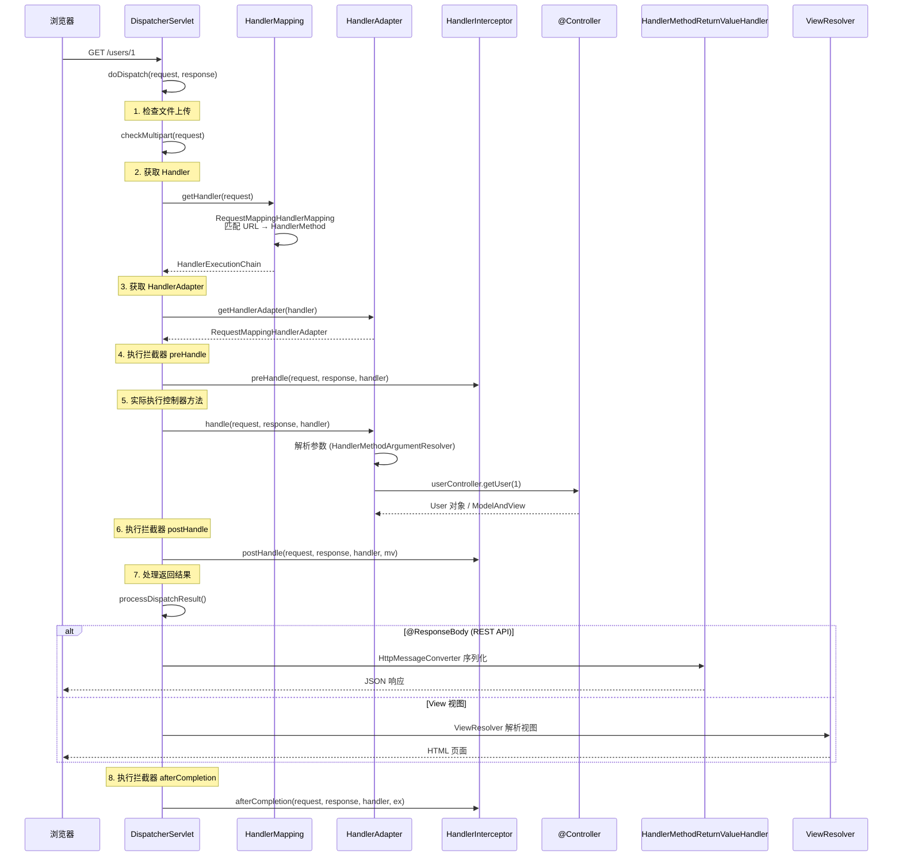
```mermaid
sequenceDiagram
    participant Client as 浏览器
    participant DS as DispatcherServlet
    participant HM as HandlerMapping
    participant HA as HandlerAdapter
    participant Interceptor as HandlerInterceptor
    participant Controller as @Controller
    participant HMR as HandlerMethodReturnValueHandler
    participant VR as ViewResolver

    Client->>DS: GET /users/1
    DS->>DS: doDispatch(request, response)
    
    Note over DS: 1. 检查文件上传
    DS->>DS: checkMultipart(request)
    
    Note over DS: 2. 获取 Handler
    DS->>HM: getHandler(request)
    HM->>HM: RequestMappingHandlerMapping<br/>匹配 URL → HandlerMethod
    HM-->>DS: HandlerExecutionChain
    
    Note over DS: 3. 获取 HandlerAdapter
    DS->>HA: getHandlerAdapter(handler)
    HA-->>DS: RequestMappingHandlerAdapter
    
    Note over DS: 4. 执行拦截器 preHandle
    DS->>Interceptor: preHandle(request, response, handler)
    
    Note over DS: 5. 实际执行控制器方法
    DS->>HA: handle(request, response, handler)
    HA->>HA: 解析参数 (HandlerMethodArgumentResolver)
    HA->>Controller: userController.getUser(1)
    Controller-->>HA: User 对象 / ModelAndView
    
    Note over DS: 6. 执行拦截器 postHandle
    DS->>Interceptor: postHandle(request, response, handler, mv)
    
    Note over DS: 7. 处理返回结果
    DS->>DS: processDispatchResult()
    alt @ResponseBody (REST API)
        DS->>HMR: HttpMessageConverter 序列化
        HMR-->>Client: JSON 响应
    else View 视图
        DS->>VR: ViewResolver 解析视图
        VR-->>Client: HTML 页面
    end
    
    Note over DS: 8. 执行拦截器 afterCompletion
    DS->>Interceptor: afterCompletion(request, response, handler, ex)
```

### 11.2 @RequestMapping 解析流程

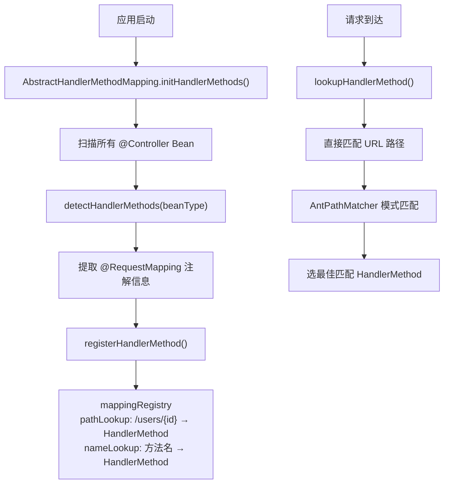
```mermaid
flowchart TD
    App["应用启动"] --> Init["AbstractHandlerMethodMapping.initHandlerMethods()"]
    Init --> Scan["扫描所有 @Controller Bean"]
    Scan --> Detect["detectHandlerMethods(beanType)"]
    Detect --> Mapping["提取 @RequestMapping 注解信息"]
    Mapping --> Reg["registerHandlerMethod()"]
    
    Reg --> Map["mappingRegistry<br/>pathLookup: /users/{id} → HandlerMethod<br/>nameLookup: 方法名 → HandlerMethod"]
    
    Req["请求到达"] --> Lookup["lookupHandlerMethod()"]
    Lookup --> Match1["直接匹配 URL 路径"]
    Match1 --> Match2["AntPathMatcher 模式匹配"]
    Match2 --> Best["选最佳匹配 HandlerMethod"]
```

### 11.3 参数解析与返回值处理

```java
// HandlerMethodArgumentResolver - 方法入参解析
public interface HandlerMethodArgumentResolver {
    boolean supportsParameter(MethodParameter parameter);
    Object resolveArgument(MethodParameter parameter, ...) throws Exception;
}

// 常用实现:
// @RequestBody       → RequestResponseBodyMethodProcessor (读 JSON, 调 HttpMessageConverter)
// @RequestParam      → RequestParamMethodArgumentResolver
// @PathVariable      → PathVariableMethodArgumentResolver
// @ModelAttribute    → ModelAttributeMethodProcessor
// 无注解的复杂对象    → ServletModelAttributeMethodProcessor

// HandlerMethodReturnValueHandler - 返回值处理
public interface HandlerMethodReturnValueHandler {
    boolean supportsReturnType(MethodParameter returnType);
    void handleReturnValue(Object returnValue, ...) throws Exception;
}

// 常用实现:
// @ResponseBody      → RequestResponseBodyMethodProcessor (写 JSON, 调 HttpMessageConverter)
// String (视图名)     → ViewNameMethodReturnValueHandler
// ModelAndView       → ModelAndViewMethodReturnValueHandler
```

**HttpMessageConverter 链**：

```
客户端 Accept: application/json
    ↓
AbstractMessageConverterMethodProcessor.writeWithMessageConverters()
    ↓ 遍历已注册的 HttpMessageConverter
    ├── StringHttpMessageConverter      (text/plain)
    ├── MappingJackson2HttpMessageConverter  (application/json) ← ★ 匹配！
    ├── Jaxb2RootElementHttpMessageConverter (application/xml)
    └── ...
    ↓
Jackson ObjectMapper.writeValue() → JSON 字符串 → HTTP Response
```

---

## 12. 事务管理

Spring 事务的核心是 **AOP + ThreadLocal**，通过 `@Transactional` 注解声明式管理事务。

### 12.1 @Transactional 全链路

```mermaid
flowchart TD
    Start["@Transactional 方法被调用"] --> Proxy["事务代理对象拦截"]
    Proxy --> TI["TransactionInterceptor.invoke()"]
    TI --> TAM["TransactionAttributeSource<br/>解析 @Transactional 属性"]
    TAM --> TM["PlatformTransactionManager.getTransaction()"]
    
    TM --> Status["创建 TransactionStatus"]
    Status --> Bind["TransactionSynchronizationManager<br/>bindResource() → ThreadLocal 绑定 Connection"]
    
    Bind --> Business["执行目标方法"]
    
    Business --> Check{"方法是否抛异常？"}
    Check -->|"无异常"| Commit["tm.commit(status)"]
    Check -->|"有异常"| RollbackCheck{"异常是否匹配 rollbackFor？"}
    RollbackCheck -->|"是"| Rollback["tm.rollback(status)"]
    RollbackCheck -->|"否"| Commit
    
    Commit --> Unbind["unbindResource()"]
    Rollback --> Unbind
    Unbind --> Clean["cleanupAfterCompletion()"]
```

### 12.2 事务传播行为

```java
public interface TransactionDefinition {
    int PROPAGATION_REQUIRED = 0;      // 默认：有则加入，无则新建
    int PROPAGATION_SUPPORTS = 1;      // 有则加入，无则非事务运行
    int PROPAGATION_MANDATORY = 2;     // 必须有事务，否则抛异常
    int PROPAGATION_REQUIRES_NEW = 3;  // 始终新建，挂起当前事务
    int PROPAGATION_NOT_SUPPORTED = 4; // 非事务运行，挂起当前事务
    int PROPAGATION_NEVER = 5;         // 非事务运行，有事务则抛异常
    int PROPAGATION_NESTED = 6;        // 嵌套事务（savepoint）
}
```

### 12.3 TransactionSynchronizationManager

这是 Spring 事务的**核心基础设施**，通过 `ThreadLocal` 实现线程隔离：

```java
public abstract class TransactionSynchronizationManager {
    // ★ 事务资源：每个线程的 DataSource → Connection 映射
    private static final ThreadLocal<Map<Object, Object>> resources = 
        new NamedThreadLocal<>("Transactional resources");

    // ★ 事务同步器链（用于触发 @TransactionalEventListener 等）
    private static final ThreadLocal<Set<TransactionSynchronization>> synchronizations = 
        new NamedThreadLocal<>("Transaction synchronizations");

    // ★ 当前事务名称
    private static final ThreadLocal<String> currentTransactionName = 
        new NamedThreadLocal<>("Current transaction name");

    // ★ 事务只读标志
    private static final ThreadLocal<Boolean> currentTransactionReadOnly = 
        new NamedThreadLocal<>("Current transaction read-only status");

    // ★ 事务隔离级别
    private static final ThreadLocal<Integer> currentTransactionIsolationLevel = 
        new NamedThreadLocal<>("Current transaction isolation level");

    // ★ 事务是否活跃
    private static final ThreadLocal<Boolean> actualTransactionActive = 
        new NamedThreadLocal<>("Actual transaction active");

    // 绑定资源
    public static void bindResource(Object key, Object value) {
        // key = DataSource, value = ConnectionHolder
        resources.get().put(key, value);
    }
}
```

---

## 13. 事件机制

Spring 事件机制基于**观察者模式**，支持同步/异步事件广播。

### 13.1 事件广播流程

```mermaid
flowchart TD
    Event["自定义事件 extends ApplicationEvent"] --> Publish["ApplicationEventPublisher.publishEvent()"]
    Publish --> MC["ApplicationEventMulticaster<br/>multicastEvent()"]
    
    MC --> Resolve["resolveDefaultEventType()<br/>包装为 PayloadApplicationEvent"]
    Resolve --> Listeners["getApplicationListeners()<br/>获取匹配的监听器"]
    
    Listeners --> Loop["遍历每个监听器"]
    Loop --> Q{"Executor 是否设置？"}
    Q -->|"否（同步）"| Sync["直接调用 listener.onApplicationEvent()"]
    Q -->|"是（异步）"| Async["executor.execute(() → listener.onApplicationEvent())"]
```

### 13.2 @EventListener 与 @TransactionalEventListener

```java
// 声明式事件监听 — 无需实现接口
@Component
public class OrderEventListener {
    
    // 同步监听
    @EventListener
    public void handleOrderCreated(OrderCreatedEvent event) {
        // 在同一线程、同一事务中执行
    }
    
    // 事务提交后监听 ★
    @TransactionalEventListener(phase = TransactionPhase.AFTER_COMMIT)
    public void handleAfterCommit(OrderCreatedEvent event) {
        // 仅在事务成功提交后执行
        // 用于发送消息、异步通知等
    }
    
    // 事务回滚后监听
    @TransactionalEventListener(phase = TransactionPhase.AFTER_ROLLBACK)
    public void handleAfterRollback(OrderCreatedEvent event) {
        // 事务回滚后的清理逻辑
    }
}

// @TransactionalEventListener 原理：
// 它通过 TransactionSynchronizationManager.registerSynchronization()
// 注册一个 TransactionSynchronization，在事务完成阶段回调
```

### 13.3 事件机制核心类

```java
// 事件发布器接口
public interface ApplicationEventPublisher {
    default void publishEvent(ApplicationEvent event) {
        publishEvent((Object) event);
    }
    void publishEvent(Object event); // 也支持任意对象（自动包装）
}

// 事件广播器 — 核心实现 SimpleApplicationEventMulticaster
public class SimpleApplicationEventMulticaster extends AbstractApplicationEventMulticaster {
    
    @Override
    public void multicastEvent(ApplicationEvent event, @Nullable ResolvableType eventType) {
        ResolvableType type = (eventType != null ? eventType : 
            ResolvableType.forInstance(event));
        
        // ★ 获取匹配的监听器（支持泛型事件匹配）
        for (ApplicationListener<?> listener : getApplicationListeners(event, type)) {
            Executor executor = getTaskExecutor();
            if (executor != null) {
                // 异步执行
                executor.execute(() -> invokeListener(listener, event));
            } else {
                // 同步执行（默认）
                invokeListener(listener, event);
            }
        }
    }
}
```

---

## 14. 启动全链路串联

将 Spring Boot + Spring Framework 的完整启动链路串联：

```mermaid
flowchart TD
    subgraph SB["Spring Boot 阶段"]
        A["main() → SpringApplication.run()"]
        B["prepareEnvironment()"]
        C["createApplicationContext()"]
        D["prepareContext()"]
    end
    
    subgraph SF["Spring Framework 阶段 refresh()"]
        E["obtainFreshBeanFactory()"]
        F["invokeBeanFactoryPostProcessors()"]
        G["registerBeanPostProcessors()"]
        H["onRefresh() → 创建 WebServer"]
        I["finishBeanFactoryInitialization()"]
    end
    
    subgraph Bean["Bean 创建"]
        J["getBean() → doGetBean()"]
        K["createBean() → doCreateBean()"]
        L["BeanPostProcessor 链"]
        M["AOP 代理创建"]
    end
    
    subgraph Runtime["运行时"]
        N["内嵌 Tomcat 就绪"]
        O["DispatcherServlet 就绪"]
        P["处理 HTTP 请求"]
        Q["事务拦截"]
        R["事件广播"]
    end
    
    A --> B --> C --> D
    D --> E --> F
    F -->|"触发自动配置"| F1["AutoConfigurationImportSelector"]
    F1 --> F
    F --> G --> H --> I
    I --> J --> K --> L --> M
    
    M --> N --> O
    P --> Q
    Q --> R
```

---

## 15. 关键扩展点速查

| 扩展点 | 类型 | 时机 | 典型用途 |
|--------|------|------|----------|
| `BeanFactoryPostProcessor` | 接口 | 所有 BeanDefinition 加载后、实例化前 | 修改 Bean 定义、注册新 Bean |
| `BeanPostProcessor` | 接口 | 每个 Bean 初始化前后 | AOP 代理、属性注入 |
| `InstantiationAwareBeanPostProcessor` | 接口 | Bean 实例化前后 | 短路实例化、提前返回代理 |
| `SmartInstantiationAwareBeanPostProcessor` | 接口 | 实例化阶段 | 预测 Bean 类型、提前暴露引用 |
| `MergedBeanDefinitionPostProcessor` | 接口 | BeanDefinition 合并后 | 处理 `@Autowired`、`@Value` |
| `ApplicationListener` | 接口 | 事件发布时 | 监听容器事件 |
| `ApplicationContextInitializer` | 接口 | `refresh()` 前 | 添加 PropertySource、激活 Profile |
| `HandlerInterceptor` | 接口 | HTTP 请求前后 | 权限校验、日志、跨域 |
| `HandlerMethodArgumentResolver` | 接口 | 控制器方法调用前 | 解析自定义参数注解 |
| `HandlerMethodReturnValueHandler` | 接口 | 控制器方法返回后 | 处理自定义返回值 |

---

*本文基于 Spring Framework 6.x + Spring Boot 3.x 源码编写。*
