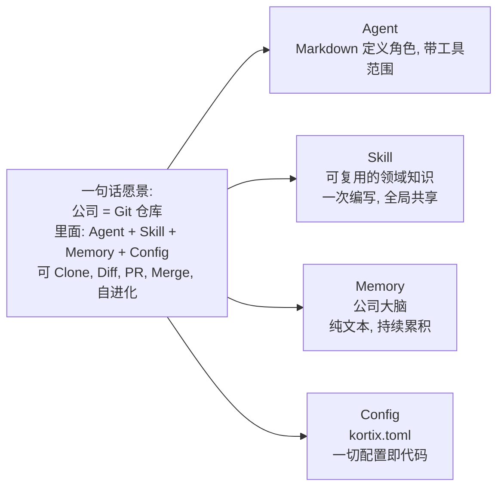
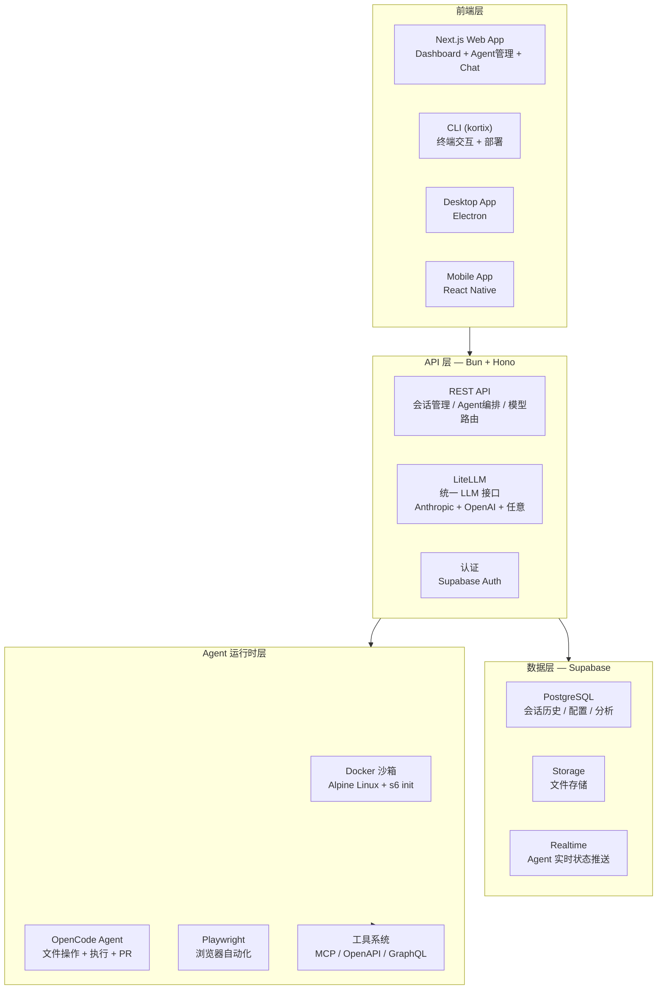
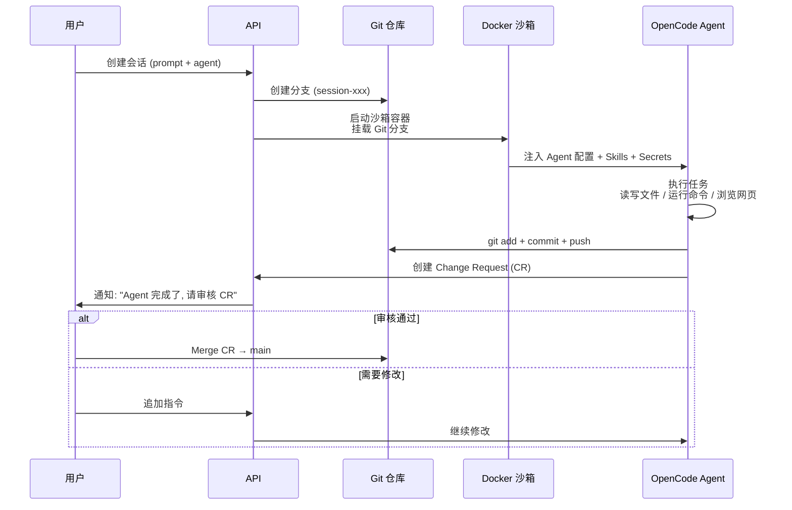
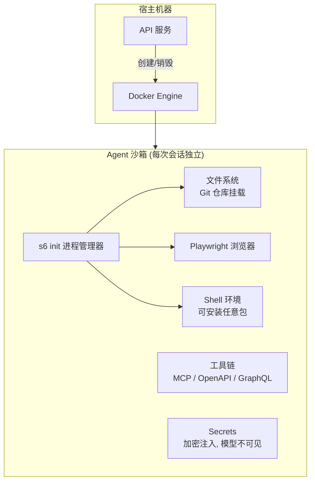
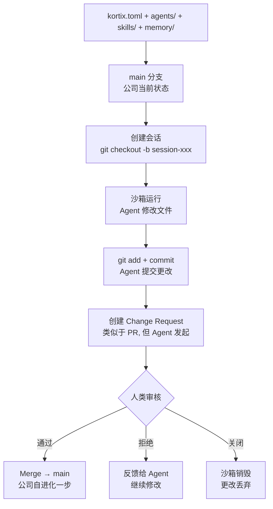
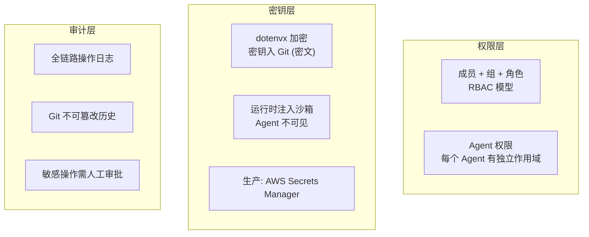

# Kortix / Suna 项目源码深度剖析

> 20K Stars · TypeScript Monorepo · **"公司即 Git 仓库"** — AI Agent 编排平台的完整技术拆解。

---

## 目录

- [1. 项目概览与愿景](#1-项目概览与愿景)
- [2. 整体架构](#2-整体架构)
- [3. 后端 API 核心](#3-后端-api-核心)
- [4. Agent 运行时沙箱](#4-agent-运行时沙箱)
- [5. Git 原生工作流](#5-git-原生工作流)
- [6. 前端与 CLI](#6-前端与-cli)
- [7. 安全模型](#7-安全模型)
- [8. 关键设计决策分析](#8-关键设计决策分析)
- [9. 与传统 Agent 框架对比](#9-与传统-agent-框架对比)

---

## 1. 项目概览与愿景



**核心理念**：不是又一个 AI Chat 工具。是**把整个公司建模为一个 Git 仓库**——Agents、Skills、Memory、Workflows 全部是版本化的代码。

| 维度 | 传统 AI 工具 | Kortix |
|------|------------|--------|
| 模型 | 单个 Chat | **Agent 劳动力池**，按角色分工 |
| 产出 | 聊天文本 | **可交付物**（代码/报告/部署） |
| 记忆 | 聊天历史 | **Git 仓库**，永久版本化 |
| 运行环境 | 无隔离 | **Docker 沙箱**，每次会话独立 |
| 协作 | 人工 | **Change Request**→审核→合并 |

---

## 2. 整体架构



**三组件部署模型**：

| 组件 | 镜像 | 源码 | 技术栈 |
|------|------|------|--------|
| **API** | `kortix/kortix-api` | `apps/api/` | Bun + Hono |
| **Frontend** | `kortix/kortix-frontend` | `apps/web/` | Next.js + React |
| **Sandbox** | `kortix/computer` | `core/` | Alpine + s6 + Browser + Tools |

所有镜像多架构 `amd64 + arm64`，Docker Hub 统一管理。

---

## 3. 后端 API 核心

### 3.1 技术选型

```json
{
  "runtime": "Bun (替代 Node.js)",
  "framework": "Hono + OpenAPIHono (@hono/zod-openapi)",
  "llm": "自建 LLM Gateway (OpenRouter + LiteLLM 统一 100+ 模型)",
  "database": "Supabase (PostgreSQL) + Drizzle ORM",
  "package_manager": "pnpm (monorepo, 72h release age 供应链防护)"
}
```

**为什么 Bun + Hono？**
- Bun：比 Node.js 快 4x 的启动速度，原生 TypeScript
- Hono：Web 标准路由，边缘友好，比 Express 轻量 10x

### 3.2 核心 API 路由

```
apps/api/
├── src/
│   ├── routes/
│   │   ├── sessions/        # 会话生命周期: 创建/运行/停止/历史
│   │   ├── agents/          # Agent 配置: 注册/修改/启停
│   │   ├── skills/          # Skill 管理: 创建/分享/版本
│   │   ├── connectors/      # 连接器: MCP/OpenAPI/GraphQL
│   │   ├── secrets/         # 密钥管理: 加密/注入/轮换
│   │   ├── channels/        # Slack/Webhook 集成
│   │   └── triggers/        # Cron/Webhook 触发
│   ├── core/
│   │   ├── sandbox/         # Docker 沙箱编排
│   │   ├── git/             # Git 分支/PR/CR 管理
│   │   └── llm/             # LiteLLM 路由 + 重试 + fallback
│   └── middleware/
│       ├── auth.ts          # Supabase JWT 验证
│       └── rate-limit.ts    # 限流
```

### 3.3 会话生命周期



---

## 4. Agent 运行时沙箱

### 4.1 沙箱设计



### 4.2 安全隔离

| 层级 | 机制 | 说明 |
|------|------|------|
| **进程** | Docker 容器隔离 | 每个会话独立容器 |
| **网络** | 容器网络隔离 | 只能访问白名单服务 |
| **文件** | 容器文件系统 | 会话结束即销毁 |
| **Secrets** | 加密注入, 不入日志 | Agent 和 Model 都看不到明文 |
| **Git** | 分支持久化 | 只有 Commit 的内容才存活 |

---

## 5. Git 原生工作流

这是 Kortix **最核心的创新**。



**与传统 Agent 的本质区别**：

| 维度 | LangChain/AutoGPT | Kortix |
|------|------------------|--------|
| 持久化 | 聊天历史 / 矢量数据库 | **Git 分支 + Commit** |
| 审核 | 无 | **Change Request 人类把关** |
| 回滚 | 困难 | `git revert` |
| 审计 | 日志 | `git log` |
| 协作 | 单人 | 多 Agent 并行, 分支不冲突 |
| 可移植 | 难以导出 | `git clone` 即全部 |

---

## 6. 前端与 CLI

### 6.1 前端架构

```
apps/web/               # Next.js 14+ App Router
├── app/
│   ├── dashboard/      # Agent 管理面板
│   ├── sessions/       # 会话监控 + Chat 界面
│   ├── agents/         # Agent 配置构建器
│   ├── workflows/      # 工作流可视化编辑器
│   └── settings/       # 组织设置
├── components/
│   ├── chat/           # 聊天组件
│   ├── agent-builder/  # Agent 可视化配置
│   └── sandbox/        # 沙箱状态监控
└── content/docs/       # 文档站点源码
```

### 6.2 CLI 命令体系

```bash
# 核心工作流
kortix init                      # 初始化项目 (kortix.toml)
kortix ship                      # 部署到 Cloud
kortix sessions new --prompt "..." # 创建会话
kortix chat                      # 终端对话
kortix cr ls                     # 查看 Change Request

# 自托管
kortix self-host start           # 启动本地实例
kortix hosts use local           # 切换到本地
kortix hosts use cloud           # 切换到 Cloud

# 模型
kortix models list               # 查看可用模型
kortix models pull llama3:8b     # 拉取本地模型 (Ollama)
```

---

## 7. 安全模型



**密钥的三层防护**：
1. **存储**：dotenvx 加密后入 Git（密文可提交，私钥离线）
2. **传输**：运行时通过环境变量注入沙箱
3. **使用**：Agent 和 LLM 看不到密钥明文，仅工具调用时自动签名

---

## 8. 关键设计决策分析

### 8.1 为什么每个会话一个 Docker 沙箱？

| 考量 | 决策 |
|------|------|
| 安全 | Agent 能 `rm -rf /` 也不影响宿主 |
| 隔离 | 多 Agent 并发互不干扰 |
| 可复现 | 沙箱镜像版本化，环境一致 |
| 清理 | 会话结束→容器销毁，无残留 |

代价：启动延迟（Docker 冷启动 1-3 秒）。优化：预构建镜像 + 容器预热池。

### 8.2 为什么"公司 = Git 仓库"？

| 传统 SaaS | Git 仓库 |
|-----------|----------|
| 数据锁在平台 | `git clone` = 全部数据 |
| 升级不可控 | 回退 = `git revert` |
| 审核依赖平台功能 | `git log` 天然审计 |
| Agent 产出难管理 | Change Request = PR 流程 |

### 8.3 为什么用 Supabase 而不是纯自建？

| 自建 | Supabase |
|------|----------|
| Auth 开发周期长 | 🔑 内建 OAuth/JWT |
| 实时功能需 WebSocket | ⚡ Realtime 开箱即用 |
| 文件存储需 S3 对接 | 📁 Storage API |
| 需要 DBA 维护 | 🐘 托管 PostgreSQL |
| 运维成本持续 | 💰 免费额度足够开发 |

---

## 9. 与传统 Agent 框架对比

| 维度 | Kortix | LangChain | AutoGPT | CrewAI |
|------|--------|-----------|---------|--------|
| **定位** | 公司级 Agent 指挥中心 | 开发者 LLM 框架 | 自主任务 Agent | 多 Agent 协作 |
| **运行环境** | Docker 沙箱（真实 OS） | Python 进程 | Python 进程 | Python 进程 |
| **持久化** | Git 仓库 + Supabase | 自定义 Memory | 矢量 DB | 自定义 |
| **工具** | 3000+ 连接器 + MCP | Tools 接口 | 命令行 | Tools 接口 |
| **审核** | Change Request 人类把关 | ❌ | ❌ | ❌ |
| **部署** | 自托管 + Cloud | 代码嵌入 | Docker | 代码嵌入 |
| **多 Agent** | 数千并行, Git 分支隔离 | 需手动编排 | ❌ | ✅ 角色+任务 |
| **开源** | ✅ Source-Available | ✅ MIT | ✅ MIT | ✅ MIT |

**核心差异化**：其他框架是"开发者工具"，Kortix 是"公司操作系统"——Git 仓库作为持久化层，Docker 沙箱作为运行时，Change Request 作为人类审核闸门。

---

## 10. 技术栈速查

```yaml
语言:
  - TypeScript (前端 + API)
  - Python (部分工具链/数据处理)

前端:
  - Next.js 14+ (App Router)
  - Tailwind CSS
  - React 18

后端:
  - Bun (运行时)
  - Hono (Web 框架)
  - LiteLLM (LLM 统一接口)

数据库:
  - Supabase (PostgreSQL + Auth + Storage + Realtime)
  - Prisma (ORM, 推测)

基础设施:
  - Docker (沙箱运行时)
  - s6 (沙箱内进程管理器)
| **Docker** | Docker 沙箱运行时 |
| **s6** | 沙箱内进程管理器 |
| **Daytona SDK** | 沙箱编排（启动/停止/快照/代理） |
| **Docker Hub** | 镜像仓库（多架构 amd64+arm64） |
| **Vercel** | 前端部署 |
| **JustAVPS** | 沙箱 VPS 托管 |
| **AWS Secrets Manager** | 生产密钥 |

| **Agent** | OpenCode（Agent 引擎） |
| **Playwright** | 浏览器自动化 |
| **MCP / OpenAPI / GraphQL** | 工具连接协议 |
| **kortix-sandbox-agent-server** | 沙箱内常驻守护进程（Go 二进制） |

| **DevOps** | GitHub Actions (CI/CD) · pnpm monorepo · dotenvx 密钥加密 · Gitleaks 密钥扫描 · pnpm minimumReleaseAge 72h 供应链防护 |

---

## 11. 源码级技术亮点

> 基于 `suna-main` 源码真实分析。

### 11.1 API 层：OpenAPI 驱动开发

```typescript
// apps/api/src/index.ts — 不是手写路由，而是 OpenAPI 自动生成
import { OpenAPIHono, createRoute, z } from '@hono/zod-openapi';

const app = new OpenAPIHono();

// ★ 每个端点 = Zod Schema + OpenAPI 元数据
// 自动生成 /v1/openapi.json + Scalar API 文档 /v1/docs
app.openapi(
  createRoute({
    method: 'get', path: '/health',
    tags: ['system'],
    responses: { 200: json(HealthSchema) },
  }),
  healthHandler,
);

// ★ Zod 定义的 Schema 即 API 合约
const HealthSchema = z.object({
  status: z.string(), version: z.string(),
  uptime_seconds: z.number(), memory_mb: z.number(),
  // ... 自动校验请求/响应
}).openapi('Health');
```

**为什么牛逼**：API 合约和校验是一份 Zod Schema，改了 Schema 自动同步文档，不会出现"文档和实现对不上"。

### 11.2 事件循环 Lag 健康检查

```typescript
// ★ 独创: 用真实的 Event Loop 延迟作为存活探针
// 常规 /health 返回 "OK" 即使 Event Loop 被阻塞也不会失败
// 这导致 2026-06-18 的线上事故：Pod 僵死但 k8s 没重启 → 90 分钟故障

const MAX_EVENT_LOOP_LAG_MS = 5000;
let eventLoopLagMs = 0;

const lagTimer = setInterval(() => {
  const now = performance.now();
  // ★ 实际延迟 = 现在 - 上次 - 间隔
  eventLoopLagMs = Math.max(0, now - lastSample - 1000);
  lastSample = now;
}, 1000);

// /health/live: Event Loop 延迟 > 5s → 返回 503
// kubelet 看到 503 → 自动重启僵死 Pod
app.get('/health/live', (c) => {
  if (eventLoopLagMs > MAX_EVENT_LOOP_LAG_MS)
    return c.json({ status: 'degraded' }, 503);
  return c.json({ status: 'ok', event_loop_lag_ms: eventLoopLagMs });
});
```

### 11.3 领导者选举 + 单例 Worker 模式

```typescript
// ★ 多副本 API 部署下，定时任务只在一个 Pod 运行
// 通过数据库 Leader Election 避免重复触发
// 
// 启动流程:
//   每个 Pod → startReplicaServices()（隧道、缓存、清理）
//   然后 → startLeaderElection()
//   拿到租约的 Pod → startSingletonWorkers()
//     ├── 定时任务调度器 (trigger scheduler)
//     ├── 预热池管理 (warm pool)
//     ├── 项目维护 (maintenance)
//     └── 遗留迁移 (legacy migration)
//   其他 Pod → 只处理 API 请求

startLeaderElection({
  onAcquire: () => startSingletonWorkers(),
  onRelease: () => stopSingletonWorkers(),
}, { eligible: runsSingletonWorkers() });
```

### 11.4 供应链安全：pnpm 72 小时冷却

```yaml
# pnpm-workspace.yaml — 生产级供应链防护
# ★ 任何新发布的包需要 72 小时才能被解析
# 防止 TanStack 2026-05-11 类型的供应链攻击
# （攻击者发布恶意版本 → 几小时内被发现 → 但已安装的无法撤销）
minimumReleaseAge: 4320  # 72 小时

# ★ 禁止任意 postinstall 脚本执行
# 只允许白名单中的包运行生命周期脚本
dangerouslyAllowAllBuilds: false
onlyBuiltDependencies:
  - esbuild
  - sharp
  - next
  # ... 严格白名单
```

### 11.5 dotenvx 加密密钥入 Git

```bash
# ★ 密钥加密后直接提交到 Git（不是 .gitignore!）
# apps/api/.env 中的密钥: KEY=encrypted:xxxx...
# 解密密钥存在 Dotenv Armor（离线设备）
# 任何人 clone 了代码也看不到真实密钥

# 开发:
pnpm dev  # 自动解密 apps/api/.env

# 生产:
# API 从 AWS Secrets Manager 加载（不入 Git）

# 三个环境三套密钥:
# apps/api/.env       → 本地开发
# apps/api/.env.dev   → 测试环境
# apps/api/.env.prod  → 生产环境（本地调试用）
```

### 11.6 LLM 网关：统一计费 + 路由

```typescript
// ★ 自建 LLM 网关，非简单透传
const { createLlmGateway } = await import('./llm-gateway');

app.route('/v1/llm', createLlmGateway(
  {
    enabled: config.LLM_GATEWAY_ENABLED,
    openrouterApiKey: config.OPENROUTER_API_KEY,
    markup: llmPriceMarkup(),           // ★ 模型加价策略
    appName: 'Kortix',
  },
  {
    // ★ 认证: 沙箱 Token → 用户身份
    authenticateToken: async (token) => { /* ... */ },
    
    // ★ 计费: 每次 LLM 调用扣费
    recordUsage: async (event) => {
      await recordUsageEvent({ /* tokens, cost, model */ });
      await deductForLlmUsage({ accountId, costUsd, /* ... */ });
    },
  },
));
```

### 11.7 Sandbox Proxy：统一隧道

```typescript
// ★ 核心创新: 统一沙箱代理
// 无论沙箱在哪里（Daytona Cloud / 本地 Docker），统一路由

// Pattern: /v1/p/{sandboxId}/{port}/*
//   Cloud:  sandboxId = Daytona external ID → Daytona SDK 代理
//   Local:  sandboxId = container name → Docker DNS

app.route('/v1/p', sandboxProxyApp);

// 还支持子域名预览路由:
// p{port}-{sandboxId}.localhost:{apiPort}/...
// 让沙箱内的 Web 应用可以通过真实域名访问
```

---

## 12. 架构真相比对

| 我的初始猜测 | 源码真相 |
|-------------|---------|
| Prisma ORM | **Drizzle ORM** |
| Express.js API | **Hono + OpenAPIHono** |
| Node.js 运行时 | **Bun**（不是 Node.js） |
| 简单健康检查 | **Event Loop Lag 探针** |
| 单体 API | **Leader Election + 单例 Worker** |
| 标准 .gitignore 密钥 | **dotenvx 加密入 Git** + AWS Secrets Manager |
| 普通 LLM 透传 | **自建 LLM Gateway + 统一计费** |
| 普通 monorepo | **72h release age + postinstall 白名单** |

---

*本文基于 Suna v0.9.5 源码分析编写。*
