# AutoCorp AI Agent 平台 — 技术参考手册

> 基于 Suna v0.9.5 Fork · AutoCorp 内部 AWS 部署 · v1.0

**读者人群**：产品经理 · 架构师 · 技术专家 · 运维工程师 · 开发工程师

---

## 阅读导航：按角色选章节

| 你是 | 先读 | 再读 | 可以跳过 |
|------|------|------|----------|
| **产品经理** | §1 概览 → §6 用户交互 → §2 架构全景 | §9 竞品对比 | §11-14 源码/技术架构 |
| **架构师** | §1 概览 → §2 架构 → §15 技术架构 → §17 部署方案 | §8 安全模型 · §9 设计决策 | — |
| **技术专家** | §2 架构 → §11 源码亮点 → §13 真相比对 | §14 业务架构 | — |
| **运维工程师** | §1 概览 → §17 部署方案 → §11 技术亮点 | §15 技术架构 | §6-7 前端/CLI |
| **开发工程师** | §0 改造清单 → §11 源码亮点 → §12 技术栈 | 按需查 §3-5, §14.6 CI/CD | §13 业务架构 |

---

## 目录

**📋 产品与业务**
- [1. 项目概览与愿景](#1-项目概览与愿景)
- [6. 用户交互与产品功能全景](#6-用户交互与产品功能全景)
- [9. 与传统 Agent 框架对比](#9-与传统-agent-框架对比)
- [14. 业务架构深度解析](#14-业务架构深度解析)

**🏗 架构与技术**
- [2. 整体架构](#2-整体架构)
- [3. 后端 API 核心](#3-后端-api-核心)
- [4. Agent 运行时沙箱](#4-agent-运行时沙箱)
- [5. Git 原生工作流](#5-git-原生工作流)
- [8. 安全模型](#8-安全模型)
- [11. 源码级技术亮点](#11-源码级技术亮点)
- [12. 技术栈速查](#12-技术栈速查)
- [13. 架构真相比对](#13-架构真相比对)
- [15. 技术架构深度解析](#15-技术架构深度解析)

**🔧 开发与部署**
- [0. 二次开发改造清单](#0-二次开发改造清单)
- [7. 前端与 CLI](#7-前端与-cli)
- [10. 关键设计决策分析](#10-关键设计决策分析)
- [14.6 CI/CD 部署流水线](#146-cicd-部署流水线--二次开发必须掌握)
- [16. 架构总结](#16-架构总结)
- [17. AutoCorp 企业级 AWS 部署方案](#17-autocorp-企业级-aws-部署方案)

---


## 执行摘要（产品经理必读）

**AutoCorp AI Agent 平台**是一个基于开源 Suna 定制的 AI 劳动力系统。

**它能干什么**：员工通过 Slack 或 Web 界面发任务（"生成本月供应商报告""分析库存周转率"），AI Agent 自动在隔离沙箱中执行——查 SAP、写分析、生成 Excel——完成后提交审核，人确认后生效。

**核心价值**：
- 重复性数据工作由 Agent 完成，人做决策
- 公司经验自动积累（Agent 每次工作都会记录发现的规律和坑）
- 多人多 Agent 并行工作，Git 天然隔离不冲突
- 全部数据在 AutoCorp 内部 AWS，不外传

**与 ChatGPT 的区别**：

| | ChatGPT | AutoCorp Agent 平台 |
|--|---------|-------------------|
| 知道你是谁吗 | 每次对话重新开始 | ✅ 记住公司的所有经验和决策 |
| 能查 SAP 吗 | ❌ | ✅ 通过内部 MCP 直连 |
| 产出是什么 | 文字 | ✅ Excel、PPT、代码、报告 |
| 数据去哪了 | OpenAI 服务器 | ✅ AutoCorp 内部 AWS |
| 谁审核产出 | 自己判断 | ✅ Change Request → 人确认 |

**技术本质**：Git 仓库（版本化记忆）+ Docker 沙箱（安全隔离）+ AI Agent（执行任务）+ Change Request（人审核）。

---
## 0. 二次开发改造清单

在 Fork Suna 源码后，以下模块需要定制：

| 优先级 | 模块 | 改造内容 | 工作量 | 参考章节 |
|--------|------|----------|--------|----------|
| P0 | **品牌去 Kortix** | Logo、名称、启动 Banner、Agent 系统提示词 | 3天 | 全文 |
| P0 | **LLM 网关** | 停用自带 Gateway，指向 LiteLLM | 1天 | §17.2 |
| P0 | **认证** | Supabase Auth → Azure AD OIDC | 2天 | §17.8 |
| P1 | **Skills 管理** | 停用本地 Skills，接中央 Skills 平台 | 3天 | §17.3 |
| P1 | **MCP 工具体系** | 停用 Pipedream，接内部 MCP Server | 2天 | §17.4 |
| P1 | **Git 托管** | GitHub → 内部 GitLab | 1天 | §5 |
| P1 | **前端文案** | 全局文案 AutoCorp 化 | 2天 | §7 |
| P2 | **CI/CD** | GitLab CI + ECR + EKS 部署流水线 | 2天 | §14.6 |
| P2 | **审计** | Sentry → Splunk SIEM | 2天 | §17.3 |
| P2 | **密钥管理** | dotenvx + AWS SM → 统一 KMS | 1天 | §17.5 |
| P2 | **沙箱镜像** | 构建含 AutoCorp CA + 企业工具的基础镜像 | 1天 | §17.5 |

**总工期**：约 20 人天（2 人 × 2 周）。

---

## 1. 项目概览与愿景 `👥 全员`

> **PM 一句话**：这是 AI 员工平台——发任务给 AI，它去查系统、写分析、出报告，干完交给人审核。公司经验自动积累，越用越聪明。底层 Fork 自开源 Suna（20K GitHub Stars）。

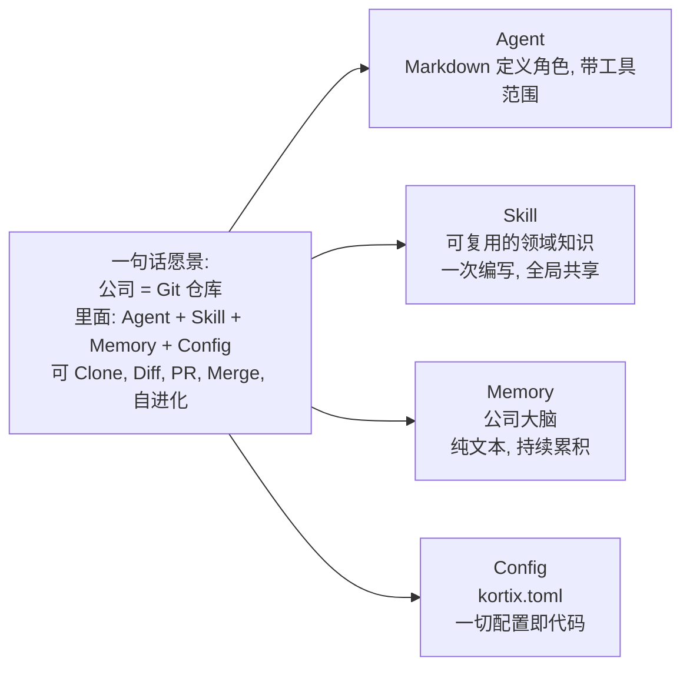
```mermaid
flowchart LR
    VISION["一句话愿景:<br/>公司 = Git 仓库<br/>里面: Agent + Skill + Memory + Config<br/>可 Clone, Diff, PR, Merge, 自进化"]
    
    VISION --> AGENT["Agent<br/>Markdown 定义角色, 带工具范围"]
    VISION --> SKILL["Skill<br/>可复用的领域知识<br/>一次编写, 全局共享"]
    VISION --> MEMORY["Memory<br/>公司大脑<br/>纯文本, 持续累积"]
    VISION --> CONFIG["Config<br/>kortix.toml<br/>一切配置即代码"]
```

**核心理念**：不是又一个 AI Chat 工具。是**把整个公司建模为一个 Git 仓库**——Agents、Skills、Memory、Workflows 全部是版本化的代码。

| 维度 | 传统 AI 工具 | Kortix |
|------|------------|--------|
| 模型 | 单个 Chat | **Agent 劳动力池**，按角色分工 |
| 产出 | 聊天文本 | **可交付物**（代码/报告/部署） |
| 记忆 | 聊天历史 | **Git 仓库**，永久版本化 |
| 运行环境 | 无隔离 | **Docker 沙箱**，每次会话独立 |
| 协作 | 人工 | **Change Request**→审核→合并 |

---

## 2. 整体架构 `🏗 架构师 · 👥 全员`

> **PM 一句话**：系统分四层——用户界面（Web/Slack）→ API（大脑）→ 数据库（记忆）→ 沙箱（AI 干活的地方）。每层独立，坏了不影响其他。

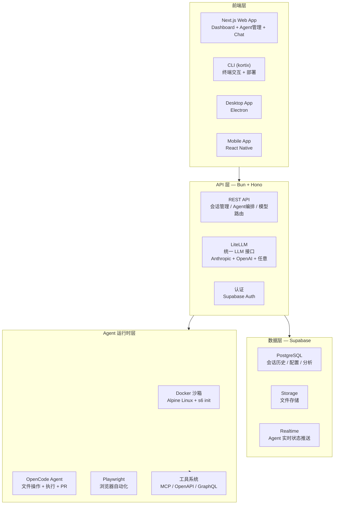
```mermaid
flowchart TB
    subgraph FRONTEND["前端层"]
        WEB["Next.js Web App<br/>Dashboard + Agent管理 + Chat"]
        CLI["CLI (kortix)<br/>终端交互 + 部署"]
        DESKTOP["Desktop App<br/>Electron"]
        MOBILE["Mobile App<br/>React Native"]
    end

    subgraph API["API 层 — Bun + Hono"]
        REST["REST API<br/>会话管理 / Agent编排 / 模型路由"]
        LITELLM["LiteLLM<br/>统一 LLM 接口<br/>Anthropic + OpenAI + 任意"]
        AUTH["认证<br/>Supabase Auth"]
    end

    subgraph DATABASE["数据层 — Supabase"]
        PG["PostgreSQL<br/>会话历史 / 配置 / 分析"]
        STORAGE["Storage<br/>文件存储"]
        RT["Realtime<br/>Agent 实时状态推送"]
    end

    subgraph SANDBOX["Agent 运行时层"]
        DOCKER["Docker 沙箱<br/>Alpine Linux + s6 init"]
        OPENCODE["OpenCode Agent<br/>文件操作 + 执行 + PR"]
        BROWSER["Playwright<br/>浏览器自动化"]
        TOOLS["工具系统<br/>MCP / OpenAPI / GraphQL"]
    end

    FRONTEND --> API
    API --> DATABASE
    API --> SANDBOX
    SANDBOX --> TOOLS
```

**三组件部署模型**：

| 组件 | 镜像 | 源码 | 技术栈 |
|------|------|------|--------|
| **API** | `kortix/kortix-api` | `apps/api/` | Bun + Hono |
| **Frontend** | `kortix/kortix-frontend` | `apps/web/` | Next.js + React |
| **Sandbox** | `kortix/computer` | `core/` | Alpine + s6 + Browser + Tools |

所有镜像多架构 `amd64 + arm64`，Docker Hub 统一管理。

---

## 3. 后端 API 核心 `🔧 开发 · 🏗 架构`

> **PM 一句话**：API 是系统的大脑——接收用户请求、调度 Agent 沙箱、记录结果。技术栈是 TypeScript（开发效率最高的全栈语言）。

### 3.1 技术选型

```json
{
  "runtime": "Bun (替代 Node.js)",
  "framework": "Hono + OpenAPIHono (@hono/zod-openapi)",
  "llm": "自建 LLM Gateway (OpenRouter + LiteLLM 统一 100+ 模型)",
  "database": "Supabase (PostgreSQL) + Drizzle ORM",
  "package_manager": "pnpm (monorepo, 72h release age 供应链防护)"
}
```

**为什么 Bun + Hono？**
- Bun：比 Node.js 快 4x 的启动速度，原生 TypeScript
- Hono：Web 标准路由，边缘友好，比 Express 轻量 10x

### 3.2 核心 API 路由

```
apps/api/
├── src/
│   ├── routes/
│   │   ├── sessions/        # 会话生命周期: 创建/运行/停止/历史
│   │   ├── agents/          # Agent 配置: 注册/修改/启停
│   │   ├── skills/          # Skill 管理: 创建/分享/版本
│   │   ├── connectors/      # 连接器: MCP/OpenAPI/GraphQL
│   │   ├── secrets/         # 密钥管理: 加密/注入/轮换
│   │   ├── channels/        # Slack/Webhook 集成
│   │   └── triggers/        # Cron/Webhook 触发
│   ├── core/
│   │   ├── sandbox/         # Docker 沙箱编排
│   │   ├── git/             # Git 分支/PR/CR 管理
│   │   └── llm/             # LiteLLM 路由 + 重试 + fallback
│   └── middleware/
│       ├── auth.ts          # Supabase JWT 验证
│       └── rate-limit.ts    # 限流
```

### 3.3 会话生命周期

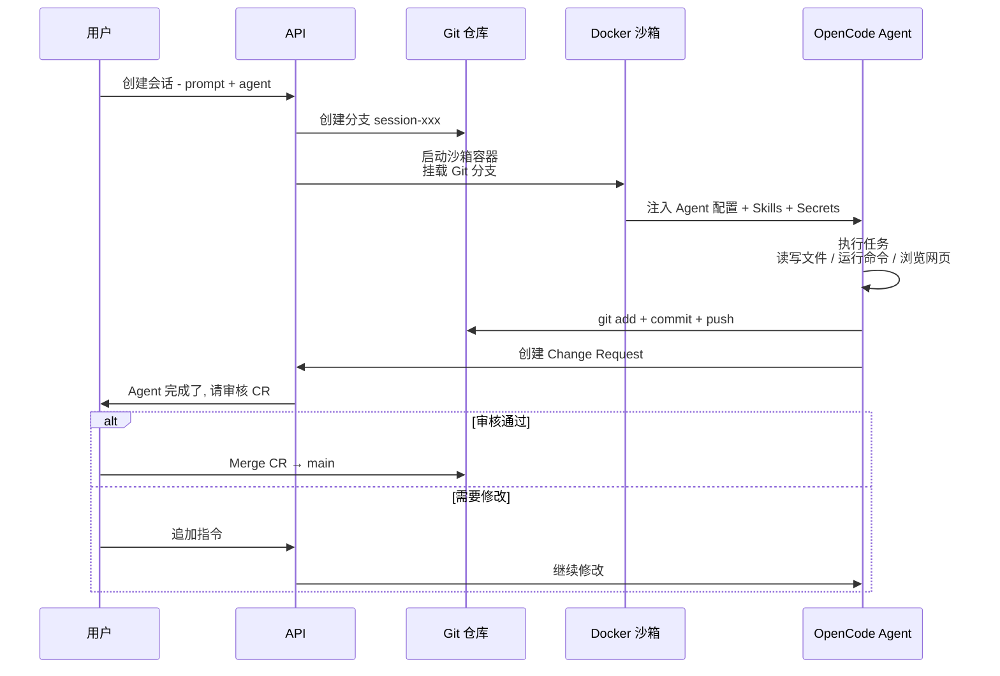
```mermaid
sequenceDiagram
    participant User as 用户
    participant API as API
    participant Git as Git 仓库
    participant Docker as Docker 沙箱
    participant Agent as OpenCode Agent

    User->>API: 创建会话 - prompt + agent
    API->>Git: 创建分支 session-xxx
    API->>Docker: 启动沙箱容器<br/>挂载 Git 分支
    Docker->>Agent: 注入 Agent 配置 + Skills + Secrets
    Agent->>Agent: 执行任务<br/>读写文件 / 运行命令 / 浏览网页
    
    Agent->>Git: git add + commit + push
    Agent->>API: 创建 Change Request
    API->>User: Agent 完成了, 请审核 CR
    
    alt 审核通过
        User->>Git: Merge CR → main
    else 需要修改
        User->>API: 追加指令
        API->>Agent: 继续修改
    end
```

---

## 4. Agent 运行时沙箱 `🏗 架构 · 🔧 运维`

> **PM 一句话**：沙箱 = 给 AI 配了一台独立虚拟机。AI 在虚拟机里随便折腾，不会影响其他人，干完活自动销毁。

### 4.1 沙箱设计

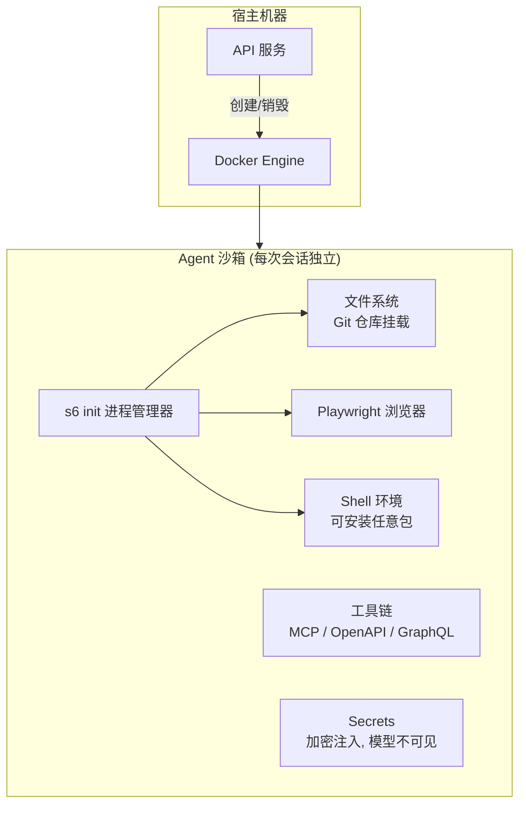
```mermaid
flowchart TB
    subgraph HOST["宿主机器"]
        API["API 服务"]
        DOCKER["Docker Engine"]
    end

    subgraph SANDBOX["Agent 沙箱 (每次会话独立)"]
        S6["s6 init 进程管理器"]
        FS["文件系统<br/>Git 仓库挂载"]
        BROWSER["Playwright 浏览器"]
        SHELL["Shell 环境<br/>可安装任意包"]
        TOOLS["工具链<br/>MCP / OpenAPI / GraphQL"]
        SECRETS["Secrets<br/>加密注入, 模型不可见"]
    end

    API -->|"创建/销毁"| DOCKER
    DOCKER --> SANDBOX
    S6 --> FS
    S6 --> BROWSER
    S6 --> SHELL
```

### 4.2 安全隔离

| 层级 | 机制 | 说明 |
|------|------|------|
| **进程** | Docker 容器隔离 | 每个会话独立容器 |
| **网络** | 容器网络隔离 | 只能访问白名单服务 |
| **文件** | 容器文件系统 | 会话结束即销毁 |
| **Secrets** | 加密注入, 不入日志 | Agent 和 Model 都看不到明文 |
| **Git** | 分支持久化 | 只有 Commit 的内容才存活 |

---

## 5. Git 原生工作流 `👥 全员 · 🏗 架构`

> **PM 一句话**：Git 就是公司的"硬盘"——所有人的任务和 AI 的产出都存在这里。谁改了什么都记录在案，改错了能回退，跟 Word 的修订模式一个道理。

这是 Kortix **最核心的创新**。

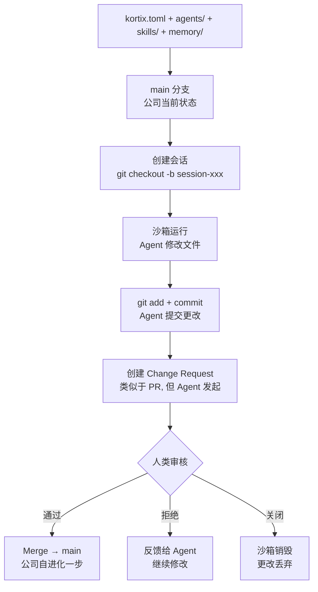
```mermaid
flowchart TB
    REPO["kortix.toml + agents/ + skills/ + memory/"]
    
    REPO --> MAIN["main 分支<br/>公司当前状态"]
    
    MAIN --> SESSION["创建会话<br/>git checkout -b session-xxx"]
    
    SESSION --> SANDBOX["沙箱运行<br/>Agent 修改文件"]
    
    SANDBOX --> COMMIT["git add + commit<br/>Agent 提交更改"]
    
    COMMIT --> CR["创建 Change Request<br/>类似于 PR, 但 Agent 发起"]
    
    CR --> REVIEW{"人类审核"}
    REVIEW -->|"通过"| MERGE["Merge → main<br/>公司自进化一步"]
    REVIEW -->|"拒绝"| FEEDBACK["反馈给 Agent<br/>继续修改"]
    REVIEW -->|"关闭"| DISCARD["沙箱销毁<br/>更改丢弃"]
```

### 5.1 Git 仓库里存什么

以供应链团队的 `supply-chain` 项目为例：

```
supply-chain/                    ← 这个文件夹 = 一个 Git 仓库
│
├── kortix.toml                  ← 项目配置文件
│                                  定义用什么镜像、连哪些 MCP、
│                                  Skills 从哪订阅、Cron 定时任务
│
├── agents/                      ← Agent 定义（Markdown，人写）
│   ├── sap-analyst.md           ← "你是 SAP 分析师，查表 A/B/C"
│   └── compliance-checker.md    ← "你是合规审计员，检查标准 X/Y/Z"
│
├── skills/                      ← 技能知识库（人写，Agent 用）
│   ├── sap-query.md             ← "SAP 查询必须带 werks 参数"
│   └── generate-report.py       ← 生成报告的 Python 脚本
│
├── memory/                      ← 公司经验（Agent 自动写入）
│   ├── MEMORY.md                ← 索引文件
│   ├── conventions.md           ← "报表格式统一用欧元"
│   ├── decisions.md             ← "Q3 决定换新供应商评分模型"
│   └── gotchas.md               ← "werks=1000 数据不准，需手工校准"
│
├── reports/                     ← Agent 产出物（Agent 写入）
│   ├── 2026-01-supplier-report.xlsx
│   └── weekly-compliance-check.md
│
└── .kortix/                     ← 运行时配置
    ├── Dockerfile                ← 沙箱镜像定义
    └── opencode/                 ← Agent 引擎配置
```

| 谁写 | 目录 | 内容 |
|------|------|------|
| **人**（一次性配置） | `agents/` `skills/` `kortix.toml` `.kortix/` | 定义 Agent 会什么、用什么工具 |
| **Agent**（日常工作） | `reports/` `memory/` | 产出的报告、积累的经验 |

### 5.2 Git 工作流

**Git 是协议，不是平台**——Suna 只依赖标准 Git（clone/push/branch/commit），不绑定任何托管平台。Suna 团队自己用 GitHub 托管 Suna 源码，这是他们"用 Suna 开发 Suna"的 Dogfooding。你部署时，项目仓库指向内部 GitLab 即可，零代码改动。

**与传统 Agent 的本质区别**：

| 维度 | LangChain/AutoGPT | Kortix |
|------|------------------|--------|
| 持久化 | 聊天历史 / 矢量数据库 | **Git 分支 + Commit** |
| 审核 | 无 | **Change Request 人类把关** |
| 回滚 | 困难 | `git revert` |
| 审计 | 日志 | `git log` |
| 协作 | 单人 | 多 Agent 并行, 分支不冲突 |
| 可移植 | 难以导出 | `git clone` 即全部 |

---
---

## 6. 用户交互与产品功能全景 `📋 产品 · 👥 全员`

> **PM 一句话**：用户不需要懂技术。在 Slack 里 @一下机器人，或者在 Web 界面聊天，就能给 AI 派活。AI 干完了会通知你来审核。

> 架构是骨架，这一节是血肉——Kortix 的用户实际能看到什么、点击什么、产出什么。

### 6.1 三种人用三种方式

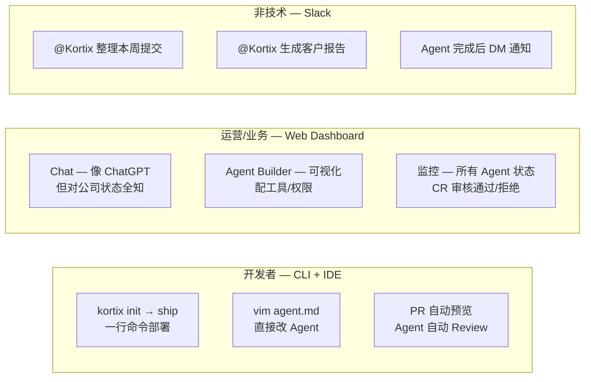
```mermaid
flowchart LR
    subgraph DEV["开发者 — CLI + IDE"]
        D1["kortix init → ship<br/>一行命令部署"]
        D2["vim agent.md<br/>直接改 Agent"]
        D3["PR 自动预览<br/>Agent 自动 Review"]
    end
    subgraph OPS["运营/业务 — Web Dashboard"]
        O1["Chat — 像 ChatGPT<br/>但对公司状态全知"]
        O2["Agent Builder — 可视化<br/>配工具/权限"]
        O3["监控 — 所有 Agent 状态<br/>CR 审核通过/拒绝"]
    end
    subgraph SLACK["非技术 — Slack"]
        S1["@Kortix 整理本周提交"]
        S2["@Kortix 生成客户报告"]
        S3["Agent 完成后 DM 通知"]
    end
```

### 6.2 8 类真实任务

| 类别 | 真实任务 | Agent 产出 |
|------|----------|-----------|
| **代码工程** | "审查这个 PR，找安全问题，开修复 PR" | Code Review + 修复分支 |
| **内容创作** | "根据本周 commit 生成产品更新日志" | Markdown |
| **数据分析** | "分析上周客户反馈 Top 5 痛点，做成 PPT" | .pptx 文件 |
| **运维部署** | "检查所有环境健康状态和慢查询" | 运维报告 |
| **客户沟通** | "给客户发邮件，跟进上次会议行动项" | 邮件草稿 |
| **项目管理** | "扫描项目看板，找阻塞超 3 天的任务" | 项目健康报告 |
| **销售支持** | "根据客户信息生成定制化产品演示 Deck" | 销售 Deck |
| **自动触发** | "每天早上 9 点扫描行业新闻，整理简报" | 日报 |

### 6.3 完整用户旅程

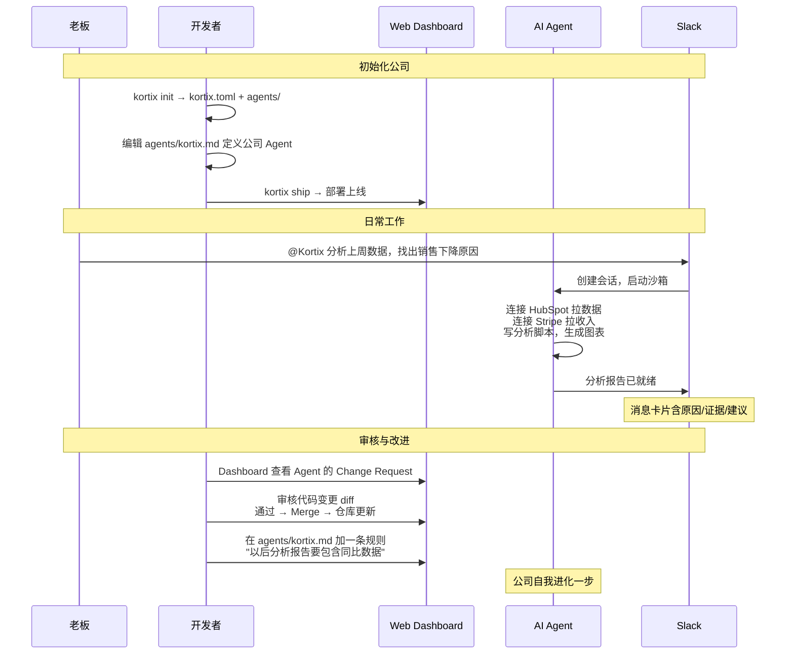
```mermaid
sequenceDiagram
    participant CEO as 老板
    participant DEV as 开发者
    participant WEB as Web Dashboard
    participant AGENT as AI Agent
    participant SLACK as Slack

    Note over CEO,SLACK: 初始化公司
    DEV->>DEV: kortix init → kortix.toml + agents/
    DEV->>DEV: 编辑 agents/kortix.md 定义公司 Agent
    DEV->>WEB: kortix ship → 部署上线

    Note over CEO,SLACK: 日常工作
    CEO->>SLACK: @Kortix 分析上周数据，找出销售下降原因
    SLACK->>AGENT: 创建会话，启动沙箱
    AGENT->>AGENT: 连接 HubSpot 拉数据<br/>连接 Stripe 拉收入<br/>写分析脚本，生成图表
    AGENT->>SLACK: 分析报告已就绪
    Note over SLACK: 消息卡片含原因/证据/建议

    Note over CEO,SLACK: 审核与改进
    DEV->>WEB: Dashboard 查看 Agent 的 Change Request
    DEV->>WEB: 审核代码变更 diff<br/>通过 → Merge → 仓库更新
    DEV->>WEB: 在 agents/kortix.md 加一条规则<br/>"以后分析报告要包含同比数据"
    Note over AGENT: 公司自我进化一步
```

### 6.4 Dashboard 核心界面

| 界面 | 功能 |
|------|------|
| **Command Center** | 所有 Agent 状态、最近会话、待审核 CR |
| **Chat** | 类似 ChatGPT，有文件面板和终端面板 |
| **Agent Builder** | Markdown 编辑 + 可视化工具权限网格 |
| **Skills** | 公司专属知识模块管理 |
| **Connectors** | 3000+ 应用卡片 + MCP 导入 |
| **Triggers** | Cron + Webhook 配置 |
| **Secrets** | 密钥列表-加密存储 |
| **CR 审核** | diff 对比 + 会话上下文 + 通过/拒绝 |
| **Channels** | Slack/Discord 连接状态 |

### 6.5 三种工作模式

| 模式 | 触发 | 适用场景 |
|------|------|----------|
| **按需 On-Demand** | 人在 Chat/Slack 发指令 | 临时任务、探索 |
| **人协助 Human-Assisted** | Agent 自动执行，关键节点等人批准 | 代码/内容产出 |
| **自动化 Automated** | Cron 定时 / Webhook 触发 | 日常运营、监控 |


## 7. 前端与 CLI `🔧 开发`

> **面向开发者和超级用户**的交互方式：Web Dashboard（可视化）、CLI 命令行（脚本和自动化）。普通员工不需要看这节。

### 6.1 前端架构

```
apps/web/               # Next.js 14+ App Router
├── app/
│   ├── dashboard/      # Agent 管理面板
│   ├── sessions/       # 会话监控 + Chat 界面
│   ├── agents/         # Agent 配置构建器
│   ├── workflows/      # 工作流可视化编辑器
│   └── settings/       # 组织设置
├── components/
│   ├── chat/           # 聊天组件
│   ├── agent-builder/  # Agent 可视化配置
│   └── sandbox/        # 沙箱状态监控
└── content/docs/       # 文档站点源码
```

### 6.2 CLI 命令体系

```bash
# 核心工作流
kortix init                      # 初始化项目 (kortix.toml)
kortix ship                      # 部署到 Cloud
kortix sessions new --prompt "..." # 创建会话
kortix chat                      # 终端对话
kortix cr ls                     # 查看 Change Request

# 自托管
kortix self-host start           # 启动本地实例
kortix hosts use local           # 切换到本地
kortix hosts use cloud           # 切换到 Cloud

# 模型
kortix models list               # 查看可用模型
kortix models pull llama3:8b     # 拉取本地模型 (Ollama)
```

---

## 8. 安全模型 `🏗 架构 · 🔧 运维`

> **PM 一句话**：三层防护——谁能用（Azure AD 登录）、密钥不泄露（加密后 AI 看不到）、干啥都有记录（审计）。满足德国 GDPR 合规。

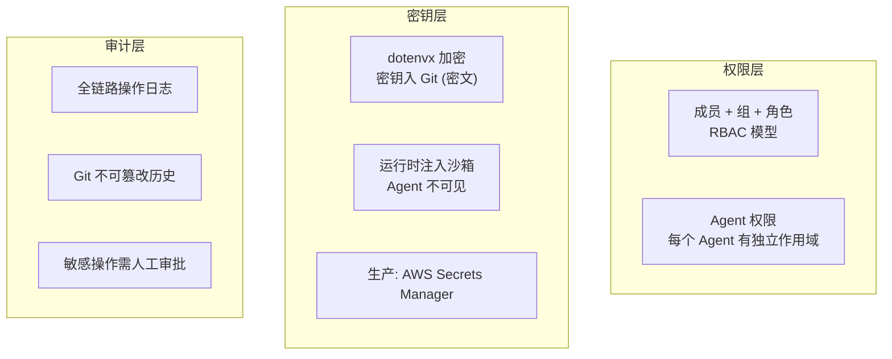
```mermaid
flowchart TB
    subgraph PERMISSION["权限层"]
        MEMBER["成员 + 组 + 角色<br/>RBAC 模型"]
        AGENT_PERM["Agent 权限<br/>每个 Agent 有独立作用域"]
    end

    subgraph SECRETS["密钥层"]
        ENCRYPT["dotenvx 加密<br/>密钥入 Git (密文)"]
        INJECT["运行时注入沙箱<br/>Agent 不可见"]
        AWS["生产: AWS Secrets Manager"]
    end

    subgraph AUDIT["审计层"]
        LOG["全链路操作日志"]
        GIT["Git 不可篡改历史"]
        HUMAN["敏感操作需人工审批"]
    end
```

**密钥的三层防护**：
1. **存储**：dotenvx 加密后入 Git（密文可提交，私钥离线）
2. **传输**：运行时通过环境变量注入沙箱
3. **使用**：Agent 和 LLM 看不到密钥明文，仅工具调用时自动签名

---

## 9. 关键设计决策分析 `🏗 架构 · 📋 产品`

> **PM 一句话**：为什么选 Git 不选数据库？为什么每个 AI 要给独立虚拟机？这节解释背后的"为什么"。

### 8.1 为什么每个会话一个 Docker 沙箱？

| 考量 | 决策 |
|------|------|
| 安全 | Agent 能 `rm -rf /` 也不影响宿主 |
| 隔离 | 多 Agent 并发互不干扰 |
| 可复现 | 沙箱镜像版本化，环境一致 |
| 清理 | 会话结束→容器销毁，无残留 |

代价：启动延迟（Docker 冷启动 1-3 秒）。优化：预构建镜像 + 容器预热池。

### 8.2 为什么"公司 = Git 仓库"？

| 传统 SaaS | Git 仓库 |
|-----------|----------|
| 数据锁在平台 | `git clone` = 全部数据 |
| 升级不可控 | 回退 = `git revert` |
| 审核依赖平台功能 | `git log` 天然审计 |
| Agent 产出难管理 | Change Request = PR 流程 |

### 8.3 为什么用 Supabase 而不是纯自建？

| 自建 | Supabase |
|------|----------|
| Auth 开发周期长 | 🔑 内建 OAuth/JWT |
| 实时功能需 WebSocket | ⚡ Realtime 开箱即用 |
| 文件存储需 S3 对接 | 📁 Storage API |
| 需要 DBA 维护 | 🐘 托管 PostgreSQL |
| 运维成本持续 | 💰 免费额度足够开发 |

---

## 10. 与传统 Agent 框架对比 `📋 产品 · 🏗 架构`

> **PM 一句话**：LangChain 是给程序员用的工具箱，我们是给全公司用的 AI 员工系统。把 Suna 和 LangChain 放在一起比，就像把 Office 365 和 Python 放在一起比——不是一个维度的东西。

| 维度 | Kortix | LangChain | AutoGPT | CrewAI |
|------|--------|-----------|---------|--------|
| **定位** | 公司级 Agent 指挥中心 | 开发者 LLM 框架 | 自主任务 Agent | 多 Agent 协作 |
| **运行环境** | Docker 沙箱（真实 OS） | Python 进程 | Python 进程 | Python 进程 |
| **持久化** | Git 仓库 + Supabase | 自定义 Memory | 矢量 DB | 自定义 |
| **工具** | 3000+ 连接器 + MCP | Tools 接口 | 命令行 | Tools 接口 |
| **审核** | Change Request 人类把关 | ❌ | ❌ | ❌ |
| **部署** | 自托管 + Cloud | 代码嵌入 | Docker | 代码嵌入 |
| **多 Agent** | 数千并行, Git 分支隔离 | 需手动编排 | ❌ | ✅ 角色+任务 |
| **开源** | ✅ Source-Available | ✅ MIT | ✅ MIT | ✅ MIT |

**核心差异化**：其他框架是"开发者工具"，Kortix 是"公司操作系统"——Git 仓库作为持久化层，Docker 沙箱作为运行时，Change Request 作为人类审核闸门。

---

## 11. 技术栈速查

| 层级 | 技术 | 说明 |
|------|------|------|
| **语言** | TypeScript（主体） + Python（工具链） + Go（沙箱守护进程） | |
| **前端** | Next.js 14+ (App Router) · Tailwind CSS · React 18 | |
| **后端运行时** | **Bun**（非 Node.js） | 原生 TS，启动快 4x |
| **后端框架** | **Hono + OpenAPIHono** + `@hono/zod-openapi` | Zod Schema = API 合约 |
| **ORM** | **Drizzle ORM**（非 Prisma） | 类型安全 SQL 构建器 |
| **数据库** | Supabase：PostgreSQL + Auth + Storage + Realtime | |
| **缓存** | Redis：会话缓存 + 限流 | |
| **LLM 网关** | 自建 LLM Gateway：OpenRouter + LiteLLM 统一 100+ 模型 | 含计费 + 加价 |
| **沙箱编排** | Daytona SDK / JustAVPS | 启动/停止/快照/代理 |
| **沙箱运行时** | Docker 容器 · Alpine Linux · s6 init | 每次会话独立 |
| **Agent 引擎** | OpenCode | 文件操作 + 执行 + PR |
| **连接器** | MCP + OpenAPI + GraphQL + Pipedream（3000+ 应用） | |
| **密钥管理** | dotenvx 加密入 Git（本地）+ AWS Secrets Manager（生产） | |
| **CI/CD** | CI Pipeline · Argo CD GitOps · Docker Hub 多架构镜像 | |
| **可观测性** | Sentry + OpenTelemetry + Prometheus | |
| **供应链** | pnpm monorepo · 72h release age · postinstall 白名单 | |

---

## 12. 源码级技术亮点

> 基于 `suna-main` 源码真实分析。

### 11.1 API 层：OpenAPI 驱动开发

```typescript
// apps/api/src/index.ts — 不是手写路由，而是 OpenAPI 自动生成
import { OpenAPIHono, createRoute, z } from '@hono/zod-openapi';

const app = new OpenAPIHono();

// ★ 每个端点 = Zod Schema + OpenAPI 元数据
// 自动生成 /v1/openapi.json + Scalar API 文档 /v1/docs
app.openapi(
  createRoute({
    method: 'get', path: '/health',
    tags: ['system'],
    responses: { 200: json(HealthSchema) },
  }),
  healthHandler,
);

// ★ Zod 定义的 Schema 即 API 合约
const HealthSchema = z.object({
  status: z.string(), version: z.string(),
  uptime_seconds: z.number(), memory_mb: z.number(),
  // ... 自动校验请求/响应
}).openapi('Health');
```

**为什么牛逼**：API 合约和校验是一份 Zod Schema，改了 Schema 自动同步文档，不会出现"文档和实现对不上"。

### 11.2 事件循环 Lag 健康检查

```typescript
// ★ 独创: 用真实的 Event Loop 延迟作为存活探针
// 常规 /health 返回 "OK" 即使 Event Loop 被阻塞也不会失败
// 这导致 2026-06-18 的线上事故：Pod 僵死但 k8s 没重启 → 90 分钟故障

const MAX_EVENT_LOOP_LAG_MS = 5000;
let eventLoopLagMs = 0;

const lagTimer = setInterval(() => {
  const now = performance.now();
  // ★ 实际延迟 = 现在 - 上次 - 间隔
  eventLoopLagMs = Math.max(0, now - lastSample - 1000);
  lastSample = now;
}, 1000);

// /health/live: Event Loop 延迟 > 5s → 返回 503
// kubelet 看到 503 → 自动重启僵死 Pod
app.get('/health/live', (c) => {
  if (eventLoopLagMs > MAX_EVENT_LOOP_LAG_MS)
    return c.json({ status: 'degraded' }, 503);
  return c.json({ status: 'ok', event_loop_lag_ms: eventLoopLagMs });
});
```

### 11.3 领导者选举 + 单例 Worker 模式

```typescript
// ★ 多副本 API 部署下，定时任务只在一个 Pod 运行
// 通过数据库 Leader Election 避免重复触发
// 
// 启动流程:
//   每个 Pod → startReplicaServices()（隧道、缓存、清理）
//   然后 → startLeaderElection()
//   拿到租约的 Pod → startSingletonWorkers()
//     ├── 定时任务调度器 (trigger scheduler)
//     ├── 预热池管理 (warm pool)
//     ├── 项目维护 (maintenance)
//     └── 遗留迁移 (legacy migration)
//   其他 Pod → 只处理 API 请求

startLeaderElection({
  onAcquire: () => startSingletonWorkers(),
  onRelease: () => stopSingletonWorkers(),
}, { eligible: runsSingletonWorkers() });
```

### 11.4 供应链安全：pnpm 72 小时冷却

```yaml
# pnpm-workspace.yaml — 生产级供应链防护
# ★ 任何新发布的包需要 72 小时才能被解析
# 防止 TanStack 2026-05-11 类型的供应链攻击
# （攻击者发布恶意版本 → 几小时内被发现 → 但已安装的无法撤销）
minimumReleaseAge: 4320  # 72 小时

# ★ 禁止任意 postinstall 脚本执行
# 只允许白名单中的包运行生命周期脚本
dangerouslyAllowAllBuilds: false
onlyBuiltDependencies:
  - esbuild
  - sharp
  - next
  # ... 严格白名单
```

### 11.5 dotenvx 加密密钥入 Git

```bash
# ★ 密钥加密后直接提交到 Git（不是 .gitignore!）
# apps/api/.env 中的密钥: KEY=encrypted:xxxx...
# 解密密钥存在 Dotenv Armor（离线设备）
# 任何人 clone 了代码也看不到真实密钥

# 开发:
pnpm dev  # 自动解密 apps/api/.env

# 生产:
# API 从 AWS Secrets Manager 加载（不入 Git）

# 三个环境三套密钥:
# apps/api/.env       → 本地开发
# apps/api/.env.dev   → 测试环境
# apps/api/.env.prod  → 生产环境（本地调试用）
```

### 11.6 LLM 网关：统一计费 + 路由

```typescript
// ★ 自建 LLM 网关，非简单透传
const { createLlmGateway } = await import('./llm-gateway');

app.route('/v1/llm', createLlmGateway(
  {
    enabled: config.LLM_GATEWAY_ENABLED,
    openrouterApiKey: config.OPENROUTER_API_KEY,
    markup: llmPriceMarkup(),           // ★ 模型加价策略
    appName: 'Kortix',
  },
  {
    // ★ 认证: 沙箱 Token → 用户身份
    authenticateToken: async (token) => { /* ... */ },
    
    // ★ 计费: 每次 LLM 调用扣费
    recordUsage: async (event) => {
      await recordUsageEvent({ /* tokens, cost, model */ });
      await deductForLlmUsage({ accountId, costUsd, /* ... */ });
    },
  },
));
```

### 11.7 Sandbox Proxy：统一隧道

```typescript
// ★ 核心创新: 统一沙箱代理
// 无论沙箱在哪里（Daytona Cloud / 本地 Docker），统一路由

// Pattern: /v1/p/{sandboxId}/{port}/*
//   Cloud:  sandboxId = Daytona external ID → Daytona SDK 代理
//   Local:  sandboxId = container name → Docker DNS

app.route('/v1/p', sandboxProxyApp);

// 还支持子域名预览路由:
// p{port}-{sandboxId}.localhost:{apiPort}/...
// 让沙箱内的 Web 应用可以通过真实域名访问
```

---

## 13. 架构真相比对

| 我的初始猜测 | 源码真相 |
|-------------|---------|
| Prisma ORM | **Drizzle ORM** |
| Express.js API | **Hono + OpenAPIHono** |
| Node.js 运行时 | **Bun**（不是 Node.js） |
| 简单健康检查 | **Event Loop Lag 探针** |
| 单体 API | **Leader Election + 单例 Worker** |
| 标准 .gitignore 密钥 | **dotenvx 加密入 Git** + AWS Secrets Manager |
| 普通 LLM 透传 | **自建 LLM Gateway + 统一计费** |
| 普通 monorepo | **72h release age + postinstall 白名单** |

---

## 14. 业务架构深度解析 `📋 产品 · 👥 全员`

> **PM 一句话**：商业模式是三级火箭——免费自托管（开发者试用）→ Cloud 按量收费（中小公司）→ Enterprise 私有部署（大公司，就是我们这个场景）。

### 13.1 商业模型 — 三级火箭

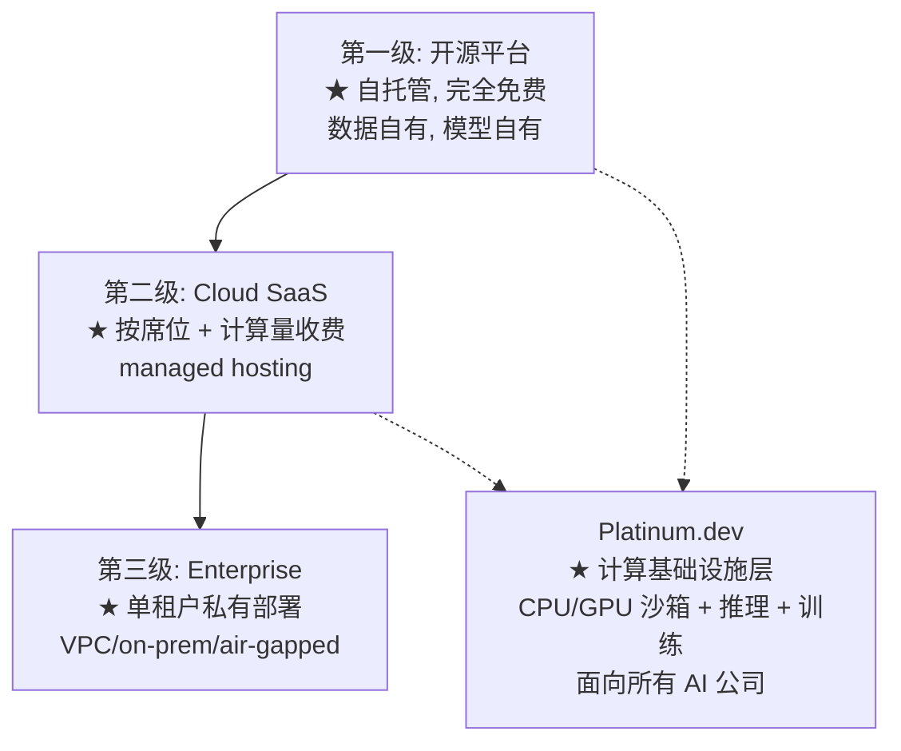
```mermaid
flowchart TB
    L1["第一级: 开源平台<br/>★ 自托管, 完全免费<br/>数据自有, 模型自有"]
    L2["第二级: Cloud SaaS<br/>★ 按席位 + 计算量收费<br/>managed hosting"]
    L3["第三级: Enterprise<br/>★ 单租户私有部署<br/>VPC/on-prem/air-gapped"]
    
    L4["Platinum.dev<br/>★ 计算基础设施层<br/>CPU/GPU 沙箱 + 推理 + 训练<br/>面向所有 AI 公司"]
    
    L1 --> L2 --> L3
    L1 -.-> L4
    L2 -.-> L4
```

**商业模式拆解**：

| 层级 | 目标客户 | 收费方式 | 年 ARPU 区间 |
|------|----------|----------|------------|
| 自托管 | 独立开发者、小团队 | 免费 | $0 |
| Cloud | 10-500 人公司 | 按席位数 + 计算分钟 | $5K-$200K |
| Enterprise | 500+ 人、合规要求 | 年合同 + 部署费 | $200K-$2M+ |
| Marketplace | 生态开发者 | 佣金 15-30% | 网络效应 |

### 13.2 三条业务线

| 业务线 | 目标客户 | 核心价值 |
|--------|----------|----------|
| **Developers** | 个人/小团队开发者 | 给 OpenCode/Claude/Cursor 一个管理后台——PR 预览、后台编码 Agent |
| **Companies** | 企业 | AI 劳动力池——客服、销售、运营、研发各自有 Agent，统一管理 |
| **Agencies** | 咨询公司/集成商 | 白标 + 垂直化——给客户交付 AI 解决方案，底层用 Kortix |

### 13.3 竞品格局

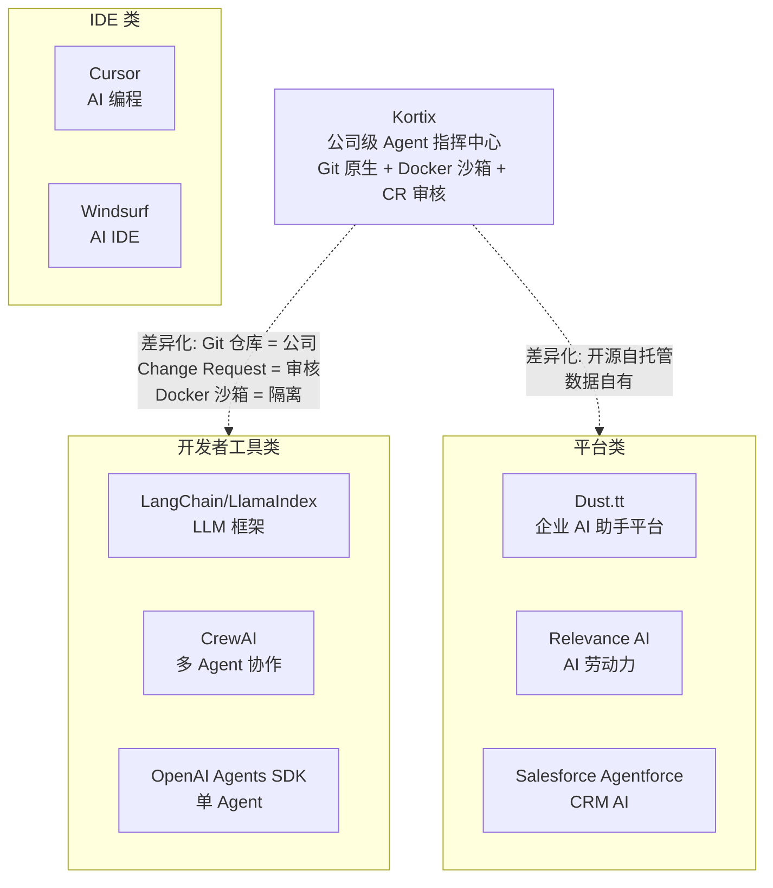
```mermaid
flowchart TB
    KORTIX["Kortix<br/>公司级 Agent 指挥中心<br/>Git 原生 + Docker 沙箱 + CR 审核"]
    
    subgraph TOOLS["开发者工具类"]
        LANG["LangChain/LlamaIndex<br/>LLM 框架"]
        CREW["CrewAI<br/>多 Agent 协作"]
        OPENAI["OpenAI Agents SDK<br/>单 Agent"]
    end
    
    subgraph PLATFORMS["平台类"]
        DUST["Dust.tt<br/>企业 AI 助手平台"]
        RELEVANCE["Relevance AI<br/>AI 劳动力"]
        AGENTFORCE["Salesforce Agentforce<br/>CRM AI"]
    end
    
    subgraph IDES["IDE 类"]
        CURSOR["Cursor<br/>AI 编程"]
        WINDSURF["Windsurf<br/>AI IDE"]
    end
    
    KORTIX -.->|"差异化: Git 仓库 = 公司<br/>Change Request = 审核<br/>Docker 沙箱 = 隔离"| TOOLS
    KORTIX -.->|"差异化: 开源自托管<br/>数据自有"| PLATFORMS
```

### 13.4 护城河分析

| 护城河 | 深度 | 说明 |
|--------|------|------|
| **Git 原生工作流** | ⭐⭐⭐ | 公司状态版本化，天然审计/回滚/协作 |
| **Docker 沙箱隔离** | ⭐⭐⭐ | 真正 OS 级隔离，Agent 可以 rm -rf / |
| **开源 + 自托管** | ⭐⭐ | 消除供应商锁定恐惧 |
| **多模型支持** | ⭐⭐ | 不绑定任何模型供应商 |
| **Change Request 审核** | ⭐⭐⭐ | 人类最后把关，企业合规必需 |
| **网络效应** | ⭐ | Marketplace + Skills 生态（早期） |

---

## 15. 技术架构深度解析

### 14.1 完整部署拓扑

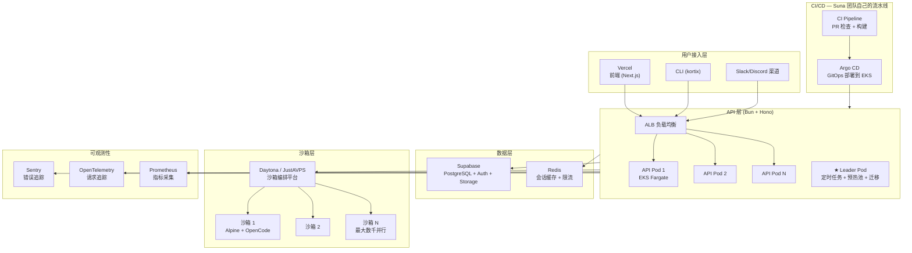
```mermaid
flowchart TB
    subgraph EDGE["用户接入层"]
        VERCEL["Vercel<br/>前端 (Next.js)"]
        CLI["CLI (kortix)"]
        SLACK["Slack/Discord 渠道"]
    end

    subgraph API_LAYER["API 层 (Bun + Hono)"]
        LB["ALB 负载均衡"]
        API1["API Pod 1<br/>EKS Fargate"]
        API2["API Pod 2"]
        API3["API Pod N"]
        LEADER["★ Leader Pod<br/>定时任务 + 预热池 + 迁移"]
    end

    subgraph DATA["数据层"]
        SUPABASE["Supabase<br/>PostgreSQL + Auth + Storage"]
        REDIS["Redis<br/>会话缓存 + 限流"]
    end

    subgraph SANDBOX["沙箱层"]
        DAYTONA["Daytona / JustAVPS<br/>沙箱编排平台"]
        SB1["沙箱 1<br/>Alpine + OpenCode"]
        SB2["沙箱 2"]
        SBN["沙箱 N<br/>最大数千并行"]
    end

    subgraph CI["CI/CD — Suna 团队自己的流水线"]
        GHA["CI Pipeline<br/>PR 检查 + 构建"]
        ARGO["Argo CD<br/>GitOps 部署到 EKS"]
    end

    subgraph OBS["可观测性"]
        SENTRY["Sentry<br/>错误追踪"]
        OTEL["OpenTelemetry<br/>请求追踪"]
        METRICS["Prometheus<br/>指标采集"]
    end

    VERCEL --> LB
    CLI --> LB
    SLACK --> LB
    LB --> API1 & API2 & API3
    API_LAYER --> SUPABASE
    API_LAYER --> REDIS
    API_LAYER --> DAYTONA
    DAYTONA --> SB1 & SB2 & SBN
    GHA --> ARGO
    ARGO --> API_LAYER
    API_LAYER --> SENTRY
    API_LAYER --> OTEL
    API_LAYER --> METRICS
```

### 14.2 沙箱生命周期详解

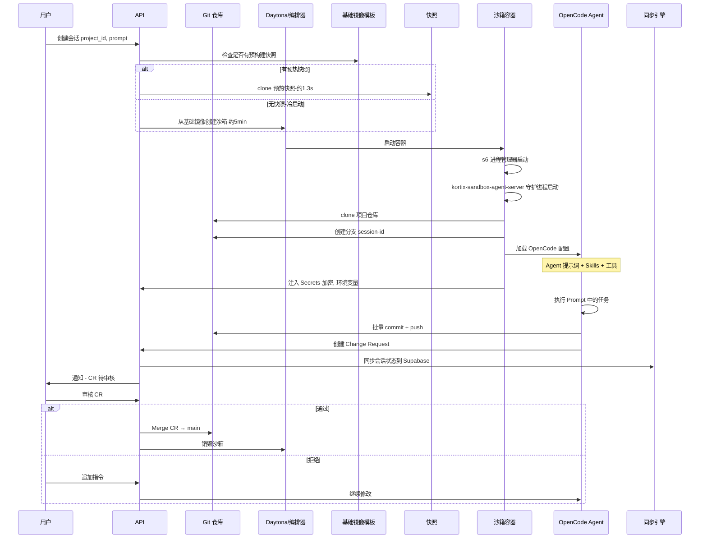
```mermaid
sequenceDiagram
    participant User as 用户
    participant API as API
    participant Git as Git 仓库
    participant Daytona as Daytona/编排器
    participant Template as 基础镜像模板
    participant Snapshot as 快照
    participant SB as 沙箱容器
    participant Agent as OpenCode Agent
    participant Sync as 同步引擎

    User->>API: 创建会话 project_id, prompt
    API->>Template: 检查是否有预构建快照
    
    alt 有预热快照
        API->>Snapshot: clone 预热快照-约1.3s
    else 无快照-冷启动
        API->>Daytona: 从基础镜像创建沙箱-约5min
    end
    
    Daytona->>SB: 启动容器
    SB->>SB: s6 进程管理器启动
    SB->>SB: kortix-sandbox-agent-server 守护进程启动
    
    SB->>Git: clone 项目仓库
    SB->>Git: 创建分支 session-id
    
    SB->>Agent: 加载 OpenCode 配置
    Note over Agent: Agent 提示词 + Skills + 工具
    
    SB->>API: 注入 Secrets-加密, 环境变量
    
    Agent->>Agent: 执行 Prompt 中的任务
    Agent->>Git: 批量 commit + push
    
    Agent->>API: 创建 Change Request
    API->>Sync: 同步会话状态到 Supabase
    API->>User: 通知 - CR 待审核
    
    User->>API: 审核 CR
    alt 通过
        API->>Git: Merge CR → main
        API->>Daytona: 销毁沙箱
    else 拒绝
        User->>API: 追加指令
        API->>Agent: 继续修改
    end
```

### 14.3 数据模型（核心）

```
数据库: Supabase PostgreSQL

核心表:
┌──────────────────────────┐
│ accounts                 │  租户/组织
│  - id: uuid (PK)        │
│  - name: text            │
│  - owner_id: uuid (FK)  │
└──────────────────────────┘
           │
           │ 1:N
           ▼
┌──────────────────────────┐
│ projects                 │  项目 (= Git 仓库)
│  - id: uuid (PK)        │
│  - account_id: uuid (FK)│
│  - repo_url: text        │  Git 仓库地址
│  - config: jsonb         │  kortix.toml 解析结果
│  - provider: enum        │  daytona / platinum
└──────────────────────────┘
           │
           │ 1:N
           ▼
┌──────────────────────────┐
│ sessions                 │  会话 (= 沙箱实例)
│  - id: uuid (PK)        │
│  - project_id: uuid (FK)│
│  - sandbox_id: text      │  Daytona external_id
│  - branch_name: text     │  Git 分支名
│  - agent_slug: text      │  使用的 Agent 名
│  - status: enum          │  starting/running/completed/failed
│  - started_at: timestamp │
│  - completed_at: timestamp│
│  - prompt: text          │
└──────────────────────────┘
           │
           │ 1:N
           ▼
┌──────────────────────────┐
│ change_requests          │  CR (Agent 的 PR)
│  - id: uuid (PK)        │
│  - session_id: uuid (FK)│
│  - branch_name: text     │
│  - title: text           │
│  - status: enum          │  open/merged/closed
│  - diff_summary: text    │
└──────────────────────────┘
           │
           │ 1:N
           ▼
┌──────────────────────────┐
│ messages                 │  会话消息(同步自沙箱)
│  - id: uuid (PK)        │
│  - session_id: uuid (FK)│
│  - role: enum            │  user / agent / system
│  - content: text         │
│  - tool_calls: jsonb     │
└──────────────────────────┘
```

### 14.4 Agent 体系

| Agent | 角色 | 工具权限 | 触发方式 |
|-------|------|----------|----------|
| **kortix** | 通用知识工作者 | 全部工具 | 手动/聊天/API |
| **pr-bot** | ★ Suna 团队自用（Dogfooding）<br/>PR 审查 + 预览环境 | Git + 文件系统 + 浏览器 | Webhook（可配 GitLab） |
| **memory-reflector** | 记忆整理 | memory 工具 | 定时任务 |

### 14.5 Skills 体系

Skills 是**可复用的领域知识模块**，Markdown + 可执行脚本：

| Skill | 功能 |
|-------|------|
| `kortix-system` | Kortix 平台本身的知识 |
| `kortix-executor` | 连接器执行（3000+ 应用） |
| `kortix-computer` | 浏览器自动化 + 文件操作 |
| `kortix-slack` | Slack 集成 |
| `kortix-memory` | 记忆管理协议 |
| `thermo-nuclear-review` | 激进代码审查 |
| `agent-browser` | Playwright Web 自动化 |

### 14.6 CI/CD 部署流水线 — 二次开发必须掌握

你需要 Fork Suna 源码 → 定制 → 构建自己的镜像 → 部署到 AutoCorp AWS。

**完整流程**：

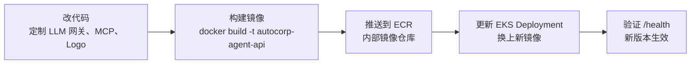
```mermaid
flowchart LR
    CODE["改代码<br/>定制 LLM 网关、MCP、Logo"] --> BUILD["构建镜像<br/>docker build -t autocorp-agent-api"]
    BUILD --> PUSH["推送到 ECR<br/>内部镜像仓库"]
    PUSH --> DEPLOY["更新 EKS Deployment<br/>换上新镜像"]
    DEPLOY --> VERIFY["验证 /health<br/>新版本生效"]
```

**具体操作**：

```bash
# 1. 构建 API 镜像
cd apps/api
docker build -t autocorp-agent-api:v1.0 .

# 2. 推送到 AutoCorp ECR
aws ecr get-login-password | docker login --username AWS --password-stdin \
  123456789.dkr.ecr.eu-central-1.amazonaws.com
docker tag autocorp-agent-api:v1.0 \
  123456789.dkr.ecr.eu-central-1.amazonaws.com/autocorp-agent-api:v1.0
docker push 123456789.dkr.ecr.eu-central-1.amazonaws.com/autocorp-agent-api:v1.0

# 3. 更新 EKS Deployment Service（用新镜像）
aws kubectl rollout restart deployment \
  --cluster autocorp-agent \
  --service api \
  --force-new-deployment

# 4. 验证
curl https://agent.internal.autocorp.com/v1/health
```

**日常升级流程**：

```
1. git pull 拉 Suna 上游更新
2. 合并到你的 fork（解决冲突）
3. 重新构建镜像
4. 先在测试环境验证
5. 确认无误后推到生产
```

**如果嫌手动麻烦，可以配 GitLab CI**：

```yaml
# .gitlab-ci.yml — 自动化构建和部署
stages:
  - build
  - deploy

build-api:
  stage: build
  script:
    - docker build -t $ECR_REGISTRY/autocorp-agent-api:$CI_COMMIT_SHORT_SHA apps/api/
    - docker push $ECR_REGISTRY/autocorp-agent-api:$CI_COMMIT_SHORT_SHA
  only:
    - main

deploy-dev:
  stage: deploy
  script:
    - aws kubectl rollout restart deployment --cluster autocorp-agent-dev --service api --force-new-deployment
  only:
    - main

deploy-prod:
  stage: deploy
  script:
    - aws kubectl rollout restart deployment --cluster autocorp-agent-prod --service api --force-new-deployment
  only:
    - tags  # 打 tag 才部署生产
  when: manual  # 需要手动确认
```

---

## 16. 架构总结

```
Kortix 的本质 = Git (版本化) + Docker (沙箱隔离) + Agent (AI 劳动力) + CR (人类审核)

与传统 Agent 框架的根本差异:
  LangChain  → 开发者工具，代码嵌入
  CrewAI     → 多 Agent 编排，Python 进程内
  Kortix     → 公司操作系统，Git 仓库 + Docker 沙箱 + 人类审核闸门

核心竞争力:
  1. Git 原生工作流 — 审计/回滚/协作天然具备
  2. Docker 沙箱隔离 — 真正 OS 级安全
  3. Change Request — 人类把关，企业合规
  4. 开源自托管 — 零供应商锁定
  5. 多模型 — 不绑定任何 LLM 厂商
```

---

## 17. AutoCorp 企业级 AWS 部署方案

> **场景**：AutoCorp 内部 AWS（法兰克福 eu-central-1），自托管，多团队。公司已有 **LiteLLM 网关**、**中央 Skills 管理平台**、**内部 MCP Server**——Kortix 作为 Agent 编排层集成这些现有基础设施。

### 17.1 已有基础设施 vs Kortix 职责边界

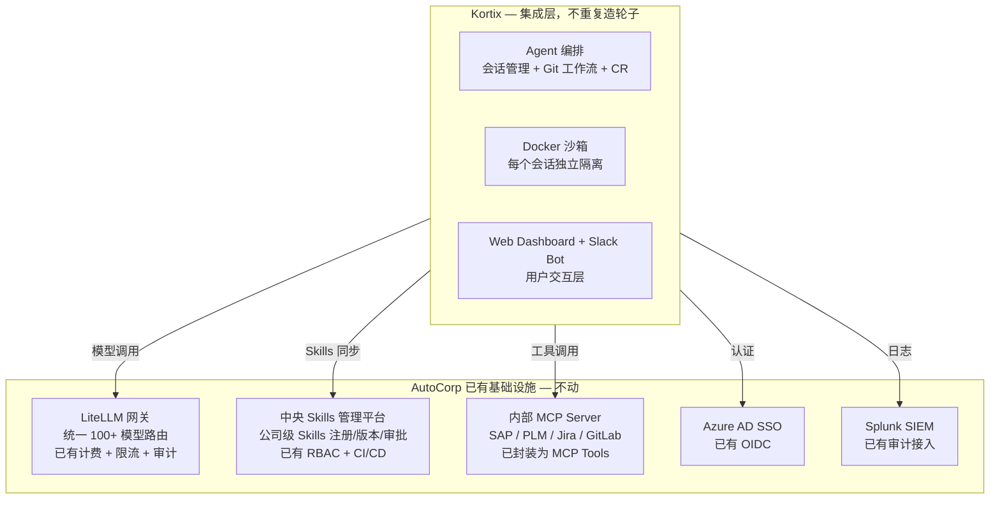
```mermaid
flowchart TB
    subgraph EXISTING["AutoCorp 已有基础设施 — 不动"]
        LITELLM["LiteLLM 网关<br/>统一 100+ 模型路由<br/>已有计费 + 限流 + 审计"]
        SKILLS_PLATFORM["中央 Skills 管理平台<br/>公司级 Skills 注册/版本/审批<br/>已有 RBAC + CI/CD"]
        MCP["内部 MCP Server<br/>SAP / PLM / Jira / GitLab<br/>已封装为 MCP Tools"]
        SSO["Azure AD SSO<br/>已有 OIDC"]
        SIEM["Splunk SIEM<br/>已有审计接入"]
    end

    subgraph KORTIX["Kortix — 集成层，不重复造轮子"]
        AGENT["Agent 编排<br/>会话管理 + Git 工作流 + CR"]
        SANDBOX["Docker 沙箱<br/>每个会话独立隔离"]
        FRONTEND["Web Dashboard + Slack Bot<br/>用户交互层"]
    end

    KORTIX -->|"模型调用"| LITELLM
    KORTIX -->|"Skills 同步"| SKILLS_PLATFORM
    KORTIX -->|"工具调用"| MCP
    KORTIX -->|"认证"| SSO
    KORTIX -->|"日志"| SIEM
```

**核心原则：Kortix 只做 Agent 编排 + 沙箱隔离 + 用户交互。LLM 网关、Skills 管理、MCP Tools 全部复用现有。**

### 17.2 LiteLLM 集成

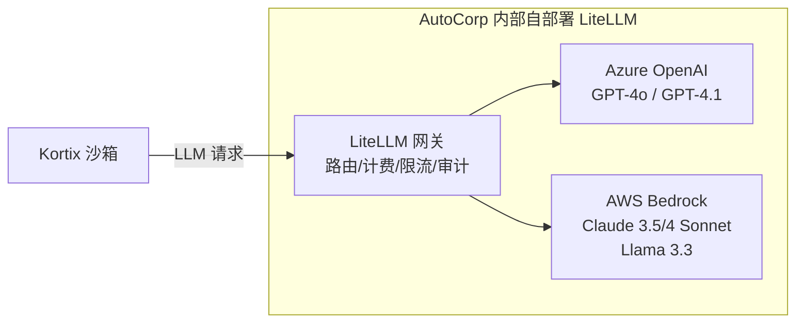
```mermaid
flowchart LR
    subgraph AUTOCORP["AutoCorp 内部自部署 LiteLLM"]
        LITELLM_CORE["LiteLLM 网关<br/>路由/计费/限流/审计"]
        AZURE["Azure OpenAI<br/>GPT-4o / GPT-4.1"]
        AWS_BEDROCK["AWS Bedrock<br/>Claude 3.5/4 Sonnet<br/>Llama 3.3"]
    end

    KORTIX_SB["Kortix 沙箱"] -->|"LLM 请求"| LITELLM_CORE
    LITELLM_CORE --> AZURE
    LITELLM_CORE --> AWS_BEDROCK
```

**关键点**：LiteLLM 是 AutoCorp 内部自部署（非 SaaS），统一管理 Azure OpenAI 和 AWS Bedrock 上的基础大模型。Kortix 只需要指向 `https://litellm.internal.autocorp.com/v1`，模型选择、计费、限流全部由 LiteLLM 处理。

```typescript
// Kortix 的 LLM Gateway 配置 → 指向内部 LiteLLM
LLM_GATEWAY_BASE_URL=https://litellm.internal.autocorp.com/v1
// LiteLLM 已配置:
//   - Azure OpenAI: GPT-4o, GPT-4.1
//   - AWS Bedrock: Claude 3.5 Sonnet, Claude 4 Sonnet, Llama 3.3
// Kortix Agent 只需指定模型名，LiteLLM 自动路由到对应云
```

### 17.3 中央 Skills 管理平台集成

```yaml
# AutoCorp 的 Skills 管理平台（已有）:

# Skills 生命周期:
  register → review → approve → version → publish → monitor

# Kortix 的集成方式:
  # 1. Kortix 不再维护自己的 .kortix/opencode/skills/
  # 2. 沙箱启动时从中央 Skills 平台拉取已审批的 Skills
  # 3. Skills 有版本号，沙箱锁定版本
```

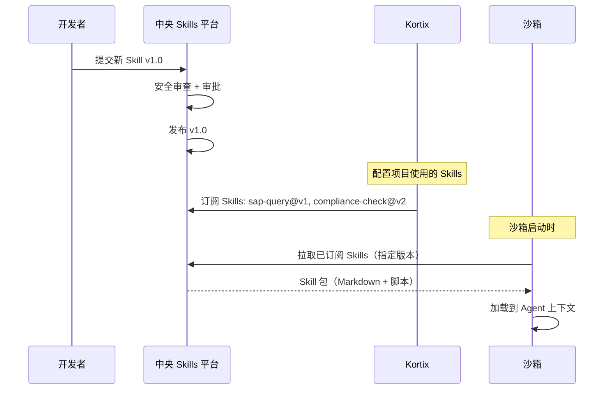
```mermaid
sequenceDiagram
    participant Dev as 开发者
    participant SkillsPlatform as 中央 Skills 平台
    participant Kortix as Kortix
    participant Sandbox as 沙箱

    Dev->>SkillsPlatform: 提交新 Skill v1.0
    SkillsPlatform->>SkillsPlatform: 安全审查 + 审批
    SkillsPlatform->>SkillsPlatform: 发布 v1.0

    Note over Kortix: 配置项目使用的 Skills
    Kortix->>SkillsPlatform: 订阅 Skills: sap-query@v1, compliance-check@v2

    Note over Sandbox: 沙箱启动时
    Sandbox->>SkillsPlatform: 拉取已订阅 Skills（指定版本）
    SkillsPlatform-->>Sandbox: Skill 包（Markdown + 脚本）
    Sandbox->>Sandbox: 加载到 Agent 上下文
```

**Skills 版本锁定**：

```toml
# kortix.toml — Skills 不再本地维护，改为引用中央平台
[skills]
source = "https://skills.internal.autocorp.com"
subscriptions = [
  { slug = "sap-query", version = "1.3.2" },
  { slug = "compliance-check", version = "2.0.0" },
  { slug = "plm-report", version = "1.1.0" },
]
# 不写 version → 自动用最新审批版本
```

### 17.4 内部 MCP Server 集成

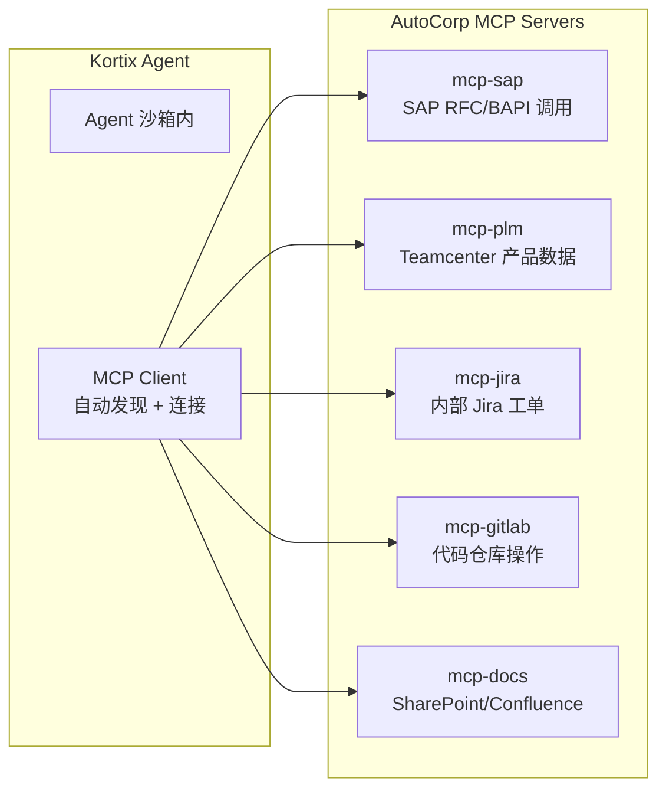
```mermaid
flowchart LR
    subgraph MCP_SERVERS["AutoCorp MCP Servers"]
        MCP_SAP["mcp-sap<br/>SAP RFC/BAPI 调用"]
        MCP_PLM["mcp-plm<br/>Teamcenter 产品数据"]
        MCP_JIRA["mcp-jira<br/>内部 Jira 工单"]
        MCP_GITLAB["mcp-gitlab<br/>代码仓库操作"]
        MCP_DOCS["mcp-docs<br/>SharePoint/Confluence"]
    end

    subgraph KORTIX["Kortix Agent"]
        AGENT["Agent 沙箱内"]
        MCP_CLIENT["MCP Client<br/>自动发现 + 连接"]
    end

    MCP_CLIENT --> MCP_SAP
    MCP_CLIENT --> MCP_PLM
    MCP_CLIENT --> MCP_JIRA
    MCP_CLIENT --> MCP_GITLAB
    MCP_CLIENT --> MCP_DOCS
```

```toml
# kortix.toml — MCP 工具配置
[[mcp_servers]]
name = "sap"
url = "https://mcp-sap.internal.autocorp.com"
# MCP Server 自己处理认证和权限
# Agent 调用时自动注入沙箱 Token

[[mcp_servers]]
name = "plm"
url = "https://mcp-plm.internal.autocorp.com"

[[mcp_servers]]
name = "jira"
url = "https://mcp-jira.internal.autocorp.com"
```

**关键变化**：Kortix 原生的 Connectors（Pipedream、OAuth 等）基本不再需要。所有外部系统通过 MCP Server 统一暴露。

### 17.5 AWS 部署架构（更新版）

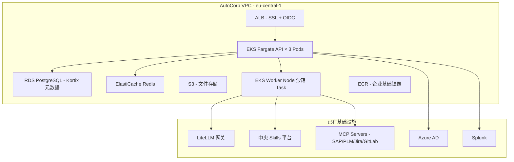
```mermaid
flowchart TB
    subgraph VPC["AutoCorp VPC - eu-central-1"]
        ALB["ALB - SSL + OIDC"]
        ECS["EKS Fargate API × 3 Pods"]
        RDS["RDS PostgreSQL - Kortix 元数据"]
        REDIS["ElastiCache Redis"]
        S3["S3 - 文件存储"]
        SB["EKS Worker Node 沙箱 Task"]
        ECR["ECR - 企业基础镜像"]
    end

    subgraph EXISTING["已有基础设施"]
        LITELLM["LiteLLM 网关"]
        SKILLS["中央 Skills 平台"]
        MCP["MCP Servers - SAP/PLM/Jira/GitLab"]
        SSO["Azure AD"]
        SIEM["Splunk"]
    end

    ALB --> ECS
    ECS --> RDS & REDIS & SB
    ECS --> SSO
    SB --> LITELLM
    SB --> SKILLS
    SB --> MCP
    ECS --> SIEM
```

### 17.6 成本估算（更新）

| 资源 | 月费 (€) | 变化 |
|------|----------|------|
| RDS PostgreSQL Multi-AZ | ~450 | — |
| ElastiCache Redis | ~60 | — |
| EKS Fargate API × 3 Pods | ~280 | — |
| EKS Worker Nodes (沙箱用) | ~600 | — |
| ALB + S3 + KMS + 监控 | ~125 | — |
| LiteLLM / Skills / MCP | ~0 | **已有** |
| **合计** | **~1,515** | LLM 网关和 Skills 省了 |

**备注**：因为 LiteLLM、Skills 平台、MCP Server 都是 AutoCorp 已有基础设施，Kortix 只需要部署 Agent 编排层和数据层，成本更低、集成更快。

### 17.7 分阶段实施（更新）

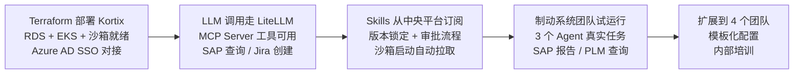
```mermaid
flowchart LR
    P0["Week 1-2<br/>基础部署"] --> P1["Week 3-4<br/>LiteLLM+MCP 集成"]
    P1 --> P2["Week 5-7<br/>Skills 平台对接"]
    P2 --> P3["Week 8-10<br/>单团队试点"]
    P3 --> P4["Week 11-14<br/>多团队推广"]

    P0["Terraform 部署 Kortix<br/>RDS + EKS + 沙箱就绪<br/>Azure AD SSO 对接"]
    P1["LLM 调用走 LiteLLM<br/>MCP Server 工具可用<br/>SAP 查询 / Jira 创建"]
    P2["Skills 从中央平台订阅<br/>版本锁定 + 审批流程<br/>沙箱启动自动拉取"]
    P3["制动系统团队试运行<br/>3 个 Agent 真实任务<br/>SAP 报告 / PLM 查询"]
    P4["扩展到 4 个团队<br/>模板化配置<br/>内部培训"]
```

### 17.8 Kortix 定制点总结

| 组件 | Kortix 原始 | AutoCorp 定制 |
|------|-----------|-----------------|
| LLM 网关 | 自建 Gateway + 计费 | **指向 LiteLLM，透传模式** |
| Skills | `.kortix/opencode/skills/` 本地文件 | **从中央 Skills 平台订阅 + 版本锁定** |
| Connectors | Pipedream / OAuth / OpenAPI | **全部走内部 MCP Server** |
| Secrets | dotenvx + AWS SM | **统一 AWS KMS** |
| 认证 | Supabase Auth | **Azure AD OIDC** |
| 审计 | Sentry + OTEL | **Splunk SIEM** |
| Git 仓库 | 任意 Git 托管（Suna 团队用 GitHub Dogfooding） | **内部 GitLab** |

---

## 附录：术语表 `👥 全员`

| 术语 | 全称 | 大白话 |
|------|------|--------|
| **Git** | — | 版本管理工具。像 Word 的"修订模式"——谁改了啥、啥时候改的，都能追溯，改错了能回退 |
| **Git 仓库** | Git Repository | 一个文件夹，里面存了 Agent 配置 + 公司经验 + 产出文件。Git 负责记录这个文件夹的一切变更 |
| **Docker** | — | 虚拟化技术。给每个 AI 配一台"用完就扔的虚拟机"，AI 在上面随便折腾不伤系统 |
| **沙箱 / Sandbox** | — | 就是上面那个用完就扔的虚拟机。每次 AI 干活都建一个新的 |
| **Change Request / CR** | — | AI 干完活提交的"审批单"。里面是它改了什么，等人审核后才能生效 |
| **Agent** | — | AI 员工。每个 Agent 有明确的角色（如"SAP 分析师"）和能用的工具 |
| **Skill** | — | 技能知识。告诉 Agent "怎么干活"，比如"SAP 查询必须带 werks 参数" |
| **Memory** | — | 公司记忆。Agent 每次干活积累的经验，下次 Agent 能读到 |
| **MCP** | Model Context Protocol | 工具连接协议。让 Agent 能查 SAP、操作 Jira、读 SharePoint 的桥梁 |
| **LiteLLM** | — | 模型网关。统一管理 GPT-4、Claude 等大模型，负责路由和计费 |
| **LLM** | Large Language Model | 大语言模型。GPT-4、Claude 这些"AI 大脑"的总称 |
| **API** | Application Programming Interface | 系统后端。接收 Web/Slack 发来的请求，调度 Agent 干活的"中枢" |
| **Supabase** | — | 开源数据库 + 用户登录 + 文件存储。我们 Fork 后替换为公司内部认证系统 |
| **EKS** | Elastic Kubernetes Service | AWS 的托管 Kubernetes 服务 |
| **ECR** | Elastic Container Registry | AWS 的镜像仓库。存我们定制好的 Docker 镜像 |

---

*本文档面向 AutoCorp 内部开发团队，基于 Suna v0.9.5 源码 Fork 版编写。最后更新：2026-06-24。*
