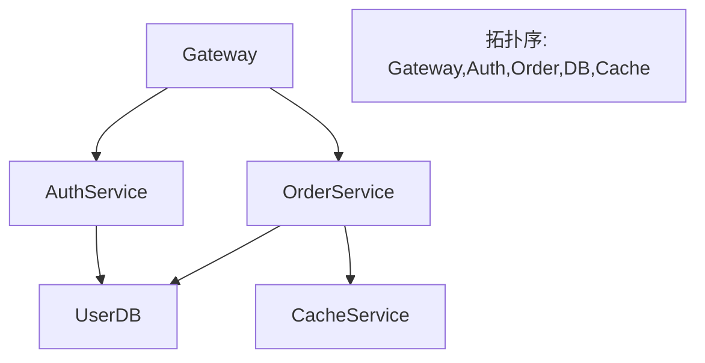
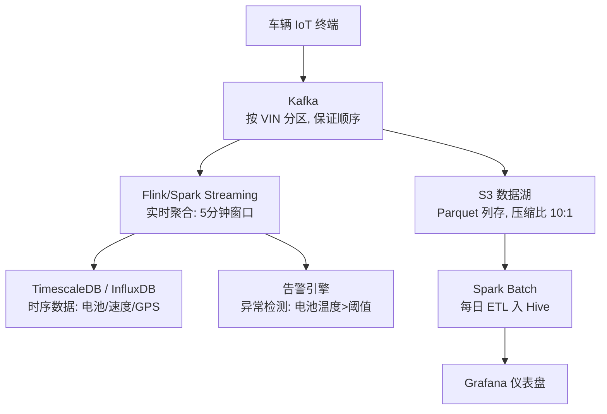
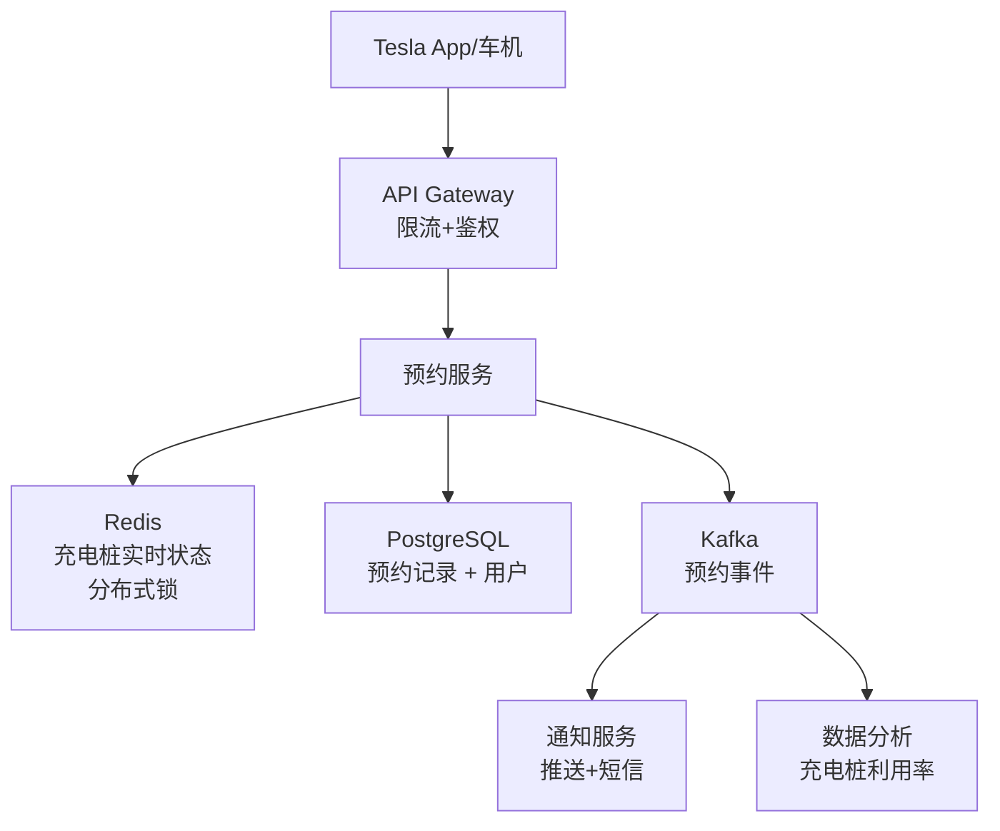
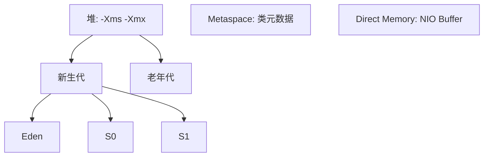
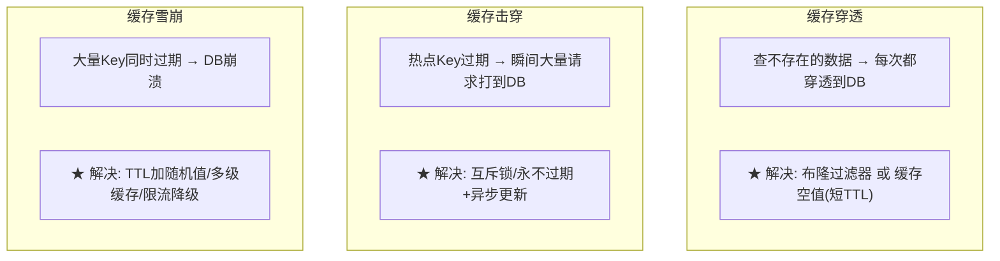

# Tesla 高级软件工程师 — 面试备考手册 (Java)

> 基于 Tesla 官方 JD 反向推导，覆盖算法、系统设计、Java 深度、分布式、行为面试。

---

## 目录

- [1. 算法高频题 (Tesla 风格)](#1-算法高频题-tesla-风格)
- [2. 系统设计](#2-系统设计)
- [3. Java 深度](#3-java-深度)
- [4. 分布式系统](#4-分布式系统)
- [5. 数据库](#5-数据库)
- [6. 行为面试](#6-行为面试)
- [7. 模拟面试题](#7-模拟面试题)

---

## 1. 算法高频题 (Tesla 风格)

Tesla 偏好**有实际工程场景**的算法题，不考偏题怪题。

### 1.1 滑动窗口 — 最长无重复子串

**场景**：车辆 VIN 码去重、日志分析

```java
public int lengthOfLongestSubstring(String s) {
    Map<Character, Integer> map = new HashMap<>();
    int L = 0, max = 0;
    for (int R = 0; R < s.length(); R++) {
        char c = s.charAt(R);
        if (map.containsKey(c) && map.get(c) >= L)
            L = map.get(c) + 1;
        map.put(c, R);
        max = Math.max(max, R - L + 1);
    }
    return max;
}
```

### 1.2 栈 — 基本计算器

**场景**：充电计费公式解析 `"(3+5)*2"`

```java
public int calculate(String s) {
    Deque<Integer> stack = new ArrayDeque<>();
    int num = 0, sign = 1, result = 0;
    for (char c : s.toCharArray()) {
        if (Character.isDigit(c)) num = num * 10 + (c - '0');
        else if (c == '+') { result += sign * num; num = 0; sign = 1; }
        else if (c == '-') { result += sign * num; num = 0; sign = -1; }
        else if (c == '(') { stack.push(result); stack.push(sign); result=0; sign=1; }
        else if (c == ')') { result += sign * num; num = 0;
            result *= stack.pop(); result += stack.pop(); }
    }
    return result + sign * num;
}
```

### 1.3 拓扑排序 — 服务依赖编排

**场景**：微服务有依赖关系，找启动顺序



```java
public int[] findOrder(int n, int[][] prerequisites) {
    int[] indegree = new int[n];
    List<Integer>[] graph = new ArrayList[n];
    for (int i = 0; i < n; i++) graph[i] = new ArrayList<>();
    for (int[] p : prerequisites) { graph[p[1]].add(p[0]); indegree[p[0]]++; }

    Queue<Integer> q = new LinkedList<>();
    for (int i = 0; i < n; i++) if (indegree[i] == 0) q.offer(i);

    int[] order = new int[n]; int idx = 0;
    while (!q.isEmpty()) {
        int u = q.poll(); order[idx++] = u;
        for (int v : graph[u]) if (--indegree[v] == 0) q.offer(v);
    }
    return idx == n ? order : new int[0];
}
```

### 1.4 DP — 编辑距离

**场景**：车辆配置 diff、固件版本差异比较

```java
public int minDistance(String a, String b) {
    int m = a.length(), n = b.length();
    int[][] dp = new int[m + 1][n + 1];
    for (int i = 0; i <= m; i++) dp[i][0] = i;
    for (int j = 0; j <= n; j++) dp[0][j] = j;
    for (int i = 1; i <= m; i++)
        for (int j = 1; j <= n; j++)
            dp[i][j] = a.charAt(i-1) == b.charAt(j-1) ? dp[i-1][j-1]
                     : 1 + Math.min(dp[i-1][j], Math.min(dp[i][j-1], dp[i-1][j-1]));
    return dp[m][n];
}
```

### 1.5 LRU Cache

**场景**：缓存最近访问的车辆配置、用户 session

```java
class LRUCache extends LinkedHashMap<Integer, Integer> {
    private final int cap;
    public LRUCache(int capacity) { super(capacity, 0.75f, true); cap = capacity; }
    protected boolean removeEldestEntry(Map.Entry<Integer,Integer> e) { return size() > cap; }
    public int get(int key) { return super.getOrDefault(key, -1); }
}
```

### 1.6 设计限流器 (Rate Limiter)

**场景**：API 网关限流，防止充电桩预约系统被刷爆

```java
// 滑动窗口限流 O(1)
class SlidingWindowRateLimiter {
    private final int maxRequests;
    private final long windowMs;
    private final Deque<Long> timestamps = new ArrayDeque<>();

    public SlidingWindowRateLimiter(int maxRequests, long windowMs) {
        this.maxRequests = maxRequests; this.windowMs = windowMs;
    }

    public synchronized boolean allow() {
        long now = System.currentTimeMillis();
        while (!timestamps.isEmpty() && now - timestamps.peekFirst() > windowMs)
            timestamps.pollFirst();
        if (timestamps.size() >= maxRequests) return false;
        timestamps.offerLast(now); return true;
    }
}
```

---

## 2. 系统设计

### 2.1 场景一：车辆数据采集管道

```
需求: 全球 500 万辆 Tesla, 每辆车每秒上报 100 个传感器数据点
      设计一个能实时处理 + 离线分析的数据管道
```



**关键决策**：

| 决策点 | 方案 | 理由 |
|--------|------|------|
| 消息队列 | **Kafka** | 百万 TPS 吞吐，按 VIN 分区保证单车数据有序 |
| 实时计算 | Flink | 状态管理优于 Spark Streaming，适合窗口聚合 |
| 时序存储 | **TimescaleDB** | PostgreSQL 扩展，SQL 兼容，比 InfluxDB 运维简单 |
| 数据压缩 | Parquet + Snappy | 列存压缩比 ~10x，S3 成本低 |

**容量估算**：
```
数据量: 5M 车 × 100 传感器 × 1/s = 500M 消息/秒
每条 1KB → 500 GB/s → 30 TB/分钟 → 43 PB/天

Kafka 分区: 500M ÷ 10K/分区 = 50000 分区, 50 台 broker
存储: Parquet 压缩后 ~4.3 PB/天, S3 月费 ~$100K
```

### 2.2 场景二：充电桩预约系统

```
需求: 全球充电桩, 用户预约时间段, 实时状态同步到车辆大屏
```



**并发冲突解决**：
```java
// 分布式锁: 同一个充电桩同一时间段只能一个人预约
public boolean reserveStation(String stationId, long start, long end, String userId) {
    String lockKey = "lock:station:" + stationId + ":" + start;
    String lockValue = UUID.randomUUID().toString();
    
    // ★ SET NX PX: 原子操作, 拿不到锁说明已被预约
    Boolean locked = redis.setIfAbsent(lockKey, lockValue, Duration.ofSeconds(30));
    if (!locked) return false;
    
    try {
        // 1. 检查时间段是否可用
        boolean available = db.countOverlap(stationId, start, end) == 0;
        if (!available) return false;
        // 2. 写入预约
        db.insertReservation(stationId, start, end, userId);
        // 3. 发 Kafka 事件 → 通知 + 分析
        kafka.send("reservation-events", new ReservationEvent(stationId, userId, start, end));
        return true;
    } finally {
        // ★ Lua 脚本释放锁: 只能删自己的锁
        redis.execute("if redis.call('get',KEYS[1])==ARGV[1] then return redis.call('del',KEYS[1]) else return 0 end",
            List.of(lockKey), lockValue);
    }
}
```

### 2.3 场景三：Feature Flag 灰度发布

```
需求: 新固件推送到指定 VIN 范围的车辆, 1%→10%→50%→100% 灰度
```

```java
// Feature Flag 服务核心
public class FeatureFlagService {
    private final Map<String, RolloutRule> rules = new ConcurrentHashMap<>();

    // 判断某 VIN 是否启用某功能
    public boolean isEnabled(String feature, String vin) {
        RolloutRule rule = rules.get(feature);
        if (rule == null) return false;

        // ★ 一致性哈希: 相同 VIN 永远路由到相同决定
        int hash = Math.abs(vin.hashCode()) % 100;
        return hash < rule.percentage;
    }

    // 灰度回滚 (秒级生效)
    public void rollback(String feature) {
        rules.remove(feature);
        // ★ 通知 Kafka → 车辆终端断开旧功能
        kafka.send("feature-flag-changes", new FeatureChange(feature, 0));
    }

    static class RolloutRule {
        String feature;
        int percentage;   // 0-100
        String minVersion; // 最低固件版本
    }
}
```

---

## 3. Java 深度

### 3.1 JVM 内存模型 — 生产 OOM 排查



**面试话术**：
> 线上遇到 OOM，先看是哪种：`Java heap space` → 用 MAT 分析堆 dump；`Metaspace` → 动态代理类过多；`Direct buffer` → Netty 未释放。Tesla 车辆数据量大，Metaspace OOM 常见于动态生成太多序列化类。

### 3.2 ConcurrentHashMap — 为什么使用它

```java
// JDK 8+ ConcurrentHashMap: CAS + synchronized 桶锁
// put() 流程:
// 1. key.hashCode() → spread() 扰动
// 2. (n-1) & hash → 定位桶
// 3. 桶为空 → CAS 直接插入 (★ 无锁!)
// 4. 桶非空 → synchronized 锁桶头节点 (★ 桶级锁粒度!)
// 5. 链表 > 8 → 转红黑树

// 面试话术:
// "ConcurrentHashMap 在 JDK 8 用 CAS+synchronized 实现了桶级锁。
//  相比 JDK 7 的 Segment 分段锁, 锁粒度从 16 个 Segment 细化到每个桶,
//  并发度提升 N/16 倍。读操作完全无锁 (volatile 保证可见性)。"
```

### 3.3 线程池 — 为什么禁止 Executors

```java
// ❌ Executors.newFixedThreadPool(10) → LinkedBlockingQueue(Integer.MAX_VALUE) → OOM!
// ❌ Executors.newCachedThreadPool() → 线程数 Integer.MAX_VALUE → OOM!

// ✅ 正确做法
ThreadPoolExecutor executor = new ThreadPoolExecutor(
    4,                          // corePoolSize
    8,                          // maxPoolSize
    60, TimeUnit.SECONDS,       // keepAlive
    new LinkedBlockingQueue<>(100),     // ★ 有界队列!
    new ThreadPoolExecutor.CallerRunsPolicy() // ★ 拒绝策略: 调用者执行
);

// 面试话术:
// "Executors 创建的线程池要么队列无界, 要么线程数无界。
//  生产环境必须用 ThreadPoolExecutor 显式指定所有参数,
//  尤其是有界队列 + 合理的拒绝策略。CallerRunsPolicy
//  让调用者自己执行, 自然形成背压。"
```

### 3.4 @Transactional 失效场景

```java
// ★ 自调用失效 — Tesla 面试高频!
@Service
public class VehicleService {
    @Transactional
    public void updateFirmware(Vehicle v) {
        // ❌ this 不是代理! 事务不生效!
        this.logUpdate(v);
    }

    @Transactional(propagation = Propagation.REQUIRES_NEW)
    public void logUpdate(Vehicle v) { /* ... */ }
}

// ✅ 解决方案:
// 1. 注入自己: @Autowired VehicleService self; self.logUpdate(v)
// 2. 拆 Service
// 3. AopContext.currentProxy()
```

---

## 4. 分布式系统

### 4.1 Kafka — 消息可靠性的三个保证

```java
// Producer: acks=all + retries + idempotent
Properties props = new Properties();
props.put("acks", "all");              // ★ 所有 ISR 副本确认
props.put("retries", 10);              // 重试
props.put("enable.idempotence", true); // ★ 幂等性: 防止重复

// Consumer: 手动提交 offset
props.put("enable.auto.commit", "false"); // ★ 手动提交!
consumer.subscribe(List.of("vehicle-telemetry"));
while (true) {
    ConsumerRecords<String, String> records = consumer.poll(Duration.ofMillis(100));
    for (ConsumerRecord<String, String> r : records) {
        processRecord(r);  // 业务处理
    }
    consumer.commitSync(); // ★ 处理完再提交
}
```

**面试话术**：
> "Kafka 的 exactly-once 需要 Producer 幂等 + Consumer 事务 + 手动提交 offset。Tesla 车辆数据场景下，丢失一条传感器数据比重复一条严重得多，所以用 `acks=all` + 手动提交保证至少一次，业务端做幂等去重。"

### 4.2 Redis — 缓存三大问题



```java
// 缓存击穿: 互斥锁方案
public Vehicle getVehicle(String vin) {
    String key = "vehicle:" + vin;
    Vehicle cached = redis.get(key);
    if (cached != null) return cached;

    // ★ 分布式锁: 只让一个人去查 DB
    String lockKey = "lock:" + key;
    if (redis.setIfAbsent(lockKey, "1", Duration.ofSeconds(10))) {
        try {
            Vehicle v = db.findById(vin);
            redis.set(key, v, Duration.ofMinutes(30));
            return v;
        } finally {
            redis.delete(lockKey);
        }
    }
    // 没抢到锁 → 等一会重试
    Thread.sleep(100);
    return getVehicle(vin);
}
```

### 4.3 Kubernetes — Pod 健康检查

```yaml
# Tesla 微服务的 K8s 配置
apiVersion: v1
kind: Pod
spec:
  containers:
  - name: vehicle-service
    image: tesla/vehicle-service:v2.1
    livenessProbe:    # ★ 活下来没? 挂了→重启
      httpGet:
        path: /health/live
        port: 8080
      initialDelaySeconds: 30
      periodSeconds: 10
    readinessProbe:   # ★ 能接流量吗? 未就绪→摘除
      httpGet:
        path: /health/ready
        port: 8080
      initialDelaySeconds: 5
      periodSeconds: 5
    resources:
      requests:  { memory: "512Mi", cpu: "500m" }
      limits:    { memory: "1Gi",   cpu: "1000m" }
```

---

## 5. 数据库

### 5.1 慢查询优化

```sql
-- 场景: 查询某车辆过去 30 天的电池数据
-- ❌ 慢 SQL (全表扫描)
SELECT * FROM battery_logs
WHERE vin = '5YJ3E1EA1LF000001'
  AND recorded_at > NOW() - INTERVAL 30 DAY;

-- ✅ 优化: 联合索引 + 覆盖索引
CREATE INDEX idx_vin_time ON battery_logs(vin, recorded_at);

-- 如果只需要电池容量, 用覆盖索引避免回表
CREATE INDEX idx_vin_time_capacity ON battery_logs(vin, recorded_at, capacity);

SELECT capacity, recorded_at FROM battery_logs
WHERE vin = '5YJ3E1EA1LF000001'
  AND recorded_at > NOW() - INTERVAL 30 DAY;
-- ★ Extra: Using index (覆盖索引, 不回表!)
```

### 5.2 分库分表策略

```
场景: 500 万辆车的传感器数据, 单表无法承受

方案: 按 VIN 哈希分 64 个库, 每个库 16 张表

Sharding Key = hash(VIN) % 1024
  → vehicle_telemetry_{shard % 64}.battery_logs_{(shard / 64) % 16}

查询优化:
  - 按 VIN 查: 直接路由到一个分片, O(1)
  - 按时间查: 广播到所有分片 → Merge, O(n) ⚠️
```

---

## 6. 行为面试

### 6.1 Tesla 必问五题 + STAR 模板

| 问题 | STAR 模板 |
|------|----------|
| "Tell me about a time you delivered under tight deadline" | **S**: 项目背景; **T**: 截止日期多紧; **A**: 你做了技术决策/协调; **R**: 结果(最好有数据) |
| "Describe a production incident you handled" | **S**: 什么故障; **T**: 影响面多大; **A**: 你排查+修复的步骤; **R**: 学到什么, 做了什么防止复发 |
| "How do you work with non-engineering teams?" | **S**: 跨部门项目; **T**: 沟通障碍; **A**: 你怎么翻译技术→业务; **R**: 对方满意 |
| "Most complex system you designed?" | **S**: 业务需求; **T**: 技术挑战; **A**: 设计决策+权衡; **R**: 上线效果 |
| "Why Tesla?" | ★ 必须提到可持续能源, 不是"因为工资高" |

### 6.2 "Why Tesla?" 回答模板

```
"我关注 Tesla 不是因为它是车企, 而是因为它是唯一一个
把软件、硬件、能源整合成一个闭环的公司。我做后端,
但我的代码会影响真实的物理世界——充电桩能不能用、
Autopilot 的数据能不能实时处理。

我过去在 [X公司] 做了 [分布式系统/高并发/性能优化],
这些经验可以直接用于 Tesla 的 [车辆数据管道/充电桩系统/工厂软件]。
"
```

---

## 7. 模拟面试题

### 7.1 Coding (45 分钟)

**题目**: 设计一个充电桩使用率统计系统。实现两个方法：
- `void recordCharge(String stationId, long startMs, long endMs)` — 记录一次充电
- `double getUtilization(String stationId, long fromMs, long toMs)` — 查询利用率

**要求**：一秒内查询任意时间段利用率，处理 10000 个充电桩每秒 1000 次充电记录。

```java
// ★ 思路: 前缀和 + 时间分桶
class ChargeUtilizationTracker {
    // key: stationId, value: 每分钟的充电分钟数 (前缀和)
    private final Map<String, List<Integer>> prefixSum = new ConcurrentHashMap<>();
    private static final long MINUTE_MS = 60_000;

    public void recordCharge(String stationId, long startMs, long endMs) {
        int startMin = (int)(startMs / MINUTE_MS);
        int endMin = (int)(endMs / MINUTE_MS);
        // 简化: 在线程内维护, 生产用 Redis Sorted Set
        prefixSum.computeIfAbsent(stationId, k -> new ArrayList<>());
        List<Integer> ps = prefixSum.get(stationId);
        // ★ 填充缺失的分钟 (稀疏 → 补0)
        while (ps.size() <= endMin) ps.add(ps.isEmpty() ? 0 : ps.get(ps.size() - 1));
        for (int m = startMin; m <= endMin; m++) ps.set(m, ps.get(m) + 1);
    }

    public double getUtilization(String stationId, long fromMs, long toMs) {
        int fromMin = (int)(fromMs / MINUTE_MS);
        int toMin = (int)(toMs / MINUTE_MS);
        List<Integer> ps = prefixSum.get(stationId);
        if (ps == null || toMin >= ps.size()) return 0.0;
        int chargedMinutes = ps.get(toMin) - (fromMin > 0 ? ps.get(fromMin - 1) : 0);
        return (double) chargedMinutes / (toMin - fromMin + 1);
    }
}
```

### 7.2 系统设计 (60 分钟)

**题目**: 设计 Tesla 的 OTA (Over-The-Air) 固件更新系统

**要点**：
1. 全球推送, 分地区灰度
2. 车辆在 WiFi + 电量 > 50% 时下载
3. 支持断点续传 + 校验和
4. 回滚机制

**你的回答应包含**：
- 架构图（CDN + Kafka + 车辆终端）
- 数据库设计（固件版本表、推送任务表、车辆更新状态表）
- 灰度策略（一致性哈希 VIN % 100）
- 故障处理（下载失败重试、安装失败回滚）

---

*基于 Tesla 官方 JD 编写，覆盖算法、系统设计、Java 深度、分布式、行为面试。*
